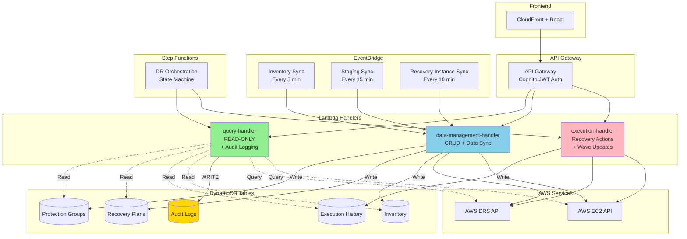

# Architecture Diagrams

## Overview

This document provides Mermaid diagrams illustrating the refactored handler architecture, dual invocation modes, and data flow patterns in the DR Orchestration Platform.

## Handler Responsibility Architecture

## Dual Invocation Mode Architecture

## Wave Polling Flow (Refactored)

## EventBridge Sync Operations Flow

## Cross-Account Audit Trail

## IAM Principal Extraction Flow

## RBAC Permission Enforcement

## Parameter Masking Flow

## Audit Error Handling Flow

## Related Documentation

- [Handler Responsibilities](HANDLER_RESPONSIBILITIES.md)
- [Dual Invocation Mode Architecture](DUAL_INVOCATION_MODE.md)
- [IAM Principal Extraction](../security/IAM_PRINCIPAL_EXTRACTION.md)
- [RBAC Permissions](../security/RBAC_PERMISSIONS.md)
- [Audit Log Schema](../security/AUDIT_LOG_SCHEMA.md)
- [Deployment Guide](../guides/DEPLOYMENT_GUIDE.md)
