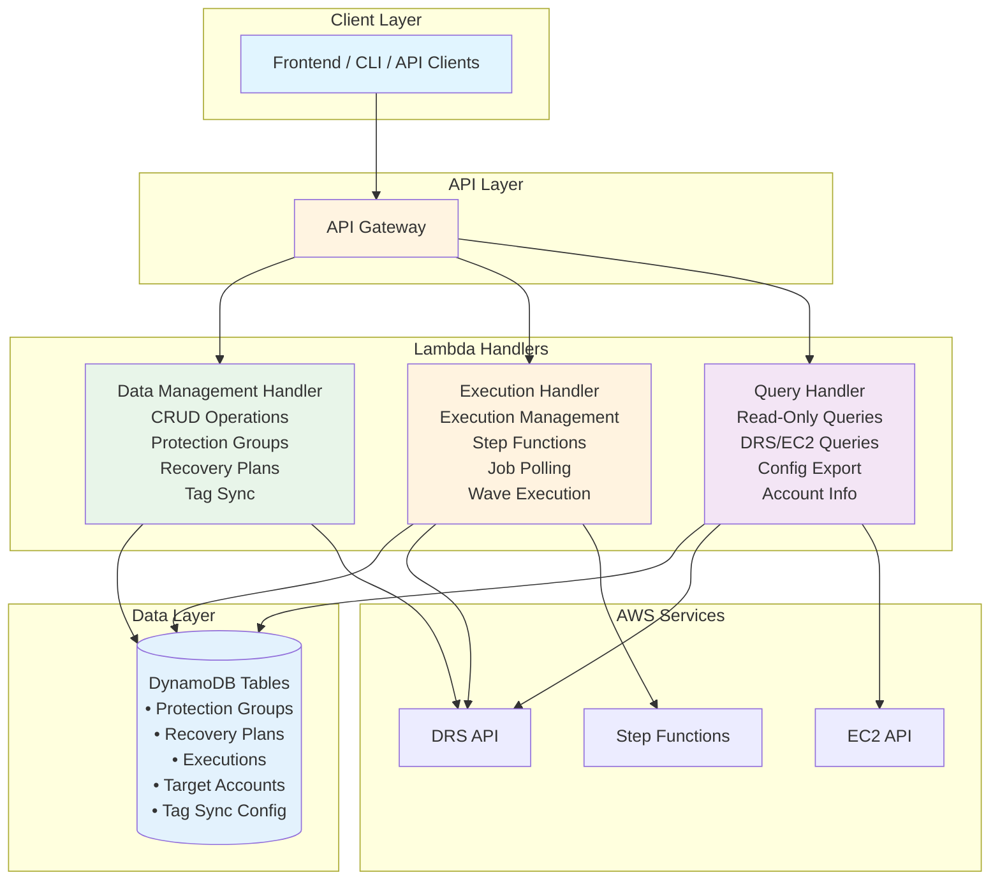
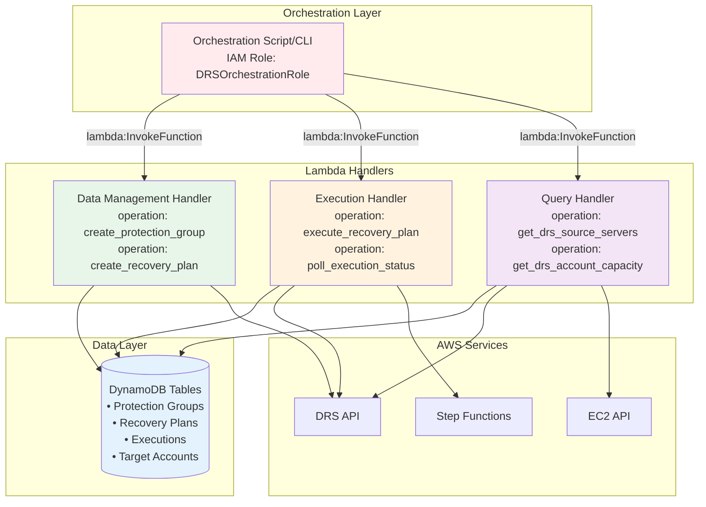
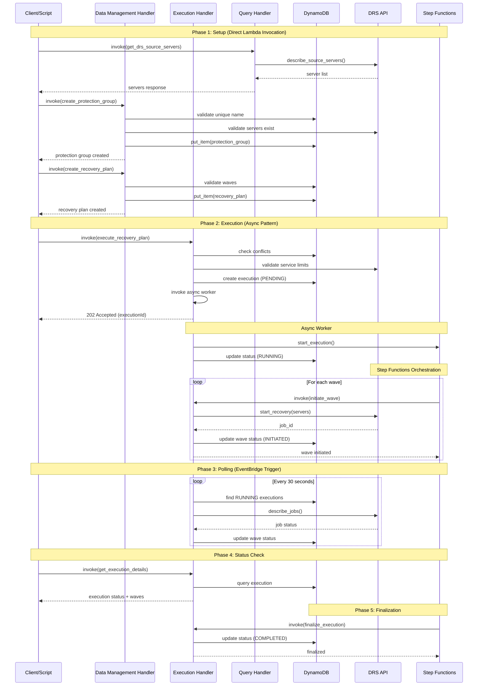
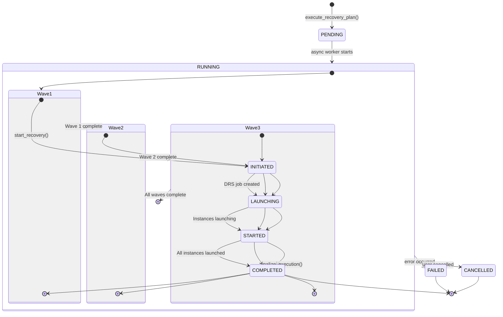

# AWS DRS Orchestration - Lambda Handlers Architecture

## Overview

The DR Orchestration Platform consists of three primary Lambda handlers that work together to provide complete disaster recovery orchestration capabilities. Each handler has a specific responsibility and supports dual invocation patterns (API Gateway + Direct Lambda).

## Architecture Diagrams

### With API Gateway and Frontend (Full Stack)



### Direct Lambda Invocation (Backend-Only Mode)



## Execution Workflow Diagrams

### Full Execution Flow (Sequence Diagram)



### Wave Execution State Machine




## Direct Lambda Invocation Examples

When deploying without API Gateway and Frontend, you can invoke Lambda functions directly using AWS CLI, SDKs, or custom scripts. This section provides comprehensive examples using the orchestration role created by the master CloudFormation template.

### IAM Role Configuration (from master-template.yaml)

The master CloudFormation template creates an orchestration role for direct Lambda invocations:

```yaml
# From cfn/master-template.yaml
DRSOrchestrationRole:
  Type: AWS::IAM::Role
  Properties:
    RoleName: !Sub '${ProjectName}-orchestration-role-${Environment}'
    AssumeRolePolicyDocument:
      Version: '2012-10-17'
      Statement:
        - Effect: Allow
          Principal:
            Service: lambda.amazonaws.com
          Action: sts:AssumeRole
        - Effect: Allow
          Principal:
            AWS: !Sub 'arn:aws:iam::${AWS::AccountId}:root'
          Action: sts:AssumeRole
    ManagedPolicyArns:
      - arn:aws:iam::aws:policy/service-role/AWSLambdaBasicExecutionRole
    Policies:
      - PolicyName: LambdaInvocationPolicy
        PolicyDocument:
          Version: '2012-10-17'
          Statement:
            - Effect: Allow
              Action:
                - lambda:InvokeFunction
              Resource:
                - !GetAtt DataManagementHandler.Arn
                - !GetAtt ExecutionHandler.Arn
                - !GetAtt QueryHandler.Arn
            - Effect: Allow
              Action:
                - dynamodb:GetItem
                - dynamodb:PutItem
                - dynamodb:UpdateItem
                - dynamodb:Query
                - dynamodb:Scan
              Resource:
                - !GetAtt ProtectionGroupsTable.Arn
                - !GetAtt RecoveryPlansTable.Arn
                - !GetAtt ExecutionHistoryTable.Arn
            - Effect: Allow
              Action:
                - drs:DescribeSourceServers
                - drs:StartRecovery
                - drs:DescribeJobs
              Resource: '*'
```

### Example 1: Create Protection Group (Direct Invocation)

```bash
# Using AWS CLI with orchestration role
aws lambda invoke \
  --function-name hrp-drs-tech-adapter-data-management-handler-dev \
  --invocation-type RequestResponse \
  --payload '{
    "operation": "create_protection_group",
    "body": {
      "groupName": "Production Web Servers",
      "region": "us-east-1",
      "sourceServerIds": ["s-1234567890abcdef0", "s-abcdef1234567890"],
      "description": "Production web tier servers"
    }
  }' \
  response.json

# Response
cat response.json
{
  "groupId": "a1b2c3d4-e5f6-7890-abcd-ef1234567890",
  "groupName": "Production Web Servers",
  "region": "us-east-1",
  "sourceServerIds": ["s-1234567890abcdef0", "s-abcdef1234567890"],
  "createdDate": 1706745600,
  "version": 1
}
```

### Example 2: Create Recovery Plan (Direct Invocation)

```bash
# Create recovery plan with multiple waves
aws lambda invoke \
  --function-name hrp-drs-tech-adapter-data-management-handler-dev \
  --invocation-type RequestResponse \
  --payload '{
    "operation": "create_recovery_plan",
    "body": {
      "planName": "Production DR Plan",
      "description": "Multi-wave production recovery",
      "waves": [
        {
          "waveNumber": 1,
          "waveName": "Database Tier",
          "protectionGroupId": "a1b2c3d4-e5f6-7890-abcd-ef1234567890"
        },
        {
          "waveNumber": 2,
          "waveName": "Application Tier",
          "protectionGroupId": "b2c3d4e5-f6a7-8901-bcde-f12345678901",
          "dependsOnWaves": [1]
        },
        {
          "waveNumber": 3,
          "waveName": "Web Tier",
          "protectionGroupId": "c3d4e5f6-a7b8-9012-cdef-123456789012",
          "dependsOnWaves": [2]
        }
      ]
    }
  }' \
  response.json

# Response
cat response.json
{
  "planId": "d4e5f6a7-b8c9-0123-def1-234567890123",
  "planName": "Production DR Plan",
  "waves": [...],
  "createdDate": 1706745600,
  "version": 1
}
```

### Example 3: Query DRS Source Servers (Direct Invocation)

```bash
# Query DRS source servers in region
aws lambda invoke \
  --function-name hrp-drs-tech-adapter-query-handler-dev \
  --invocation-type RequestResponse \
  --payload '{
    "operation": "get_drs_source_servers",
    "queryParams": {
      "region": "us-east-1"
    }
  }' \
  response.json

# Response
cat response.json
{
  "servers": [
    {
      "sourceServerID": "s-1234567890abcdef0",
      "hostname": "web-server-01",
      "replicationState": "CONTINUOUS",
      "lifecycleState": "READY_FOR_LAUNCH",
      "hardware": {
        "totalCores": 4,
        "ramGiB": 16,
        "totalDiskGiB": 100
      }
    }
  ],
  "serverCount": 1,
  "region": "us-east-1"
}
```

### Example 4: Execute Recovery Plan (Direct Invocation)

```bash
# Start recovery plan execution
aws lambda invoke \
  --function-name hrp-drs-tech-adapter-execution-handler-dev \
  --invocation-type RequestResponse \
  --payload '{
    "operation": "execute_recovery_plan",
    "body": {
      "planId": "d4e5f6a7-b8c9-0123-def1-234567890123",
      "executionType": "DRILL",
      "initiatedBy": "automation-script"
    }
  }' \
  response.json

# Response (202 Accepted - async execution)
cat response.json
{
  "executionId": "e5f6a7b8-c9d0-1234-ef12-345678901234",
  "status": "PENDING",
  "message": "Execution started - check status with operation: get_execution_details",
  "statusUrl": "/executions/e5f6a7b8-c9d0-1234-ef12-345678901234"
}
```

### Example 5: Poll Execution Status (Direct Invocation)

```bash
# Check execution status
aws lambda invoke \
  --function-name hrp-drs-tech-adapter-execution-handler-dev \
  --invocation-type RequestResponse \
  --payload '{
    "operation": "get_execution_details",
    "body": {
      "executionId": "e5f6a7b8-c9d0-1234-ef12-345678901234"
    }
  }' \
  response.json

# Response
cat response.json
{
  "executionId": "e5f6a7b8-c9d0-1234-ef12-345678901234",
  "planId": "d4e5f6a7-b8c9-0123-def1-234567890123",
  "planName": "Production DR Plan",
  "status": "RUNNING",
  "executionType": "DRILL",
  "startTime": 1706745600,
  "waves": [
    {
      "waveNumber": 1,
      "waveName": "Database Tier",
      "status": "COMPLETED",
      "jobId": "drsjob-1234567890abcdef",
      "servers": [
        {
          "sourceServerId": "s-1234567890abcdef0",
          "status": "LAUNCHED",
          "instanceId": "i-0abcdef1234567890"
        }
      ]
    },
    {
      "waveNumber": 2,
      "waveName": "Application Tier",
      "status": "IN_PROGRESS",
      "jobId": "drsjob-abcdef1234567890"
    }
  ]
}
```

### Example 6: Python Orchestration Script

```python
#!/usr/bin/env python3
"""
Direct Lambda orchestration example
Assumes DRSOrchestrationRole for Lambda invocations
"""

import boto3
import json
import time

# Initialize Lambda client
lambda_client = boto3.client('lambda')

# Function names from CloudFormation stack
DATA_MGMT_FUNCTION = 'hrp-drs-tech-adapter-data-management-handler-dev'
EXECUTION_FUNCTION = 'hrp-drs-tech-adapter-execution-handler-dev'
QUERY_FUNCTION = 'hrp-drs-tech-adapter-query-handler-dev'

def invoke_lambda(function_name, operation, body=None, query_params=None):
    """Invoke Lambda function with operation-based routing"""
    payload = {
        'operation': operation
    }
    if body:
        payload['body'] = body
    if query_params:
        payload['queryParams'] = query_params
    
    response = lambda_client.invoke(
        FunctionName=function_name,
        InvocationType='RequestResponse',
        Payload=json.dumps(payload)
    )
    
    return json.loads(response['Payload'].read())

# Step 1: Query available DRS servers
print("Step 1: Querying DRS source servers...")
servers_response = invoke_lambda(
    QUERY_FUNCTION,
    'get_drs_source_servers',
    query_params={'region': 'us-east-1'}
)
print(f"Found {servers_response['serverCount']} servers")

# Step 2: Create Protection Group
print("\nStep 2: Creating Protection Group...")
server_ids = [s['sourceServerID'] for s in servers_response['servers'][:5]]
pg_response = invoke_lambda(
    DATA_MGMT_FUNCTION,
    'create_protection_group',
    body={
        'groupName': 'Automated Protection Group',
        'region': 'us-east-1',
        'sourceServerIds': server_ids,
        'description': 'Created by automation script'
    }
)
protection_group_id = pg_response['groupId']
print(f"Created Protection Group: {protection_group_id}")

# Step 3: Create Recovery Plan
print("\nStep 3: Creating Recovery Plan...")
plan_response = invoke_lambda(
    DATA_MGMT_FUNCTION,
    'create_recovery_plan',
    body={
        'planName': 'Automated Recovery Plan',
        'description': 'Single-wave recovery plan',
        'waves': [
            {
                'waveNumber': 1,
                'waveName': 'Primary Wave',
                'protectionGroupId': protection_group_id
            }
        ]
    }
)
plan_id = plan_response['planId']
print(f"Created Recovery Plan: {plan_id}")

# Step 4: Execute Recovery Plan
print("\nStep 4: Starting Recovery Plan Execution...")
exec_response = invoke_lambda(
    EXECUTION_FUNCTION,
    'execute_recovery_plan',
    body={
        'planId': plan_id,
        'executionType': 'DRILL',
        'initiatedBy': 'automation-script'
    }
)
execution_id = exec_response['executionId']
print(f"Started Execution: {execution_id}")
print(f"Status: {exec_response['status']}")

# Step 5: Poll execution status
print("\nStep 5: Polling execution status...")
max_polls = 60  # 30 minutes max (30s intervals)
for i in range(max_polls):
    time.sleep(30)  # Wait 30 seconds between polls
    
    status_response = invoke_lambda(
        EXECUTION_FUNCTION,
        'get_execution_details',
        body={'executionId': execution_id}
    )
    
    status = status_response['status']
    print(f"Poll {i+1}: Status = {status}")
    
    if status in ['COMPLETED', 'FAILED', 'CANCELLED']:
        print(f"\nExecution finished with status: {status}")
        break
    
    # Show wave progress
    for wave in status_response.get('waves', []):
        wave_status = wave.get('status', 'UNKNOWN')
        print(f"  Wave {wave['waveNumber']}: {wave_status}")

print("\nOrchestration complete!")
```

### Example 7: Bash Orchestration Script

```bash
#!/bin/bash
# Direct Lambda orchestration example
# Requires: aws-cli, jq

set -e

# Function names from CloudFormation stack
DATA_MGMT_FUNCTION="hrp-drs-tech-adapter-data-management-handler-dev"
EXECUTION_FUNCTION="hrp-drs-tech-adapter-execution-handler-dev"
QUERY_FUNCTION="hrp-drs-tech-adapter-query-handler-dev"

# Helper function to invoke Lambda
invoke_lambda() {
    local function_name=$1
    local payload=$2
    
    aws lambda invoke \
        --function-name "$function_name" \
        --invocation-type RequestResponse \
        --payload "$payload" \
        response.json > /dev/null
    
    cat response.json
    rm response.json
}

# Step 1: Query DRS servers
echo "Step 1: Querying DRS source servers..."
SERVERS=$(invoke_lambda "$QUERY_FUNCTION" '{
    "operation": "get_drs_source_servers",
    "queryParams": {"region": "us-east-1"}
}')

SERVER_COUNT=$(echo "$SERVERS" | jq -r '.serverCount')
echo "Found $SERVER_COUNT servers"

# Step 2: Create Protection Group
echo -e "\nStep 2: Creating Protection Group..."
SERVER_IDS=$(echo "$SERVERS" | jq -c '[.servers[0:5][].sourceServerID]')

PG_RESPONSE=$(invoke_lambda "$DATA_MGMT_FUNCTION" "{
    \"operation\": \"create_protection_group\",
    \"body\": {
        \"groupName\": \"Automated Protection Group\",
        \"region\": \"us-east-1\",
        \"sourceServerIds\": $SERVER_IDS,
        \"description\": \"Created by automation script\"
    }
}")

PG_ID=$(echo "$PG_RESPONSE" | jq -r '.groupId')
echo "Created Protection Group: $PG_ID"

# Step 3: Create Recovery Plan
echo -e "\nStep 3: Creating Recovery Plan..."
PLAN_RESPONSE=$(invoke_lambda "$DATA_MGMT_FUNCTION" "{
    \"operation\": \"create_recovery_plan\",
    \"body\": {
        \"planName\": \"Automated Recovery Plan\",
        \"description\": \"Single-wave recovery plan\",
        \"waves\": [
            {
                \"waveNumber\": 1,
                \"waveName\": \"Primary Wave\",
                \"protectionGroupId\": \"$PG_ID\"
            }
        ]
    }
}")

PLAN_ID=$(echo "$PLAN_RESPONSE" | jq -r '.planId')
echo "Created Recovery Plan: $PLAN_ID"

# Step 4: Execute Recovery Plan
echo -e "\nStep 4: Starting Recovery Plan Execution..."
EXEC_RESPONSE=$(invoke_lambda "$EXECUTION_FUNCTION" "{
    \"operation\": \"execute_recovery_plan\",
    \"body\": {
        \"planId\": \"$PLAN_ID\",
        \"executionType\": \"DRILL\",
        \"initiatedBy\": \"automation-script\"
    }
}")

EXEC_ID=$(echo "$EXEC_RESPONSE" | jq -r '.executionId')
EXEC_STATUS=$(echo "$EXEC_RESPONSE" | jq -r '.status')
echo "Started Execution: $EXEC_ID"
echo "Status: $EXEC_STATUS"

# Step 5: Poll execution status
echo -e "\nStep 5: Polling execution status..."
MAX_POLLS=60  # 30 minutes max

for ((i=1; i<=MAX_POLLS; i++)); do
    sleep 30  # Wait 30 seconds between polls
    
    STATUS_RESPONSE=$(invoke_lambda "$EXECUTION_FUNCTION" "{
        \"operation\": \"get_execution_details\",
        \"body\": {\"executionId\": \"$EXEC_ID\"}
    }")
    
    STATUS=$(echo "$STATUS_RESPONSE" | jq -r '.status')
    echo "Poll $i: Status = $STATUS"
    
    # Check if execution finished
    if [[ "$STATUS" == "COMPLETED" ]] || [[ "$STATUS" == "FAILED" ]] || [[ "$STATUS" == "CANCELLED" ]]; then
        echo -e "\nExecution finished with status: $STATUS"
        break
    fi
    
    # Show wave progress
    echo "$STATUS_RESPONSE" | jq -r '.waves[] | "  Wave \(.waveNumber): \(.status)"'
done

echo -e "\nOrchestration complete!"
```


**Purpose**: CRUD operations for Protection Groups, Recovery Plans, and configuration

**Invocation Patterns**:
- API Gateway: REST endpoints for frontend
- Direct Lambda: Step Functions orchestration
- AWS CLI: Direct invocation

### Key Responsibilities

1. **Protection Groups Management** (6 operations)
   - Create/Read/Update/Delete protection groups
   - Resolve tag-based server selection
   - Validate server assignments and conflicts
   - Check replication health

2. **Recovery Plans Management** (5 operations)
   - Create/Read/Update/Delete recovery plans
   - Validate wave configuration
   - Check for active executions
   - Manage plan dependencies

3. **Tag Synchronization** (2 operations)
   - Sync EC2 tags to DRS source servers
   - Manage tag sync configuration
   - Handle tag-based server discovery

4. **Configuration Management** (1 operation)
   - Import/export protection groups and recovery plans
   - Validate manifest files
   - Generate validation reports

### API Endpoints

```
Protection Groups:
  GET    /protection-groups              → list_protection_groups()
  POST   /protection-groups              → create_protection_group()
  GET    /protection-groups/{id}         → get_protection_group()
  PUT    /protection-groups/{id}         → update_protection_group()
  DELETE /protection-groups/{id}         → delete_protection_group()
  POST   /protection-groups/resolve      → resolve_protection_group_tags()

Recovery Plans:
  GET    /recovery-plans                 → list_recovery_plans()
  POST   /recovery-plans                 → create_recovery_plan()
  GET    /recovery-plans/{id}            → get_recovery_plan()
  PUT    /recovery-plans/{id}            → update_recovery_plan()
  DELETE /recovery-plans/{id}            → delete_recovery_plan()

Tag Sync & Config:
  POST   /drs/tag-sync                   → handle_drs_tag_sync()
  GET    /config/tag-sync                → get_tag_sync_settings()
  PUT    /config/tag-sync                → update_tag_sync_settings()
  POST   /config/import                  → import_configuration()

Target Accounts:
  GET    /accounts/targets               → list_target_accounts()
  POST   /accounts/targets               → create_target_account()
  GET    /accounts/targets/{id}          → get_target_account()
  PUT    /accounts/targets/{id}          → update_target_account()
  DELETE /accounts/targets/{id}          → delete_target_account()
```

### DynamoDB Tables Used

| Table | Primary Key | Purpose |
|-------|------------|---------|
| `PROTECTION_GROUPS_TABLE` | `groupId` | Stores protection group definitions |
| `RECOVERY_PLANS_TABLE` | `planId` | Stores recovery plan configurations |
| `EXECUTION_HISTORY_TABLE` | `executionId` | Tracks execution history (shared) |
| `TARGET_ACCOUNTS_TABLE` | `accountId` | Cross-account role mappings |
| `TAG_SYNC_CONFIG_TABLE` | `configId` | Tag synchronization settings |

### Key Validation Logic

1. **Unique Name Validation** (case-insensitive)
   - Protection groups: `validate_unique_pg_name()`
   - Recovery plans: `validate_unique_rp_name()`

2. **Server Conflict Detection**
   - Check if servers already assigned to other groups
   - Validate no overlapping executions
   - Check DRS replication health

3. **Wave Configuration Validation**
   - Max 100 servers per wave (DRS limit)
   - No circular dependencies
   - All protection groups exist

### Cross-Account Support

- Assumes `DRSOrchestrationCrossAccountRole` in spoke accounts
- Stores account context in protection groups
- Validates cross-account access before operations

---

## Handler 2: Execution Handler (5,826 lines)

**Purpose**: Manage DRS recovery plan execution lifecycle

**Invocation Patterns**:
- API Gateway: REST endpoints for frontend
- Direct Lambda: EventBridge scheduled polling
- Step Functions: Orchestration callbacks

### Key Responsibilities

1. **Execution Lifecycle Management** (6 operations)
   - Start recovery plan execution
   - List active executions
   - Get execution details
   - Cancel/pause/resume executions
   - Poll execution status
   - Finalize completed executions

2. **Wave Execution Orchestration**
   - Coordinate multi-wave execution via Step Functions
   - Manage wave sequencing
   - Track wave status and progress
   - Handle wave failures and retries

3. **DRS Job Management**
   - Create DRS recovery jobs
   - Monitor job status
   - Handle job failures
   - Manage recovery instances

4. **Conflict Detection & Validation**
   - Check server conflicts with active executions
   - Validate DRS service limits
   - Verify replication health
   - Prevent concurrent plan executions

### API Endpoints

```
Execution Management:
  POST   /executions                     → execute_recovery_plan()
  GET    /executions                     → list_executions()
  GET    /executions/{id}                → get_execution_details()
  POST   /executions/{id}/cancel         → cancel_execution()
  POST   /executions/{id}/pause          → pause_execution()
  POST   /executions/{id}/resume         → resume_execution()

Execution Status:
  GET    /executions/{id}/status         → get_execution_status()
  GET    /executions/{id}/waves          → get_execution_waves()
  GET    /executions/{id}/jobs           → get_execution_jobs()
```

### Execution Workflow

```
1. execute_recovery_plan() [API Gateway]
   ├─ Validate plan exists
   ├─ Check server conflicts
   ├─ Validate DRS service limits
   ├─ Create execution record (PENDING)
   └─ Invoke async worker

2. execute_recovery_plan_worker() [Async Lambda]
   ├─ Start Step Functions execution
   └─ Update execution status (RUNNING)

3. Step Functions State Machine
   ├─ Wave 1: Create DRS job → Monitor → Complete
   ├─ Wave 2: Create DRS job → Monitor → Complete
   └─ Wave N: Create DRS job → Monitor → Complete

4. Polling Loop (EventBridge 30s interval)
   ├─ find_polling_executions()
   ├─ poll_execution_status()
   ├─ Update wave status
   └─ Finalize when complete

5. finalize_execution()
   ├─ Mark execution COMPLETED/FAILED
   ├─ Record end time
   └─ Clean up resources
```

### DynamoDB Tables Used

| Table | Primary Key | Purpose |
|-------|------------|---------|
| `EXECUTION_HISTORY_TABLE` | `executionId` | Execution state and history |
| `RECOVERY_PLANS_TABLE` | `planId` | Plan details (read-only) |
| `PROTECTION_GROUPS_TABLE` | `groupId` | Group details (read-only) |

### DRS Service Limits Validated

```python
DRS_LIMITS = {
    "MAX_SERVERS_PER_JOB": 100,           # Wave size limit
    "MAX_CONCURRENT_JOBS": 20,            # Active jobs per region
    "MAX_SERVERS_IN_ALL_JOBS": 500,       # Total servers across jobs
    "MAX_RECOVERY_INSTANCES": 4000,       # Total recovery instances
}
```

### Validation Functions

1. **Wave Size Validation**
   - `validate_wave_sizes()`: Max 100 servers per wave

2. **Concurrent Jobs Validation**
   - `validate_concurrent_jobs()`: Max 20 active DRS jobs

3. **Servers in Jobs Validation**
   - `validate_servers_in_all_jobs()`: Max 500 servers across all jobs

4. **Replication Health Validation**
   - `validate_server_replication_states()`: All servers HEALTHY

5. **Conflict Detection**
   - `check_server_conflicts()`: No overlapping executions or DRS jobs

### Step Functions Integration

- **State Machine ARN**: Configured via environment variable
- **Execution Pattern**: Async with polling
- **Wave Orchestration**: Sequential wave execution
- **Status Tracking**: DynamoDB updates from Step Functions

---

## Handler 3: Query Handler (4,755 lines)

**Purpose**: Read-only queries for DRS/EC2 infrastructure and configuration

**Invocation Patterns**:
- API Gateway: REST endpoints for frontend
- Direct Lambda: Step Functions queries
- AWS CLI: Direct invocation

### Key Responsibilities

1. **DRS Infrastructure Queries** (4 operations)
   - List DRS source servers with filtering
   - Get DRS service quotas and limits
   - Query DRS account capacity
   - List DRS-enabled accounts

2. **EC2 Resource Queries** (4 operations)
   - List EC2 subnets in VPC
   - List EC2 security groups
   - List available EC2 instance types
   - List IAM instance profiles

3. **Account Information** (1 operation)
   - Get current AWS account ID and region

4. **Configuration Export** (1 operation)
   - Export all protection groups and recovery plans

5. **User Permissions** (1 operation - API Gateway only)
   - Get RBAC permissions for authenticated user

### API Endpoints

```
DRS Infrastructure:
  GET    /drs/source-servers             → get_drs_source_servers()
  GET    /drs/quotas                     → get_drs_quotas()
  GET    /drs/service-limits             → get_drs_service_limits()
  GET    /drs/accounts                   → get_drs_accounts()

EC2 Resources:
  GET    /ec2/subnets                    → get_ec2_subnets()
  GET    /ec2/security-groups            → get_ec2_security_groups()
  GET    /ec2/instance-types             → get_ec2_instance_types()
  GET    /ec2/instance-profiles          → get_ec2_instance_profiles()

Account & Config:
  GET    /accounts/current               → get_current_account_info()
  GET    /config/export                  → export_configuration()
  GET    /user/permissions               → get_user_permissions()
```

### Query Parameters

```
DRS Source Servers:
  ?region={region}                       # Required
  ?accountId={accountId}                 # Optional (cross-account)
  ?tags={json}                           # Optional (filter by tags)
  ?replicationState={state}              # Optional (filter by state)

EC2 Resources:
  ?region={region}                       # Required
  ?vpcId={vpcId}                         # Required for subnets/SGs
  ?availabilityZone={az}                 # Optional (filter subnets)
  ?instanceFamily={family}               # Optional (filter instance types)
```

### Response Format Examples

**DRS Source Servers**:
```json
{
  "servers": [
    {
      "sourceServerID": "s-abc123...",
      "hostname": "web-server-01",
      "replicationState": "CONTINUOUS",
      "lifecycleState": "READY_FOR_LAUNCH",
      "hardware": {
        "totalCores": 4,
        "ramGiB": 16,
        "totalDiskGiB": 100
      },
      "tags": {"Environment": "production"}
    }
  ],
  "totalCount": 25
}
```

**DRS Service Limits**:
```json
{
  "limits": {
    "maxServersPerJob": 100,
    "maxConcurrentJobs": 20,
    "maxServersInAllJobs": 500,
    "maxRecoveryInstances": 4000
  },
  "currentUsage": {
    "activeJobs": 2,
    "serversInJobs": 45,
    "recoveryInstances": 12
  }
}
```

### DynamoDB Tables Used

| Table | Purpose |
|-------|---------|
| `PROTECTION_GROUPS_TABLE` | Export protection groups |
| `RECOVERY_PLANS_TABLE` | Export recovery plans |
| `TARGET_ACCOUNTS_TABLE` | List target accounts |

### Cross-Account Support

- Assumes `DRSOrchestrationCrossAccountRole` in spoke accounts
- Queries DRS/EC2 in target account
- Automatic credential management via STS

---

## Shared Integration Patterns

### 1. Dual Invocation Support

All three handlers support:

```python
# Pattern 1: API Gateway
{
    "requestContext": {...},
    "httpMethod": "POST",
    "path": "/protection-groups",
    "body": "{...}"
}

# Pattern 2: Direct Lambda
{
    "operation": "create_protection_group",
    "body": {...}
}
```

### 2. DynamoDB Integration

**Shared Tables**:
- `EXECUTION_HISTORY_TABLE`: Shared by data-management and execution handlers
- `PROTECTION_GROUPS_TABLE`: Read by all handlers
- `RECOVERY_PLANS_TABLE`: Read by all handlers
- `TARGET_ACCOUNTS_TABLE`: Read by all handlers

**Access Patterns**:
- Data Management: Write protection groups/plans, read for validation
- Execution: Write execution history, read plans/groups
- Query: Read-only access to all tables

### 3. Cross-Account Access

**Hub-and-Spoke Model**:
```
Hub Account (Orchestration)
    │
    ├─ Spoke Account 1 (DRS Source)
    ├─ Spoke Account 2 (DRS Source)
    └─ Spoke Account N (DRS Source)
```

**Implementation**:
- `shared.cross_account.create_drs_client()`: Assumes role in target account
- `shared.account_utils.get_target_accounts()`: Lists configured spoke accounts
- Account context passed through execution chain

### 4. Conflict Detection

**Shared Utility**: `shared.conflict_detection`

```python
# Check server conflicts
check_server_conflicts(plan, account_context)
  ├─ Execution conflicts: Servers in active executions
  └─ DRS job conflicts: Servers in active DRS jobs

# Get active executions
get_active_executions_for_plan(plan_id)
  └─ Query Step Functions for running executions

# Query servers by tags
query_drs_servers_by_tags(region, tags, account_context)
  └─ Resolve EC2 tags to DRS server IDs
```

### 5. DRS Service Limits

**Shared Utility**: `shared.drs_limits`

```python
DRS_LIMITS = {
    "MAX_SERVERS_PER_JOB": 100,
    "MAX_CONCURRENT_JOBS": 20,
    "MAX_SERVERS_IN_ALL_JOBS": 500,
    "MAX_RECOVERY_INSTANCES": 4000,
}

# Validation functions
validate_wave_sizes(plan)
validate_concurrent_jobs(region)
validate_servers_in_all_jobs(region, server_count)
validate_server_replication_states(region, server_ids)
```

### 6. Response Format

**Shared Utility**: `shared.response_utils`

```python
# API Gateway response format
response(status_code, body)
  └─ Returns: {"statusCode": 200, "body": "..."}

# Direct Lambda response format
  └─ Returns: body dict directly
```

---

## Data Flow Examples

### Example 1: Create Protection Group

```
Frontend
  │
  └─ POST /protection-groups
       │
       └─ API Gateway
            │
            └─ data-management-handler.lambda_handler()
                 │
                 ├─ handle_api_gateway_request()
                 │
                 ├─ create_protection_group()
                 │   ├─ Validate unique name
                 │   ├─ Query DRS for servers
                 │   ├─ Check server conflicts
                 │   ├─ Validate replication health
                 │   └─ Write to PROTECTION_GROUPS_TABLE
                 │
                 └─ response(200, {...})
```

### Example 2: Execute Recovery Plan

```
Frontend
  │
  └─ POST /executions
       │
       └─ API Gateway
            │
            └─ execution-handler.lambda_handler()
                 │
                 ├─ handle_api_gateway_request()
                 │
                 ├─ execute_recovery_plan()
                 │   ├─ Validate plan exists
                 │   ├─ Check server conflicts
                 │   ├─ Validate DRS limits
                 │   ├─ Create execution record (PENDING)
                 │   └─ Invoke async worker
                 │
                 └─ response(202, {...})
                      │
                      └─ execute_recovery_plan_worker() [Async]
                           │
                           ├─ execute_with_step_functions()
                           │   └─ Start Step Functions execution
                           │
                           └─ Update execution status (RUNNING)
                                │
                                └─ Step Functions State Machine
                                     │
                                     ├─ Wave 1: DRS Job
                                     ├─ Wave 2: DRS Job
                                     └─ Wave N: DRS Job
```

### Example 3: Query DRS Servers

```
Frontend
  │
  └─ GET /drs/source-servers?region=us-east-1
       │
       └─ API Gateway
            │
            └─ query-handler.lambda_handler()
                 │
                 ├─ handle_api_gateway_request()
                 │
                 ├─ get_drs_source_servers()
                 │   ├─ Create DRS client
                 │   ├─ Query source servers
                 │   ├─ Transform response
                 │   └─ Check protection group assignments
                 │
                 └─ response(200, {...})
```

---

## Performance Characteristics

| Handler | Memory | Timeout | Cold Start | Concurrency |
|---------|--------|---------|-----------|-------------|
| Data Management | 512 MB | 120s | ~2s | Unlimited |
| Execution | 512 MB | 120s | ~2s | Unlimited |
| Query | 256 MB | 60s | ~1s | Unlimited |

---

## Error Handling Strategy

### Common Error Codes

| Code | Handler | Meaning |
|------|---------|---------|
| 400 | All | Validation error (missing fields, invalid format) |
| 404 | All | Resource not found |
| 409 | Data Mgmt, Execution | Conflict (duplicate name, server conflict) |
| 429 | Execution | DRS service limit exceeded |
| 500 | All | Internal server error |

### Validation Error Examples

```json
{
  "error": "WAVE_SIZE_LIMIT_EXCEEDED",
  "message": "Wave 1 has 150 servers, max is 100",
  "limit": 100,
  "errors": [{"waveNumber": 1, "serverCount": 150}]
}
```

---

## Security Considerations

1. **IAM Permissions**: Each handler requires specific DRS/EC2/DynamoDB permissions
2. **Cross-Account Access**: Assumes role with external ID validation
3. **Input Validation**: All inputs validated before DynamoDB/AWS API calls
4. **Cognito Integration**: User info extracted from API Gateway authorizer
5. **RBAC**: Permissions checked via `shared.rbac_middleware`

---

## Testing Patterns

### Unit Testing

```python
# Mock DynamoDB
@mock_dynamodb
def test_create_protection_group():
    # Create mock tables
    # Test operation
    # Assert results

# Mock DRS API
with patch('boto3.client') as mock_client:
    mock_drs = mock_client.return_value
    mock_drs.describe_source_servers.return_value = {...}
    # Test operation
```

### Integration Testing

- Use dev environment with real DynamoDB
- Test cross-account access with test spoke accounts
- Validate Step Functions integration
- Test conflict detection scenarios

---

## Deployment & Configuration

### Environment Variables

```bash
# DynamoDB Tables
PROTECTION_GROUPS_TABLE=hrp-drs-tech-adapter-protection-groups-dev
RECOVERY_PLANS_TABLE=hrp-drs-tech-adapter-recovery-plans-dev
EXECUTION_HISTORY_TABLE=hrp-drs-tech-adapter-execution-history-dev
TARGET_ACCOUNTS_TABLE=hrp-drs-tech-adapter-target-accounts-dev
TAG_SYNC_CONFIG_TABLE=hrp-drs-tech-adapter-tag-sync-config-dev

# Step Functions
STEP_FUNCTIONS_STATE_MACHINE_ARN=arn:aws:states:us-east-1:...

# Lambda
AWS_LAMBDA_FUNCTION_NAME=data-management-handler
```

### IAM Permissions Required

**Data Management Handler**:
- `dynamodb:GetItem`, `PutItem`, `UpdateItem`, `DeleteItem`, `Query`, `Scan`
- `drs:DescribeSourceServers`
- `ec2:DescribeInstances`, `DescribeTags`
- `sts:AssumeRole` (cross-account)

**Execution Handler**:
- `dynamodb:GetItem`, `PutItem`, `UpdateItem`, `Query`, `Scan`
- `drs:StartRecovery`, `DescribeJobs`, `DescribeRecoveryInstances`
- `stepfunctions:StartExecution`, `DescribeExecution`
- `lambda:InvokeFunction` (self-invocation)
- `sts:AssumeRole` (cross-account)

**Query Handler**:
- `dynamodb:GetItem`, `Query`, `Scan` (read-only)
- `drs:DescribeSourceServers`, `DescribeRecoveryInstances`
- `ec2:DescribeSubnets`, `DescribeSecurityGroups`, `DescribeInstanceTypes`
- `iam:ListInstanceProfiles`
- `sts:AssumeRole` (cross-account)

