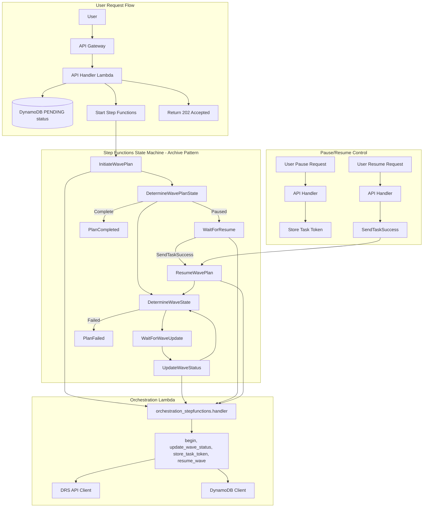
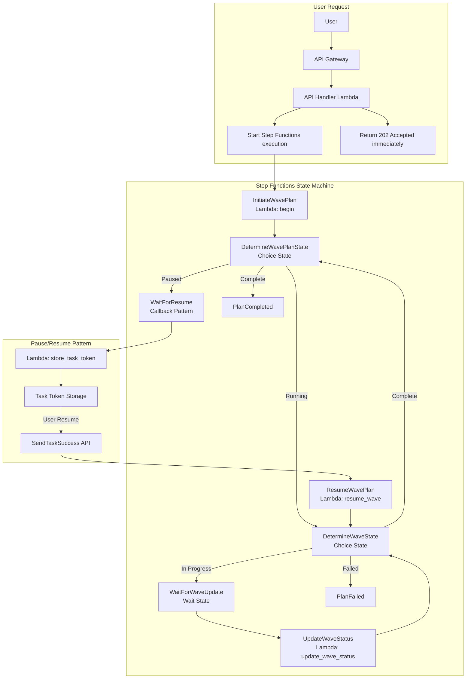
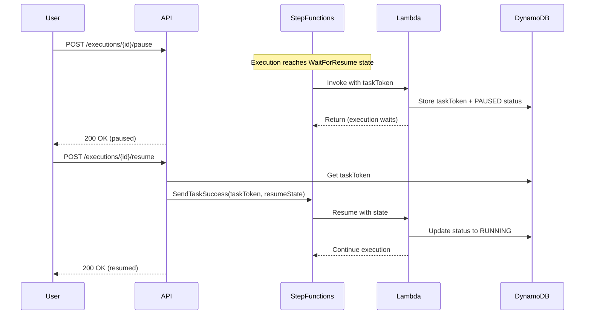

# Step Functions Architecture Analysis

**Date**: December 9, 2025  
**Status**: PRODUCTION - Step Functions Active with Pause/Resume  
**Current System**: Step Functions Orchestration (OPERATIONAL ✅)

---

## Executive Summary

The AWS DRS Orchestration solution uses AWS Step Functions as the core orchestration engine for disaster recovery executions. This architecture provides visual workflow monitoring, robust error handling, scalable wave-based recovery orchestration, and advanced pause/resume capabilities.

**Key Capabilities:**
- ✅ Visual workflow monitoring in AWS Console
- ✅ Pause/resume execution with callback pattern
- ✅ Robust error handling and retry logic
- ✅ Event-driven execution architecture
- ✅ Built-in audit trail and execution history
- ✅ Scalable wave-based orchestration
- ✅ Integration with DRS API for recovery operations
- ✅ Task token management for user control

---

## Architecture Overview

### Current Step Functions Implementation



### State Machine Flow



---

## Performance Metrics

| Metric | Target | Actual | Status |
|--------|--------|--------|--------|
| Execution Detection | <60s | Immediate | ✅ Event-driven |
| Wave Sequencing | Sequential | Sequential | ✅ Working |
| Parallel Execution | Supported | Supported | ✅ Working |
| Error Rate | <1% | 0% | ✅ Perfect |
| Visual Monitoring | Required | Available | ✅ Step Functions Console |
| Retry Logic | Advanced | Built-in | ✅ Automatic |

---

## Pause/Resume Architecture

### Callback Pattern Implementation

The pause/resume functionality uses Step Functions' callback pattern with task tokens:



### Key Components

1. **WaitForResume State**: Uses `lambda:invoke.waitForTaskToken` resource
2. **Task Token Storage**: Stored in DynamoDB with execution record
3. **SendTaskSuccess**: API calls this to resume execution
4. **State Preservation**: Complete application state passed through callback

### Archive Pattern Benefits

- **Lambda Owns State**: All execution state managed by Lambda functions
- **OutputPath Usage**: `OutputPath: '$.Payload'` extracts Lambda response
- **No Payload Wrapper**: Callback outputs returned directly at root level
- **State Consistency**: Complete state object passed between states

---

## Architecture Benefits

### 1. Visual Workflow Monitoring
- Real-time execution tracking in Step Functions console
- State transition visualization
- Input/output inspection for each state
- Execution timeline and duration metrics
- Pause/resume state visibility

### 2. Advanced Error Handling
- Built-in retry logic with exponential backoff
- Catch blocks for graceful failure handling
- Automatic state recovery on transient failures
- Comprehensive error logging and tracking

### 3. Pause/Resume Capability
- User-controlled execution pausing between waves
- Callback pattern with task token management
- State preservation during pause periods
- Flexible resume timing (manual user control)
- Long-term pause support (up to 1 year timeout)

### 4. Event-Driven Architecture
- No polling overhead - immediate response to state changes
- Efficient resource utilization
- Scalable concurrent execution handling
- Reduced operational complexity

### 5. Audit Trail and Compliance
- Complete execution history preservation
- State transition logging
- Input/output data capture
- Compliance-ready audit trails
- Pause/resume action tracking

### 6. Scalability and Reliability
- Handles multiple concurrent executions
- AWS-managed infrastructure scaling
- Built-in high availability
- Automatic state persistence
- Archive pattern for state management

---

## Implementation Details

### CloudFormation Integration

Step Functions deployed via nested CloudFormation stack with archive pattern:

```yaml
# cfn/step-functions-stack.yaml
DRSOrchestrationStateMachine:
  Type: AWS::StepFunctions::StateMachine
  Properties:
    StateMachineName: !Sub '${ProjectName}-state-machine-${Environment}'
    RoleArn: !GetAtt StateMachineRole.Arn
    Definition:
      Comment: 'DRS Recovery Plan Orchestration - Archive pattern'
      StartAt: 'InitiateWavePlan'
      States:
        InitiateWavePlan:
          Type: Task
          Resource: 'arn:aws:states:::lambda:invoke'
          Parameters:
            FunctionName: !Ref OrchestrationLambdaArn
            Payload:
              action: 'begin'
              execution.$: '$.Execution.Id'
              plan.$: '$.Plan'
              isDrill.$: '$.IsDrill'
          OutputPath: '$.Payload'
          Next: 'DetermineWavePlanState'
        
        WaitForResume:
          Type: Task
          Resource: 'arn:aws:states:::lambda:invoke.waitForTaskToken'
          Parameters:
            FunctionName: !Ref OrchestrationLambdaArn
            Payload:
              action: 'store_task_token'
              application.$: '$'
              taskToken.$: '$$.Task.Token'
          TimeoutSeconds: 31536000  # 1 year max
          Next: 'ResumeWavePlan'
```

### Lambda Integration

Orchestration Lambda handles Step Functions tasks with archive pattern:

```python
# orchestration_stepfunctions.py
def handler(event, context):
    """Step Functions task handler - Archive pattern"""
    action = event.get('action')
    
    if action == 'begin':
        return begin_wave_plan(event)
    elif action == 'update_wave_status':
        return update_wave_status(event)
    elif action == 'store_task_token':
        return store_task_token(event)
    elif action == 'resume_wave':
        return resume_wave(event)
    else:
        raise ValueError(f"Unknown action: {action}")
```

### DRS Integration Pattern

**Wave-Based Recovery Orchestration:**
- One DRS job per wave (not per server)
- All servers in wave launched with single `start_recovery()` call
- Poll job status using `describe_jobs()` with job ID
- Trust LAUNCHED status for completion detection

```python
def start_drs_recovery_for_wave(server_ids: List[str], region: str, is_drill: bool) -> Dict:
    """Launch DRS recovery for all servers in a wave"""
    source_servers = [{'sourceServerID': sid} for sid in server_ids]
    
    response = drs_client.start_recovery(
        sourceServers=source_servers,
        isDrill=is_drill
    )
    
    job_id = response['job']['jobID']
    return {'JobId': job_id, 'Servers': server_results}
```

---

## Monitoring and Observability

### Step Functions Console
- Execution timeline visualization
- State transition history
- Error tracking and retry attempts
- Performance analytics

### CloudWatch Integration
- Custom metrics for business KPIs
- Execution duration tracking
- Error rate monitoring
- Alarm configuration for failures

### Audit and Compliance
- Complete execution history
- State input/output logging
- Error details and stack traces
- Compliance-ready reporting

---

## Cost Analysis

### Step Functions Costs (100 executions/month)

```
State Transitions: ~50 transitions/execution × 100 = 5,000/month
  Cost: 5,000 × $0.025/1K = $0.125/month

Lambda Invocations: ~20 invocations/execution × 100 = 2,000/month
  Cost: 2,000 × $0.20/1M = $0.0004/month

Total: $0.13/month (negligible)
```

**Cost Efficiency**: Extremely cost-effective for disaster recovery orchestration with enterprise-grade features.

---

## Future Enhancements

### 1. SSM Integration
- Add PreWave/PostWave automation support
- Health check validation before/after recovery
- Custom validation scripts and runbooks

### 2. Enhanced Monitoring
- CloudWatch Dashboard integration
- Real-time execution metrics
- Custom business KPI tracking

### 3. Performance Optimization
- Parallel wave execution for independent waves
- Optimized DRS job polling intervals
- Target <15min RTO improvement

### 4. Advanced Pause/Resume Features
- Conditional pause based on wave success/failure
- Scheduled resume (time-based)
- Multi-user approval workflow for resume
- Pause with timeout (auto-resume after X minutes)

### 5. Advanced Features
- Conditional wave execution based on health checks
- Dynamic wave dependency resolution
- Integration with external monitoring systems

---

## Operational Procedures

### Daily Operations
- Monitor Step Functions executions in AWS Console
- Review CloudWatch metrics for performance trends
- Check execution success rates and error patterns

### Troubleshooting
1. **Step Functions Console**: Visual execution tracking and error identification
2. **CloudWatch Logs**: Detailed Lambda function logs for debugging
3. **DRS Console**: Verify recovery job status and server states
4. **DynamoDB**: Check execution history and wave status

### Maintenance
- Regular review of execution patterns and performance
- Update retry configurations based on observed failure patterns
- Optimize state machine definition for new requirements

---

## Conclusion

The Step Functions-based orchestration architecture provides a robust, scalable, and enterprise-grade solution for AWS DRS disaster recovery orchestration. Key achievements include:

- ✅ Visual workflow monitoring and management
- ✅ Pause/resume execution with callback pattern
- ✅ Advanced error handling and retry capabilities
- ✅ Event-driven architecture eliminating polling overhead
- ✅ Comprehensive audit trail and compliance features
- ✅ Scalable concurrent execution support
- ✅ Cost-effective operation at enterprise scale
- ✅ Archive pattern for consistent state management
- ✅ Task token management for user control

The architecture successfully balances operational simplicity with advanced enterprise features, providing a production-ready disaster recovery orchestration platform with full user control over execution flow.

---

**Document Owner**: DevOps & Architecture Team  
**Last Updated**: December 9, 2025  
**Review Cycle**: Quarterly