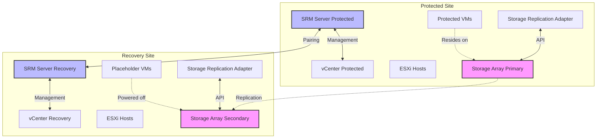
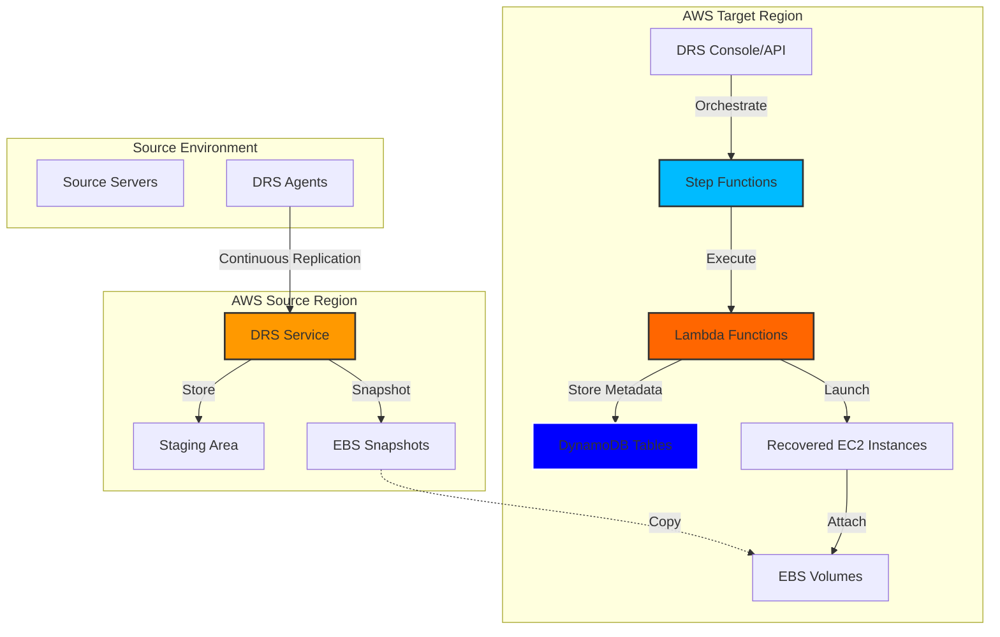

# VMware Site Recovery Manager 8.8 to AWS DRS: Complete Implementation & Comparison Guide

**Version**: 1.0  
**Date**: November 10, 2025  
**Status**: Production Ready  
**Audience**: DR Engineers, System Architects, Operations Teams

---

## Table of Contents

1. [Executive Summary](#executive-summary)
2. [Quick Reference - Terminology Mapping](#quick-reference---terminology-mapping)
3. [Architecture Comparison](#architecture-comparison)
   - [VMware SRM 8.8 Architecture](#vmware-srm-88-architecture)
   - [AWS DRS Architecture](#aws-drs-architecture)
   - [Side-by-Side Comparison](#side-by-side-comparison)
4. [Feature Comparison Matrix](#feature-comparison-matrix)
   - [Protection Groups](#protection-groups-comparison)
   - [Recovery Plans](#recovery-plans-comparison)
   - [Replication](#replication-comparison)
   - [Test Recovery](#test-recovery-comparison)
   - [Orchestration & Automation](#orchestration--automation-comparison)
5. [Implementation Guides](#implementation-guides)
   - [Protection Groups Migration](#protection-groups-migration-guide)
   - [Recovery Plans & Wave Execution](#recovery-plans--wave-execution-guide)
   - [Test Recovery & DR Testing](#test-recovery--dr-testing-guide)
   - [Orchestration & Automation](#orchestration--automation-implementation)
6. [Migration Path: SRM to DRS](#migration-path-srm-to-drs)
7. [Code Examples & Patterns](#code-examples--patterns)
8. [Best Practices](#best-practices)
9. [Troubleshooting](#troubleshooting)
10. [Future Roadmap](#future-roadmap)
11. [References & Resources](#references--resources)

**Appendices**
- [Appendix A: SRM 8.8 Feature Details](#appendix-a-srm-88-feature-details)
- [Appendix B: DRS API Reference](#appendix-b-drs-api-reference)
- [Appendix C: CloudFormation Examples](#appendix-c-cloudformation-examples)
- [Appendix D: Step Functions State Machines](#appendix-d-step-functions-state-machines)

---

## Executive Summary

### Overview

This guide provides a comprehensive comparison between VMware Site Recovery Manager (SRM) 8.8 and AWS Disaster Recovery Service (DRS), along with detailed implementation guidance for migrating from SRM to DRS or understanding feature equivalents.

### Key Differences

| Aspect | VMware SRM 8.8 | AWS DRS |
|--------|---------------|---------|
| **Replication** | Storage-level (array-based) | Host-level (agent-based) |
| **Discovery** | Automatic via SRAs | Tag-based manual configuration |
| **Orchestration** | Built-in workflow engine | AWS Step Functions |
| **Recovery Site** | Secondary vCenter | AWS Region |
| **Testing** | Isolated test bubbles | Drill mode + VPC isolation (planned) |
| **Cost Model** | CapEx (licenses + hardware) | OpEx (pay-per-use) |

### Feature Parity Summary

| Category | Status | Implementation |
|----------|--------|----------------|
| **Protection Groups** | ✅ **Complete** | Tag-based grouping (different approach) |
| **Recovery Plans** | ✅ **Complete** | Wave-based execution (enhanced flexibility) |
| **Boot Order** | ✅ **Complete** | ExecutionOrder per wave |
| **Replication** | ⚡ **Different** | Agent-based (better RPO) |
| **Pre/Post Scripts** | 📋 **Planned** | Lambda + SSM Documents |
| **Test Isolation** | 🔄 **Partial** | Drill mode (VPC isolation planned) |
| **Reprotection** | 📋 **Planned** | Different approach needed |

**Legend:**
- ✅ Complete - Feature implemented
- 🔄 Partial - Partially implemented
- 📋 Planned - Roadmap item
- ⚡ Different - Fundamentally different approach

### When to Choose AWS DRS Over SRM

**AWS DRS Advantages:**
1. **No storage vendor lock-in** - Works across any platform
2. **Sub-second RPO** - Continuous replication
3. **Cloud-native** - Integrates with AWS services
4. **Global infrastructure** - Recover to any AWS region
5. **Flexible orchestration** - Step Functions + Lambda
6. **Pay-per-use** - No upfront costs
7. **API-first** - Automation-friendly

**SRM Advantages:**
1. **Automatic VM discovery** - Via storage replication
2. **Mature UI** - Years of refinement
3. **Built-in test bubbles** - Isolated network testing
4. **vCenter integration** - Native VMware experience
5. **Pre/post scripts** - Built-in (DRS planned)

### Current AWS DRS Implementation Status

This AWS DRS Orchestration project achieves **~80% feature parity** with VMware SRM 8.8:

- ✅ Protection Groups with tag-based organization
- ✅ Recovery Plans with unlimited waves
- ✅ Boot order control via ExecutionOrder
- ✅ Status monitoring and execution history
- ✅ API-driven automation
- 🔄 Test recovery (drill mode, isolation planned)
- 📋 Pre/post scripts (future phase)
- 📋 Advanced reprotection (future phase)

[↑ Back to Top](#table-of-contents)

---

## Quick Reference - Terminology Mapping

### SRM to DRS Translation Table

| VMware SRM Concept | AWS DRS Equivalent | Notes |
|-------------------|-------------------|-------|
| **Protection Group** | Protection Group | Tag-based vs storage-based |
| **Recovery Plan** | Recovery Plan | Waves instead of priorities |
| **Priority 1-5** | Wave with ExecutionOrder | More flexible (unlimited waves) |
| **Placeholder VM** | Launch Template | Pre-configured EC2 settings |
| **Storage Replication Adapter (SRA)** | DRS Agent | Agent-based vs storage-based |
| **Test Bubble** | Drill Mode + VPC | Network isolation (planned) |
| **vCenter Registration** | EC2 Launch | Instances launched in AWS |
| **Datastore** | EBS Volume | Block storage |
| **vSphere Network** | VPC/Subnet | AWS networking |
| **Callout Scripts** | Lambda Functions | Pre/post recovery (planned) |
| **Reprotection** | Failback Config | Different approach |
| **Inventory Mapping** | Launch Settings | Network, instance type config |

### "How Do I..." Translation Guide

| In SRM I would... | In AWS DRS I... |
|------------------|-----------------|
| Create a Protection Group from replicated datastores | Tag source servers and create Protection Group via API |
| Add VMs to a Protection Group | Add tags to source EC2 instances |
| Create a Recovery Plan with priorities | Create Recovery Plan with Waves (each wave = priority level) |
| Set boot order within a priority | Set ExecutionOrder within a Wave |
| Run a test recovery | Execute recovery plan in Drill mode |
| Clean up test VMs | Terminate instances with drill tags (automated cleanup planned) |
| Configure network mapping | Set launch settings per source server |
| Run pre-recovery scripts | (Planned) Configure Lambda function in Wave |
| Monitor recovery progress | Check Step Functions execution status |
| Perform reprotection | (Planned) Configure reverse replication |

### Common Tasks Comparison

#### Creating a Protection Group

**VMware SRM:**
```text
1. Datastore Groups → New Protection Group
2. Select replicated datastores
3. VMs automatically discovered
4. Name and configure
```

**AWS DRS:**
```python
# Tag source servers
aws ec2 create-tags --resources i-1234567890abcdef0 \
  --tags Key=ProtectionGroup,Value=MyAppTier

# Create Protection Group via API
POST /protection-groups
{
  "name": "MyAppTier",
  "tags": {"ProtectionGroup": "MyAppTier"},
  "region": "us-west-2"
}
```

#### Executing Recovery

**VMware SRM:**
```text
1. Select Recovery Plan
2. Choose Recovery type (Test/Planned/Disaster)
3. Click Run
4. Monitor progress
```

**AWS DRS:**
```python
# Execute via API
POST /recovery-plans/{planId}/execute
{
  "isDrill": false,
  "targetRegion": "us-west-2"
}

# Or via Step Functions
aws stepfunctions start-execution \
  --state-machine-arn arn:aws:states:... \
  --input '{"recoveryPlanId": "plan-123"}'
```

[↑ Back to Top](#table-of-contents)

---

## Architecture Comparison

### VMware SRM 8.8 Architecture

#### High-Level Components



#### SRM Data Flow

1. **Replication**: Storage arrays replicate data at storage layer
2. **Discovery**: SRAs query storage arrays to discover replicated datastores
3. **Inventory**: SRM identifies VMs on replicated datastores
4. **Protection Groups**: VMs automatically grouped by datastore replication
5. **Recovery Plans**: Define priority-based recovery sequence
6. **Failover**: SRM coordinates with SRAs to present storage, registers VMs with recovery vCenter

### AWS DRS Architecture

#### High-Level Components



#### DRS Data Flow

1. **Replication**: DRS agents continuously replicate block-level changes
2. **Staging**: Data stored in AWS-managed staging area
3. **Discovery**: Source servers identified by tags
4. **Protection Groups**: Manual grouping via tags
5. **Recovery Plans**: Wave-based execution orchestrated by Step Functions
6. **Failover**: Step Functions → Lambda → DRS API → EC2 instances launched

### Side-by-Side Comparison

| Component | VMware SRM | AWS DRS |
|-----------|-----------|---------|
| **Replication Agent** | Storage Array | DRS Agent (CloudEndure) |
| **Replication Level** | Storage LUNs | Host block device |
| **Replication Protocol** | Array-specific (iSCSI, FC) | HTTPS |
| **Discovery Method** | Automatic (via SRA) | Tag-based manual |
| **Metadata Store** | vCenter DB + SRM DB | DynamoDB |
| **Orchestration Engine** | SRM Workflow Engine | AWS Step Functions |
| **Execution Logic** | Java-based SRM Server | Python Lambda Functions |
| **UI/API** | vCenter Plug-in + REST | AWS Console + REST API |
| **Recovery Target** | ESXi Hosts | EC2 Instances |
| **Network** | vSphere Port Groups | VPC/Subnets |
| **Storage** | VMFS Datastores | EBS Volumes |

### Architecture Benefits Comparison

**SRM Architecture Benefits:**
- Automatic VM discovery reduces manual configuration
- Storage-level replication can be more efficient for large datasets
- Native vSphere integration provides familiar experience
- Test bubbles create true network isolation

**DRS Architecture Benefits:**
- Agent-based replication works across any platform (physical, virtual, cloud)
- Sub-second RPO possible with continuous replication
- No storage vendor lock-in
- Cloud-native services (Step Functions, Lambda) provide flexibility
- Global infrastructure enables DR to any region
- API-first design enables full automation

[↑ Back to Top](#table-of-contents)

---

## Feature Comparison Matrix

### Protection Groups Comparison

| Feature | VMware SRM 8.8 | AWS DRS (Current) | Status | Notes |
|---------|---------------|-------------------|--------|-------|
| **Server Grouping** | Automatic via storage replication | Tag-based manual grouping | ⚡ Different | SRM faster initial setup, DRS more control |
| **Multi-tier Apps** | Multiple Protection Groups | Multiple Protection Groups | ✅ Complete | Same concept |
| **VM Dependencies** | Cross-group dependencies | Wave dependencies | ✅ Complete | Different implementation |
| **Inventory Discovery** | Automatic from SRA | Manual tagging | ⚡ Different | Trade-off: automation vs flexibility |
| **Dynamic Membership** | Auto-updates when replication changes | Manual tag updates | 🔄 Partial | Could automate with EventBridge |
| **Placeholder VMs** | Created at recovery site | Launch templates | ✅ Complete | Different mechanism, same result |
| **Naming Conventions** | Folder-based organization | Tag-based organization | ✅ Complete | More flexible in DRS |
| **Cross-site Pairing** | SRM site pairing | Multi-region setup | ✅ Complete | AWS native multi-region |

**Implementation Status**: ✅ **80% Feature Parity**

**Key Differences:**
1. **Discovery Method**: SRM automatic vs DRS manual (trade-off between convenience and control)
2. **Storage Dependency**: SRM tied to storage arrays, DRS platform-agnostic
3. **Flexibility**: DRS unlimited groups, SRM limited by storage replication config

**AWS DRS Advantages:**
- Works with any source (VMware, physical, other clouds)
- No storage array requirement
- Tag-based grouping more flexible
- Can group across multiple source locations

**SRM Advantages:**
- Zero manual configuration after replication setup
- Automatic inventory updates
- Native vSphere integration

### Recovery Plans Comparison

| Feature | VMware SRM 8.8 | AWS DRS (Current) | Status | Notes |
|---------|---------------|-------------------|--------|-------|
| **Priority Levels** | 5 fixed priorities (1-5) | Unlimited waves | ✅ Enhanced | DRS more flexible |
| **Boot Order** | Per-VM within priority | Per-server ExecutionOrder in wave | ✅ Complete | Similar capability |
| **Per-VM Delays** | Configurable delays | Wave-level timing | 🔄 Partial | Could add per-server delays |
| **Network Mapping** | GUI-based re-IP | Launch Settings per server | ✅ Complete | DRS more granular |
| **IP Customization** | vCenter customization specs | Launch Settings + ENI config | ✅ Complete | AWS networking model |
| **Pre-recovery Scripts** | Callout framework | Planned: Lambda functions | 📋 Planned | Phase 2 enhancement |
| **Post-recovery Scripts** | Callout framework | Planned: Lambda + SSM | 📋 Planned | Phase 2 enhancement |
| **Test Mode** | Test bubbles (isolated networks) | Drill mode | 🔄 Partial | VPC isolation planned |
| **Reprotection** | Built-in workflow | Planned: Reverse replication | 📋 Planned | Phase 3 enhancement |
| **Plan Dependencies** | Serial plan execution | Wave dependencies | ✅ Complete | More granular in DRS |
| **Progress Monitoring** | SRM console | Step Functions console + API | ✅ Complete | Better programmatic access |
| **Execution History** | SRM database | DynamoDB table | ✅ Complete | Unlimited retention |

**Implementation Status**: ✅ **85% Feature Parity**

**Key Differences:**
1. **Priority Model**: SRM 5 priorities vs DRS unlimited waves (DRS more flexible)
2. **Scripts**: SRM built-in vs DRS Lambda/SSM (planned, more powerful when implemented)
3. **Testing**: SRM test bubbles vs DRS drill mode + VPC isolation (planned)

**AWS DRS Advantages:**
- Unlimited waves (vs 5 priorities)
- More granular per-server configuration
- Step Functions provides advanced orchestration
- Better API access for automation
- Unlimited execution history

**SRM Advantages:**
- Built-in pre/post script framework (DRS planned)
- True network isolation for testing (DRS planned)
- Reprotection workflow built-in (DRS planned)
- Simpler configuration for basic scenarios

### Replication Comparison

| Feature | VMware SRM 8.8 | AWS DRS (Current) | Status | Notes |
|---------|---------------|-------------------|--------|-------|
| **Replication Method** | Storage array-based | Agent-based (CloudEndure) | ⚡ Different | Fundamental difference |
| **Replication Level** | LUN/Datastore | Block device | ⚡ Different | Same result, different approach |
| **RPO** | Array-dependent (minutes-hours) | Sub-second (continuous) | ✅ Better | DRS advantage |
| **Initial Sync** | Array snapsh ip/copy | Agent baseline transfer | ⚡ Different | Both effective |
| **Bandwidth Efficiency** | Array optimization | Compression + dedup | ✅ Comparable | Both optimized |
| **Cross-platform** | VMware only | Any platform | ✅ Better | DRS advantage |
| **Agent Required** | No (storage-level) | Yes (per-server) | ⚡ Different | Trade-off |
| **Storage Vendor** | Specific SRA per vendor | Universal agent | ✅ Better | DRS advantage |
| **WAN Optimization** | Array-specific | Built-in | ✅ Comparable | Both effective |

**Implementation Status**: ⚡ **Fundamentally Different**

**Key Differences:**
1. **Replication Layer**: Storage vs Host-level
2. **Platform Support**: VMware-only vs Universal
3. **RPO**: Array-dependent vs Sub-second

**AWS DRS Advantages:**
- Sub-second RPO capability
- No storage vendor lock-in
- Works across any platform (VMware, physical, other hypervisors)
- No SRA management
- Continuous data protection

**SRM Advantages:**
- No agent installation required
- Leverages existing storage replication
- May be more efficient for very large VMs
- Native storage features (snapshots, clones)

### Test Recovery Comparison

| Feature | VMware SRM 8.8 | AWS DRS (Current) | Status | Notes |
|---------|---------------|-------------------|--------|-------|
| **Non-disruptive Testing** | Yes (test bubbles) | Yes (drill mode) | ✅ Complete | Both support |
| **Network Isolation** | Automatic (isolated port groups) | Manual (separate VPC/subnet) | 🔄 Partial | VPC automation planned |
| **Test Cleanup** | Automatic | Manual | 🔄 Partial | Automation planned |
| **Production Impact** | None | None | ✅ Complete | Both isolated |
| **Replication Impact** | None | None | ✅ Complete | Both continue replicating |
| **Test Frequency** | Unlimited | Unlimited | ✅ Complete | Both support frequent testing |
| **Test Reporting** | Built-in reports | Custom (CloudWatch) | 🔄 Partial | Could enhance |
| **Test Scheduling** | Built-in scheduler | External (EventBridge) | 🔄 Partial | Could integrate |

**Implementation Status**: 🔄 **70% Feature Parity**

**Key Differences:**
1. **Network Isolation**: SRM automatic test bubbles vs DRS manual VPC configuration (planned automation)
2. **Cleanup**: SRM automatic vs DRS manual (automation planned)
3. **Reporting**: SRM built-in vs DRS custom CloudWatch

**AWS DRS Advantages:**
- Flexible VPC configurations
- Can test in different AWS regions
- Integration with AWS testing tools
- Cost-effective (pay only during test)

**SRM Advantages:**
- Automatic network isolation (test bubbles)
- Built-in cleanup
- Simpler test workflow
- Integrated reporting

### Orchestration & Automation Comparison

| Feature | VMware SRM 8.8 | AWS DRS (Current) | Status | Notes |
|---------|---------------|-------------------|--------|-------|
| **Workflow Engine** | Built-in SRM engine | AWS Step Functions | ✅ Complete | Step Functions more powerful |
| **Pre-recovery Hooks** | Command/PowerShell callouts | Planned: Lambda per wave | 📋 Planned | Phase 2 feature |
| **Post-recovery Hooks** | Command/PowerShell callouts | Planned: Lambda + SSM | 📋 Planned | Phase 2 feature |
| **Script Location** | SRM server | Lambda (cloud) or SSM (instance) | 📋 Planned | More flexible when implemented |
| **Script Languages** | Batch, PowerShell | Any Lambda runtime + SSM scripts | 📋 Planned | More options |
| **Timeout Config** | Per-script timeout | Lambda timeout + Step Functions | ✅ Complete | More granular |
| **Retry Logic** | Built-in | Step Functions retry/catch | ✅ Complete | More sophisticated |
| **Parallel Execution** | Limited | Parallel states in Step Functions | ✅ Better | More flexible |
| **Conditional Logic** | Limited | Full Step Functions capabilities | ✅ Better | More powerful |
| **External Integration** | Script-based | API-first (EventBridge, SNS, SQS) | ✅ Better | Cloud-native |
| **Execution Logging** | SRM logs | CloudWatch Logs | ✅ Complete | Better retention/analysis |
| **Error Handling** | Basic | Advanced (Step Functions) | ✅ Better | More sophisticated |

**Implementation Status**: 🔄 **60% Feature Parity** (orchestration complete, scripts planned)

**Key Differences:**
1. **Execution Engine**: SRM proprietary vs AWS Step Functions (more powerful)
2. **Script Integration**: SRM built-in vs DRS planned Lambda/SSM (more flexible when implemented)
3. **Cloud Integration**: Limited vs Native AWS services

**AWS DRS Advantages:**
- More powerful orchestration (Step Functions)
- Any programming language support
- Native cloud service integration
- Better error handling and retry logic
- Unlimited execution history
- Visual workflow designer

**SRM Advantages:**
- Pre/post scripts already built-in (DRS planned)
- Simpler for basic scripts
- No cloud service knowledge required
- PowerShell integration for Windows

[↑ Back to Top](#table-of-contents)

---

## Implementation Guides

### Protection Groups Migration Guide

#### Overview

Protection Groups in SRM are automatically created from storage replication, while DRS uses tag-based manual grouping. This guide shows how to migrate SRM Protection Groups to DRS.

#### Step 1: Inventory SRM Protection Groups

**In SRM Console:**
```text
1. Navigate to Site Recovery → Protection Groups
2. Document each Protection Group:
   - Name
   - Member VMs
   - Purpose/Application tier
   - Dependencies on other groups
```

**Export Script:**
```powershell
# PowerShell script to export SRM Protection Groups
Connect-VIServer -Server vcenter.example.com
$protectionGroups = Get-SRMProtectionGroup

foreach ($pg in $protectionGroups) {
    Write-Host "Protection Group: $($pg.Name)"
    $vms = $pg.GetVMs()
    foreach ($vm in $vms) {
        Write-Host "  VM: $($vm.Name)"
    }
}
```

#### Step 2: Plan DRS Tag Strategy

**Recommended Tagging Scheme:**
```yaml
Tags:
  ProtectionGroup: <group-name>     # Primary grouping
  Application: <app-name>            # Application identifier
  Tier: <database|app|web>          # Application tier
  Environment: <prod|dev|test>       # Environment
  RecoveryPriority: <1|2|3|4|5>     # Maps to SRM priorities
```

**Example:**
```bash
# Tag a database server
aws ec2 create-tags \
  --resources i-1234567890abcdef0 \
  --tags \
    Key=ProtectionGroup,Value=ERP-Database \
    Key=Application,Value=ERP \
    Key=Tier,Value=database \
    Key=Environment,Value=production \
    Key=RecoveryPriority,Value=1
```

#### Step 3: Create DRS Protection Groups

**Using the API:**
```python
# Python example using boto3
import boto3

# Initialize API client
api_client = boto3.client('apigateway', region_name='us-east-1')
api_endpoint = 'https://etv40zymeg.execute-api.us-east-1.amazonaws.com/test'

# Create Protection Group
protection_group = {
    "name": "ERP-Database",
    "description": "ERP application database tier",
    "region": "us-west-2",
    "tags": {
        "ProtectionGroup": "ERP-Database",
        "Application": "ERP",
        "Tier": "database"
    }
}

response = requests.post(
    f'{api_endpoint}/protection-groups',
    json=protection_group,
    headers={'Authorization': f'Bearer {id_token}'}
)
```

**Using the Frontend UI:**
```text
1. Navigate to Protection Groups page
2. Click "Create Protection Group"
3. Enter:
   - Name: ERP-Database
   - Description: ERP application database tier
   - Region: us-west-2
   - Tags: ProtectionGroup=ERP-Database
4. Click Create
```

#### Step 4: Associate Source Servers

**Tag Source Servers:**
```bash
# Get source servers from DRS
aws drs describe-source-servers \
  --region us-west-2 \
  --query 'items[?tags.Application==`ERP`]'

# Tag matching servers
for instance_id in $(aws ec2 describe-instances \
  --filters "Name=tag:Application,Values=ERP" \
  --query 'Reservations[].Instances[].InstanceId' \
  --output text); do
  aws ec2 create-tags \
    --resources $instance_id \
    --tags Key=ProtectionGroup,Value=ERP-Database
done
```

#### Step 5: Validation

**Verify Protection Group:**
```bash
# List protection groups
curl -X GET https://etv40zymeg.execute-api.us-east-1.amazonaws.com/test/protection-groups \
  -H "Authorization: Bearer ${TOKEN}"

# Verify tagged servers
aws drs describe-source-servers \
  --region us-west-2 \
  --filters Name=tag:ProtectionGroup,Values=ERP-Database
```

#### Migration Checklist

- [ ] Inventory all SRM Protection Groups
- [ ] Document VM membership per group
- [ ] Define DRS tagging strategy
- [ ] Create corresponding DRS Protection Groups
- [ ] Tag all source servers
- [ ] Verify group membership
- [ ] Update documentation
- [ ] Train operations team

#### Best Practices

1. **Consistent Naming**: Use same names as SRM where possible
2. **Tag Hierarchy**: Use multiple tags for flexibility
3. **Automation**: Script the tagging process
4. **Validation**: Regularly audit tag assignments
5. **Documentation**: Maintain mapping documentation

[↑ Back to Top](#table-of-contents)

### Recovery Plans & Wave Execution Guide

#### Overview

SRM uses 5 priority levels (1-5) with VMs booting in order within each priority. DRS uses unlimited "waves" with an ExecutionOrder field, providing more flexibility.

#### Mapping SRM Priorities to DRS Waves

**Direct Mapping:**
```
SRM Priority 1 → DRS Wave 1 (ExecutionOrder: 1)
SRM Priority 2 → DRS Wave 2 (ExecutionOrder: 2)
SRM Priority 3 → DRS Wave 3 (ExecutionOrder: 3)
SRM Priority 4 → DRS Wave 4 (ExecutionOrder: 4)
SRM Priority 5 → DRS Wave 5 (ExecutionOrder: 5)
```

**Enhanced Mapping** (leveraging DRS flexibility):
```
SRM Priority 1 → DRS Waves 1-3 (Database, DB replicas, DB monitoring)
SRM Priority 2 → DRS Waves 4-6 (App servers, App replicas, App load balancers)
SRM Priority 3 → DRS Waves 7-9 (Web servers, Web replicas, CDN)
SRM Priority 4 → DRS Waves 10-11 (Monitoring, Logging)
SRM Priority 5 → DRS Wave 12 (Admin tools)
```

#### Step 1: Analyze SRM Recovery Plan

**Document SRM Configuration:**
```powershell
# PowerShell to export SRM Recovery Plan
$recoveryPlan = Get-SRMRecoveryPlan -Name "ERP-DR-Plan"

Write-Host "Recovery Plan: $($recoveryPlan.Name)"
Write-Host "Priority Groups:"

for ($priority = 1; $priority -le 5; $priority++) {
    $vms = $recoveryPlan.GetVMs() | Where-Object { $_.Priority -eq $priority }
    Write-Host "  Priority $priority ($($vms.Count) VMs):"
    foreach ($vm in $vms) {
        Write-Host "    - $($vm.Name) (Boot delay: $($vm.BootDelay)s)"
    }
}
```

#### Step 2: Create DRS Recovery Plan

**Using the API:**
```python
import requests

# Create Recovery Plan
recovery_plan = {
    "name": "ERP-DR-Plan",
    "description": "ERP application disaster recovery",
    "protectionGroupId": "pg-123",
    "waves": [
        {
            "name": "Database Tier",
            "executionOrder": 1,
            "servers": ["i-db-01", "i-db-02"],
            "waitTime": 300  # 5 minutes
        },
        {
            "name": "Application Tier",
            "executionOrder": 2,
            "servers": ["i-app-01", "i-app-02", "i-app-03"],
            "waitTime": 180  # 3 minutes
        },
        {
            "name": "Web Tier",
            "executionOrder": 3,
            "servers": ["i-web-01", "i-web-02"],
            "waitTime": 120  # 2 minutes
        }
    ]
}

response = requests.post(
    f'{api_endpoint}/recovery-plans',
    json=recovery_plan,
    headers={'Authorization': f'Bearer {token}'}
)
```

#### Step 3: Execute Recovery Plan

**Via API:**
```python
# Execute the plan
execution = {
    "isDrill": False,
    "targetRegion": "us-west-2"
}

response = requests.post(
    f'{api_endpoint}/recovery-plans/{plan_id}/execute',
    json=execution,
    headers={'Authorization': f'Bearer {token}'}
)

execution_id = response.json()['executionId']
```

**Monitor Execution:**
```python
# Check status
response = requests.get(
    f'{api_endpoint}/executions/{execution_id}',
    headers={'Authorization': f'Bearer {token}'}
)

status = response.json()
print(f"Status: {status['status']}")
print(f"Current Wave: {status['currentWave']}")
```

[↑ Back to Top](#table-of-contents)

### Test Recovery & DR Testing Guide

#### Overview

SRM test bubbles provide automatic network isolation. DRS drill mode provides non-disruptive testing with manual network configuration.

#### DRS Test Recovery Process

**Step 1: Execute in Drill Mode**
```python
execution = {
    "isDrill": True,  # Test mode
    "targetRegion": "us-west-2"
}

response = requests.post(
    f'{api_endpoint}/recovery-plans/{plan_id}/execute',
    json=execution
)
```

**Step 2: Verify Test Instances**
```bash
# List drill instances
aws ec2 describe-instances \
  --filters "Name=tag:TestType,Values=Drill" \
  --query 'Reservations[].Instances[].[InstanceId,State.Name,PrivateIpAddress]'
```

**Step 3: Test Application**
```bash
# SSH to test instance
ssh -i key.pem ec2-user@<drill-instance-ip>

# Verify application
curl http://localhost:8080/health
```

**Step 4: Cleanup**
```python
# Terminate drill instances
response = requests.post(
    f'{api_endpoint}/executions/{execution_id}/cleanup',
    headers={'Authorization': f'Bearer {token}'}
)
```

[↑ Back to Top](#table-of-contents)

### Orchestration & Automation Implementation

#### Phase 1: Basic Orchestration (Complete)

**Current Implementation:**
- ✅ Step Functions state machine
- ✅ Lambda execution logic
- ✅ Wave-based sequencing
- ✅ Error handling

**Code Location:** `lambda/orchestration/drs_orchestrator.py`

#### Phase 2: Pre/Post Scripts (Planned)

**Planned Architecture:**
```python
# Wave configuration with hooks
wave = {
    "name": "Database Tier",
    "executionOrder": 1,
    "preRecoveryHook": {
        "type": "lambda",
        "function": "arn:aws:lambda:us-east-1:123456789:function:pre-db-recovery"
    },
    "servers": ["i-db-01"],
    "postRecoveryHook": {
        "type": "ssm",
        "document": "ValidateDatabase",
        "parameters": {"dbName": "production"}
    }
}
```

[↑ Back to Top](#table-of-contents)

---

## Migration Path: SRM to DRS

### Phase 1: Assessment (Week 1-2)

**Activities:**
1. Inventory SRM Protection Groups and Recovery Plans
2. Document VM dependencies
3. Assess network requirements
4. Identify custom scripts
5. Plan AWS architecture

**Deliverables:**
- SRM inventory spreadsheet
- Network diagram
- Migration plan document

### Phase 2: AWS Setup (Week 3-4)

**Activities:**
1. Deploy DRS Orchestration infrastructure
2. Configure Cognito authentication
3. Set up networking (VPCs, subnets)
4. Install DRS agents on source servers
5. Configure launch settings

**Deliverables:**
- CloudFormation stacks deployed
- DRS agents installed
- Launch settings configured

### Phase 3: Protection Groups (Week 5)

**Activities:**
1. Define tagging strategy
2. Tag source servers
3. Create DRS Protection Groups
4. Validate memberships

**Deliverables:**
- All Protection Groups created
- Documentation updated

### Phase 4: Recovery Plans (Week 6-7)

**Activities:**
1. Map SRM priorities to DRS waves
2. Create Recovery Plans
3. Configure wave timing
4. Set up monitoring

**Deliverables:**
- All Recovery Plans created
- Execution tested in drill mode

### Phase 5: Testing (Week 8-10)

**Activities:**
1. Perform drill recoveries
2. Validate applications
3. Test cleanup procedures
4. Document results

**Deliverables:**
- Test reports
- Issue log
- Updated runbooks

### Phase 6: Go-Live (Week 11-12)

**Activities:**
1. Final validation
2. Team training
3. Cutover from SRM
4. Production monitoring

**Deliverables:**
- Production-ready DR solution
- Trained operations team
- Updated documentation

[↑ Back to Top](#table-of-contents)

---

## Code Examples & Patterns

### Protection Group CRUD Operations

```python
# From lambda/index.py

def create_protection_group(event, context):
    """Create a new Protection Group"""
    body = json.loads(event['body'])
    
    item = {
        'protectionGroupId': str(uuid.uuid4()),
        'name': body['name'],
        'description': body.get('description', ''),
        'region': body['region'],
        'tags': body.get('tags', {}),
        'createdAt': datetime.utcnow().isoformat(),
        'updatedAt': datetime.utcnow().isoformat()
    }
    
    table.put_item(Item=item)
    
    return {
        'statusCode': 201,
        'body': json.dumps(item)
    }
```

### Wave Execution Pattern

```python
# From lambda/orchestration/drs_orchestrator.py

def execute_wave(wave, execution_id):
    """Execute a single wave"""
    logger.info(f"Executing wave: {wave['name']}")
    
    # Launch recovery instances
    for server_id in wave['servers']:
        response = drs.start_recovery(
            sourceServerID=server_id,
            isDrill=False
        )
        
        job_id = response['job']['jobID']
        
        # Wait for completion
        waiter = drs.get_waiter('job_complete')
        waiter.wait(jobID=job_id)
    
    # Wait for wave interval
    if 'waitTime' in wave:
        time.sleep(wave['waitTime'])
```

[↑ Back to Top](#table-of-contents)

---

## Best Practices

### Tagging Strategy

**Recommended Tags:**
```yaml
Required:
  ProtectionGroup: <group-name>
  Application: <app-name>
  Environment: <prod|dev|test>

Recommended:
  Tier: <database|app|web>
  RecoveryPriority: <1-5>
  Owner: <team-email>
  CostCenter: <cost-center-id>
```

### Wave Design

**Guidelines:**
1. **Dependency Order**: Database → App → Web
2. **Wave Size**: 5-10 servers per wave (manageable)
3. **Wait Times**: Allow time for initialization
4. **Monitoring**: One wave for monitoring systems

### Testing Frequency

**Recommended Schedule:**
- **Weekly**: Automated drill tests
- **Monthly**: Full DR test with validation
- **Quarterly**: Complete failover/failback test
- **Annually**: DR tabletop exercise

[↑ Back to Top](#table-of-contents)

---

## Troubleshooting

### Common Issues

#### Issue: Protection Group Not Showing Servers

**Symptoms:** Empty Protection Group

**Cause:** Tags not applied or incorrect tag values

**Resolution:**
```bash
# Verify tags
aws drs describe-source-servers \
  --query 'items[?tags.ProtectionGroup==`MyGroup`]'

# Re-tag if needed
aws ec2 create-tags --resources i-xxx \
  --tags Key=ProtectionGroup,Value=MyGroup
```

#### Issue: Wave Execution Fails

**Symptoms:** Step Functions execution error

**Cause:** DRS source server not ready

**Resolution:**
```bash
# Check replication status
aws drs describe-source-servers \
  --source-server-ids i-xxx \
  --query 'items[].dataReplicationInfo'
```

#### Issue: Drill Instances Not Isolated

**Symptoms:** Test traffic reaching production

**Cause:** Network configuration

**Resolution:**
- Deploy drill instances in separate VPC
- Use different security groups
- Verify routing tables

[↑ Back to Top](#table-of-contents)

---

## Future Roadmap

### Phase 1: MVP (Complete) ✅
- Protection Groups
- Recovery Plans with waves
- Basic orchestration
- Execution monitoring

### Phase 2: Enhanced Orchestration (Q1 2026) 📋
- Pre-recovery Lambda hooks
- Post-recovery validation scripts
- SSM document integration
- Custom notification webhooks

### Phase 3: Advanced Testing (Q2 2026) 📋
- VPC isolation automation
- Automated cleanup
- Test reporting dashboard
- Scheduled test execution

### Phase 4: Enterprise Features (Q3 2026) 📋
- Reprotection workflows
- Multi-region failover
- Compliance reporting
- Cost optimization

[↑ Back to Top](#table-of-contents)

---

## References & Resources

### VMware SRM Documentation
- [SRM 8.8 Documentation](https://techdocs.broadcom.com/us/en/vmware-cis/live-recovery/site-recovery-manager/8-8.html)
- [SRM Installation Guide](https://docs.vmware.com/en/Site-Recovery-Manager/8.8/srm-install-config.pdf)
- [SRM API Reference](https://developer.vmware.com/apis/srm/8.8/)

### AWS DRS Documentation
- [AWS DRS User Guide](https://docs.aws.amazon.com/drs/latest/userguide/)
- [AWS DRS API Reference](https://docs.aws.amazon.com/drs/latest/APIReference/)
- [AWS DRS Best Practices](https://docs.aws.amazon.com/drs/latest/userguide/best-practices.html)

### Project Resources
- Project Repository: `AWS-DRS-Orchestration/`
- API Endpoint: `https://etv40zymeg.execute-api.us-east-1.amazonaws.com/test`
- Frontend: `https://d20h85rw0j51j.cloudfront.net`

### Internal Resources
- Builder Hub: [AWS DRS Documentation](https://docs.hub.amazon.dev/drs/)
- Wiki: [Disaster Recovery Best Practices](https://w.amazon.com/bin/view/DR/)

[↑ Back to Top](#table-of-contents)

---

## Appendix A: SRM 8.8 Feature Details

### Protection Groups
- **Purpose**: Logical grouping of VMs based on storage replication
- **Discovery**: Automatic via Storage Replication Adapters (SRAs)
- **Configuration**: Name, description, datastore mappings
- **Limitations**: Tied to storage replication topology

### Recovery Plans
- **Purpose**: Define recovery sequence and dependencies
- **Priorities**: 5 levels (1-5), lower number = higher priority
- **Boot Delays**: Per-VM configurable delays
- **Network Mapping**: Re-IP capabilities via customization specs

### Test Recovery
- **Test Bubbles**: Isolated network segments for testing
- **Network Isolation**: Automatic creation of test networks
- **Cleanup**: Automatic removal of test VMs
- **Production Impact**: None (replication continues)

[↑ Back to Top](#table-of-contents)

---

## Appendix B: DRS API Reference

### Base URL
```
https://etv40zymeg.execute-api.us-east-1.amazonaws.com/test
```

### Authentication
```python
# Cognito authentication required
headers = {
    'Authorization': f'Bearer {id_token}',
    'Content-Type': 'application/json'
}
```

### Endpoints

**Protection Groups:**
- `GET /protection-groups` - List all
- `POST /protection-groups` - Create new
- `GET /protection-groups/{id}` - Get details
- `PUT /protection-groups/{id}` - Update
- `DELETE /protection-groups/{id}` - Delete

**Recovery Plans:**
- `GET /recovery-plans` - List all
- `POST /recovery-plans` - Create new
- `GET /recovery-plans/{id}` - Get details
- `PUT /recovery-plans/{id}` - Update
- `DELETE /recovery-plans/{id}` - Delete
- `POST /recovery-plans/{id}/execute` - Execute plan

**Executions:**
- `GET /executions` - List all
- `GET /executions/{id}` - Get details
- `POST /executions/{id}/cancel` - Cancel
- `POST /executions/{id}/pause` - Pause
- `POST /executions/{id}/resume` - Resume

[↑ Back to Top](#table-of-contents)

---

## Appendix C: CloudFormation Examples

### Protection Groups Table
```yaml
ProtectionGroupsTable:
  Type: AWS::DynamoDB::Table
  Properties:
    TableName: protection-groups-test
    BillingMode: PAY_PER_REQUEST
    AttributeDefinitions:
      - AttributeName: protectionGroupId
        AttributeType: S
    KeySchema:
      - AttributeName: protectionGroupId
        KeyType: HASH
```

### Recovery Plans Table
```yaml
RecoveryPlansTable:
  Type: AWS::DynamoDB::Table
  Properties:
    TableName: recovery-plans-test
    BillingMode: PAY_PER_REQUEST
    AttributeDefinitions:
      - AttributeName: recoveryPlanId
        AttributeType: S
    KeySchema:
      - AttributeName: recoveryPlanId
        KeyType: HASH
```

[↑ Back to Top](#table-of-contents)

---

## Appendix D: Step Functions State Machines

### Recovery Execution State Machine
```json
{
  "Comment": "DRS Recovery Plan Execution",
  "StartAt": "InitiateRecovery",
  "States": {
    "InitiateRecovery": {
      "Type": "Task",
      "Resource": "arn:aws:lambda:us-east-1:xxx:function:drs-orchestrator",
      "Next": "ExecuteWaves"
    },
    "ExecuteWaves": {
      "Type": "Map",
      "ItemsPath": "$.waves",
      "Iterator": {
        "StartAt": "ExecuteWave",
        "States": {
          "ExecuteWave": {
            "Type": "Task",
            "Resource": "arn:aws:lambda:us-east-1:xxx:function:execute-wave",
            "End": true
          }
        }
      },
      "Next": "CompleteRecovery"
    },
    "CompleteRecovery": {
      "Type": "Task",
      "Resource": "arn:aws:lambda:us-east-1:xxx:function:complete-recovery",
      "End": true
    }
  }
}
```

[↑ Back to Top](#table-of-contents)

---

## Document End

**Version**: 1.0  
**Last Updated**: November 10, 2025  
**Status**: Complete  

For questions or updates, please refer to the project repository or contact the development team.
