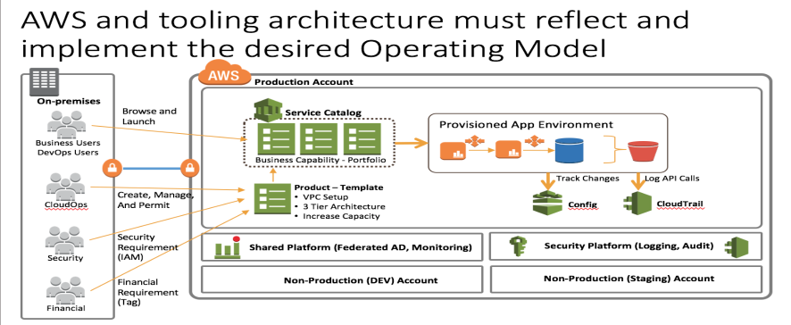

# Change-Management-Design

**Confluence Page:** https://healthedge.atlassian.net/wiki/spaces/CP1/pages/4866051262/Change-Management-Design

**Created by:** Chris Falk on June 16, 2025  
**Last modified by:** Chris Falk on June 16, 2025 at 02:04 AM

---

Change Management Design
========================

| **AWS Recommended Cloud Approach** |
| --- |
| IT Change Management from an ITIL perspective balances the need for organizations to introduce and modify IT services while minimizing the risk to Production Ready environments. Change Management focuses on the **automated control of change in your cloud environment through policies and thresholds with visibility across cloud services.** Infrastructure-as-code provides the basis for the AWS recommended approach to change management. This basis facilitates the automation of changes and provides for the documentation, review and storage of changes in configuration management tools, just like code. This approach lets organizations move into continuous integration / continuous deployment (CI/CD) to combine infrastructure and software deployment automation. As code templates are developed and used in the service catalog and to deploy full application stacks, those templates are put through the change management process, but management approval occurs in the initiation phase (approval to do the work) and not as intermediate or completion step. Creation, review and release of code is accomplished within the automation tooling. Use deployment management systems to track and implement changes, and fully automating integration and deployment follows Well-Architected best practices. This will reduce errors caused by manual processes, and reduce the level of effort to deploy changes. Through use of blue/green deployments into AWS Cloud Platform the use of continuous deployment can minimize most risk of new deployments and allow for rapid fall back to the known working code. The use of version control is a Well-Architected best practice. It is recommended to maintain assets in version controlled repositories. Doing so supports tracking changes, deploying new versions, detecting changes to existing versions, and reverting to prior versions (for example, rolling back to a known good state in the [event](https://wa.aws.amazon.com/wat.concept.event.en.html) of a failure). Integrate the version control capabilities of your configuration management systems into your procedures. |

| **Operational Readiness State Approach** |
| --- |
| For the Operational Readiness State, \[Customer\] will leverage the control elements within their existing toolset for change management. The current IT Standard Operating Procedure...outlines \[Customer\]'s IT Change Management policy \[*Insert link to IT Change Management Policy URL*\]. The basic process for changes to the Operational Readiness State operating environments on AWS include the following elements:   1. \[Customer\] will have a production and a development environment for the Operational Readiness State 2. Changes are tested in development prior to taking the change to production 3. Customer change tracking system will include a description of what has changed, how it was tested, the peer review of the change, a back-out plan for the change, and documentation of the success or failure of the change.   To align with Well-Architected Operational Readiness best practices, share existing best practices, design standards, checklists, operating procedures, and guidance and governance requirements across teams to reduce complexity and maximize the benefits from development efforts. Ensure that procedures exist to request changes, additions, and exceptions to design standards to support continual improvement and innovation. Ensure that teams are aware of published content so that they can take advantage of content, and limit rework and wasted effort. Well-Architected guidance is to deploy changes in a planned manner, following a documented process.  **For Cycle 1, all service requests in the Service Catalog will generate a pre-approved change record in ITSM Tool per request of IT Security.** |

| **Recommendations for Future Enhancements** |
| --- |
| Most importantly for the future success of AWS cloud deployments, \[Customer\] should, immediately after Operational Readiness State, begin a comprehensive review of their current change management process in order to reconcile it with the needs and demands of the cloud environment. This effort, which far-reaching will have major impact across the entire IT organization, speeding the deployment and development cycle.    \[Customer\] should also work towards integrating change management processes and tooling with other ITSM process such as incident and event management with the upcoming ServiceNow implementation. Enhancements to a Change Management that accounts for hybrid cloud environments will need to:   * Modify Change Categories (Types) definitions to account for       + Cloud services being ready to consume once provisioned   + Standard change (Pre-approved; Proactive) available in either a Service Catalog item, Stack (Application/Infrastructure) provisioned from the Console via CloudFormation   + Automation * Modify approval process to account for security and compliance requirements through       + Repeatable pre-approved changes   + Establishing use cases for manual and/or workflow approvals for provisioning and terminating stacks   + Establishing an emergency change process associated to a major incident/outage that can be automated |

Provisioning Management
=======================

Provisioning procedures help plan, implement and maintain a stable technical infrastructure to support the organization's business processes.

> **Note:** This is a complex table with merged cells. For best viewing experience, see the [original Confluence page].

<table><tbody><tr><th class="highlight-blue"><h2><strong>AWS Recommended Cloud Approach</strong></h2></th></tr><tr><td>
<h3><strong>Provisioning Guidelines</strong></h3><ul><li>Establish Infrastructure Templates (Infrastructure as Code)</li><li>Establish a process for template lifecycle management</li><li>Use a Service Catalog (AWS Service Catalog, ServiceNow)</li><li>Build templates with parameters to be populated from configuration management system <ul><li>Start with patterns to support Operational Readiness State application workloads</li></ul></li><li>Include Operational Metadata (Tags) in template</li><li>Templates should be accessible via API's or console access to a centralized service catalog based upon role-based access (RBAC)</li></ul><h3><strong>Account Provisioning</strong></h3>

 <strong>Resource Provisioning</strong>Focus is on repeatable provisioning from standardize approved templates to ensure resilient, cost effective, scalable resources. <em>Enables organization to transition to a mindset of "Infrastructure as code."</em><strong><em>Service Catalog</em></strong>The Service Catalog is <strong>single source of consistent information on all operational services</strong> that enables enterprise the ability to provide governance and guardrails needed within a consistent service delivery model. Options:<ul><li>Enable AWS Service Catalog to create your templated infrastructure accounts, resources and solutions. Build an API based integration to provide information your ITSM applications such as Change Management (compliance), CMDB and Incident Management.</li><li>As your organization matures, develop an integration between your AWS Service Catalog services into your ITSM service catalog. The integration solution should include ITSM applications such as Change Management (compliance), CMDB and Incident Management.</li></ul>
</td></tr><tr><td colspan="1"> </td></tr></tbody></table>

| Operational Readiness State Approach |
| --- |
| **Account Provisioning** For the Operational Readiness State, \[Customer\] will use \[Insert Site\] and email address **\[Insert Email Address/Other Communication Channel\]** for users to request new AWS accounts. All account request will be reviewed and approved by the Cloud Center of Excellence. **Resource Provisioning** For Operational Readiness State, \[Customer\] will use \[TBD\] Service Catalog to provision application/infrastructure workloads moving through operating environments Development, Test and Production.  ***Service Catalog***  For the Operational Readiness State, the \[TBD\] Service Catalog for AWS cloud services (application/infrastructure) will be managed by the Infrastructure Architecture team. The figure below displays the current Cycle 1 AWS Service Catalog Requests. AWS Service Catalog requests are accessed via \[URL link\].  \[Insert Customer's Service Catalog Landing Page\]  *Available AWS Service Requests via \[Customer\] Service Catalog*  *Operational Readiness State High-level AWS Service Catalog Procedure:*   1. End Users will log into site \[Insert URL\] Self Service Portal 2. Select Amazon Web Services (AWS) 3. Select appropriate service request item 4. Fill in service request item details and Click Submit 5. Service catalog item workflow for the will start service request fulfillment. Workflow activities may include:         1. Service request approvals    2. Automated API calls to conduct security scans    3. Automated Change Management records in current ticketing system 6. Upon service request fulfillment or rejection, end users will receive notification. |

| **Recommendations for Future Enhancements** |
| --- |
| Post Operational Readiness State, the Cloud Center of Excellence (CCoE) will add the following enhancements to its current Service Catalog:   * Displaying only approved instance types in service catalog item * Displaying role-based service catalog items to end users (enhanced governance) * Displaying estimated cost of Service Request based on end user inputs * Establishing a process to disable service catalog request based on consistent issues with cloud service deployments * Integrating and/or changing the current Service Catalog with \[Customer\]'s upcoming ITSM tooling ServiceNow. |

Change Risk Mitigation
======================

| **Overview** |
| --- |
| The following outlines Well-Architected best practices for mitigating deployment risks. It is recommended to adopt approaches that provide fast feedback on quality and enable rapid recovery from change that do not have desired outcomes. Use these practices to mitigate the impact of issues introduced through the deployment of changes.  **Plan for unsuccessful changes**: Plan to revert to a known good state (that is, roll back the change), or remediate in the production environment (that is, roll forward the change) if a change does not have the desired outcome. This preparation reduces recovery time through faster responses.    **Test and validate changes**: Test changes and validate the results at all lifecycle stages (for example, development, test and production) to confirm new features and minimize the risk and impact of failed deployments.  *Resources:*   * [AWS Cloud9](https://aws.amazon.com/cloud9/?ref=wellarchitected) * [What is AWS Cloud9?](https://docs.aws.amazon.com/cloud9/latest/user-guide/welcome.html?ref=wellarchitected) * [How to test and debug AWS CodeDeploy locally before you ship your code](https://aws.amazon.com/blogs/devops/how-to-test-and-debug-aws-codedeploy-locally-before-you-ship-your-code/?ref=wellarchitected)   **Use deployment management systems**: Use deployment management systems to track and implement change. This reduces errors cause by manual processes and reduces the effort to deploy changes. Automate the integration and deployment pipeline from code check-in through testing, deployment, and validation. This reduces lead time, enables increased frequency of change, and further reduces the level of effort.  *Resources:*   * [Introduction to AWS CodeDeploy - automated software deployment with Amazon Web Services](https://www.youtube.com/watch?v=Wx-ain8UryM&ref=wellarchitected) * [What is AWS CodeDeploy?](https://docs.aws.amazon.com/codedeploy/latest/userguide/welcome.html?ref=wellarchitected) * [What is AWS Elastic Beanstalk?](https://docs.aws.amazon.com/elasticbeanstalk/latest/dg/Welcome.html?ref=wellarchitected) * [What is Amazon API Gateway?](https://docs.aws.amazon.com/apigateway/latest/developerguide/welcome.html?ref=wellarchitected)   **Test using limited deployments**: Test with limited deployments alongside existing systems to confirm desired outcomes prior to full scale deployment. For example, use deployment canary testing or one-box deployments.  **Deploy using parallel environments**: Implement changes onto parallel environments, and then transition to the new environment. Maintain the prior environment until there is confirmation of successful deployment. Doing so minimizes recovery time by enabling rollback to the previous environment. For example, use immutable infrastructures with blue/green deployments.  *Resources:*   * [Working with deployment configurations in AWS CodeDeploy](https://docs.aws.amazon.com/codedeploy/latest/userguide/deployment-configurations.html?ref=wellarchitected) * [Blue/Green deployments with AWS Elastic Beanstalk](https://docs.aws.amazon.com/elasticbeanstalk/latest/dg/using-features.CNAMESwap.html?ref=wellarchitected) * [Set up an API Gateway canary release deployment](https://docs.aws.amazon.com/apigateway/latest/developerguide/canary-release.html?ref=wellarchitected)   **Deploy frequent, small, reversible changes**: Use frequent, small, and reversible changes to reduce the scope of a change. This results in easier troubleshooting and faster remediation with the option to roll back a change.    **Fully automate integration and deployment**: Automate build, deployment, and testing of the [workload](https://wa.aws.amazon.com/wat.concept.workload.en.html). This reduces errors cause by manual processes and reduces the effort to deploy changes.    **Automate testing and rollback**: Automate testing of deployed environments to confirm desired outcomes. Automate rollback to previous known good state when outcomes are not achieved to minimize recovery time and reduce errors caused by manual processes. For example, perform detailed synthetic user transactions following deployment, verify the results, and roll back on failure.  *Resource:*   * [Redeploy and roll back a deployment with AWS CodeDeploy](https://docs.aws.amazon.com/codedeploy/latest/userguide/deployments-rollback-and-redeploy.html?ref=wellarchitected) |

**Attachments:**

[image2019-6-23\_15-27-11.png](../../attachments/image2019-6-23_15-27-11.png)