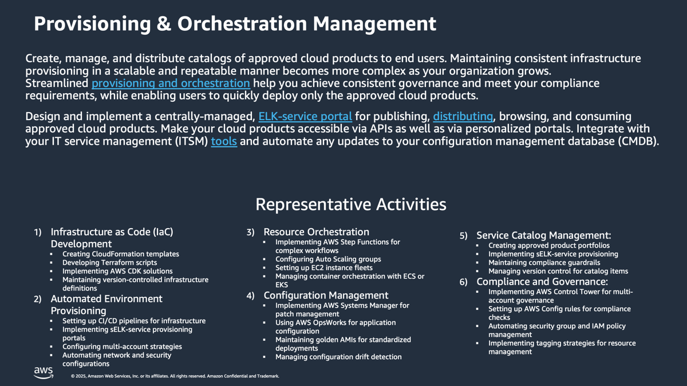

# Provisioning and Orchestration-Discovery-and-Analysis

**Confluence Page:** https://healthedge.atlassian.net/wiki/spaces/CP1/pages/5055184948/Provisioning%20and%20Orchestration-Discovery-and-Analysis

**Created by:** David Helmuth on August 28, 2025  
**Last modified by:** David Helmuth on September 12, 2025 at 02:57 PM

---

Overview
========

Workshop Logistics
------------------

### **Current State Meeting Date Time**: 08/01/2025 - 1:00 PM Eastern

### Meeting Recap: [Recap: AWS Migrations: Current State Workshop - Provisioning and Orchestration August 1 | Meeting | Microsoft Teams](https://teams.microsoft.com/l/meetingrecap?driveId=b%21DB_OfQ-W_k6DoO-fS6Jw4YoE7vNKRg1Gun3YRU7wS_sYc6TQyp3_Q4FbkV6MJhPe&driveItemId=01FHYOWIRKZONJUAMLWNAJWL6ZOTYGIJAQ&sitePath=https%3A%2F%2Fhealthedgetrial-my.sharepoint.com%2F%3Av%3A%2Fg%2Fpersonal%2Fdavid_helmuth_healthedge_com%2FESrLmpoBi7NAmy_ZdPBkJBABcmQ-76rWYtf0ixoYtiNH_Q&fileUrl=https%3A%2F%2Fhealthedgetrial-my.sharepoint.com%2Fpersonal%2Fdavid_helmuth_healthedge_com%2FDocuments%2FRecordings%2FAWS%2520Migrations%2520Current%2520State%2520Workshop%2520-%2520Provisioning%2520and%2520Orchestration-20250801_120958-Meeting%2520Recording.mp4%3Fweb%3D1&iCalUid=040000008200E00074C5B7101A82E008000000003F23923E9E01DC01000000000000000010000000AA0D988A28DB1E47BB6B20CC5645FB71&threadId=19%3Ameeting_ZjA1N2M1ZDktYWIzMy00MTJiLWFjMDItMGM0MDE3ZjFmNDY4%40thread.v2&organizerId=9a861b6c-a7c1-4635-82f7-eed113ca1cb5&tenantId=9c9d9fee-9dfb-4e27-b259-10369fa1acf2&callId=37358e23-c045-455c-a45c-17f20fa694e7&threadType=meeting&meetingType=Scheduled&subType=RecapSharingLink_RecapCore)

HealthEdge Current State Summary
================================

The Provisioning and Orchestration capability at HealthEdge is a complex, multi-faceted operation that manages the creation, deployment, and maintenance of infrastructure and applications across four major business units (HRP, WellFrame, Source, and Guiding Care). Each unit has developed distinct approaches ranging from highly automated systems using Kubernetes and cloud-native tools to more traditional VM-based deployments, reflecting their unique technical requirements and maturity levels.

Policy
------

### Summary

Policies across the organization demonstrate significant variation in ownership and implementation. HRP relies on the Metamorphics team with template-based approaches, WellFrame maintains DevOps ownership with controlled developer access, Source operates under complete DevOps control, and Guiding Care splits ownership between infrastructure and DevOps teams. These policies reflect each unit's operational needs while maintaining necessary security and compliance standards.

### Headlines

1. HRP:

* Owned by Metamorphics team - the Metamorphix team is led by Chris Gruska and Rahul Konidala.
* Brijesh and Vaugh in Cloud Application Services (CAS) are users of the automation the Metamorphix team delivers.
* Uses Ansible/VMware/VX Rail (hardware that was being replaced for SaaS customers) / vRA (vRealize Automation) /VMware for implementation.
* Based on templates for VM provisioning
* Policies integrated with Salesforce for customer management
* Security and compliance policies built into templates

WellFrame:

* DevOps team owns policies
* Developers have limited creation rights
* New services require review process
* Kubernetes-centric policy approach

Source:

* Complete DevOps ownership of orchestration
* Minimal VM infrastructure policies
* Container-focused policies
* Azure Bicep code policies for resource management

Guiding Care:

* Split policy ownership between Infrastructure and DevOps teams
* Policies based on virtual machine cloning
* Manual policy implementation through documentation
* Application deployment policies via shared volumes

Process
-------

### Summary

The process landscape is anchored by HRP's comprehensive Salesforce-based system for customer onboarding, environment provisioning, and change management. WellFrame and Source utilize modern, container-based processes with automated pipelines, while Guiding Care maintains a more traditional approach combining manual and automated steps. All units integrate various levels of security, monitoring, and backup processes into their workflows.

### Headlines

2. HRP:

* Salesforce-centered customer onboarding process:

  + Sales team initiates account in SFDC
  + Environment provisioning starts before contract signing
  + Standard two-environment (DEV/TEST) deployment
  + Network setup includes VPN, domain controllers
  + Customer contact management
  + Time zone configuration
  + CloudOPS notification group creation
  + Project team assignment
  + Infrastructure ticket management
* Post-deployment processes:

  + Environment handoff documentation
  + Automation configuration
  + Monitoring setup
  + Password management in Vault
  + Confluence updates
* Audit and compliance tracking through SFDC
* ITIL and ITSM process integration
* Change management through SFDC
* Integration with security tools, SolarWinds, and backup systems

WellFrame:

* Kubernetes-based deployment process
* CI/CD pipeline integration
* Service owner empowerment
* Service review process for production deployments

Source:

* Container-focused deployment process
* Pipeline-driven deployments
* Azure Bicep code for resource management
* Ansible for Linux deployments
* Manual process for remaining VM infrastructure

Guiding Care:

* 200-page manual process documentation
* Two-team process flow:

  + Infrastructure team handles VM provisioning
  + DevOps team manages application deployment
* Shared volume mounting for application servers
* IIS/.NET application deployment process
* Team City pipeline for deployment automation

Tools
-----

### Summary

The tooling ecosystem varies significantly across units, reflecting their different technical approaches. HRP employs a combination of Ansible, VMware, VX Rail, and Salesforce; WellFrame and Source focus on Kubernetes and modern CI/CD tools; and Guiding Care uses VMware and Team City. This diversity of tools supports each unit's specific infrastructure and application requirements while maintaining their operational effectiveness.

### Headlines

HRP:

* Metamorphics (Ansible-based automation)
* VX Rail for infrastructure management
* VMware VRA for resource automation
* Salesforce for service catalog and tracking
* VM templates for standardized deployments
* Vault for password management
* Confluence for documentation
* SolarWinds for monitoring
* Backup tools integration

WellFrame:

* Kubernetes orchestration
* CI/CD pipelines
* Container management tools

Source:

* Kubernetes
* Azure Bicep
* Ansible for Linux deployments
* Helm charts
* Azure PaaS services

Guiding Care:

* VMware for virtualization
* Team City pipeline
* Shared volume management
* IIS servers
* [ASP.NET](http://ASP.NET) application tools

People
------

### Summary

The organizational structure reflects a global delivery model with teams distributed between the US and India. HRP maintains the largest operation with distinct DevOps and SaaS teams, WellFrame operates with a lean US-based team and distributed responsibilities, Source balances US and India DevOps teams, and Guiding Care separates infrastructure and DevOps responsibilities geographically. This structure enables 24/7 operations while maintaining specialized expertise in each unit.

### Headlines

HRP:

* DevOps Team:

  + 60-70% India-based
  + 30-40% US-based
  + Total ~7-8 members
* SaaS Operations Team:

  + 60% US-based
  + 40% India-based
  + ~29 deployment engineers
* Additional support from:

  + Database Team
  + OS Team
  + Infrastructure Team

WellFrame:

* Small US-based DevOps team (2 people)
* Service owners handle most responsibilities
* Platform engineering focus

Source:

* DevOps team composition:

  + 6 US-based members
  + 4 India-based members
  + ~2 focused on orchestration
* Multiple responsibility areas

Guiding Care:

* Infrastructure team:

  + ~3 people US-based
  + Focuses on VM management
* DevOps team:

  + ~12 people India-based
  + Handles application deployment
* Clear separation between infrastructure and application teams

| Template | DraftGreen | In Review | Baseline |
| --- | --- | --- | --- |

Operational Readiness State (ORS)
---------------------------------

The Operational Readiness State for HealthEdge's Provisioning and Orchestration capability will leverage AWS Managed Services (AMS) while maintaining critical existing processes. The state combines AWS Service Catalog and CloudFormation for standardized infrastructure provisioning with HealthEdge's established Salesforce-based customer management system. This hybrid approach preserves business unit-specific requirements while standardizing infrastructure management through AMS. The model maintains existing global delivery teams focusing on application-specific deployments while transitioning infrastructure management to AMS. Critical existing processes such as customer communication, audit trails, and compliance tracking will continue through Salesforce while integrating with AWS services. This state enables HealthEdge to benefit from AWS's native services and AMS expertise while preserving their established customer management processes and business unit autonomy in application deployment.*.*

Policy Changes
--------------

* Standardize provisioning policies across all business units through AWS Service Catalog
* Implement unified tagging policies aligned with AWS standards and existing SFDC tracking requirements
* Maintain existing ITIL/ITSM processes through SFDC integration with AWS
* Establish clear policy boundaries between AMS-managed services and business unit-specific needs
* Define standard security and compliance policies that align with existing HRP audit requirements
* Maintain customer-specific provisioning policies through SFDC while leveraging AWS automation

Process Changes
---------------

* Maintain (expand?) SFDC as the primary customer interface and tracking system
* Integrate AWS Service Catalog with SFDC for automated provisioning workflows
* Leverage AMS for standardized infrastructure provisioning while maintaining business unit-specific application deployments
* Transform existing VM-based templates into AWS AMIs and container images
* Implement automated environment creation through AWS CloudFormation with AMS
* Maintain existing customer communication and audit trails through SFDC
* Integrate existing monitoring and backup processes with AWS native services through AMS

Tooling Changes
---------------

* AWS Service Catalog for standardized resource provisioning
* AWS CloudFormation for infrastructure as code
* Continue using SFDC for service requests and tracking
* Integrate existing CI/CD pipelines with AWS services
* Leverage AWS Control Tower through AMS for multi-account management
* Maintain Kubernetes deployments through EKS for WellFrame and Source
* Use AWS Systems Manager for configuration management
* Implement AWS backup and monitoring tools through AMS

People/Org Changes
------------------

* AMS team handles infrastructure provisioning and management
* Existing teams focus on application-specific deployments:

  + HRP SaaS team maintains customer-specific configurations
  + WellFrame DevOps manages container deployments
  + Source DevOps handles cloud-native applications
  + Guiding Care teams manage application deployments
* Maintain current global delivery model with US/India teams
* Retrain existing teams on AWS services and AMS processes
* Clear definition of responsibilities between AMS and internal teams
* Maintain existing SFDC expertise for customer management