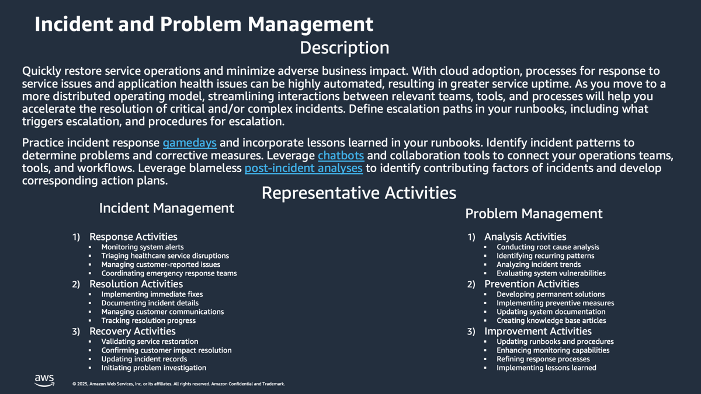

# Incident and Problem Management Discovery-and-Analysis

**Confluence Page:** https://healthedge.atlassian.net/wiki/spaces/CP1/pages/4867032324/Incident%20and%20Problem%20Management%20Discovery-and-Analysis

**Created by:** Chris Falk on June 16, 2025  
**Last modified by:** David Helmuth on September 12, 2025 at 02:44 PM

---

---

---

Overview
========

Effectively managing events and incidents is a critical function for supporting service reliability, quality, and confidence.  Incidents in this context can generally be defined as any action that results in an adverse impact to service reliability, quality, and confidence.  Most IT organizations have a process for identifying and managing events and incidents.  These processes vary on their level of maturity, automation, and scope.  Existing processes are usually well understood by application teams and workload owners.  Existing IT organization processes and solutions for event and incident management need to be reviewed and updated to include Cloud Operations so that the level of effort for workload and application owners is minimized for cloud deployments.

Events and incidents that occur on-premises are usually linked to a server or virtual machine.  In the AWS Cloud, this is expanded to include EC2 instances (similar to virtual machines) and services managed by AWS such as Amazon Relational Database Service (RDS).  Most customers will need to continue to manage on-premises incidents and events and expand to supporting AWS related incidents and events.

Your existing solution and tools for event and incident management may include logging, monitoring, and runbooks (either documented or automated processes).  AWS provides a number of services that can complement and enhance your existing architecture and tools that support event and incident management.  These services are a mostly covered in the [Management & Governance category in AWS](https://aws.amazon.com/products/management-and-governance/) and include AWS Health, AWS Support, Amazon CloudWatch, Amazon ElasticSearch, and AWS Systems Manager.  Amazon CloudWatch, AWS Systems Manager, and Amazon ElasticSearch can be used to support your on premises workloads as well as AWS native workloads.

As part of our working sessions we’ll first establish the customers policy around incident initiation (user-generated vs. system-generated). Furthermore, we’ll establish the customers preference on supporting tools and whether those will be native AWS tools (i.e. CloudWatch, AWS support center, Ops center) or external third party tools. Additionally, we’ll need to establish whether Incident Management will need to be integrated to other ITSM processes and tooling such as event, change and configuration (CMDB) management.  AWS provides integrations such as the [AWS Service Management Connector for ServiceNow](https://docs.aws.amazon.com/servicecatalog/latest/adminguide/integrations-servicenow.html) to help customers integrate their existing ITSM tools and workflows with AWS services.

Meeting Logistics:
------------------

### Current State Meeting Date Time: To Be Re-Scheduled

### Meeting Recap: TBD

Question Bank
=============

The sample questions provided in this section are intended to help you solicit input that will shape your Event and Incident Management approach on AWS. Questions may be eliminated if they aren’t applicable to your situation.  As you progress through answering the questions you may find that a question previously answered also covers another question listed.  This is to be expected since a conversation may form around a particular area and answer a number of questions all at once.  Also, if an existing process or architecture is documented, it may answer a large number of questions upfront.  The existing documentation should be reviewed as long as it's accurate.

Current State
=============

*One to two paragraphs that describe the current capability. This can also include diagrams/etc.*

Incident

* What is the current incident and event management process today?  Is it documented somewhere?  Is the documentation accurate?
* What is your current logging and monitoring process and tools today?  Is it documented somewhere?  Is the documentation accurate?
* Do you use multiple cloud providers?  Is your incident / event management process designed to support all of them in a similar way?

Logging

* Is there a requirement to continue to use any existing tools / services?
* What is your current logging process and tools today?  Is it documented somewhere?  Is the documentation accurate?

Monitoring

* What is your current monitoring process and tools today?  Is it documented somewhere?  Is the documentation accurate?
* Do you have predefined thresholds for alarms that are configured today?  Who defines these?  How are they updated?
* Do you have an escalation process for alarms?

Policy
------

*Provide links to relevant company policies stored on the Hub, Sharepoint, or other locations. (Please grant access to AWS Team for links provided)*

Incident

* Do you have SLA/SLO requirements?  Is this calculated and reported?
* Are incident records maintained for all reported incidents?

Logging

* Do you have a predefined log format?
* Have you standardized on any logging libraries?
* Do you have any automation configured such as scripts that are run automatically based on log messages?
* What is the retention period for your logs? Are there any compliance requirements?

Monitoring

* Do you monitor low utilization as well as high utilization?
* Do you create metrics based on pattern matching in logs?  (e.g. count on "ERROR" string)
* Are there any custom dimensions such as application id to your metrics?

Process
-------

*Include details on the process flow.*

Incident

* Is there a procedure for assigning, monitoring and communicating the progress of incidents?
* Do you have a defined escalation path for critical incidents?
* What are your incident priority levels?
* Is there a procedure for the closure of incidents?
* Is there a documented and followed process for root cause analysis, correction of error after an incident has occurred?
* Are resolved and closed incident records updated and clearly communicated to the Service Desk, customers and other parties?
* Are reports regularly produced for all the teams contributing to the incident resolution process, concerning incident status?

Logging

* Does your logging process differ between environments? (e.g. development: developers configure and setup, no centralized monitoring versus production: central ops and workload owners configure and setup)
* Are you using containers? How do you capture logs from your containers?
* Where are current logs stored? What type of media? What is the durability?
* How does troubleshooting and incident management integrate with your logging solution?
* Do you have any automated log analysis, filtering, or alarming based on your logs?

Monitoring

* Does your monitoring process differ between environments? (e.g. development: developers configure and setup, no centralized monitoring versus production: central ops and workload owners configure and setup)
* What software / tools are you using for dashboarding and visualization?
* Do workload / application owners have their own dashboards that they manage?  Are dashboards created to monitor / manage operations across workloads / applications?

Tools
-----

*Describe the tools/applications are being used to support/implement the process.*

Incident

* What tools do you currently use to manage incidents? (e.g. ServiceNow, Jira)
* What systems or alerts feed into the incident management process?
* What system do you use to route incidents? (emails, SMS messages, slack notifications, etc.)

Logging

* What tools and services are used for log capture and aggregation today?
* Do you use any data analytic tools against your logs?
* What log analysis and visualization tools are you using today?
* Is the logging configuration validated and confirmed prior to a workload entering production?
* Do you have a standard set of logs and metrics that applies to all your servers?
* Do you use any log aggregation solutions such as ElasticSearch?
* What operating systems do you currently support and configure with your existing logging solution?
* What compute types do you currently support for logging? (physical servers, virtual machines, containers, serverless frameworks)
* What software agents are required to be installed and running to support existing logging and monitoring tools?  How are the agents installed and updated?

Monitoring

* Do you monitor workload and/or application availability using any tools today?
* Is the monitoring configuration validated and confirmed prior to a workload entering production?
* What operating systems do you currently support and configure with your existing monitoring solution?
* What compute types do you currently support for monitoring? (physical servers, virtual machines, containers, serverless frameworks)
* What software agents are required to be installed and running to support existing monitoring tools?  How are the agents installed and updated?

People
------

*Who is involved in the various aspects of this process.*

Incident

* Are there any third parties involved involved in the incident management process? (e.g. managed service providers, global system integrators, contractors, support services, etc.)
* Is there an incident manager responsible for managing and escalating incidents?

Logging

* Are logging responsibilities between operations and application teams centralized, distributed or both?
* Who is granted access to view platform, application, and security logs?

Monitoring

* Are monitoring responsibilities between operations and application teams centralized, distributed or both?
* Do application teams own and configure their own logs and metrics for their applications and workloads?  How?

---

AWS Operational Readiness State
===============================

| TemplateGreen | Draft | In Review | Baseline |
| --- | --- | --- | --- |

* Agents installed and incorporated for logging and metrics capture on all existing AWS servers and platforms.
* Logging / metrics agents incorporated into standard AMIs and AMI creation process for all platforms.
* Baseline metrics capture for all servers and platforms to include: CPU, Memory, Disk Utilization.
* Baseline logs capture for all servers and platforms to include all system logs.
* Decision on any variance in metrics capture between non production and production environments and variance incorporated into separate configuration files.
* Decision on log formatting standards (e.g. json / tab delimited, required fields)
* Decision on log group and log stream naming standards
* Additional baseline metrics captured for all servers and platforms defined.
* Agent configuration file version controlled and configured to support baseline metrics definition.
* Agent configuration file version controlled and configured to support baseline logs definition.
* Agent configuration updated on all servers to capture baseline metrics.
* End user instructions documented and available describing how to include additional metrics and log files for capture within an account and region.
* Automated agent update process defined and deployed to support all regions and accounts.
* IAM Instance Profile / Role defined and deployed to all accounts to support metric and logs capture.
* Standard alarms and thresholds for CPU, memory, and disk space utilization deployed for each server in production environment.
* Notification group created and configured for standard alarms.
* AWS event alerting configured and deployed using a solution such as AWS Health Aware.
* Test logging for at least one server in each region and account.
* Test metrics capture for at least one server in each region and account.
* Test alarming for at least one server in each region and account.

*Describe your initial thoughts.*

Policy Changes
--------------

*Are any changes required?*

Process
-------

*Are any changes required?*

Tooling Changes
---------------

*Are any changes required?*

People/Org Changes
------------------

*Are any changes required?*