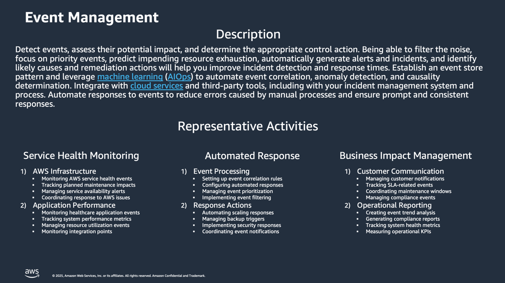

# Event Management-Discovery-and-Analysis

**Confluence Page:** https://healthedge.atlassian.net/wiki/spaces/CP1/pages/5053841507/Event%20Management-Discovery-and-Analysis

**Created by:** David Helmuth on August 28, 2025  
**Last modified by:** David Helmuth on September 12, 2025 at 02:39 PM

---

Overview
========

Workshop Logistics
------------------

### **Current State Meeting Date Time**: 08/11/2025 - 3:00 PM Eastern

### Meeting Recap: [Recap: AWS Migrations: Current State Workshop - Event Management August 11 | Meeting | Microsoft Teams](https://teams.microsoft.com/l/meetingrecap?driveId=b%21DB_OfQ-W_k6DoO-fS6Jw4YoE7vNKRg1Gun3YRU7wS_sYc6TQyp3_Q4FbkV6MJhPe&driveItemId=01FHYOWIU6J4O3SGAGUNHJTECPRLI3IBYL&sitePath=https%3A%2F%2Fhealthedgetrial-my.sharepoint.com%2F%3Av%3A%2Fg%2Fpersonal%2Fdavid_helmuth_healthedge_com%2FEZ5PHbkYBqNOmZBPitG0BwsBazVxQ6lYg2ZCOpLTxlzSJA&fileUrl=https%3A%2F%2Fhealthedgetrial-my.sharepoint.com%2Fpersonal%2Fdavid_helmuth_healthedge_com%2FDocuments%2FRecordings%2FAWS%2520Migrations%2520Current%2520State%2520Workshop%2520-%2520Event%2520Management-20250811_140605-Meeting%2520Recording.mp4%3Fweb%3D1&iCalUid=040000008200E00074C5B7101A82E00800000000277A29AD7002DC01000000000000000010000000E54FF0818A8B854A85368EF84BF9EF04&threadId=19%3Ameeting_YjNkNGMwMGYtZGRmOS00NTNjLWFjMDAtYWY2MThmYzZmMGRi%40thread.v2&organizerId=9a861b6c-a7c1-4635-82f7-eed113ca1cb5&tenantId=9c9d9fee-9dfb-4e27-b259-10369fa1acf2&callId=dfc41efc-38de-4028-b7c6-6f6ab0dc6ce9&threadType=meeting&meetingType=Scheduled&subType=RecapSharingLink_RecapCore)

HealthEdge Current State Summary
================================

Note: Does David H. need to review with GC, my notes don’t mention.

Event Management at HealthEdge operates across multiple business units with each having distinct approaches while working toward consolidated solutions. The capability focuses on detecting events, assessing their impact, and determining appropriate control actions across infrastructure and applications. As organizations prepare for AWS migration, there's a common goal to establish centralized event stores and standardized monitoring approaches to improve event correlation and response times. The BU’s are working toward consolidated logging and monitoring solutions as part of their AWS migration efforts, with plans to implement central event stores and standardized monitoring approaches.

Policy
------

### Summary

Policies vary across business units but share common themes of distributed responsibility. HRP operates under an informal shared responsibility model, while Wellframe maintains formal Service Review documentation with strict standards for new services. Source maintains standalone policies with specific SOPs for alert responses. Each unit has defined ownership structures, though compliance levels vary, with Wellframe notably reporting only 33% compliance for existing services.

### Headlines

* HRP:

  + Shared responsibility model between Todd Knight's team (monitoring infrastructure), Brijesh's team (application/logging), and Infrastructure Ops
  + Security auditing requirements for Active Directory logging levels
  + Informal policy structure, tracked through tickets and requests

  Wellframe:

  + Covered in Service Review documentation and monitoring standards
  + Implemented as Jira epic with checklist requirements
  + Standards owned by Wellframe DevOps, implementation by service teams
  + Currently at 33% compliance for existing services
  + Strict enforcement for new services requiring compliance before go-live

  Source:

  + Stands as its own policy
  + DevOps has Standard Operating Procedures (SOPs) for alert responses
  + Database team owns database alerting policies
  + DevOps owns application and infrastructure alerting policiesProcess

Process
-------

### Summary

Processes range from informal to highly structured across the organizations. HRP relies on informal ticketing and weekly monitoring meetings, while Wellframe implements a structured Service Review process with both manual and automated components. Source maintains daily operations meetings to review alerts and dashboards, with established processes for new service integration. All units are preparing process modifications for AWS migration.

### Headlines

* HRP:

  + Informal process through ticketing system
  + Weekly server monitoring meetings to review and update monitoring needs
  + Root cause analysis process for incidents

  Wellframe:

  + Service Review process with checklist implementation
  + 50% manual steps (PagerDuty setup, alert creation)
  + 50% automated steps (OpenTelemetry SDK configuration)

  Source:

  + Daily operations meeting to review alerts and dashboards
  + Established process for new application monitoring
  + Minimal steps required for new service integration
  + Processes need to be rewritten for Azure to AWS migration

Tools
-----

### Summary

Each business unit maintains its own tool stack while working toward consolidation. HRP uses AppDynamics and SolarWinds, Wellframe employs Datadog and PagerDuty, and Source utilizes Grafana and Azure alerting. A central Grafana instance is being developed to consolidate monitoring across all units. Integration with PagerDuty for alerting is a common thread across organizations.

### Headlines

HRP:

* AppDynamics for application monitoring
* SolarWinds for server/infrastructure monitoring
* ELK for application team logging
* Active Directory for security auditing

Wellframe:

* Datadog for monitoring
* PagerDuty for alerting
* OpenTelemetry SDK
* Central Grafana instance (in progress)

Source:

* Grafana for dashboards and alerting
* Azure alerting
* Application Insights for synthetic transactions
* ServiceNow and PagerDuty integration
* Log Analytics

People
------

### Summary

The organizational structure across units reflects a distributed responsibility model with specialized teams. HRP divides responsibilities between Todd Knight's monitoring team, Brijesh's application team, and Infrastructure Ops. Wellframe splits ownership between DevOps and service teams. Source distributes responsibilities across database teams, DevOps, and a dedicated Observability/SRE team. All units are working to clarify roles and responsibilities as they move toward AWS migration.

### Headlines

HRP:

* Todd Knight's team owns monitoring infrastructure and tools
* Brijesh's team handles application logging
* Infrastructure Ops team manages infrastructure monitoring
* Incident management team handles customer notifications

Wellframe:

* Wellframe DevOps owns standards and certification
* Service teams handle implementation
* Low compliance requires additional focus on existing services

Source:

* Database team owns database alerting
* DevOps team owns application and infrastructure alerting
* Observability/SRE team (Colm/Troy) taking ownership of dashboards
* Developers contribute to monitoring implementation

AWS Operational Readiness State
===============================

| Template | DraftGreen | In Review | Baseline |
| --- | --- | --- | --- |

Summary
-------

The Operational Readiness State for Event Management Operations Capability leverages AWS AMS to provide comprehensive event management and monitoring services.This state focuses on maximizing system availability while minimizing incident impact through standardized processes and AWS-native tooling. [1](https://w.amazon.com/bin/view/WWCF_IPAT/FinTech/CoreEngineering/Teams/FAE/OR/) The implementation includes standardized event management policies aligned with AWS AMS operational procedures, clear roles and responsibilities between HealthEdge and AMS teams, and established incident escalation [paths.](http://paths.Th) [2](https://w.amazon.com/bin/view/AWS_ES_RCAM/EventReadiness/) The system utilizes AWS CloudWatch for metric collection and alerting, AWS Systems Manager for operational runbook execution, and AWS GuardDuty for security alerts, ensuring a robust monitoring and response framework. [3](https://w.amazon.com/bin/view/AWSSupportPortal/Product/Marketing/Events/). This operational state emphasizes proactive monitoring, automated alerting, and streamlined incident management processes to maintain optimal service performance and availability.

Policy Changes
--------------

* Implement standardized event management policies aligned with AWS AMS operational procedures
* Establish clear roles and responsibilities between HealthEdge and AMS teams for event management
* Define and document event severity levels and escalation thresholds
* Create policies for proactive security changes and incident response as per AMS service description

Process Changes
---------------

* Leverage AMS Alert Management Process for handling events and incidents
* Implement standardized monitoring and alerting processes using CloudWatch and other AWS tools
* Follow AMS Operations team's 24/7 alert investigation and response procedures
* Establish clear incident escalation paths and communication channels
* Regular review and updates of monitoring thresholds and alert configurations

Tooling Changes
---------------

* Utilize AWS CloudWatch for metric collection and alerting
* Implement AWS Systems Manager for operational runbook execution
* Use AWS GuardDuty for security alerts
* Leverage OpsCenter for convenient execution of SSM Automation
* Deploy AMS Operations Dashboard for alert visibility and management
* Implement central event stores and standardized monitoring approaches

People/Org Changes
------------------

* Establish dedicated AMS Operations team for 24/7 monitoring and response
* Define clear ownership between HealthEdge teams and AMS Operations
* Train team members on AMS tools and processes
* Implement on-call rotations and escalation paths
* Regular collaboration between HealthEdge and AMS teams for operational improvements

Examples
--------

* Minimize change impact: Separate non production and production accounts, ideally for each major tier 1 application.
* ITSM / Change Tracking tool updated to support change requests for AWS resources.
* Approvers for changes identified and integrated with change request / tracking / notification. (e.g. database change approvers, infrastructure approvers, security change approvers)
* Gated review and approval process to deploy new AWS resources or change AWS resources in production environment
* Rollback process defined for each change applied to production. (Either manual or automated)
* Tests defined for each change applied to production. (Either manual or automated)
* Gated promotion process for new changes introduced into production. (Either via CI/CD or manually)
* Shared change calendar for each account that defines upcoming changes.
* Shared change calendar that defines upcoming changes for all accounts.
* Notification lists for each account and region to provide notification to all stakeholders of upcoming changes implemented as SNS topics.
* Automation runbooks defined for changes in Production (e.g. Stop Instance, Start Instance).
* Automation runbooks integrated with change calendar.
* Permissions to production account authorized and approved by security and management with MFA enabled for these identities.
* Validate least required privilege principle for all production account identities (including roles and credential keys used by automation, third parties, software).
* All configuration files for any standard platform and application software that will change on running instances, checked in and managed in version control.
* Release runbooks or CI/CD pipeline for all Tier 1 applications entering production.
* Defined catalog of standard AWS resources as infrastructure as code, managed in version control
* Published maintenance windows and notifications prior to maintenance windows for each account and region at a predetermined interval.