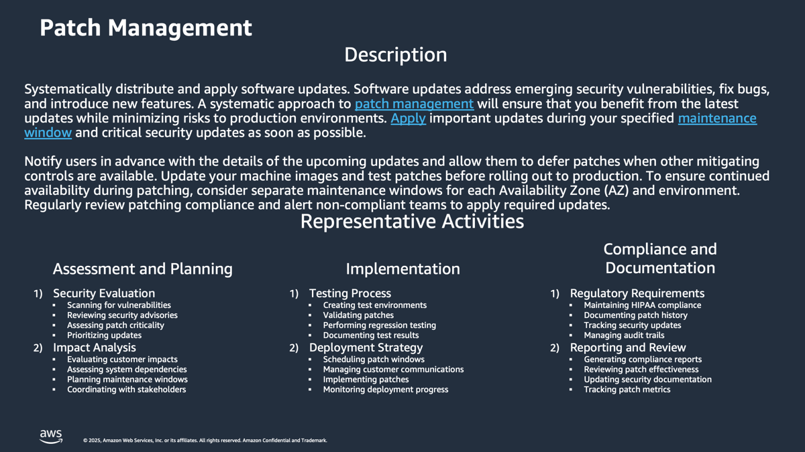

# Patch-Management-Discovery-and-Analysis

**Confluence Page:** https://healthedge.atlassian.net/wiki/spaces/CP1/pages/4867032264/Patch-Management-Discovery-and-Analysis

**Created by:** Chris Falk on June 16, 2025  
**Last modified by:** David Helmuth on September 12, 2025 at 05:01 PM

---

---

---

Overview
========

Patch management is a core IT function that is part of Application Lifecycle Management, Security Management, and Change Management.  Most IT organizations have a defined process for scheduling and applying patches to their servers and applications.  Patching can be viewed in multiple layers, including Operating System, Commercial Off The Shelf Software (COTS), and custom applications.  Patches are normally fixes applied to an application to fix a security vulnerability or a defect.  Most vendors classify the severity and importance levels for patches that they release.  Patches do not normally introduce new features or changes that would require reconfiguration or managed upgrades of an application.  Customers may use a number of tools to manage patching for their servers, including Windows Server Update Services (WSUS), Windows Update, YUM, etc.  Many organizations automate their patching with their own scripts and automation tools such as Ansible and Chef.  AWS includes services and features to help you manage patching in the AWS cloud as well as on-premises.  AWS provides [AWS Systems Manager Patch Manager](https://docs.aws.amazon.com/systems-manager/latest/userguide/systems-manager-patch.html), [AWS Systems Manager Inventory](https://docs.aws.amazon.com/systems-manager/latest/userguide/systems-manager-inventory.html), [AWS Systems Manager Maintenance Windows](https://docs.aws.amazon.com/systems-manager/latest/userguide/systems-manager-maintenance.html), [AWS Systems Manager Change Calendar](https://docs.aws.amazon.com/systems-manager/latest/userguide/systems-manager-change-calendar.html), and [AWS Systems Manager Automation Runbooks](https://docs.aws.amazon.com/systems-manager/latest/userguide/automation-documents.html) to help you automate and apply patches to your servers at scale.

Workshop Logistics
------------------

### **Current State Meeting Date Time**: 07/22/2025 - 4:00 PM Eastern

### Meeting Recap: [Recap: AWS Migrations: Current State Workshop - Patch Management July 22 | Meeting | Microsoft Teams](https://teams.microsoft.com/l/meetingrecap?driveId=b%21DB_OfQ-W_k6DoO-fS6Jw4YoE7vNKRg1Gun3YRU7wS_sYc6TQyp3_Q4FbkV6MJhPe&driveItemId=01FHYOWIW2KJDQS2FAURGK3D5KGVLYPSCP&sitePath=https%3A%2F%2Fhealthedgetrial-my.sharepoint.com%2F%3Av%3A%2Fg%2Fpersonal%2Fdavid_helmuth_healthedge_com%2FEdpSRwlooKRMrY-qNVeHyE8BimCYlwn8g3ngau0D4KCi-Q&fileUrl=https%3A%2F%2Fhealthedgetrial-my.sharepoint.com%2Fpersonal%2Fdavid_helmuth_healthedge_com%2FDocuments%2FRecordings%2FAWS%2520Migrations%2520Current%2520State%2520Workshop%2520-%2520Patch%2520Management-20250722_150231-Meeting%2520Recording.mp4%3Fweb%3D1&iCalUid=040000008200E00074C5B7101A82E00800000000B7D74CE3D8F5DB01000000000000000010000000796D5F6F4118A1488ABC344E68DB5E4B&threadId=19%3Ameeting_NDgxOGVkMzktODljNC00MDRhLWJhNDMtM2RiZGU1ZTkyZDVi%40thread.v2&organizerId=9a861b6c-a7c1-4635-82f7-eed113ca1cb5&tenantId=9c9d9fee-9dfb-4e27-b259-10369fa1acf2&callId=d6432621-e75c-4813-90fb-a7b6ff8478da&threadType=meeting&meetingType=Scheduled&subType=RecapSharingLink_RecapCore)

Current State
=============

Note: The teams face common challenges around scheduling maintenance windows, coordinating with customers, and balancing patching requirements with business operations. Security team provides overall guidance while individual BUs handle implementation according to their specific environments and requirements.

Policy
------

### Summary

Security team establishes enterprise-wide standards and timing for patch implementation, with a 30-90 day window depending on severity. Critical security patches require implementation within 30 days, while non-critical updates allow up to 90 days. Each BU has specific contractual obligations - Source requires monthly production patching, Guiding Care aligns with code releases, HRP negotiates monthly windows with customers, and Wellframe performs weekly container image updates.

### Headlines

* Security team owns setting the timing and standards across BUs
* Patch implementation windows: 30-90 days depending on severity
* Critical patches require faster implementation (30 days)
* Non-critical patches allow up to 90 days
* Contractual obligations:

  + Source: Must patch production every 30 days
  + GC: Maintains regular patching cadence aligned with code releases
  + HRP: Monthly negotiated windows with customers
  + Wellframe: Weekly container image updates

Process
-------

### Summary

Each BU follows distinct processes aligned with their technology stack and customer requirements. HRP negotiates monthly maintenance windows with customers, making scheduling challenging due to 24/7 operations. Source maintains an annual schedule with 6-hour monthly windows. Guiding Care coordinates patching with code releases, while Wellframe employs automated processes through Kubernetes with weekly container image updates. Database patching is handled separately by a dedicated team.

### Headlines

* HRP:

  + Monthly negotiated maintenance windows with customers
  + Challenging to schedule due to 24/7 customer operations
  + Coordinated with database team when possible
* Source:

  + Annual schedule defined at year start
  + 6-hour monthly maintenance window
  + Separate from application updates
* GC:

  + Aligned with code releases
  + OS patching has lower priority
  + Limited maintenance windows
* Wellframe:

  + Automated process through Kubernetes
  + Weekly container image updates
  + Infrastructure updates during maintenance windows

Tools
-----

### Summary

The security team utilizes Vulcan as a meta tool, integrating with Tanium and Wiz.io for vulnerability detection. Each BU employs specific tools: HRP uses WSUS, RedHat Satellite, and Tanium; Source relies on Tanium and Wiz.io ; Guiding Care uses Tanium; and Wellframe leverages Google Kubernetes Engine release channels, Debian unattended upgrades, and Google Patch Manager.

### Headlines

* Security Team Tools:

  + Vulcan (meta tool)
  + Tanium
  + Wiz.io
  + Crowdstrike (under consideration)
* BU-Specific Tools:

  + HRP: WSUS, RedHat Satellite, Tanium
  + Source: Tanium, Wiz.io
  + GC: Tanium
  + Wellframe: Google Kubernetes Engine release channels, Debian unattended upgrades, Google Patch Manager

People
------

Summary

The HRP patching teams are primarily based in Pune, India, with US-based oversight. HRP maintains approximately 5 team members in Pune, Source operates with 3 team members, Guiding Care has 3 India-based and 2 US-based team members, while Wellframe's DevOps team manages patching without a dedicated India team. Each team has designated leaders and coordinates with security and application teams as needed.

Headlines

* HRP:

  + Pune team handles execution (~5 people)
  + US team provides oversight and coordination
  + Manager: Sarbash
* Source:

  + 3 team members (Niraj and Bhanu)
  + Focus on security-specific patching
* GC:

  + 3 team members in India under Ghalib
  + 2 US-based team members for support
* Wellframe:

  + Managed by DevOps team
  + No dedicated India team
  + Service owners handle their respective areas

---

AWS Operational Readiness State
===============================

| Template | DraftGreen | In Review | Baseline |
| --- | --- | --- | --- |

Summary
-------

The Operational Readiness State for Patch Management leverages AWS Managed Services (AMS) to provide a comprehensive and automated approach to system updates.AMS handles all OS patching activities by promptly and consistently applying updates when released by supported OS vendors. [1](https://w.amazon.com/bin/view/AWSManagedServices/CSDM/AMS-PatchManagement-new/) The service operates through Patch Orchestrator in AMS Advanced, which is configured during onboarding and can be updated via RFC [process.](http://process.Ke) [1](https://w.amazon.com/bin/view/AWSManagedServices/CSDM/AMS-PatchManagement-new/). Key components include automated patch management through standardized change requests, 24/7 monitoring with proactive alarms, and complete incident management lifecycle.[1](https://w.amazon.com/bin/view/AWSManagedServices/CSDM/AMS-PatchManagement-new/) The system provides specialized handling for various tasks and maintains comprehensive patch compliance reporting with automatic SIM ticket generation for failed patches.[1](https://w.amazon.com/bin/view/AWSManagedServices/CSDM/AMS-PatchManagement-new/) This operational state ensures that customer resources remain secure and up-to-date while allowing customization of patching frequency and processes within AMS-managed AWS accounts. [1](https://w.amazon.com/bin/view/AWSManagedServices/CSDM/AMS-PatchManagement-new/) [2](https://w.amazon.com/bin/view/AWSManagedServices/Delivery/Training/Curriculum/PatchManagement/)

Policy Changes
--------------

* Implement standardized patch management through AMS's automated patch management policies
* Leverage AMS's secure and compliant AWS infrastructure management with established best practices
* Follow AMS's proactive security monitoring and remediation processes
* Establish clear maintenance windows with ability to support up to 300 instance targets
* Define service quotas that can be increased to 20 maintenance windows with auto-approval

Process
-------

* Utilize AMS's 24x7x365 monitoring with proactive alarms and complete incident management lifecycle
* Implement automated patch orchestration process with preemptive notifications
* Configure patch management during onboarding with ability to update via RFC process
* Follow standardized pre-patch scan and compliance check procedures
* Maintain regular post-patch compliance reporting and monitoring

Tooling Changes
---------------

* Leverage Patch Orchestrator as the primary patching solution
* Utilize AWS native tooling through AMS's automation-first approach
* Implement Patch Orchestrator Accelerate for patch events processing
* Use Systems Manager Patch Manager for automating security and other updates
* Enable automated validation and compliance reporting tools

People/Org Changes
------------------

* Engage AMS Delivery team for developing and maintaining patching solutions
* Utilize Patch Operations team consisting of Subject Matter Experts for:

* Ensuring seamless patch execution
* Managing patch deployments
* Handling patch failures
* Setting up ad-hoc maintenance windows

* Leverage AMS operations team for infrastructure management and monitoring
* Establish clear escalation paths to AMS support teams

Examples / References
---------------------

* Standard patch baselines defined and validated for each supported operating system that include critical and security patches.
* Decision on whether non security patches for each operating system should be included in the patch baseline, classifications, and delay to approve for installation.
* Self service automation for scanning and installing patches for a set of servers within accounts and regions.
* Required patching tags applied to all current servers in all regions and accounts.
* Required patching tags incorporated into AWS Organizations tag policy.
* One monthly patching window defined for non production servers across all regions and accounts for patch scanning.
* Daily missing patch scanning across all regions and accounts.
* One monthly patching window defined for production servers across all regions and accounts for patch scanning.
* One monthly patching window defined for non production servers across all regions and accounts for patch installation.
* One monthly patching window defined for production servers across all regions and accounts for patch installation.
* Decision on whether patched servers should include a reboot if needed on patch installation.
* Decision on whether existing servers that have an IAM Instance Profile Role attached should be updated to include IAM policies required to support AWS Systems Manager functions.
* Decision on whether newly launched EC2 instances should automatically be scanned / patched upon provisioning.
* Decision on whether newly launched EC2 instances in an autoscaling group should be scanned / patched upon provisioning.
* Automation in place to scan / install patches on instance launch, if necessary.
* Policy defined for handling application level patches including regular checks for updates that include critical / security patches. This should be incorporated into the onboarding process and communicated to all new users and owners of servers.
* Defined technical contact and on call to support patching issues for up to 24 hours after patch window completes.
* SNS topic per account and region that users can subscribe to in order to be notified of patching activities.
* Scheduled task and automation to apply patch baselines to servers across all regions and accounts.
* Reporting and notification process of failed patches for servers.
* Network test in each region and account to confirm that connectivity to all required repositories and endpoints is working.
* All required agents and software installed in order to support patching on all servers across regions and accounts.
* Test patch scanning for at least one server per region and account.
* Test patch installation for at least one server per region and account.
* Test patch reporting for patches installed on at least one server per region and account.
* AMI pipelines updated to include patch scanning and patch installation.
* Process defined for requesting patches out of the normal patching cycle.
* Process in place to execute patching process manually for server(s) within and across accounts and regions.