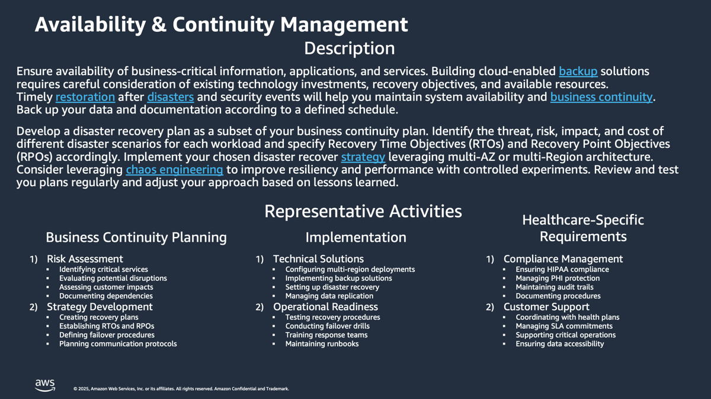

# Availability-and-Continuity-Management-Discovery-and-Analysis

**Confluence Page:** https://healthedge.atlassian.net/wiki/spaces/CP1/pages/4867032302/Availability-and-Continuity-Management-Discovery-and-Analysis

**Created by:** Chris Falk on June 16, 2025  
**Last modified by:** David Helmuth on September 12, 2025 at 02:51 PM

---

Availability and Continuity Management Discovery and Analysis
=============================================================

Overview
========

Implementing practices and processes to support high availability and continuity for your applications and workloads is essential in achieving service quality, customer satisfaction, and service level agreements.  Most IT organizations already establish required thresholds for recovery time objective (RTO) and recovery point objective (RPO).  These metrics along with measures of availability (e.g. 5 9's of availability) have a governing influence on the implementation and supporting processes for workloads and applications both on-premises and in the cloud.  There are a number of approaches and patterns to improve availability and continuity while minimizing downtime.  These include backup and recovery, defined automation for incidents, infrastructure as code, deployment automation, and multi-AZ and multi-region architectures.  Your organization will likely have existing processes and tools to support these areas.

The Availability and Continuity management discovery and analysis activity is focused on assessing a customers existing approach and future state requirements with respects to Policy, Process, People, and Tools. Areas of focus are high availability, backup and recovery, and disaster recovery (DR). These areas are interrelated.  For reference, you should review the questions included in this page to determine who should be included in a discovery workshop to help address the key area of focus. This may include existing operations personnel that handle backups, perform availability testing, and define reference architectures.  Input from stakeholders and operations management decision makers is also necessary to determine whether existing processes and tools must be reused, adapted, or retired for AWS. Input may also come from any managed service providers or third parties that may be performing and supporting these functions for the customer. These sample questions are provided to help you solicit input that will influence your solution architecture and supporting processes on AWS. Questions may be eliminated if they aren’t applicable.

Workshop Logistics
------------------

### **Current State Meeting Date Time**: 07/21/2025 - 4:00 PM Eastern

### Meeting Recap: [Recap: AWS Migrations: Current State Workshop - Availability & Continuity July 21 | Meeting | Microsoft Teams](https://teams.microsoft.com/l/meetingrecap?driveId=b%21DB_OfQ-W_k6DoO-fS6Jw4YoE7vNKRg1Gun3YRU7wS_sYc6TQyp3_Q4FbkV6MJhPe&driveItemId=01FHYOWISI2AHJLQ27HZGZGT4TMXKNP2E2&sitePath=https%3A%2F%2Fhealthedgetrial-my.sharepoint.com%2F%3Av%3A%2Fg%2Fpersonal%2Fdavid_helmuth_healthedge_com%2FEUjQDpXDXz5Nk0-TZdTX6JoBNAPgtr0D3rYHd3fEX0M1zQ&fileUrl=https%3A%2F%2Fhealthedgetrial-my.sharepoint.com%2Fpersonal%2Fdavid_helmuth_healthedge_com%2FDocuments%2FRecordings%2FAWS%2520Migrations%2520Current%2520State%2520Workshop%2520-%2520Availability%2520%2526%2520Continuity-20250721_150416-Meeting%2520Recording.mp4%3Fweb%3D1&iCalUid=040000008200E00074C5B7101A82E0080000000083E56583CFF5DB010000000000000000100000006F2D9804B2518042A47CA5E24B49DD88&threadId=19%3Ameeting_YmQwZWVhOTQtMjE1MC00MGZiLTgyY2YtOWQxYjllMjQxNTUy%40thread.v2&organizerId=9a861b6c-a7c1-4635-82f7-eed113ca1cb5&tenantId=9c9d9fee-9dfb-4e27-b259-10369fa1acf2&callId=a2abe080-ab8a-4daa-b5be-2ef7b3200ed1&threadType=meeting&meetingType=Scheduled&subType=RecapSharingLink_RecapCore)

Current State
=============

| Template | DraftGreen | In Review | Baseline |
| --- | --- | --- | --- |

Summary
-------

HealthEdge maintains a robust availability and continuity management system centered around two active-active data centers in Massachusetts and Ohio. The infrastructure supports approximately 55-60 healthcare customers with near real-time replication between sites. The organization has never experienced a major DR event but regularly conducts customer-specific DR testing to meet contractual obligations. The system is designed to achieve minimal RTO/RPO targets, with failover capabilities demonstrating consistent 15-minute technical recovery times.

Policy
------

### Summary

The policy framework is primarily driven by customer contracts and regulatory requirements, with oversight from Legal and Security teams. Only production environments are backed up, with a 14-day retention period. While customer contracts vary in their specific requirements, HealthEdge targets near-zero RTO/RPO to meet the most stringent demands. Annual DR testing is contractually mandated, though non-production environments are not guaranteed recovery in DR scenarios.

### Headlines

* Backup policy is primarily driven by customer contracts and security/legal requirements
* Only production environments are backed up, with 14-day retention period
* RTO/RPO goals target near real-time/zero due to varying customer contract requirements
* Some contracts specifically require zero RTO/RPO
* Annual DR testing is contractually required for customers
* Non-production environments are not guaranteed recovery in DR scenarios
* Security and Legal teams own the DR documentation for compliance/audit purposes
* PHI data exists in both production and non-production environments requiring security controls

Process
-------

### Summary

The DR process is well-defined and regularly tested. Customers schedule annual DR tests through their CSMs with 3-4 week lead times. The technical failover process takes approximately 15 minutes, with a total test window of about 2 hours including customer validation. Daily incremental backups are performed for VM infrastructure, while databases follow a separate backup process using specialized tools. Near real-time replication occurs between data centers for critical systems.Headlines

### Headlines

* DR Testing:

  + Customers schedule tests with 3-4 weeks lead time through CSMs
  + Tests conducted annually per customer requirement
  + Failover takes approximately 15 minutes for technical cutover
  + Total test window is about 2 hours including customer validation
  + Failback process mirrors failover process
  + Customers must test their VPN connectivity to DR site
* Backup Process:

  + Daily incremental backups using VEEAM for VM infrastructure
  + Database backups handled separately using RMAN for Oracle and SQL Server backup
  + Data Domain replication used for database backups between data centers
  + Near real-time replication between data centers for VM storage

Tools
-----

### Summary

The technology stack includes VEEAM for VM backups (storing to Azure immutable storage), VMware Site Recovery Manager for DR orchestration, and Pure Storage arrays for storage replication. Database backups utilize Data Domain replication, RMAN for Oracle, and native SQL Server backup tools. The infrastructure includes 20Gbps connectivity between data centers and customer-specific VPNs to both primary and DR sites.

### Headlines

* Primary tools:

  + VEEAM for VM backups (backing up to Azure immutable storage)
  + VMware Site Recovery Manager (SRM) for DR orchestration
  + Pure Storage arrays for storage replication
  + Data Domain for database backup replication
  + RMAN for Oracle backups
  + SQL Server backup for Microsoft databases
* Infrastructure:

  + Two active-active data centers (Massachusetts and Ohio)
  + 20Gbps connectivity between data centers
  + Private IP addressing only
  + Customer-specific VPNs to both primary and DR sites

People
------

### Summary

Supported by several key teams: Data Center Operations manages infrastructure and executes DR procedures; the Database Team handles database-specific backup and recovery; the Application Team maintains and validates application functionality; the Incident Management Team coordinates DR events and communications; and CSMs manage customer scheduling and coordination. These teams work collaboratively to ensure successful DR operations and testing.

### Headlines

* Data Center Operations Team (Kendra's team):

  + Manages infrastructure from OS down
  + Executes DR failovers
  + Handles storage and backup infrastructure
* Database Team (Madhu's team):

  + Manages database-specific backups
  + Handles database recovery procedures
  + Manages Oracle and SQL Server environments
* Application Team (Brijesh's team):

  + Manages application configuration
  + Validates application functionality post-recovery
  + Maintains customer-specific configurations
* Incident Management Team:

  + Coordinates DR events
  + Manages customer communications during incidents
  + Orchestrates response teams
* Customer Service Managers (CSMs):

  + Schedule DR tests with customers
  + Coordinate customer involvement
  + Variable depth of technical knowledge

---

AWS Operational Readiness State
===============================

| Template | DraftGreen | In Review | Baseline |
| --- | --- | --- | --- |

Summary
-------

The Operational Readiness State for Availability & Continuity Operations Capability focuses on maximizing the availability of production systems while ensuring effective disaster recovery and business continuity.This comprehensive framework aims to minimize impact during events, reduce recovery time, and establish root cause analysis capabilities.The system leverages AWS AMS for infrastructure management, automated operations, and 24x7 monitoring, with emphasis on implementing robust backup policies, automated failover mechanisms, and regular disaster recovery testing to maintain high availability [standards.](http://standards.Th) [1](https://w.amazon.com/bin/view/Presence/DesignNotes/AWS_Operational_Readiness/)[2](https://w.amazon.com/bin/view/WWCF_IPAT/FinTech/CoreEngineering/Teams/FAE/OR/) The framework incorporates shared learnings from years of running large-scale production systems within Amazon and AWS, combining both system-specific elements like availability models and generic components such as monitoring dashboards and deployment pipelines. [3](https://w.amazon.com/bin/view/L7/Guidelines/Operational_Readiness/). This operational stance is designed to verify and maintain regional operational readiness while ensuring the infrastructure can be effectively managed by engineers.

Policy Changes
--------------

* Implement AWS AMS-aligned backup policies driven by customer contracts and security/legal requirements
* Leverage AMS's robust security monitoring and remediation capabilities
* Utilize AMS's preventative and detective controls for security compliance
* Follow AMS's proven enterprise operating model for infrastructure management
* Adopt AMS's standardized infrastructure components and programmatic interfaces

Process
-------

* Implement AMS's automated common activities including:

  + Change requests
  + Monitoring
  + Patch management
  + Security services
  + Backup services
* Utilize [3](https://w.amazon.com/bin/view/AWS_Managed_Services/) AMS's full-lifecycle services for:

  + Infrastructure provisioning
  + Operations
  + Support
* Follow AMS's well-architected reviews and configuration rule checks
* Leverage AMS's 24x7x365 monitoring with proactive alarms
* Implement complete incident management lifecycle from detection through resolution

Tooling Changes
---------------

* Utilize AWS native tooling provided through AMS for:

* Security monitoring
* Infrastructure automation
* Operational management
* Leverage AMS automation tools for:

  + Change management
  + Monitoring
  + Patch management
  + Backup services
* Implement AMS's specialized automations for operational best practices

People/Org Changes
------------------

* Engage AWS AMS team to:

  + Operate AWS infrastructure
  + Provide secure and compliant AWS Landing Zone
  + Deliver ongoing cost optimization
  + Handle day-to-day infrastructure management
* Leverage AMS expertise to:

  + Close cloud skills gaps
  + Eliminate post-migration operations challenges
  + Reduce operational overhead and risk

* Utilize AMS's 24x7x365 operations team for:

  + Monitoring
  + Incident management
  + Security
  + Patch management
  + Backup operations
  + Cost optimization