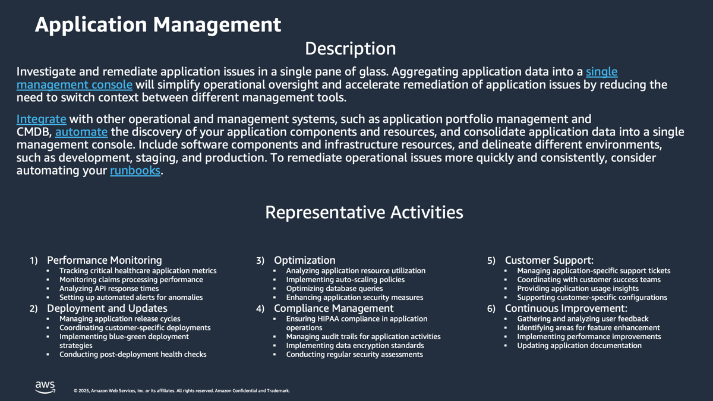

# Application Management-Discovery-and-Analysis

**Confluence Page:** https://healthedge.atlassian.net/wiki/spaces/CP1/pages/5055152208/Application%20Management-Discovery-and-Analysis

**Created by:** David Helmuth on August 28, 2025  
**Last modified by:** David Helmuth on September 12, 2025 at 02:52 PM

---

Overview
========

Workshop Logistics
------------------

### **Current State Meeting Date Time**: 08/04/2025 - 3:00 PM Eastern

### Meeting Recap: [Recap: AWS Migrations: Current State Workshop - Application Management August 4 | Meeting | Microsoft Teams](https://teams.microsoft.com/l/meetingrecap?driveId=b%21DB_OfQ-W_k6DoO-fS6Jw4YoE7vNKRg1Gun3YRU7wS_sYc6TQyp3_Q4FbkV6MJhPe&driveItemId=01FHYOWIT4AA2VEALJRJGLE5IMP2NJHU25&sitePath=https%3A%2F%2Fhealthedgetrial-my.sharepoint.com%2F%3Av%3A%2Fg%2Fpersonal%2Fdavid_helmuth_healthedge_com%2FEXwANVIBaYpMsnUMfpqT010BBBmtsOmIP5X5wAttON9Zlg&fileUrl=https%3A%2F%2Fhealthedgetrial-my.sharepoint.com%2Fpersonal%2Fdavid_helmuth_healthedge_com%2FDocuments%2FRecordings%2FAWS%2520Migrations%2520Current%2520State%2520Workshop%2520-%2520Application%2520Management-20250804_140234-Meeting%2520Recording.mp4%3Fweb%3D1&iCalUid=040000008200E00074C5B7101A82E008000000002E7E32779901DC010000000000000000100000007895243EE9370745826AB3A543E9CBCA&threadId=19%3Ameeting_YzIxOTZkMTMtYjc2YS00NjlhLTlmYmQtYTQ3YzdmYjJjODIy%40thread.v2&organizerId=9a861b6c-a7c1-4635-82f7-eed113ca1cb5&tenantId=9c9d9fee-9dfb-4e27-b259-10369fa1acf2&callId=d16ad2a5-d706-4cb2-b6b2-53f6ee664659&threadType=meeting&meetingType=Scheduled&subType=RecapSharingLink_RecapCore)

HealthEdge Current State Summary
================================

Application Management at HealthEdge focuses on monitoring, maintaining, and optimizing applications across multiple business units (HRP, Wellframe, Source, and Guiding Care). The capability ensures consistent delivery of healthcare services by maintaining application performance, reliability, and availability while meeting compliance requirements. Each business unit has developed its own approach to application management, though there are ongoing efforts to standardize tools and processes across the organization.

Note: The organization is moving toward standardization of tools under Troy's leadership, with a focus on consolidating monitoring solutions and implementing open telemetry across business units.

Policy
------

### Summary

The organization maintains strict policies around production changes, requiring technical leadership approval for changes between 6:00 AM and 9:00 PM Eastern. All customer environment changes require explicit customer approval. Each business unit has specific SLAs and SLOs, with HRP having financial penalties tied to uptime requirements. Wellframe maintains a formal service review policy with standards around monitoring, documentation, and logging

### Headlines

* Recent policy implemented requiring technical leadership approval for production changes between 6:00 AM and 9:00 PM Eastern
* All customer environment changes require customer approval regardless of timing
* Service Level Agreements (SLAs):

  + HRP: Has uptime SLAs with financial penalties
  + Source: Has transaction/latency SLAs
  + Wellframe: Has latency requirements and formal service review policy
  + All: Have internal SLOs (Service Level Objectives)

Process
-------

### Summary

Production deployments typically occur during off-hours (after 10 PM), with major upgrades scheduled for Friday evenings. Monitoring processes vary by business unit, ranging from fully automated alert systems to 24/7 manual dashboard monitoring. Regular weekly reviews are conducted with incident management teams to evaluate alerts and improve monitoring effectiveness. Each business unit has established processes for handling incidents, with clear escalation paths and response procedures.

### Headlines

* Deployment Windows:

  + HRP: Production deployments occur after 10 PM; major upgrades on Friday evenings
  + Customer agreement required for maintenance windows
* Monitoring Approaches:

  + HRP: Automated alerts with passive monitoring
  + Wellframe: Service owners on-call for their services
  + Source: DevOps team handles alerts
  + Guiding Care: 24/7 dashboard monitoring team between US and India
* Weekly review meetings with incident management teams to review alerts and false positives

Tools
-----

### Summary

Each business unit utilizes different monitoring solutions: HRP uses AppDynamics and SolarWinds, Wellframe and Guiding Care use Datadog with Open Telemetry, and Source uses App Insights and Log Analytics. The organization is moving toward standardization with an Enterprise Grafana license. Custom solutions include Ansible-based health checks for HRP and Backstage for service detection in Wellframe. Infrastructure monitoring is handled through various tools, with HRP using vCenter.

### Headlines

* Monitoring Tools by Business Unit:

  + HRP: AppDynamics, SolarWinds, ELK stack
  + Wellframe: Datadog, Open Telemetry
  + Source: App Insights, Log Analytics, Grafana
  + Guiding Care: Datadog, Open Telemetry
* Infrastructure Monitoring:

  + HRP: vCenter for infrastructure
  + All BUs: Moving toward Enterprise Grafana license
* Custom Solutions:

  + HRP: Custom health checks using Ansible
  + Wellframe: Backstage for service detection
  + All: Various custom dashboards and configurations

People
------

### Summary

The organizational structure varies by business unit. HRP maintains separate teams for infrastructure, applications, and databases, each receiving specific types of alerts. Wellframe operates with service owners responsible for their microservices, while Source combines DevOps and infrastructure teams. Guiding Care maintains a dedicated 24/7 incident

### Headlines

* Team Structure:

  + HRP: Segregated teams (Infrastructure, Application, Database) with specific alert ownership
  + Wellframe: Service owners responsible for their microservices
  + Source: Combined DevOps/Infrastructure team
  + Guiding Care: Dedicated 24/7 incident management team
* Incident Management:

  + Dedicated teams coordinate responses across technical groups
  + Follow-up reviews for alert tuning and improvement
* Time Investment:

  + Mostly automated monitoring with minimal active dashboard watching
  + Focus on alert response rather than continuous monitoring
  + Regular review sessions for improving alert quality and reducing false positives

AWS Operational Readiness State
===============================

| Template | DraftGreen | In Review | Baseline |
| --- | --- | --- | --- |

Summary
-------

HealthEdge will leverage AWS Managed Services (AMS) for their Application Management Operations capability.The operational readiness state focuses on implementing robust monitoring, management, and support processes through AMS's proven enterprise operating model.[1](https://w.amazon.com/bin/view/IndiaPayments/Issuance/Projects/AIRCube/Modules/iLens_Migration/Application_State_Management/) The service will utilize AWS native tooling and AMS operational tools for monitoring, alerting, and [management.](http://management.Ke) Key aspects include strict change management policies requiring technical leadership approval, standardized incident management procedures, and clear roles and responsibilities between AMS Operations and HealthEdge technical teams.The [2](https://w.amazon.com/bin/view/Presence/DesignNotes/AWS_Operational_Readiness/) implementation leverages automated processes for change requests, monitoring, patch management, security management and backup services while maintaining compliance with security and regulatory requirements through AMS's secure AWS Landing Zone.Policy Changes

Policy Changes
--------------

* Implement strict change management policies requiring technical leadership approval for production changes
* Follow AMS's proven enterprise operating model and best practices for infrastructure management
* Enforce two-person approval rule for production system changes
* Maintain compliance with security and regulatory requirements through AMS's secure and compliant AWS Landing Zone
* Establish clear roles and access policies aligned with AMS's operational model

Process Changes
---------------

* Leverage AMS automated processes for:

  + Change request management
  + Monitoring and alerting
  + Patch management
  + Security management
  + Backup services
* Follow standardized incident management and escalation procedures
* Implement proactive monitoring and maintenance processes
* Utilize AMS's full-lifecycle services for provisioning, running and supporting infrastructure

Tooling Changes
---------------

* Adopt AWS native tooling as required by AMS
* Implement[1](https://w.amazon.com/bin/view/AWSManagedServices/AWSManagedServices/WWSO/SSA/Qualifiers/) AMS operational tools:

  + AWS CloudWatch for monitoring
  + AWS Systems Manager for system management
  + AWS native security tools
  + AMS service management tools for change requests and incident tracking

People/Org Changes
------------------

* Define clear roles and responsibilities between:

  + AMS Operations Team
  + HealthEdge technical team
  + Change management team
  + Security team
* Establish proper access controls and permissions based on roles
* Ensure team members receive appropriate training on AMS tools and processes
* Set up proper escalation paths and on-call rotations

Examples
--------

* Minimize change impact: Separate non production and production accounts, ideally for each major tier 1 application.
* ITSM / Change Tracking tool updated to support change requests for AWS resources.
* Approvers for changes identified and integrated with change request / tracking / notification. (e.g. database change approvers, infrastructure approvers, security change approvers)
* Gated review and approval process to deploy new AWS resources or change AWS resources in production environment
* Rollback process defined for each change applied to production. (Either manual or automated)
* Tests defined for each change applied to production. (Either manual or automated)
* Gated promotion process for new changes introduced into production. (Either via CI/CD or manually)
* Shared change calendar for each account that defines upcoming changes.
* Shared change calendar that defines upcoming changes for all accounts.
* Notification lists for each account and region to provide notification to all stakeholders of upcoming changes implemented as SNS topics.
* Automation runbooks defined for changes in Production (e.g. Stop Instance, Start Instance).
* Automation runbooks integrated with change calendar.
* Permissions to production account authorized and approved by security and management with MFA enabled for these identities.
* Validate least required privilege principle for all production account identities (including roles and credential keys used by automation, third parties, software).
* All configuration files for any standard platform and application software that will change on running instances, checked in and managed in version control.
* Release runbooks or CI/CD pipeline for all Tier 1 applications entering production.
* Defined catalog of standard AWS resources as infrastructure as code, managed in version control
* Published maintenance windows and notifications prior to maintenance windows for each account and region at a predetermined interval.