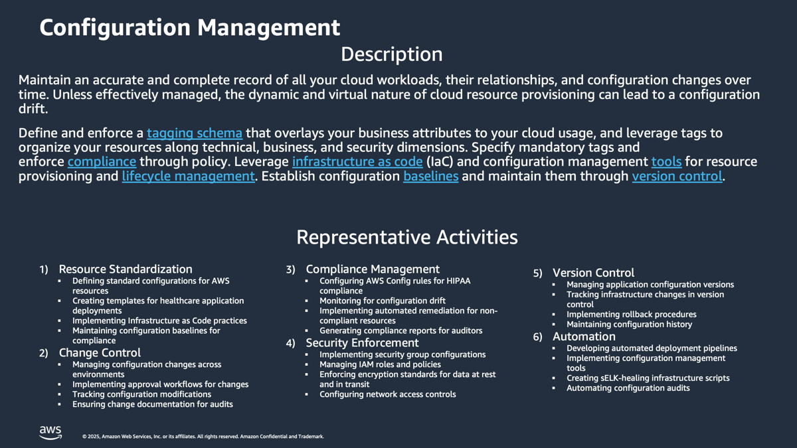

# Configuration-Management-Discovery-and-Analysis

**Confluence Page:** https://healthedge.atlassian.net/wiki/spaces/CP1/pages/4866084146/Configuration-Management-Discovery-and-Analysis

**Created by:** Chris Falk on June 16, 2025  
**Last modified by:** David Helmuth on September 12, 2025 at 02:54 PM

---

---

---

Overview
========

Configuration Management is a common IT Service Management (ITSM) process that enables IT organizations to track their IT resources and their relationships.  Configuration Management enables an IT organization to more effectively manage and institute change for their IT resources.  Configuration Management systems create Configuration Items (CIs) and store them in a common Configuration Management Database (CMDB).  These CIs capture the specific attributes of IT resources (e.g. for a server:  CPUs, Memory, Disks) as well as the relationships between CIs (e.g. server has a relationship to network it is attached to).  In high velocity / agile environments, it is a best practice to automate CMDB change tracking as much as possible so that the CMDB accurately reflects the current IT environment and relationships.  Most configuration management systems include agents and tools that will actively scan and monitor your infrastructure for new CIs as well as changes to existing CIs.  Many enterprises have implemented CMDB solutions such as ServiceNow CMDB, Serena Service Desk, Solarwinds Service Desk,  IBM Tivoli CMDB.

Existing CMDB policies and tools in place by customers should be reviewed to determine how AWS resources across accounts and regions will be aligned.    Integration appropriateness and support with existing CMDB tools should be reviewed to determine if integration is necessary and possible.  Most customers will continue to use their CMDB for on premises resources.  As servers are migrated to AWS, customers may update the related CIs in their CMDB to reflect resources that have been migrated along with basic attributes such as account, region, and resource id.

The primary AWS native service for configuration management is AWS Config.   AWS Config automatically creates CIs for AWS resources including the relationships between the AWS CIs.  AWS Config automatically tracks and manages ongoing changes to the resources per account and region.  AWS Config also includes AWS Config Rules which allow customers to automatically evaluate and automate changes within AWS (e.g. ensure that AWS resources included required tags).

As a part of our working sessions, we'll first review the existing relevant configuration management processes, people, and tools in use. We will illicit input that will determine how AWS config should be configured to support the AWS Organizations account / regional architecture and whether any AWS config rules should be applied.  We will address customer questions regarding configuration management processes, specifically how they relate to the AWS Cloud.

Workshop Logistics
------------------

### **Current State Meeting Date Time**: 08/14/2025 - 4:00 PM Eastern - WellFrame and Source To Be Reviewed - There was conflict with the Wave Planning Onsite Meeting

### Meeting Recap: [Recap: AWS Migrations: Current State Workshop - Configuration Management August 14 | Meeting | Microsoft Teams](https://teams.microsoft.com/l/meetingrecap?driveId=b%21DB_OfQ-W_k6DoO-fS6Jw4YoE7vNKRg1Gun3YRU7wS_sYc6TQyp3_Q4FbkV6MJhPe&driveItemId=01FHYOWISCNXU2IDCBIBDYBKOUBMCV5ZHH&sitePath=https%3A%2F%2Fhealthedgetrial-my.sharepoint.com%2F%3Av%3A%2Fg%2Fpersonal%2Fdavid_helmuth_healthedge_com%2FEUJt6aQMQUBHgKnUCwVe5OcB2jwa-wTZDjqFMjqOWsvjrg&fileUrl=https%3A%2F%2Fhealthedgetrial-my.sharepoint.com%2Fpersonal%2Fdavid_helmuth_healthedge_com%2FDocuments%2FRecordings%2FAWS%2520Migrations%2520Current%2520State%2520Workshop%2520-%2520Configuration%2520Management-20250814_160417-Meeting%2520Recording.mp4%3Fweb%3D1&iCalUid=040000008200E00074C5B7101A82E00800000000B8E1A3167402DC0100000000000000001000000003FC66B3BF5655409808EBD13BF61FAA&threadId=19%3Ameeting_YWUxZWQyOGYtZjBjZi00ZmRiLTg2ZmMtOGQyMjhmNDJjOWE4%40thread.v2&organizerId=9a861b6c-a7c1-4635-82f7-eed113ca1cb5&tenantId=9c9d9fee-9dfb-4e27-b259-10369fa1acf2&callId=a8ebf988-aece-4866-b352-6a7930fb5755&threadType=meeting&meetingType=Scheduled&subType=RecapSharingLink_RecapCore)

Current State
=============

### Summary

Configuration Management at HealthEdge operates as a distributed capability across multiple business units, each maintaining their own approach to managing configurations. While lacking a unified system, the organization maintains configuration control through various tools and processes, with core configuration information remaining consistent despite being stored in different locations. The focus is particularly strong on change management and maintaining stability in customer environments, especially for HRP customers where changes are strictly controlled through formal processes.

Policy
------

### Summary

Configuration management policies are largely informal and have evolved organically across different business units. HRP relies on Salesforce-based change tracking with formal review processes, while other units like GC developed policies based on infrastructure needs. The overall policy approach emphasizes stability in customer environments, with recent implementation of change review and audit processes to ensure proper oversight of configuration changes.

### Headlines

* HRP: Limited formal configuration management policies, mainly using Salesforce for change tracking with a new process for change team reviews
* WellFrame: Uses Confluence as primary source of truth for CMDB
* GC (Guiding Care): No specific policy, evolved organically from infrastructure needs for tracking
* Policy ownership is distributed across operations teams
* Policies are more focused on maintaining stability, particularly for HRP customer environments

Process
-------

### Summary

The configuration management process combines manual and automated elements, centered around change control through Salesforce tickets. Engineers manually trigger deployments and updates, following established change management procedures. Multiple CMDBs are maintained across teams, sharing core information but serving different specific needs. Resource management involves VRA for IP management and vCenter with tagging for server tracking, with change team reviews providing oversight.

### Headlines

* HRP:

  + Deployments and updates are triggered manually by engineers
  + Changes require Salesforce tickets
  + Change team reviews and audits changes
  + Uses VRA for IP address management and record keeping
  + Uses vCenter and tagging for key resources
* WellFrame:

  + Uses multiple tools (Tanium, Ansible, GPO)
  + Base configuration templates for infrastructure
  + Changes tracked in Confluence
  + Multiple CMDBs exist but share core information

Tools
-----

### Summary

The toolset is diverse, with Salesforce serving as the primary change tracking system. Various CMDBs exist, with Confluence being the primary source for some units. Technical tools include VRA for IP management, vCenter for server management, Tanium, Ansible, and GPO for configuration deployment, and Bitbucket for application code management. Some units maintain custom CMDB solutions, while PowerShell is used for Windows management tasks.

### Headlines

* HRP:

  + Salesforce for change tracking
  + VRA for IP management
  + vCenter for server management and tagging
  + PowerShell (limited use)
* WellFrame:

  + Tanium
  + Ansible
  + GPO (Windows servers)
  + Bitbucket (application code)
  + Confluence (primary CMDB)
* GC:

  + Homegrown CMDB system
  + API-enabled system
  + Integrated with security operations
  + Integration with JIRA
  + Integration with Wiz and vCenter

People
------

### Summary

The organizational structure places configuration management under Operations leadership, specifically Joe Branciforte, with responsibilities distributed across database, data center, network, applications, and change management teams. Documentation practices vary significantly by team, with application teams maintaining more detailed documentation due to frequent onboarding needs. The distributed nature of the capability requires coordination across multiple teams and skill sets.

### Headlines

* HRP:

  + Operations owns overall configuration management
  + Responsibility spread across multiple teams under Joe Branciforte:

    - Database team
    - Data center team
    - Network team
    - Applications team
    - Change management team
  + Documentation varies by team (Application team has more detailed documentation due to frequent onboarding)

AWS Operational Readiness State
===============================

| Template | DraftGreen | In Review | Baseline |
| --- | --- | --- | --- |

Summary
-------

The Operational Readiness State for Configuration Management at HealthEdge will be supported by AWS Managed Services (AMS) and focuses on establishing robust configuration control processes.The organization will implement formal configuration management policies aligned with AWS AMS best practices, including systematic change control procedures with two-person verification for production changes.The infrastructure will leverage AWS tools like Config, Systems Manager, Service Catalog and CloudFormation for automated configuration management and standardized service provisioning.Clear roles and responsibilities will be defined using the RACI model, with dedicated teams for database, infrastructure, application and change management, while AMS expertise will augment the team's cloud operations capabilities.

Policy Changes
--------------

* Implement formal configuration management policies aligned with AWS AMS best practices for enterprise infrastructure management
* Establish clear policies for change control and approval processes requiring two-person verification for production changes
* Define policies for configuration baseline establishment and maintenance
* Document configuration management procedures and review/update them periodically

Process
-------

* Implement systematic configuration change control procedures including proposal, justification, implementation, testing, review, and approval steps
* Establish processes for emergency changes and timely notification of scheduled/unscheduled outages
* Monitor configuration changes and conduct security impact reviews
* Maintain configuration records and conduct regular configuration audits
* Follow AMS automated processes for change requests, monitoring, patch management, and backup services

Tooling Changes
---------------

* Leverage AWS Config for configuration tracking and management
* Utilize AWS Systems Manager for patch management and configuration automation
* Implement AWS Service Catalog for standardized service provisioning
* Use AWS CloudFormation for infrastructure as code
* Deploy automated mechanisms to centrally manage, apply and verify configuration settings
* Integrate with AMS tools for change management, monitoring and infrastructure operations

People/Org Changes
------------------

* Clearly define configuration management roles and responsibilities using RACI model
* Train personnel on configuration management responsibilities and provide refresher training
* Establish dedicated teams for:

  + Database configuration management
  + Infrastructure configuration management
  + Application configuration management
  + Change management review and approval
* Leverage AMS expertise to augment team's cloud operations capabilities

Examples
--------

* Resource types identified for recording in Non Production vs. Production for accounts and regions.
* AWS Config Recorder turned on and configured in each account with AWS resource types identified for configuration management
* AWS Config aggregator turned on in management / delegated admin account and configured for organization.
* Individual AWS Config Recorders in each account configured to log to account bucket as well as log archive account / bucket.
* Separate encryption key for AWS Config created in security account and configured with S3 log archive AWS Config bucket.
* AWS Config Retention period defined and implemented across all regions and accounts.
* Evaluated AWS Managed config Rules and selected specific rules for general deployment across organization.
* AWS Managed Config Rules that were selected deployed in required accounts and regions with appropriate targets.
* Test when ready.
* AWS Organization CloudTrail created and implemented in all regions and accounts.

  + Cloudwatch logging enabled
  + Logging to bucket in Log Archive account.
  + Separate KMS key created in security account for CloudTrail.
  + S3 bucket configured with CloudTrail KMS key.
  + Setup already across accounts and regions.
* Configure Service Control Policy that denies turning off AWS Config and AWS CloudTrail.
* Configure S3 bucket lifecycle rule for AWS Config logs to align to customers retention goals.
* Verify AWS Config configuration recording in each region and account for selected resources.
* Verify AWS Config rule evaluation in each region and account.
* Verify config delivery to S3 bucket.
* Verify aggregation of configuration items in delegated Administrator account.
* Deliver AWS Config immersion day session to administrators.