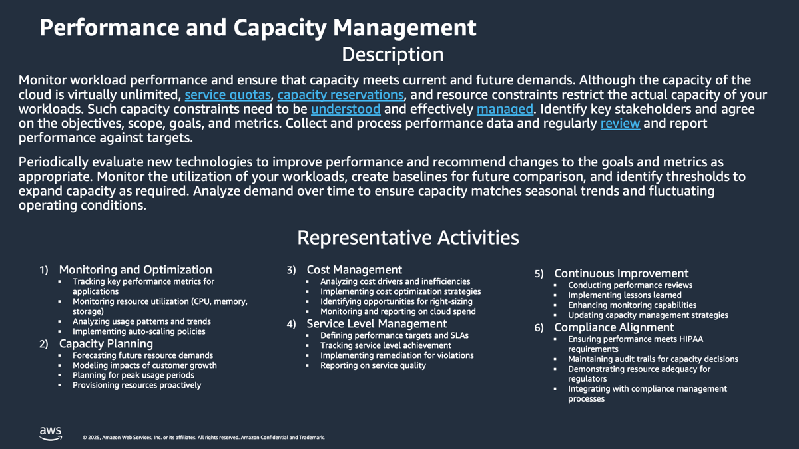

# Performance and Capacity-Discovery-and-Analysis

**Confluence Page:** https://healthedge.atlassian.net/wiki/spaces/CP1/pages/5054103706/Performance%20and%20Capacity-Discovery-and-Analysis

**Created by:** David Helmuth on August 28, 2025  
**Last modified by:** David Helmuth on September 09, 2025 at 04:02 PM

---

Overview
========

HealthEdge Current State Summary
================================

Performance and Capacity management at HealthEdge involves monitoring workload performance and ensuring capacity meets current and future demands across multiple business units. The organization handles this through a mix of on-premises and cloud infrastructure, with varying approaches from traditional hardware capacity planning to containerized auto-scaling solutions. There's a strong focus on monitoring resource utilization, planning for growth, and maintaining performance levels while managing costs effectively.

Policy
------

### Summary

Policies vary across business units but generally center around infrastructure teams managing capacity with defined utilization thresholds. HRP operates without formal documented policies but maintains active monitoring, WellFrame uses Kubernetes without initial auto-scaling, Source implements API service auto-scaling limits, and Guiding Care conducts quarterly reviews with on-demand purchasing capabilities.

### Headlines

* HRP:

  + DC/Storage team manages and monitors capacity
  + No specific documented policies, but monitoring is actively performed
  + Focus on maintaining resource utilization under 60-65% before triggering evaluation

  WellFrame:

  + Kubernetes-based with no autoscaling initially
  + Service owners responsible for monitoring their services
  + Multi-tenant architecture without customer-specific namespaces

  Source:

  + Applications primarily in Azure Kubernetes
  + Some applications still in VMs in Data Center
  + Databases are in Azure as PAAS/DB Services
  + API Services have automated scaling up to ~25 pods

  Guiding Care:

  + Quarterly reviews by Infrastructure team
  + On-demand purchases as needed
  + Infrastructure team acts as "custodians" with service teams as "stewards"

Process
-------

### Summary

Processes include annual budgeting cycles complemented by ongoing monitoring, with procurement cycles ranging from 1-3 months for hardware. Organizations handle 20% YOY organic growth, implement manual and automated scaling procedures, and conduct regular reviews of capacity needs. Customer growth and usage patterns are monitored, though customer projections often prove less reliable than actual trending data.

### Headlines

* HRP:

  + Annual budgeting process complemented by ongoing monitoring
  + ~1-3 month hardware procurement cycle
  + 20% YOY organic growth due to no data deletion policy
  + Frequent disk expansions on customer VMs

  WellFrame:

  + Manual adjustment of replica counts through CICD pipeline
  + Service Review process for monitoring and adjustments
  + 70% AppTeam / 30% DevOps split for service management
  + Each team owns approximately 4 services

  Source:

  + AutoScaling for API Services
  + Review process triggered when consistently hitting maximum capacity
  + RCA (Root Cause Analysis) performed when scaling limits are repeatedly reached
  + Batch processing considerations in scaling decisions

  Guiding Care:

  + Quarterly capacity reviews
  + Trending data evaluation for growth
  + Customer projections often less reliable than actual trending data
  + Significant changes in customer volume may lead to dedicated hardware

Tools
-----

### Summary

The toolset spans multiple monitoring and management platforms including VMware Aria, PURE Storage, Kubernetes, DataDog, Azure monitoring, Cisco Intersight, Foglight for databases, and SolarWinds for network monitoring. Each business unit leverages specific tools aligned with their infrastructure approach, whether cloud-native or on-premises.

### Headlines

HRP:

* VMware Aria for SAAS hardware
* PURE Storage for flexible quarterly expansions
* Monitoring tools for disk utilization

WellFrame:

* Kubernetes
* APM/WatchDog
* DataDog for monitoring
* Open Telemetry and APM for monitoring

Source:

* Azure monitoring (resource/logging/tracing metrics)
* Azure Kubernetes Service
* Application Insights

Guiding Care:

* DataDog for virtual layer monitoring
* Cisco Intersight for hardware layer
* Pure Storage Portal
* Foglight (owned by DB Ops) for database monitoring
* SolarWinds for network monitoring

People
------

### Summary

Responsibility for performance and capacity management is distributed across multiple teams including Infrastructure, DevOps, Database teams, and application owners. Infrastructure teams typically act as custodians of the hardware and planning, while service teams serve as stewards of their specific applications. The mix of responsibilities varies by business unit, with some following a 70/30 split between application teams and DevOps.

### Headlines

HRP:

* DC/Storage team manages capacity planning
* Database team monitors database performance
* Infrastructure team handles hardware procurement

WellFrame:

* Service owners (app teams) responsible for their services
* DevOps team supports infrastructure
* ~20 microservices managed across teams

Source:

* Mix of DevOps and Infrastructure team responsibilities
* Jim Fallon's group manages infrastructure
* Database team monitors database performance

Guiding Care:

* Infrastructure team owns hardware and planning
* Service teams monitor/track performance
* Database team manages database capacity
* Infrastructure team acts as custodians with service teams as stewards

AWS Operational Readiness State
===============================

| Template | DraftGreen | In Review | Baseline |
| --- | --- | --- | --- |

Summary
-------

The Operational Readiness State for Performance and Capacity Operations Capability at HealthEdge, supported by AWS AMS, focuses on implementing robust monitoring, automation, and management practices.The state encompasses standardized auto-scaling policies, automated capacity management through AMS Capacity Management Reporting Solution, and comprehensive performance monitoring using AWS CloudWatch.Key aspects include automated resource scaling, predictive capacity planning, and integration with AWS service quotas.The system leverages AMS expertise for infrastructure optimization while maintaining clear delineation of responsibilities between HealthEdge teams and AMS support.This setup ensures efficient resource utilization, proactive performance management, and seamless scalability through AWS AMS's managed services approach. [1](https://w.amazon.com/bin/view/Presence/DesignNotes/AWS_Operational_Readiness/)

Policy Changes
--------------

* Implement standardized monitoring and alerting policies aligned with AMS best practices
* Establish automated capacity management policies using AMS Capacity Management Reporting Solution
* Define clear resource utilization thresholds and scaling policies
* Create documented capacity planning procedures that integrate with AWS service quotas
* Implement policies for performance monitoring and workload optimization

Process Changes
---------------

* Leverage AMS automated processes for capacity planning and resource management
* Implement continuous monitoring and reporting of resource utilization
* Establish regular capacity reviews and forecasting procedures
* Use AMS automated systems for performance monitoring and optimization
* Follow standardized change management processes for capacity adjustments

Tool Changes
------------

* AWS CloudWatch for performance monitoring and metrics collection
* AMS Capacity Management Reporting/Dashboard for resource utilization tracking
* AWS Lambda functions for service-specific monitoring (EC2, RDS, S3, etc.)
* CloudFormation templates for consistent infrastructure provisioning
* AMS Managed Monitoring System (MMS) for comprehensive resource monitoring

People/Org Changes
------------------

* AMS team handles day-to-day capacity management and monitoring
* HealthEdge teams focus on application-specific requirements
* Clear delineation of responsibilities between AMS and HealthEdge teams
* Leverage AMS expertise for infrastructure management and optimization
* Regular collaboration between HealthEdge and AMS teams for capacity planning