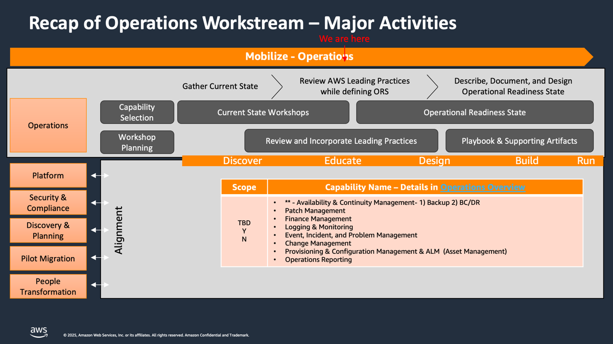
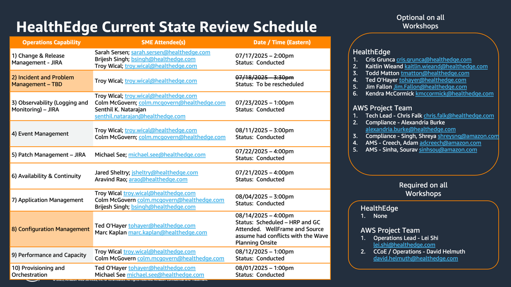

# AWS Operations Overview

**Confluence Page:** https://healthedge.atlassian.net/wiki/spaces/CP1/pages/4866083904/AWS%20Operations%20Overview

**Created by:** Chris Falk on June 16, 2025  
**Last modified by:** David Helmuth on September 12, 2025 at 03:02 PM

---

Delivery Kit Overview
=====================

The Operations Delivery Kit Contains:

* **Artifacts** - Provide guidance for both the Discovery & Analysis and the Design for each of the areas
* **Runbooks** - Architecture and deployment references
* **Workshops** - Recommended Wrokshop and events

Artifacts
=========

The operations artifacts provided in this section are divided into the primary operations workstream activities:

* Discovery & Analysis
* Design

If there are multiple AWS consultants working with the customer, then the Discovery & Analysis activities can be divided between available consultants.  Each section includes an overview to introduce the topic and provide general guidance on the scope and people, processes, and tools involved.  There is a question bank in the Discovery & Analysis sections to help guide each activity.  If the customer has current documentation that aligns to active processes then they can include these links on the relevant artifact pages.  It is important to involve the right people from the customer who are currently engaged in related on-premises activities.  As you work through the discovery and analysis activities, you should define the operational readiness state for each activity.  You can use the related design pages and work backwards to help define the operational readiness state.

After you complete a discovery and analysis activity, you should close the related task in Jira and continue to the design activities.  Your should review the recommended design and make adjustments based upon what you learned in discovery and analysis.  For example, if a customer owned COTS application is already being used for Patch Management and there is consensus that this application will be used for AWS, then you should update the design to align to this solution accordingly.  You should document any risks or concerns with deviations from the AWS recommended design and define a mitigation plan for each.

---

Runbooks
========

The Operations workstream includes the following core runbooks for operational capabilities using AWS native services.  Significant changes to the reference architectures are out of the scope of a standard mobilize / migrations engagement.  Customers can begin by deploying the reference architectures as-is or with slight modifications to establish operational capabilities.  They can then evolve their implementations to incorporate any additional requirements that they may have.  If a customer chooses not to implement the reference architecture and instead use a different architecture, then it should be documented and captured as a runbook to define how to operate and manage it.

Each runbook will evolve from **Template** to **Draft** to **In Review** and finally to **Baseline**. Once an runbook becomes baselined it will be moved to the Knowledge Base and be counted as a completed deliverable.

---

Workshops
=========

---

Operations Overview
-------------------

| Session | Audience | Time | Sprint | Artifact/Activity Links |
| --- | --- | --- | --- | --- |
| Operations Workstream Introduction | ALL | 90 min |  | [Operations Workstream Introduction](../Workshops/WorkstreamIntroduction/) |
| Operations Model Overview & Capability Model Review | ALL | 60 min |  | [Operational Capabilities & RACI](../Artifacts/Operational-Capabilities-&-RACI/) |
| Developing Operations Runbooks | ALL | 30 min |  | N/A |
| Monitoring and Operational Health Strategy | ALL | 60 min |  | [Monitoring Strategy & Operational Health](../Workshops/Monitoring-Strategy-&-Operational-Health/) |

Current State Reviews
---------------------

| Session | Audience | Time | Sprint | Artifact/Activity Links |
| --- | --- | --- | --- | --- |
| Change Management Current State Review | WS | 30 min |  | [Change Management Discovery and Analysis](../Artifacts/Change-Management-Discovery-and-Analysis/) |
| Configuration Management Current State Review | WS | 30 min |  | [Configuration Management Discovery and Analysis](../Artifacts/Configuration-Management-Discovery-and-Analysis/) |
| Availability & Continuity Management Current State Review | WS | 30 min |  | [Availability and Continuity Management Discovery and Analysis](../Artifacts/Availability-and-Continuity-Management-Discovery-and-Analysis/) |
| Patch Management Current State Review | WS | 30 min |  | [Patch Management Discovery and Analysis](../Artifacts/Patch-Management-Discovery-and-Analysis/) |
| Logging, Monitoring, and Event Management Current State Review | WS | 30 min |  | [Event & Incident Management Discovery and Analysis](../Artifacts/Event-&-Incident-Management-Discovery-and-Analysis/) |
| Tag Management Current State Review | WS | 30 min |  | [Tag Management Discovery and Analysis](../Artifacts/Tag-Management-Discovery-and-Analysis/) |
| AMI Management Current State Review | WS | 30 min |  | [AMI Management Capability Discovery and Analysis](../Artifacts/AMI-Management-Capability-Discovery-and-Analysis/) |

Operational Readiness State Definitions
---------------------------------------

| Session | Audience | Time | Sprint | Artifact/Activity Links |
| --- | --- | --- | --- | --- |
| Change Management Operational Readiness State Definition | WS | 60 min |  | [Change Management Discovery and Analysis](../Artifacts/Change-Management-Discovery-and-Analysis/) |
| Configuration Management Operational Readiness State Definition | WS | 60 min |  | [Configuration Management Discovery and Analysis](../Artifacts/Configuration-Management-Discovery-and-Analysis/) |
| Availability & Continuity Management Operational Readiness State Definition | WS | 60 min |  | [Availability and Continuity Management Discovery and Analysis](../Artifacts/Availability-and-Continuity-Management-Discovery-and-Analysis/) |
| Patch Management Operational Readiness State Definition | WS | 60 min |  | [Patch Management Discovery and Analysis](../Artifacts/Patch-Management-Discovery-and-Analysis/) |
| Logging, Monitoring, and Event Management Operational Readiness State Definition | WS | 60 min |  | [Event & Incident Management Discovery and Analysis](../Artifacts/Event-&-Incident-Management-Discovery-and-Analysis/) |
| Tag Management Operational Readiness State Definition | WS | 60 min |  | [Tag Management Discovery and Analysis](../Artifacts/Tag-Management-Discovery-and-Analysis/) |
| AMI Management Operational Readiness State Definition | WS | 60 min |  | [AMI Management Capability Discovery and Analysis](../Artifacts/AMI-Management-Capability-Discovery-and-Analysis/) |

Operational Readiness State Design Reviews
------------------------------------------

| Session | Audience | Time | Sprint | Artifact/Activity Links |
| --- | --- | --- | --- | --- |
| Change Management Operational Readiness State Design Review | WS | 30  min |  | [Change Management Design](../Artifacts/Change-Management-Design/) |
| Configuration Management Operational Readiness State Design Review | WS | 30  min |  | [Configuration Management Design](../Artifacts/Configuration-Management-Design/) |
| Availability & Continuity Management Operational Readiness Design Playbook Review | WS | 30  min |  | [Availability and Continuity Management Design](../Artifacts/Availability-and-Continuity-Management-Design/) |
| Patch Management Operational Readiness State Design Review | WS | 30  min |  | [Patch Management Design](../Artifacts/Patch-Management-Design/) |
| Event and Incident Management Design Review | WS | 30  min |  | [Event & Incident Management Design](../Artifacts/Event-&-Incident-Management-Design/) |
| Tag Management Operational Readiness State Design Review | WS | 30  min |  | [Tag Management Design](../Artifacts/Tag-Management-Design/) |
| AMI Management Operational Readiness State Design Review | WS | 30 min |  | [AMI Management Design](../Artifacts/AMI-Management-Design/) |

Operational Readiness Assessments
---------------------------------

| Session | Audience | Time | Sprint | Artifact/Activity Links |
| --- | --- | --- | --- | --- |
| Operations Game Day | WS | 4 weeks |  | [Operations Game Day](../Workshops/GameDay/) |

---