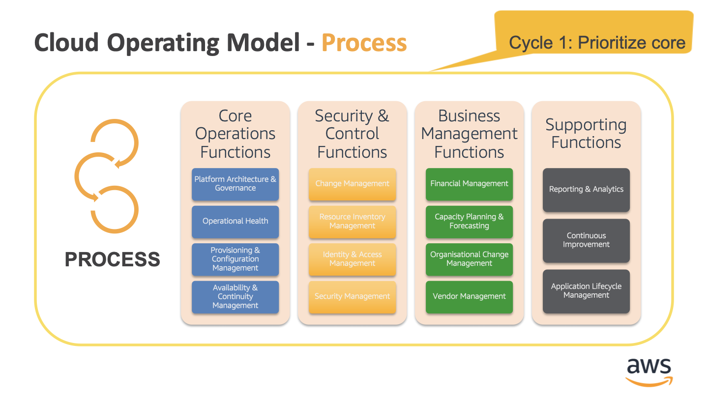

# WorkstreamIntroduction

**Confluence Page:** https://healthedge.atlassian.net/wiki/spaces/CP1/pages/4866083963/WorkstreamIntroduction

**Created by:** Chris Falk on June 16, 2025  
**Last modified by:** Chris Falk on June 16, 2025 at 02:03 AM

---

This workshop provides an introduction to the Cloud Operating Model, Operational Integration, and the operational processes and supporting AWS services that are addressed in the Operations Workstream.

The functional areas are similar to common IT Service Management (ITSM) focus areas in frameworks such as ITIL, COBIT, etc. There is no requirement or expectation that the customer is using an ITSM framework.

Anyone from the customer team who is currently responsible or accountable for existing processes should be a part of this workshop. You should also invite project sponsors and leadership as optional attendees if they have particular requirements that need to be addressed in the workstream. The meeting should include AWS personnel that may have long term relationships and responsibilities to the customer such as the client solutions architect, customer delivery architect, customer practice manager, and enterprise services manager.

This meeting should be led by the AWS ProServe consultant leading the Operations workstream delivery with support from the broader AWS team.

In addition to this workshop, you may consider providing introductions to AWS Management & Governance Services. For example, you may work with the solutions architect to plan and deliver a [Management & Governance Immersion Day](https://workshop.aws-management.tools/) for the customer.