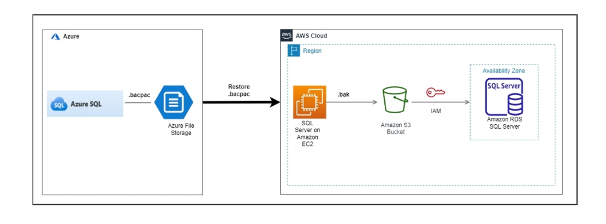
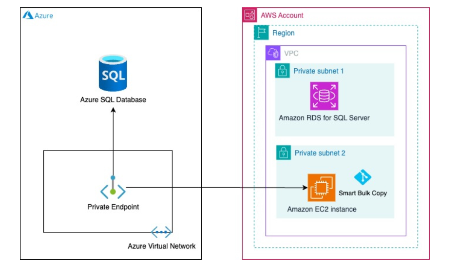

# Database Portfolio : HE Hub(In Draft)

**Confluence Page:** https://healthedge.atlassian.net/wiki/spaces/CP1/pages/5369397249/Database%20Portfolio%20%3A%20HE%20Hub%28In%20Draft%29

**Created by:** Sai Krishna Namburu on December 18, 2025  
**Last modified by:** Lakshmi Bhavya Kondamadugula on December 23, 2025 at 06:41 AM

---

This document provides an high level overview of database landscaping for following BUs: HE Hub

### **Executive Summary**

* **Total Database Inventory**: 4 databases
* **Source Platforms**: Azure
* **Target Platform**: AWS (RDS SQL)
* **Migration Scope**: Multi-cloud consolidation strategy

### **Current State Inventory**

* **HE Hub**: 4 Azure SQL Databases (1 Production, 1 Non-Production, 2 Development)

---

### **Target AWS Architecture**

**Azure SQL → AWS RDS SQL Server**

* 4 databases consolidated
* Multi-database per RDS instance for cost optimization
* Read replicas for HA/DR if applicable.

The following document presents a comprehensive database inventory listing for the various business units. Please **NOTE** that this table doesn't include the GC and HRP inventory.

Migration Strategies:
---------------------

### Approach 1: BACPAC Method

The BACPAC method uses data-tier application backup package files (.bacpac) that contain both schema and data, suitable for Azure SQL Database migrations where native .bak files aren't supported.

**High-Level Steps:**

### Export Phase

Choose one of three methods to export .bacpac from Azure SQL Database:

* **Azure Portal:** Use the export database feature
* **SQLPackage Command Line Utility:** Use SQLPackage.exe with export parameters
* **SQL Server Management Studio (SSMS):** Use the Export Data-tier Application wizard

### Transfer Phase

* Copy the exported .bacpac file to an Amazon EC2 instance in your AWS environment

### Import Phase

* Use SQLPackage.exe on the EC2 instance to import the .bacpac file into Amazon RDS for SQL Server
* Note: GUI-based import is not supported in RDS for SQL Server due to permission restrictions

### Validation Phase

* Verify schema and data completeness
* Test database functionality
* Validate application connectivity

**Key Considerations:** The BACPAC method is simpler for smaller databases but may be slower for large-scale migrations compared to Smart Bulk Copy

**Architecture Diagram:**

[AWS reference](https://aws.amazon.com/blogs/database/migrate-sql-server-databases-from-an-azure-sql-database-to-amazon-rds-for-sql-server-using-bacpac-method/)

### Approach 2: Smart Bulk Copy

Smart Bulk Copy is an open-source offline data migration tool that offers faster migration by partitioning tables for parallel processing, making it ideal for multi-terabyte databases.

**High-Level Steps:**

### Pre-Migration Tasks

* Set up network connectivity between Azure and AWS (using AWS Direct Connect or Site-to-Site VPN)
* Create an Amazon RDS for SQL Server DB instance
* Install Smart Bulk Copy tool and required software
* Create logins and users on the target RDS instance
* Migrate database schemas from Azure SQL Database to RDS

### Migration Tasks

* Configure Smart Bulk Copy with source and target connection details
* Define table partitioning strategy for parallel processing
* Execute Smart Bulk Copy to migrate data in parallel
* Monitor the migration progress

### Post-Migration Tasks

* Validate data integrity and completeness
* Test application connectivity
* Perform thorough testing
* Clean up resources and optimize performance

**Key Benefits:** Significantly faster than traditional tools like bcp and bacpac; minimizes downtime through parallel processing.

**Architecture Diagram:**

[AWS Reference](https://aws.amazon.com/blogs/database/migrate-microsoft-azure-sql-database-to-amazon-rds-for-sql-server-using-smart-bulk-copy/)

Migration Strategy Matrix
-------------------------

| **Source Database** | **Target AWS Service** | **Migration Tool** | **Strategy** |
| --- | --- | --- | --- |
| Azure SQL Database | RDS SQL Server | Bacpac export , Smart bulkcopy utility & AWS DMS | Replatform |

References
==========

* <https://healthedgetrial.sharepoint.com/:w:/r/sites/AWSCloudMigration/_layouts/15/Doc.aspx?sourcedoc=%7BAA2F6F57-15A2-4D22-8BCA-2DE24593B7EA%7D&file=MigrationApproaches_AzureSQLServerPostgreSQL_AWSRDS.docx&action=default&mobileredirect=true>
* <https://healthedgetrial.sharepoint.com/:w:/r/sites/AWSCloudMigration/_layouts/15/Doc.aspx?sourcedoc=%7BDC9EE417-11C1-4120-A742-7D0161D31E9D%7D&file=MigrationApproaches_AzureSQLServerPostgreSQLManagedInstances_AWSRDS.docx&action=default&mobileredirect=true>