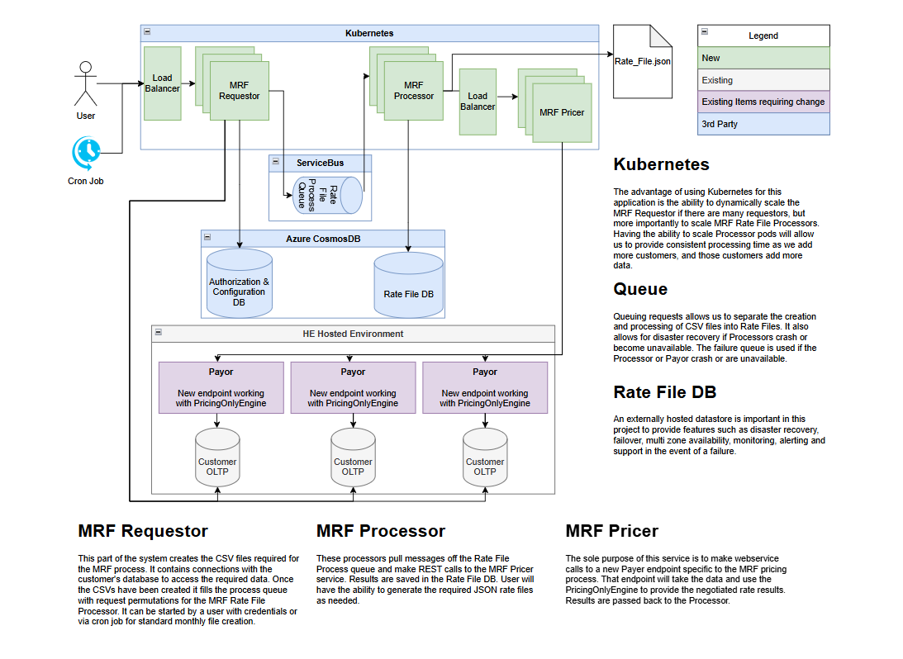

# Database Portfolio : MRF (In Draft)

**Confluence Page:** https://healthedge.atlassian.net/wiki/spaces/CP1/pages/5369266177/Database%20Portfolio%20%3A%20MRF%20%28In%20Draft%29

**Created by:** Sai Krishna Namburu on December 18, 2025  
**Last modified by:** Sateesh Bammidi on January 07, 2026 at 04:44 PM

---

This document provides an high level overview of database landscaping for following BUs: MRF

### **Executive Summary**

* **Total Database Inventory**: 22 databases (6 Production, 7 Non-Production, 9 Development)
* **Source Platforms**: Azure Cosmos
* **Target Platform**: Amazon DocumentDB
* **Migration Scope**: Multi-cloud consolidation strategy

### **Source : Current State Inventory**

* **MRF**: 22 Azure Cosmos databases (6 Production, 7 Non-Production, 9 Development)

Source Architecture:
--------------------

---

### **Target AWS Architecture (Proposed)**

.png)

**Azure Cosmos → Amazon DocumentDB**

* 22 NoSQL databases migrated
* Native MongoDB compatibility (DocumentDB)

Migration Strategy Matrix
-------------------------

| **Source Database** | **Target AWS Service** | **Migration Tool** | **Strategy** |
| --- | --- | --- | --- |
| Azure Cosmos (22) | Amazon DocumentDB | mongodump/mongorestore, DMS | Re-platform |

Notes
-----

* PDM and MRF can go with HRP BU.
* The production cosmosDB has 19 million records(approx.) and the size is less than 100GB.
* No complex aggregation operations exists in the current implementation.
* The collections/DB’s 3 months TTL and so the databases wont grow more than 100GB unless a new customer is on-boarded.
* MRF currently has 6 customers having its dedicated database each with 100GB data.
* Authentication and configDB DB’s are small in MBs and is shared across.
* MRF uses MongoDB 8.0 version with hash sharding.
* Jyothi Prasad Nama Mahesh, - MRF Technical Lead  
  Dhaval Deolasi, - MRF Developer  
  Melissa Kirkpatrick, -?  
  Aravind Rao, - Network Lead  
  Ram Mamidenna, - Application Owner

References
==========

* GC-Azure CosmosDB to Amazon DocumentDB Migration
* <https://aws.amazon.com/blogs/database/a-hybrid-approach-for-homogeneous-migration-to-an-amazon-documentdb-elastic-cluster/>