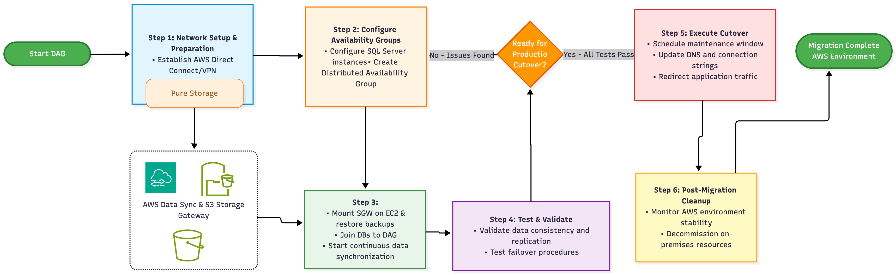

# Distributed Availability Groups (DAG) Approach

**Confluence Page:** https://healthedge.atlassian.net/wiki/spaces/CP1/pages/5251563705/Distributed%20Availability%20Groups%20%28DAG%29%20Approach

**Created by:** Sai Krishna Namburu on November 19, 2025  
**Last modified by:** Sai Krishna Namburu on November 20, 2025 at 09:48 AM

---

The Distributed Availability Groups (DAG) approach is a strategic method for migrating SQL Server clusters with Always On Availability Groups (AOAG) from on-premises to AWS with near-zero downtime and minimal operational overhead during cutover.

Key Characteristics
-------------------

**Architecture Design**

* Spans two separate Always On Availability Groups configured on different Windows Server Failover Clustering (WSFC) clusters
* Creates an "availability group of availability groups" connecting on-premises and AWS environments

**Data Synchronization**

* Enables continuous data synchronisation (Asynchronous) between on-premises and AWS environments
* Data transfers only from on-premises primary to one AWS replica (the forwarder), which then distributes to other AWS replicas
* Reduces traffic flow between on-premises and AWS compared to traditional approaches

Migration Benefits
------------------

* **Near-zero downtime** during migration cutover
* **Low operational overhead** during the migration process
* **Immediate high availability** on AWS after cutover
* **Flexibility in migration planning** with phased approach options
* **Reduced data transfer costs** between on-premises and AWS

Migration Process Overview
--------------------------

1. **Setup Phase**: Establish connectivity between on-premises and AWS environments (typically via AWS Direct Connect)
2. **Configuration Phase**: Create Always On Availability Groups both on-premises and in AWS
3. **Synchronization Phase**: Connect the two availability groups via distributed availability group for continuous data replication
4. **Testing Phase**: Validate data synchronization and test failover procedures
5. **Cutover Phase**: Perform controlled failover to make AWS database primary with minimal downtime
6. **Cleanup Phase**: Remove on-premises dependencies after successful migration

Technical Advantages
--------------------

* Supports both synchronous and asynchronous commit modes
* Allows for stress testing and proper EC2 instance sizing before full migration
* Enables phased migration approach (e.g., moving read-only applications first)
* Provides rollback capability if needed during migration
* Maintains database consistency throughout the migration process

This approach is particularly effective for mission-critical SQL Server deployments requiring high availability and minimal disruption during cloud migration

**Useful Links**

[DAG Documentation](https://learn.microsoft.com/en-us/sql/database-engine/availability-groups/windows/configure-distributed-availability-groups?view=sql-server-ver17&tabs=manual%2Csql22)