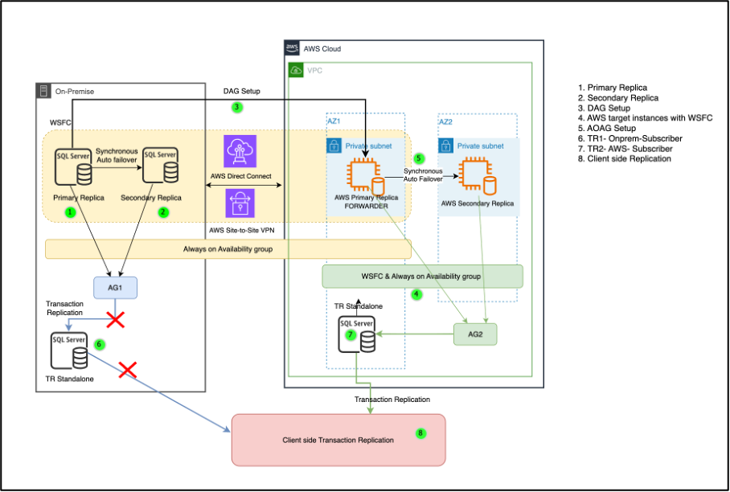
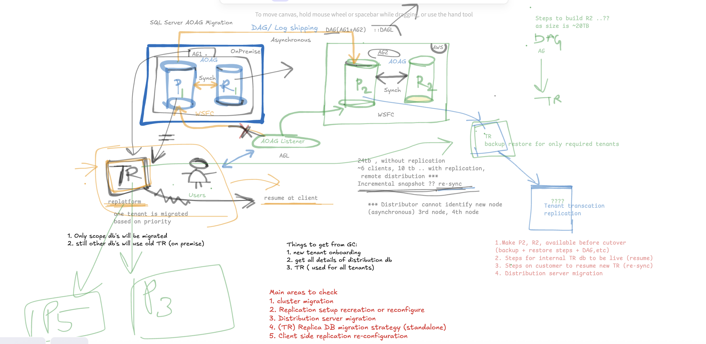

# GC - SQL Server Cluster Migration Strategy

**Confluence Page:** https://healthedge.atlassian.net/wiki/spaces/CP1/pages/5149491404/GC%20-%20SQL%20Server%20Cluster%20Migration%20Strategy

**Created by:** Sai Krishna Namburu on October 06, 2025  
**Last modified by:** Sai Krishna Namburu on October 06, 2025 at 02:16 PM

---

**Status: Draft**

**Pending Details:**

Transaction replication : Number of tables used, sizes, existing configuration, Distribution database details, client side replication (RTO, RPO), re-sync steps for existing on-premise setup any major know issues to consider during migration.

Transaction replication Subscriber details : shared server with other tenants

Distribution Server details : Standalone or not ?

Reference ticket: <https://healthedge.atlassian.net/jira/software/projects/AWSM/boards/1291?jql=assignee%20%3D%20712020%3Ad3f6c1e8-ee44-43bf-8827-2609386f7f93&selectedIssue=AWSM-716>

Existing Architecture
---------------------

 Following architecture diagram explains existing flow of SQL Server (standalone) servers from on-premises datacenter and client connectivity.

\*\* **Add existing Arch. diagram**

Migration Option
----------------

Distributed Availability Groups (DAG)



Pre-requisites
--------------

* SQL Server Domain account (with fixed **sysadmin** server role)
* Source to target servers connectivity
* Shared folder to place and read snapshots
* Distributor configuration (on Publisher or separate node?)
* Build on-premise similar setup on AWS

  + SQL Server (Enterprise edition)
  + WSFC (Windows Server Failover Cluster)
  + AOAG (Always On Availability Groups)

Pre-Cutover
-----------

* Copy source backup to Amazon EC2
* Restore Full/Diff/T-Log backup files manually to Forwarder (P2) to bring near to source database state (LSN)
* Configure AG2 and Listener creation (\*verify WSFC object full permissions)
* Restore Full/Diff/T-Log backup files manually (WITH NORECOVERY) to Secondary Replica (R2) to bring near to P2 database state (LSN)
* Add secondary node to AG2
* Use “Join only” option for database join. (Time taking step\*\*)
* Verify AG2 Dashboard for nodes health status.
* Verify database access and validate data.
* Once source and target copies are similar, attach the AG2 to DAG on source
* Monitor the AOAG dashboard

Cutover
-------

* Verify the last LSN applied at on-premise and AWS
* Monitor the AOAG dashboard
* Break/Delete existing transaction replication on source
* Switch the replica role to AWS during cutover
* Verify AG dashboard for replica node’s health status
* Verify connectivity from the current primary listener
* Validate the dependencies and application connectivity to AWS nodes

Transaction Replication Setup
-----------------------------

* Launch replication monitor from SSMS on AWS primary replica
* Verify the transaction replication status
* Monitor replication status (undistributed Commands)
* On AWS primary replica :

  + Configure publisher to use the remote distribution
  + Create new publication
  + Create linked server with AG listener on both AG replicas

    
```
EXEC sp_addlinkedserver  
@server = ' AWSAGlist,1433;
```

  + Create new subscription
* Re-configure distribution database with AG listener

  
```
USE distribution_db;  

GO  

EXEC sp_redirect_publisher  
@original_publisher = 'PublisherAWS',  
@publisher_db = 'pub_db',  
@redirected_publisher = 'AWSAGlist,1433';
```

* Verify “Publisher to Distributor History” tab in replication monitor
* Verify “Distribution to Subscriber History” tab
* Verify for any pending “Undistributed Commands”
* Start all the agents and verify running status
* Configure client side replication with new AWS subscriber

Post-Cutover
------------

* Verify the AOAG dashboard
* AG2 listener connectivity checks
* Application connectivity test
* Transaction Replication status and uncommitted transactions count
* Client side replication status
* Dependencies test

Main Stories for GC Migration:
------------------------------

1. SQL Server AOAG cluster migration
2. Transaction Replication (TR) setup (recreation or reconfigure)
3. Distribution server (Current configuration and migration approach)
4. TR Replica DB migration strategy (standalone) - Shared server for other tenants ?
5. Client side replication re-configuration with new Distribution and TR nodes

Scratchpad
----------

