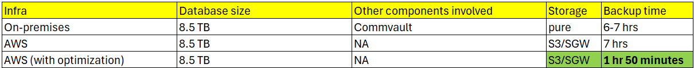
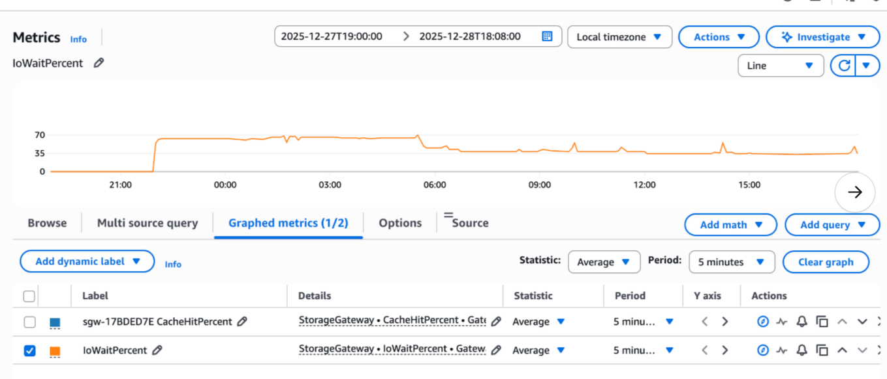

# GC: Database Backup Performance Improvement Analysis

**Confluence Page:** https://healthedge.atlassian.net/wiki/spaces/CP1/pages/5223907449/GC%3A%20Database%20Backup%20Performance%20Improvement%20Analysis

**Created by:** Senthil Ramasamy on November 11, 2025  
**Last modified by:** Sateesh Bammidi on January 09, 2026 at 06:10 PM

---

**Backup execution times**

**Architecture**

2100522371083652239074491GC\_sql\_DB\_Backup.drawio11https://healthedge.atlassian.net/wikiGC\_sql\_DB\_Backup.drawio0791.0000000000002481.0000000000002

**Details:**

**Testing Environment:**

* Platform: UNHG (United database)
* Database Size: 22 TB (one of the largest databases comparable with Production)
* Test Scope: Backup performance comparison

**Initial State:**

* On-premises backup duration (using Commvault & Pure Storage): 17-22 hours (varies)
* AWS backup duration (pre-optimization): 17 hours

**Identified Issues:**

1. Instance Configuration:

   * `r5.12xlarge` (optimized to 20 Vcpus)
   * Maximum EBS bandwidth capacity: 850 MB/sec
2. Storage Configuration:

   * Database files unevenly distributed across volumes
   * EBS volumes configured with baseline GP3 metrics:

     + 4000 IOPS
     + 850 MB/sec throughput
3. Bottleneck Analysis:

   * The IOwaitime during the slow backup is over 35% for most part and hitting almost 70%
   * 
   * Recommendation from AWS:
   * `check your gateway's IoWaitPercent metric on Amazon CloudWatch. If you see that your gateway's IoWaitPercent metric is higher than 10% during testing, then there might be an issue with your gateway. The gateway might have a disk that doesn't have enough I/O to handle the workload. Use the SampleCount statistic to review the WriteBytes metric and check your total write I/O to AWS. If your gateway's cache disk doesn't have enough I/O to handle the workload, then change the cache disk to a faster disk type. For example, use an SSD or NVMe-backed SSD disk. Attach another cache disk to your gateway to help increase the available aggregate I/O to the gateway.`
   * Reference: <https://repost.aws/knowledge-center/storage-gateway-troubleshoot-slow-upload>

**Implemented Solution:**

1. Instance type changed to i3en.2xlarge - storage optimized type. (Note: S3 File Gateway cannot utilize more than 64 GB of RAM.)
2. i3en.2xlarge uses 5 TB NVME disks.

**Results:**

1. Performance Improvement:

   * Original backup time: 17 hours
   * **New backup time: 5.5 hours**
   * Reduction: 68% improvement in backup duration

**Conclusion:**  
The implemented changes delivered substantial performance improvements providing an efficient and faster backup solution.

Note: GC DB team has captured backup exec times (on-prem vs AWS) and cost associated with the change.

Please refer*:*