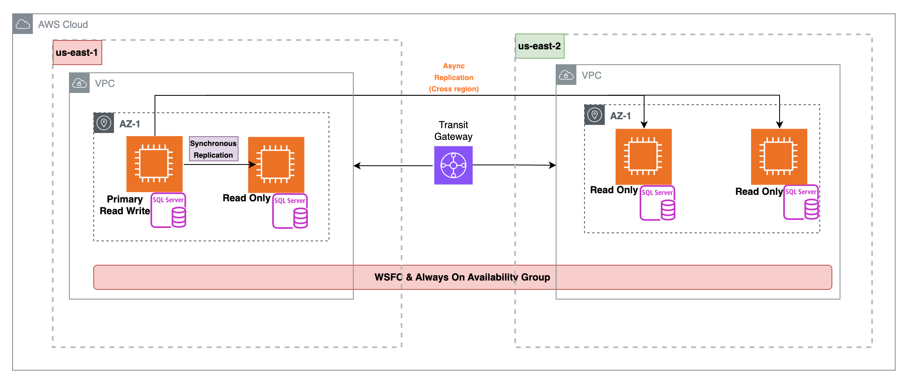
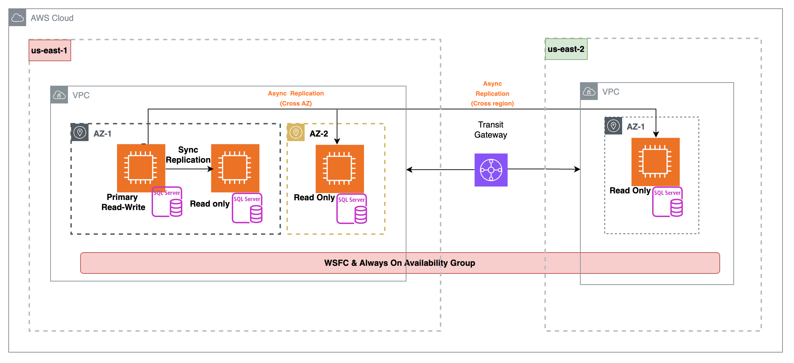
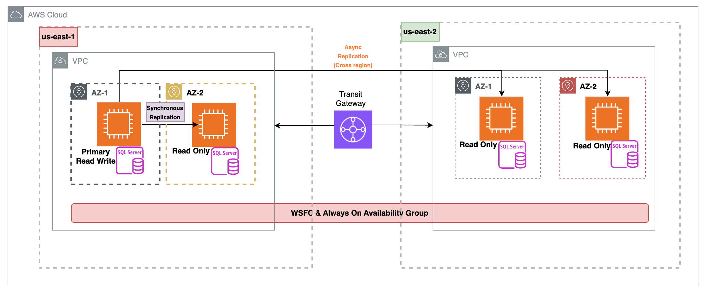
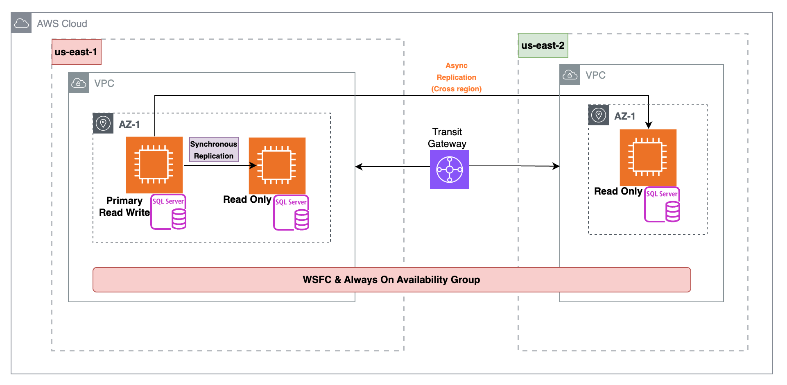
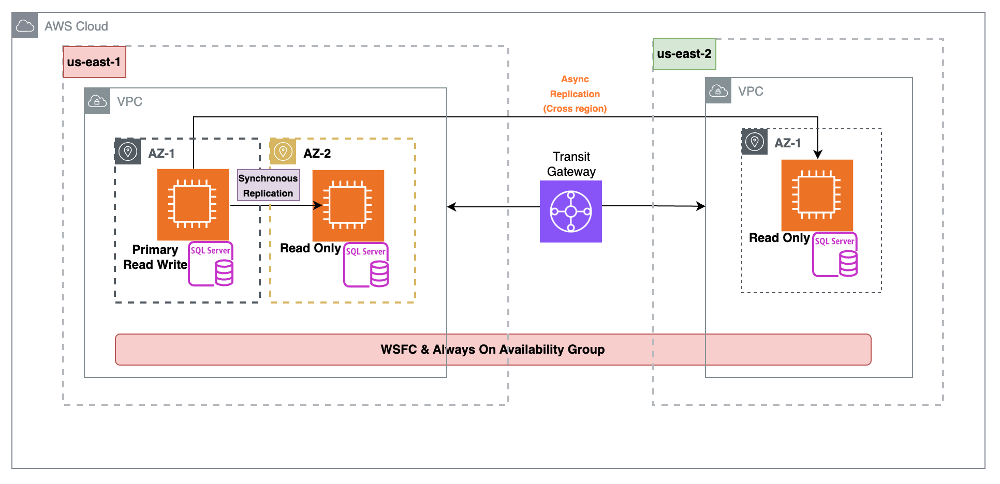

# GC: SQLserver Clustering & Disaster Recovery Strategies

**Confluence Page:** https://healthedge.atlassian.net/wiki/spaces/CP1/pages/5176885872/GC%3A%20SQLserver%20Clustering%20%26%20Disaster%20Recovery%20Strategies

**Created by:** Sai Krishna Namburu on October 17, 2025  
**Last modified by:** Sai Krishna Namburu on October 17, 2025 at 02:16 PM

---

**Agreed Decision:**

|  |
| --- |
| ***For Top 5 Tier 1 customer production database (OLTP cluster)***  **option 2: primary region: 2 nodes (on different AZ) + DR region: 2 nodes (on different AZ)**  ***For all other customer production database (OLTP cluster)***  **option 2: primary region: 2 nodes (on different AZ) + DR region: 1 node** |

**Various options discussed:**

***Option:1 → Proposed by GC DB team:*** The primary and secondary SQL Server database nodes are deployed within the same Availability Zone / subnet, with both nodes actively serving application traffic Primary(read-write) and secondary server is Read-only. A secondary region maintains an identical setup to act as a disaster recovery site. The configuration uses SQL Server Always On replication with Windows Server Failover Clustering (WSFC) implemented between the nodes.

Note: Below setup is proposed for Top 5 Tier1 customer’s OLTP production databases.

***Option:1 → primary*** **region:** ***2 nodes (on same AZ) + DR region: 2 nodes (on same AZ)***

***Option:2 → Primary region: 3 nodes (2 on same AZ and 1 on different AZ ) + DR region: 1 node***

***Option:3 → primary*** **region:** ***2 nodes (on different AZ) + DR region: 2 nodes (on different AZ)***

**Option: 1**

*Region A (Primary Region)*

·       Node1: SQL Server (Primary replica)

·       Node2: SQL Server (Secondary replica – synchronous Replication, Read only)

*Region B (Secondary Region – DR site)*

·       Node3: SQL Server (Secondary replica – async Replication, Read only)

·       Node4: SQL Server (Secondary replica – async Replication, Read only)

Cluster type: Multi-subnet WSFC (one subnet per region).

Quorum: Must be designed carefully to avoid split-brain across regions. Usually use a File Share Witness or Cloud Witness (AWS S3) in a 3rd independent location.

*WSFC / Networking:*

·       Each region has its own VPC/subnet.

·       Establish inter-region connectivity.

·       All nodes must:

o   Be domain-joined to the same Active Directory domain.

o   Have DNS resolution across regions.

o   Use static private IPs.

·       Ensure firewall rules allow WSFC and SQL AG traffic (TCP 1433, TCP 5022 for AG endpoints, WSFC ports like 3343, RPC 135, dynamic RPC range).

**Option: 2**

*Region A (Primary Region)*

·       Node1: SQL Server on AZ-1 (Primary replica)

·       Node2: SQL Server on AZ-1 (Secondary replica – synchronous Replication, Read only)

·       Node3: SQL Server on different Availability zone (AZ-2) -Secondary replica – Asynchronous Replication, Read only

*Region B (Secondary Region – DR site)*

·       Node4: SQL Server (Secondary replica – async Replication, Read only)

Cluster type: Multi-subnet WSFC (two subnets on primary region).

1. Subnets:

o   Region A AZ1 (Subnet A1) - 2 nodes

o   Region A AZ2 (Subnet A2) - 1 node

o   Region B AZ1 (Subnet B1) - 1 node

Quorum: Must be designed carefully to avoid split-brain across regions. Usually use a File Share Witness or Cloud Witness (AWS S3) in a 3rd independent location.

*WSFC / Networking:*

·       Establish inter-region connectivity .

·       All nodes must:

o   Be domain-joined to the same Active Directory domain.

o   Have DNS resolution across regions.

o   Use static private IPs.

·       Ensure firewall rules allow WSFC and SQL AG traffic (TCP 1433, TCP 5022 for AG endpoints, WSFC ports like 3343, RPC 135, dynamic RPC range).

***Option 3*****:**

EC2 placement: Spread nodes across multiple AZs within each region.

This gives intra-region high availability (protection from AZ outages) and inter-region disaster recovery

·       *Region A (Primary Region)*

o   AZ1 → Node1: SQL Server (Primary replica).

o   AZ2 → Node2: SQL Server (Secondary replica, synchronous, Read only).

·       *Region B (DR Region)*

o   AZ1 → Node3: SQL Server (Secondary replica, asynchronous, Read only).

o   AZ2 → Node4: SQL Server (Secondary replica, asynchronous, Read-only).

·       *Cluster Quorum*

o   Witness (cloud / File server)

o   This avoids dependency on Region A or B for quorum.

***Windows Cluster Behavior***

 Cluster Topology

1. All 4 nodes join the same WSFC (multi-subnet, multi-AZ).

2. Subnets:

o   Region A AZ1 (Subnet A1)

o   Region A AZ2 (Subnet A2)

o   Region B AZ1 (Subnet B1)

o   Region B AZ2 (Subnet B2)

3. Quorum

o   Quorum is maintained with 4 votes (1 per node) + 1 witness.

o   Even if Region A AZ1 goes down, quorum is preserved by Node2 (Region A AZ2), the DR nodes, and the witness.

**SQL AOAG Configuration**

·       Primary Pair (Region A, AZ1 & AZ2)

o   Node1 + Node2 are synchronous replicas.

o   Protects from AZ-level outage inside Region A.

·       DR Pair (Region B, AZ1 & AZ2)

o   Node3 + Node4 are asynchronous replicas.

o   Typically manual failover to Region B during regional disaster.

o   You can configure read-only routing to offload reporting/analytics queries to Read-only replicas

**Failover Scenarios**

1. Node failure (e.g., Primary Node1 crash)

o   Failover to Node2 (same region, different AZ).

2. AZ failure (e.g., Region A AZ1 down)

o   Node2 (in AZ2) takes over primary role (read-write)

o   Region B nodes unaffected.

3. Region failure (Region A outage)

o   Manual failover to Region B (Node3 or Node4)

**Benefits of spreading across AZs:**

·       Higher resilience inside Region A (failover to secondary node, to ss)

·       Avoids single-AZ dependency.

 Here's a clearer rephrasing:

***Note***: This high-availability setup (with four nodes) is specifically designed for theTop 5 Tier 1 customers' OLTP production databases. All other customers will have a simplified configuration with only one node in the DR region, resulting in a three-node cluster.

**Production DB Cluster architecture for other (non top 5) customers**

***Option:1 → primary*** **region:** ***2 nodes (on Same AZ) + DR region: 1 node***

***Option:2 → primary*** **region:** ***2 nodes (on different AZ) + DR region: 1 node***

