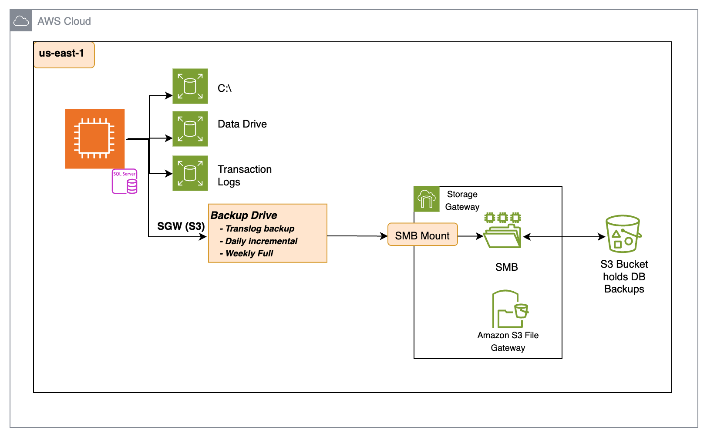

# GC: Sqlserver Database Backup Strategy

**Confluence Page:** https://healthedge.atlassian.net/wiki/spaces/CP1/pages/5177704495/GC%3A%20Sqlserver%20Database%20Backup%20Strategy

**Created by:** Sai Krishna Namburu on October 17, 2025  
**Last modified by:** Sai Krishna Namburu on October 17, 2025 at 02:09 PM

---

Database Level Backups
----------------------

1. Backup Storage:

   * Location: S3 (via Storage Gateway)
   * Backup types and frequency:  
     a. Transaction log backups: Hourly  
     b. Incremental backups: Daily  
     c. Full backups: Weekly
   * Retention : 60 days

→ Database backups will be scheduled via Sqlserver Agent Jobs