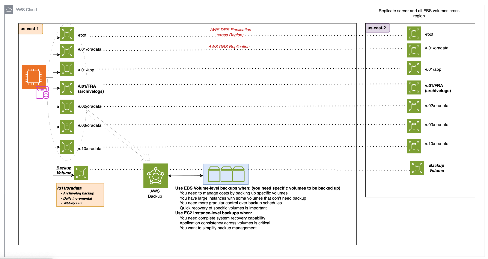

# HRP: Oracle Standalone Database Backup and Disaster Recovery Strategy

**Confluence Page:** https://healthedge.atlassian.net/wiki/spaces/CP1/pages/5177409629/HRP%3A%20Oracle%20Standalone%20Database%20Backup%20and%20Disaster%20Recovery%20Strategy

**Created by:** Sai Krishna Namburu on October 17, 2025  
**Last modified by:** Senthil Ramasamy on December 29, 2025 at 08:28 PM

---

***Option:1 → Database level Backup (using RMAN) & AWS DRS replication for DR***

Database Level Backups for Production databases
-----------------------------------------------

1. Archivelogs:

   * Primary location: /u01/FRA (local EBS volume)
2. Backup Storage: (Oracle RMAN to create database level backups)

   * Location: S3 (via Storage Gateway)
   * Backup types and frequency:  
     a. Archivelog backups: Hourly  
     b. Incremental backups: Daily  
     c. Full backups: Weekly
   * Retention : 14 days (minimum two full backups)
3. **AWS Backup:** In the context of HRP Oracle/Sqlserver standalone DB server setup → Aws backup will be triggered on DB server (EC2 - instance level), daily and stored for 14 days.
4. Decision : 5-1-Backup-Management-Decision

Disaster Recovery (Regional Failure Mitigation) for Production databases
------------------------------------------------------------------------

1. Cross-Region DB server Replication:

   * Utilize AWS DRS (Disaster Recovery Service) to replicate database server (EC2 - all volumes attached to it) across regions. *(us-east-1 to us-east-2)*

***Option:2 - Local EBS volume (as backup drive) attached to each DB server***

**Non-Production database Backup Strategy & Sqlserver databases Backup Strategy →** ***same as above mentioned options → S3(SGW) Vs Local EBS : based on pilot/poc results***

***There is no DR strategy required for the Delphix engine or VDB databases, since the data can be reproduced from the source databases if needed (DR only needed for Prod)***