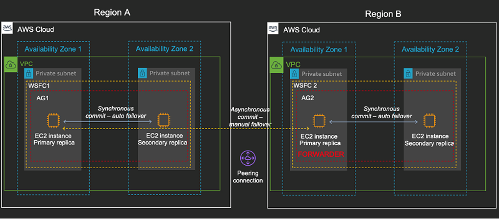
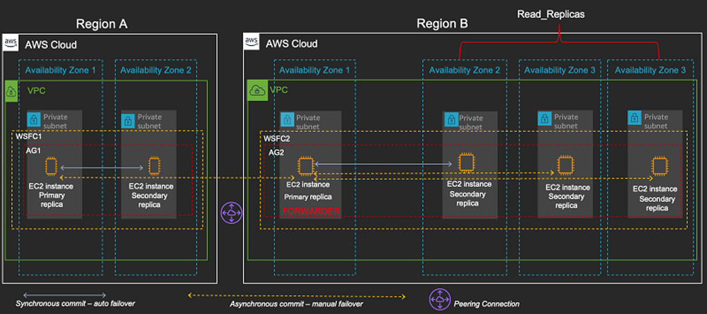

# OLTP Cluster Setup Options

**Confluence Page:** https://healthedge.atlassian.net/wiki/spaces/CP1/pages/5148737812/OLTP%20Cluster%20Setup%20Options

**Created by:** Sai Krishna Namburu on October 06, 2025  
**Last modified by:** Sai Krishna Namburu on October 06, 2025 at 10:08 AM

---

**Decisions:**

*Top 5 tier 1: customers*

2 (AZ1: read write & AZ2: read only) + 2 (AZ1: read only + AZ2 :read only)

*Other customers*

2 (AZ1: read write & AZ2: read only) + 1 (AZ1: read only)

**Setup , configuration and failover scenarios (Top 5 tier 1: customers)**

**Multi-region distributed availability group**

An architecture with distributed availability groups is an optimal approach for multi-region SQL Server deployment. A distributed availability group is a special type of availability group that spans two separate availability groups. You can think of it as an availability group of availability groups. The underlying availability groups are configured on two different WSFC clusters.

The following diagram illustrates the multi-region distributed availability group architecture.

In this architecture, Region A (us-east-1) hosts the primary replica. There is a standalone WSFC cluster named WSFC1 for Region A and doesn’t span Regions like the previous architecture. The synchronous secondary replica is also hosted in Region A, preferably in a second Availability Zone. The primary replica is in AZ1 of Region A, and the synchronous secondary replica is in AZ2. Both the replicas are part of a standalone availability group named AG1. Data transfer is synchronous between the replicas with automatic failover as the failover mode. If you have a failure, automatic failover kicks in and the AZ2 node becomes the primary replica.

As a best practice, the applications should connect via the Always On availability group listener with the latest supported drivers and key parameters (such as MultiSubNetFailover=True) to facilitate the failover and make sure that the applications seamlessly connect to the new replica without any errors or timeouts. There are also quorum-related settings to consider, which this post explains in a later section.

**### Primary Region (us-east-1):**

1. WSFC Setup:

* Create single WSFC spanning AZ1 and AZ2

* Configure multi-subnet clustering

* Setup FSx witness in third AZ

* Configure quorum settings

2. **AOAG Configuration:**

* Configure regular AOAG between AZ1 and AZ2

* Setup synchronous replication

* Configure listener for application connectivity

* Setup read-only routing

* AZ1: Primary (read-write)

* AZ2: Synchronous secondary (read-only)

Region B (DR:  us-east-2) in this architecture is considered as the secondary Region. A second secondary replica is configured in this Region, and is asynchronously synched from the primary, which is hosted in Region A. This replica is called the *forwarder*. The concept of a forwarder is new, and it’s one of the core functionalities for the distributed availability group. The forwarder is responsible for synchronizing the other replicas in Region B.

The forwarder is one of the key advantages of this optimal architecture. The primary replica in Region A sends data asynchronously to the forwarder only, and the forwarder sends data synchronously or asynchronously to the other replicas in Region B. This reduces the overall data transfer that happens from Region A to Region B in case you have multiple nodes in Region B. Because WSFC1 and WSFC2 are standalone and independent clusters, you also don’t need to open a large set of ports. This reduces the security risk.

**### DR Region (us-east-2):**

1. WSFC Setup:

* Create separate WSFC cluster

* Configure multi-subnet clustering

* Setup FSx witness

2. **Distributed AOAG Configuration:**

* Configure Distributed AOAG between regions

* Setup asynchronous replication from us-east-1

* Configure forwarder role in us-east-2 AZ1

* Setup read-only routing within region

**Things to consider**

When choosing your deployment strategy, you should consider bandwidth, quorum settings, and automatic seeding.

**Bandwidth**

Bandwidth is a key consideration for a multi-region deployment. For example, assume you have set a multi-region SQL Server deployment using distributed availability groups across US East (N. Virginia) and US east (Ohio). The network latency for these two Regions is in the range of 15 milliseconds. If your workload is a high OLTP system, you should conduct stress and performance benchmarking tests to make sure that your secondary replicas in the other Region are being synchronized without a huge lag. A significant delay in synchronizing the secondary replicas has an adverse impact on your Recovery Point Objective (RPO) SLAs.

**Quorum settings**

With distributed availability groups, because you have two different WSFC, you treat the quorum settings separately. You must set the quorum votes based on your node count. A file share witness is a recommended witness type, and you can use the fully managed service [Amazon FSx for Windows File Server](https://aws.amazon.com/fsx/windows/) for the file share witness requirements.

**## Failover Scenarios**

**### AZ Failover (us-east-1):**

1. Automatic Failover:

* WSFC detects Primary Replica (AZ1) failure

                  Loss of quorum or node heartbeat timeout (default 5 seconds)

Network partition detection between availability zones

SQL Server service failure or unresponsive database engine

* Automatic failover to Secondary Replica (AZ2)

                  WSFC evaluates cluster quorum and voting configuration

Determines Secondary Replica (AZ2) node as preferred failover target

Initiates automatic failover sequence (typically 30-60 seconds)

* Scale up Secondary Replica (AZ2) instance immediately (to accommodate Read-write and Read-only apps traffic)

* Applications continue database access via same AG listener

2. **Failback Process: (when AZ1 is available)**

* Verify Primary Replica (AZ1) availability

                  \*Root cause analysis for failover (Use WSFC logs)

* Verify the health of nodes in AOAG dashboard

* Optional manual failback (During non-peak hours)

* Verify the cluster health and nodes status

* Scale down Secondary Replica (AZ2) instance

* Return to normal operations

**### Regional Failover:**

1. **Manual Failover to us-east-2:**

* Verify the DAG dashboard for data synchronization status

* Force quorum in us-east-2

* Promote us-east-2 AZ1 to primary

* Update DNS/application routing

* Reconfigure backup/monitoring

* Application connectivity testing and dependencies checks

2. **Failback to us-east-1:**

* Verify us-east-1 recovery

* Verify the DAG dashboard for data synchronization status

* Schedule maintenance window

* Reverse replication (Re-initialize the subscriptions)

* Return traffic to us-east-1

* Re-establish normal replication

* Application connectivity testing and dependencies checks

**## 4. Key Considerations**

* Network bandwidth between regions

* Instance sizing for failover scenarios

* Database size

* Regular testing of failover procedures

* Monitoring and alerting setup

* Backup strategies across regions

* Application connection string management

**Automatic seeding (optional)**

SQL Server 2016 introduced automatic seeding of availability groups. When you create an availability group with automatic seeding, SQL Server automatically creates the secondary replicas for every database in the group. You no longer have to backup and restore secondary replicas manually. This feature can come handy if you deal with a relatively smaller set of databases. If you work with larger databases, automatic seeding isn’t recommended. For more information about automatic seeding, see [Use automatic seeding to initialize an Always On availability group](https://docs.microsoft.com/en-us/sql/database-engine/availability-groups/windows/automatically-initialize-always-on-availability-group?view=sql-server-ver15) on the Microsoft documentation website.

**Scaling out reads (optional)**

You can further extend the distributed availability group architecture to provide read replicas in Region B. This approach is useful if you have users of the applications in two different Regions, and they can consume the reads from a Region that’s closer to them. This improves the latency for read-only SQL queries. The following diagram illustrates this architecture.

This architecture has three additional replicas configured for Region B. The forwarder is responsible for the data synchronization of these three replicas. You can use additional replicas for scaling out the reads. Each availability group supports one primary replica and up to eight secondary replicas. Essentially, you can have up to 18 read replicas with this configuration.

**Conclusion**

A multi-region strategy for your mission-critical SQL Server deployments is key. This post focused on how to achieve that optimally by using distributed availability groups.