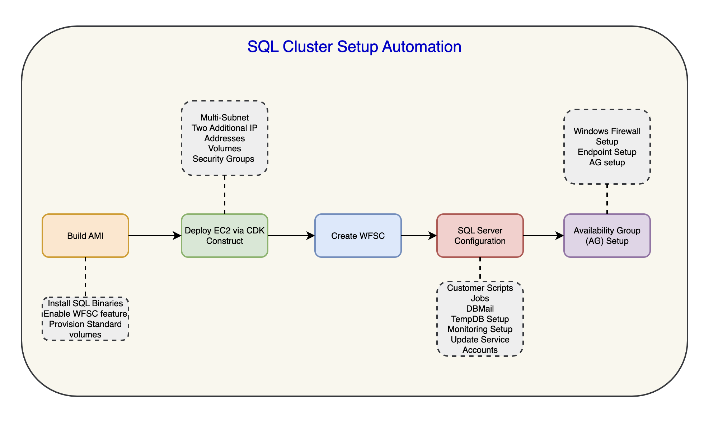

# SQL Server Cluster Setup Automation

**Confluence Page:** https://healthedge.atlassian.net/wiki/spaces/CP1/pages/5250744711/SQL%20Server%20Cluster%20Setup%20Automation

**Created by:** Sai Krishna Namburu on November 19, 2025  
**Last modified by:** Lakshmi Bhavya Kondamadugula on November 21, 2025 at 03:02 PM

---

This page describes about the key areas automated using Power shell scripts to :

* AMI for each SQL Server edition with BYOL: Developer, Standard and Enterprise.
* Provision EC2 instances with the AMI and desired configuration on target AWS account
* Join the nodes to domain
* Windows Server Failover Cluster (WSFC) feature installation
* SQL server configurations.
* Always on Availability Group Configuration - AG and it’s Listener Creation

  

CDK construct:  
<https://github.com/HE-Core/platform.gc-iac/tree/main/config>   
  
Automation Script Repo:  
 <https://healthedgetrial.sharepoint.com/sites/AWSCloudMigration/Shared%20Documents/Forms/AllItems.aspx?id=%2Fsites%2FAWSCloudMigration%2FShared%20Documents%2FMigration%2FGC%2FSQLDB%20server%20%28IAC%2C%20cluster%20config%2C%20AOAG%20etc%29%2FSQL%20build%20automation%2FSQL%5Fbuild&viewid=837a22cf%2D54ca%2D4a80%2D9d28%2D95cf64c9e530&newTargetListUrl=%2Fsites%2FAWSCloudMigration%2FShared%20Documents&viewpath=%2Fsites%2FAWSCloudMigration%2FShared%20Documents%2FForms%2FAllItems%2Easpx>