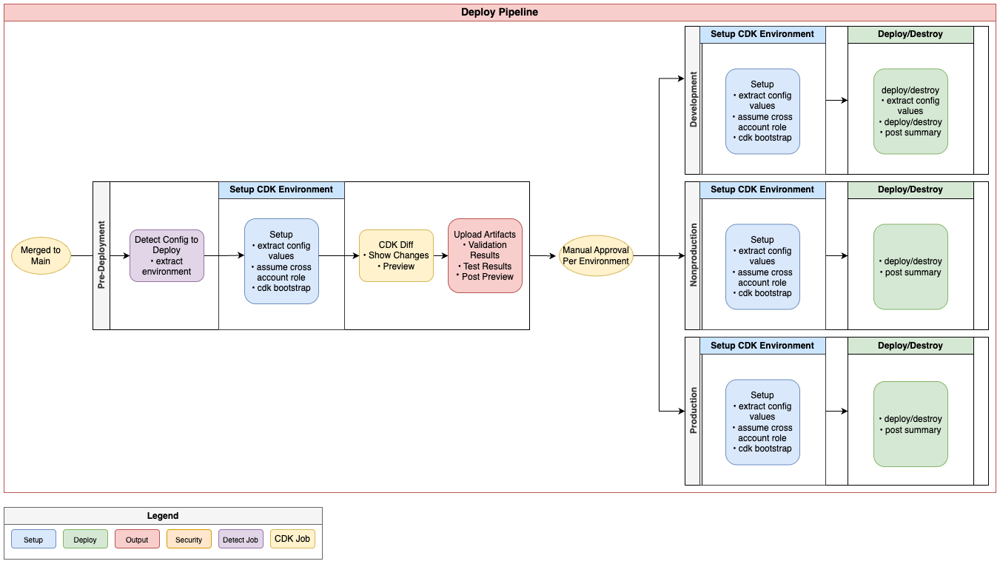
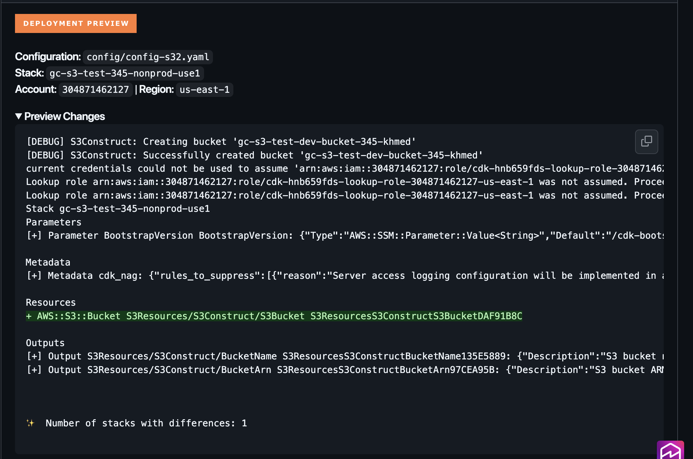

# Deploy Pipeline - Detailed Documentation

**Confluence Page:** https://healthedge.atlassian.net/wiki/spaces/CP1/pages/5331910673/Deploy%20Pipeline%20-%20Detailed%20Documentation

**Created by:** Khalid Ahmed on December 11, 2025  
**Last modified by:** Khalid Ahmed on December 11, 2025 at 12:38 AM

---

**Workflow File:** `.github/workflows/deploy.yml`  
**Trigger:** Push to main branch (config file changes only)

Pipeline Summary
----------------

The Deploy pipeline is responsible for deploying validated infrastructure changes to AWS accounts. It runs automatically when changes to configuration files are merged to the main branch.

This pipeline ensures:

* Only validated changes reach production (after passing test-synth)
* Deployments are grouped by environment for proper sequencing
* Environment-specific approval gates are enforced
* Deployment status is clearly reported

### Pipeline Diagram

Trigger Conditions

The deploy pipeline triggers on:

**Event:** push  
 **Branch:** main  
 Paths:  
 - `config//*.yaml`  
 **-** `config//*.yml`

This means:

* Only runs when config files are changed
* Stack code changes alone do NOT trigger deployment
* Requires merge to main (PR must be approved and merged)

Job Details
-----------

### Job 1: Detect Configs

**Purpose:** Identify changed configs and group them by target environment

**Steps:**

1. **Checkout Code**

   * Fetches last 2 commits for comparison
   * Uses HEAD~1 to compare with previous commit
2. **Detect and Group Configs**

   * Finds all added/modified config files (excludes deleted)
   * Reads globals.environment from each config
   * Groups configs into environment buckets:

     + `dev*` → `development`
     + `nonprod*` → `nonproduction`
     + `prod*` → `production`
     + `shared*` → `shared-services`

Outputs:

* `config_files`: All configs to deploy (JSON array)
* `has_configs`: Boolean if any configs changed
* `dev_configs`: Configs targeting development
* `nonprod_configs`: Configs targeting non-production
* `prod_configs`: Configs targeting production
* `shared_configs`: Configs targeting shared services

### Job 2: Pre-Deployment

**Purpose:** Generate deployment preview and prepare artifacts

**Depends on:** detect-configs  
**Runs when:** has\_configs == 'true'

**Strategy:** Runs in parallel (max 3) for ALL configs (matrix)

**Steps:**

1. **Setup CDK Environment** (Using `setup-cdk-environment` action)

   * Configures AWS credentials
   * Extracts stack name, region, account from config
2. **CDK Diff (for deploy actions only)**

   * Runs cdk diff against existing stack
   * Captures output for preview
   * Detects if this is a new stack
3. **Upload Artifacts**

   * Saves diff output for reference
   * Retains for 30 days
4. **Post Preview**

   * Writes deployment preview to GitHub Actions summary
   * Shows stack name, account, region
   * Displays diff output in collapsible section
   * Shows destruction warning for destroy actions

Job 3: Environment Deployments

**Purpose:** Deploy configurations to their target AWS environment

The pipeline includes four environment-specific deployment jobs that are functionally identical. The key distinction is the GitHub Environment each job references, which determines the approval gates and access controls applied. This design enables environment-appropriate deployment restrictions, including required reviewers, environment-specific variables, and secrets. Higher-criticality environments such as production can enforce stricter controls, while development environments allow for faster iteration.

| **Job Name/Environment** | **Runs When** |
| --- | --- |
| development | `dev_configs` != ‘[]’ |
| nonproduction | `nonprod_configs` != ‘[]’ |
| production | `prod_configs` != ‘[]’ |
| shared-services | `shared_configs` != ‘[]’ |

**Baseline Configuration:**

* Depends on: `detect-configs`, `pre-deployment`
* Strategy: Runs in parallel (max 2) for environment configs (matrix)
* Runs only if configs exist for that environment

**Steps** (identical for all environments):

1. **Checkout Code**
2. **Deploy Stack (via deploy-stack action)**

   * Sets up CDK environment
   * Runs cdk deploy or cdk destroy based on cdk\_action
   * Posts deployment summary

**GitHub Environment Features:**

* Required reviewers: Pause deployment until approved
* Wait timer: Delay deployment by specified duration
* Branch restrictions: Limit which branches can deploy
* Environment secrets: Store environment-specific credentials
* Deployment history: Track all deployments to environment

**Reusable Actions**
--------------------

### deploy-stack

**Location:** `.github/actions/deploy-stack/action.yml`

**Purpose:** Execute CDK deploy or destroy for a single configuration

**Steps:**

1. **Setup CDK Environment** (Using `setup-cdk-environment` action)

   * Configures AWS credentials
   * Extracts stack name, region, account from config
2. **Download Pre-deployment Artifacts**

   * Retrieves diff output from pre-deployment job
3. **CDK Deploy/Destroy**

   * Executes appropriate CDK command based on `cdk_action`
   * `deploy`: cdk deploy --require-approval never
   * `destroy`: cdk destroy --force --require-approval never
   * Captures output for reporting
4. **Post Summary**

   * Writes deployment status to GitHub Actions summary
   * Shows success/failure badge
   * Displays stack outputs (for deploy)
   * Shows error details (for failures)
   * Links to AWS Console
5. **Upload Logs**

   * Saves deployment output as artifact
   * Retains for 30 days

**Outputs:**

* `deployment-status`: success or failure
* `stack-name`: Name of deployed stack
* `action`: deploy or destroy

Deployment Actions
------------------

The pipeline supports two deployment actions, controlled by `globals.cdk_action`:

### Deploy (`cdk_action`: deploy)

* Creates new stack if it doesn't exist
* Updates existing stack with changes
* Runs with --require-approval never (pre-approved via PR)
* Outputs stack resources and values

### Destroy (`cdk_action`: destroy)

* Deletes the stack and all its resources
* Runs with --force flag (no confirmation prompt)
* Permanently removes all resources
* Config file should be deleted after successful destroy

**Cross Account Deployment**
----------------------------

The pipeline uses a two-step credential chain:

1. **OIDC Authentication**

   * GitHub Actions authenticates to AWS via OIDC
   * Assumes DeployerRole in the central account
   * No long-lived credentials stored in GitHub
2. **Cross-Account Role Assumption**

   * `DeployerRole` assumes CrossAccountDeploymentRole
   * `Target role` exists in each environment account
   * Provides permissions for CDK operations

**Required IAM Setup:**

**Central Account (DeployerRole):**  
 - Trust: GitHub OIDC provider  
 - Permissions: `sts:AssumeRole` to target accounts

**Target Accounts (CrossAccountDeploymentRole):**  
 - Trust: DeployerRole from central account  
 - Permissions: CloudFormation, CDK bootstrap resources