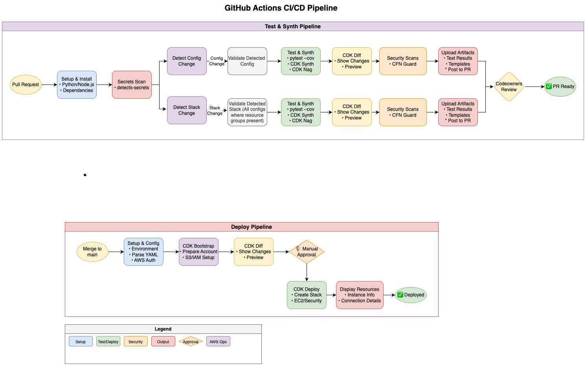
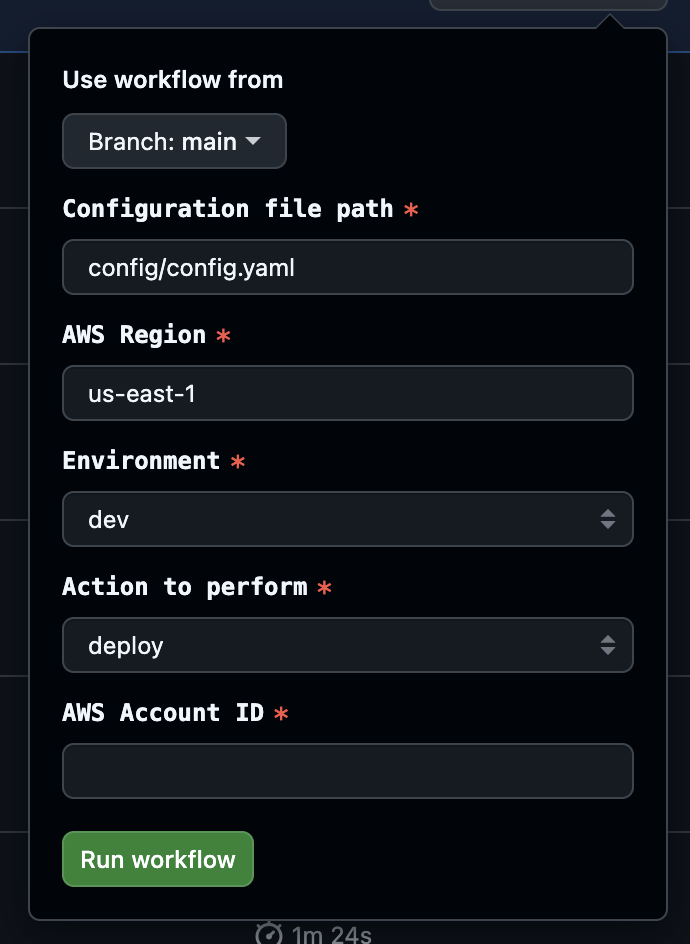
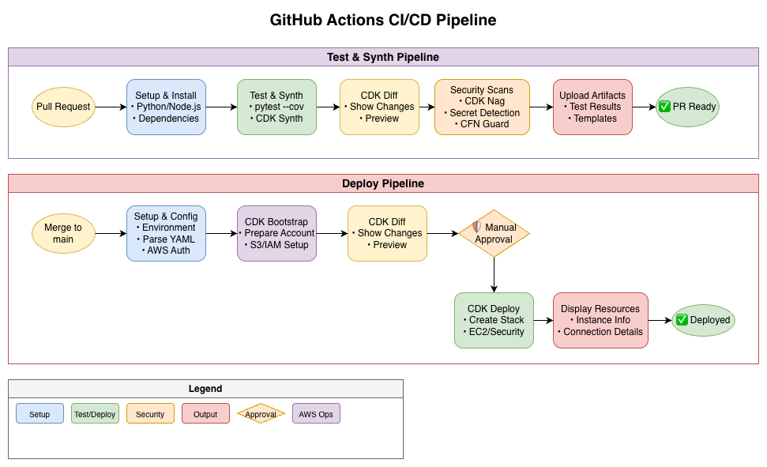

# IaC Pipelines Status 2025.11.12

**Confluence Page:** https://healthedge.atlassian.net/wiki/spaces/CP1/pages/5227577473/IaC%20Pipelines%20Status%202025.11.12

**Created by:** Chris Falk on November 12, 2025  
**Last modified by:** Chris Falk on December 05, 2025 at 01:30 PM

---

Summary
-------

This document presents the desired functionality and business objectives of the HealthEdge infrastructure CI/CD pipelines, and clarifies the current state and remaining scope to complete delivery.

Infrastructure Development Business Goals & User Journeys
---------------------------------------------------------

Infrastructure as Code (IaC) allows for AWS resources to be defined with AWS Cloud Development Kit (CDK) code stored in version-controlled repositories. It enables infrastructure, operations, and application teams to easily deploy AWS infrastructure with a configuration-based approach, and automates the testing and deployment of those resources. Use of standardized IaC pipelines also centralizes the function of deploying AWS resources, avoiding the need for elevated user privileges, and facilitating change management, security review, and reduced opportunity for error.

At HealthEdge, there are two primary user journeys related to IaC pipelines, platform developer and IT/engineering user.

### Platform developer

As the HealthEdge cloud platform team developer, I want to define standard patterns of infrastructure, so that IT and engineering teams can deploy approved cloud resources quickly and securely.

### IT/Engineering user

As an IT or engineering user, I want to use simple YAML-based configuration to define my AWS infrastructure, so that I can iterate and innovate rapidly without having to learn AWS CDK.

Existing IaC Repository & Pipeline Design
-----------------------------------------

As of this writing, there are repositories in place for two business units: HRP and Guiding Care. These repositories contain a CDK Python application that implements AWS resources, driven by YAML configuration files, with GitHub Actions CI/CD pipelines.

The current pipeline design uses GitHub Actions to implement two functions:

* Test & Synth - Runs unit tests and `cdk synth` to validate the code and generate CloudFormation output
* Deploy - Performs CDK bootstrap, then runs a `cdk deploy` to update deployed AWS resources

The GitHub Actions pipeline uses OIDC to authenticate to AWS and retrieve temporary API credentials, which are then used to assume roles the target accounts to deploy resources.

Both workflows are manually executed today through the the GitHub user interface:

### Limitations & Risks of Current Approach

The existing approach represents an MVP pipeline implemented to support the migration team and has a number of limitations that must be addressed before widespread pipeline adoption by HealthEdge:

* Pipeline actions are executed manually in the GitHub interface; no automated triggers are used
* The current workflow supports a single configuration file, environment, and region at a time
* There is no block on pushes to main or review/approval requirements for merging pull requests
* Security and secrets scans must be done locally instead of in the pipeline today
* Pipeline deployment stage does not require review and approval after `cdk diff` , with the potential for destructive change without prior approval
* There is only limited deletion protection for specific resources (EC2 instances and volumes)

### Remaining Scope

To address the limitations and risks, the following tasks remain to complete by 11/30/25:

* Automated execution on pull requests and merges with manual approval when config files change, and deprecate manual execution:

  + On pull request, execute unit tests, run CDK synth, CDK diff to show changes, and security scanning, updating the PR with the build result
  + On merge to main, run CDK bootstrap, CDK diff to show changes, wait for required manual approval step, followed by CDK deployment
  + Updates to construct (non-config) code runs against all configs for test/deploy pipelines, and includes CODEOWNERS requiring review from the platform and security teams
  + Multi-threaded execution - automatic detection of and execution for each configuration file included in a PR/merge
  + AWSM-8298ba6e06f-7495-3c95-8cfd-817d67fc0380System Jira
  + AWSM-8328ba6e06f-7495-3c95-8cfd-817d67fc0380System Jira
  + AWSM-8338ba6e06f-7495-3c95-8cfd-817d67fc0380System Jira
* ✅ ~~Prevent pushes to the main branch and require approval and review for merging pull requests to main~~
* Security scanning in the pipeline - cdk-nag, secrets, cfn-guard test

  + AWSM-8218ba6e06f-7495-3c95-8cfd-817d67fc0380System Jira
  + AWSM-8238ba6e06f-7495-3c95-8cfd-817d67fc0380System Jira
  + AWSM-8258ba6e06f-7495-3c95-8cfd-817d67fc0380System Jira
  + AWSM-8278ba6e06f-7495-3c95-8cfd-817d67fc0380System Jira
  + AWSM-9958ba6e06f-7495-3c95-8cfd-817d67fc0380System Jira
* Enable CloudFormation stack deletion protection by default for all deployed stacks

  + AWSM-9948ba6e06f-7495-3c95-8cfd-817d67fc0380System Jira
* Update repository README.md and develop comprehensive developer documentation for both personas, and perform training and knowledge transfer to the HealthEdge devops teams

  + AWSM-9938ba6e06f-7495-3c95-8cfd-817d67fc0380System Jira

The following diagram shows the target state of the pipeline after scope completion:

Day 2 Improvements
------------------

Beyond the initial implementation by AWS Professional Services, future improvements to the process may include the refactoring of construct code into python packages that can be semantically versioned. This would allow individual configurations to use specific versions of a package and adopt new versions when they are ready instead of globally.

HealthEdge may also implement more complex constructs in addition to infrastructure resource primitives with a goal of enabling teams to deploy entire stacks of an application or supporting patterns through a simple configuration file.

Beyond CDK itself, these additional constructs could be used in conjunction with AWS Service Catalog to make these patterns available to application teams in a self-serve manner that doesn’t require application team interaction with infrastructure-as-code at all.