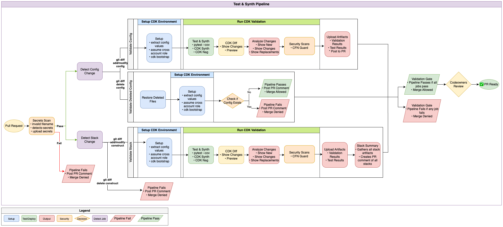

# Test Synth Pipeline - Detailed Documentation

**Confluence Page:** https://healthedge.atlassian.net/wiki/spaces/CP1/pages/5330665533/Test%20Synth%20Pipeline%20-%20Detailed%20Documentation

**Created by:** Khalid Ahmed on December 10, 2025  
**Last modified by:** Khalid Ahmed on December 10, 2025 at 07:39 PM

---

**Workflow File:** `.github/workflows/test-synth.yml`  
**Trigger:** Pull Request opened or reopened to main branch

Pipeline Summary
----------------

The Test & Synth pipeline is the first line of defense in the CI/CD process. It runs automatically when a Pull Request is created or reopened, validating all changes before they can be merged to the main branch.

This pipeline ensures:

* Secret detection to prevent credential leaks
* Filename validation for consistency
* Unit test execution for affected constructs
* CDK Synthesis to verify templates generate as expected
* CDK Diff to generate expected outcome from template
* Cloudformation Guard for compliance check
* Deleted config/construct protection
* Automated PR comments with validation results based on config or stack modifications

### Diagram

Job Details
-----------

### Job 1: Security Scan

**Purpose:** Prevent security vulnerabilities from entering the codebase

**Steps:**

1. **Check for Invalid Filename**

   1. Validates all config and stack files follow naming conventions
   2. Allowed characters: a-z, A-Z, 0-9, hyphen, underscore, dot
   3. Supports subdirectories (config/team/project.yaml)
   4. Fails PR if invalid filenames detected
2. **Scan Secrets**

   1. Uses detect-secrets library to scan changed files
   2. Identifies potential API keys, passwords, tokens
   3. Uploads scan results as artifact for review
   4. Posts PR comment if secrets detected
   5. Blocks merge if secrets found

Outputs:

* `secrets_found`: boolean indicating if secrets were detected
* `scan_results`: JSON containing detected secrets (if any)

### Job 2: Detect Config Changes

**Purpose:** Identify which configuration files were added, modified, or deleted

**Depends On:** security-scan (must pass)

**Steps:**

1. **Compares PR branch to base branch** (main)
2. Filters for files matching `config/.yaml` *or* `config/.yml`
3. **Categorizes changes by status**:

   1. **Added (A)**: New configuration files
   2. **Modified (M)**: Updated configuration files
   3. **Deleted (D)**: Removed configuration files

Outputs:

* `config_files`: JSON array of added/modified configs to validate
* `has_changes`: boolean if any configs need validation
* `deleted_configs`: JSON array of deleted config files
* `has_deleted`: boolean if any configs were deleted

### Job 3: Detect Stack Changes

**Purpose:** Identify CDK construct changes and determine affected configurations

**Depends On:** security-scan (must pass)

**Steps:**

1. **Check for Deleted Constructs**

   1. Blocks deletion/renaming of construct files (`stacks/*.py`)
   2. Prevents breaking existing configurations
   3. Posts PR comment explaining the restriction
2. **Detect Modified Constructs**

   1. Identifies changed stack files (excluding `unified_stack.py`, `init.py`)
   2. Maps files to resource groups via `stack-mappings.json`
   3. Finds all configs that use affected resource groups
3. **Smart Config Selection**

   1. If all changed files are mapped: validate only affected configs
   2. If any file is unmapped: validate ALL configs (safety measure)

Outputs:

* `config_files`: JSON array of configs to validate
* `has_changes`: boolean if validation needed
* `resource_groups`: space-separated list of affected groups
* `stack_files`: list of modified stack files
* `has_deleted_constructs`: boolean if constructs were deleted

### Job 4: Validate Deleted Configs

**Purpose:** Ensure deleted config files don't leave orphaned AWS resources

**Depends On:** Config files being deleted in the PR

**Strategy:** Runs in parallel for each deleted config (matrix)

**Steps:**

1. **Restore Deleted Config**

   1. Retrieves config content from previous commit
   2. Allows extraction of stack name and account info
2. **Setup CDK Environment** (Using `setup-cdk-environment` action)

   1. Configures AWS credentials
   2. Extracts stack name, region, account from config
3. **Check if Stack Exists**

   1. Queries AWS CloudFormation for the stack
   2. Logs account ID and region for visibility
   3. Determines if stack is still deployed
4. **Post Deletion Status**

   1. Comments on PR with stack status
   2. Warns if stack still exists (must destroy first)
   3. Confirms safe to delete if stack not found

### Job 5: Validate Configs

**Purpose:** Validate configuration file changes can synthesize and pass tests

**Depends On:** Detect Config Changes

**Runs when:** Config files are added or modified

**Strategy:** Runs in parallel (max 2 at a time) for each changed config (matrix)

**Steps:**

1. **Setup CDK Environment** (Using `setup-cdk-environment` action)

   1. Installs Python 3.13, Node.js 24, AWS CDK
   2. Configures AWS credentials via OIDC
   3. Assumes cross-account deployment role
   4. Bootstraps CDK in target account
2. **Run CDK Validation** (Using `run-cdk-validation` action)

   1. Executes pytest for associated test files
   2. Runs cdk synth to generate CloudFormation template
   3. Performs cdk diff against existing stack
   4. Runs CloudFormation Guard compliance checks
   5. Detects breaking changes
3. **Post Validation Report**

   1. Comments on PR with detailed results
   2. Shows test status, synth status, diff output
   3. Highlights breaking changes
   4. Displays compliance check results

### Job 6: Validate Stack

**Purpose:** Validate CDK construct changes against affected configurations

**Depends On**: Detect Stack Changes

**Runs when:** Stack files (`stacks/*.py`) are modified

**Strategy:** Runs in parallel (max 2 at a time) for each changed config (matrix)

**Steps:**

Steps:

1. **Setup CDK Environment** (Using `setup-cdk-environment` action)

   1. Same as validate-config
   2. Passes affected resource groups for filtering
2. **Run CDK Validation** (Using `run-cdk-validation` action)

   1. Runs cdk synth (no tests for stack validation)
   2. Validates template generation
   3. Runs compliance checks

### Job 7: Stack Summary

**Purpose:** Aggregate and report stack validation results of all tested configs

**Depends On**: Validate Stack

**Runs when:** Stack files were changed (always runs if stack\_files not empty)

Steps:

1. **Download Validation Artifacts**

   1. Collects results from all validate-stack jobs
2. **Generate Summary**

   1. Posts consolidated PR comment
   2. Shows which configs were tested
   3. Reports any failures or warnings

### Job 8: Validation Gate

**Purpose:** Final check to determine if PR can be merged

**Runs On:** Always (regardless of other job outcomes)

**Steps:**

* Checks result of all previous jobs
* Allows "skipped" status (job didn't need to run)
* Fails if any job failed
* Passes only if all jobs succeeded or were skipped

This job is set as a required status check in GitHub branch protection rules and will not allow merges to main if any errors are found.

Reusable Actions
----------------

The `test-synth.yml` workflow uses the following reusable composite actions:

### setup-cdk-environment

**Location:** `.github/actions/setup-cdk-environment/action.yml`

**Responsibilities:**

* Install Python, Node.js, AWS CDK
* Parse config file and extract globals
* Map environment to AWS account via account-mapping.json
* Generate stack name from config values
* Configure AWS credentials (OIDC + cross-account assume)
* Bootstrap CDK in target account/region

**Outputs:**

* `stack-name`, `org-name`, `project-name`, `region`, `account-id`
* `environment`, `cdk-action`, `resource-groups`, `test-files`

### run-cdk-validation

**Location:** `.github/actions/run-cdk-validation/action.yml`

**Responsibilities:**

* Run pytest on specified test files
* Execute cdk synth
* Run cdk diff
* Execute CloudFormation Guard checks
* Detect breaking changes

**Outputs:**

* `pytest-status`, `synth-status`, `diff-status`
* `has-breaking`, `is-new-stack`, `cfn-guard-status`

### PR Comment Scripts

The pipeline posts informative comments on PRs using JavaScript scripts:

Location: `.github/pr-comments/`

* `post-secret-scan.js`: Reports detected secrets
* `post-deleted-config.js`: Reports deleted config stack status
* `post-deleted-construct.js`: Blocks construct deletion
* `post-validation-report.js`: Detailed validation results
* `post-stack-summary.js`: Aggregated stack validation results