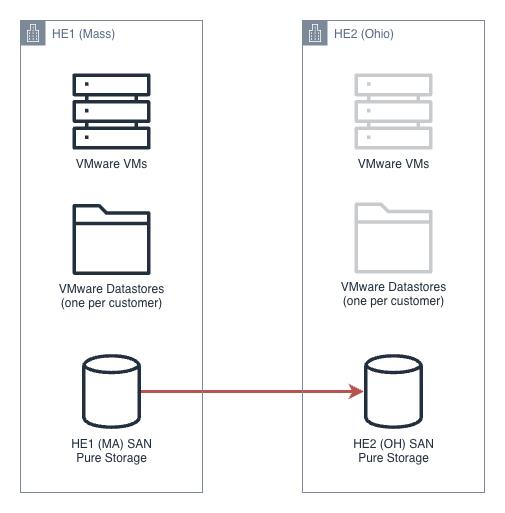
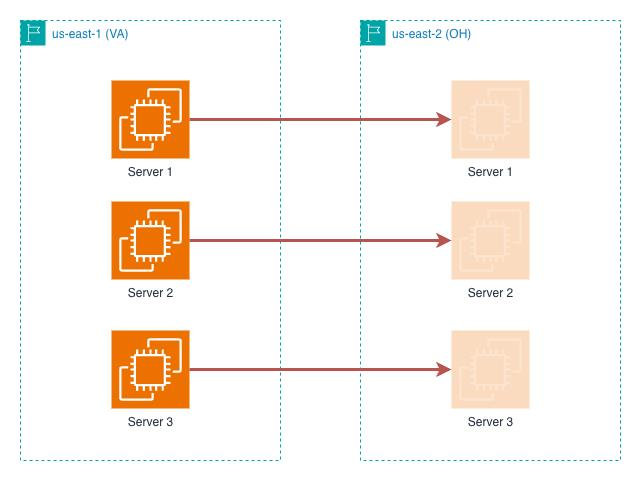

# HRP Disaster Recovery Scoping Overview

**Confluence Page:** https://healthedge.atlassian.net/wiki/spaces/CP1/pages/5269651616/HRP%20Disaster%20Recovery%20Scoping%20Overview

**Created by:** Chris Falk on November 24, 2025  
**Last modified by:** Chris Falk on December 12, 2025 at 08:32 PM

---

This document provides a brief analysis of the options for implementing HRP Disaster Recovery in AWS. It reviews DR contractual and compliance requirements, the current on-premise DR implementation and why it cannot be directly rehosted to AWS, the details of proposed new scope, and a set of alternatives for consideration.

Disaster Recovery Requirements, Existing Recommendations, Timeline
------------------------------------------------------------------

While specific recovery point objective (RPO) and recovery time objective (RTO) details vary by customer, HRP contracts require cross-datacenter disaster recovery with the option to execute 1-2 disaster recovery exercises per year.

With this requirement in mind, AWS completed a complimentary workshop to discover and design a preliminary set of recommendations for implementing DR for HRP in AWS. In order to satisfy requirements for DR in production, implementation would need to be MVP-ready by 2/6/2026 (start of the first production wave) with full validation and test-ready automation completed by 3/13/2026 (cutover of the first production wave).

Current On-Premises Disaster Recovery Capability
------------------------------------------------

The existing HRP environment spans two datacenters in MA and OH, which DR architecture comprises VMware and Pure Storage SAN block storage. Each customer has a specified primary and secondary datacenter. In the primary datacenter the customer’s production virtual machines reside on a single VMware datastore mapped to a single Pure volume. This volume is replicated in realtime to the secondary datacenter.

In the event of a disaster or DR testing, VMware Site Recovery Manager is used to activate the secondary region storage volume, deactivate the primary region, and boot the virtual machines in the secondary datacenter. Data changes can then be replicated back to the primary datacenter where failback is the reverse of failover. The customer must only change the endpoint of their VPN to the DR environment to fail over.

Limitations to Mirroring This Approach in AWS
---------------------------------------------

The AWS Landing Zone design supports a similar approach in principle, with identical customer-facing NAT IP ranges in the DR region so that customer activities for testing are minimized. Customers will migrate to one of two primary regions, each with an DR region:

* Primary: us-east-1 (VA), Secondary: us-east-2 (OH)
* Primary: us-west-2 (OR), Secondary: us-west-1 (CA)

While the primary data transport mechanism in AWS is still block-level replication, in this case using AWS Elastic Disaster Recovery Service (DRS), DRS operates at the level of individual virtual machines (instances) instead of at the lower level of the SAN volume for the entire customer workload. DRS is based on the same technology used to rehost VMs to AWS, applied across two AWS regions. As a result, the existing DR solution cannot be migrated “as-is”.

The DRS service enables data replication and failover capability, but additional automation is required to achieve a near-seamless failover experience similar to the on-premise solution. The necessary automation includes deployment and configuration of the DRS agent, network isolation for testing, stopping source instances and automating the failover process, updating internal DNS, failback preparation, and other related tasks.

In addition to specific instances, there are other shared services to be accommodated in the design such as AWS Elastic Kubernetes Service (EKS) for WebUI and Melissadata, FSx for NetApp ONTAP for file shares, Active Directory and DNS services, SFTP, MOVEit, and others that each need a DR solution that is either highly available across regions (active-active) or replicated in some way (active-passive).

Proposed New Scope
------------------

The AWS Professional Services statement of work reads that HRP “DR requirements will be met by migrating systems as-is, leveraging multi-AZ deployments where feasible.” The existing HRP stack’s most critical components such as Oracle database are single-instance and thus single-availability-zone (AZ), and as noted above the existing approach cannot migrate “as-is”.

We are proposing additional scope to address comprehensive DR for HRP:

* Iterate the complimentary workshop’s preliminary design recommendations into final ready-to-implement designs
* Implement for both core workloads and common shared services, including full automation for failover and testing
* Develop runbooks for DR testing and failover
* Perform DR test for one non-production workload
* Assist the migration team to integrate DR deployment into the migration process
* Documentation and knowledge transfer to the HRP team

This scope would require retasking most of the existing DR team onto the HRP effort in the sprint beginning 12/3/2025 and bringing on additional and backfill resources to support the parallel work on both GC and HRP DR workstreams. The cost of this additional comprehensive scope is estimated at $592K.

Alternative Approaches
----------------------

In lieu of the full additional scope, there are alternatives to consider that each carry associated risks:

* Implement only a minimal DRS agent install and service activation, and develop a manual runbook for DR testing

  + RISKS: Degrades the customer and internal IT experience of running DR tests, introduces potential for human error, could result in not meeting RTO for an actual disaster given extensive manual steps
  + COST: Could be accomplished within existing scope
* In addition to the above, after completion of the full Guiding Care DR implementation, the HRP team could receive knowledge transfer and documentation of the GC solution and adapt it to HRP, eventually eliminating the manual process above

  + RISKS: Extensive time required of limited HRP engineering team resources in addition to the risks above
* AWS could complete only the detailed design design for Guiding Care scope and swap the GC implementation scope for HRP design/implementation. The HealthEdge team could then take on the Guiding Care implementation based on the completed designs at a later date.

  + RISKS: Further delay to DR availability for Guiding Care, HRP and GC engineering time required for implementation
  + COST: ~$300K additional effort, 50% of full scope proposed above

Recommendation
--------------

The full additional HRP scope provides the best combination of customer experience for DR testing/failover and comprehensive coverage across both applications.

If this is not possible, the second option we would recommend is to swap scope and defer GC implementation to focus on HRP, still delivering on time to avoid blocking HRP migration to production. The lack of DR for Guiding Care is not a hard blocker to production migration since it is not in place on premises today.

Appendix 1 - Assumptions
------------------------

After the November 25, 2025 call to review and discuss, the following are the updated assumptions for HRP DR:

* Customer production environment server counts range from 10 (DMNT) to 44 (BCBS of Arizona)
* The solution must support a 15 min RPO and a 4 hour RTO
* Customers do not perform production activities during DR tests, but the DR testing process must be identical to an actual DR incident - there can only be one active environment at a time

  + Originally, we assumed DR testing would be in an isolated network with a temporary copy of the infrastructure which is destroyed after testing
* The process should assume the possible lack of availability of an entire primary region (us-east-1 or us-west-2), including that region’s AWS services and APIs in an actual disaster

  + For example, inability to stop source instances due to EC2 API unavailable, can’t run step function in source region, DRS not available for failback in source region, etc.
* Any changes made in the DR environment must be replicated back to the primary environment
* AWS Elastic DRS will be used for block level replication of individual instances, EKS clusters will already exist in the DR region with scaled down pods
* The capability to deploy code/upgrades and otherwise administer servers should be available in the DR environment, but we should not expect new infrastructure to be deployed during a DR test or incident; scaling instances vertically is OK
* EC2 instances with no disks will be pre-created in the target region for rapid recovery with pre-allocated IP addresses, last octet matching primary region, with customer VPN NAT already in place
* The failback process will re-use existing source instances, detaching their existing EBS volumes and recovering the failback replicated volumes into them
* The DR region has different internal IP addressing from the primary region, but NAT to the customer will be the same through the Palo Alto firewalls
* Each customer will have at least one Active Directory server already present in the DR region, AD will not be failed over with DRS; common AD will pre-exist as well (healthedge.biz)
* The landing zone will already implement the full set of required network services (DNS forwarding for AD, Transit Gateway network with firewall inspection, Palo Alto customer VPN readiness, etc.)
* The DR failover process will operate as follows, automated with a customized AWS Step Functions + Lambda workflow:

  + Stop all source instances and wait for data replication to complete
  + DRS failover is performed for all instances in specific sequence TBD
  + Reinstall SSM agent to use DR region endpoint
  + DNS updates are performed (server IPs will be changed to known new IPs)
  + Recovery region EKS cluster WebUI pods for this customer are brought online and DNS updated to point to DR region load balancer
  + SSM automation to execute validation scripts is run to confirm environment readiness for customer use
  + Failback replication to the primary region is initiated
  + Customer flips their VPN endpoint to the DR region Palo Alto
  + Customer performs testing and validation of DR environment and confirms completion
  + Stop all DR instances and wait for data replication back to primary region to complete
  + DRS failback is performed for all instances in specific sequence TBD
  + Reinstall SSM agent to use primary region endpoint
  + DNS updates are performed back to original IPs, including WebUI load balancer back to primary
  + Recovery region EKS cluster WebUI pods for this customer are scaled back down to zero
  + SSM automation to execute validation scripts is run to confirm primary environment readiness for customer use
  + Replication to the DR region is re-initiated
  + Reporting for the test results (timing, logs, compliance validation of meeting RTO/RPO, etc.) is produced and stored
* In addition to the customer compute and WebUI microservices, other shared services need DR capabilities implemented and failover automated. These services would likely not be failed over in a test but would need to be failed over in a true DR incident, and include SFTP, MOVEit, network file shares, AWS Storage Gateway and S3 for database backups, jump servers for administration, common Kubernetes services (MRF, PDM) and their data sources, and CI/CD (Jenkins, Ansible) tools. Some of these dependencies could eventually be refactored into active-active or active-passive configurations over time.

Appendix 2 - HRP/GC Design and Implementation Gaps
--------------------------------------------------

### Design Gaps

AWS provided a high level set of recommendations for HRP DR early in the engagement, and after reviewing HRP components against the designs applicable to Guiding Care components, there is only **one partial gap** to address in design for specific HRP components that an already completed GC strategy won’t address. The failback process for DRS is a fresh replication of the failed-over servers, so the latest HRP customers may take longer to failback than the ~4-hour window for DR testing. *We are still evaluating if this is the case or if incremental failback is possible.* This might require a different block storage solution that is capable of rapid failback for larger data volumes (e.g. AWS FSx for NetApp ONTAP). The orchestration solution proposed is designed to be used across business units. The remaining differences between the two come down to the resource-level modules and their implementation details, and the fact that there are additional GC-specific components (MongoDB, Valkey, DocIO, and others) that do not need to be implemented for HRP.

TL;DR - HRP is simpler than Guiding Care, and DR techniques for GC also cover the requirements for HRP as designed with one exception for very large customer DB instances.

|  |  |  |  |
| --- | --- | --- | --- |
| **Service Name** | **Current Technology** | **Recommended DR Strategy** | **Gap?** |
| EC2 Application Servers (non-DB) | Pure storage replication with VMware SRM | AWS Elastic Disaster Recovery | No |
| Oracle OLTP Database | Oracle on-premises with Golden Gate/Click replication | AWS Elastic Disaster Recovery Larger customers might require Oracle DB replication or FSx for NetApp ONTAP block storage and SnapMirror | Partial |
| SQL Server Data Warehouse | SQL Server Always On Availability Groups | Always On Distributed Availability Groups | No |
| SFTP Services | Shared SFTP servers with customer folders | AWS Elastic Disaster Recovery | No |
| Move-IT File Transfer | Move-IT servers | AWS Elastic Disaster Recovery | No |
| Kubernetes Workloads (WebUI & Melissa Data) | On-premises Kubernetes cluster | Amazon EKS + ECR | No |
| Okta SSO | Okta SSO integration | Application makes external calls | N/A |
| Third-Party Integrations (CES/CXT/Source) | Site-to-site VPN connections | AWS Site-to-Site VPN + Transit Gateway | No |
| Active Directory + RedHat IDM | Common AD/IDM + customer-specific AD servers | Self-hosted AD/IDM on EC2 in all four regions Route53 outbound forwarding for DNS | No |
| Network Infrastructure | Stretched networks between data centers Palo Alto VPN | Already part of landing zone design as implemented IP addresses will differ, customer NAT unchanged Palo Alto VPN in AWS | No |
| Monitoring & Alerting | Basic monitoring with manual procedures | Existing app/OS level tools plus AMS baseline monitoring | N/A |
| Backup Services | Traditional backup to tape | AWS Backup for instances in region Storage Gateway + S3 for DB backups in region Backups **not** replicated to DR region | No |

### Implementation Gaps

Once the foundational components (orchestration and modular automation) are implemented, and HRP-specific modules are in place, there will remain additional work for Guiding Care to extend the solution further to support their additional component. This comprises the following:

* Vend accounts for GC DRS and activate
* Enhancements to support FSx for NetApp ONTAP SnapMirror if needed for larger customers
* Implement modules for failover of GC components not used by HRP (MongoDB, Valkey, specific EKS services and APIs, Airflow, API Gateway, public ALBs, FsX)
* Implement and validate isolated “bubble” testing capability (HRP is an actual failover/failback for testing)
* Additional “day 2” enhancements for monitoring, dashboards, optimization, testing at scale

Based on the estimated stories currently in the backlog, we expect this to be 976 hours or approximately an additional 8 additional weeks of effort from an experienced three person team to deliver, with the bulk of the effort in the bubble testing and day two enhancements and optimization. This is approximately half the original effort expected for a parallel implementation of both HRP and GC in the constrained timeline, due to the additional resources that would have been needed.