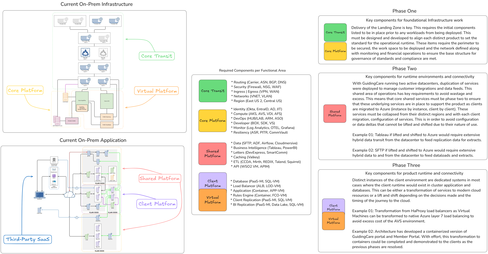
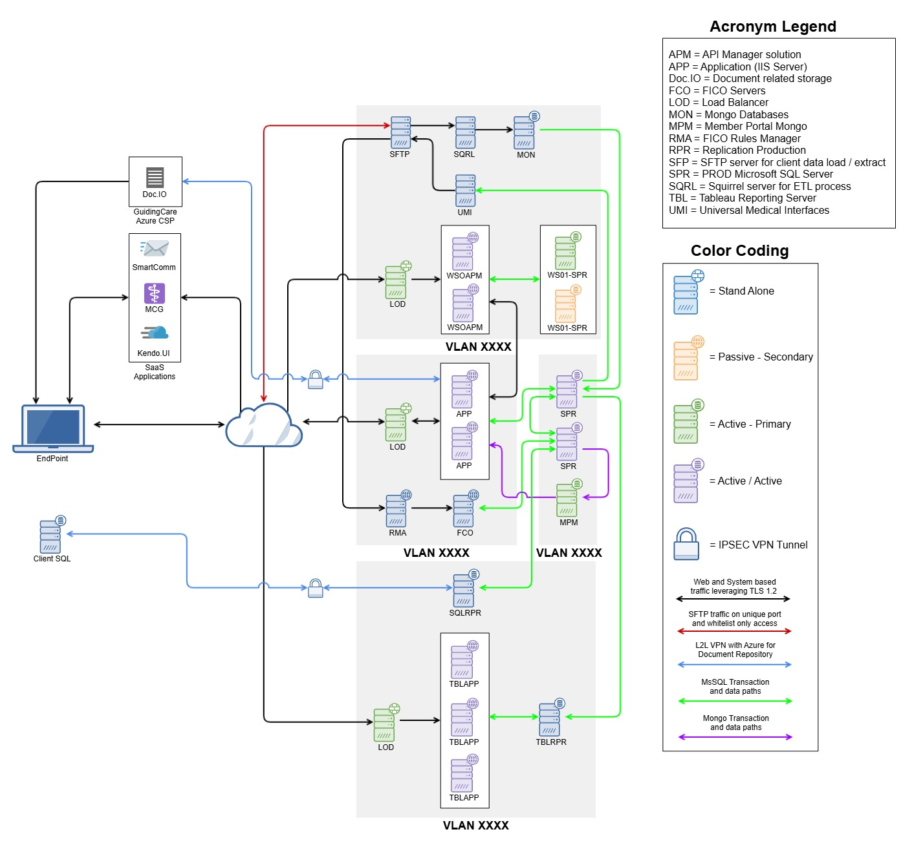
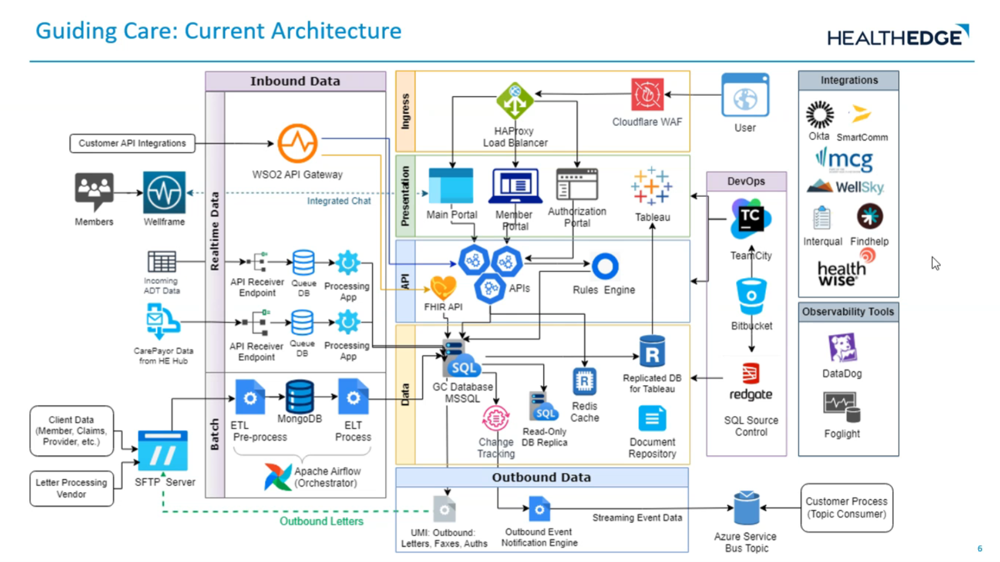

# Guiding Care - DR Discovery Session

**Confluence Page:** https://healthedge.atlassian.net/wiki/spaces/CP1/pages/4936630586/Guiding%20Care%20-%20DR%20Discovery%20Session

**Created by:** Lei Shi on July 16, 2025  
**Last modified by:** Venkata Kommuri on August 06, 2025 at 06:46 PM

---

The session focused on understanding disaster recovery requirements for the Guiding Care application ahead of AWS migration. Key points include a default RTO of 4 hours and RPO of 30 minutes across most contracts, with some customers requiring stricter SLAs. The application currently runs on-premise across two data centers (Los Angeles and VA) with limited DR capabilities. Critical concerns include managing customer expectations, contract requirements, and maintaining service performance during migration.

Current On-Prem Infrastructure
==============================

**Attendees**
-------------

Marc Kaplan, Vidya Sambasivan, Jared Sheltry, Aravind Rao

Venkata Kommuri, Lei Shi, Chris Falk, Michael Pabon

**Session 1 Recording**
-----------------------

[Recap: GC Disaster Recovery Assessment: Business Requirements Session July 15](https://teams.microsoft.com/l/meetingrecap?driveId=b%21nXc2U0elZk2P8YwwCF0C72VQWge6WDxCqEO9chBL-sU32nevg5GXSr69z5Ha4USL&driveItemId=01PCTIBVKBJFJQEXARFFD3QSZBFVRZCYLT&sitePath=https%3A%2F%2Fhealthedgetrial-my.sharepoint.com%2F%3Av%3A%2Fg%2Fpersonal%2Fmichael_pabon_healthedge_com%2FEUFJUwJcESlHuEshLWORYXMBCLTzOObDCNKPpt2hAZUuWQ&fileUrl=https%3A%2F%2Fhealthedgetrial-my.sharepoint.com%2Fpersonal%2Fmichael_pabon_healthedge_com%2FDocuments%2FRecordings%2FGC%2520Disaster%2520Recovery%2520Assessment%2520Business%2520Requirements%2520Session-20250715_123458-Meeting%2520Recording.mp4%3Fweb%3D1&iCalUid=040000008200E00074C5B7101A82E0080000000016B0515ED7F4DB0100000000000000001000000075376DD88AAD0F4B95718D3BD04FE29B&threadId=19%3Ameeting_NDFhMzFiYzQtOTkwMC00Y2UzLThkYzktM2YzNjg3NWU2ZWVm%40thread.v2&organizerId=9f980900-ec27-4eed-a3d7-618169cf1881&tenantId=9c9d9fee-9dfb-4e27-b259-10369fa1acf2&callId=b294c305-0672-4605-b8a0-b69c1c7f8f7a&threadType=Meeting&meetingType=Scheduled&subType=RecapSharingLink_RecapCore)

Current Architecture & Environment
----------------------------------

**Infrastructure Overview**

* Two active data centers (Los Angeles and Reston)
* Customers split geographically (19 in LA, remainder in VA)
* Mix of dedicated and shared services per customer
* Current uptime SLA: 99.95%
* No true DR capability currently exists

**Application Components**

* Core Guiding Care modules (5-10 servers per customer):

  + Care Manager
  + Utilization Manager
  + Appeals and Grievances
* Shared Services:

  + WSO2 (APIM)
  + Tableau
  + SFTP servers
  + Database servers

Business Requirements
=====================

**Service Level Agreements**

* Default RTO: 4 hours
* Default RPO: 30 minutes
* Application Performance:

  + 95-97% of transactions under 2 seconds
  + 100% of transactions under 7 seconds
* Uptime requirement: 99.95%

**Data Requirements**

* Backup Strategy:

  + Transaction logs every 30 minutes
  + Daily incrementals
  + Weekly full backups
* Cross-site replication between data centers
* All data subject to HITRUST and SOC2 compliance

Migration & DR Considerations
=============================

**Key Challenges**

* Contract limitations and ambiguity
* Customer connectivity during migration
* Data transfer costs in AWS
* Shared service dependencies
* Network latency concerns

**Traffic Patterns**

* Normal hours: ~20-50 Mbps
* Peak hours (8PM-4AM): 700+ Mbps
* Heavy batch processing during off-hours
* Large data exports for certain customers

SLA Violation Penalties

* Base penalty: 10% of monthly fees for missing uptime SLA (99.95%)
* Additional penalties apply for exceeding the 4-hour RTO
* Company is currently paying significant penalties, which was cited as a key reason for the AWS migration and DR improvement initiative

Key Business Impacts
====================

**Direct Financial Impacts**

* Penalties vary by contract
* Currently paying out multiple penalties due to system issues
* Each contract has different penalty structures
* Multiple customers can be impacted simultaneously, multiplying penalties

**Deployment and Maintenance Windows**

* Must complete data processing between 8 PM and 4 AM daily
* Missing these windows can trigger penalties
* Maintenance activities must be carefully scheduled around these requirements

**Service Performance Penalties**

* Must meet transaction time requirements:

  + 95-97% under 2 seconds
  + 100% under 7 seconds
* Penalties apply if these targets are missed

**Contract Complexities**

* Contracts don't differentiate between different types of outages
* Even minor service disruptions can trigger full penalties
* No granular SLAs for individual components
* Customers can claim full impact even if only part of the system is affected

**Session 2 Recording**
-----------------------

[Recap:](https://teams.microsoft.com/l/meetingrecap?driveId=b%21nXc2U0elZk2P8YwwCF0C72VQWge6WDxCqEO9chBL-sU32nevg5GXSr69z5Ha4USL&driveItemId=01PCTIBVKBJFJQEXARFFD3QSZBFVRZCYLT&sitePath=https%3A%2F%2Fhealthedgetrial-my.sharepoint.com%2F%3Av%3A%2Fg%2Fpersonal%2Fmichael_pabon_healthedge_com%2FEUFJUwJcESlHuEshLWORYXMBCLTzOObDCNKPpt2hAZUuWQ&fileUrl=https%3A%2F%2Fhealthedgetrial-my.sharepoint.com%2Fpersonal%2Fmichael_pabon_healthedge_com%2FDocuments%2FRecordings%2FGC%2520Disaster%2520Recovery%2520Assessment%2520Business%2520Requirements%2520Session-20250715_123458-Meeting%2520Recording.mp4%3Fweb%3D1&iCalUid=040000008200E00074C5B7101A82E0080000000016B0515ED7F4DB0100000000000000001000000075376DD88AAD0F4B95718D3BD04FE29B&threadId=19%3Ameeting_NDFhMzFiYzQtOTkwMC00Y2UzLThkYzktM2YzNjg3NWU2ZWVm%40thread.v2&organizerId=9f980900-ec27-4eed-a3d7-618169cf1881&tenantId=9c9d9fee-9dfb-4e27-b259-10369fa1acf2&callId=b294c305-0672-4605-b8a0-b69c1c7f8f7a&threadType=Meeting&meetingType=Scheduled&subType=RecapSharingLink_RecapCore)

Guiding Care Architecture Components

The list of all architecture components discussed in the workshop:

1. **Presentation Layer (Web Applications)**

* **Main Guiding Care Portal**

  + Primary user interface
  + Customer-facing application
  + .NET-based
* **Authorization Portal**

  + Provider-focused interface
  + Optional component for customers
  + .NET-based
* **Member Portal**

  + Member-facing interface
  + Optional component for customers
  + .NET-based

2. **Load Balancing**

* **HA Proxy**

  + Single load balancer per environment
  + Handles traffic distribution
  + Includes ACLs and custom rules
  + Proven stable in production
* **Deployment**

  + One HA Proxy instance per environment (e.g., QA, Pre-prod, Production)
  + Typically not deployed in a high-availability configuration (single instance per environment)
* **Functionality**

  + Acts as the front-end load balancer for the Guiding Care application
  + Distributes traffic across multiple application nodes (typically 2-4 nodes)
  + Handles SSL termination
* **Configuration**

  + Includes custom ACLs (Access Control Lists) for traffic management
  + Contains custom rules for routing and security
* **Performance and Stability**

  + Described as "super stable" in production environments
  + Team has moved away from deploying redundant HA Proxy instances due to its reliability
* **Environment Specifics**

  + For smaller customers, a single HA Proxy might handle multiple environments (e.g., QA, training, and development)
  + Larger customers may have dedicated HA Proxy instances for production and pre-production
* **Multi-tenancy**

  + Configured to route traffic based on URLs for different environments (e.g., QA URL, training URL)
* **Future Considerations**

  + In the planned AWS migration, HA Proxy is likely to be replaced with AWS Elastic Load Balancers (ELBs)
  + The team will need to translate existing ACLs and custom rules to equivalent AWS configurations
* **Challenges for DR/Migration**

  + The custom ACLs and rules in HA Proxy will need careful consideration when migrating to AWS
  + The team mentioned the need for a dedicated session to evaluate how to translate these rules to AWS services
* **Current Limitations**

  + Limited by on-premises data center space, which has prevented deploying additional HA Proxy instances
* **Integration with Other Components**

  + Works in conjunction with the application servers (IIS-based .NET applications)
  + Interfaces with the Cloudflare WAF for web application security

3. **API Layer**

* **Core APIs**

  + 40-50 different APIs
* **Technology**

  + Primarily .NET Framework and .NET 8 based
  + 40-50 different APIs
* **Deployment**

  + Deployed on-premises
  + Not containerized, running on VMs
* **Access**

  + Internal APIs used by web applications
  + External APIs published through WSO2 API Gateway
* **WSO2 API Gateway**

  + Handles customer API access
  + Provides authentication and authorization
  + API route publishing
  + Being evaluated for potential replacement in AWS migration

4. **Rules Engine**

* **Current: FICO**

  + Third-party rules engine
  + Some customers use RMA for rule management
  + GPS organization uses FICO Blaze Eclipse plugin
* **New Custom Rules Engine**

  + Java-based web service
  + Deployed on VMs (not containerized)
  + Uses Git for version control
  + Custom Rules Designer UI for management
  + Target to replace FICO completely by year-end

5. **Database Layer**

* **Primary Database**

  + **SQL Server Database**

    - **Deployment**

      * Typically one instance per customer
      * Uses Always-On Availability Groups for high availability
      * Includes at least one read-only replica
    - **Usage**

      * Primary data store for Guiding Care application
      * Stores customer data, application data, and operational data
    - **Replication**

      * Read-only replicas used for reporting and some application reads
      * FICO jobs utilize the read-only replica
    - **Backup and DR**

      * Backups enabled and used by Delphix for cloning instances
      * Backups stored locally and cross-replicated to opposing coast data center
    - **Monitoring**

      * Uses Foglight for SQL Server monitoring
    - **Challenges**

      * Large, monolithic database structure
      * All components considered critical

* **Redis Cache**

  + **Purpose**

    - Used for application caching to improve performance
  + **Deployment**

    - Deployed alongside the main application
    - Details on clustering or high availability not specified
  + **Criticality**

    - Considered a critical component of the application architecture
* **MongoDB**

  + Used for ETL processes
  + Temporary data storage
  + 500GB-1TB typical size
  + No replication currently
* **Tableau Database**

  + Replicated copy of main database
  + Separate instance for reporting

6. **Document Storage**

* **On-Premises Option**

  + Uses SIFS (Server Message Block File System) shares
  + VNX storage for legacy configurations
  + Pure UDR leveraging mock S3 bucket with NetBIOS pathing
* **Cloud Option (DocIO)**

  + Uses Azure Blob Storage for binary data
  + Cosmos DB for metadata storage
  + Kubernetes-based API for access
  + Multi-tenant infrastructure
  + Per-customer/per-instance encryption
* **Migration Considerations**

  + Will need to move from Azure Blob to AWS S3
  + Requires updating metadata references and handling encryption keys

7. **Integration Components**

* **Inbound Data Processing**

  + **Batch Processing**

    - Uses Apache Airflow for orchestration
    - Typically runs nightly
    - Uses SFTP for file transfers
    - MongoDB as intermediate storage
    - Impacts system performance during processing
  + **Real-time Processing**

    - Includes ADT (Admissions, Discharges, Transfers) data
    - Care payer data integration
    - Uses API endpoints and queues for processing
* **Outbound Data Processing**

  + **Change Tracking**

    - Uses SQL Server change tracking
    - Checks for changes every minute
  + **Message Delivery**

    - Pushes changes to Azure Service Bus topics
    - Customers retrieve data from Service Bus
    - Considering migration to Red Panda (Kafka-compatible) in AWS
  + **Document Delivery**

    - Uses SFTP for outbound faxes and letters

8. **Third-Party Integrations**

* **Authentication**

  + Okta SSO integration
* **Document Generation**

  + Smartcom for letter templates
* **Healthcare Guidelines**

  + MCG
  + Interqual
* **Social Determinants**

  + WellSky
  + Findhelp
* **Health Information**

  + Health Wise article repository

9. **Monitoring Tools**

* **Database Monitoring**

  + Foglight for SQL Server monitoring
* **Application Monitoring**

  + Currently using Datadog
  + Considering migration to Grafana
* **Challenges**

  + No centralized group for monitoring and alerting
  + Mixed use of tools across teams

**10. Networking**

* **Security**

  + Cloudflare WAF for web applications
  + Cisco ASAs or Palo Alto firewalls
  + VLAN separation
* **Connectivity**

  + VPN connection to Azure
  + Internet-facing APIs
  + Internal network segmentation

**11. Special Components**

* **Minlock**

  + Texas state integration
  + Assessment scoring system
  + Azure Logic Apps based
  + Used by limited customers
* **Wellframe Integration**

  + Care management integration
  + Chat functionality
  + API-based integration
  + Loose coupling

**Session 3 Recording**
-----------------------

Recap:

Detailed Infrastructure Analysis

**Data Center Architecture**

Primary Data Centers

1. **IAD3 (Reston, Virginia)**

   * Primary for East Coast customers (~75% of customer base)
   * Higher concentration of production workloads
   * Full network stack with Palo Alto and ASA firewalls
   * MPLS connectivity to LX3
2. **LX3 (Los Angeles)**

   * Primary for West Coast customers (~25% of customer base)
   * Serves Hawaii customers with lower latency requirements
   * Mirrored infrastructure setup to IAD3
   * Currently routes some traffic through IAD3

Network Components

1. **Firewall Infrastructure**

   * 4 ASA firewalls per data center
   * 2 Palo Alto firewalls per data center
   * Mixed state during transition from ASA to Palo Alto
   * Handles customer VPN connections
2. **VLAN Structure**

   * Customer-specific VLANs:

     + QA Application VLAN
     + QA Database VLAN
     + Production Application VLAN
     + Production Database VLAN
   * Each VLAN allocated /27 IP space
   * Unfettered outbound access
   * ACLs between application and database VLANs

**Server Infrastructure**

Application Servers

1. **Windows Servers**

   * Windows Server 2022
   * Configuration:

     + 2-4 nodes per customer
     + Combined presentation and API layers
     + Local API calls via localhost
     + Domain joined to [health.net](http://health.net)
   * Load balanced configuration
   * Hosts multiple portals:

     + Main Guiding Care portal
     + Authorization portal
     + Member portal

Database Infrastructure

1. **SQL Server Configuration**

   * Enterprise Edition deployments
   * Always-On Availability Groups
   * Components:

     + Primary production database
     + Read-only replicas
     + Replication distribution servers
     + BI replication servers
   * Storage:

     + OS on Hyperflex native storage
     + Data files on Pure Storage
     + iSCSI connectivity
2. **Redis Infrastructure**

   * 36 total Redis hosts across data centers
   * Per Data Center:

     + 18 hosts
     + 9-node clusters
     + Rocky Linux 8 OS
   * Shared across all customers
   * Used for application caching

Tableau Environment

1. **Database Configuration**

   * Shared infrastructure model
   * 2 customers per database server
   * Single instance deployments
   * Replication from production databases
   * Dedicated SQL instances

**Backup and Recovery Infrastructure**

SQL Server Backup Strategy

1. **Backup Schedule**

   * Full backups: Weekly
   * Differential backups: Nightly
   * Transaction logs: Hourly
   * Retention: 60 days
2. **Storage Configuration**

   * Primary storage: Pure Storage appliance
   * Configured as S3 library in Commvault
   * Cross-data center replication via MPLS
   * No direct storage replication

Document Management

1. **File Share Backups**

   * SMB share backups
   * Focus on PHI data
   * Contract-mandated retention
   * Cross-site replication

Current DR Limitations

1. **Compute Constraints**

   * Insufficient hardware for failover
   * No VM replication between sites
   * Manual rebuild requirement
   * 4-hour RTO not achievable

**Development and Testing Infrastructure**

Version Control Systems

1. **Internal Code Management**

   * Git server deployment
   * Regular backups
   * Used for internal development
2. **Customer Rule Management**

   * SVN server per data center
   * Customer-managed rules
   * Manual deployment process
   * No automatic replication

Delphix Environment

1. **Configuration**

   * Supports lower environments
   * Commvault dependency
   * Complex migration requirements
   * Used for database virtualization

**ETL and Data Processing**

Processing Infrastructure

1. **Orchestration**

   * Apache Airflow implementation
   * Multiple technology stack
   * Thousands of daily jobs
   * Legacy components present
2. **Data Flow**

   * Batch processing
   * Real-time processing
   * Multiple file format support
   * Complex transformation logic

**Security Infrastructure**

Access Control

1. **Domain Integration**

   * Windows Active Directory
   * [health.net](http://health.net) domain
   * Full domain integration
   * Centralized authentication
2. **Network Security**

   * VLAN segregation
   * ACL enforcement
   * Customer isolation
   * Firewall rule management

Customer Connectivity

1. **VPN Configuration**

   * Site-to-site VPNs
   * Production database access only
   * No lower environment connectivity
   * Mixed customer adoption
2. **Public Access**

   * HTTPS (443) access
   * Load balancer fronted
   * NAT rules at firewall
   * Unfettered outbound access

**Session 4 Recording**
-----------------------

Recap:

 Guiding Care Network Components

The list of all network components discussed in the Customer Connectivity workshop:

Network Details

**Data Center Layout**

1. **Primary Data Centers**

   * IAD3 (Reston, Virginia)
   * LX3 (Los Angeles)
   * Each data center has similar setups but serves different customers
2. **Firewall Infrastructure**

   * **ASA Firewalls**

     + 4 ASA firewalls per data center
     + Handle site-to-site VPN connections with customers
     + Used for database application connectivity
     + Configured in multi-context mode
   * **Palo Alto Firewalls**

     + 2 Palo Alto firewalls per data center
     + Primarily used for web applications
     + Handle internal VLAN segregation
     + Use static routes for traffic management
3. **Core Network Components**

   * V-block with Nexus \*K connections
   * Hyperflux connected to Nexus \*K
   * Distribution switches
   * ASR routers for Internet connectivity

Connectivity Types

**Customer Connectivity**

1. **Web Application Access**

   * Primary method: HTTPS (Port 443)
   * Public-facing URLs
   * Traffic goes through load balancers
2. **Database Connectivity**

   * Site-to-site VPNs through ASA firewalls
   * Used for database replication
   * Customer-specific connections

**Cloud Connectivity**

1. **Azure Integration**

   * VPN tunnel to Azure East and West
   * Used for DocIO service
   * Connected through WSO2 API Manager
   * Primarily for document storage and retrieval
2. **Current Traffic Flow**

   * IAD to Azure East for DocIO
   * LX traffic currently routes through IAD
   * Planning direct LX to Azure connectivity

Application Components

**Dedicated Components (Per Customer)**

* Core application servers
* Load balancers
* SQL databases

**Shared Components**

1. **WSO2 API Manager**

   * Handles all API traffic
   * Single instance serves multiple customers
   * Connected to Azure services
2. **SFTP Services**

   * Shared across customers
   * Used for data ingestion and egress
3. **Tableau Services**

   * Shared BI platform
   * Planning migration to AWS QuickSight

Network Addressing

* Source NAT using 164.x.x.x range
* Internal VLAN segregation
* Static routing between components
* Customer-specific subnets

Future Considerations

**AWS Migration Planning**

1. **Direct Connect Requirements**

   * Estimated 10Gb connection needed
   * Required for hybrid operations during migration
   * Support for block-level replication
2. **Service Migration Considerations**

   * WSO2 to potential AWS API Gateway migration
   * DocIO to potential S3 migration
   * Tableau to QuickSight transition
3. **Connectivity Requirements**

   * Need to maintain hybrid connectivity during migration
   * Support for both shared and dedicated components
   * Protocol support for various services (SFTP, SQL, etc.)