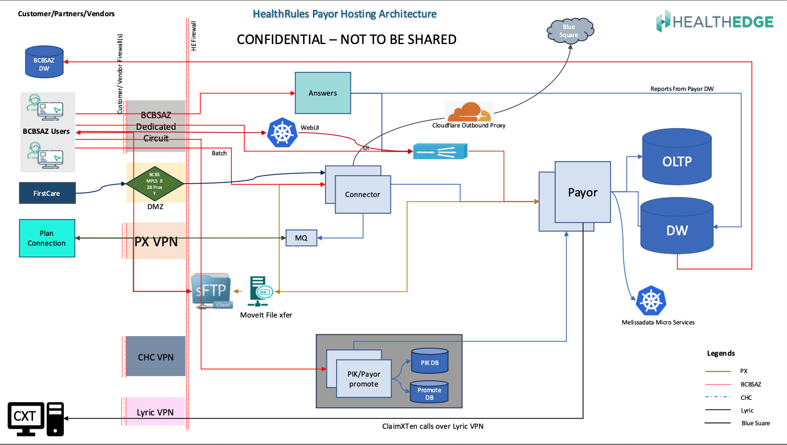

# HRP - DR Discovery Sessions

**Confluence Page:** https://healthedge.atlassian.net/wiki/spaces/CP1/pages/5081006125/HRP%20-%20DR%20Discovery%20Sessions

**Created by:** Venkata Kommuri on September 09, 2025  
**Last modified by:** Venkata Kommuri on September 09, 2025 at 05:28 PM

---

**HRP Disaster Recovery Assessment - Session Summaries**

**Architecture Diagram**

**Session 1: Infrastructure and Database Architecture Review**

**Date:** August 27, 2025  
**Participants:** Vaughn Sargent, Venkata Kommuri, Jared Sheltry, Senthil Ramasamy

**Key Discussion Points:**

**Application Architecture**

**Payer System Components:**

* Web Logic servers running on Linux (1-15 servers per customer)
* Oracle OLTP databases
* SQL Server Data Warehouse
* Third-party integrations: CES, CXT, Source, Easy Group
* SSO integration through Okta
* RSO (Reduced Sign On) through customer Active Directory/LDAP

**Current DR Strategy**

**Storage-Level Replication:**

* Entire customer volume replicated in real-time to secondary site
* Includes databases, applications, and third-party apps
* No Oracle-specific replication currently used
* Stretched networks between data centers (same IPs, hostnames)

**Database Replication**

**Current Technologies:**

* Golden Gate replication (legacy)
* Click replication (new standard since January)
* Both need to be supported during migration
* OLTP to Data Warehouse replication via Golden Gate/Click

**Network Architecture**

**Customer Isolation:**

* Each customer has dedicated /24 subnet
* Split into /25 for prod and non-prod
* Stretched networks for DR (active-active data centers)
* VPN tunnels for DR connectivity

**DR Testing Requirements**

**Contractual Obligations:**

* Annual DR tests required
* Live production failover testing
* 5-minute failover capability for clean shutdowns
* RPO/RTO varies by customer contract

**Key Findings:**

1. Current DR is "all or nothing" - cannot fail over individual components
2. No containerization currently (working on it)
3. Melissa Data microservices require Kubernetes cluster
4. Each customer has dedicated infrastructure (not shared)
5. DR only applies to production environments

**Session 2: Database and Replication Deep Dive**

**Date:** August 28, 2025  
**Participants:** Venkata Kommuri, Madhu Ravi, Jared Sheltry, Senthil Ramasamy

**Key Discussion Points:**

**Replication Technologies**

**Golden Gate vs Click:**

* Golden Gate: Legacy solution for existing customers
* Click: New standard for customers onboarded since January
* Migration from Golden Gate to Click in progress
* Both technologies must be supported in AWS migration

**Database Architecture**

**Standard Configuration:**

* OLTP Database (Oracle)
* Data Warehouse (SQL Server)
* Optional Custom Database (Oracle) for specific customers
* Dedicated replication server per customer (Golden Gate or Click)

**Customer Variations**

**Custom Databases:**

* Not all customers require custom databases
* Contains customer-specific stored procedures, functions, triggers
* Additional Oracle database when required
* Increases infrastructure footprint per customer

**Network Segmentation**

**Customer Isolation:**

* Dedicated network segments per customer
* /24 subnet split between prod and non-prod
* Active-active data centers (Ohio and Massachusetts)
* 50/50 customer distribution across data centers

**Shared vs Dedicated Components**

**Shared Services:**

* SFTP servers (with customer-specific folders)
* Move-IT file transfer services

**Dedicated Services:**

* All application servers per customer
* All database instances per customer
* Replication servers per customer

**Key Findings:**

1. Minimum 3 databases per customer (OLTP, DW, Replication)
2. Up to 4 databases if custom database required
3. Both Golden Gate and Click replication must be supported
4. Each customer environment is completely isolated
5. File transfer services are shared with logical separation

**Session 3: Application Architecture and Integration Points**

**Date:** September 3, 2025  
**Participants:** Venkata Kommuri, Brijesh Singh, Vaughn Sargent, Kendra McCormick, Chris Falk, Jared Sheltry

**Key Discussion Points:**

**Application Technology Stack**

**Core Platform:**

* Java applications running on Oracle WebLogic
* All Payer applications are Java-based
* Apache Camel for connector services
* Multiple WebLogic instances per customer

**Authentication and Authorization**

**SSO Implementation:**

* Health Edge Okta instance integrates with customer Okta
* Token-based authentication flow
* Permissions managed within HRP application

**RSO Implementation:**

* Direct LDAP/LDAPS calls to customer Active Directory
* WebLogic native integration capabilities
* Customer AD configuration required in HRP

**Third-Party Integrations**

**Claim Editing Software:**

* CES (Claim Editing Software) by Optum
* CXT (Claim eXTend) by Lyric Health
* EZ Grouper by Optum
* Source (Health Edge proprietary)

**Hosting Models**

**Health Edge Hosted:**

* Majority of CES and EZ Grouper instances
* All Source instances (proprietary)
* 6 customers with Health Edge hosted CXT

**Vendor Hosted:**

* 1 customer with Optum-hosted CES
* 2 customers with Lyric Health-hosted CXT
* Site-to-site VPN connectivity required

**Additional Products**

**Optional Components:**

* Pick (used by few customers)
* Payer Promote (used by few customers)
* Correspondence Accelerator/Next Gen Correspondence
* All Java-based applications

**Network Connectivity**

**External Integrations:**

* Site-to-site VPNs with vendors
* No public internet traffic for integrations
* Secure connectivity for all external services
* Some integrations through customer networks

**Key Findings:**

1. All applications are Java-based running on WebLogic
2. Complex authentication flows with external dependencies
3. Mix of Health Edge and vendor-hosted third-party services
4. Secure network connectivity requirements for all integrations
5. Customer-specific configurations for authentication systems
6. Multiple optional products increase complexity per customer

**Summary of Critical DR Requirements**

**Infrastructure Requirements:**

1. **Dedicated Resources:** Each customer requires completely isolated infrastructure
2. **Database Support:** Oracle and SQL Server databases with replication capabilities
3. **Application Platform:** Java/WebLogic application server environment
4. **Network Isolation:** Secure, isolated network segments per customer

**Replication Requirements:**

1. **Dual Technology Support:** Both Golden Gate and Click replication
2. **Real-time Replication:** Near real-time data synchronization
3. **Storage-Level DR:** Volume-level replication capabilities
4. **Network Stretching:** Consistent IP addressing across sites

**Integration Requirements:**

1. **External Connectivity:** Site-to-site VPN capabilities
2. **Authentication Integration:** Okta and LDAP/AD connectivity
3. **Third-Party Services:** Secure connections to vendor-hosted services
4. **File Transfer:** Secure SFTP and Move-IT services

**Testing Requirements:**

1. **Annual DR Tests:** Live production failover testing
2. **RTO Targets:** 5-minute failover for clean shutdowns
3. **RPO Compliance:** Customer-specific data loss tolerances
4. **Contractual Obligations:** Meet customer SLA requirements

**Document Information**

**Assessment Team:**

* Venkata Kommuri (Lead Assessor)
* Technical Subject Matter Experts from Health Edge
* Infrastructure and Database Teams