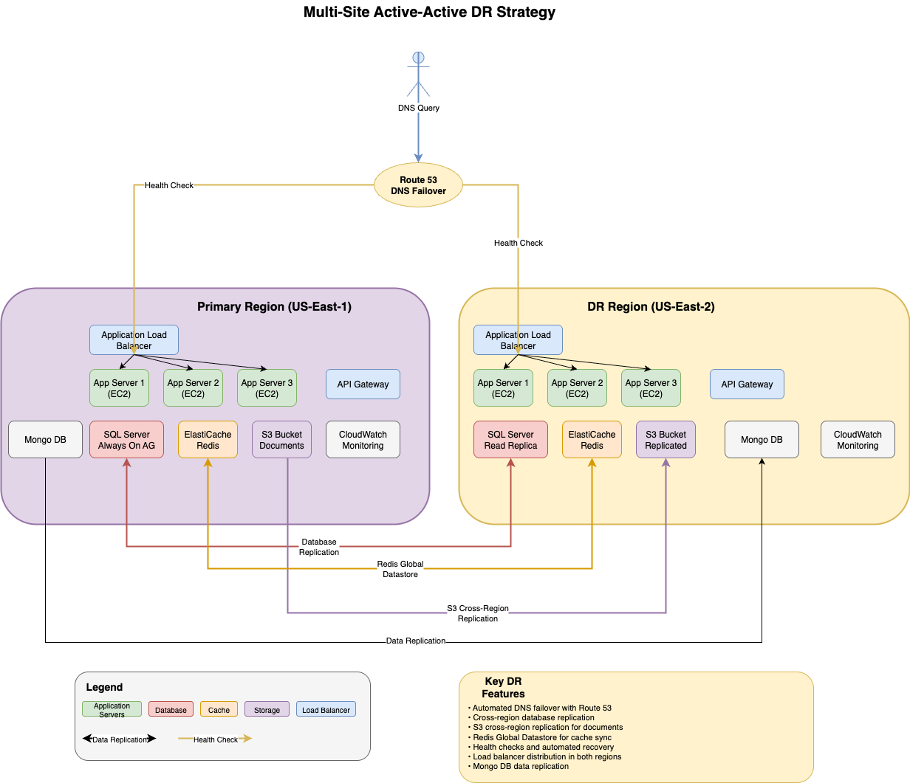
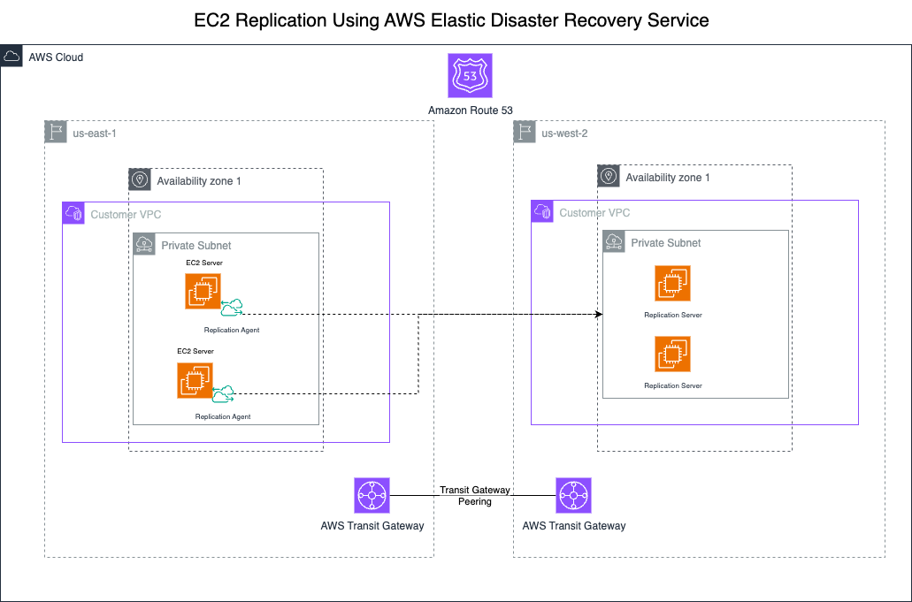
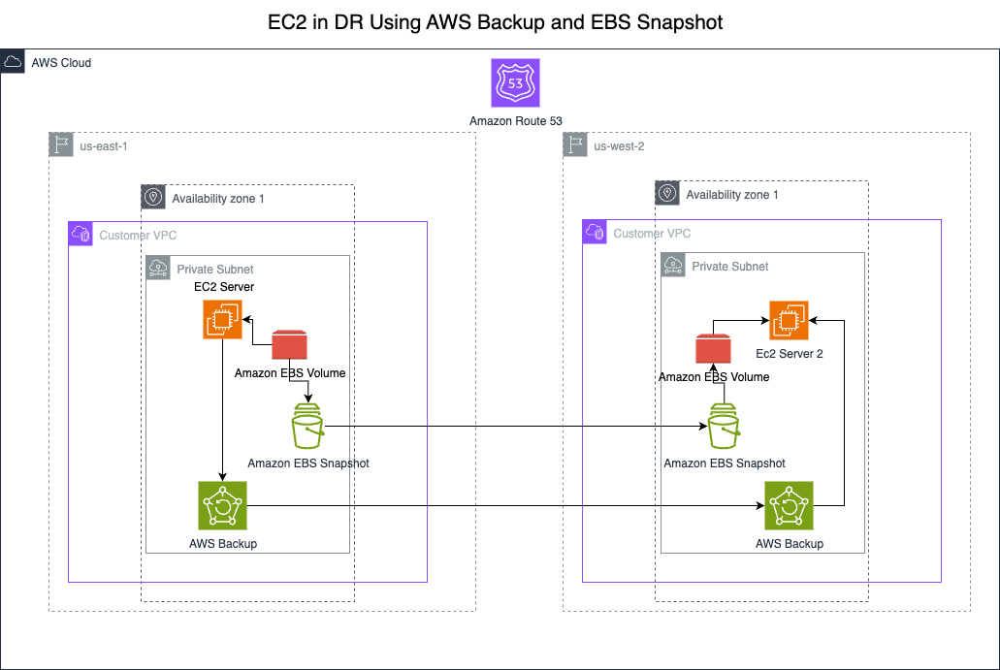
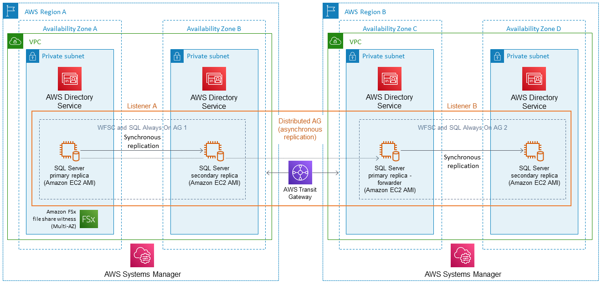
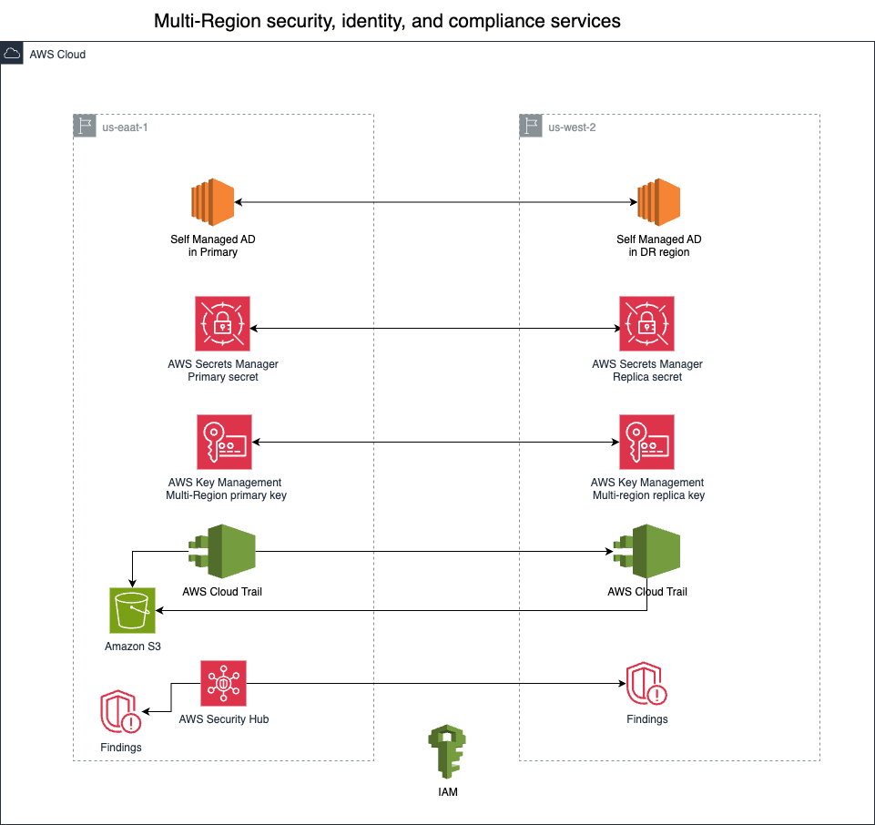
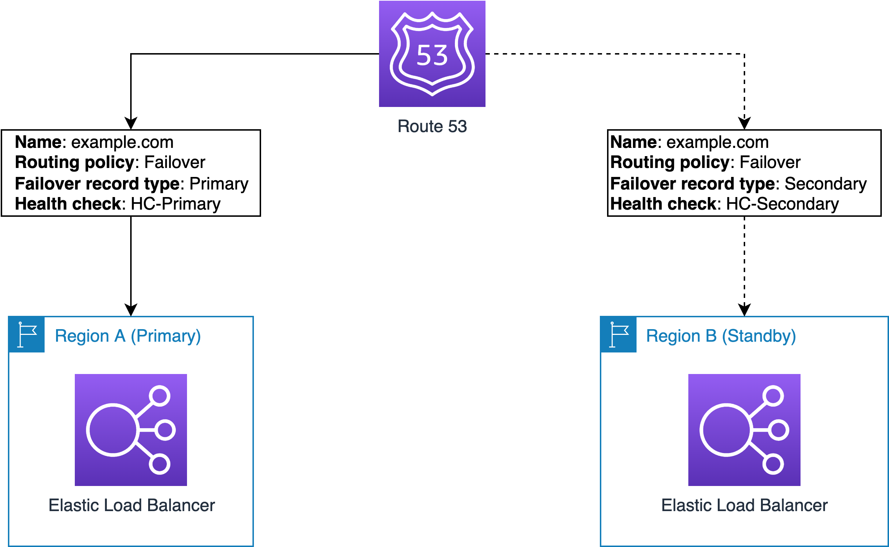

# Guiding Care - DR Recommendations

**Confluence Page:** https://healthedge.atlassian.net/wiki/spaces/CP1/pages/4993384681/Guiding%20Care%20-%20DR%20Recommendations

**Created by:** Venkata Kommuri on August 07, 2025  
**Last modified by:** Venkata Kommuri on September 30, 2025 at 05:24 PM

---

AWS Disaster Recovery High-Level Design Recommendations
=======================================================

1. Introduction to Disaster Recovery
------------------------------------

### 1.1 What is Disaster Recovery?

Disaster Recovery (DR) is a comprehensive set of policies, tools, and procedures designed to enable the recovery or continuation of vital technology infrastructure and systems following a natural or human-induced disaster. A disaster can range from localized hardware failures and software bugs to large-scale events such as natural disasters, cyber attacks, power outages, or regional infrastructure failures. The goal of disaster recovery is to minimize downtime and data loss while ensuring that critical business functions can continue or be quickly restored to normal operations.

### 1.2 Key DR Concepts and Terminology

**Recovery Time Objective (RTO):** The maximum amount of time that a system can be unavailable before causing unacceptable impact to the business. For Guiding Care applications, this directly relates to patient care continuity and regulatory compliance requirements.

**Recovery Point Objective (RPO):** The maximum amount of data loss that is acceptable during a disaster, measured in time. This represents the point in time to which data must be recovered after an outage. In Guiding Care, even minimal data loss can have significant implications for patient safety and regulatory compliance.

**Business Continuity:** The broader organizational capability to maintain essential functions during and after a disaster. DR is a critical component of business continuity planning.

**High Availability (HA):** The design and implementation of systems to remain operational and accessible for a high percentage of time, typically measured in "nines" (99.9%, 99.99%, etc.). While related to DR, HA focuses on preventing outages rather than recovering from disasters.

### 1.3 Disaster Recovery in AWS

Amazon Web Services (AWS) provides a comprehensive set of cloud services and capabilities specifically designed to support robust disaster recovery strategies. AWS DR solutions leverage the global infrastructure of AWS regions and availability zones to provide geographic redundancy, automated failover capabilities, and cost-effective backup and recovery options.

#### 1.3.1 AWS Global Infrastructure for DR

**AWS Regions:** AWS operates multiple geographic regions around the world, each consisting of multiple isolated data centers. Regions are designed to be completely independent, with their own power, cooling, and network infrastructure. This geographic separation makes regions ideal for disaster recovery scenarios, as a disaster affecting one region is unlikely to impact another region hundreds or thousands of miles away.

**Availability Zones (AZs):** Within each AWS region, there are multiple Availability Zones—physically separate data centers with redundant power, networking, and connectivity. AZs are connected through high-bandwidth, low-latency networking, making them suitable for synchronous replication and high-availability architectures. While AZs provide protection against localized failures, cross-region strategies are necessary for comprehensive disaster recovery.

**Edge Locations:** AWS maintains a global network of edge locations that can be leveraged for content delivery and DNS services, providing additional resilience and performance optimization for DR scenarios.

#### 1.3.2 AWS DR Service Categories

**Compute Services:** Amazon EC2 provides the foundation for most DR strategies, with capabilities for automated instance launch, Auto Scaling, and cross-region AMI replication. Services like AWS Lambda provide serverless compute options that can automatically scale and distribute across multiple regions.

**Storage Services:** AWS offers multiple storage services optimized for different DR scenarios, including Amazon S3 with cross-region replication, Amazon EBS with snapshot capabilities, and Amazon EFS with backup and restore functionality. These services provide the data durability and replication capabilities essential for effective DR strategies.

**Database Services:** AWS provides managed database services like Amazon RDS, Amazon DynamoDB, and Amazon ElastiCache, each with built-in backup, replication, and cross-region capabilities. These services significantly simplify database DR implementation compared to traditional on-premises approaches.

**Networking Services:** Services like Amazon Route 53, AWS Direct Connect, and AWS Transit Gateway provide the networking foundation for DR architectures, including DNS failover, dedicated connectivity, and cross-region network management.

**Management and Orchestration:** AWS provides comprehensive management services including AWS Systems Manager, AWS CloudFormation, and AWS Step Functions that enable automated DR orchestration, configuration management, and infrastructure as code approaches.

#### 1.3.3 AWS DR Strategies and Patterns

**Backup and Restore:** The most basic DR strategy involves regular backups of data and applications with the ability to restore them in case of failure. AWS services like AWS Backup, Amazon S3, and database-specific backup features provide automated, scalable backup solutions with cross-region replication capabilities.

**Pilot Light:** A minimal version of the production environment is maintained in the DR region, with critical data replicated but compute resources kept at minimum levels. During a disaster, the pilot light environment is scaled up to handle production workloads. This approach balances cost and recovery time.

**Warm Standby:** A scaled-down but fully functional version of the production environment runs in the DR region. This approach provides faster recovery times than pilot light but at higher cost due to the always-running infrastructure in the DR region.

**Multi-Region Active-Active:** Production workloads run simultaneously in multiple regions, with traffic distributed between them. This approach provides the fastest recovery times and highest availability but requires careful attention to data consistency and synchronization challenges.

2. Executive Summary
--------------------

This document outlines a comprehensive disaster recovery (DR) strategy for the Guiding Care environment after its migration to AWS. The design addresses the current limitations in the on-premises environment and leverages AWS-native services to provide robust DR capabilities across applications, data storage, infrastructure, operations, network, and security components.

The proposed solution implements a multi-region active-passive architecture with automated failover capabilities, designed to meet or exceed the 4-hour RTO target while minimizing data loss. This approach balances cost efficiency with business continuity requirements and provides a scalable foundation for future growth.

2. Strategic Context
--------------------

### 2.1 Current Pain Points and Limitations

Based on the analysis of the current on-premises environment, several limitations have been identified:

* **Insufficient Hardware for Failover:** The current environment lacks adequate hardware to support full DR capabilities.
* **No VM Replication:** There is no automated replication of virtual machines between sites.
* **Manual Rebuild Requirement:** Recovery relies heavily on manual processes.
* **Unachievable RTO:** The current setup cannot meet a 4-hour RTO target.
* **Limited Cross-Site Replication:** While backups are replicated across data centers, there is no direct storage replication.
* **Single Points of Failure:** Components like HA Proxy are deployed as single instances without high availability.
* **Complex Custom Configurations:** Custom ACLs and rules in HA Proxy require careful translation to AWS equivalents.

### 2.2 Business Drivers

The primary business drivers for implementing a robust DR solution include:

* **Business Continuity:** Ensure critical Guiding Care management services remain available even during infrastructure failures or regional outages.
* **Risk Mitigation:** Reduce the risk of extended downtime and data loss.
* **Regulatory Compliance:** Meet Guiding Care industry requirements for data protection and service availability.
* **Customer Trust:** Maintain high service levels for Guiding Care providers and patients.
* **Operational Efficiency:** Reduce manual effort and complexity in DR processes.

3. Technical Architecture
-------------------------

The proposed DR architecture leverages AWS's multi-region capabilities to create a robust, automated disaster recovery solution. The design follows a region-based active-passive model with the primary region handling normal operations and a secondary region ready to take over in case of failure.

### 3.1 AWS Regional Strategy

* **Primary Regions:** US-East-1 (N. Virginia) and US-East-2 (Oregon) for primary operations
* **Secondary Regions:** US-East-2 (Ohio) and US-West-1 (N. California) for disaster recovery

This regional selection maintains the current East Coast/West Coast distribution while leveraging AWS's robust regional infrastructure.

High Level DR Architecture Diagram:

### 3.2 Core Infrastructure Components

#### 3.2.1 Compute Layer

**Key DR Components for Compute Layer:**

* **AWS Elastic Disaster Recovery (DRS)** - Critical workloads with 15-30 minute RTO
* **AWS Backup with AMI/Snapshots** - Non-critical workloads with 2-4 hour RTO
* **Auto Scaling Groups** - Cross-region scaling and automated recovery
* **Amazon Machine Images (AMIs)** - Cross-region replication for rapid deployment
* **EC2 Image Builder** - Consistent image management across regions
* **Amazon ECS/EKS** - Container orchestration with cross-region capabilities
* **Amazon ECR** - Container image replication across regions
* **AWS Systems Manager** - Automated post-recovery configuration

The compute layer forms the backbone of the Guiding Care application infrastructure, hosting the critical .NET applications that serve Guiding Care providers and patients. The DR strategy for compute resources is designed with two distinct approaches based on workload criticality, ensuring optimal balance between recovery time objectives and cost efficiency.

##### 3.2.1.1 Critical Workload DR Strategy - AWS Elastic Disaster Recovery (DRS)

**Amazon EC2 Instances (Critical Applications)**

For critical workloads including the main Guiding Care portal, Authorization portal, and patient-facing systems, **AWS Elastic Disaster Recovery (DRS)** is the recommended DR solution. DRS provides continuous block-level replication of critical EC2 instances to the DR region, enabling sub-hour recovery time objectives essential for Guiding Care operations.

DRS agents are installed on critical Windows Server 2022 instances in the primary region, providing real-time replication of the entire server state including the operating system, applications, and data. The service maintains low-cost staging instances in the DR region that can be rapidly converted to full production instances during a disaster event. This approach ensures that critical patient-facing applications can be restored within 15-30 minutes, meeting the stringent RTO requirements for Guiding Care systems.

The DRS implementation includes automated recovery runbooks that define exact procedures for launching recovered instances, updating network configurations, and validating system functionality. Point-in-time recovery capabilities enable restoration to specific timestamps, which is critical for maintaining data consistency across related Guiding Care systems. Integration with AWS Systems Manager provides automated post-recovery configuration and validation procedures, ensuring that recovered instances are immediately ready to serve patient care workflows.

Key benefits of DRS for critical workloads include:

* **Sub-hour RTO:** Recovery times of 15-30 minutes for most critical applications
* **Minimal RPO:** Continuous replication with RPO measured in seconds
* **Automated failover:** Orchestrated recovery procedures with minimal manual intervention
* **Application consistency:** Maintains application state and data integrity during recovery
* **Cost optimization:** Low-cost staging instances until full recovery is needed

##### 3.2.1.2 Non-Critical Workload DR Strategy - AMI and Snapshot with AWS Backup

**Amazon EC2 Instances (Non-Critical Applications)**

For non-critical workloads including development environments, testing systems, and administrative applications, a **snapshot-based DR strategy using AWS Backup** provides cost-effective protection with acceptable recovery times. This approach leverages Amazon Machine Images (AMIs) and EBS snapshots to create point-in-time backups that can be restored in the DR region when needed.

AWS Backup is configured to automatically create AMIs of non-critical EC2 instances on scheduled intervals (daily for important non-critical systems, weekly for development systems). These AMIs capture the complete server configuration including the operating system, installed applications, and system configurations. EBS snapshots are created for all attached volumes, ensuring that application data and logs are protected.

The snapshot-based DR strategy includes cross-region replication of all AMIs and snapshots to the DR region using AWS Backup's cross-region copy functionality. During a disaster event, new EC2 instances are launched from the replicated AMIs in the DR region, with EBS volumes restored from the latest snapshots. This process typically requires 2-4 hours for complete restoration, which is acceptable for non-critical systems.

Automated recovery procedures are implemented using AWS Systems Manager and AWS Lambda to streamline the restoration process. These procedures include launching instances from AMIs, attaching restored EBS volumes, updating network configurations, and performing basic functionality tests. While this approach requires more manual intervention than DRS, it provides significant cost savings for systems that can tolerate longer recovery times.

Key benefits of snapshot-based DR for non-critical workloads include:

* **Cost-effective:** Significantly lower costs compared to continuous replication
* **Flexible scheduling:** Configurable backup frequencies based on system importance
* **Point-in-time recovery:** Ability to restore to specific backup points
* **Automated management:** AWS Backup handles scheduling, retention, and cross-region copying
* **Scalable approach:** Can handle large numbers of non-critical systems efficiently

##### 3.2.1.3 Workload Classification and DR Assignment

The classification of workloads into critical and non-critical categories is based on the following criteria:

**Critical Workloads (DRS Protection):**

* Main Guiding Care portal (patient-facing)
* Authorization portal (provider-facing)
* Member portal (member-facing)
* Database servers (SQL Server, Redis)
* API Gateway and core API services
* SFTP servers for regulatory data exchange
* Queue processing systems for real-time workflows

**Non-Critical Workloads (Snapshot-based Protection):**

* Development and testing environments
* Administrative and management systems
* Reporting and analytics servers (non-real-time)
* Backup and monitoring infrastructure
* Training and demonstration environments
* Legacy systems with minimal business impact

**Amazon ECS/EKS (for Containerized Workloads)**

For modernized components and future containerization efforts, Amazon ECS and EKS provide robust DR capabilities through container orchestration and automated failover mechanisms. Container images are automatically replicated across regions using Amazon ECR (Elastic Container Registry), ensuring that the latest application versions are immediately available in the DR region.

Containerized workloads benefit from faster recovery times due to the lightweight nature of containers compared to full virtual machines. ECS services are configured with cross-region task definitions that can be activated within minutes of a regional failure. For Kubernetes workloads on EKS, cluster configurations are replicated using Infrastructure as Code, and persistent volumes are backed up using CSI snapshots that are replicated to the DR region.

The containerized DR strategy includes automated health checks, rolling deployments, and blue-green deployment capabilities that minimize service disruption during both planned maintenance and unplanned DR events. Service mesh integration provides advanced traffic management and observability during failover scenarios, ensuring optimal performance and reliability during disaster recovery operations.

#### 3.2.2 Load Balancing

**Key DR Components for Load Balancing:**

* **Application Load Balancer (ALB)** - Multi-region deployment with identical configurations
* **AWS Global Accelerator** - Static IP addresses with automatic regional failover
* **Route 53 Health Checks** - DNS-based failover with 60-second detection
* **Target Groups** - Cross-region target group configuration with health checks
* **SSL/TLS Certificates** - AWS Certificate Manager with cross-region replication
* **Auto Scaling Groups** - Integration for dynamic capacity management
* **CloudWatch Monitoring** - Performance and health monitoring across regions
* **AWS WAF Integration** - Security rules synchronized across regions

**Application Load Balancers (ALB) - Comprehensive DR Setup**

Application Load Balancers serve as the critical traffic distribution layer, replacing the current HA Proxy infrastructure with AWS-native, highly available load balancing capabilities. The ALB DR implementation requires sophisticated configuration across multiple regions to ensure seamless failover and optimal performance during disaster scenarios.

##### ALB Multi-Region Architecture Design

The ALB DR architecture implements identical load balancers in both primary (US-East-1) and secondary (US-East-2) regions, with each ALB configured to handle the full production traffic load. This active-passive configuration ensures that the DR region's ALB can immediately assume full traffic handling responsibilities without performance degradation during regional failures.

Each ALB is deployed across multiple Availability Zones within its respective region, providing high availability protection against local failures. The ALBs are configured with identical target groups, listener rules, and health check parameters to ensure consistent behavior regardless of which region is serving traffic. Infrastructure as Code (CloudFormation or CDK) templates maintain configuration consistency and enable rapid deployment of ALB configurations across regions.

##### Target Group Configuration for DR

Target groups are configured with sophisticated health checking mechanisms that continuously monitor application health across multiple dimensions including response time, error rates, and custom application metrics. Each target group includes the following DR-specific configurations:

* **Health Check Parameters:** HTTP/HTTPS health checks configured with 30-second intervals, 5-second timeouts, and 2 consecutive successful checks required for healthy status
* **Custom Health Check Paths:** Application-specific health endpoints that validate database connectivity, external service availability, and critical application functionality
* **Deregistration Delay:** Configured to 30 seconds to allow in-flight requests to complete during instance replacement or failover scenarios
* **Stickiness Configuration:** Session affinity configured for applications requiring user session persistence, with appropriate cookie duration settings
* **Cross-Zone Load Balancing:** Enabled to ensure even distribution of traffic across all healthy targets regardless of Availability Zone

##### Listener Rules and Routing Configuration

The ALB listener configuration replicates the complex routing logic currently implemented in HA Proxy, ensuring that all custom ACLs and routing rules are preserved during the migration to AWS. The listener rules are designed to support the following Guiding Care application-specific routing requirements:

**Path-Based Routing:**

* **/api/\*** - Routes to API server target groups with appropriate health checks for API endpoints
* **/portal/\*** - Routes to main Guiding Care portal application servers
* **/auth/\*** - Routes to Authorization portal with enhanced security headers
* **/member/\*** - Routes to Member portal with session affinity enabled
* **/admin/\*** - Routes to administrative interfaces with IP-based access restrictions

**Host-Based Routing:**

* [**api.guidingcare.com**](http://api.guidingcare.com) - Dedicated routing for API traffic with rate limiting
* [**portal.guidingcare.com**](http://portal.guidingcare.com) - Main application portal routing
* [**secure.guidingcare.com**](http://secure.guidingcare.com) - High-security routing for sensitive operations
* **\*.customer.guidingcare.com** - Customer-specific subdomain routing

**Header-Based Routing:**

* **X-Forwarded-Proto** - Ensures HTTPS enforcement for all Guiding Care data transactions
* **User-Agent** - Routes mobile and desktop traffic to optimized target groups
* **X-Customer-ID** - Routes traffic to customer-specific application instances where required
* **X-API-Version** - Routes API traffic to appropriate version-specific endpoints

##### SSL/TLS Certificate Management for DR

SSL certificate management is critical for Guiding Care applications due to regulatory requirements and patient data protection needs. The ALB DR configuration includes comprehensive certificate management across both regions:

**AWS Certificate Manager (ACM) Integration:**

* **Multi-Domain Certificates:** Single certificates covering all application domains and subdomains
* **Automatic Renewal:** ACM handles certificate renewal automatically, eliminating manual certificate management
* **Cross-Region Certificate Replication:** Certificates are provisioned in both regions to ensure immediate availability during failover
* **Wildcard Certificates:** Support for customer-specific subdomains without individual certificate management

**Security Policy Configuration:**

* **TLS 1.2 Minimum:** Enforced across all listeners to meet Guiding Care security requirements
* **Perfect Forward Secrecy:** Enabled to protect against future key compromises
* **HSTS Headers:** HTTP Strict Transport Security headers enforced for all responses
* **Security Headers:** Custom security headers including X-Frame-Options, X-Content-Type-Options, and Content-Security-Policy

##### Health Check Strategy for DR Readiness

The ALB health check configuration is designed to provide comprehensive validation of application readiness and DR capability. Multi-layered health checks ensure that traffic is only routed to fully functional application instances:

**Application-Level Health Checks:**

* **Database Connectivity:** Health endpoints validate connectivity to primary databases and cache systems
* **External Service Validation:** Checks verify connectivity to critical external services and APIs
* **Memory and CPU Thresholds:** Custom health checks monitor resource utilization and reject traffic when thresholds are exceeded
* **Application Functionality:** End-to-end health checks validate critical application workflows including user authentication and data retrieval

**DR-Specific Health Checks:**

* **Cross-Region Connectivity:** Validates that DR region instances can communicate with replicated data sources
* **Data Consistency Validation:** Ensures that DR region instances have access to current data through replication validation
* **Configuration Validation:** Verifies that all application configurations are correctly applied in the DR environment
* **Integration Testing:** Automated tests validate that all external integrations function correctly from the DR region

##### Monitoring and Alerting for ALB DR

Comprehensive monitoring ensures that ALB performance and DR readiness are continuously validated:

**CloudWatch Metrics:**

* **Request Count and Latency:** Monitors traffic patterns and response times across both regions
* **Target Health:** Tracks the health status of all targets in both primary and DR regions
* **Error Rates:** Monitors 4xx and 5xx error rates with automated alerting for threshold breaches
* **Connection Metrics:** Tracks new connections, active connections, and connection errors

**Custom Metrics and Alarms:**

* **DR Readiness Score:** Custom metric combining multiple health indicators to provide overall DR readiness status
* **Cross-Region Latency:** Monitors network latency between regions to ensure optimal failover performance
* **Certificate Expiration:** Automated alerts for certificate renewal requirements
* **Configuration Drift:** Monitors for differences between primary and DR region ALB configurations

##### Failover Automation and Testing

The ALB DR configuration includes automated failover procedures and regular testing to ensure reliability during actual disaster scenarios:

**Automated Failover Procedures:**

* **Route 53 Health Check Integration:** Automated DNS failover based on ALB health status
* **Lambda-Based Automation:** Custom functions handle complex failover logic and validation
* **Step Functions Orchestration:** Coordinates multi-step failover procedures across services
* **Rollback Procedures:** Automated rollback capabilities for failed failover attempts

**DR Testing Framework:**

* **Monthly Failover Tests:** Automated testing of DNS failover and ALB functionality in DR region
* **Load Testing:** Regular validation that DR region ALBs can handle full production traffic
* **End-to-End Testing:** Complete application workflow testing through DR region ALBs
* **Performance Validation:** Ensures that DR region performance meets production requirements

**AWS Global Accelerator**

AWS Global Accelerator provides static IP addresses and intelligent traffic routing that significantly improves the DR experience for end users. The service maintains two static IP addresses that remain constant even during regional failovers, eliminating DNS propagation delays and providing faster recovery times.

#### 3.2.3 Database Layer

**Key DR Components for Database Layer:**

* **SQL Server Always On Availability Groups** - Cross-region read replicas with automated promotion
* **Amazon RDS for SQL Server** - Multi-AZ deployment with cross-region backups
* **ElastiCache for Redis** - Global Datastore with cross-region replication
* **MongoDB Replica Sets** - Cross-region replica configuration with automated failover
* **Amazon DocumentDB** - Global clusters with cross-region read replicas
* **AWS Database Migration Service (DMS)** - Continuous replication for databases
* **AWS Backup** - Automated database backups with cross-region replication
* **Amazon RDS for PostgreSQL** - Queue database with Multi-AZ and read replicas
* **Point-in-Time Recovery** - Granular recovery capabilities for all databases

**SQL Server on EC2 - Comprehensive DR Strategy**

The SQL Server infrastructure represents the most critical component of the DR strategy, as it contains all patient data, provider information, and transactional records essential for Guiding Care operations. The Guiding Care environment requires robust SQL Server DR capabilities to ensure continuous access to patient records, provider information, claims data, and regulatory reporting systems that are fundamental to Guiding Care operations.

The SQL Server DR implementation provides two distinct approaches based on database criticality, performance requirements, and operational complexity preferences. Both approaches ensure HIPAA compliance, regulatory adherence, and maintain the data integrity essential for Guiding Care applications.

##### SQL Server DR Deployment Options

The DR strategy offers flexibility between clustered and non-clustered approaches, each optimized for different operational requirements and business criticality levels:

**Option 1: SQL Server with Always On Availability Groups (Clustered)**

This approach provides the highest level of availability and performance for critical Guiding Care databases. It's recommended for production databases containing patient records, real-time clinical data, and systems requiring sub-minute failover capabilities.

**Option 2: SQL Server Standalone with Log Shipping/Backup Restore (Non-Clustered)**

This approach offers cost-effective DR protection for less critical databases such as reporting databases, historical archives, and development/testing environments where longer recovery times are acceptable.

##### Option 1: SQL Server Always On Availability Groups (Clustered) DR Implementation

**Always On Availability Groups Architecture for Guiding Care DR:**

The Always On Availability Groups implementation provides enterprise-grade DR capabilities for applications requiring continuous availability and minimal data loss. The architecture includes sophisticated multi-region replication with automated failover capabilities.

**Primary Region (US-East-1) Availability Group Configuration:**

* **Primary Replica:** Active SQL Server instance in AZ-1a handling all read/write operations
* **Secondary Replica 1:** Synchronous replica in AZ-1b for high availability within region
* **Cluster Shared Storage:** Amazon EBS with Multi-Attach for shared cluster resources

**DR Region (US-East-2) Availability Group Configuration:**

* **Asynchronous Replica 1:** Cross-region replica in AZ-2a for disaster recovery
* **Asynchronous Replica 2:** Cross-region replica in AZ-2b for DR redundancy
* **Read-Only Routing:** Configured for reporting and analytics workloads
* **Backup Preference:** Configured to perform backups on DR replicas to reduce primary load

**Advanced Always On Configuration for Guiding Care:**

**Synchronization Mode Configuration:**

* **Synchronous Commit:** Within primary region for zero data loss during local failures
* **Asynchronous Commit:** Cross-region to balance performance with DR protection
* **Automatic Failover:** Enabled within primary region for sub-minute recovery
* **Manual Failover:** Cross-region failover with validation procedures for DR scenarios
* **Readable Secondary:** DR replicas configured for read-only access to support reporting

**Guiding Care Application-Specific Always On Features:**

* **Patient Data Protection:** Transaction log encryption and secure replication channels
* **Regulatory Compliance:** Audit logging for all failover events and data access
* **HIPAA Compliance:** Encrypted connections and access controls for all replicas
* **Clinical Workflow Continuity:** Connection string management for seamless application failover
* **Reporting Isolation:** Read-only replicas for analytics without impacting clinical operations

**Failover Scenarios and Procedures:**

**Automatic Failover (Within Region):**

* **Trigger Conditions:** Primary replica failure, network partition, or performance degradation
* **Failover Time:** 30-60 seconds for automatic failover completion
* **Data Loss:** Zero data loss due to synchronous replication within region
* **Application Impact:** Brief connection interruption with automatic reconnection
* **Validation:** Automated health checks ensure new primary is fully operational

**Manual Failover (Cross-Region DR):**

* **Trigger Conditions:** Regional disaster, extended primary region outage, or planned maintenance
* **Failover Time:** 15-30 minutes including validation and application updates
* **Data Loss:** Minimal data loss (typically <5 minutes) due to asynchronous replication
* **Procedure:** Coordinated failover with application team and infrastructure updates
* **Validation:** Comprehensive testing of all Guiding Care applications and integrations

**Always On Monitoring and Alerting:**

* **Replica Health Monitoring:** Continuous monitoring of all replica states and synchronization
* **Replication Lag Alerts:** Automated alerts when cross-region lag exceeds thresholds
* **Failover Event Logging:** Comprehensive logging of all failover events for audit purposes
* **Performance Monitoring:** Real-time monitoring of database performance across all replicas
* **Capacity Planning:** Proactive monitoring of storage and compute capacity across regions

##### Option 2: SQL Server Standalone (Non-Clustered) DR Implementation

**Standalone SQL Server DR Architecture:**

The standalone SQL Server DR approach provides cost-effective disaster recovery for databases that can tolerate longer recovery times while still maintaining data integrity and regulatory compliance. This approach is suitable for reporting databases, historical archives, and non-critical operational systems.

**Primary Region (US-East-1) Standalone Configuration:**

* **Primary SQL Server:** Single instance in AZ-1a with local high availability via Multi-AZ EBS
* **Transaction Log Shipping:** Automated log shipping to local secondary instance in AZ-1b
* **Backup Strategy:** Full backups daily, differential backups every 4 hours, log backups every 15 minutes
* **Local Standby:** Warm standby instance for local failover scenarios

**DR Region (US-East-2) Standalone Configuration:**

* **DR SQL Server:** Standby instance maintained in stopped state to minimize costs
* **Log Shipping Target:** Automated log shipping from primary region every 15 minutes
* **Backup Restoration:** Automated backup restoration procedures for rapid DR activation
* **Storage Replication:** EBS snapshots replicated to DR region for rapid instance creation

**Log Shipping Configuration for Guiding Care DR:**

**Transaction Log Shipping Setup:**

* **Shipping Frequency:** Every 15 minutes to maintain <30-minute RPO for Guiding Care data
* **Compression:** Log backup compression to optimize network bandwidth utilization
* **Encryption:** All log backups encrypted in transit and at rest for HIPAA compliance
* **Monitoring:** Automated monitoring of log shipping status with immediate alerting
* **Validation:** Regular validation of log shipping integrity and restoration procedures

**Backup and Restore Strategy:**

* **Full Backups:** Daily full database backups during maintenance windows
* **Differential Backups:** Every 4 hours to minimize restoration time
* **Transaction Log Backups:** Every 15 minutes for minimal data loss
* **Cross-Region Replication:** All backups automatically replicated to DR region
* **Backup Validation:** Automated backup integrity checks and restoration testing

**Standalone DR Failover Procedures:**

**Local Failover (Within Region):**

* **Trigger Conditions:** Primary instance failure or performance issues
* **Failover Time:** 5-15 minutes to activate warm standby instance
* **Data Loss:** Minimal data loss (<15 minutes) due to log shipping frequency
* **Procedure:** Automated failover to warm standby with application connection updates
* **Validation:** Database consistency checks and application functionality testing

**Cross-Region DR Failover:**

* **Trigger Conditions:** Regional disaster or extended primary region outage
* **Failover Time:** 2-4 hours including instance startup and validation
* **Data Loss:** <30 minutes based on log shipping and backup frequency
* **Procedure:** Manual activation of DR instance with comprehensive validation
* **Recovery Steps:** Instance startup, log restoration, consistency checks, application testing

##### SQL Server Performance Optimization for DR

**Storage Performance Configuration:**

* **Data Files:** Amazon EBS io2 volumes with provisioned IOPS for consistent performance
* **Log Files:** Separate EBS gp3 volumes optimized for sequential write operations
* **TempDB:** Instance store NVMe SSDs for optimal temporary database performance
* **Backup Storage:** Amazon S3 with Transfer Acceleration for cross-region backup replication
* **Storage Encryption:** EBS encryption with AWS KMS for all database storage

**Network Optimization for Cross-Region Replication:**

* **Dedicated Bandwidth:** AWS Direct Connect provides dedicated bandwidth for replication traffic
* **Compression:** SQL Server backup compression and Always On compression for bandwidth optimization
* **Network Monitoring:** Real-time monitoring of network latency and throughput
* **Traffic Prioritization:** QoS policies prioritize critical Guiding Care data replication
* **Bandwidth Allocation:** Reserved bandwidth allocation for peak replication periods

##### SQL Server Security and Compliance for DR

**Guiding Care Data Protection:**

* **Encryption at Rest:** Transparent Data Encryption (TDE) for all Guiding Care databases
* **Encryption in Transit:** SSL/TLS encryption for all replication and backup traffic
* **Access Controls:** Role-based access controls with Guiding Care application-specific permissions
* **Audit Logging:** Comprehensive audit logging for all data access and modifications
* **Key Management:** AWS KMS integration for centralized encryption key management

**Regulatory Compliance Features:**

* **HIPAA Compliance:** All DR procedures maintain HIPAA compliance requirements
* **Audit Trails:** Complete audit trails for all DR events and data access
* **Data Retention:** Automated data retention policies for regulatory compliance
* **Access Logging:** Detailed logging of all administrative and user access
* **Compliance Reporting:** Automated compliance reporting for regulatory audits

##### SQL Server DR Testing and Validation

**Regular DR Testing Schedule:**

* **Monthly Failover Tests:** Automated testing of local failover capabilities
* **Quarterly Cross-Region Tests:** Full DR failover testing to secondary region
* **Annual Disaster Simulation:** Comprehensive disaster scenario testing
* **Backup Restoration Tests:** Regular validation of backup and restore procedures
* **Performance Validation:** Ensuring DR region performance meets production requirements

**Automated Testing Framework:**

* **Synthetic Transactions:** Automated synthetic transactions to validate database functionality
* **Data Integrity Checks:** Automated validation of data consistency across regions
* **Application Integration Tests:** End-to-end testing of Guiding Care applications
* **Performance Benchmarking:** Regular performance comparison between regions
* **Rollback Testing:** Validation of failback procedures and data synchronization

##### Cost Optimization for SQL Server DR

**Always On Availability Groups Cost Optimization:**

* **Reserved Instances:** Reserved instances for predictable primary and secondary replicas
* **Read Replica Utilization:** DR replicas used for reporting to maximize ROI
* **Storage Optimization:** Intelligent tiering for backup storage and archival data
* **Compute Scaling:** Right-sizing of DR instances based on actual failover requirements
* **Network Optimization:** Efficient replication protocols to minimize data transfer costs

**Standalone SQL Server Cost Optimization:**

* **Stopped DR Instances:** DR instances maintained in stopped state until needed
* **Spot Instances:** Spot instances for non-critical testing and development databases
* **Backup Storage Tiering:** Automated tiering of backups to cost-effective storage classes
* **Scheduled Scaling:** Automated scaling based on known usage patterns
* **Resource Optimization:** Regular review and optimization of allocated resources

**Amazon ElastiCache for Redis**

Redis caching infrastructure is critical for application performance and user session management, requiring sophisticated DR capabilities to maintain service quality during regional failures. The ElastiCache for Redis implementation utilizes Global Datastore functionality to provide cross-region replication with sub-second latency.

**MongoDB on EC2 or Amazon DocumentDB - Comprehensive DR Strategy**

MongoDB instances supporting ETL processes and document storage require specialized DR configurations to handle the unique requirements of document databases and large-scale data processing workflows. The Guiding Care environment utilizes MongoDB for temporary ETL data storage, processing intermediate results, and managing complex Guiding Care data transformations that are critical for regulatory compliance and operational reporting.

##### MongoDB Deployment Options and DR Considerations

The DR strategy provides flexibility between two deployment approaches, each with distinct advantages for different use cases and operational requirements:

**Option 1: Self-Managed MongoDB on EC2**

This approach provides maximum control over MongoDB configuration and is suitable for organizations requiring specific MongoDB versions, custom configurations, or specialized performance tuning. The self-managed approach is particularly valuable for Guiding Care applications that require specific compliance configurations or custom data processing pipelines.

**Option 2: Amazon DocumentDB (MongoDB-Compatible)**

Amazon DocumentDB provides a fully managed MongoDB-compatible service that reduces operational overhead while providing built-in DR capabilities. This approach is recommended for organizations prioritizing operational simplicity and automated management over configuration flexibility.

##### Self-Managed MongoDB on EC2 DR Implementation

**Replica Set Architecture for High Availability and DR:**

The self-managed MongoDB deployment implements a sophisticated replica set architecture designed to provide both high availability within the primary region and comprehensive disaster recovery capabilities across regions. The architecture includes the following components:

* **Primary Replica Set (US-East-1):** Consists of 3 members deployed across 3 Availability Zones (1 primary, 2 secondary replicas)
* **DR Replica Set (US-East-2):** Consists of 2 members deployed across 2 Availability Zones (both secondary replicas with priority 0)
* **Arbiter Node:** Deployed in a third region (US-Central-1) to provide tie-breaking capability for election scenarios
* **Hidden Replica:** Dedicated backup replica in each region configured for backup operations without impacting production performance

**Cross-Region Replication Configuration:**

Cross-region replication is configured using MongoDB's native replica set functionality with specific optimizations for Guiding Care data processing requirements:

* **Write Concern Configuration:** Set to "majority" to ensure data durability across multiple replicas before acknowledging writes
* **Read Preference:** Configured as "primaryPreferred" for normal operations, with automatic fallback to secondary replicas during primary failures
* **Oplog Sizing:** Configured with 48-hour oplog retention to handle extended network partitions or maintenance windows
* **Network Compression:** Enabled between regions to optimize bandwidth usage for large ETL datasets
* **SSL/TLS Encryption:** All inter-replica communication encrypted using TLS 1.2 with certificate-based authentication

**ETL-Specific DR Considerations:**

Given MongoDB's role in ETL processing for Guiding Care data, the DR configuration includes specialized considerations for data processing continuity:

* **Processing State Management:** ETL job state and progress information replicated across regions to enable seamless job resumption
* **Temporary Data Handling:** Configurable TTL (Time To Live) indexes ensure temporary ETL data is automatically cleaned up across all replicas
* **Batch Processing Coordination:** Integration with AWS Step Functions to coordinate ETL processing across regions during DR scenarios
* **Data Validation:** Automated data integrity checks ensure ETL results remain consistent across replicas

**Backup and Point-in-Time Recovery:**

The self-managed MongoDB implementation includes comprehensive backup strategies designed for Guiding Care data protection requirements:

* **Continuous Backup:** MongoDB Change Streams capture all data changes for point-in-time recovery capabilities
* **Snapshot Backups:** Daily consistent snapshots using MongoDB's native backup tools, stored in S3 with cross-region replication
* **Incremental Backups:** Hourly incremental backups capturing oplog entries for granular recovery options
* **Backup Encryption:** All backups encrypted at rest using AWS KMS with Guiding Care-compliant key management
* **Backup Validation:** Automated restore testing validates backup integrity and recovery procedures monthly

##### Amazon DocumentDB DR Implementation

**Managed Service Benefits for DR:**

Amazon DocumentDB provides several built-in DR capabilities that simplify disaster recovery implementation while maintaining MongoDB compatibility for existing applications:

**Multi-AZ Deployment Architecture:**

* **Automatic Failover:** Built-in failover capability within the primary region with sub-minute recovery times
* **Read Replicas:** Up to 15 read replicas distributed across Availability Zones for read scaling and local failover
* **Storage Replication:** Automatic replication of data across 3 Availability Zones with self-healing storage
* **Backup Integration:** Seamless integration with AWS Backup for centralized backup management

**Cross-Region DR Configuration:**

DocumentDB cross-region DR implementation leverages AWS-native services for simplified management and enhanced reliability:

* **Cross-Region Read Replicas:** Read replicas in the DR region provide near real-time data replication with 5-minute RPO
* **Global Clusters:** DocumentDB Global Clusters enable cross-region replication with automated failover capabilities
* **Snapshot Sharing:** Automated sharing of cluster snapshots across regions for backup-based recovery options
* **Parameter Group Synchronization:** Consistent configuration across regions through parameter group replication

**Automated Backup and Recovery:**

DocumentDB provides comprehensive automated backup capabilities designed for enterprise DR requirements:

* **Continuous Backup:** Point-in-time recovery with 1-second granularity for up to 35 days
* **Automated Snapshots:** Daily automated snapshots with configurable retention periods
* **Cross-Region Backup:** Automatic replication of backups to DR region for geographic protection
* **Encryption at Rest:** All data and backups encrypted using AWS KMS with automatic key rotation
* **Backup Performance:** Backup operations do not impact production performance due to storage-level implementation

##### ETL Workflow DR Integration

**Apache Airflow Integration for DR:**

The MongoDB DR strategy includes comprehensive integration with Apache Airflow (migrating to AWS MWAA) to ensure ETL workflow continuity during disaster scenarios:

* **Workflow State Replication:** Airflow DAG states and task execution history replicated to DR region
* **Connection Configuration:** Automated update of MongoDB connection strings during DR failover
* **Data Lineage Tracking:** Maintenance of data processing lineage across regions for regulatory compliance
* **Job Resumption:** Capability to resume interrupted ETL jobs from the last successful checkpoint

**Guiding Care Data Processing Continuity:**

Specialized considerations for Guiding Care ETL processing ensure regulatory compliance and data integrity during DR events:

* **HIPAA Compliance:** All data replication and backup processes maintain HIPAA compliance requirements
* **Audit Trail Preservation:** Complete audit trails maintained across regions for regulatory reporting
* **Data Validation:** Automated validation ensures ETL results remain accurate after DR failover
* **Processing Priority:** Critical Guiding Care data processing prioritized during DR scenarios

##### Performance Optimization for DR

**Network Optimization:**

* **Dedicated Bandwidth:** AWS Direct Connect provides dedicated bandwidth for cross-region replication
* **Compression:** Data compression reduces network utilization for large ETL datasets
* **Connection Pooling:** Optimized connection pooling reduces overhead during high-volume processing
* **Regional Caching:** Strategic caching reduces cross-region data access requirements

**Storage Performance:**

* **SSD Storage:** High-performance SSD storage for optimal ETL processing performance
* **IOPS Optimization:** Provisioned IOPS for consistent performance during peak processing periods
* **Storage Scaling:** Automatic storage scaling to handle varying ETL data volumes
* **Compression:** Data compression reduces storage requirements and improves I/O performance

##### Monitoring and Alerting for MongoDB DR

**Comprehensive Monitoring Strategy:**

* **Replica Set Health:** Continuous monitoring of replica set member health and replication lag
* **Cross-Region Latency:** Monitoring of network latency between regions affecting replication performance
* **ETL Processing Metrics:** Tracking of ETL job performance and data processing volumes
* **Storage Utilization:** Monitoring of storage usage patterns and growth trends
* **Backup Success Rates:** Automated validation of backup completion and integrity

**Automated Alerting:**

* **Replication Lag Alerts:** Immediate alerts when replication lag exceeds acceptable thresholds
* **Failover Notifications:** Automated notifications during replica set failover events
* **Backup Failure Alerts:** Immediate alerts for any backup operation failures
* **Performance Degradation:** Alerts for performance issues that could impact ETL processing
* **Capacity Planning:** Proactive alerts for storage and compute capacity planning

##### DR Testing and Validation

**Regular DR Testing Framework:**

* **Monthly Failover Tests:** Automated testing of replica set failover capabilities
* **Quarterly Full DR Tests:** Complete ETL workflow testing in DR region
* **Backup Restore Testing:** Regular validation of backup and restore procedures
* **Performance Validation:** Ensuring DR region performance meets production requirements
* **Data Integrity Verification:** Comprehensive validation of data consistency across regions

**Compliance and Audit Readiness:**

* **Audit Documentation:** Comprehensive documentation of all DR procedures and test results
* **Compliance Reporting:** Regular reports demonstrating DR capability and regulatory compliance
* **Change Management:** Formal change management processes for DR configuration updates
* **Incident Response:** Documented procedures for handling DR events and post-incident analysis

**Queue Database Infrastructure**

The queue database infrastructure manages critical asynchronous processing workflows, message queuing, and batch job coordination that are essential for Guiding Care data processing and regulatory compliance. The queue database implementation utilizes a combination of Amazon RDS for PostgreSQL and Amazon SQS/SNS for different queuing requirements.

#### 3.2.4 Storage Layer

**Key DR Components for Storage Layer:**

* **Amazon EBS Snapshots** - Cross-region snapshot replication with Fast Snapshot Restore
* **Amazon S3 Cross-Region Replication (CRR)** - Automatic object replication to DR region
* **Amazon FSx for Windows** - File system backups with AWS DataSync replication
* **AWS Backup** - Centralized backup management with cross-region policies
* **S3 Versioning** - Point-in-time recovery for document storage
* **S3 Intelligent Tiering** - Cost-effective storage with rapid retrieval
* **AWS KMS** - Cross-region key replication for encryption
* **S3 Transfer Acceleration** - Optimized upload/download during DR events
* **EBS Volume Types** - gp3 for general purpose, io2 for high-performance databases

**Amazon EBS**

Amazon EBS provides the foundational storage infrastructure for operating systems, application data, and temporary processing files across all EC2 instances. EBS volumes are configured with appropriate volume types and are automatically backed up through AWS Backup policies.

**Amazon S3**

Amazon S3 serves as the primary repository for document storage, application artifacts, backup files, and static content, replacing the current SIFS/VNX infrastructure. S3 Cross-Region Replication (CRR) is configured for all critical buckets, providing near real-time replication of objects to the DR region.

**Amazon FSx for Windows File Server**

Amazon FSx for Windows File Server provides fully managed Windows file shares that replace traditional on-premises file servers with cloud-native, highly available storage solutions. FSx file systems are configured with automatic backups that are replicated to the DR region using AWS DataSync.

#### 3.2.5 Networking and Security

**Key DR Components for Networking and Security:**

* **Amazon VPC** - Identical VPC configurations across regions with CIDR planning
* **AWS Transit Gateway** - Cross-region peering for centralized connectivity
* **AWS Direct Connect** - Dedicated 10Gbps connections to both regions
* **AWS Site-to-Site VPN** - Customer connectivity with automated failover
* **Security Groups** - Infrastructure as Code for consistent configurations
* **Network ACLs (NACLs)** - Subnet-level security controls
* **AWS WAF** - Web application firewall with synchronized rules
* **AWS Shield** - DDoS protection with 24/7 response team
* **VPC Flow Logs** - Network traffic monitoring across regions

**Amazon VPC**

The Virtual Private Cloud infrastructure provides the foundational network architecture that enables secure, isolated, and highly available connectivity for all Guiding Care components. VPC configurations include carefully planned CIDR blocks that avoid conflicts between regions while providing sufficient IP address space for growth and DR scenarios.

.png)

**Security Groups and NACLs**

Security Groups and Network Access Control Lists replace the current ASA and Palo Alto firewall configurations with cloud-native security controls. Security Group rules are defined using Infrastructure as Code to ensure identical configurations across regions.

**AWS Site-to-Site VPN and AWS Direct Connect**

Network connectivity infrastructure provides secure, reliable connections between customer sites and AWS regions. AWS Direct Connect provides dedicated network connections to both regions with redundant circuits and diverse paths to ensure high availability.

**AWS WAF and AWS Shield**

Web Application Firewall and DDoS protection services replace the current Cloudflare WAF functionality with AWS-native security services. AWS WAF rules are configured to protect against common web exploits including SQL injection, cross-site scripting, and application-layer attacks.

#### 3.2.6 File Transfer and Integration Layer

**Key DR Components for File Transfer and Integration:**

* **AWS Transfer Family** - SFTP servers in both regions with DNS failover
* **Amazon SQS** - Cross-region queue replication with dead letter queues
* **Amazon SNS** - Topic replication with subscription endpoint updates
* **AWS Lambda** - Automated file processing workflows across regions
* **S3 Bucket Integration** - SFTP home directories with cross-region replication
* **AWS Systems Manager** - User account and SSH key synchronization
* **AWS Secrets Manager** - Secure credential management across regions
* **CloudWatch Monitoring** - File transfer operations and queue monitoring
* **FIFO Queues** - Message ordering with deduplication mechanisms

**AWS Transfer Family (SFTP Server)**

The AWS Transfer Family provides fully managed SFTP, FTPS, and FTP services that replace the current on-premises SFTP infrastructure with cloud-native, highly available file transfer capabilities. SFTP servers are deployed in both primary and DR regions with identical configurations managed through Infrastructure as Code. The DR strategy includes automated DNS failover that redirects SFTP clients to the secondary region's servers within 60 seconds of a regional failure.

**Amazon SQS and Amazon SNS (Queue Infrastructure)**

Amazon SQS and SNS provide the messaging infrastructure that replaces Azure Service Bus and supports critical asynchronous processing workflows throughout the Guiding Care application. SQS queues are configured with cross-region replication using AWS Lambda functions that automatically copy messages between regions.

#### 3.2.7 Active Directory DR Strategy

The DR strategy for self-managed Active Directory ensures continuous authentication services, maintains security policy enforcement, and provides seamless user access during regional failures while preserving the complex Health Edge-specific configurations and compliance requirements essential for patient data protection and regulatory adherence.

##### Active Directory Architecture for Healthcare DR

**Multi-Region Domain Controller Deployment:**

The Active Directory DR architecture implements a sophisticated multi-region deployment designed to provide both high availability within regions and comprehensive disaster recovery capabilities across AWS regions. The architecture maintains the existing domain structure while extending it to support cloud-based disaster recovery scenarios.

**Primary Region (US-East-1) AD Infrastructure:**

* **Primary Domain Controllers:** 3 Windows Server 2022 domain controllers across 3 Availability Zones
* **Global Catalog Servers:** All DCs configured as Global Catalog servers for optimal authentication performance
* **FSMO Role Holders:** Strategic distribution of Forest and Domain FSMO roles across primary DCs
* **DNS Services:** Integrated DNS services with Route 53 conditional forwarding
* **Certificate Authority:** Enterprise CA with automated certificate enrollment and CRL distribution
* **DFS Replication:** SYSVOL and custom healthcare policy shares with cross-region replication
* **DHCP Services:** Redundant DHCP servers with 80/20 scope distribution
* **Time Services:** NTP hierarchy with external time source synchronization

**DR Region (US-East-2) AD Infrastructure:**

* **DR Domain Controllers:** 2 Windows Server 2022 domain controllers across 2 Availability Zones
* **Global Catalog Servers:** Both DR DCs configured as Global Catalog servers
* **FSMO Role Standby:** Prepared to assume FSMO roles during primary region failure
* **DNS Services:** Integrated DNS with Route 53 health check integration
* **Certificate Authority:** Subordinate CA ready for promotion during DR scenarios
* **DFS Replication:** Real-time SYSVOL replication and policy synchronization
* **DHCP Services:** Standby DHCP servers with pre-configured scopes
* **Time Services:** Independent NTP configuration for DR region operations

### 3.3 Integration and API Components

**Key DR Components for Integration and API:**

* **Amazon API Gateway** - Regional deployments with cross-region failover
* **AWS Step Functions** - State machines replicated across regions
* **AWS Batch** - Job definitions and compute environments in both regions
* **Apache Airflow (Self-Managed)** - Multi-region cluster with shared metadata
* **Amazon MWAA** - Managed Airflow environments with DAG synchronization
* **Route 53 Health Checks** - API endpoint monitoring and DNS failover
* **Custom Domain Names** - SSL certificates managed across regions
* **Usage Plans and API Keys** - Synchronized across regions
* **CloudWatch Events** - Automated workflow triggering in DR region

**Amazon API Gateway**

Amazon API Gateway serves as the central hub for all external API access, replacing the current WSO2 API Gateway with a fully managed, highly scalable solution. API Gateway deployments in both regions maintain identical API definitions, authentication configurations, and throttling policies managed through Infrastructure as Code.

**AWS Step Functions and AWS Batch**

AWS Step Functions and Batch replace the current Apache Airflow orchestration infrastructure with fully managed services that provide robust DR capabilities. Step Functions state machines are deployed in both regions with identical configurations and can resume execution in the DR region from the exact point of interruption.

**Apache Airflow Disaster Recovery - Comprehensive Implementation Guide**

Apache Airflow serves as the critical orchestration engine for ETL processes, batch data processing, and workflow automation in the Guiding Care environment. The current on-premises Airflow deployment manages thousands of daily jobs that process Guiding Care data, coordinate regulatory reporting, and maintain data synchronization across multiple systems. The DR strategy provides two deployment options to ensure workflow continuity during disaster scenarios.

##### Apache Airflow Deployment Options for DR

The DR implementation offers flexibility between self-managed and fully managed approaches, each with distinct advantages for different operational requirements and organizational preferences:

**Option 1: Self-Managed Apache Airflow on EC2**

This approach provides maximum control over Airflow configuration, custom plugins, and specialized Guiding Care workflow requirements. It's suitable for organizations requiring specific Airflow versions, custom operators, or complex integration with existing on-premises systems.

**Option 2: Amazon Managed Workflows for Apache Airflow (MWAA)**

MWAA provides a fully managed Airflow service that reduces operational overhead while providing built-in DR capabilities. This approach is recommended for organizations prioritizing operational simplicity and automated management over configuration flexibility.

##### Self-Managed Apache Airflow on EC2 DR Implementation

**Multi-Region Airflow Architecture:**

The self-managed Airflow deployment implements a sophisticated multi-region architecture designed to provide both high availability within the primary region and comprehensive disaster recovery capabilities across regions. The architecture includes the following components:

* **Primary Airflow Cluster (US-East-1):** Active Airflow deployment with webserver, scheduler, and worker nodes across 3 Availability Zones
* **DR Airflow Cluster (US-East-2):** Standby Airflow deployment with identical configuration, maintained in warm standby mode
* **Shared Metadata Database:** PostgreSQL database with cross-region read replicas for DAG metadata and execution history
* **Distributed File System:** Amazon EFS with cross-region replication for DAG files and logs
* **Redis Cluster:** ElastiCache for Redis with Global Datastore for Celery message broker functionality

**Component-Level DR Configuration:**

**Airflow Webserver DR Setup:**

* **Load Balancer Integration:** Application Load Balancer with health checks monitoring webserver availability
* **Auto Scaling Configuration:** Auto Scaling Groups ensure webserver availability across multiple AZs
* **Session Management:** Redis-backed session storage ensures user sessions persist during failover
* **SSL Certificate Management:** AWS Certificate Manager provides automated certificate renewal across regions
* **Authentication Integration:** LDAP/SSO integration maintained across both regions for consistent user access

**Airflow Scheduler DR Setup:**

* **Active-Passive Configuration:** Primary scheduler active in US-East-1, standby scheduler in US-East-2
* **Heartbeat Monitoring:** CloudWatch-based monitoring detects scheduler failures and triggers failover
* **DAG Synchronization:** Real-time DAG file synchronization using EFS cross-region replication
* **State Management:** Scheduler state preserved in PostgreSQL with cross-region replication
* **Lock Management:** Distributed locking mechanism prevents split-brain scenarios during failover

**Airflow Worker DR Setup:**

* **Celery Configuration:** Redis-based message broker with cross-region replication
* **Worker Scaling:** Auto Scaling Groups in both regions with different scaling policies
* **Task Distribution:** Intelligent task routing based on region availability and capacity
* **Resource Management:** Dynamic resource allocation based on workload requirements
* **Log Management:** Centralized logging with cross-region log replication

**Guiding Care-Specific ETL Workflow DR:**

The Airflow DR configuration includes specialized considerations for Guiding Care data processing workflows that require regulatory compliance and data integrity:

* **HIPAA Compliance:** All workflow execution and data processing maintains HIPAA compliance across regions
* **Audit Trail Preservation:** Complete audit trails for all workflow executions preserved across regions
* **Data Lineage Tracking:** Comprehensive data lineage maintained during cross-region failover
* **Regulatory Reporting:** Automated regulatory reporting workflows continue operation in DR region
* **Patient Data Processing:** Priority queuing ensures critical patient data processing continues during DR events

**DAG and Configuration Management:**

* **Git-Based DAG Management:** DAG files stored in Git repositories with automated deployment to both regions
* **Configuration Synchronization:** Airflow configuration files synchronized using AWS Systems Manager Parameter Store
* **Connection Management:** Database connections and external service configurations replicated across regions
* **Variable Management:** Airflow variables and secrets synchronized using AWS Secrets Manager
* **Plugin Synchronization:** Custom plugins and operators deployed consistently across regions

##### Amazon Managed Workflows for Apache Airflow (MWAA) DR Implementation

**MWAA Multi-Region Architecture:**

Amazon MWAA provides a fully managed Airflow service with built-in DR capabilities that simplify disaster recovery implementation while maintaining Airflow compatibility for existing workflows:

**Primary MWAA Environment (US-East-1):**

* **Production Environment:** Fully configured MWAA environment handling all production workflows
* **Auto Scaling:** Automatic scaling of Airflow workers based on workload demands
* **Managed Infrastructure:** AWS manages all underlying infrastructure including webserver, scheduler, and workers
* **Integrated Monitoring:** Built-in CloudWatch integration for comprehensive monitoring
* **Security Integration:** Native integration with AWS IAM, VPC, and security services

**DR MWAA Environment (US-East-2):**

* **Standby Environment:** Identical MWAA environment maintained in standby mode
* **Configuration Synchronization:** Automated synchronization of environment configurations
* **DAG Deployment:** Automated DAG deployment from shared S3 bucket with cross-region replication
* **Connection Replication:** Airflow connections replicated using AWS Secrets Manager
* **Variable Synchronization:** Airflow variables synchronized across environments

**MWAA-Specific DR Features:**

**Managed Metadata Database:**

* **Automatic Backups:** MWAA automatically backs up metadata database with point-in-time recovery
* **Cross-Region Backup:** Metadata backups replicated to DR region for rapid environment recreation
* **Execution History:** Complete workflow execution history preserved across regions
* **State Consistency:** Workflow state consistency maintained during failover scenarios

**S3-Based DAG Storage:**

* **Cross-Region Replication:** DAG files automatically replicated to DR region S3 bucket
* **Version Control:** S3 versioning ensures DAG version consistency across regions
* **Automated Deployment:** DAG changes automatically deployed to both environments
* **Rollback Capability:** Ability to rollback to previous DAG versions during issues

**Integrated Security and Compliance:**

* **IAM Integration:** Consistent IAM roles and policies across both environments
* **VPC Configuration:** Identical VPC configurations for network security
* **Encryption:** Data encryption at rest and in transit across both environments
* **Audit Logging:** Comprehensive audit logging with CloudTrail integration

##### Workflow Continuity and State Management

**Task Execution State Preservation:**

Both deployment options include sophisticated mechanisms to preserve workflow execution state during disaster scenarios:

* **Checkpoint Management:** Regular checkpointing of long-running tasks to enable resumption
* **Idempotent Operations:** All ETL operations designed to be idempotent for safe re-execution
* **State Synchronization:** Real-time synchronization of task execution state across regions
* **Dependency Tracking:** Comprehensive tracking of task dependencies for accurate resumption
* **Data Consistency Validation:** Automated validation of data consistency after workflow resumption

**Guiding Care Data Processing Continuity:**

* **Patient Data Priority:** Critical patient data processing workflows prioritized during DR events
* **Regulatory Compliance:** All regulatory reporting workflows continue operation in DR region
* **Data Quality Assurance:** Automated data quality checks ensure processing accuracy
* **Integration Validation:** Verification that all external system integrations function correctly
* **Audit Trail Continuity:** Uninterrupted audit trail maintenance for regulatory compliance

##### Performance Optimization for DR

**Resource Scaling Strategies:**

* **Dynamic Worker Scaling:** Automatic scaling of Airflow workers based on queue depth and processing demands
* **Resource Allocation:** Intelligent resource allocation based on workflow criticality and processing requirements
* **Queue Management:** Priority queuing ensures critical Guiding Care workflows execute first
* **Parallel Processing:** Optimized parallel processing capabilities for large-scale ETL operations
* **Memory Management:** Efficient memory management for processing large Guiding Care datasets

**Network and Storage Optimization:**

* **Data Transfer Optimization:** Optimized data transfer between regions using compression and efficient protocols
* **Caching Strategies:** Strategic caching of frequently accessed data to reduce cross-region data transfer
* **Storage Performance:** High-performance storage configurations for optimal ETL processing
* **Network Bandwidth:** Dedicated bandwidth allocation for critical data processing workflows

##### Monitoring and Alerting for Airflow DR

**Comprehensive Monitoring Framework:**

* **Workflow Execution Monitoring:** Real-time monitoring of all workflow executions across both regions
* **Performance Metrics:** Comprehensive performance metrics including execution times, success rates, and resource utilization
* **Error Tracking:** Detailed error tracking and analysis for rapid issue resolution
* **Capacity Monitoring:** Monitoring of resource capacity and utilization for proactive scaling
* **Data Quality Monitoring:** Automated monitoring of data quality metrics for Guiding Care compliance

**Automated Alerting System:**

* **Workflow Failure Alerts:** Immediate alerts for any workflow failures or errors
* **Performance Degradation:** Alerts for performance issues that could impact Guiding Care data processing
* **DR Readiness Alerts:** Continuous monitoring and alerting for DR environment readiness
* **Compliance Alerts:** Automated alerts for any compliance-related issues or violations
* **Capacity Alerts:** Proactive alerts for resource capacity planning and scaling requirements

##### DR Testing and Validation Framework

**Regular DR Testing Schedule:**

* **Monthly Failover Tests:** Automated testing of Airflow failover capabilities and workflow resumption
* **Quarterly Full DR Tests:** Complete end-to-end testing of all ETL workflows in DR region
* **Performance Validation:** Regular validation that DR region performance meets production requirements
* **Data Integrity Testing:** Comprehensive testing of data integrity and consistency across regions
* **Compliance Validation:** Regular validation of regulatory compliance in DR environment

**Automated Testing Framework:**

* **Synthetic Workflows:** Automated synthetic workflows that continuously test DR capabilities
* **Data Validation:** Automated data validation tests ensure processing accuracy in DR region
* **Integration Testing:** Comprehensive testing of all external system integrations
* **Performance Benchmarking:** Regular performance benchmarking against production baselines
* **Rollback Testing:** Testing of rollback procedures and failback capabilities

##### Cost Optimization for Airflow DR

**Resource Optimization Strategies:**

* **Spot Instance Usage:** Strategic use of spot instances for non-critical processing workloads
* **Reserved Instance Planning:** Reserved instances for predictable baseline capacity requirements
* **Auto Scaling Optimization:** Intelligent auto scaling to minimize costs while maintaining performance
* **Storage Tiering:** Automated storage tiering for logs and historical data
* **Resource Scheduling:** Optimized resource scheduling to maximize utilization efficiency

**DR Cost Management:**

* **Standby Resource Optimization:** Minimal resource allocation for standby environments
* **On-Demand Scaling:** Rapid scaling capabilities when DR environment becomes active
* **Cross-Region Data Transfer:** Optimized data transfer strategies to minimize bandwidth costs
* **Backup Storage Optimization:** Efficient backup storage strategies with appropriate retention policies

### 3.4 Monitoring and Automation

**Key DR Components for Monitoring and Automation:**

* **Amazon CloudWatch** - Cross-region metrics, logs, and dashboards
* **AWS Systems Manager** - Parameter Store and automation documents
* **AWS CloudTrail** - Audit logging with cross-region replication
* **AWS Config** - Configuration tracking and compliance monitoring
* **CloudWatch Synthetics** - Continuous application workflow testing
* **CloudWatch Alarms** - Automated alerting and DR procedure triggering
* **AWS Lambda** - Event-driven automation for DR orchestration
* **Session Manager** - Secure instance access during DR events
* **AWS Security Hub** - Centralized security findings across regions

**Amazon CloudWatch**

Amazon CloudWatch provides comprehensive monitoring, logging, and alerting capabilities that replace the current Datadog and Foglight monitoring infrastructure. CloudWatch metrics are collected from all AWS services and custom applications across both regions, providing unified visibility into system health and performance.

**AWS Systems Manager**

AWS Systems Manager provides centralized management and automation capabilities that streamline DR operations and ensure consistent configuration management across both regions. Parameter Store maintains configuration data and secrets that are automatically synchronized between regions.

**AWS CloudTrail and AWS Config**

AWS CloudTrail and Config provide comprehensive audit logging and configuration tracking capabilities that ensure regulatory compliance and provide detailed forensic capabilities during DR events. CloudTrail logs are replicated across regions and stored in S3 buckets with cross-region replication enabled.

### 3.5 DR Automation and Orchestration

**Key DR Components for Automation and Orchestration:**

* **AWS Route 53** - DNS failover with health checks and traffic routing
* **AWS Lambda** - Event-driven DR automation and recovery functions
* **AWS Elastic Disaster Recovery (DRS)** - Continuous server replication
* **AWS Step Functions** - Orchestrated DR workflows and procedures
* **CloudWatch Events/EventBridge** - Automated DR trigger mechanisms
* **AWS Systems Manager Automation** - Automated runbook execution
* **AWS Certificate Manager** - SSL certificate management across regions
* **Private Hosted Zones** - Internal DNS resolution for services
* **Health Check Types** - HTTP/HTTPS, TCP, and CloudWatch metric-based

**AWS Route 53 - Comprehensive DNS Failover and Traffic Management**

AWS Route 53 serves as the critical DNS infrastructure that enables intelligent traffic routing, automated failover between regions, and ensures that Guiding Care providers and patients are automatically directed to healthy endpoints during DR events. The Route 53 implementation for Guiding Care includes sophisticated health checking mechanisms, traffic routing policies, and integration with AWS Application Recovery Controller (ARC) for coordinated disaster recovery operations.

##### Route 53 DNS Architecture for Guiding Care DR

**Multi-Region DNS Configuration:**

The Route 53 DNS architecture implements a comprehensive multi-region setup designed to provide seamless failover capabilities for all Guiding Care services while maintaining optimal performance and regulatory compliance for Guiding Care applications.

**Hosted Zone Configuration:**

* **Primary Hosted Zone:** [guidingcare.com](http://guidingcare.com) ( Just for Example, not real domain name) with global DNS resolution
* **Subdomain Structure:** Organized by function and environment for clear separation
* **Private Hosted Zones:** Internal service discovery and communication
* **Cross-Region Consistency:** Identical DNS configurations across regions
* **DNSSEC:** DNS Security Extensions enabled for enhanced security

**Guiding Care-Specific DNS Records:**

* [**portal.guidingcare.com**](http://portal.guidingcare.com) - Main patient and provider portal access
* [**api.guidingcare.com**](http://api.guidingcare.com) - API endpoints for Guiding Care integrations
* [**secure.guidingcare.com**](http://secure.guidingcare.com) - High-security clinical data access
* [**reports.guidingcare.com**](http://reports.guidingcare.com) - Regulatory reporting and analytics
* <http://admin.guidingcare.com> - Administrative interfaces
* **\*.customer.guidingcare.com** - Customer-specific subdomains

##### Route 53 Health Checks for Guiding Care Applications

**Comprehensive Health Check Strategy:**

The health check implementation includes multiple layers of validation to ensure that traffic is only routed to fully functional Guiding Care systems capable of serving patient care workflows.

**Application-Level Health Checks:**

* **HTTP/HTTPS Endpoint Monitoring:** Continuous monitoring of application endpoints with 30-second intervals
* **Custom Health Check Paths:** Guiding Care-specific endpoints that validate database connectivity and critical functionality
* **Response Time Monitoring:** Latency thresholds ensure optimal user experience for clinical workflows
* **Status Code Validation:** Comprehensive validation of HTTP response codes and content
* **SSL Certificate Monitoring:** Automated monitoring of SSL certificate validity and expiration

**Database Connectivity Health Checks:**

* **SQL Server Connectivity:** Custom health checks validate database availability and performance
* **Redis Cache Validation:** Health checks ensure session management and caching functionality
* **MongoDB Availability:** ETL processing capability validation through custom endpoints
* **Connection Pool Health:** Monitoring of database connection pool status and capacity
* **Query Performance:** Response time validation for critical Guiding Care queries

**Infrastructure Health Checks:**

* **Load Balancer Health:** ALB target group health and capacity monitoring
* **Auto Scaling Group Status:** EC2 instance health and scaling capability validation
* **Network Connectivity:** Cross-region network latency and bandwidth monitoring
* **Storage Performance:** EBS and S3 performance and availability validation
* **Security Service Status:** WAF, Shield, and security service operational validation

##### Route 53 Traffic Routing Policies for DR

**Failover Routing Configuration:**

The failover routing implementation provides automated traffic redirection during regional failures while maintaining optimal performance for Guiding Care applications during normal operations.

**Primary-Secondary Failover Setup:**

* **Primary Record:** US-East-1 region configured as primary with active health checks
* **Secondary Record:** US-East-2 region configured as secondary for automatic failover
* **Health Check Association:** Each record associated with comprehensive health checks
* **TTL Configuration:** Low TTL values (60 seconds) for rapid DNS propagation
* **Failover Threshold:** Multiple consecutive health check failures trigger failover

**Weighted Routing for Gradual Migration:**

* **Traffic Distribution:** Configurable traffic weights for controlled migration
* **Blue-Green Deployments:** Support for blue-green deployment strategies
* **Canary Testing:** Gradual traffic shifting for testing new deployments
* **Rollback Capability:** Rapid traffic redirection for deployment rollbacks
* **Performance Monitoring:** Real-time monitoring of traffic distribution and performance

**Geolocation Routing for Compliance:**

* **Regional Data Residency:** Traffic routing based on data residency requirements
* **Regulatory Compliance:** Ensuring Guiding Care data remains within required jurisdictions
* **Latency Optimization:** Routing users to nearest healthy region for optimal performance
* **Fallback Configuration:** Default routing when geolocation-specific endpoints are unavailable

##### AWS Application Recovery Controller (ARC) Integration

**ARC Overview for Guiding Care DR:**

AWS Application Recovery Controller (ARC) provides centralized control and coordination for disaster recovery operations, enabling safe and controlled failover of the entire Guiding Care application stack with built-in safety mechanisms to prevent accidental outages.

**ARC Control Panel Configuration:**

**Cluster and Cell Architecture:**

* **Primary Cluster:** US-East-1 region containing all primary application components
* **Recovery Cluster:** US-East-2 region containing all DR application components
* **Cell Definition:** Logical grouping of related services (web tier, API tier, database tier)
* **Routing Control:** Centralized control over traffic routing between clusters
* **Safety Rules:** Automated safety mechanisms to prevent simultaneous failures

**Routing Controls for Guiding Care Services:**

* **Portal Routing Control:** Controls traffic routing for patient and provider portals
* **API Routing Control:** Manages API traffic routing for Guiding Care integrations
* **Database Routing Control:** Coordinates database failover and application updates
* **SFTP Routing Control:** Controls file transfer service routing for regulatory data
* **Reporting Routing Control:** Manages routing for regulatory reporting and analytics

**ARC Safety Rules Implementation:**

**Assertion Safety Rules:**

* **Minimum Healthy Cells:** Ensures at least one region remains active during failover
* **Maximum Concurrent Failures:** Prevents simultaneous failure of critical services
* **Guiding Care Service Dependencies:** Ensures dependent services fail over together
* **Data Consistency Rules:** Validates data consistency before allowing failover
* **Regulatory Compliance Rules:** Ensures failover maintains regulatory compliance

**Gating Safety Rules:**

* **Pre-Failover Validation:** Automated validation of DR region readiness
* **Health Check Gating:** Requires passing health checks before traffic routing
* **Capacity Validation:** Ensures DR region has sufficient capacity for full traffic
* **Security Validation:** Validates security configurations before failover
* **Compliance Gating:** Ensures regulatory compliance before traffic routing

##### Automated Failover Procedures with Route 53 and ARC

**Coordinated Failover Orchestration:**

The integration between Route 53 and ARC provides sophisticated orchestration capabilities that ensure coordinated, safe, and validated failover of the entire Guiding Care application stack.

**Automatic Failover Sequence:**

1. **Health Check Failure Detection:** Route 53 health checks detect primary region failures
2. **ARC Safety Rule Validation:** ARC validates that failover is safe and compliant
3. **Routing Control Activation:** ARC updates routing controls to redirect traffic
4. **DNS Record Updates:** Route 53 updates DNS records to point to DR region
5. **Application Validation:** Automated validation of application functionality in DR region
6. **Monitoring Activation:** Enhanced monitoring activated for DR region operations
7. **Notification Dispatch:** Automated notifications sent to operations teams

**Manual Failover Procedures:**

1. **Failover Decision:** Operations team initiates manual failover through ARC console
2. **Pre-Flight Checks:** ARC performs comprehensive pre-failover validation
3. **Safety Rule Override:** Manual override of safety rules if required (with approval)
4. **Coordinated Routing Update:** ARC coordinates routing control updates
5. **DNS Propagation:** Route 53 propagates DNS changes globally
6. **Application Testing:** Comprehensive testing of all Guiding Care applications
7. **Stakeholder Notification:** Automated notification of successful failover

##### Route 53 and ARC Monitoring and Alerting

**Comprehensive Monitoring Framework:**

* **Health Check Status Monitoring:** Real-time monitoring of all health check statuses
* **DNS Query Analytics:** Analysis of DNS query patterns and response times
* **Failover Event Tracking:** Detailed tracking of all failover events and durations
* **ARC Control Panel Monitoring:** Monitoring of routing control states and changes
* **Safety Rule Compliance:** Continuous monitoring of safety rule compliance

**Automated Alerting System:**

* **Health Check Failure Alerts:** Immediate alerts for health check failures
* **Failover Event Notifications:** Real-time notifications during failover events
* **DNS Resolution Issues:** Alerts for DNS resolution problems or delays
* **ARC Safety Rule Violations:** Immediate alerts for safety rule violations
* **Performance Degradation:** Alerts for DNS or routing performance issues

##### Guiding Care-Specific Route 53 and ARC Features

**Regulatory Compliance Integration:**

* **Audit Logging:** Comprehensive logging of all DNS and routing changes
* **Compliance Validation:** Automated validation of regulatory compliance during failover
* **Data Residency Controls:** Ensuring Guiding Care data remains in compliant regions
* **Access Controls:** Role-based access controls for DNS and routing management
* **Change Management:** Formal change management processes for DNS modifications

##### Route 53 and ARC Testing and Validation

**Regular Testing Framework:**

* **Monthly Health Check Testing:** Automated testing of all health check configurations
* **Quarterly Failover Testing:** Full failover testing using ARC controls
* **DNS Propagation Testing:** Regular validation of DNS propagation times
* **Safety Rule Testing:** Validation of ARC safety rule effectiveness
* **Performance Testing:** DNS resolution and routing performance validation

**Automated Testing Procedures:**

* **Synthetic Health Checks:** Automated synthetic transactions for health validation
* **DNS Resolution Testing:** Continuous testing of DNS resolution from multiple locations
* **Failover Simulation:** Regular simulation of failover scenarios
* **Recovery Validation:** Automated validation of recovery procedures
* **End-to-End Testing:** Complete Guiding Care application workflow testing

##### Cost Optimization for Route 53 and ARC

**Route 53 Cost Management:**

* **Health Check Optimization:** Right-sizing health check frequency and scope
* **Query Volume Management:** Optimization of DNS query patterns
* **Hosted Zone Consolidation:** Efficient organization of DNS zones
* **Traffic Flow Optimization:** Cost-effective traffic routing policies
* **Monitoring Cost Control:** Balanced monitoring with cost considerations

**ARC Cost Optimization:**

* **Control Panel Efficiency:** Optimized control panel configuration
* **Safety Rule Optimization:** Efficient safety rule implementation
* **Routing Control Management:** Streamlined routing control architecture
* **Testing Cost Management:** Cost-effective testing strategies
* **Resource Utilization:** Optimal utilization of ARC resources

**AWS Lambda**

AWS Lambda provides event-driven automation capabilities that orchestrate DR procedures and provide rapid response to system failures. DR automation functions include procedures for promoting read replicas to primary databases, updating application configurations, and scaling resources in the DR region.

**AWS Elastic Disaster Recovery (DRS)**

AWS Elastic Disaster Recovery provides continuous replication and automated recovery capabilities for critical servers that require sub-hour RTO targets. DRS agents are installed on critical servers in the primary region and provide continuous block-level replication to the DR region.

4. Implementation Strategy
--------------------------

The implementation strategy follows a phased approach to minimize risk and ensure successful DR capability deployment.

### 4.1 Migration and DR Implementation Phases

**Phase 1: Foundation Setup**

* Establish AWS accounts and networking infrastructure
* Configure IAM roles and security baseline
* Set up monitoring and logging infrastructure
* Implement cross-region connectivity

**Phase 2: Application Migration**

* Migrate application servers to EC2 using lift-and-shift approach
* Replace HA Proxy with ALB
* Configure Auto Scaling Groups ( Need to Verify)
* Establish AMI replication between regions

**Phase 3: Database Migration and Replication**

* Migrate SQL Server to EC2 with Always On AGs
* Set up Redis on ElastiCache with Global Datastore
* Configure MongoDB replication
* Implement cross-region database replication

**Phase 4: DR Automation Setup**

* Configure Route 53 for DNS failover
* Implement recovery automation with Lambda and Step Functions
* Set up AWS Elastic Disaster Recovery for critical servers
* Create and test recovery runbooks

**Phase 5: Testing and Validation**

* Conduct component-level DR testing
* Perform full DR failover exercises
* Validate RTO and RPO achievements
* Document lessons learned and optimize processes

5. Operational Considerations
-----------------------------

### 5.1 DR Operations Model

**Monitoring and Alerting**

* 24/7 monitoring of critical infrastructure
* Automated alerting for potential issues
* Regular health checks for DR readiness

**Recovery Procedures**

* Detailed runbooks for different failure scenarios
* Automation-assisted recovery processes
* Clear roles and responsibilities for DR events

**Testing Schedule**

* Monthly component-level testing
* Quarterly full DR failover exercises
* Annual comprehensive DR validation

### 5.2 SLA and Performance Targets

**Recovery Time Objectives (RTO)**

* Critical tier applications: < 1 hour
* Important tier applications: < 4 hours
* Standard tier applications: < 8 hours

**Recovery Point Objectives (RPO)**

* Critical databases: < 15 minutes
* Document storage: < 1 hour
* Non-critical data: < 24 hours

6. Success Metrics
------------------

The following metrics will be used to evaluate the success of the DR implementation:

### 6.1 Technical Metrics

* **Recovery Time Achievement:** Measured during DR tests and actual events
* **Recovery Point Achievement:** Data loss evaluation during recovery
* **Automation Effectiveness:** Percentage of recovery steps automated
* **Test Success Rate:** Success percentage of scheduled DR tests

### 6.2 Business Metrics

* **Availability Improvement:** Reduced downtime compared to previous solution
* **Risk Reduction:** Lowered risk profile for business continuity
* **Operational Efficiency:** Reduced manual effort for DR processes
* **Customer Satisfaction:** Improved SLA compliance

7. Next Steps and Implementation Roadmap
----------------------------------------

1. **Define Detailed Requirements:** Finalize RTO/RPO targets for each component
2. **Create Detailed Design:** Component-level design documents
3. **Develop Migration Plan:** Specific migration sequence and cutover plan
4. **Build Foundation Infrastructure:** Set up AWS accounts and networking
5. **Begin Phased Migration:** Execute migration according to phases
6. **Implement DR Capabilities:** Configure cross-region replication and automation
7. **Testing and Validation:** Verify DR capabilities meet requirements
8. **Operational Handover:** Transition to operational team with documentation and training