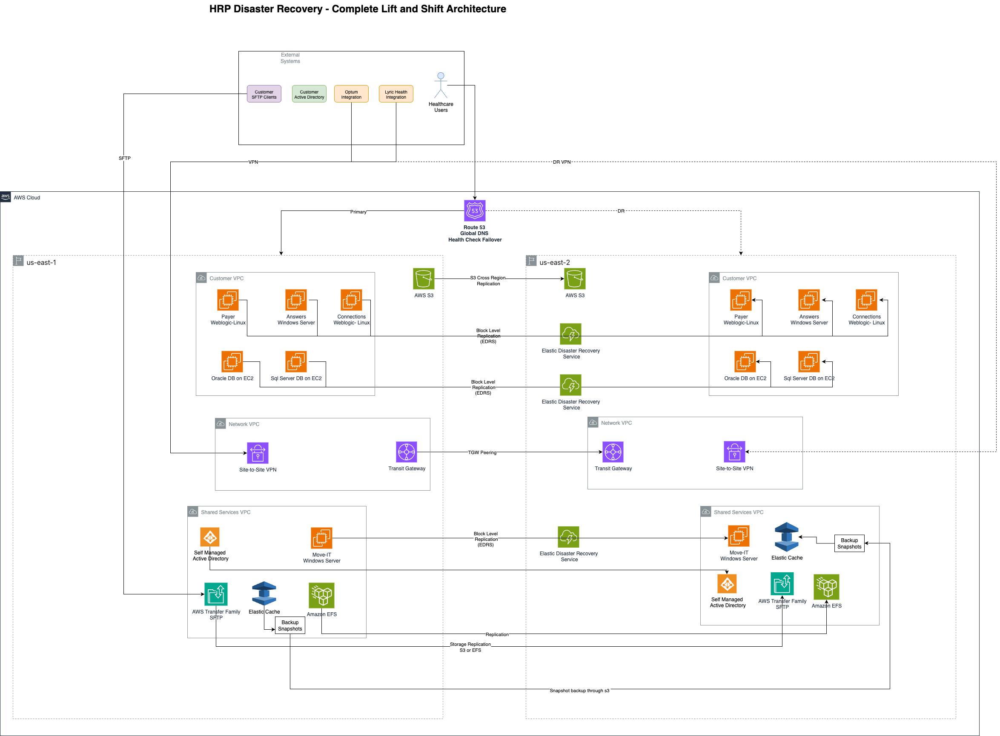
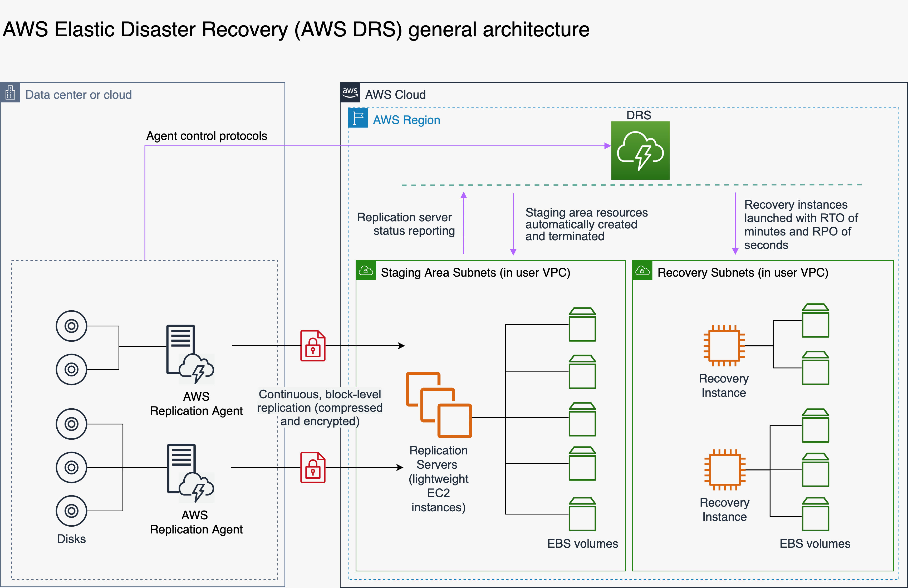
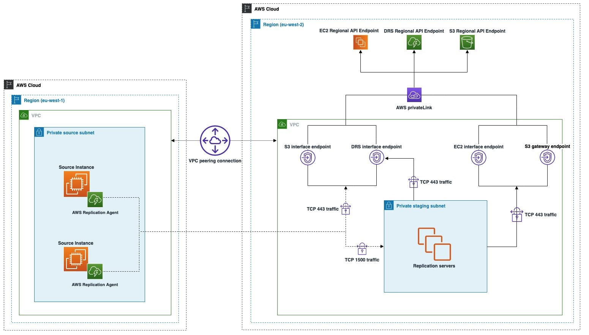
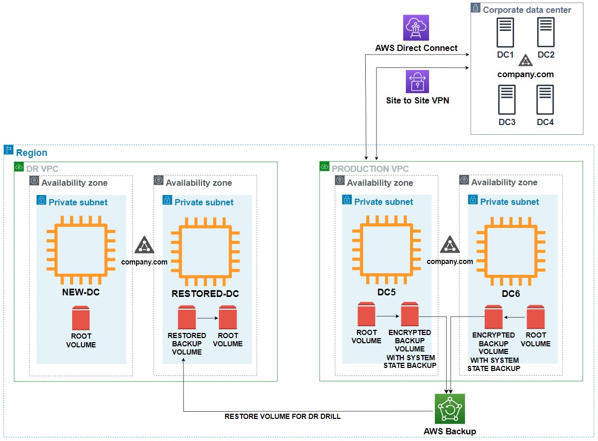

# HRP - DR Recommendations

**Confluence Page:** https://healthedge.atlassian.net/wiki/spaces/CP1/pages/5112397888/HRP%20-%20DR%20Recommendations

**Created by:** Venkata Kommuri on September 21, 2025  
**Last modified by:** Venkata Kommuri on October 01, 2025 at 08:03 PM

---

HRP Disaster Recovery Strategy
==============================

1. Introduction to Disaster Recovery
------------------------------------

### 1.1 What is Disaster Recovery?

Disaster Recovery (DR) is a comprehensive set of policies, tools, and procedures designed to enable the recovery or continuation of vital technology infrastructure and systems following a natural or human-induced disaster. For Health Rules Payor (HRP), disaster recovery is critical to maintaining healthcare operations, ensuring patient data availability, and meeting regulatory compliance requirements. The goal of disaster recovery is to minimize downtime and data loss while ensuring that critical business functions can continue or be quickly restored to normal operations.

### 1.2 Key DR Concepts and Terminology

**Recovery Time Objective (RTO):** The maximum amount of time that a system can be unavailable before causing unacceptable impact to the business. For HRP applications, this directly relates to healthcare operations continuity and regulatory compliance requirements.

**Recovery Point Objective (RPO):** The maximum amount of data loss that is acceptable during a disaster, measured in time. This represents the point in time to which data must be recovered after an outage. In HRP, even minimal data loss can have significant implications for patient safety and regulatory compliance.

**Business Continuity:** The broader organizational capability to maintain essential functions during and after a disaster. DR is a critical component of business continuity planning.

**High Availability (HA):** The design and implementation of systems to remain operational and accessible for a high percentage of time, typically measured in "nines" (99.9%, 99.99%, etc.). While related to DR, HA focuses on preventing outages rather than recovering from disasters.

### 1.3 Disaster Recovery in AWS

Amazon Web Services (AWS) provides a comprehensive set of cloud services and capabilities specifically designed to support robust disaster recovery strategies. AWS DR solutions leverage the global infrastructure of AWS regions and availability zones to provide geographic redundancy, automated failover capabilities, and cost-effective backup and recovery options.

#### 1.3.1 AWS Global Infrastructure for DR

**AWS Regions:** AWS operates multiple geographic regions around the world, each consisting of multiple isolated data centers. Regions are designed to be completely independent, with their own power, cooling, and network infrastructure. This geographic separation makes regions ideal for disaster recovery scenarios.

**Availability Zones (AZs):** Within each AWS region, there are multiple Availability Zones—physically separate data centers with redundant power, networking, and connectivity. AZs are connected through high-bandwidth, low-latency networking, making them suitable for synchronous replication and high-availability architectures.

#### 1.3.2 AWS DR Service Categories

**Compute Services:** Amazon EC2 provides the foundation for most DR strategies, with capabilities for automated instance launch, Auto Scaling, and cross-region AMI replication. Services like AWS Lambda provide serverless compute options that can automatically scale and distribute across multiple regions.

**Storage Services:** AWS offers multiple storage services optimized for different DR scenarios, including Amazon S3 with cross-region replication, Amazon EBS with snapshot capabilities, and Amazon EFS with backup and restore functionality.

**Database Services:** AWS provides managed database services like Amazon RDS, Amazon DynamoDB, and Amazon ElastiCache, each with built-in backup, replication, and cross-region capabilities.

**Networking Services:** Services like Amazon Route 53, AWS Direct Connect, and AWS Transit Gateway provide the networking foundation for DR architectures, including DNS failover, dedicated connectivity, and cross-region network management.

2. Executive Summary
--------------------

This document outlines a comprehensive disaster recovery (DR) strategy for the Health Rules Payor (HRP) environment using a lift and shift approach to AWS migration. The strategy focuses on migrating existing on-premises infrastructure to AWS with minimal architectural changes while immediately improving DR capabilities through AWS managed services and automation.

The lift and shift approach maintains current application architecture and operational processes while leveraging AWS infrastructure services to achieve better RTO/RPO targets, automated failover capabilities, and component-level recovery options. This strategy provides a foundation for future cloud-native transformations while delivering immediate DR improvements.

3. Strategic Context
--------------------

### 3.1 HRP Current DR Testing Procedures

**Document Purpose:** This document provides comprehensive details about Health Rules Payor (HRP) current disaster recovery testing procedures based on analysis of meeting transcripts and technical sessions.

### Testing Frequency and Requirements

**Annual DR Tests:** The company is contractually obligated to perform DR tests with customers once per year

**Live Production Testing:** These are actual live production failover tests, not simulated tests

**Contractual Obligations:** DR testing is a contractual requirement with customers, making it mandatory and non-negotiable.

### Current DR Testing Approach

### "All or Nothing" Failover Strategy

* The current DR approach requires failing over the entire customer environment as a single unit
* Component-level failovers not applicable for HRP applications
* If one component fails (like Oracle database), they either recover it in place or fail over the entire environment to DR

### Clean Shutdown Capability

**5-minute failover capability** for clean shutdowns

This timing is achieved when systems are properly shut down before failover. The process involves:

1. Clean shutdown of applications and databases
2. Failover to replicated storage volumes
3. Startup of VMs from replicated storage
4. Network routing changes

### Storage-Level Replication Testing

| Component | Technology | Description |
| --- | --- | --- |
| Volume-Level Replication | EDRS | Entire customer volumes replicated in real-time to secondary site |
| Storage Technology | EMC Data Replication Service | Current storage replication technology |
| Environment Scope | Complete Replication | Includes databases, applications, and third-party apps |
| Network Architecture | Stretched Networks | Same IP addresses and hostnames maintained during failover |

### Network and Connectivity Testing

### Customer VPN Coordination

* Customers have dedicated DR VPN tunnels that need to be activated during DR events
* Network routing changes are required on customer side
* **Active-Active Data Centers:** Ohio and Massachusetts with 50/50 customer distribution

### External Integration Testing

* **Third-Party Vendor Connectivity:** Site-to-site VPN connections to vendors must be tested
* **Authentication Systems:** Okta SSO and customer Active Directory/LDAP connectivity
* **File Transfer Services:** SFTP and Move-IT services (shared but logically separated)

### Database Replication Testing

### Dual Technology Support

During the migration period, both replication technologies need DR testing:

* **Golden Gate:** Legacy replication technology for existing customers
* **Click Replication:** New standard since January 2024

### Database Components Tested

| Configuration | Database Count | Components |
| --- | --- | --- |
| Minimum per customer | 3 databases | OLTP, Data Warehouse, Replication server |
| Maximum per customer | 4 databases | OLTP, Data Warehouse, Replication server, Custom database |
| Replication Flow | Real-time | OLTP to Data Warehouse via Golden Gate/Click |

### RTO/RPO Requirements

**Variable by Customer:** RTO and RPO requirements differ per customer contract

**Near Real-time Replication:** Storage replication runs as close to real-time as possible

**Acceptable Data Loss:** There are defined acceptable data loss tolerances during DR events

### Key Migration Considerations

This comprehensive DR testing approach ensures business continuity but presents significant challenges for AWS migration, particularly around:

* Maintaining the same level of integration testing
* Preserving customer isolation requirements
* Adapting to cloud-native networking and storage solutions
* Ensuring contractual DR testing obligations are met

### 3.2 Current Pain Points and Limitations

Based on the analysis of the current on-premises environment, several limitations have been identified:

* **All-or-Nothing Failover:** Current DR strategy requires entire customer environment failover, preventing granular component recovery.
* **Storage-Level Replication Dependency:** Heavy reliance on storage-level replication limits flexibility and recovery options.
* **Manual DR Testing:** Annual manual DR tests are resource-intensive and disruptive to operations.
* **Limited Scalability:** Current infrastructure cannot easily scale to accommodate growing customer base.
* **Technology Dependencies:** Dual support required for Golden Gate and Click replication technologies.
* **Complex Integration Points:** Multiple external vendor integrations require careful DR coordination.
* **Network Complexity:** Stretched network model not directly applicable to AWS architecture.
* **Ancillary System Dependencies:** Windows-based systems like Answers require separate DR considerations.

### 3.3 Business Drivers

The primary business drivers for implementing a robust DR solution include:

* **Business Continuity:** Ensure critical HRP services remain available even during infrastructure failures or regional outages.
* **Risk Mitigation:** Reduce the risk of downtime and data loss that could impact healthcare operations.
* **Regulatory Compliance:** Meet healthcare industry requirements for data protection and service availability.
* **Customer Trust:** Maintain high service levels for healthcare payers and their members.
* **Operational Efficiency:** Reduce the effort and complexity in DR processes through AWS native automation features.
* **Cost Optimization:** Leverage AWS managed services to reduce operational overhead and improve cost efficiency.

4. Lift and Shift DR Strategy Overview
--------------------------------------

### Lift and Shift Objectives

* Migrate existing on-premises infrastructure to AWS with minimal architectural changes
* Leverage AWS managed services to replace on-premises components where possible
* Establish current or improved DR capabilities that meets current RTO or RPO which are in minutes
* Maintain existing application architecture and integration patterns
* Provide foundation for future cloud-native transformations

#### DR Targets for Lift and Shift

* **RTO Target:** with in 15 minutes
* **RPO Target:** 15 minutes (improved from current 30+ minutes)
* **Availability Target:** 99.9% (8.77 hours downtime/year)
* **DR Strategy:** Active-Passive with semi automated failover
* **Recovery Scope:** All-or-nothing

The lift and shift approach focuses on migrating existing infrastructure to AWS while dramatically improving DR capabilities through AWS managed services. This strategy maintains current application architecture while providing enhanced resilience, automated recovery, and operational efficiency.

#### 4.1 Dramatic DR Improvement with Lift and Shift

| Metric | Current State | Lift & Shift Target | Improvement |
| --- | --- | --- | --- |
| **RTO** | < 15-20 minutes | < 10 minutes | 50% reduction |
| **RPO** | 30+ minutes | 15 minutes | 50% reduction |
| **Availability** | ~99% (manual process) | 99.9% | 10x improvement |
| **Recovery Process** | Semi automated, all-or-nothing | Automated | Semi automated |
| **Testing Frequency** | Annual | Monthly | 12x more frequent |

#### 4.2 Key DR Improvements in Lift and Shift

* **All-or-Nothing Failover:** Maintain current approach of failing over entire customer environment as a unit
* **Storage-Level Replication:** Continue with AWS Elastic Disaster Recovery Service (EDRS) for infrastructure-level replication
* **Managed Services:** Leverage AWS managed services while preserving operational patterns
* **Cross-Region Replication:** Implement automated data replication across AWS regions
* **Baseline Capability:** Ensure AWS solution meets or exceeds current DR capabilities
* **Operational Continuity:** Avoid introducing significant operational changes during migration

### 4.2 AWS Regional Strategy

* **Primary Regions:** US-East-1 (N. Virginia) and US-West-2 (Oregon) for primary operations
* **Secondary Regions:** US-East-2 (Ohio) and US-West-1 (N. California) for disaster recovery

This regional selection provides optimal geographic distribution while leveraging AWS's robust regional infrastructure and maintaining compliance with healthcare data residency requirements.

### 4.3 AWS Regional Strategy Architecture

Following DR Solution are suggested for the HRP application

*AWS HRP Disaster Recovery Architecture*



*AWS Elastic Disaster Recovery Architecture*



5. Component-Specific Lift and Shift DR Strategy
------------------------------------------------

### 5.1 Application Layer (WebLogic/Java Applications)

#### Current State → Lift and Shift Migration with EDRS

**Current:** WebLogic servers on Linux (1-15 servers per customer)

**Target:** Amazon EC2 instances with WebLogic + AWS Elastic Disaster Recovery Service (EDRS)

The application layer migration strategy focuses on lifting and shifting existing WebLogic applications to EC2 instances while implementing AWS Elastic Disaster Recovery Service (EDRS) for comprehensive DR protection. This approach maintains the current application architecture while providing enterprise-grade DR capabilities through continuous replication and automated recovery processes.

**Implementation Approach:**

* **EC2 Instance Migration:** Lift and shift WebLogic applications to EC2 instances using AWS Application Migration Service (MGN)
* **EDRS Integration:** Deploy EDRS agents on all WebLogic EC2 instances for continuous replication
* **Load Balancing:** Replace current load balancers with Application Load Balancer (ALB)
* **Launch Templates:** Create standardized launch templates for EDRS recovery scenarios

**EDRS-Based DR Strategy:**

* **Primary Region:** Active WebLogic instances with EDRS agents and ALB health checks
* **DR Region:** EDRS staging area with automated recovery capabilities
* **Failover:** EDRS one-click recovery + Route 53 DNS failover (RTO: 1-2 minutes)
* **Recovery:** EDRS launches instances automatically with preserved application state

**Enhanced EDRS Features for Applications:**

* **Application State Preservation:** Complete application state maintained through EDRS replication
* **Configuration Consistency:** All WebLogic configurations replicated automatically
* **Session Persistence:** ElastiCache for Redis with cross-region replication for session data
* **File System Replication:** Complete file system replication including application files and logs
* **Network Configuration:** Automated network setup in DR region matching primary
* **Monitoring Integration:** CloudWatch with EDRS-specific metrics and automated alarms
* **Testing Capabilities:** Non-disruptive DR testing without affecting production
* **Automated Failback:** Simplified failback process to primary region after recovery

**EDRS Configuration for WebLogic:**

* **Application Consistency:** WebLogic-aware snapshots ensuring transaction consistency
* **Multi-Instance Coordination:** Coordinated snapshots across WebLogic cluster members
* **Bandwidth Optimization:** Intelligent compression and deduplication for application data
* **Security:** Encrypted replication with AWS KMS integration
* **Launch Templates:** Pre-configured EC2 settings optimized for WebLogic workloads
* **Load Balancer Integration:** Automatic ALB target group registration during recovery

#### DR Testing Strategy for Applications

##### Current State DR Testing Analysis

* **Current DR Testing:** Annual manual DR tests with limited automation
* **Network Handling:** Current DR tests require manual network reconfiguration and customer coordination
* **Test Scope:** Full environment failover testing with customer participation
* **Challenges:** Complex coordination between multiple teams and external dependencies

##### AWS DR Testing Framework

* **Quarterly Testing:** Automated DR tests for each customer environment
* **Test Scenarios:** Full environment failover (maintaining all-or-nothing approach)
* **Network Testing:** Automated VPN failover testing with customer coordination
* **Customer Participation:** Establish procedures for customer involvement in DR testing
* **Performance Validation:** Automated performance testing in DR region
* **Rollback Procedures:** Automated rollback using Route 53 weighted routing



##### Session Management - ElastiCache for Redis (Cost-Optimized DR)

**Current:** On-premises Redis for session data storage

**Lift and Shift Target:** Amazon ElastiCache for Redis with Backup and Restore DR Strategy

**Cost-Effective DR Approach:** Since Redis is used only for session data (non-critical, temporary data), we implement a backup and restore strategy instead of expensive real-time replication, reducing costs by 50-60%.

**Primary Region Implementation:**

* **Primary Use Case:** Session data storage (replacing on-premises Redis)
* **Instance Type:** r6g.large (2 vCPUs, 12.93 GB RAM) - right-sized for session workload
* **Deployment:** Single-AZ deployment for cost optimization (Multi-AZ adds 100% cost)
* **Backup Strategy:** Automated daily backups with 7-day retention
* **Reserved Instance:** 1-year term for 30% cost savings
* **Security:** Encryption in transit and at rest, VPC security groups
* **Estimated Cost:** ~$180/month (vs $400-500 with Global Datastore)

**DR Region Implementation:**

* **Strategy:** On-demand cluster provisioning during DR events
* **Instance Type:** r6g.medium (1 vCPU, 6.38 GB RAM) - smaller for cost optimization
* **Provisioning:** Automated cluster creation from latest backup
* **Restore Time:** 10-15 minutes for cluster restoration
* **Cost:** $0/month during normal operations (only pay during DR events)

**DR Implementation Details:**

* **Backup Frequency:** Daily automated backups with cross-region copy
* **RTO Target:** 10-15 minutes (cluster provisioning + restore)
* **RPO Target:** 24 hours (acceptable for session data)
* **Session Handling:** Graceful degradation - users re-authenticate during DR
* **Automation:** Lambda functions for automated DR cluster provisioning
* **Monitoring:** CloudWatch metrics for backup success and cluster health

**Application-Level Session Handling:**

* **Graceful Degradation:** Applications handle Redis unavailability gracefully
* **Re-authentication Flow:** Redirect users to login when sessions are unavailable
* **User Communication:** Clear messaging about temporary re-authentication requirement
* **Form Data Preservation:** Preserve critical form data locally where possible

**Lift-and-Shift Considerations:**

* **Minimal Code Changes:** Maintain existing Redis client configurations
* **Connection String Updates:** Update application configs to point to ElastiCache endpoints
* **Session Timeout Handling:** Preserve existing session timeout logic
* **Cost-Effective Sizing:** Start with smaller instances and scale based on actual usage
* **Shared vs Dedicated:** Consider shared ElastiCache clusters for cost optimization while maintaining customer data isolation through Redis databases

### 5.2 Database Layer - Storage-Level Replication Strategy

The database DR strategy focuses on maintaining current database architecture while leveraging AWS Elastic Disaster Recovery Service (EDRS) for storage-level replication. This approach preserves existing operational patterns and database configurations while planning for future migration to PostgreSQL and AWS-managed database services. The strategy emphasizes continuity during migration with a clear path to modernization.

#### Oracle Database on EC2 - DR Strategy with AWS Elastic Disaster Recovery Service (EDRS)

**Current:** On-premises Oracle databases (GoldenGate used for customer replication)

**Target:** Oracle Enterprise Edition on EC2 with AWS Elastic Disaster Recovery Service (EDRS)

This strategy leverages AWS Elastic Disaster Recovery Service (EDRS) as the primary DR solution for Oracle databases running on EC2. EDRS provides continuous, block-level replication of entire EC2 instances and their attached EBS volumes to a DR region, ensuring complete application and database consistency. This approach simplifies DR management while providing enterprise-grade recovery capabilities with minimal RTO and RPO.

**Implementation Approach:**

* **Primary Database:** Oracle Enterprise Edition on EC2 with EBS gp3 storage
* **Instance Configuration:** r6i.2xlarge or larger with optimized networking
* **Storage Strategy:** EBS volumes with provisioned IOPS for performance
* **DR Service:** AWS Elastic Disaster Recovery Service (EDRS) for complete instance replication
* **Application Consistency:** EDRS application-consistent snapshots for Oracle

**EDRS Architecture Components:**

* **Source Servers:** Oracle EC2 instances in primary region with EDRS agents
* **Replication Servers:** Lightweight EC2 instances managing data replication
* **Staging Area:** Low-cost EBS volumes storing replicated data in DR region
* **Recovery Instances:** Right-sized EC2 instances launched during DR events
* **Network Configuration:** Automated VPC and security group setup in DR region
* **Backup Strategy:** RMAN backups to S3 with cross-region replication (additional layer)

**Enhanced EDRS Features:**

* **Continuous Replication:** Block-level replication with sub-second RPO capability
* **Application-Consistent Snapshots:** Oracle-aware snapshots ensuring database consistency
* **One-Click Recovery:** Automated recovery with pre-configured launch templates
* **Point-in-Time Recovery:** Recovery to any point within the replication timeline
* **Non-Disruptive Testing:** Test DR scenarios without affecting production
* **Automated Failback:** Simplified failback process to primary region
* **Cross-Region Networking:** Automatic network configuration and routing
* **CloudWatch Integration:** Comprehensive monitoring and alerting

**EDRS Configuration Details:**

* **Replication Frequency:** Continuous replication with configurable recovery points
* **Bandwidth Optimization:** Intelligent data compression and deduplication
* **Security:** Encrypted replication with AWS KMS integration
* **Multi-Volume Consistency:** Consistent snapshots across multiple EBS volumes
* **Launch Templates:** Pre-configured instance settings for DR scenarios
* **Tagging Strategy:** Automated resource tagging for cost allocation

**DR Performance Targets with EDRS:**

* **RTO:** 1-2 minutes with EDRS automated recovery
* **RPO:** Sub-second to 1 minute depending on configuration
* **Availability:** 99.95% with EDRS
* **Recovery Consistency:** 100% application-consistent recovery

#### SQL Server on EC2 - DR Strategy with AWS Elastic Disaster Recovery Service (EDRS)

**Current:** On-premises SQL Server databases with storage-level replication using EMC Data Replication Service

**Target:** Maintain current SQL Server architecture with AWS EDRS for comprehensive storage-level replication

This strategy maintains the current SQL Server database architecture during initial migration while leveraging AWS Elastic Disaster Recovery Service for robust storage-level replication. The approach preserves existing database configurations and operational procedures while providing enhanced DR capabilities through AWS infrastructure services.

##### EDRS-Based SQL Server DR Architecture

**Primary Architecture Components:**

* **SQL Server Instances:** Lift and shift existing SQL Server instances to EC2 with EDRS agents
* **Storage-Level Replication:** EDRS provides continuous block-level replication of entire SQL Server environment
* **Instance Configuration:** Memory-optimized EC2 instances (r6i.xlarge to r6i.8xlarge) based on workload requirements
* **Network Integration:** Maintain existing network patterns with AWS VPC and security groups
* **Automated Recovery:** EDRS one-click recovery with preserved SQL Server configurations

**EDRS Implementation for SQL Server:**

* **Agent Deployment:** EDRS agents installed on all SQL Server EC2 instances
* **Continuous Replication:** Real-time block-level replication to DR region staging area
* **Application Consistency:** SQL Server-aware snapshots ensuring transaction consistency
* **Database State Preservation:** Complete database state maintained including system databases
* **Configuration Replication:** All SQL Server configurations, logins, and jobs replicated automatically
* **File System Replication:** Complete file system replication including database files, logs, and backups

**Storage Architecture with EDRS:**

* **Data Files:** EBS gp3 or io2 volumes with EDRS continuous replication
* **Transaction Logs:** Separate EBS volumes optimized for sequential writes with EDRS protection
* **TempDB:** Instance store NVMe SSD for temporary operations (excluded from EDRS replication)
* **Backup Files:** S3 integration for backup storage with cross-region replication
* **System Databases:** Master, Model, MSDB replicated through EDRS for complete recovery

**EDRS DR Capabilities:**

* **RTO Achievement:** 5-10 minute recovery time through automated EDRS launch
* **RPO Achievement:** 15-minute RPO through continuous replication with point-in-time recovery
* **Network Consistency:** Automated network configuration in DR region matching primary
* **DNS Failover:** Route 53 health checks with automatic DNS failover
* **Load Balancer Integration:** Automatic registration with Application Load Balancer during recovery
* **Security Preservation:** All security configurations and certificates maintained through EDRS

### 5.3 Network and Connectivity

#### Customer Network Isolation

**Current:** Dedicated /24 subnets per customer with stretched networks

**Target:** Shared VPC with Transit Gateway

Please refer to below network design documentation for more details. Same network design will be implemented in DR regions.  
5.4 Multi-Account Network Design

5-5-Decision-VPC-Design

#### DNS

**Current DNS Configuration**  
  
**Customer-Specific DNS**  
**Separate DNS per Customer:** Each customer environment has a separate DNS to access the Web UI  
**Dedicated Web UI Instances:** Every customer gets their own instance of Web UI  
**Customer-Specific URLs:** Each customer has their own URL/DNS entry for accessing services  
**Environment Isolation:** DNS configuration ensures complete customer isolation

**Internal DNS Resolution**  
**Active Directory Integration:** Customer Active Directory/LDAP systems require DNS resolution  
**IP Address Configuration:** Customer Active Directory IP addresses configured in HRP  
**Certificate Management:** DNS names used for certificate import and validation  
**LDAP/LDAPS Calls:** DNS resolution required for customer directory services

Please Refer to DNS design document:

5-7-Decision-DNS-Design

### **DNS DR Recommendations**

### Route 53 Multi-Region DNS Architecture

### Primary DNS Strategy

* **Route 53 Hosted Zones:** Create dedicated hosted zones for each customer environment
* **Health Check Integration:** Implement Route 53 health checks for automatic failover
* **Weighted Routing:** Use weighted routing policies for gradual traffic shifting
* **Geolocation Routing:** Consider geolocation-based routing for performance optimization

### DNS Failover Configuration


```
Primary Region (US-East-1/US-West-2): - Primary DNS records with health checks - 60-second health check intervals - Automatic failover to DR region on failure DR Region (US-East-2/US-West-1): - Standby DNS records (lower priority) - Same health check configuration - Automatic promotion on primary failure
```


### Customer-Specific DNS Implementation

### Dedicated Customer DNS Zones

* **Customer Isolation:** Separate Route 53 hosted zones per customer
* **Custom Domain Support:** Support for customer-provided domain names
* **SSL Certificate Integration:** AWS Certificate Manager integration for each customer domain
* **DNS Delegation:** Proper DNS delegation from customer domains to AWS

### Customer Access Patterns


```
Customer A: customer-a.hrp.healthedge.com - Primary: ALB in US-East-1 (Active) - DR: ALB in US-East-2 (Standby) - Health Check: Application-level health checks - Failover Time: 60-180 seconds Customer B: customer-b.hrp.healthedge.com - Primary: ALB in US-West-2 (Active) - DR: ALB in US-West-1 (Standby) - Health Check: Application-level health checks - Failover Time: 60-180 seconds
```


### Application Load Balancer DNS Integration

### ALB Health Check Configuration

* **Target Group Health:** Monitor application server health
* **Multi-AZ Deployment:** ALBs deployed across multiple AZs
* **Cross-Region Failover:** Automatic DNS failover to DR region ALB
* **SSL Termination:** SSL certificates managed by AWS Certificate Manager

### DNS Record Structure

| Service Type | Primary DNS Record | DR DNS Record | Target |
| --- | --- | --- | --- |
| Web UI Access | [webui.customer-a.hrp.healthedge.com](http://webui.customer-a.hrp.healthedge.com) | [webui-dr.customer-a.hrp.healthedge.com](http://webui-dr.customer-a.hrp.healthedge.com) | Primary/DR ALB |
| API Endpoints | [api.customer-a.hrp.healthedge.com](http://api.customer-a.hrp.healthedge.com) | [api-dr.customer-a.hrp.healthedge.com](http://api-dr.customer-a.hrp.healthedge.com) | Primary/DR ALB |
| SFTP Endpoints | [sftp.customer-a.hrp.healthedge.com](http://sftp.customer-a.hrp.healthedge.com) | [sftp-dr.customer-a.hrp.healthedge.com](http://sftp-dr.customer-a.hrp.healthedge.com) | AWS Transfer Family |

### Internal DNS Resolution

### Route 53 Resolver Configuration

* **VPC DNS Resolution:** Route 53 Resolver for internal name resolution
* **Conditional Forwarding:** Forward customer AD queries to appropriate resolvers
* **DNS Caching:** Implement DNS caching for performance
* **Cross-Region Resolution:** DNS resolution across regions for DR scenarios

### Active Directory Integration


```
Customer AD Integration: - Forward DNS queries for customer.local → Customer AD servers - Reverse DNS lookups for customer IP ranges - Conditional forwarders for customer domains - DNS over VPN for secure resolution
```


### Service Discovery and Microservices

### AWS Cloud Map Integration

* **Service Discovery:** AWS Cloud Map for microservices discovery
* **ECS Integration:** Automatic service registration for ECS services
* **Health Check Integration:** Service-level health checks
* **Cross-Region Discovery:** Service discovery across regions for DR

### Kubernetes DNS (EKS)


```
Melissa Data Microservices: - Internal DNS: cluster.local domain - External Access: Route 53 records pointing to EKS ingress - Health Checks: Kubernetes liveness/readiness probes - DR Failover: DNS failover to DR region EKS cluster
```


### 6. File Transfer Services DNS

### AWS Transfer Family DNS

* **SFTP Endpoints:** Route 53 records for SFTP endpoints
* **Multi-Region Deployment:** Transfer Family in both regions
* **Health Check Monitoring:** Monitor SFTP service availability
* **Automatic Failover:** DNS failover for SFTP endpoints

### Move-IT DNS Configuration


```
Move-IT Services: - moveit.customer-a.hrp.healthedge.com → Primary EC2 instances - moveit-dr.customer-a.hrp.healthedge.com → DR EC2 instances - Health Checks: Application-level health monitoring - EFS Integration: Shared file system across regions
```


### Third-Party Integration DNS

### Vendor Connectivity

* **Site-to-Site VPN DNS:** DNS resolution over VPN connections
* **Private DNS Zones:** Private hosted zones for vendor integrations
* **Conditional Forwarding:** Forward vendor domain queries appropriately
* **Certificate Validation:** DNS-based certificate validation for vendor connections

### External Service DNS

| Integration Type | DNS Configuration | Health Check | Failover Logic |
| --- | --- | --- | --- |
| CES (Vendor-hosted) | Direct DNS resolution to vendor endpoints | Monitor vendor service availability | Automatic failover for critical integrations |
| CXT (Health Edge-hosted) | Route 53 records for internal services | Application-level health checks | Cross-region failover |
| EZ Grouper | Route 53 records for internal services | Application-level health checks | Cross-region failover |

### DNS Monitoring and Alerting

### CloudWatch Integration

* **DNS Query Monitoring:** Monitor DNS query patterns and failures
* **Health Check Alerts:** Alerts for health check failures
* **Failover Notifications:** Notifications when DNS failover occurs
* **Performance Metrics:** DNS resolution time monitoring

### Monitoring Dashboard

**Key Metrics:**

* DNS query success rate per customer
* Health check status across regions
* Failover frequency and duration
* DNS resolution latency
* Certificate expiration monitoring

### DR Testing Procedures

### DNS Failover Testing

* **Quarterly DNS Tests:** Test DNS failover for each customer
* **Health Check Validation:** Validate health check accuracy
* **Failover Time Measurement:** Measure actual failover times
* **Customer Impact Assessment:** Monitor customer experience during tests

### Testing Scenarios

**Critical Test Cases:**

1. Primary region complete failure
2. Individual service failures
3. Network connectivity issues
4. Health check false positives
5. DNS propagation delays
6. Certificate renewal failures

#### Active Directory DR Strategy

The DR strategy for self-managed Active Directory ensures continuous authentication services, maintains security policy enforcement, and provides seamless user access during regional failures while preserving the complex Health Edge-specific configurations and compliance requirements essential for patient data protection and regulatory adherence.

##### Active Directory Architecture for Healthcare DR

**Multi-Region Domain Controller Deployment:**

The Active Directory DR architecture implements a sophisticated multi-region deployment designed to provide both high availability within regions and comprehensive disaster recovery capabilities across AWS regions. The architecture maintains the existing domain structure while extending it to support cloud-based disaster recovery scenarios.

**Primary Region (US-East-1) AD Infrastructure:**

* **Primary Domain Controllers:** 3 Windows Server 2022 domain controllers across 3 Availability Zones
* **Global Catalog Servers:** All DCs configured as Global Catalog servers for optimal authentication performance
* **FSMO Role Holders:** Strategic distribution of Forest and Domain FSMO roles across primary DCs
* **DNS Services:** Integrated DNS services with Route 53 conditional forwarding
* **Certificate Authority:** Enterprise CA with automated certificate enrollment and CRL distribution
* **DFS Replication:** SYSVOL and custom healthcare policy shares with cross-region replication
* **DHCP Services:** Redundant DHCP servers with 80/20 scope distribution
* **Time Services:** NTP hierarchy with external time source synchronization

**DR Region (US-West-2) AD Infrastructure:**

* **DR Domain Controllers:** 2 Windows Server 2022 domain controllers across 2 Availability Zones
* **Global Catalog Servers:** Both DR DCs configured as Global Catalog servers
* **FSMO Role Standby:** Prepared to assume FSMO roles during primary region failure
* **DNS Services:** Integrated DNS with Route 53 health check integration
* **Certificate Authority:** Subordinate CA ready for promotion during DR scenarios
* **DFS Replication:** Real-time SYSVOL replication and policy synchronization
* **DHCP Services:** Standby DHCP servers with pre-configured scopes
* **Time Services:** Independent NTP configuration for DR region operations



### 5.4 Authentication and Integration Services

#### Single Sign-On (SSO)

**Current:** Okta integration for SSO

**Target:** API Gateway + Lambda for Okta integration

The SSO strategy maintains Okta integration while leveraging AWS serverless services for improved scalability and DR capabilities. This approach provides distributed authentication services with automatic failover and session persistence across regions.

**Implementation Approach:**

* **API Gateway:** Secure endpoints for authentication flows
* **Lambda Functions:** Handle Okta token validation and user management
* **ElastiCache:** Session storage for improved performance

**Enhanced DR Features:**

* **Multi-Region API Gateway:** API Gateway endpoints in both regions
* **Lambda Cross-Region:** Lambda functions deployed in both regions
* **Session Replication:** ElastiCache Global Datastore for session persistence
* **Token Validation:** Distributed token validation with caching
* **Failover Logic:** Automatic authentication service failover

#### Reduced Sign-On (RSO)

**Current:** Direct LDAP calls to customer Active Directory

**Target:** Self Managed Microsoft AD + Directory Service

**Implementation Approach:**

* **Self Managed AD:** Self Managed Microsoft AD for LDAP connectivity
* **Trust Relationships:** Establish trusts with customer AD domains
* **VPN Integration:** Secure connectivity through Site-to-Site VPN

**Enhanced DR Features:**

* **Multi-Region AD:** Self Managed AD instances in both regions
* **Directory Replication:** Cross-region directory synchronization
* **Trust Failover:** Backup trust relationships to DR region
* **LDAP Load Balancing:** Distribute LDAP queries across regions

### 5.5 File Transfer Services

#### SFTP Services

**Current:** Shared SFTP servers with customer folders

**Target:** AWS Transfer Family (SFTP)

The SFTP services strategy migrates to AWS Transfer Family for fully managed SFTP capabilities with AWS Fsx backend storage. This approach provides enhanced security, scalability, and DR capabilities while maintaining existing customer integration patterns.

**Implementation Approach:**

* **Managed SFTP:** Fully managed SFTP service with AWS S3 backend
* **Customer Isolation:** Folders with IAM policies and Windows ACLs
* **Cross-Region Replication:** S3 cross region replication.

**Enhanced DR Features:**

* **Multi-Region Endpoints:** SFTP endpoints in both primary and DR regions
* **S3 Replication:** Real-time file replication using S3 cross region replication
* **DNS Failover:** Route 53 CNAME records for automatic endpoint failover
* **Access Logging:** CloudTrail logs for audit trails
* **Encryption:** Encryption with AWS KMS

#### Move-IT File Transfer

**Current:** Shared Move-IT servers

**Target:** EC2 with EFS + S3 integration

**Implementation Approach:**

* **Windows Server Migration:** Lift and shift to Windows Server 2022 on EC2
* **EDRS Integration:** Deploy EDRS agents for complete system replication
* **Instance Configuration:** Right-sized Windows EC2 instances based on customer usage
* **EFS Integration**: Integration with Amazon EFS for file storage
* **Maintain Functionality**: Keep all current job processing and automation capabilities
* **DR Strategy:** AWS DRS for EC2 instance and EFS backup to S3 with cross-region replication

**EDRS Architecture for Move-IT:**

* **Source Servers:** Windows Server instances in primary region with EDRS agents
* **Application Replication:** Complete Windows environment including Move-IT application
* **Configuration Preservation:** All Windows services, registry settings, and configurations
* **Data Connectivity:** Automated network configuration for Data Warehouse access
* **Recovery Instances:** Windows EC2 instances launched during DR scenarios

**Enhanced EDRS Features for Windows:**

* **Windows VSS Integration:** Volume Shadow Copy Service for application consistency
* **Active Directory Integration:** Seamless domain join and authentication
* **Service Dependencies:** Proper startup order for Windows services
* **Registry Replication:** Complete Windows registry preservation
* **Network Configuration:** Automated network adapter and DNS configuration
* **License Management:** Windows Server licensing compliance in DR region

**Enhanced DR Features:**

* **EFS Cross-Region Backup:** Automated EFS backups to DR region
* **S3 Lifecycle Policies:** Automated archival and deletion policies

### 5.6 Answers System (Windows-Based Reporting)

#### Answers Reporting System

**Current:** Windows Server-based reporting system (ancillary service)

**Target:** Windows Server on EC2 with AWS Elastic Disaster Recovery Service (EDRS)

The Answers system is an ancillary Windows Server-based reporting and analytics platform that reads data from the Data Warehouse and presents standard reports to customers. Not all customers use this system, making it an optional component that requires flexible DR capabilities. The system provides read-only access to data warehouse information and generates customer-specific reports.

**Implementation Approach:**

* **Windows Server Migration:** Lift and shift to Windows Server 2022 on EC2
* **EDRS Integration:** Deploy EDRS agents for complete system replication
* **Instance Configuration:** Right-sized Windows EC2 instances based on customer usage
* **Data Warehouse Connectivity:** Maintain connections to SQL Server Data Warehouse
* **Customer-Specific Deployment:** Deploy only for customers who use the service

**EDRS Architecture for Answers:**

* **Source Servers:** Windows Server instances in primary region with EDRS agents
* **Application Replication:** Complete Windows environment including Answers application
* **Configuration Preservation:** All Windows services, registry settings, and configurations
* **Data Connectivity:** Automated network configuration for Data Warehouse access
* **Recovery Instances:** Windows EC2 instances launched during DR scenarios

**Enhanced EDRS Features for Windows:**

* **Windows VSS Integration:** Volume Shadow Copy Service for application consistency
* **Active Directory Integration:** Seamless domain join and authentication
* **Service Dependencies:** Proper startup order for Windows services
* **Registry Replication:** Complete Windows registry preservation
* **Network Configuration:** Automated network adapter and DNS configuration
* **License Management:** Windows Server licensing compliance in DR region

**DR Performance Targets for Answers:**

* **RTO:** 10-15 minutes with EDRS automated recovery
* **RPO:** Sub-second to 1 minute with continuous replication
* **Availability:** 99.9% (higher RTO tolerance due to ancillary nature)
* **Customer Impact:** Minimal business impact as reporting is non-critical

**Cost Optimization for Answers:**

* **Conditional Deployment:** Deploy only for customers who use the service
* **Right-Sizing:** Smaller instance types due to read-only reporting workload
* **Scheduled Operations:** Can be shut down during non-business hours
* **Shared Infrastructure:** Consider consolidation opportunities where appropriate

### 5.7 Microservices (Melissa Data)

#### Kubernetes Microservices

**Current:** Kubernetes cluster for Melissa Data services

**Target:** Amazon EKS (Elastic Kubernetes Service)

The microservices strategy migrates existing Kubernetes workloads to Amazon EKS while maintaining current containerized architecture. This approach provides managed Kubernetes control plane with enhanced DR capabilities through multi-region EKS clusters and automated container orchestration.

**Implementation Approach:**

* **EKS Migration:** Migrate existing Kubernetes workloads to EKS
* **Container Registry:** Amazon ECR for container image management
* **Cross-Region:** EKS clusters in both primary and DR regions
* **GitOps:** Automated deployment using GitOps principles

**Enhanced DR Features:**

* **Multi-Region EKS:** Active EKS clusters in both regions
* **ECR Cross-Region Replication:** Container image replication
* **Kubernetes Backup:** Velero for cluster backup and restore
* **Service Mesh:** AWS App Mesh for traffic management and failover
* **Horizontal Pod Autoscaler:** Automatic scaling based on metrics
* **Persistent Volume Backup:** EFS replication for stateful workloads


6. Implementation Roadmap
-------------------------

### Lift and Shift Implementation Timeline (12 Months)

#### Months 1-3: Foundation Setup

* **AWS Account Setup:** Multi-account strategy with Organizations
* **Network Infrastructure:** VPC, Transit Gateway, and VPN setup
* **Security Framework:** IAM roles, policies, and security groups
* **Monitoring Setup:** CloudWatch, CloudTrail, and Config
* **Backup Strategy:** AWS Backup service configuration
* **Network Optimization:** Enhanced networking for database replication

#### Months 4-6: Database Migration and EDRS Setup

* **Oracle Installation:** Enterprise edition on EC2 with optimized storage
* **SQL Server Installation:** Enterprise edition on EC2 with Windows Server
* **Database Configuration:** Performance tuning and optimization
* **EDRS Agent Installation:** Deploy EDRS agents on all database EC2 instances
* **EDRS Configuration:** Configure replication settings and launch templates
* **Monitoring Setup:** CloudWatch agents, EDRS metrics, and custom alarms
* **Backup Configuration:** Automated RMAN/SQL Server backup to S3 (additional layer)

#### Months 7-9: Application Migration with EDRS

* **EC2 Setup:** WebLogic application server migration to EC2
* **EDRS Integration:** Deploy EDRS agents on all application EC2 instances
* **Load Balancer:** Application Load Balancer configuration with EDRS integration
* **Auto Scaling:** Auto Scaling Groups setup with EDRS launch templates
* **EKS Migration:** Kubernetes workload migration (separate from EDRS)
* **Integration Testing:** End-to-end application and EDRS DR testing

#### Months 10-12: Services and Optimization

* **File Transfer:** AWS Transfer Family and Move-IT setup
* **Authentication:** SSO and RSO service migration
* **Answers System:** Windows Server migration with EDRS for applicable customers
* **DR Testing:** Comprehensive DR testing and validation including Answers system
* **Performance Tuning:** Optimization and cost management
* **Documentation:** Runbooks and operational procedures

7. AWS Elastic Disaster Recovery Service (EDRS) - Comprehensive Overview
------------------------------------------------------------------------

### What is AWS Elastic Disaster Recovery Service (EDRS)?

AWS Elastic Disaster Recovery Service (EDRS) is a fully managed disaster recovery service that provides continuous, block-level replication of on-premises and cloud-based servers to AWS. EDRS simplifies disaster recovery by automating the replication process, providing application-consistent recovery points, and enabling rapid recovery with minimal RTO and RPO.

**Key EDRS Capabilities:**

* **Continuous Replication:** Block-level replication with sub-second to minute-level RPO
* **Application Consistency:** Application-aware snapshots ensuring data integrity
* **One-Click Recovery:** Automated recovery process with pre-configured settings
* **Non-Disruptive Testing:** Test DR scenarios without affecting production
* **Automated Failback:** Simplified process to return to primary environment
* **Cost Optimization:** Pay only for replication infrastructure, not full DR environment

### EDRS Architecture Components

#### Source Environment

* **EDRS Agent:** Lightweight agent installed on source servers
* **Source Servers:** Physical or virtual servers being protected
* **Network Configuration:** Secure connection to AWS replication infrastructure

#### AWS Replication Infrastructure

* **Replication Servers:** EC2 instances managing data replication process
* **Staging Area:** Low-cost EBS storage for replicated data
* **Point-in-Time Snapshots:** Application-consistent recovery points
* **Launch Templates:** Pre-configured recovery instance settings

#### Recovery Environment

* **Recovery Instances:** EC2 instances launched during DR events
* **Network Configuration:** Automated VPC and security group setup
* **Storage Volumes:** EBS volumes created from replicated data
* **Application Configuration:** Preserved application settings and configurations

### EDRS Benefits for HRP

#### Operational Benefits

* **Simplified Management:** Single service for all EC2-based DR requirements
* **Reduced Complexity:** Eliminates need for separate database and application DR solutions
* **Automated Processes:** Minimal manual intervention required for DR operations
* **Consistent Recovery:** Guaranteed application and data consistency
* **Scalable Solution:** Easily scales to protect hundreds of servers

#### Technical Benefits

* **Application Awareness:** Supports Oracle, SQL Server, and application-specific consistency
* **Flexible Recovery:** Point-in-time recovery to any available snapshot
* **Network Automation:** Automatic network configuration in DR region
* **Security Integration:** Encrypted replication with AWS KMS
* **Monitoring Integration:** Native CloudWatch metrics and alarms

#### Cost Benefits

* **Pay-as-You-Go:** Pay only for replication infrastructure, not idle DR resources
* **No Upfront Costs:** No capital expenditure for DR infrastructure
* **Efficient Storage:** Compressed and deduplicated data storage
* **Right-Sizing:** Launch appropriately sized instances during recovery

### EDRS Implementation Best Practices

#### Planning and Design

* **Recovery Requirements:** Define RTO and RPO requirements for each application
* **Network Design:** Plan DR region network architecture and connectivity
* **Launch Templates:** Create optimized launch templates for different workload types
* **Testing Strategy:** Develop comprehensive DR testing procedures

#### Configuration and Deployment

* **Agent Installation:** Deploy EDRS agents during maintenance windows
* **Replication Settings:** Configure appropriate replication frequency and retention
* **Security Configuration:** Implement encryption and access controls
* **Monitoring Setup:** Configure CloudWatch alarms and notifications

#### Operations and Maintenance

* **Regular Testing:** Perform monthly non-disruptive DR tests
* **Performance Monitoring:** Monitor replication lag and bandwidth usage
* **Capacity Planning:** Plan for growth in data volume and server count
* **Documentation:** Maintain updated recovery procedures and runbooks

8. Benefits and Success Criteria
--------------------------------

### Key DR Improvements from Lift and Shift

#### Operational Benefits

* **Reduced RTO:** From <30 minutes to 5-10 minutes through AWS native automated failover
* **Improved RPO:** From 30+ minutes to 15 minutes with managed services
* **Automated Testing:** Monthly automated DR tests vs. annual manual tests
* **24/7 Monitoring:** Continuous health monitoring with automated alerts
* **Managed Services:** Reduced operational overhead through AWS managed services

#### Technical Benefits

* **Multi-AZ Deployment:** Automatic failover within AWS regions
* **Cross-Region Replication:** Automated data replication across regions
* **Infrastructure as Code:** Consistent deployments using CloudFormation/Terraform
* **Scalability:** Auto Scaling Groups for automatic capacity management
* **Security:** AWS security services and compliance frameworks
* **Cost Optimization:** Pay-as-you-go model with reserved instance savings

#### Business Benefits

* **Improved SLA:** Better service availability for healthcare customers
* **Regulatory Compliance:** Enhanced compliance with healthcare regulations
* **Risk Mitigation:** Reduced risk of extended outages
* **Customer Confidence:** Demonstrated DR capabilities and reliability
* **Operational Efficiency:** Reduced manual intervention in DR scenarios

### Success Criteria for Lift and Shift DR

#### Performance Metrics

* **RTO Achievement:** Consistently achieve 1-15 minutes recovery times
* **RPO Achievement:** Data loss limited to 15 minutes or less
* **Availability Target:** 99.9% uptime (8.77 hours downtime/year)
* **Failover Success Rate:** 95% successful automated failovers
* **Test Success Rate:** 100% successful monthly DR tests

#### Operational Metrics

* **Mean Time to Recovery (MTTR):** Achieve same current minutes MTTR
* **Test Frequency:** Increase from annual to monthly DR testing
* **Alert Response Time:** Automated alerts within 1 minute of issues
* **Documentation Coverage:** 100% of DR procedures documented and tested

#### Cost Metrics

* **DR Cost Reduction:** 20-30% reduction in DR infrastructure costs
* **Operational Savings:** 40% reduction in DR testing effort
* **Efficiency Gains:** 50% reduction in DR-related incidents
* **Resource Utilization:** Improved resource utilization through Auto Scaling

8. Testing and Validation
-------------------------

### Lift and Shift DR Validation Plan

#### Monthly DR Testing Schedule

* **Week 1:** EDRS database recovery testing (Oracle and SQL Server instances)
* **Week 2:** EDRS application recovery testing (WebLogic instances)
* **Week 3:** Network failover testing (Route 53, VPN, ALB integration)
* **Week 4:** End-to-end EDRS DR scenario testing with full application stack including Answers system

#### Quarterly Comprehensive Testing

* **Full Environment Failover:** Complete customer environment failover
* **Cross-Region Recovery:** Recovery from primary to DR region
* **Vendor Integration Testing:** External system connectivity validation
* **Answers System Testing:** Windows-based reporting system recovery validation
* **Performance Benchmarking:** DR region performance validation
* **Business Continuity:** End-user acceptance testing including reporting capabilities

#### Annual DR Audit

* **Compliance Review:** Healthcare regulation compliance validation
* **Security Assessment:** DR security posture evaluation
* **Cost Analysis:** DR cost optimization review
* **Process Improvement:** DR procedure refinement
* **Technology Refresh:** DR technology stack evaluation

9. Conclusion
-------------

The lift and shift approach provides a pragmatic path to AWS migration while immediately improving DR capabilities through AWS managed services and automation. This strategy maintains current application architecture and operational processes while delivering significant improvements in RTO/RPO targets, automated failover capabilities, and operational efficiency.

Key advantages of the lift and shift approach include:

* **Minimal Risk:** Preserves existing application architecture and operational knowledge
* **Immediate Benefits:** Rapid improvement in DR capabilities through AWS services
* **Cost Effective:** Leverages existing investments while reducing operational overhead
* **Foundation for Growth:** Provides platform for future cloud-native transformations
* **Proven Technologies:** Utilizes established AWS services with proven reliability

This approach positions HRP for continued growth and evolution while ensuring robust disaster recovery capabilities that meet or exceed current requirements and provide a solid foundation for future enhancements.