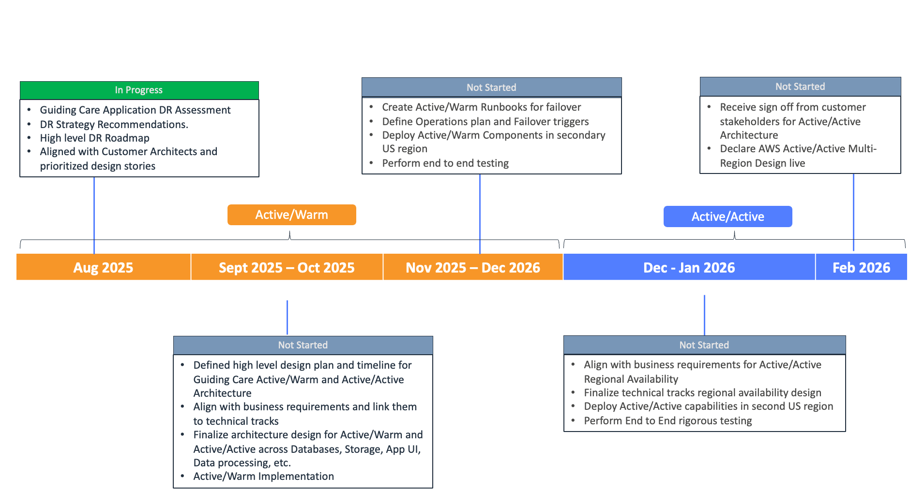

# Guiding Care - DR Roadmap

**Confluence Page:** https://healthedge.atlassian.net/wiki/spaces/CP1/pages/4991058115/Guiding%20Care%20-%20DR%20Roadmap

**Created by:** Venkata Kommuri on August 06, 2025  
**Last modified by:** Venkata Kommuri on August 08, 2025 at 05:26 PM

---

📊 Executive Summary
-------------------

This roadmap outlines the comprehensive implementation of disaster recovery capabilities for the Guiding Care application environment. The plan follows a phased approach with 2-week sprints, ensuring minimal disruption to production operations while establishing robust DR capabilities that meet the 4-hour RTO and 30-minute RPO requirements.

**Health Edge Regional Availability Roadmap**
---------------------------------------------

Timeline Overview
-----------------

* Start Date: August 13, 2025
* End Date: February 15, 2026
* Duration: 26 weeks (13 two-week sprints)
* Target RTO: 4 hours
* Target RPO: 30 minutes
* Primary Region: US-East-\* (Virginia)
* DR Region: US-West-\* (Oregon)

Phase 1: Foundation and Planning (Aug 13 - Sep 23, 2025)
--------------------------------------------------------

### Sprint 1: Project Initiation and AWS Foundation Setup (Aug 13 - Aug 26, 2025)

1. Component: Business Requirements

   * Description: Align with business requirements for Active/Warm and Active/Active Regional Availability
   * DR Strategy: N/A
   * Implementation:

     + Sync with Product Owners
     + Identify Business Requirements and Point of Contact
   * Resource Requirements: Business stakeholders, Project Manager
   * Success Criteria: Documented and approved business requirements
   * Dependencies: None
2. Component: AWS Services Identification

   * Description: Identify AWS services used by assets
   * DR Strategy: N/A
   * Implementation:

     + Review current AWS service usage
     + Provide recommendations for services used by assets
   * Resource Requirements: AWS Solutions Architect
   * Success Criteria: Comprehensive list of AWS services with DR recommendations
   * Dependencies: Business Requirements

### Sprint 2: Core Infrastructure and Active Directory Setup (Aug 27 - Sep 9, 2025)

1. Component: Base Infrastructure / Networking

   * Description: Establish core networking and infrastructure components
   * DR Strategy: Multi-region deployment with redundant connectivity
   * Implementation:

     + Review current network design
     + Define recommendations to update base infrastructure for Active/Warm
     + Implement AWS Transit Gateway with cross-region peering
     + Set up AWS Direct Connect with redundant paths
     + Configure Site-to-Site VPN for backup connectivity
   * Resource Requirements: Network Engineers, AWS Networking Specialists
   * Success Criteria: Functional multi-region network infrastructure with < 100ms latency between regions
   * Dependencies: AWS Services Identification
2. Component: Active Directory

   * Description: Implement DR for Active Directory services
   * DR Strategy: Multi-Region Domain Controllers with hybrid connectivity
   * Implementation:

     + Deploy Windows Server 2022 DCs in both regions
     + Set up AWS Directory Service integration
     + Configure Site-to-Site replication over AWS Direct Connect and VPN
     + Implement DNS integration with Route 53
   * Resource Requirements: Windows Server Admins, AD Specialists
   * Success Criteria: Fully replicated AD infrastructure with < 15-minute replication lag
   * Dependencies: Base Infrastructure / Networking

### Sprint 3: Database Infrastructure and Replication Setup (Sep 10 - Sep 23, 2025)

1. Component: SQL Server

   * Description: Implement DR for critical SQL Server databases
   * DR Strategy: Always On Availability Groups with cross-region replication
   * Implementation:

     + Set up Always On Availability Groups across regions
     + Configure Multi-AZ deployment within each region
     + Implement cross-region read replicas for reporting
     + Set up automated backup strategy with point-in-time recovery
   * Resource Requirements: SQL Server DBAs, AWS Database Specialists
   * Success Criteria: Fully replicated SQL Server infrastructure with RPO < 15 minutes
   * Dependencies: Base Infrastructure / Networking
2. Component: MongoDB

   * Description: Implement DR for MongoDB instances
   * DR Strategy: MongoDB Replica Sets or Amazon DocumentDB with cross-region replication
   * Implementation:

     + Set up MongoDB Replica Sets or Amazon DocumentDB clusters
     + Configure cross-region replica configuration with automated failover
     + Implement AWS Database Migration Service for continuous replication
   * Resource Requirements: MongoDB DBAs, AWS Database Specialists
   * Success Criteria: Fully replicated MongoDB infrastructure with RPO < 30 minutes
   * Dependencies: Base Infrastructure / Networking

Phase 2: Application and Service Migration (Sep 24 - Nov 18, 2025)
------------------------------------------------------------------

### Sprint 4: Application Server Migration and Load Balancing (Sep 24 - Oct 7, 2025)

1. Component: Compute Layer

   * Description: Implement DR for critical and non-critical workloads
   * DR Strategy:

     + Critical: AWS Elastic Disaster Recovery (DRS)
     + Non-critical: AWS Backup with AMI/Snapshots
   * Implementation:

     + Install DRS agents on critical Windows Server 2022 instances
     + Set up AWS Backup jobs for non-critical workloads
     + Configure Auto Scaling Groups for cross-region scaling
   * Resource Requirements: Systems Engineers, AWS Compute Specialists
   * Success Criteria:

     + Critical workloads: RTO < 30 minutes
     + Non-critical workloads: RTO < 4 hours
   * Dependencies: Database Infrastructure
2. Component: Load Balancing

   * Description: Implement multi-region load balancing
   * DR Strategy: Application Load Balancers with AWS Global Accelerator
   * Implementation:

     + Deploy ALBs in both regions with identical configurations
     + Set up AWS Global Accelerator for static IP addresses
     + Configure Route 53 health checks for DNS-based failover
   * Resource Requirements: Network Engineers, AWS Networking Specialists
   * Success Criteria: Automated failover with < 60-second detection time
   * Dependencies: Compute Layer

### Sprint 5: SFTP and File Transfer Services (Oct 8 - Oct 21, 2025)

1. Component: SFTP Server

   * Description: Implement DR for SFTP services
   * DR Strategy: AWS Transfer Family with cross-region replication
   * Implementation:

     + Set up AWS Transfer Family in both regions
     + Configure Amazon S3 integration with cross-region replication
     + Implement user account and SSH key synchronization
   * Resource Requirements: Systems Engineers, AWS Storage Specialists
   * Success Criteria: Fully replicated SFTP infrastructure with RPO < 15 minutes
   * Dependencies: Base Infrastructure / Networking

### Sprint 6: Queue Infrastructure and Messaging (Oct 22 - Nov 4, 2025)

1. Component: Queue DB

   * Description: Implement DR for messaging infrastructure
   * DR Strategy: Amazon SQS and SNS with cross-region replication
   * Implementation:

     + Set up SQS queues with cross-region replication using Lambda
     + Configure SNS topics with cross-region subscriptions
     + Implement Dead Letter Queues for error handling
   * Resource Requirements: Application Developers, AWS Messaging Specialists
   * Success Criteria: Fully replicated queue infrastructure with RPO < 5 minutes
   * Dependencies: Compute Layer

### Sprint 7: Apache Airflow and Workflow Orchestration (Nov 5 - Nov 18, 2025)

1. Component: Apache Airflow

   * Description: Implement DR for ETL and workflow orchestration
   * DR Strategy: Multi-Region Airflow Clusters with active-passive deployment
   * Implementation:

     + Set up Airflow clusters in both regions
     + Configure Amazon RDS for PostgreSQL with cross-region read replicas
     + Implement Amazon EFS for shared storage with cross-region backup
   * Resource Requirements: Data Engineers, AWS Analytics Specialists
   * Success Criteria: Fully replicated Airflow infrastructure with RTO < 30 minutes
   * Dependencies: Queue Infrastructure, Database Infrastructure

Phase 3: DNS, Routing, and Automation (Nov 19 - Dec 30, 2025)
-------------------------------------------------------------

### Sprint 8: Route 53 and DNS Failover (Nov 19 - Dec 2, 2025)

1. Component: Route 53 DNS

   * Description: Implement comprehensive DNS failover and traffic management
   * DR Strategy: Route 53 health checks and failover routing policies
   * Implementation:

     + Set up hosted zones with health check integration
     + Configure failover routing policies for all critical services
     + Implement latency-based routing for optimal performance
   * Resource Requirements: Network Engineers, AWS Networking Specialists
   * Success Criteria: Automated DNS failover with < 60-second detection time
   * Dependencies: Load Balancing

### Sprint 9: AWS Elastic Disaster Recovery (DRS) Implementation (Dec 3 - Dec 16, 2025)

1. Component: Elastic Disaster Recovery

   * Description: Implement continuous replication for critical workloads
   * DR Strategy: AWS Elastic Disaster Recovery (DRS)
   * Implementation:

     + Install and configure DRS agents on all critical servers
     + Set up replication settings and recovery plans
     + Conduct initial replication and testing
   * Resource Requirements: Systems Engineers, AWS DR Specialists
   * Success Criteria: All critical workloads protected with RTO < 15 minutes
   * Dependencies: Compute Layer

### Sprint 10: Backup Strategies and Data Protection (Dec 17 - Dec 30, 2025)

1. Component: Storage Layer

   * Description: Implement comprehensive backup and data protection
   * DR Strategy: AWS Backup with cross-region replication
   * Implementation:

     + Set up AWS Backup plans for all critical data sources
     + Configure cross-region backup copies
     + Implement S3 cross-region replication for object storage
   * Resource Requirements: Storage Engineers, AWS Backup Specialists
   * Success Criteria: All critical data protected with RPO < 1 hour
   * Dependencies: All previous components

Phase 4: Testing, Optimization, and Go-Live (Dec 31, 2025 - Feb 15, 2026)
-------------------------------------------------------------------------

### Sprint 11: Comprehensive DR Testing and Validation (Dec 31, 2025 - Jan 13, 2026)

* Conduct full-scale DR testing across all components
* Validate RTO and RPO achievements
* Identify and address any gaps or issues

### Sprint 12: Monitoring, Alerting, and Operational Procedures (Jan 14 - Jan 27, 2026)

* Implement comprehensive monitoring and alerting
* Develop and document operational procedures
* Conduct training for operations team

### Sprint 13: Go-Live Preparation and Production Cutover (Jan 28 - Feb 15, 2026)

* Finalize all documentation and runbooks
* Conduct final DR rehearsal
* Execute production cutover to new DR infrastructure

Key Milestones
--------------

* ✓ Project Kickoff: August 13, 2025
* ☐ Core Infrastructure Ready: September 23, 2025
* ☐ Application Migration Complete: November 18, 2025
* ☐ DR Automation Implemented: December 30, 2025
* ☐ Comprehensive DR Testing Complete: January 13, 2026
* ☐ Go-Live: February 15, 2026

Critical Path Items
-------------------

1. Base Infrastructure / Networking setup
2. Database Infrastructure replication
3. Compute Layer migration and DRS implementation
4. Route 53 and DNS Failover configuration
5. Comprehensive DR Testing and Validation