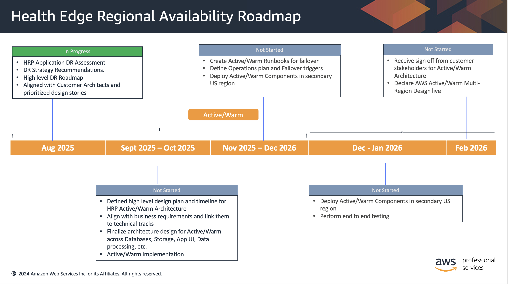

# HRP - DR Roadmap

**Confluence Page:** https://healthedge.atlassian.net/wiki/spaces/CP1/pages/5117804673/HRP%20-%20DR%20Roadmap

**Created by:** Venkata Kommuri on September 23, 2025  
**Last modified by:** Venkata Kommuri on September 23, 2025 at 02:49 PM

---

This roadmap outlines the comprehensive implementation of disaster recovery capabilities for the HRP application environment. The plan follows a phased approach with 2-week sprints, ensuring minimal disruption to production operations while establishing robust DR capabilities that meet the < 4-hour RTO and 30-minute RPO requirements.

