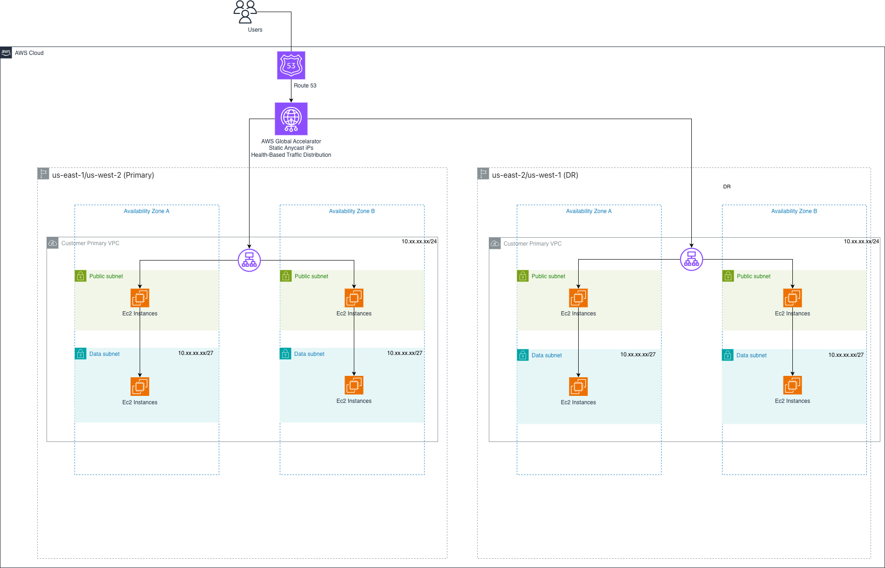

# Guiding Care Application Load Balancer Disaster Recovery Detailed Design

**Confluence Page:** https://healthedge.atlassian.net/wiki/spaces/CP1/pages/5286494354/Guiding%20Care%20Application%20Load%20Balancer%20Disaster%20Recovery%20Detailed%20Design

**Created by:** Venkata Kommuri on December 01, 2025  
**Last modified by:** Chris Falk on December 18, 2025 at 08:14 PM

---

AWS Application Load Balancer (ALB) Complete Disaster Recovery Runbook
======================================================================

**Document Version:** 1.0  
**Last Updated:** November 2025  
**Service:** AWS Application Load Balancer (ALB)  
**Target RTO:** 15 minutes  
**Target RPO:** N/A (network component, no data layer)  
**Primary Regions:** US-East-1 (Virginia), US-West-2 (Oregon)  
**DR Regions:** US-East-2 (Ohio), US-West-1 (N. California)  
**Traffic Management:** Route 53 Health Checks with Failover Routing + AWS Global Accelerator  
**Configuration Management:** Infrastructure as Code (CloudFormation/CDK)

**GUIDING CARE HEALTHCARE ENVIRONMENT - APPLICATION LOAD BALANCING:** This runbook is specifically designed for the Guiding Care healthcare application environment where Application Load Balancers replace the current HA Proxy infrastructure and serve as the critical traffic distribution layer for .NET applications including the Main Guiding Care Portal, Authorization Portal (providers), and Member Portal.

#### ⚠️ IMPORTANT DISCLAIMER - GUIDING CARE CUSTOMIZATION REQUIRED

**All scripts and configurations in this runbook are TEMPLATES and must be customized for Guiding Care-specific requirements before implementation.**

##### Required Guiding Care-Specific Customizations:

* **HA Proxy Migration:** Translate existing HA Proxy ACL rules, custom routing logic, and load balancing algorithms to ALB listener rules
* **Customer Isolation:** Configure per-customer target groups and routing rules to maintain multi-tenant isolation
* **Portal Applications:** Set up separate listener rules for Main Portal, Authorization Portal, and Member Portal with appropriate health checks
* **SSL/TLS Certificates:** Migrate and configure SSL certificates for all customer domains using AWS Certificate Manager
* **Session Persistence:** Configure sticky sessions (session affinity) for applications requiring session state
* **Health Check Configuration:** Define application-specific health check endpoints that validate .NET application health
* **WAF Integration:** Configure AWS WAF rules to replace Cloudflare WAF functionality
* **Network Configuration:** Update VPC IDs, subnet IDs, and security group IDs with Guiding Care-specific network resources
* **Auto Scaling Integration:** Ensure ALB target groups integrate with EC2 Auto Scaling Groups for .NET application servers
* **Monitoring & Alerting:** Configure CloudWatch alarms for ALB metrics specific to healthcare application performance requirements

Application Load Balancer Overview & Architecture
-------------------------------------------------

### Service Overview

AWS Application Load Balancer (ALB) is a fully managed Layer 7 load balancing service that distributes incoming application traffic across multiple targets (EC2 instances, containers, IP addresses) in multiple Availability Zones. For Guiding Care, ALB replaces the current HA Proxy infrastructure with AWS-native, highly available load balancing capabilities.

### Key Features for Guiding Care

* **Advanced Routing:** Path-based, host-based, HTTP header, and query string routing to replace HA Proxy ACL rules
* **SSL/TLS Termination:** Centralized certificate management with automatic renewal via AWS Certificate Manager
* **Sticky Sessions:** Session affinity for .NET applications requiring session state
* **Health Checks:** Sophisticated health monitoring with custom endpoints and response validation
* **Multi-AZ High Availability:** Automatic distribution across Availability Zones within a region
* **Integration with Auto Scaling:** Automatic target registration/deregistration
* **AWS WAF Integration:** Application-layer security and DDoS protection
* **Access Logs:** Detailed request logging for compliance and troubleshooting

3. Multi-Region ALB Architecture
--------------------------------

### 3.1 High-Level Architecture Diagram

### Regional Deployment Strategy

| Region | Role | Traffic Distribution | Status | Failover Target |
| --- | --- | --- | --- | --- |
| US-East-1 (Virginia) | Primary | ~75% (East Coast customers) | Active | US-East-2 (Ohio) |
| US-West-2 (Oregon) | Primary | ~25% (West Coast customers) | Active | US-West-1 (N. California) |
| US-East-2 (Ohio) | DR | 0% (standby) | Warm Standby | N/A (receives failover from US-East-1) |
| US-West-1 (N. California) | DR | 0% (standby) | Warm Standby | N/A (receives failover from US-West-2) |

### Traffic Flow During Normal Operations

1. **User Request:** Application accesses url
2. **DNS Resolution:** Route 53 resolves to Global Accelerator static IPs or regional ALB DNS
3. **Global Accelerator:** Routes traffic to nearest healthy region based on health checks
4. **ALB Listener:** Receives HTTPS request on port 443, terminates SSL
5. **Listener Rules:** Evaluates routing rules (path, host, headers) to determine target group
6. **Target Group:** Selects healthy EC2 instance using round-robin or least outstanding requests
7. **Health Check:** Only routes to instances passing health checks
8. **Sticky Session:** If enabled, routes subsequent requests from same user to same instance
9. **Response:** Application response flows back through ALB to user
10. **Logging:** Request details logged to S3 and CloudWatch for compliance

### Traffic Flow During DR Failover

1. **Failure Detection:** Route 53 health checks detect primary region ALB failure (3 consecutive failures)
2. **DNS Update:** Route 53 automatically updates DNS to point to DR region ALB (within 60 seconds)
3. **Global Accelerator Failover:** Automatically routes traffic to healthy DR region
4. **DR ALB Activation:** DR region ALB receives traffic, already configured and ready
5. **Target Scaling:** Auto Scaling Groups in DR region scale up to handle full load
6. **Session Recovery:** Users may need to re-authenticate (sessions stored in ElastiCache replicated to DR)
7. **Monitoring:** CloudWatch alarms notify operations team of failover event
8. **Validation:** Automated tests verify application functionality in DR region

### Replicate Certificates to All Regions

**Important:** ACM certificates are region-specific. You must request or import certificates in each region where you deploy ALBs.

### Replicate Target Groups to All Regions

**Note:** Target groups must be created in each region with identical configurations.

AWS Global Accelerator Configuration
------------------------------------

### Create Endpoint Groups for Each Region

### Global Accelerator Failover Behavior

**Automatic Failover:** Global Accelerator continuously monitors endpoint health. When an endpoint becomes unhealthy:

* Traffic is automatically rerouted to healthy endpoints within 30 seconds
* No DNS propagation delay (uses static anycast IPs)
* Client connections are preserved during failover
* Failback occurs automatically when primary endpoint becomes healthy

Failover Procedures
-------------------

### Manual Failover Procedure

#### When to Use Manual Failover:

* Planned maintenance in primary region
* Anticipated regional issues (weather, AWS service events)
* Testing DR capabilities
* Primary region degraded but not completely failed

#### Step 1: Verify DR Region Readiness

#### Step 2: Scale Up DR Region Resources

#### Step 3: Update Route 53 DNS Records

#### Step 4: Verify Failover Success

18. Failback Procedures
-----------------------

### 18.1 Failback Planning

**Failback Considerations:**

* Verify primary region is fully operational and stable
* Ensure all data is synchronized between regions
* Plan failback during low-traffic period (e.g., 2-4 AM ET)
* Communicate failback schedule to stakeholders
* Have rollback plan ready in case failback encounters issues

### Pre-Failback Verification

### Execute Failback

### Post-Failback Actions

#### Post-Failback Checklist

1. **Monitor Primary Region:** Watch CloudWatch metrics for 2-4 hours to ensure stability
2. **Scale Down DR Region:** Reduce DR region Auto Scaling Groups to minimum capacity
3. **Verify All Services:** Test all portal endpoints and customer integrations
4. **Review Logs:** Analyze ALB access logs and application logs for any issues
5. **Update Documentation:** Document any lessons learned or issues encountered
6. **Notify Stakeholders:** Send completion notification to all stakeholders
7. **Schedule Post-Mortem:** If failover was due to incident, schedule review meeting