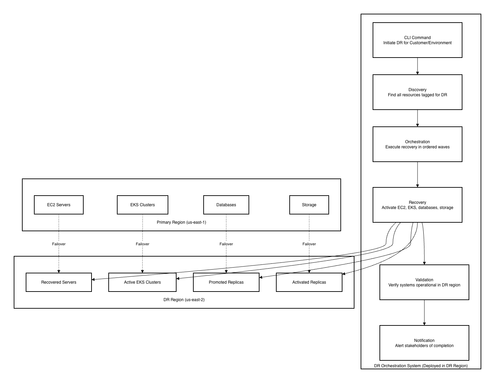

# Guiding Care DR Architecture - Executive Summary

**Confluence Page:** https://healthedge.atlassian.net/wiki/spaces/CP1/pages/5326635053/Guiding%20Care%20DR%20Architecture%20-%20Executive%20Summary

**Created by:** Chris Falk on December 09, 2025  
**Last modified by:** Chris Falk on December 19, 2025 at 03:24 PM

---

System Architecture - Executive Summary
=======================================

Guiding Care Disaster Recovery Orchestration
--------------------------------------------

**Document Version**: 1.0   
**Date**: December 6, 2025   
**Project**: gc-dr-implementation   
**Reading Time**: 8-10 minutes

---

Purpose of This Document
------------------------

This executive summary provides a high-level overview of the Guiding Care Disaster Recovery (DR) orchestration solution architecture. It's designed for technical leaders who need to understand the solution approach, key capabilities, and business value without deep technical implementation details.

---

Business Problem
----------------

Guiding Care operates a healthcare application serving 20+ customer environments with approximately 1,000 servers. The current infrastructure lacks automated disaster recovery orchestration, creating risks:

* **Manual Recovery Processes**: Time-consuming, error-prone manual procedures during outages
* **Extended Downtime**: Potential for multi-hour outages affecting patient care systems
* **Compliance Risk**: Healthcare regulations require documented DR capabilities
* **Multi-Tenant Complexity**: Need to recover specific customer environments independently
* **Scale Challenge**: Coordinating recovery of 1,000+ servers across multiple AWS accounts and regions

**Business Impact**: Without automated DR orchestration, a regional outage could result in 8+ hours of downtime, affecting patient care and violating contractual SLAs.

---

Solution Overview
-----------------

The DR orchestration solution provides **automated, tag-driven disaster recovery** that can recover the entire Guiding Care infrastructure or specific customer environments within 4 hours, meeting contractual requirements.

### Key Capabilities

1. **Automated Orchestration**: Push-button disaster recovery activation via command-line interface
2. **Customer-Scoped Recovery**: Recover specific customer environments independently
3. **Wave-Based Execution**: Ordered recovery in waves (critical systems first, then supporting systems)
4. **Multi-Service Support**: Handles EC2 servers, Kubernetes clusters, databases, and storage
5. **Isolated Testing**: "Bubble test" capability to validate DR without affecting production
6. **Primary Region Resilience**: Can activate DR even when primary AWS region is completely unavailable

### Solution Architecture at a Glance



How It Works
------------

### 1. Tag-Driven Resource Discovery

**What It Does**: Automatically discovers all resources that need DR protection using AWS tags

**How It Works**:

* Resources are tagged with `dr:enabled=true` to indicate DR protection
* Additional tags specify recovery priority, wave number, and recovery method
* System queries AWS to find all tagged resources across accounts and regions
* No manual inventory maintenance required

**Business Value**: Infrastructure changes automatically reflected in DR plans without manual updates

### 2. Customer/Environment Scoping

**What It Does**: Enables targeted recovery of specific customer environments

**How It Works**:

* Each resource tagged with `Customer` and `Environment` identifiers
* DR activation specifies which customer/environment to recover
* System filters resources to only recover specified scope

**Business Value**:

* Recover single customer environment without affecting others
* Supports multi-tenant operations
* Enables customer-specific DR testing

**Example**:


```bash
# Recover only Customer A's production environment
aws stepfunctions start-execution \
  --input '{"Customer": "customer-a", "Environment": "production", "Operation": "failover"}'
```


### 3. Wave-Based Recovery Orchestration

**What It Does**: Recovers systems in ordered waves based on dependencies

**How It Works**:

* Resources assigned to waves (1, 2, 3, etc.) based on recovery priority
* Wave 1: Critical infrastructure (Active Directory, databases)
* Wave 2: Application servers
* Wave 3: Supporting services
* Each wave completes before next wave starts
* Within each wave, resources recover in parallel for speed

**Business Value**:

* Ensures dependencies are available before dependent systems start
* Maximizes recovery speed through parallelization
* Reduces recovery errors from missing dependencies

**Recovery Timeline Example**:


```
Wave 1 (0-15 min):   Critical infrastructure
Wave 2 (15-30 min):  Application servers
Wave 3 (30-60 min):  Supporting services
Wave 4 (60-240 min): Non-critical systems
```


### 4. Multi-Service Recovery

**What It Does**: Handles different types of infrastructure with appropriate recovery methods

**Recovery Methods**:

| Service Type | Recovery Method | Recovery Time |
| --- | --- | --- |
| **EC2 Servers** | AWS DRS (Disaster Recovery Service) | 15-30 minutes |
| **EKS Clusters** | DNS failover to DR cluster | 5 minutes |
| **SQL Server** | Always On Availability Group failover | 10 minutes |
| **Storage (EFS/FSx)** | Activate cross-region replicas | 5 minutes |
| **Load Balancers** | Route 53 DNS failover | 5 minutes |

**Business Value**: Single orchestration system handles all infrastructure types

### 5. Bubble Test Capability

**What It Does**: Validates DR capabilities without affecting production systems

**How It Works**:

* Creates isolated test environment in DR region
* Clones Active Directory controllers for complete isolation
* Recovers test copies of production systems
* Validates application functionality
* Automatically cleans up test resources

**Business Value**:

* Quarterly DR validation without production impact
* Builds confidence in DR procedures
* Identifies issues before real disasters
* Supports compliance requirements for DR testing

### 6. Primary Region Resilience

**What It Does**: Enables DR activation even when primary AWS region is completely unavailable

**How It Works**:

* DR orchestration system deployed in DR region (not primary)
* Maintains cached inventory of resources (refreshed every 15 minutes)
* Can activate DR using cached inventory if primary region APIs unavailable
* Eliminates dependency on primary region for DR activation

**Business Value**:

* DR system survives complete primary region failures
* Meets requirement for DR activation during worst-case scenarios
* Provides confidence in DR capabilities during regional outages

---

Key Design Decisions
--------------------

### 1. Tag-Driven vs. Manifest-Driven

**Decision**: Use AWS tags for resource discovery instead of static configuration files

**Rationale**:

* Infrastructure changes automatically reflected in DR plans
* No manual inventory maintenance
* Supports dynamic multi-tenant environments
* Reduces operational overhead

**Trade-off**: Requires tag governance and validation

### 2. CLI-Only Operation (No Web UI)

**Decision**: Provide command-line interface for DR activation, no web console

**Rationale**:

* Simpler implementation (12-week timeline)
* Reduces infrastructure complexity
* Suitable for operations team workflows
* Architecture supports future UI addition without changes

**Trade-off**: Less user-friendly than web UI, but acceptable for trained operators

### 3. Pre-Provisioned DR Instances

**Decision**: Pre-provision EC2 instances in DR region with specific IP addresses

**Rationale**:

* Preserves IP address last octet (hard requirement for application compatibility)
* Reduces recovery time (instances already exist)
* Optimizes costs (stopped instances have minimal charges)
* Ensures instance availability during recovery

**Trade-off**: Requires upfront provisioning and management of DR instances

### 4. DR System in DR Region

**Decision**: Deploy orchestration infrastructure in DR region, not primary region

**Rationale**:

* Survives complete primary region failures
* Enables DR activation when primary region unavailable
* Eliminates single point of failure

**Trade-off**: Slightly more complex deployment, but critical for resilience

---

Recovery Time and Recovery Point Objectives
-------------------------------------------

### Recovery Time Objective (RTO)

**Overall System RTO**: 4 hours (contractual requirement)

**Wave-Based RTO**:

* Wave 1 (Critical): 15 minutes
* Wave 2 (High Priority): 30 minutes
* Wave 3 (Medium Priority): 1 hour
* Wave 4+ (Low Priority): 4 hours

**RTO Achievement Strategy**:

* Parallel execution within waves
* Pre-provisioned DR infrastructure
* Automated orchestration (no manual steps)
* Continuous replication (no data copying during recovery)

### Recovery Point Objective (RPO)

**RPO Targets**:

* EC2 Servers (DRS): 15 minutes
* SQL Server Always On: 15 minutes
* EFS Storage: 15 minutes
* FSx Storage: 15 minutes

**RPO Achievement Strategy**:

* Continuous replication to DR region
* Asynchronous replication for performance
* Monitoring and alerting for replication lag

---

Security and Compliance
-----------------------

### Healthcare Compliance Approach

**Technical Security Controls Implemented**:

* Encryption at rest and in transit for all data
* Least privilege access controls (IAM roles)
* Complete audit logging (CloudTrail, CloudWatch)
* Network isolation (VPCs, security groups)
* Automated backup validation
* Regular DR testing and validation

**Important Note**: These technical controls support HIPAA/HITRUST compliance requirements. Your legal team must assess whether the implementation meets your specific compliance obligations. AWS does not provide legal advice or compliance determinations.

### Security Architecture

**Cross-Account Access**:

* DR orchestration account assumes roles in workload accounts
* Least privilege permissions per service
* Time-limited role sessions (1 hour)
* All access logged and auditable

**Data Protection**:

* All replication encrypted in transit (TLS 1.2+)
* All storage encrypted at rest (AWS KMS)
* Customer-managed encryption keys supported
* Cross-region key replication for DR regions

**Network Security**:

* DR orchestration functions in VPC
* VPC endpoints for AWS service access
* Security groups restrict traffic to required services
* No public internet exposure for orchestration

---

Operational Procedures
----------------------

### Failover Procedure (Primary → DR)

**Trigger**: Primary region outage or planned failover

**Steps**:

1. Validate DR readiness (replication status, DR system health)
2. Execute CLI command specifying customer/environment
3. Monitor orchestration progress (Step Functions console)
4. Approve wave transitions (if approval mode enabled)
5. Validate application functionality in DR region
6. Notify stakeholders of completion

**Duration**: 30 minutes to 4 hours depending on scope and wave assignments

**Automation Level**: Fully automated after CLI command execution

### Failback Procedure (DR → Primary)

**Trigger**: Primary region recovered and validated

**Steps**:

1. Validate primary region recovery
2. Execute failback CLI command
3. Monitor reverse replication and recovery
4. Validate application functionality in primary region
5. Update DNS to primary region
6. Notify stakeholders of completion

**Duration**: Similar to failover (30 minutes to 4 hours)

### Bubble Test Procedure

**Trigger**: Quarterly DR validation or on-demand testing

**Steps**:

1. Execute bubble test CLI command
2. System creates isolated test environment
3. Clones Active Directory for complete isolation
4. Recovers test copies of systems
5. Validate application functionality
6. Automatic cleanup of test resources

**Duration**: 2-4 hours including validation

**Impact**: Zero impact on production systems

---

Technology Stack
----------------

### Core AWS Services

| Service | Purpose | Why Selected |
| --- | --- | --- |
| **AWS Step Functions** | Orchestration workflows | Reliable, auditable, built-in error handling |
| **AWS Lambda** | Serverless compute | Event-driven, scales automatically, cost-effective |
| **AWS DRS** | EC2 disaster recovery | Near-zero RPO, fast RTO, AWS-native |
| **Amazon EKS** | Container orchestration | Existing customer infrastructure |
| **AWS Systems Manager** | Automation runbooks | Pre/post-wave validation, SQL Server orchestration |
| **Amazon Route 53** | DNS failover | Health checks, automatic failover routing |
| **Amazon CloudWatch** | Monitoring & logging | Dashboards, alarms, audit trail |

### Development Approach

**Infrastructure as Code**: AWS CDK (Python)

* Repeatable deployments
* Version controlled infrastructure
* Consistent across environments

**Testing Strategy**:

* Unit tests for all Lambda functions
* Integration tests for cross-service interactions
* End-to-end bubble tests for complete workflows
* Performance testing with 1,000 servers

---

Implementation Timeline
-----------------------

### 12-Week Implementation Plan

**Phase 1: Foundation (Weeks 1-2)**

* Deploy cross-account IAM roles
* Configure resource discovery
* Implement customer/environment scoping

**Phase 2: DRS Integration (Weeks 3-4)**

* Implement EC2 recovery with DRS
* Configure pre-provisioned instances
* Build observability dashboards

**Phase 3: EKS and Managed Services (Weeks 5-7)**

* Extend EKS infrastructure to DR regions
* Implement DNS failover
* Configure SQL Server and storage replication

**Phase 4: Orchestration (Weeks 8-9)**

* Implement Step Functions workflows
* Build pre/post-wave automation
* Configure approval gates

**Phase 5: Testing (Weeks 10-11)**

* Comprehensive bubble testing
* Performance and scalability testing
* Customer-specific validation

**Phase 6: Operational Readiness (Week 12)**

* Documentation and runbooks
* Knowledge transfer and training
* Production deployment
* Post-deployment validation

---

Risks and Mitigation
--------------------

### Technical Risks

| Risk | Severity | Mitigation |
| --- | --- | --- |
| **DRS API Rate Limits** | Medium | Request limit increase, implement backoff, stagger recovery |
| **EKS DNS Failover Complexity** | High | Comprehensive testing, DNS validation, troubleshooting docs |
| **Primary Region API Unavailability** | High | Deploy orchestration in DR region, cached inventory |
| **Cross-Account Access Failures** | High | Validate roles during deployment, comprehensive error handling |

### Operational Risks

| Risk | Severity | Mitigation |
| --- | --- | --- |
| **Tag Governance** | Medium | AWS Config rules, automated validation, regular audits |
| **Approval Gate Delays** | Low | Clear procedures, multiple approvers, timeout escalation |

---

Cost Considerations
-------------------

### DR Infrastructure Costs

**Ongoing Costs**:

* **DRS Replication**: ~$0.05/hour per server (~$36/month per server)
* **Pre-Provisioned Instances**: Minimal (stopped instances, EBS storage only)
* **DR EKS Clusters**: ~$0.10/hour per cluster (~$72/month per cluster)
* **Storage Replication**: Varies by data volume and replication frequency
* **Orchestration Infrastructure**: ~$50-100/month (Lambda, Step Functions, CloudWatch)

**Estimated Monthly Cost** (1,000 servers, 20 customers):

* DRS: $36,000/month
* EKS: $1,440/month (20 clusters)
* Storage: $5,000-10,000/month (estimated)
* Orchestration: $100/month
* **Total**: ~$42,500-47,500/month

**Cost Optimization**:

* Pre-provisioned instances reduce recovery time without significant cost
* Stopped instances only charged for EBS storage
* Serverless orchestration (pay per execution)
* No idle compute resources

### Bubble Test Costs

**Per Test Cost**: $5-20 depending on scope

* Cloned AD controllers: ~$0.16/hour (2 x t3.medium)
* Test instances: Varies by test scope
* DRS drill mode: Free (no additional charges)
* Typical test duration: 2-4 hours

---

Success Criteria
----------------

### Technical Success Criteria

* ✅ Achieve 4-hour RTO for complete system recovery
* ✅ Achieve 15-minute RPO for critical workloads
* ✅ Support 1,000+ servers across 20+ customer environments
* ✅ Enable customer-scoped recovery operations
* ✅ Support DR activation during primary region outages
* ✅ Pass quarterly bubble test validations

### Business Success Criteria

* ✅ Reduce manual DR procedures from days to hours
* ✅ Meet contractual SLA requirements for DR
* ✅ Support healthcare compliance requirements
* ✅ Enable confident DR testing without production impact
* ✅ Provide audit trail for compliance validation

---

Next Steps
----------

### Immediate Actions

1. **Architecture Review**: Validate architecture with technical stakeholders
2. **Budget Approval**: Confirm budget for implementation and ongoing costs
3. **Resource Allocation**: Assign development team and timeline
4. **Stakeholder Alignment**: Ensure operations team prepared for new procedures

### Implementation Readiness

**Prerequisites**:

* AWS accounts and permissions configured
* Development team allocated (2-3 engineers)
* 12-week timeline approved
* Budget approved (~$42,500-47,500/month ongoing)

**Deliverables**:

* Production-ready DR orchestration system
* Comprehensive documentation and runbooks
* Trained operations team
* Validated bubble test procedures
* Quarterly DR testing schedule

---

Conclusion
----------

The Guiding Care DR orchestration solution provides **automated, reliable disaster recovery** that meets contractual requirements and supports healthcare compliance needs. The tag-driven, multi-tenant architecture enables flexible operations while maintaining simplicity.

### Key Benefits

1. **Automated Recovery**: Push-button DR activation reduces recovery time from days to hours
2. **Customer Flexibility**: Recover specific customer environments independently
3. **Resilient Design**: DR system survives primary region failures
4. **Confident Testing**: Bubble tests validate DR without production impact
5. **Compliance Ready**: Technical controls support healthcare compliance requirements
6. **Cost Optimized**: Efficient use of AWS services minimizes ongoing costs