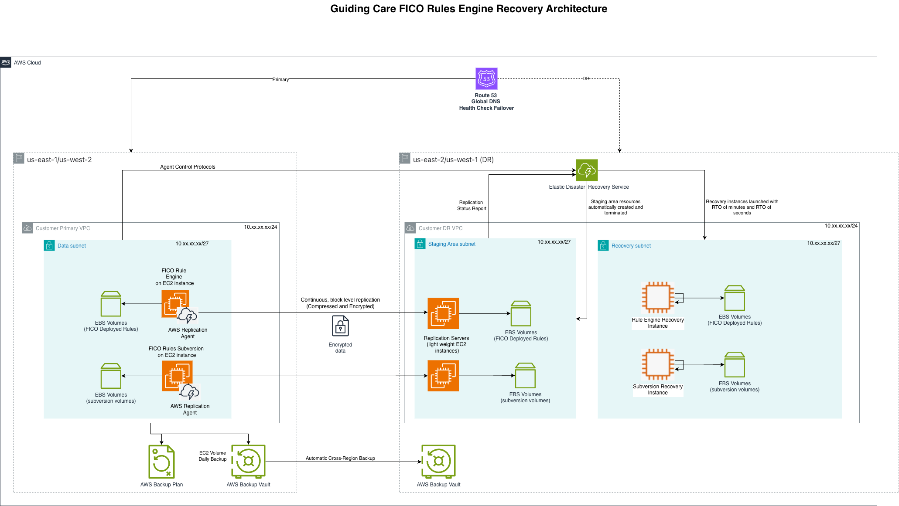

# Guiding Care FICO Rule Engine Disaster Recovery Design

**Confluence Page:** https://healthedge.atlassian.net/wiki/spaces/CP1/pages/5306482876/Guiding%20Care%20FICO%20Rule%20Engine%20Disaster%20Recovery%20Design

**Created by:** Venkata Kommuri on December 04, 2025  
**Last modified by:** Chris Falk on December 18, 2025 at 08:16 PM

---

AWS Elastic Disaster Recovery (DRS) for FICO Rules Engine on Linux EC2 Complete Implementation Runbook
======================================================================================================

**Document Version:** 1.0  
**Last Updated:** November 2025  
**Service:** AWS Elastic Disaster Recovery (DRS)  
**Application:** FICO Blaze Rules Engine (Java-based) on Linux EC2  
**Target RTO:** 4 hours | **Target RPO:** 15 minutes  
**Primary Regions:** US-East-1 (Virginia), US-West-2 (Oregon)  
**DR Regions:** US-East-2 (Ohio), US-West-1 (N. California)  
**Replication Method:** AWS DRS continuous block-level replication

**⚠️ CRITICAL - FICO RULES ENGINE TRANSITION:** This runbook covers disaster recovery for the LEGACY FICO Blaze Rules Engine currently deployed on Linux VMs. Guiding Care is transitioning to a custom Java-based rules engine by year-end 2025. This DR strategy applies to FICO during the transition period and can be adapted for the new custom rules engine deployment.

#### ⚠️ IMPORTANT - MATCH ON-PREMISES CONFIGURATION

**All instance sizing, storage configuration, and software installation must match your on-premises FICO Rules Engine deployment.**

1. FICO Rules Engine + AWS DRS Overview
---------------------------------------

### 1.1 Solution Overview

This runbook implements disaster recovery for the **FICO Blaze Rules Engine** deployed on Linux EC2 instances using AWS Elastic Disaster Recovery (DRS).

#### Key Characteristics:

* **Third-Party Rules Engine:** FICO Blaze Advisor for business rules processing
* **Java-Based Application:** Runs on JVM with Linux OS
* **Subversion Version Control:** Rules stored in Subversion repositories (not database)
* **RMA Integration:** Some customers use Rule Management Application (RMA)
* **Eclipse Plugin:** GPS organization uses FICO Blaze Eclipse plugin for rule development
* **Infrastructure DR:** AWS DRS replicates entire server (OS + FICO + rules + Subversion)
* **Block-Level Replication:** Continuous replication of all EBS volumes
* **RPO: 30 minutes** - Point-in-time recovery with continuous replication
* **RTO: 4 hours** - Automated recovery to DR region
* **Read-Only Replica Integration:** FICO jobs utilize SQL Server read-only replicas

### 1.2 FICO Rules Engine in Guiding Care Architecture

| Component | Description | Current State | DR Requirement |
| --- | --- | --- | --- |
| FICO Blaze Engine | Third-party rules execution engine | Production - being replaced | Critical - 4 hour RTO |
| Rule Repository (Subversion) | Version control for business rules | Subversion-based storage | Critical - must replicate |
| RMA (Rule Management App) | UI for rule management (some customers) | Customer-managed rules | Important - 4 hour RTO |
| Eclipse Plugin | FICO Blaze development environment | GPS organization usage | Development tool - lower priority |
| Custom Rules Engine | New Java-based replacement | 6 clients in production | Future - same DR strategy |
| Rules Designer UI | New custom UI for rule management | GPS org started using (2 weeks ago) | Future - web application DR |

2. Architecture & Design Rationale
----------------------------------

#### FICO Rules Engine with AWS DRS Architecture




```

│                                                                                                         │
│  DRS REPLICATION FLOW:                               RECOVERY FLOW:                                    │
│  1. DRS Agent captures all disk I/O                  1. Initiate recovery from DRS console            │
│  2. Block-level replication to DR region             2. DRS launches recovery instance                │
│  3. Continuous replication (RPO: 15 min)             3. All EBS volumes attached/mounted              │
│  4. Point-in-time recovery snapshots                 4. FICO service starts automatically             │
│  5. Encrypted replication over AWS network           5. Subversion repositories available                    │
│  6. Low-cost staging instance in DR                  6. Update  DNS                           │
│  7. Includes OS, FICO, Subversion, and all configs   7. Update SQL connection strings                 │
│  8. Subversion repository continuously replicated    8. Applications reconnect via DNS                │
│                                                      9. Verify rule execution                         │
│                                                                                                         │
│  RULE MANAGEMENT WORKFLOW:                           VERSION CONTROL STRATEGY:                         │
│  1. Developers commit rules to Subversion            1. Subversion repository on FICO server                 │
│  2. Version tagging for deployments                  2. DRS replicates entire Subversion history             │
│  3. FICO loads rules from Subversion                 3. Remote Subversion backup (optional)                  │
│  4. Rules executed via API calls                     4. Post-recovery: verify Subversion integrity           │
│  5. Results returned to application                  5. Resume rule development post-failover         │
│                                                                                                         │
└─────────────────────────────────────────────────────────────────────────────────────────────────────────┘
            
```


DRS Service Setup & Configure And Monitor
-----------------------------------------

#### Please refer to AWS DRS Service for EC2 document : AWS Disaster Recovery Service Setup for EC2

Failover Procedures
-------------------

### Pre-Failover Checklist

#### Pre-Failover Checklist:

* ☐ Confirm primary region is truly unavailable
* ☐ Verify DRS replication is up-to-date (check lag)
* ☐ Notify all stakeholders of impending failover
* ☐ Verify DR region resources are available
* ☐ Confirm SQL Server DR is ready
* ☐ Verify network connectivity to DR region
* ☐ Prepare to update DNS records
* ☐ Have rollback plan ready
* ☐ Document current state and time
* ☐ Get approval from incident commander

### Initiate Production Failover

### Update DNS for Failover

### Post-Failover Validation

Failback Procedures
-------------------

### Failback Planning

### Sync Subversion Repository from DR to Primary

### Initiate Failback to Primary

### Update DNS for Failback