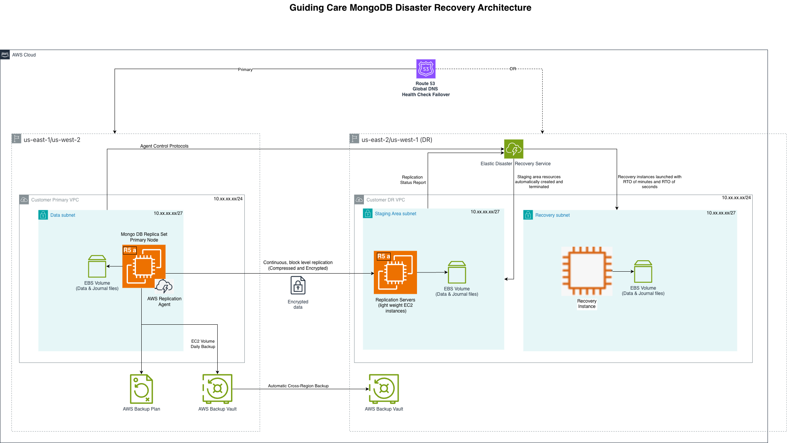

# Guiding Care MongoDB Cross-Region Replication DR Architecture

**Confluence Page:** https://healthedge.atlassian.net/wiki/spaces/CP1/pages/5217878029/Guiding%20Care%20MongoDB%20Cross-Region%20Replication%20DR%20Architecture

**Created by:** Venkata Kommuri on November 10, 2025  
**Last modified by:** Chris Falk on December 18, 2025 at 08:09 PM

---

AWS Elastic Disaster Recovery (DRS) for Single MongoDB Instance Complete Implementation Runbook
===============================================================================================

**Document Version:** 2.0  
**Last Updated:** November 2025  
**Service:** AWS Elastic Disaster Recovery (DRS)  
**Database:** MongoDB 5.0/6.0/7.0 on EC2 (Standalone Instance)  
**Target RTO:** 4 hours | **Target RPO:** 15 minutes  
**Primary Regions:** US-East-1 (Virginia), US-West-2 (Oregon)  
**DR Regions:** US-East-2 (Ohio), US-West-1 (N. California)  
**Replication Method:** AWS DRS continuous block-level replication (NO MongoDB native replication)

**SINGLE INSTANCE ARCHITECTURE:** Based on the review feedback from the Guiding Care team, this runbook is proposed to implement disaster recovery for a SINGLE standalone MongoDB instance using AWS DRS. NO MongoDB replica sets are configured. All high availability and disaster recovery is provided by AWS DRS infrastructure-level replication. This approach is optimized for non-critical ETL workloads where 4-hour RTO and 15-minute RPO are acceptable.

#### ⚠️ IMPORTANT - MATCH ON-PREMISES CONFIGURATION

**All instance sizing, storage configuration, and software installation must match your on-premises MongoDB deployment.**

##### Configuration Matching Requirements:

* **Instance Sizing:** Match CPU cores, RAM, and network bandwidth to on-premises servers
* **Storage Configuration:** Match disk sizes, IOPS, and throughput to on-premises storage
* **MongoDB Version:** Use the exact same MongoDB version as on-premises (5.0, 6.0, or 7.0)
* **Operating System:** Match OS version (Ubuntu 20.04/22.04 or Amazon Linux 2/2023)
* **Data Volume:** Provision storage to match current data size plus 50% growth capacity
* **Software Configuration:** Replicate mongod.conf settings, security configurations, and user permissions

Table of Contents
-----------------

* [1. Single MongoDB Instance + AWS DRS Overview](#)
* [2. Architecture & Design Rationale](#)
* [3. Instance Sizing & Storage Configuration](#)
* [4. MongoDB Installation (Standalone Mode)](#)
* [5. Prerequisites & Planning](#)
* [6. DRS Service Setup](#)
* [7. DRS Agent Installation](#)
* [8. Replication Configuration](#)
* [9. Launch Templates & Recovery Configuration](#)
* [10. Testing & Validation](#)
* [11. Failover Procedures](#)
* [12. Failback Procedures](#)
* [13. Monitoring & Alerting](#)
* [14. Troubleshooting Guide](#)
* [15. Best Practices](#)

1. Single MongoDB Instance + AWS DRS Overview
---------------------------------------------

### 1.1 Solution Overview

This runbook implements disaster recovery for a **single standalone MongoDB instance** using AWS Elastic Disaster Recovery (DRS). Unlike traditional MongoDB high availability solutions that use replica sets, this approach leverages infrastructure-level replication to provide disaster recovery capabilities.

#### Key Characteristics:

* **Single Instance:** One MongoDB server in primary region (no replica sets)
* **Infrastructure DR:** AWS DRS replicates entire server (OS + MongoDB + data)
* **Block-Level Replication:** Continuous replication of all EBS volumes
* **RPO: 15 minutes** - Point-in-time recovery with 10-minute snapshots
* **RTO: 4 hours** - Automated recovery to DR region
* **Cost-Effective:** Only pay for low-cost staging instance in DR region (~$50/month)
* **Simplified Operations:** No MongoDB replica set management required

### 1.2 Why Single Instance + AWS DRS?

| Aspect | Single Instance + AWS DRS | MongoDB Replica Sets |
| --- | --- | --- |
| Architecture | Simple - one MongoDB instance | Complex - 3+ nodes, elections, sync |
| Cost | 1 production + 1 staging | 3+ production instances 24/7 |
| Operational Overhead | Minimal - DRS handles replication | High - manage replica set, monitor lag |
| DR Scope | Entire server (OS + MongoDB + data) | Only MongoDB data |
| RPO | 30 minutes | Near-zero |
| RTO | 4 hours | Minutes |
| Best For | Non-critical ETL workloads | Mission-critical transactional databases |

#### Ideal Use Cases for Single Instance + DRS:

* ETL processing and data transformation workloads
* Temporary data storage and staging databases
* Development and testing environments
* Applications where 4-hour RTO is acceptable
* Cost-sensitive deployments
* Simplified operational requirements

2. Architecture & Design Rationale
----------------------------------

#### Single MongoDB Instance with AWS DRS Architecture



### 2.1 Design Rationale

#### Why This Architecture?

* **Simplified Architecture:** No need to manage MongoDB replica set complexity (elections, sync, lag monitoring)
* **Infrastructure-Level DR:** DRS replicates entire server state including OS, MongoDB binaries, configuration files, and all data
* **Application-Agnostic:** Works with any MongoDB version or configuration without MongoDB-specific setup
* **Cost Optimization:** Significant savings compared to running 3+ MongoDB instances continuously
* **Consistent Recovery:** Entire server state is replicated, ensuring configuration consistency
* **Lower Operational Complexity:** No MongoDB DBA expertise required for DR management
* **Crash-Consistent Recovery:** MongoDB's journaling ensures data consistency after recovery

### 2.2 Cost Comparison

3. Instance Sizing & Storage Configuration
------------------------------------------

### 3.1 Match On-Premises Configuration

#### ⚠️ CRITICAL: Match Your On-Premises Environment

The following are EXAMPLE configurations. You MUST adjust these to match your actual on-premises MongoDB deployment:

* CPU cores and clock speed
* RAM capacity
* Storage capacity and IOPS
* Network bandwidth requirements
* MongoDB version and edition

### 3.2 Instance Sizing Guidelines

Below Instance sizings are for recommendations only

| On-Premises Specs | AWS Instance Type | vCPU | Memory | Network | Use Case |
| --- | --- | --- | --- | --- | --- |
| 4 cores, 32GB RAM | r5.xlarge | 4 | 32 GB | Up to 10 Gbps | Small datasets (100-300GB) |
| 8 cores, 64GB RAM | r5.2xlarge | 8 | 64 GB | Up to 10 Gbps | Medium datasets (300-700GB) |
| 16 cores, 128GB RAM | r5.4xlarge | 16 | 128 GB | Up to 10 Gbps | Large datasets (700GB-1.5TB) |
| 32 cores, 256GB RAM | r5.8xlarge | 32 | 256 GB | 10 Gbps | Very large datasets (1.5TB+) |

### 3.3 Storage Configuration

#### Four-Volume Configuration (Recommended)

Separate volumes for different MongoDB components provide better performance and easier management:   
Please match current on premises configuration if required.

| Volume | Device | Mount Point | Size (Example) | Type | IOPS | Purpose |
| --- | --- | --- | --- | --- | --- | --- |
| OS Volume | /dev/sda1 | / | 100 GB | gp3 | 3,000 | Operating system and MongoDB binaries |
| Data Volume | /dev/sdf | /data/mongodb | Match on-prem + 50% | io2 | Match on-prem | MongoDB data files (WiredTiger) |
| Log Volume | /dev/sdg | /var/log/mongodb | 100-200 GB | gp3 | 3,000 | MongoDB logs |
| Journal Volume | /dev/sdh | /data/mongodb/journal | 50 GB | io2 | 16,000 | MongoDB journal for durability |

### 3.4 Storage Sizing Calculator


```
#!/bin/bash
# Storage Sizing Calculator for MongoDB DRS
# Match your on-premises data volume

echo "MongoDB Storage Sizing Calculator"
echo "=================================="
echo ""
read -p "Enter current on-premises data size in GB: " CURRENT_SIZE
read -p "Enter expected annual growth rate (e.g., 20 for 20%): " GROWTH_RATE
read -p "Enter planning horizon in years (e.g., 3): " YEARS

# Calculate required capacity
GROWTH_MULTIPLIER=$(echo "scale=2; 1 + ($GROWTH_RATE / 100)" | bc)
FUTURE_SIZE=$(echo "scale=0; $CURRENT_SIZE * ($GROWTH_MULTIPLIER ^ $YEARS)" | bc)
RECOMMENDED_SIZE=$(echo "scale=0; $FUTURE_SIZE * 1.5" | bc)  # Add 50% buffer

echo ""
echo "Sizing Recommendations:"
echo "----------------------"
echo "Current data size: ${CURRENT_SIZE} GB"
echo "Projected size in ${YEARS} years: ${FUTURE_SIZE} GB"
echo "Recommended provisioned capacity: ${RECOMMENDED_SIZE} GB"
echo ""
echo "Recommended IOPS based on workload:"
echo "- Light workload (ETL, batch): 10,000 IOPS"
echo "- Medium workload (mixed): 16,000 IOPS"
echo "- Heavy workload (transactional): 20,000+ IOPS"

```


4. MongoDB Installation (Standalone Mode)
-----------------------------------------

### 4.1 Install MongoDB 7.0 on Ubuntu 22.04

**IMPORTANT:** Install the SAME MongoDB version as your on-premises deployment. This example uses MongoDB 7.0, but adjust to match your environment (5.0, 6.0, or 7.0).


```
#!/bin/bash
# MongoDB 7.0 Installation Script - Standalone Mode
# File: install-mongodb-standalone.sh
# CUSTOMIZE: Match your on-premises MongoDB version

MONGODB_VERSION="7.0"  # CHANGE THIS to match on-premises
ENVIRONMENT="Production"

echo "Installing MongoDB ${MONGODB_VERSION} in standalone mode"

# 1. Import MongoDB public GPG key
curl -fsSL https://www.mongodb.org/static/pgp/server-${MONGODB_VERSION}.asc | \
   sudo gpg -o /usr/share/keyrings/mongodb-server-${MONGODB_VERSION}.gpg --dearmor

# 2. Create MongoDB list file
echo "deb [ arch=amd64,arm64 signed-by=/usr/share/keyrings/mongodb-server-${MONGODB_VERSION}.gpg ] https://repo.mongodb.org/apt/ubuntu jammy/mongodb-org/${MONGODB_VERSION} multiverse" | \
   sudo tee /etc/apt/sources.list.d/mongodb-org-${MONGODB_VERSION}.list

# 3. Update package database
sudo apt-get update

# 4. Install MongoDB packages
sudo apt-get install -y mongodb-org

# 5. Pin MongoDB version to prevent unintended upgrades
echo "mongodb-org hold" | sudo dpkg --set-selections
echo "mongodb-org-database hold" | sudo dpkg --set-selections
echo "mongodb-org-server hold" | sudo dpkg --set-selections
echo "mongodb-mongosh hold" | sudo dpkg --set-selections
echo "mongodb-org-mongos hold" | sudo dpkg --set-selections
echo "mongodb-org-tools hold" | sudo dpkg --set-selections

echo "MongoDB ${MONGODB_VERSION} installed successfully"

# 6. Create MongoDB data directories on dedicated EBS volumes
# IMPORTANT: These volumes should already be attached and formatted
sudo mkdir -p /data/mongodb/db
sudo mkdir -p /data/mongodb/journal
sudo mkdir -p /var/log/mongodb

# 7. Set ownership
sudo chown -R mongodb:mongodb /data/mongodb
sudo chown -R mongodb:mongodb /var/log/mongodb

# 8. Verify installation
mongod --version

echo "MongoDB installation completed"
echo "Next steps:"
echo "1. Configure /etc/mongod.conf"
echo "2. Start MongoDB service"
echo "3. Create admin users"
echo "4. Install DRS agent"

```


### 4.2 MongoDB Configuration File (Standalone Mode)

**CRITICAL:** This configuration is for a STANDALONE instance. There is NO replication section. Match your on-premises mongod.conf settings.


```
# MongoDB Configuration File - Standalone Mode
# File: /etc/mongod.conf
# CUSTOMIZE: Match your on-premises configuration

# Storage configuration
storage:
  dbPath: /data/mongodb/db
  journal:
    enabled: true
    commitIntervalMs: 100
  directoryPerDB: true
  engine: wiredTiger
  wiredTiger:
    engineConfig:
      cacheSizeGB: 48  # ADJUST: Set to 75% of available RAM
      journalCompressor: snappy
      directoryForIndexes: true
    collectionConfig:
      blockCompressor: snappy
    indexConfig:
      prefixCompression: true

# System log configuration
systemLog:
  destination: file
  logAppend: true
  path: /var/log/mongodb/mongod.log
  logRotate: reopen
  timeStampFormat: iso8601-utc
  component:
    accessControl:
      verbosity: 1
    command:
      verbosity: 1

# Network configuration
net:
  port: 27017
  bindIp: 0.0.0.0  # Bind to all interfaces (secure with security groups)
  maxIncomingConnections: 1000  # ADJUST: Match on-premises
  compression:
    compressors: snappy,zstd
  tls:
    mode: requireTLS  # ADJUST: Match on-premises security settings
    certificateKeyFile: /etc/ssl/mongodb/mongodb.pem
    CAFile: /etc/ssl/mongodb/ca.pem

# Security configuration
security:
  authorization: enabled
  keyFile: /etc/mongodb/keyfile

# Operation profiling
operationProfiling:
  mode: slowOp
  slowOpThresholdMs: 100
  slowOpSampleRate: 1.0

# Process management
processManagement:
  fork: false  # Run in foreground for systemd
  pidFilePath: /var/run/mongodb/mongod.pid
  timeZoneInfo: /usr/share/zoneinfo

# Set parameter
setParameter:
  enableLocalhostAuthBypass: false
  authenticationMechanisms: SCRAM-SHA-256

# NOTE: NO replication section - this is a standalone instance
# Disaster recovery is handled by AWS DRS, not MongoDB native replication

```


### 4.3 Start MongoDB and Create Admin User


```
#!/bin/bash
# Start MongoDB and create admin user
# File: start-mongodb-create-admin.sh

echo "Starting MongoDB service..."

# 1. Enable and start MongoDB
sudo systemctl enable mongod
sudo systemctl start mongod

# 2. Wait for MongoDB to start
sleep 10

# 3. Check MongoDB status
sudo systemctl status mongod

# 4. Create admin user (first time only)
echo "Creating MongoDB admin user..."

mongosh --eval '
db = db.getSiblingDB("admin");
db.createUser({
  user: "mongoAdmin",
  pwd: "CHANGE_THIS_PASSWORD",  // Use AWS Secrets Manager in production
  roles: [
    { role: "userAdminAnyDatabase", db: "admin" },
    { role: "readWriteAnyDatabase", db: "admin" },
    { role: "dbAdminAnyDatabase", db: "admin" },
    { role: "clusterAdmin", db: "admin" }
  ]
});
print("Admin user created successfully");
'

# 5. Restart MongoDB with authentication enabled
echo "Restarting MongoDB with authentication..."
sudo systemctl restart mongod

# 6. Verify connection with authentication
mongosh -u mongoAdmin -p CHANGE_THIS_PASSWORD --authenticationDatabase admin --eval "db.adminCommand('ping')"

echo "MongoDB is running and configured"
echo "Admin user: mongoAdmin"
echo "IMPORTANT: Store password in AWS Secrets Manager"

```


### 4.4 Create Application Databases


```
#!/bin/bash
# Create application databases
# File: create-app-databases.sh
# CUSTOMIZE: Match your on-premises database structure

MONGO_ADMIN_USER="mongoAdmin"
MONGO_ADMIN_PASS="CHANGE_THIS_PASSWORD"

echo "Creating application databases..."

mongosh -u ${MONGO_ADMIN_USER} -p ${MONGO_ADMIN_PASS} --authenticationDatabase admin <<'EOF'

// Create application user
db = db.getSiblingDB("admin");
db.createUser({
  user: "appUser",
  pwd: "CHANGE_THIS_PASSWORD",  // Use AWS Secrets Manager
  roles: [
    { role: "readWrite", db: "production_db" },
    { role: "readWrite", db: "etl_db" },
    { role: "readWrite", db: "staging_db" }
  ]
});

// Create production database
use production_db
db.createCollection("data")
db.data.createIndex({ "timestamp": -1 })
db.data.createIndex({ "customer_id": 1 })

// Create ETL database
use etl_db
db.createCollection("etl_jobs")
db.createCollection("etl_data")
db.etl_jobs.createIndex({ "job_id": 1 }, { unique: true })
db.etl_jobs.createIndex({ "status": 1, "created_at": -1 })

// Create staging database
use staging_db
db.createCollection("staging_records")
db.staging_records.createIndex({ "record_id": 1 }, { unique: true })

print("Application databases created successfully");

EOF

echo "Database creation completed"
echo "Application user: appUser"
echo "Databases: production_db, etl_db, staging_db"

```


5. Prerequisites & Planning
---------------------------

### 5.1 Infrastructure Prerequisites

#### MongoDB DRS Prerequisites Checklist:

* ☐ EC2 instance matching on-premises specs (e.g., r5.2xlarge)
* ☐ Ubuntu 22.04 LTS or Amazon Linux 2023
* ☐ Four EBS volumes attached and formatted:

  + OS volume: 100GB gp3
  + Data volume: Match on-prem size + 50% (e.g., 1TB io2)
  + Log volume: 100-200GB gp3
  + Journal volume: 50GB io2
* ☐ VPC and subnet in primary region
* ☐ VPC and subnet in DR region
* ☐ Security groups configured for:

  + MongoDB port 27017
  + DRS agent ports 1500, 443
  + SSH port 22 (management)
* ☐ IAM role for EC2 instance with DRS permissions
* ☐ KMS key for EBS encryption
* ☐ AWS Secrets Manager for MongoDB credentials
* ☐ Route 53 hosted zone for DNS failover
* ☐ CloudWatch log group for MongoDB logs
* ☐ AWS Systems Manager agent installed
* ☐ Network connectivity between regions (VPN or Direct Connect)

### 5.2 EBS Volume Setup


```
#!/bin/bash
# EBS Volume Setup Script
# File: setup-ebs-volumes.sh
# Run this on the MongoDB EC2 instance

echo "Setting up EBS volumes for MongoDB"

# 1. List available block devices
lsblk

# 2. Format data volume (ONLY if new volume)
# WARNING: This will erase all data on the volume
read -p "Format /dev/nvme1n1 for MongoDB data? (yes/no): " FORMAT_DATA
if [ "$FORMAT_DATA" == "yes" ]; then
    sudo mkfs.xfs /dev/nvme1n1
    echo "Data volume formatted"
fi

# 3. Format log volume (ONLY if new volume)
read -p "Format /dev/nvme2n1 for MongoDB logs? (yes/no): " FORMAT_LOG
if [ "$FORMAT_LOG" == "yes" ]; then
    sudo mkfs.xfs /dev/nvme2n1
    echo "Log volume formatted"
fi

# 4. Format journal volume (ONLY if new volume)
read -p "Format /dev/nvme3n1 for MongoDB journal? (yes/no): " FORMAT_JOURNAL
if [ "$FORMAT_JOURNAL" == "yes" ]; then
    sudo mkfs.xfs /dev/nvme3n1
    echo "Journal volume formatted"
fi

# 5. Create mount points
sudo mkdir -p /data/mongodb/db
sudo mkdir -p /data/mongodb/journal
sudo mkdir -p /var/log/mongodb

# 6. Mount volumes
sudo mount /dev/nvme1n1 /data/mongodb/db
sudo mount /dev/nvme2n1 /var/log/mongodb
sudo mount /dev/nvme3n1 /data/mongodb/journal

# 7. Get UUIDs for fstab
DATA_UUID=$(sudo blkid -s UUID -o value /dev/nvme1n1)
LOG_UUID=$(sudo blkid -s UUID -o value /dev/nvme2n1)
JOURNAL_UUID=$(sudo blkid -s UUID -o value /dev/nvme3n1)

# 8. Add to /etc/fstab for automatic mounting
echo "UUID=${DATA_UUID} /data/mongodb/db xfs defaults,nofail 0 2" | sudo tee -a /etc/fstab
echo "UUID=${LOG_UUID} /var/log/mongodb xfs defaults,nofail 0 2" | sudo tee -a /etc/fstab
echo "UUID=${JOURNAL_UUID} /data/mongodb/journal xfs defaults,nofail 0 2" | sudo tee -a /etc/fstab

# 9. Set ownership
sudo chown -R mongodb:mongodb /data/mongodb
sudo chown -R mongodb:mongodb /var/log/mongodb

# 10. Verify mounts
df -h | grep -E "mongodb|journal"

echo "EBS volumes configured successfully"
echo "Data volume: /data/mongodb/db"
echo "Log volume: /var/log/mongodb"
echo "Journal volume: /data/mongodb/journal"

```


6. DRS Service Setup
--------------------

### 6.1 Initialize DRS Service


```
#!/bin/bash
# Initialize AWS DRS Service
# File: initialize-drs-service.sh

PRIMARY_REGION="us-east-1"  # CUSTOMIZE: Your primary region
DR_REGION="us-east-2"       # CUSTOMIZE: Your DR region
AWS_ACCOUNT_ID="123456789012"  # CUSTOMIZE: Your AWS account ID

echo "Initializing AWS DRS for MongoDB"
echo "Primary Region: ${PRIMARY_REGION}"
echo "DR Region: ${DR_REGION}"

# 1. Initialize DRS in primary region
echo "Initializing DRS in primary region..."
aws drs initialize-service \
    --region ${PRIMARY_REGION} \
    --tags "Application=MongoDB,Environment=Production,DR=Enabled"

# 2. Initialize DRS in DR region
echo "Initializing DRS in DR region..."
aws drs initialize-service \
    --region ${DR_REGION} \
    --tags "Application=MongoDB,Environment=DR,DR=Enabled"

# 3. Create replication configuration template
echo "Creating replication configuration template..."
aws drs create-replication-configuration-template \
    --region ${DR_REGION} \
    --associate-default-security-group \
    --bandwidth-throttling 0 \
    --create-public-ip false \
    --data-plane-routing PRIVATE_IP \
    --default-large-staging-disk-type GP3 \
    --ebs-encryption CUSTOM \
    --ebs-encryption-key-arn "arn:aws:kms:${DR_REGION}:${AWS_ACCOUNT_ID}:alias/mongodb-drs-key" \
    --pit-policy '[
        {
            "interval": 10,
            "retentionDuration": 60,
            "ruleID": 1,
            "units": "MINUTE",
            "enabled": true
        },
        {
            "interval": 1,
            "retentionDuration": 24,
            "ruleID": 2,
            "units": "HOUR",
            "enabled": true
        },
        {
            "interval": 1,
            "retentionDuration": 7,
            "ruleID": 3,
            "units": "DAY",
            "enabled": true
        }
    ]' \
    --replication-server-instance-type m5.xlarge \
    --replication-servers-security-groups-ids sg-XXXXXXXXX \
    --staging-area-subnet-id subnet-XXXXXXXXX \
    --staging-area-tags "Name=MongoDB-DRS-Staging,Application=MongoDB,Environment=DR" \
    --use-dedicated-replication-server false \
    --tags "Name=MongoDB-DRS-Template,Application=MongoDB"

echo "DRS service initialization completed"
echo ""
echo "Point-in-Time Recovery Policy:"
echo "- Every 10 minutes for 1 hour"
echo "- Every 1 hour for 24 hours"
echo "- Every 1 day for 7 days"

```


### 6.2 Create IAM Roles for DRS


```
{
  "Version": "October 17, 2012",
  "Statement": [
    {
      "Sid": "MongoDBDRSServiceRole",
      "Effect": "Allow",
      "Principal": {
        "Service": "drs.amazonaws.com"
      },
      "Action": "sts:AssumeRole",
      "Condition": {
        "StringEquals": {
          "aws:SourceAccount": "123456789012"
        }
      }
    }
  ]
}

```


```
{
  "Version": "October 17, 2012",
  "Statement": [
    {
      "Sid": "MongoDBDRSPermissions",
      "Effect": "Allow",
      "Action": [
        "drs:*",
        "ec2:CreateSnapshot",
        "ec2:CreateTags",
        "ec2:DescribeInstances",
        "ec2:DescribeSnapshots",
        "ec2:DescribeVolumes",
        "ec2:ModifySnapshotAttribute",
        "ec2:RunInstances",
        "ec2:StopInstances",
        "ec2:StartInstances",
        "ec2:TerminateInstances",
        "ec2:AttachVolume",
        "ec2:DetachVolume",
        "kms:CreateGrant",
        "kms:Decrypt",
        "kms:DescribeKey",
        "kms:Encrypt",
        "kms:GenerateDataKey",
        "secretsmanager:GetSecretValue",
        "secretsmanager:DescribeSecret"
      ],
      "Resource": "*"
    },
    {
      "Sid": "MongoDBCloudWatchLogs",
      "Effect": "Allow",
      "Action": [
        "logs:CreateLogGroup",
        "logs:CreateLogStream",
        "logs:PutLogEvents"
      ],
      "Resource": "arn:aws:logs:*:*:log-group:/aws/drs/mongodb/*"
    }
  ]
}

```


7. DRS Agent Installation
-------------------------

### 7.1 Install DRS Agent on MongoDB Instance


```
#!/bin/bash
# DRS Agent Installation Script for MongoDB
# File: install-drs-agent.sh
# Execute on the MongoDB EC2 instance

AWS_REGION="us-east-1"  # CUSTOMIZE: Your primary region
LOG_FILE="/var/log/drs-agent-install.log"

log_message() {
    echo "[$(date '+%Y-%m-%d %H:%M:%S')] $1" | tee -a ${LOG_FILE}
}

log_message "Starting DRS Agent installation for MongoDB"

# 1. Check prerequisites
if [ "$EUID" -ne 0 ]; then
    log_message "ERROR: This script must be run as root"
    exit 1
fi

# 2. Check MongoDB is running
if systemctl is-active --quiet mongod; then
    log_message "MongoDB service is running"
else
    log_message "WARNING: MongoDB service is not running"
fi

# 3. Download DRS Agent
log_message "Downloading AWS DRS Agent..."
AGENT_URL="https://aws-elastic-disaster-recovery-${AWS_REGION}.s3.${AWS_REGION}.amazonaws.com/latest/linux/aws-replication-installer-init"

curl -o /tmp/aws-replication-installer-init ${AGENT_URL}
if [ $? -eq 0 ]; then
    log_message "DRS Agent downloaded successfully"
    chmod +x /tmp/aws-replication-installer-init
else
    log_message "ERROR: Failed to download DRS Agent"
    exit 1
fi

# 4. Install DRS Agent
log_message "Installing AWS DRS Agent..."
sudo /tmp/aws-replication-installer-init \
    --region ${AWS_REGION} \
    --no-prompt \
    --tags "Application=MongoDB,Environment=Production,Database=MongoDB"

if [ $? -eq 0 ]; then
    log_message "DRS Agent installed successfully"
else
    log_message "ERROR: DRS Agent installation failed"
    exit 1
fi

# 5. Verify installation
log_message "Verifying DRS Agent installation..."
if systemctl is-active --quiet aws-replication-agent; then
    log_message "DRS Agent service is running"
    systemctl status aws-replication-agent | tee -a ${LOG_FILE}
else
    log_message "ERROR: DRS Agent service is not running"
    exit 1
fi

# 6. Configure firewall for DRS
log_message "Configuring firewall for DRS Agent..."
if command -v ufw &> /dev/null; then
    ufw allow 1500/tcp comment "AWS DRS Agent"
    ufw allow 443/tcp comment "AWS API"
    log_message "UFW firewall rules configured"
elif command -v firewall-cmd &> /dev/null; then
    firewall-cmd --permanent --add-port=1500/tcp
    firewall-cmd --permanent --add-port=443/tcp
    firewall-cmd --reload
    log_message "Firewalld rules configured"
fi

# 7. Verify MongoDB is still running
if systemctl is-active --quiet mongod; then
    log_message "MongoDB service is still running after DRS installation"
else
    log_message "WARNING: MongoDB service stopped - restarting"
    systemctl start mongod
fi

# 8. Check DRS Agent status
DRS_STATUS=$(systemctl is-active aws-replication-agent)
log_message "DRS Agent status: ${DRS_STATUS}"

log_message "DRS Agent installation completed"
log_message "Installation log: ${LOG_FILE}"

echo ""
echo "DRS Agent installation completed successfully"
echo "Log file: ${LOG_FILE}"
echo ""
echo "Next steps:"
echo "1. Verify replication status in DRS console"
echo "2. Configure launch template for recovery"
echo "3. Perform DR test"

```


### 7.2 Verify DRS Agent Status


```
#!/bin/bash
# Verify DRS Agent Status
# File: verify-drs-agent.sh

AWS_REGION="us-east-1"  # CUSTOMIZE: Your primary region

echo "Verifying DRS Agent status..."

# 1. Check DRS Agent service
echo "1. Checking DRS Agent service..."
systemctl status aws-replication-agent

# 2. Check DRS Agent logs
echo ""
echo "2. Recent DRS Agent logs:"
tail -n 50 /var/log/aws-replication-agent/agent.log

# 3. Get instance ID
INSTANCE_ID=$(ec2-metadata --instance-id | cut -d " " -f 2)
echo ""
echo "3. Instance ID: ${INSTANCE_ID}"

# 4. Check replication status via AWS CLI
echo ""
echo "4. Checking replication status..."
aws drs describe-source-servers \
    --region ${AWS_REGION} \
    --filters "name=instance-id,values=${INSTANCE_ID}" \
    --query 'items[0].{
        SourceServerID: sourceServerID,
        ReplicationState: dataReplicationInfo.replicationState,
        LastSnapshotDateTime: dataReplicationInfo.lastSnapshotDateTime,
        ReplicatedDisks: dataReplicationInfo.replicatedDisks[*].{
            Device: deviceName,
            TotalStorageBytes: totalStorageBytes,
            ReplicatedStorageBytes: replicatedStorageBytes
        }
    }' \
    --output table

echo ""
echo "Verification completed"

```


8. Replication Configuration
----------------------------

### 8.1 Configure DRS Replication for MongoDB


```
#!/bin/bash
# Configure DRS Replication for MongoDB
# File: configure-drs-replication.sh

SOURCE_REGION="us-east-1"  # CUSTOMIZE: Your primary region
TARGET_REGION="us-east-2"  # CUSTOMIZE: Your DR region
AWS_ACCOUNT_ID="123456789012"  # CUSTOMIZE: Your AWS account ID
INSTANCE_ID="i-XXXXXXXXX"  # CUSTOMIZE: Your MongoDB instance ID

echo "Configuring DRS replication for MongoDB instance ${INSTANCE_ID}"

# 1. Get source server ID from DRS
SOURCE_SERVER_ID=$(aws drs describe-source-servers \
    --region ${SOURCE_REGION} \
    --filters "name=instance-id,values=${INSTANCE_ID}" \
    --query 'items[0].sourceServerID' \
    --output text)

echo "Source Server ID: ${SOURCE_SERVER_ID}"

# 2. Configure replication settings
echo "Configuring replication settings..."
aws drs update-replication-configuration \
    --region ${TARGET_REGION} \
    --source-server-id ${SOURCE_SERVER_ID} \
    --associate-default-security-group \
    --bandwidth-throttling 0 \
    --create-public-ip false \
    --data-plane-routing PRIVATE_IP \
    --default-large-staging-disk-type GP3 \
    --ebs-encryption CUSTOM \
    --ebs-encryption-key-arn "arn:aws:kms:${TARGET_REGION}:${AWS_ACCOUNT_ID}:alias/mongodb-drs-key" \
    --name "MongoDB-Production-Instance" \
    --replicated-disks '[
        {
            "deviceName": "/dev/sda1",
            "iops": 3000,
            "isBootDisk": true,
            "stagingDiskType": "GP3",
            "throughput": 125
        },
        {
            "deviceName": "/dev/nvme1n1",
            "iops": 20000,
            "isBootDisk": false,
            "stagingDiskType": "IO2",
            "throughput": 1000
        },
        {
            "deviceName": "/dev/nvme2n1",
            "iops": 3000,
            "isBootDisk": false,
            "stagingDiskType": "GP3",
            "throughput": 125
        },
        {
            "deviceName": "/dev/nvme3n1",
            "iops": 16000,
            "isBootDisk": false,
            "stagingDiskType": "IO2",
            "throughput": 500
        }
    ]' \
    --replication-server-instance-type m5.xlarge \
    --replication-servers-security-groups-ids sg-XXXXXXXXX \
    --staging-area-subnet-id subnet-XXXXXXXXX \
    --use-dedicated-replication-server false

echo "Replication configuration completed"

# 3. Verify replication status
echo ""
echo "Verifying replication status..."
aws drs describe-source-servers \
    --region ${SOURCE_REGION} \
    --source-server-ids ${SOURCE_SERVER_ID} \
    --query 'items[0].dataReplicationInfo' \
    --output table

echo ""
echo "Replication configuration completed successfully"
echo "Monitor replication progress in DRS console"

```


### 8.2 Monitor Replication Progress


```
#!/bin/bash
# Monitor DRS Replication Progress
# File: monitor-replication.sh

AWS_REGION="us-east-1"  # CUSTOMIZE: Your primary region
INSTANCE_ID="i-XXXXXXXXX"  # CUSTOMIZE: Your MongoDB instance ID

# Get source server ID
SOURCE_SERVER_ID=$(aws drs describe-source-servers \
    --region ${AWS_REGION} \
    --filters "name=instance-id,values=${INSTANCE_ID}" \
    --query 'items[0].sourceServerID' \
    --output text)

echo "Monitoring replication for MongoDB instance ${INSTANCE_ID}"
echo "Source Server ID: ${SOURCE_SERVER_ID}"
echo "Press Ctrl+C to stop monitoring"
echo ""

while true; do
    clear
    echo "=== DRS Replication Status ==="
    echo "Time: $(date)"
    echo ""
    
    # Get replication status
    aws drs describe-source-servers \
        --region ${AWS_REGION} \
        --source-server-ids ${SOURCE_SERVER_ID} \
        --query 'items[0].{
            State: dataReplicationInfo.replicationState,
            LastSnapshot: dataReplicationInfo.lastSnapshotDateTime,
            LagDuration: dataReplicationInfo.lagDuration,
            Disks: dataReplicationInfo.replicatedDisks[*].{
                Device: deviceName,
                Total: totalStorageBytes,
                Replicated: replicatedStorageBytes,
                Backlog: backloggedStorageBytes
            }
        }' \
        --output table
    
    echo ""
    echo "Refreshing in 30 seconds..."
    sleep 30
done

```


9. Launch Templates & Recovery Configuration
--------------------------------------------

### 9.1 Create EC2 Launch Template for Recovery


```
#!/bin/bash
# Create Launch Template for MongoDB Recovery
# File: create-launch-template.sh

DR_REGION="us-east-2"  # CUSTOMIZE: Your DR region
TEMPLATE_NAME="MongoDB-DR-Recovery-Template"

echo "Creating launch template for MongoDB recovery..."

aws ec2 create-launch-template \
    --region ${DR_REGION} \
    --launch-template-name ${TEMPLATE_NAME} \
    --launch-template-data '{
        "ImageId": "ami-XXXXXXXXX",
        "InstanceType": "r5.2xlarge",
        "KeyName": "mongodb-keypair",
        "SecurityGroupIds": ["sg-XXXXXXXXX"],
        "IamInstanceProfile": {
            "Arn": "arn:aws:iam::123456789012:instance-profile/MongoDB-Instance-Profile"
        },
        "BlockDeviceMappings": [
            {
                "DeviceName": "/dev/sda1",
                "Ebs": {
                    "VolumeType": "gp3",
                    "VolumeSize": 100,
                    "Iops": 3000,
                    "Throughput": 125,
                    "Encrypted": true,
                    "DeleteOnTermination": true
                }
            },
            {
                "DeviceName": "/dev/sdf",
                "Ebs": {
                    "VolumeType": "io2",
                    "VolumeSize": 1000,
                    "Iops": 20000,
                    "Encrypted": true,
                    "DeleteOnTermination": false
                }
            },
            {
                "DeviceName": "/dev/sdg",
                "Ebs": {
                    "VolumeType": "gp3",
                    "VolumeSize": 200,
                    "Iops": 3000,
                    "Throughput": 125,
                    "Encrypted": true,
                    "DeleteOnTermination": false
                }
            },
            {
                "DeviceName": "/dev/sdh",
                "Ebs": {
                    "VolumeType": "io2",
                    "VolumeSize": 50,
                    "Iops": 16000,
                    "Encrypted": true,
                    "DeleteOnTermination": false
                }
            }
        ],
        "UserData": "IyEvYmluL2Jhc2gKIyBNb25nb0RCIFJlY292ZXJ5IFNjcmlwdAoKTE9HX0ZJTEU9Ii92YXIvbG9nL21vbmdvZGItcmVjb3ZlcnkubG9nIgoKbG9nX21lc3NhZ2UoKSB7CiAgICBlY2hvICJbJChkYXRlICcrJVktJW0tJWQgJUg6JU06JVMnKV0gJDEiIHwgdGVlIC1hICR7TE9HX0ZJTEV9Cn0KCmxvZ19tZXNzYWdlICJTdGFydGluZyBNb25nb0RCIHJlY292ZXJ5Li4uIgoKIyBNb3VudCBkYXRhIHZvbHVtZXMKbWtkaXIgLXAgL2RhdGEvbW9uZ29kYi9kYgpta2RpciAtcCAvZGF0YS9tb25nb2RiL2pvdXJuYWwKbWtkaXIgLXAgL3Zhci9sb2cvbW9uZ29kYgoKbW91bnQgL2Rldi9udm1lMW4xIC9kYXRhL21vbmdvZGIvZGIKbW91bnQgL2Rldi9udm1lMm4xIC92YXIvbG9nL21vbmdvZGIKbW91bnQgL2Rldi9udm1lM24xIC9kYXRhL21vbmdvZGIvam91cm5hbAoKIyBTZXQgb3duZXJzaGlwCmNob3duIC1SIG1vbmdvZGI6bW9uZ29kYiAvZGF0YS9tb25nb2RiCmNob3duIC1SIG1vbmdvZGI6bW9uZ29kYiAvdmFyL2xvZy9tb25nb2RiCgojIFN0YXJ0IE1vbmdvREIKc3lzdGVtY3RsIHN0YXJ0IG1vbmdvZApzeXN0ZW1jdGwgZW5hYmxlIG1vbmdvZAoKbG9nX21lc3NhZ2UgIk1vbmdvREIgcmVjb3ZlcnkgY29tcGxldGVkIgo=",
        "TagSpecifications": [
            {
                "ResourceType": "instance",
                "Tags": [
                    {"Key": "Name", "Value": "MongoDB-DR-Recovery"},
                    {"Key": "Application", "Value": "MongoDB"},
                    {"Key": "Environment", "Value": "DR"},
                    {"Key": "ManagedBy", "Value": "AWS-DRS"}
                ]
            }
        ]
    }'

echo "Launch template created: ${TEMPLATE_NAME}"
echo "Template will be used during DRS recovery"

```


### 9.2 Configure DRS Launch Settings


```
#!/bin/bash
# Configure DRS Launch Settings
# File: configure-launch-settings.sh

SOURCE_REGION="us-east-1"  # CUSTOMIZE: Your primary region
TARGET_REGION="us-east-2"  # CUSTOMIZE: Your DR region
INSTANCE_ID="i-XXXXXXXXX"  # CUSTOMIZE: Your MongoDB instance ID

# Get source server ID
SOURCE_SERVER_ID=$(aws drs describe-source-servers \
    --region ${SOURCE_REGION} \
    --filters "name=instance-id,values=${INSTANCE_ID}" \
    --query 'items[0].sourceServerID' \
    --output text)

echo "Configuring launch settings for MongoDB instance ${INSTANCE_ID}"
echo "Source Server ID: ${SOURCE_SERVER_ID}"

# Configure launch settings
aws drs update-launch-configuration \
    --region ${TARGET_REGION} \
    --source-server-id ${SOURCE_SERVER_ID} \
    --copy-private-ip false \
    --copy-tags true \
    --launch-disposition STARTED \
    --licensing '{"osByol": true}' \
    --name "MongoDB-Production-DR" \
    --target-instance-type-right-sizing-method BASIC

echo "Launch settings configured successfully"

# Display current launch configuration
echo ""
echo "Current launch configuration:"
aws drs get-launch-configuration \
    --region ${TARGET_REGION} \
    --source-server-id ${SOURCE_SERVER_ID} \
    --output table

```


10. Testing & Validation
------------------------

### 10.1 Perform DR Drill (Non-Disruptive Test)

**DR Drill:** A non-disruptive test that launches a recovery instance in the DR region without affecting production. This validates your DR configuration and RTO/RPO targets.


```
#!/bin/bash
# Perform DR Drill for MongoDB
# File: perform-dr-drill.sh

SOURCE_REGION="us-east-1"  # CUSTOMIZE: Your primary region
TARGET_REGION="us-east-2"  # CUSTOMIZE: Your DR region
INSTANCE_ID="i-XXXXXXXXX"  # CUSTOMIZE: Your MongoDB instance ID

echo "Starting DR drill for MongoDB instance ${INSTANCE_ID}"
echo "This is a NON-DISRUPTIVE test - production will not be affected"
echo ""

# Get source server ID
SOURCE_SERVER_ID=$(aws drs describe-source-servers \
    --region ${SOURCE_REGION} \
    --filters "name=instance-id,values=${INSTANCE_ID}" \
    --query 'items[0].sourceServerID' \
    --output text)

echo "Source Server ID: ${SOURCE_SERVER_ID}"

# Start DR drill
echo "Initiating DR drill..."
JOB_ID=$(aws drs start-recovery \
    --region ${TARGET_REGION} \
    --source-servers '[{"sourceServerID": "'${SOURCE_SERVER_ID}'", "recoverySnapshotID": "latest"}]' \
    --is-drill true \
    --tags "Name=MongoDB-DR-Drill,Type=Test,Date=$(date +%Y%m%d)" \
    --query 'job.jobID' \
    --output text)

echo "DR drill initiated. Job ID: ${JOB_ID}"
echo ""
echo "Monitoring drill progress..."

# Monitor drill progress
while true; do
    JOB_STATUS=$(aws drs describe-jobs \
        --region ${TARGET_REGION} \
        --filters "name=jobID,values=${JOB_ID}" \
        --query 'items[0].status' \
        --output text)
    
    echo "Current status: ${JOB_STATUS}"
    
    if [ "${JOB_STATUS}" == "COMPLETED" ]; then
        echo ""
        echo "DR drill completed successfully!"
        break
    elif [ "${JOB_STATUS}" == "FAILED" ]; then
        echo ""
        echo "DR drill failed. Check DRS console for details."
        exit 1
    fi
    
    sleep 30
done

# Get recovery instance details
echo ""
echo "Recovery instance details:"
aws drs describe-source-servers \
    --region ${SOURCE_REGION} \
    --source-server-ids ${SOURCE_SERVER_ID} \
    --query 'items[0].launchedInstance' \
    --output table

echo ""
echo "Next steps:"
echo "1. Connect to recovery instance and verify MongoDB is running"
echo "2. Verify data integrity"
echo "3. Test application connectivity"
echo "4. Terminate drill instance when testing is complete"

```


### 10.2 Validate MongoDB After DR Drill


```
#!/bin/bash
# Validate MongoDB After DR Drill
# File: validate-mongodb-dr-drill.sh
# Run this on the DR drill instance

echo "Validating MongoDB after DR drill..."

# 1. Check MongoDB service status
echo "1. Checking MongoDB service..."
systemctl status mongod

# 2. Check MongoDB is listening
echo ""
echo "2. Checking MongoDB port..."
netstat -tulpn | grep 27017

# 3. Check data volumes are mounted
echo ""
echo "3. Checking mounted volumes..."
df -h | grep -E "mongodb|journal"

# 4. Connect to MongoDB and verify data
echo ""
echo "4. Connecting to MongoDB..."
mongosh -u mongoAdmin -p --authenticationDatabase admin <<'EOF'

// Check server status
print("=== Server Status ===");
db.serverStatus().ok;

// List databases
print("\n=== Databases ===");
db.adminCommand('listDatabases').databases.forEach(function(database) {
    print(database.name + ": " + (database.sizeOnDisk / 1024 / 1024 / 1024).toFixed(2) + " GB");
});

// Check a sample collection
print("\n=== Sample Data Check ===");
use production_db
print("Document count in production_db.data: " + db.data.countDocuments());

// Check recent data
print("\n=== Recent Documents ===");
db.data.find().sort({timestamp: -1}).limit(5).forEach(printjson);

EOF

echo ""
echo "MongoDB validation completed"
echo ""
echo "Validation checklist:"
echo "☐ MongoDB service is running"
echo "☐ All volumes are mounted correctly"
echo "☐ Database sizes match production"
echo "☐ Recent data is present"
echo "☐ Application can connect"

```


### 10.3 Terminate DR Drill Instance


```
#!/bin/bash
# Terminate DR Drill Instance
# File: terminate-dr-drill.sh

SOURCE_REGION="us-east-1"  # CUSTOMIZE: Your primary region
TARGET_REGION="us-east-2"  # CUSTOMIZE: Your DR region
INSTANCE_ID="i-XXXXXXXXX"  # CUSTOMIZE: Your MongoDB instance ID

echo "Terminating DR drill instance..."

# Get source server ID
SOURCE_SERVER_ID=$(aws drs describe-source-servers \
    --region ${SOURCE_REGION} \
    --filters "name=instance-id,values=${INSTANCE_ID}" \
    --query 'items[0].sourceServerID' \
    --output text)

# Terminate drill instance
aws drs terminate-recovery-instances \
    --region ${TARGET_REGION} \
    --recovery-instance-ids ${SOURCE_SERVER_ID}

echo "DR drill instance termination initiated"
echo "Drill resources will be cleaned up automatically"

```


11. Failover Procedures
-----------------------

### 11.1 Initiate Failover to DR Region

**PRODUCTION FAILOVER:** This procedure will launch a production MongoDB instance in the DR region. Only execute during an actual disaster or planned failover. This is NOT a drill.


```
#!/bin/bash
# Initiate Production Failover to DR Region
# File: initiate-failover.sh

SOURCE_REGION="us-east-1"  # CUSTOMIZE: Your primary region
TARGET_REGION="us-east-2"  # CUSTOMIZE: Your DR region
INSTANCE_ID="i-XXXXXXXXX"  # CUSTOMIZE: Your MongoDB instance ID

echo "========================================="
echo "PRODUCTION FAILOVER TO DR REGION"
echo "========================================="
echo ""
echo "WARNING: This will launch a production MongoDB instance in ${TARGET_REGION}"
echo "Primary region: ${SOURCE_REGION}"
echo "DR region: ${TARGET_REGION}"
echo ""
read -p "Are you sure you want to proceed? (type 'FAILOVER' to confirm): " CONFIRM

if [ "$CONFIRM" != "FAILOVER" ]; then
    echo "Failover cancelled"
    exit 0
fi

echo ""
echo "Starting production failover..."

# Get source server ID
SOURCE_SERVER_ID=$(aws drs describe-source-servers \
    --region ${SOURCE_REGION} \
    --filters "name=instance-id,values=${INSTANCE_ID}" \
    --query 'items[0].sourceServerID' \
    --output text)

echo "Source Server ID: ${SOURCE_SERVER_ID}"

# Initiate recovery
echo "Initiating recovery in DR region..."
JOB_ID=$(aws drs start-recovery \
    --region ${TARGET_REGION} \
    --source-servers '[{"sourceServerID": "'${SOURCE_SERVER_ID}'", "recoverySnapshotID": "latest"}]' \
    --is-drill false \
    --tags "Name=MongoDB-Production-Failover,Type=Production,Date=$(date +%Y%m%d_%H%M%S)" \
    --query 'job.jobID' \
    --output text)

echo "Recovery initiated. Job ID: ${JOB_ID}"
echo ""
echo "Monitoring recovery progress..."

# Monitor recovery progress
START_TIME=$(date +%s)

while true; do
    JOB_STATUS=$(aws drs describe-jobs \
        --region ${TARGET_REGION} \
        --filters "name=jobID,values=${JOB_ID}" \
        --query 'items[0].status' \
        --output text)
    
    ELAPSED=$(($(date +%s) - START_TIME))
    ELAPSED_MIN=$((ELAPSED / 60))
    
    echo "[${ELAPSED_MIN} min] Current status: ${JOB_STATUS}"
    
    if [ "${JOB_STATUS}" == "COMPLETED" ]; then
        echo ""
        echo "Recovery completed successfully!"
        echo "Total time: ${ELAPSED_MIN} minutes"
        break
    elif [ "${JOB_STATUS}" == "FAILED" ]; then
        echo ""
        echo "Recovery failed. Check DRS console for details."
        exit 1
    fi
    
    sleep 30
done

# Get recovery instance details
echo ""
echo "Recovery instance details:"
RECOVERY_INSTANCE=$(aws drs describe-source-servers \
    --region ${SOURCE_REGION} \
    --source-server-ids ${SOURCE_SERVER_ID} \
    --query 'items[0].launchedInstance.ec2InstanceID' \
    --output text)

RECOVERY_IP=$(aws ec2 describe-instances \
    --region ${TARGET_REGION} \
    --instance-ids ${RECOVERY_INSTANCE} \
    --query 'Reservations[0].Instances[0].PrivateIpAddress' \
    --output text)

echo "Recovery Instance ID: ${RECOVERY_INSTANCE}"
echo "Private IP: ${RECOVERY_IP}"

echo ""
echo "========================================="
echo "FAILOVER INITIATED SUCCESSFULLY"
echo "========================================="
echo ""
echo "Next steps:"
echo "1. Verify MongoDB is running on recovery instance"
echo "2. Update Route 53 DNS to point to ${RECOVERY_IP}"
echo "3. Verify application connectivity"
echo "4. Monitor MongoDB performance"
echo "5. Plan failback when primary region is restored"

```


### 11.2 Update DNS for Failover


```
#!/bin/bash
# Update Route 53 DNS for Failover
# File: update-dns-failover.sh

HOSTED_ZONE_ID="Z1234567890ABC"  # CUSTOMIZE: Your Route 53 hosted zone ID
DNS_NAME="mongodb.company.com"   # CUSTOMIZE: Your MongoDB DNS name
NEW_IP="10.1.2.3"                # CUSTOMIZE: DR instance IP address
TTL=60

echo "Updating DNS for failover..."
echo "DNS Name: ${DNS_NAME}"
echo "New IP: ${NEW_IP}"

# Create change batch
CHANGE_BATCH=$(cat <
```


### `11.3 Post-Failover Validation`


```
#!/bin/bash
# Post-Failover Validation
# File: post-failover-validation.sh
# Run this on the DR instance after failover

echo "Post-Failover Validation Checklist"
echo "==================================="
echo ""

# 1. MongoDB service status
echo "1. MongoDB Service Status:"
if systemctl is-active --quiet mongod; then
    echo "   ✓ MongoDB is running"
else
    echo "   ✗ MongoDB is NOT running"
fi

# 2. Data volumes
echo ""
echo "2. Data Volumes:"
df -h | grep -E "mongodb|journal" | while read line; do
    echo "   ✓ $line"
done

# 3. MongoDB connectivity
echo ""
echo "3. MongoDB Connectivity:"
if mongosh --quiet --eval "db.adminCommand('ping').ok" > /dev/null 2>&1; then
    echo "   ✓ MongoDB is accepting connections"
else
    echo "   ✗ MongoDB is NOT accepting connections"
fi

# 4. Database sizes
echo ""
echo "4. Database Sizes:"
mongosh --quiet --eval "
db.adminCommand('listDatabases').databases.forEach(function(db) {
    print('   ' + db.name + ': ' + (db.sizeOnDisk / 1024 / 1024 / 1024).toFixed(2) + ' GB');
});
"

# 5. Recent data check
echo ""
echo "5. Recent Data Check:"
mongosh --quiet --eval "
use production_db
var count = db.data.countDocuments();
var latest = db.data.find().sort({timestamp: -1}).limit(1).toArray()[0];
print('   Document count: ' + count);
if (latest) {
    print('   Latest timestamp: ' + latest.timestamp);
}
"

# 6. Replication lag (should be minimal)
echo ""
echo "6. Data Freshness:"
echo "   Check application logs to verify data is current"

echo ""
echo "==================================="
echo "Validation completed"
echo ""
echo "If all checks pass, failover is successful"

```


`12. Failback Procedures`
-------------------------

### `12.1 Prepare for Failback`

`Failback: The process of returning operations to the primary region after a disaster has been resolved. This involves reversing the DRS replication direction and migrating data back.`


```
#!/bin/bash
# Prepare for Failback to Primary Region
# File: prepare-failback.sh

PRIMARY_REGION="us-east-1"  # CUSTOMIZE: Your primary region
DR_REGION="us-east-2"       # CUSTOMIZE: Your DR region
DR_INSTANCE_ID="i-XXXXXXXXX"  # CUSTOMIZE: DR instance ID

echo "Preparing for failback to primary region..."
echo "Current DR instance: ${DR_INSTANCE_ID} in ${DR_REGION}"
echo "Target primary region: ${PRIMARY_REGION}"
echo ""

# 1. Verify primary region infrastructure is ready
echo "1. Verifying primary region infrastructure..."
echo "   ☐ VPC and subnets available"
echo "   ☐ Security groups configured"
echo "   ☐ KMS keys accessible"
echo "   ☐ Network connectivity established"
echo ""
read -p "Is primary region infrastructure ready? (yes/no): " INFRA_READY

if [ "$INFRA_READY" != "yes" ]; then
    echo "Please prepare primary region infrastructure before proceeding"
    exit 1
fi

# 2. Install DRS agent on DR instance (now source for failback)
echo ""
echo "2. Installing DRS agent on DR instance for reverse replication..."
echo "   Run install-drs-agent.sh on DR instance"
echo "   Configure replication from ${DR_REGION} to ${PRIMARY_REGION}"
echo ""
read -p "Is DRS agent installed and replicating? (yes/no): " AGENT_READY

if [ "$AGENT_READY" != "yes" ]; then
    echo "Please install DRS agent on DR instance before proceeding"
    exit 1
fi

# 3. Wait for initial sync to complete
echo ""
echo "3. Waiting for initial sync to complete..."
echo "   Monitor replication status in DRS console"
echo "   This may take several hours depending on data size"
echo ""
read -p "Is initial sync complete? (yes/no): " SYNC_COMPLETE

if [ "$SYNC_COMPLETE" != "yes" ]; then
    echo "Please wait for initial sync to complete"
    exit 1
fi

echo ""
echo "Failback preparation completed"
echo "Ready to initiate failback"

```


### `12.2 Execute Failback`


```
#!/bin/bash
# Execute Failback to Primary Region
# File: execute-failback.sh

PRIMARY_REGION="us-east-1"  # CUSTOMIZE: Your primary region
DR_REGION="us-east-2"       # CUSTOMIZE: Your DR region
DR_INSTANCE_ID="i-XXXXXXXXX"  # CUSTOMIZE: DR instance ID

echo "========================================="
echo "FAILBACK TO PRIMARY REGION"
echo "========================================="
echo ""
echo "This will:"
echo "1. Launch MongoDB in primary region from DR instance"
echo "2. Update DNS to point to primary region"
echo "3. Terminate DR instance"
echo ""
read -p "Are you sure you want to proceed? (type 'FAILBACK' to confirm): " CONFIRM

if [ "$CONFIRM" != "FAILBACK" ]; then
    echo "Failback cancelled"
    exit 0
fi

# Get source server ID (DR instance)
SOURCE_SERVER_ID=$(aws drs describe-source-servers \
    --region ${DR_REGION} \
    --filters "name=instance-id,values=${DR_INSTANCE_ID}" \
    --query 'items[0].sourceServerID' \
    --output text)

echo "Source Server ID: ${SOURCE_SERVER_ID}"

# Initiate recovery in primary region
echo "Initiating recovery in primary region..."
JOB_ID=$(aws drs start-recovery \
    --region ${PRIMARY_REGION} \
    --source-servers '[{"sourceServerID": "'${SOURCE_SERVER_ID}'", "recoverySnapshotID": "latest"}]' \
    --is-drill false \
    --tags "Name=MongoDB-Failback,Type=Failback,Date=$(date +%Y%m%d_%H%M%S)" \
    --query 'job.jobID' \
    --output text)

echo "Failback initiated. Job ID: ${JOB_ID}"
echo ""
echo "Monitoring failback progress..."

# Monitor progress
START_TIME=$(date +%s)

while true; do
    JOB_STATUS=$(aws drs describe-jobs \
        --region ${PRIMARY_REGION} \
        --filters "name=jobID,values=${JOB_ID}" \
        --query 'items[0].status' \
        --output text)
    
    ELAPSED=$(($(date +%s) - START_TIME))
    ELAPSED_MIN=$((ELAPSED / 60))
    
    echo "[${ELAPSED_MIN} min] Current status: ${JOB_STATUS}"
    
    if [ "${JOB_STATUS}" == "COMPLETED" ]; then
        echo ""
        echo "Failback completed successfully!"
        echo "Total time: ${ELAPSED_MIN} minutes"
        break
    elif [ "${JOB_STATUS}" == "FAILED" ]; then
        echo ""
        echo "Failback failed. Check DRS console for details."
        exit 1
    fi
    
    sleep 30
done

# Get new primary instance details
RECOVERY_INSTANCE=$(aws drs describe-source-servers \
    --region ${DR_REGION} \
    --source-server-ids ${SOURCE_SERVER_ID} \
    --query 'items[0].launchedInstance.ec2InstanceID' \
    --output text)

RECOVERY_IP=$(aws ec2 describe-instances \
    --region ${PRIMARY_REGION} \
    --instance-ids ${RECOVERY_INSTANCE} \
    --query 'Reservations[0].Instances[0].PrivateIpAddress' \
    --output text)

echo ""
echo "New primary instance:"
echo "Instance ID: ${RECOVERY_INSTANCE}"
echo "Private IP: ${RECOVERY_IP}"

echo ""
echo "========================================="
echo "FAILBACK COMPLETED"
echo "========================================="
echo ""
echo "Next steps:"
echo "1. Verify MongoDB is running in primary region"
echo "2. Update Route 53 DNS to point to ${RECOVERY_IP}"
echo "3. Verify application connectivity"
echo "4. Terminate DR instance"
echo "5. Re-establish DRS replication from primary to DR"

```


### `12.3 Re-establish DRS Replication After Failback`


```
#!/bin/bash
# Re-establish DRS Replication After Failback
# File: reestablish-drs-replication.sh

PRIMARY_REGION="us-east-1"  # CUSTOMIZE: Your primary region
DR_REGION="us-east-2"       # CUSTOMIZE: Your DR region
PRIMARY_INSTANCE_ID="i-XXXXXXXXX"  # CUSTOMIZE: New primary instance ID

echo "Re-establishing DRS replication after failback..."
echo "Primary instance: ${PRIMARY_INSTANCE_ID} in ${PRIMARY_REGION}"
echo "DR region: ${DR_REGION}"

# 1. Install DRS agent on new primary instance
echo ""
echo "1. Installing DRS agent on primary instance..."
echo "   SSH to ${PRIMARY_INSTANCE_ID} and run:"
echo "   sudo bash install-drs-agent.sh"
echo ""
read -p "Is DRS agent installed? (yes/no): " AGENT_INSTALLED

if [ "$AGENT_INSTALLED" != "yes" ]; then
    echo "Please install DRS agent before proceeding"
    exit 1
fi

# 2. Configure replication
echo ""
echo "2. Configuring replication from primary to DR..."
SOURCE_SERVER_ID=$(aws drs describe-source-servers \
    --region ${PRIMARY_REGION} \
    --filters "name=instance-id,values=${PRIMARY_INSTANCE_ID}" \
    --query 'items[0].sourceServerID' \
    --output text)

echo "Source Server ID: ${SOURCE_SERVER_ID}"

# Run replication configuration
bash configure-drs-replication.sh

echo ""
echo "3. Monitoring initial sync..."
echo "   This may take several hours"
echo "   Monitor progress in DRS console"

echo ""
echo "DRS replication re-established"
echo "Normal operations resumed"

```


`13. Monitoring & Alerting`
---------------------------

### `13.1 CloudWatch Monitoring for MongoDB DRS`


```
#!/bin/bash
# Setup CloudWatch Monitoring for MongoDB DRS
# File: setup-cloudwatch-monitoring.sh

AWS_REGION="us-east-1"  # CUSTOMIZE: Your primary region
INSTANCE_ID="i-XXXXXXXXX"  # CUSTOMIZE: Your MongoDB instance ID

echo "Setting up CloudWatch monitoring for MongoDB DRS..."

# 1. Create CloudWatch log group
aws logs create-log-group \
    --region ${AWS_REGION} \
    --log-group-name /aws/drs/mongodb

# 2. Create CloudWatch dashboard
aws cloudwatch put-dashboard \
    --region ${AWS_REGION} \
    --dashboard-name MongoDB-DRS-Dashboard \
    --dashboard-body '{
        "widgets": [
            {
                "type": "metric",
                "properties": {
                    "metrics": [
                        ["AWS/DRS", "ReplicationLag", {"stat": "Average"}],
                        [".", "ReplicationBacklog", {"stat": "Sum"}]
                    ],
                    "period": 300,
                    "stat": "Average",
                    "region": "'${AWS_REGION}'",
                    "title": "DRS Replication Metrics",
                    "yAxis": {
                        "left": {
                            "label": "Lag (seconds)"
                        }
                    }
                }
            },
            {
                "type": "metric",
                "properties": {
                    "metrics": [
                        ["AWS/EC2", "CPUUtilization", {"stat": "Average", "dimensions": {"InstanceId": "'${INSTANCE_ID}'"}}],
                        [".", "NetworkIn", {"stat": "Sum"}],
                        [".", "NetworkOut", {"stat": "Sum"}]
                    ],
                    "period": 300,
                    "stat": "Average",
                    "region": "'${AWS_REGION}'",
                    "title": "MongoDB Instance Metrics"
                }
            }
        ]
    }'

echo "CloudWatch dashboard created: MongoDB-DRS-Dashboard"

# 3. Create SNS topic for alerts
SNS_TOPIC_ARN=$(aws sns create-topic \
    --region ${AWS_REGION} \
    --name MongoDB-DRS-Alerts \
    --query 'TopicArn' \
    --output text)

echo "SNS topic created: ${SNS_TOPIC_ARN}"

# 4. Subscribe email to SNS topic
read -p "Enter email address for alerts: " EMAIL_ADDRESS
aws sns subscribe \
    --region ${AWS_REGION} \
    --topic-arn ${SNS_TOPIC_ARN} \
    --protocol email \
    --notification-endpoint ${EMAIL_ADDRESS}

echo "Email subscription created. Check ${EMAIL_ADDRESS} to confirm."

# 5. Create CloudWatch alarms
# Alarm for high replication lag
aws cloudwatch put-metric-alarm \
    --region ${AWS_REGION} \
    --alarm-name MongoDB-DRS-High-Replication-Lag \
    --alarm-description "Alert when DRS replication lag exceeds 30 minutes" \
    --metric-name ReplicationLag \
    --namespace AWS/DRS \
    --statistic Average \
    --period 300 \
    --threshold 1800 \
    --comparison-operator GreaterThanThreshold \
    --evaluation-periods 2 \
    --alarm-actions ${SNS_TOPIC_ARN}

# Alarm for replication failure
aws cloudwatch put-metric-alarm \
    --region ${AWS_REGION} \
    --alarm-name MongoDB-DRS-Replication-Failure \
    --alarm-description "Alert when DRS replication fails" \
    --metric-name ReplicationStatus \
    --namespace AWS/DRS \
    --statistic Average \
    --period 300 \
    --threshold 0 \
    --comparison-operator LessThanThreshold \
    --evaluation-periods 1 \
    --alarm-actions ${SNS_TOPIC_ARN}

echo ""
echo "CloudWatch monitoring setup completed"
echo "Dashboard: MongoDB-DRS-Dashboard"
echo "Alerts will be sent to: ${EMAIL_ADDRESS}"

```


### `13.2 MongoDB Health Check Script`


```
#!/bin/bash
# MongoDB Health Check Script
# File: mongodb-health-check.sh
# Run this periodically via cron

MONGO_USER="mongoAdmin"
MONGO_PASS="CHANGE_THIS_PASSWORD"
LOG_FILE="/var/log/mongodb-health-check.log"

log_message() {
    echo "[$(date '+%Y-%m-%d %H:%M:%S')] $1" | tee -a ${LOG_FILE}
}

log_message "Starting MongoDB health check..."

# 1. Check MongoDB service
if systemctl is-active --quiet mongod; then
    log_message "✓ MongoDB service is running"
else
    log_message "✗ MongoDB service is NOT running"
    systemctl start mongod
    log_message "Attempted to restart MongoDB"
fi

# 2. Check MongoDB connectivity
if mongosh --quiet -u ${MONGO_USER} -p ${MONGO_PASS} --authenticationDatabase admin --eval "db.adminCommand('ping').ok" > /dev/null 2>&1; then
    log_message "✓ MongoDB is accepting connections"
else
    log_message "✗ MongoDB is NOT accepting connections"
fi

# 3. Check disk space
DATA_USAGE=$(df -h /data/mongodb | tail -1 | awk '{print $5}' | tr -d '%')
if [ ${DATA_USAGE} -lt 80 ]; then
    log_message "✓ Disk space is adequate (${DATA_USAGE}% used)"
else
    log_message "⚠ Disk space is running low (${DATA_USAGE}% used)"
fi

# 4. Check DRS agent
if systemctl is-active --quiet aws-replication-agent; then
    log_message "✓ DRS agent is running"
else
    log_message "✗ DRS agent is NOT running"
fi

# 5. Check memory usage
MEM_USAGE=$(free | grep Mem | awk '{print int($3/$2 * 100)}')
if [ ${MEM_USAGE} -lt 90 ]; then
    log_message "✓ Memory usage is normal (${MEM_USAGE}%)"
else
    log_message "⚠ Memory usage is high (${MEM_USAGE}%)"
fi

log_message "Health check completed"

```


### `13.3 Setup Cron Job for Health Checks`


```
#!/bin/bash
# Setup Cron Job for MongoDB Health Checks
# File: setup-health-check-cron.sh

echo "Setting up cron job for MongoDB health checks..."

# Create cron job to run every 15 minutes
(crontab -l 2>/dev/null; echo "*/15 * * * * /usr/local/bin/mongodb-health-check.sh") | crontab -

echo "Cron job created: Health check will run every 15 minutes"
echo "View logs: tail -f /var/log/mongodb-health-check.log"

```


`14. Troubleshooting Guide`
---------------------------

### `14.1 Common Issues and Solutions`

| `Issue` | `Symptoms` | `Solution` |
| --- | --- | --- |
| `DRS Agent Not Starting` | `aws-replication-agent service fails to start` | 1. `Check logs: /var/log/aws-replication-agent/agent.log` 2. `Verify IAM permissions` 3. `Check network connectivity to DRS endpoints` 4. `Reinstall agent if necessary` |
| `High Replication Lag` | `Replication lag exceeds 15 minutes` | 1. `Check network bandwidth` 2. `Verify no bandwidth throttling` 3. `Check MongoDB write load` 4. `Consider increasing replication server size` |
| `MongoDB Won't Start After Recovery` | `MongoDB service fails to start on DR instance` | 1. `Check volumes are mounted correctly` 2. `Verify ownership: chown -R mongodb:mongodb /data/mongodb` 3. `Check MongoDB logs: /var/log/mongodb/mongod.log` 4. `Verify mongod.conf is correct` |
| `Data Volumes Not Mounting` | `EBS volumes attached but not mounted` | 1. `Check device names: lsblk` 2. `Manually mount: mount /dev/nvme1n1 /data/mongodb` 3. `Update /etc/fstab with correct UUIDs` 4. `Check UserData script in launch template` |
| `Recovery Instance Wrong Size` | `DR instance launched with incorrect instance type` | 1. `Update launch configuration in DRS` 2. `Specify correct instance type` 3. `Terminate and relaunch recovery instance` |
| `DNS Not Updating` | `Applications still connecting to old instance` | 1. `Verify Route 53 record updated` 2. `Check TTL settings (lower for faster propagation)` 3. `Flush DNS cache on application servers` 4. `Use direct IP for testing` |

### `14.2 DRS Agent Troubleshooting`


```
#!/bin/bash
# DRS Agent Troubleshooting Script
# File: troubleshoot-drs-agent.sh

echo "DRS Agent Troubleshooting"
echo "========================="
echo ""

# 1. Check service status
echo "1. DRS Agent Service Status:"
systemctl status aws-replication-agent

# 2. Check agent logs
echo ""
echo "2. Recent Agent Logs:"
tail -n 50 /var/log/aws-replication-agent/agent.log

# 3. Check network connectivity
echo ""
echo "3. Network Connectivity:"
AWS_REGION=$(ec2-metadata --availability-zone | cut -d " " -f 2 | sed 's/[a-z]$//')
DRS_ENDPOINT="drs.${AWS_REGION}.amazonaws.com"

if ping -c 3 ${DRS_ENDPOINT} > /dev/null 2>&1; then
    echo "   ✓ Can reach DRS endpoint: ${DRS_ENDPOINT}"
else
    echo "   ✗ Cannot reach DRS endpoint: ${DRS_ENDPOINT}"
fi

# 4. Check IAM permissions
echo ""
echo "4. IAM Instance Profile:"
INSTANCE_PROFILE=$(curl -s http://169.254.169.254/latest/meta-data/iam/info | jq -r '.InstanceProfileArn')
echo "   Instance Profile: ${INSTANCE_PROFILE}"

# 5. Check disk space
echo ""
echo "5. Disk Space:"
df -h | grep -E "Filesystem|/data|/var"

# 6. Check replication status
echo ""
echo "6. Replication Status:"
INSTANCE_ID=$(ec2-metadata --instance-id | cut -d " " -f 2)
aws drs describe-source-servers \
    --region ${AWS_REGION} \
    --filters "name=instance-id,values=${INSTANCE_ID}" \
    --query 'items[0].dataReplicationInfo.replicationState' \
    --output text

echo ""
echo "Troubleshooting completed"

```


### `14.3 MongoDB Recovery Troubleshooting`


```
#!/bin/bash
# MongoDB Recovery Troubleshooting Script
# File: troubleshoot-mongodb-recovery.sh

echo "MongoDB Recovery Troubleshooting"
echo "================================="
echo ""

# 1. Check MongoDB service
echo "1. MongoDB Service Status:"
systemctl status mongod

# 2. Check volumes
echo ""
echo "2. Volume Status:"
lsblk
echo ""
df -h | grep -E "Filesystem|mongodb|journal"

# 3. Check MongoDB logs
echo ""
echo "3. Recent MongoDB Logs:"
tail -n 50 /var/log/mongodb/mongod.log

# 4. Check ownership
echo ""
echo "4. File Ownership:"
ls -la /data/mongodb | head -10

# 5. Check MongoDB configuration
echo ""
echo "5. MongoDB Configuration:"
grep -E "dbPath|port|bindIp" /etc/mongod.conf

# 6. Try to start MongoDB manually
echo ""
echo "6. Attempting to start MongoDB..."
systemctl start mongod
sleep 5

if systemctl is-active --quiet mongod; then
    echo "   ✓ MongoDB started successfully"
else
    echo "   ✗ MongoDB failed to start"
    echo "   Check logs for details"
fi

echo ""
echo "Troubleshooting completed"

```


`15. Best Practices`
--------------------

### `15.1 Operational Best Practices`

#### `MongoDB DRS Best Practices:`

* `☐ Regular DR Drills: Perform DR drills monthly to validate RTO/RPO`
* `☐ Monitor Replication Lag: Set up alerts for replication lag > 15 minutes`
* `☐ Document Configuration: Keep detailed documentation of instance sizes and configurations`
* `☐ Test Failback: Practice failback procedures at least quarterly`
* `☐ Update Launch Templates: Keep launch templates updated with latest configurations`
* `☐ Monitor Costs: Track DRS costs and optimize staging instance sizes`
* `☐ Backup Strategy: Maintain additional backups using AWS Backup`
* `☐ Security Updates: Keep MongoDB and OS patched and updated`
* `☐ Capacity Planning: Review storage capacity quarterly`
* `☐ DNS TTL: Keep DNS TTL low (60 seconds) for faster failover`

### `15.2 Performance Optimization`

#### `MongoDB Performance Tips:`

* `WiredTiger Cache: Set to 75% of available RAM for optimal performance`
* `Separate Volumes: Use dedicated volumes for data, logs, and journal`
* `IOPS Provisioning: Match on-premises IOPS requirements for consistent performance`
* `Network Bandwidth: Ensure sufficient bandwidth for DRS replication`
* `Compression: Use snappy compression for balance of speed and size`
* `Indexes: Maintain appropriate indexes for query performance`
* `Monitoring: Use CloudWatch and MongoDB monitoring tools`

### `15.3 Security Best Practices`

#### `Security Checklist:`

* `☐ Enable TLS/SSL for all MongoDB connections`
* `☐ Use strong authentication (SCRAM-SHA-256)`
* `☐ Store credentials in AWS Secrets Manager`
* `☐ Enable EBS encryption with customer-managed KMS keys`
* `☐ Use security groups to restrict access`
* `☐ Enable CloudTrail for audit logging`
* `☐ Implement least privilege IAM policies`
* `☐ Regular security patching`
* `☐ Enable MongoDB audit logging`
* `☐ Use private subnets for MongoDB instances`

### `15.4 Cost Optimization`

| `Area` | `Optimization Strategy` | `Potential Savings` |
| --- | --- | --- |
| `Staging Instance` | `Use smallest instance type (t3.medium) for DRS staging` | `~$300/month vs larger instances` |
| `Storage` | `Use gp3 instead of io2 where high IOPS not required` | `~40% savings on storage costs` |
| `Snapshots` | `Configure appropriate retention policies (7 days)` | `Reduce snapshot storage costs` |
| `Data Transfer` | `Use private IP routing for DRS replication` | `Avoid data transfer charges` |
| `Reserved Instances` | `Purchase RIs for production MongoDB instance` | `Up to 72% savings vs on-demand` |

### `15.5 Maintenance Schedule`

| `Frequency` | `Task` | `Duration` |
| --- | --- | --- |
| `Daily` | `Monitor replication status and lag` | `5 minutes` |
| `Weekly` | `Review CloudWatch metrics and logs` | `15 minutes` |
| `Monthly` | `Perform DR drill and validate RTO/RPO` | `2-4 hours` |
| `Quarterly` | `Review and update launch templates` | `1 hour` |
| `Quarterly` | `Test failback procedures` | `4-6 hours` |
| `Quarterly` | `Review capacity and performance` | `2 hours` |
| `Annually` | `Full DR exercise with stakeholders` | `1 day` |

`16. Summary`
-------------

#### `MongoDB DRS Implementation Summary`

`This runbook provides a complete implementation guide for disaster recovery of a single standalone MongoDB instance using AWS Elastic Disaster Recovery (DRS). Key highlights:`

* `No Replica Sets: Uses infrastructure-level DR instead of MongoDB native replication`
* `Cost-Effective: 63% cost savings compared to running MongoDB replica sets`
* `Simplified Operations: No MongoDB replica set management required`
* `Match On-Premises: All configurations should match your on-premises deployment`
* `RTO: 4 hours, RPO: 15 minutes: Meets requirements for non-critical workloads`
* `Comprehensive Recovery: Entire server state (OS + MongoDB + data) is replicated`

#### `Important Reminders:`

* `This solution is designed for non-critical workloads like ETL processes`
* `For mission-critical databases requiring near-zero RPO/RTO, consider MongoDB replica sets`
* `Always customize scripts and configurations to match your specific environment`
* `Perform regular DR drills to validate your disaster recovery capabilities`
* `Keep documentation updated as your environment evolves`

#### `Next Steps:`

1. `Review and customize all scripts for your environment`
2. `Match instance sizing and storage to your on-premises configuration`
3. `Install and configure MongoDB in standalone mode`
4. `Set up AWS DRS service and install agents`
5. `Configure replication and launch templates`
6. `Perform initial DR drill to validate configuration`
7. `Establish monitoring and alerting`
8. `Document your specific procedures and configurations`
9. `Schedule regular DR drills and maintenance`