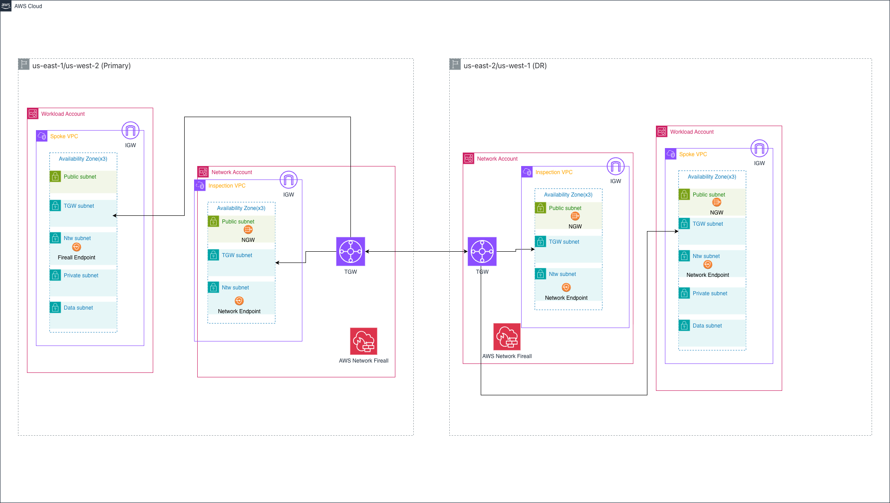

# Guiding Care Network Disaster Recovery Detailed Design

**Confluence Page:** https://healthedge.atlassian.net/wiki/spaces/CP1/pages/5287313416/Guiding%20Care%20Network%20Disaster%20Recovery%20Detailed%20Design

**Created by:** Venkata Kommuri on November 30, 2025  
**Last modified by:** Chris Falk on December 18, 2025 at 08:12 PM

---

AWS Multi-Region Network Design Complete Disaster Recovery Runbook
==================================================================

**Document Version:** 1.0  
**Last Updated:** November 2025  
**Service:** AWS VPC, Transit Gateway, Direct Connect, VPN, Route 53  
**Target RTO:** Customer-driven based on VPN cutover timing  
**Target RPO:** N/A (network infrastructure - stateless)  
**Primary Regions:** US-East-1 (Virginia), US-West-2 (Oregon)  
**DR Regions:** US-East-2 (Ohio), US-West-1 (N. California)  
**Network Management:** Infrastructure as Code  
**Connectivity:** AWS Direct Connect, Site-to-Site VPN, Transit Gateway

Architecture Overview
---------------------

### Primary Components

Please refer to network design document for detailed design : 5.2 Network Data Flows

**Multi-Region VPC Architecture**

* Primary Region: Application workloads VPC and Network VPC
* DR Region: Application workloads VPC and Network VPC for standby

**Transit Gateway Configuration**

* Transit Gateway in each region (Primary & DR)
* Inter-region Transit Gateway peering
* Centralized routing for multi-VPC connectivity

**VPN Connectivity**

* Site-to-Site VPN for on-premises or customer site integration
* Customer Gateway at on-premises datacenter
* Virtual Private Gateway attached to Transit Gateway
* Redundant VPN tunnels for high availability

Disaster Recovery Implementation
--------------------------------

### Replication Strategy

**Network Replication**

Please refer to network design document for detailed design : 5.2 Network Data Flows

* Security group rules synchronized across regions
* Network ACLs replicated to DR VPCs
* Route53 health checks for automatic DNS failover

### Failover Process

**Automated Failover Steps:**

1. Route53 detects primary region failure via health checks
2. DNS records updated to point to DR region (TTL: 60 seconds)
3. Transit Gateway routes activated for DR region traffic
4. AWS Elastic Disaster Recovery launches recovery instances
5. Application validation and traffic verification

**Validation:**

* Verify application functionality in DR region
* Confirm database consistency
* Test VPN connectivity from on-premises/customer

### Failback Process

**Controlled Failback Steps:**

1. Validate us-east-1/us-west2 region Guiding Care VPC restoration
2. Update DNS to redirect traffic to us-east-1/us-west2 region
3. Deactivate us-east-2/us-west1 region resources (retain for future DR)