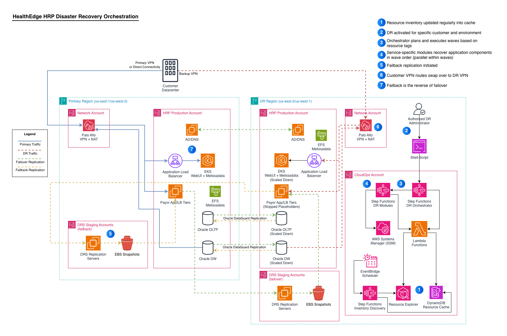
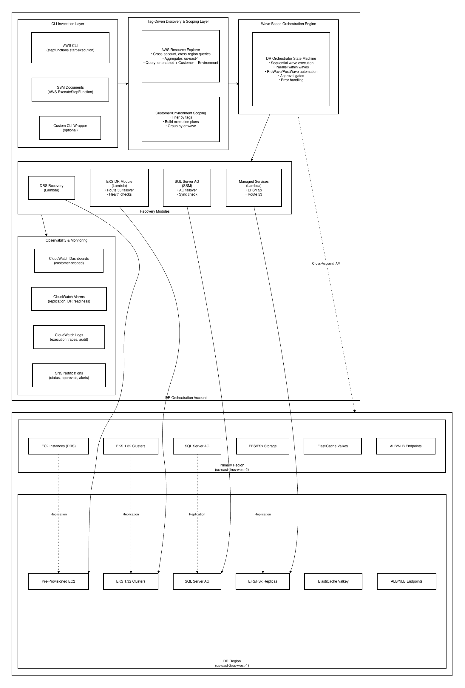
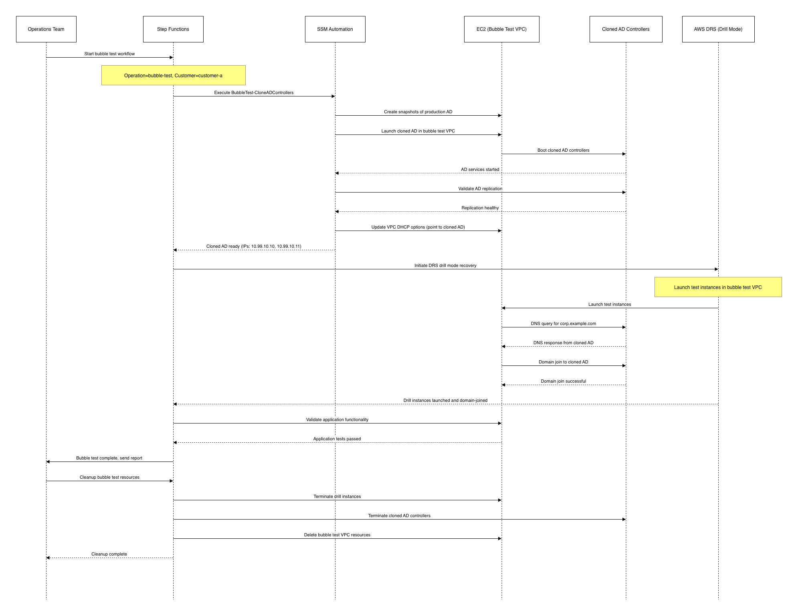

# Guiding Care DR Implementation

**Confluence Page:** https://healthedge.atlassian.net/wiki/spaces/CP1/pages/5327028252/Guiding%20Care%20DR%20Implementation

**Created by:** Chris Falk on December 09, 2025  
**Last modified by:** Chris Falk on January 09, 2026 at 07:11 PM

---

System Architecture
===================

Guiding Care Disaster Recovery Orchestration
--------------------------------------------

**Document Version**: 1.0   
**Date**: December 6, 2025   
**Project**: gc-dr-implementation   
**Architecture Mode**: Production with Healthcare Compliance

---

Executive Summary
-----------------

This document defines the system architecture for the Guiding Care Disaster Recovery (DR) orchestration solution. The architecture provides automated, tag-driven disaster recovery orchestration for up to 1,000 servers across multiple customer environments, integrating with existing AWS Landing Zone Architecture (LZA) and Amazon EKS infrastructure.

### Architecture Characteristics

* **Scale**: Enterprise-scale supporting 1,000+ servers across 20+ customer environments
* **Approach**: Tag-driven orchestration with AWS Resource Explorer for dynamic resource discovery
* **Deployment**: Multi-account, multi-region architecture aligned with existing LZA structure
* **Automation**: Serverless orchestration using AWS Step Functions, Lambda, and SSM Automation
* **Recovery Strategies**: AWS DRS for EC2, EKS DNS failover, SQL Server AG orchestration, managed services replication
* **Compliance**: Healthcare domain with technical security controls for HIPAA/HITRUST requirements

### Key Design Decisions

1. **Tag-Driven Discovery**: AWS Resource Explorer replaces manifest-driven approach for flexible multi-tenant operations
2. **CLI-Only Operation**: No web UI components, designed for CLI-triggered automation with future UI extensibility
3. **Pre-Provisioned Instances with IP Preservation**: AllowLaunchingIntoThisInstance pattern required for IP address last octet preservation, cost optimization, and instance identity preservation
4. **Customer/Environment Scoping**: Multi-tenant architecture with targeted failover capabilities per customer environment
5. **Reference Architecture Integration**: Extends DRS Plan Automation and customer's existing CDK infrastructure

---

High-Level System Architecture
------------------------------

### Architecture Diagrams



### Architecture Layers

#### 1. CLI Invocation Layer

**Purpose**: Provide command-line interface for DR operations without web UI dependencies

**Components**:

* AWS CLI for Step Functions execution
* SSM Documents for standardized runbook execution
* Optional custom CLI wrapper for simplified parameter handling

**Key Features**:

* Accept Customer and Environment parameters for scoped operations
* Support operation types: failover, failback, bubble-test
* Return execution ARN for tracking and monitoring
* Designed for future UI extensibility without architectural changes

#### 2. Tag-Driven Discovery & Scoping Layer

**Purpose**: Dynamically discover DR-enabled resources and scope operations to specific customer environments

**Components**:

* **AWS Resource Explorer Integration**: Cross-account, cross-region tag-based queries
* **Customer/Environment Scoping**: Filter resources by Customer and Environment tags
* **Wave Grouping**: Organize resources by dr:wave tag for ordered execution

**Key Features**:

* Aggregator region (us-east-1) for centralized search
* Organizations integration for multi-account discovery
* Query filters: `dr:enabled=true`, `Customer`, `Environment` tags
* Fallback to direct AWS API calls if Resource Explorer unavailable
* Dynamic execution plan generation from discovered resources

**Technology Stack**:

* AWS Resource Explorer APIs
* AWS Lambda (Python) for discovery logic
* boto3 for fallback API calls

#### 3. Wave-Based Orchestration Engine

**Purpose**: Execute DR operations in ordered waves with PreWave/PostWave validation

**Components**:

* **Step Functions State Machine**: DR Orchestrator workflow
* **PreWave SSM Automation**: Validation, backup verification, readiness checks
* **Recovery Execution**: Parallel execution of recovery modules within wave
* **PostWave SSM Automation**: Validation, DNS updates, health checks
* **Approval Gates**: SNS-based approval for production failovers

**Key Features**:

* Sequential wave execution (wave N completes before wave N+1 starts)
* Parallel execution within waves for independent resources
* Error handling with automatic retries and manual intervention
* Execution history and audit trail
* Customer-scoped status reporting

**Technology Stack**:

* AWS Step Functions (Express or Standard workflows)
* AWS Lambda for orchestration logic
* AWS Systems Manager Automation for runbooks
* Amazon SNS for notifications and approvals

#### 4. Recovery Modules

**Purpose**: Execute service-specific recovery operations

**DRS Recovery Module**:

* Initiate DRS recovery jobs with AllowLaunchingIntoThisInstance
* Pre-provisioned instances with ENIs to preserve IP address last octet (hard requirement)
* Name tag matching for primary-DR instance pairs
* Support failover (primary → DR) and failback (DR → primary)
* Monitor DRS job status with exponential backoff
* Handle DRS API rate limits

**EKS DR Module**:

* Validate DR EKS cluster health
* Activate Route 53 DNS failover (internal and external endpoints)
* Validate DNS resolution to DR region
* Validate Kubernetes workload health
* Support EFS/EBS backup validation

**SQL Server AG Module**:

* Validate secondary replica synchronization
* Execute AG failover (planned or forced)
* Update connection strings or DNS records
* Support bubble test cloning for isolated testing

**Managed Services Module**:

* EFS cross-region replication validation
* FSx NetApp ONTAP replication validation
* ElastiCache Valkey endpoint updates (no replication needed)
* Route 53 failover for ALB/NLB endpoints

**Technology Stack**:

* AWS Lambda (Python) for recovery logic
* AWS Systems Manager Automation for SQL Server operations
* boto3 for AWS service APIs (DRS, EKS, Route 53, etc.)

#### 5. Observability & Monitoring Layer

**Purpose**: Provide comprehensive monitoring, alerting, and audit trail

**Components**:

* **CloudWatch Dashboards**: Customer-scoped DR health metrics
* **CloudWatch Alarms**: Replication lag, DR readiness, orchestration failures
* **CloudWatch Logs**: Execution traces, audit trail, debugging
* **SNS Notifications**: Status updates, approval requests, alerts

**Key Features**:

* Customer-scoped visibility for multi-tenant operations
* Proactive alerting for replication issues and DR readiness
* Complete audit trail for compliance and troubleshooting
* Integration with existing customer monitoring tools

---

Component Specifications
------------------------

### Resource Discovery Component

**Component**: AWS Resource Explorer Integration Lambda   
**Purpose**: Discover DR-enabled resources across accounts and regions

**Interfaces**:

* **Input**: Customer, Environment, Regions (from Step Functions)
* **Output**: Wave-grouped resource list with metadata

**Data Model**:


```py
{
    "Customer": "customer-name",
    "Environment": "production",
    "Waves": [
        {
            "WaveNumber": 1,
            "Resources": [
                {
                    "ResourceType": "ec2:instance",
                    "ResourceId": "i-1234567890abcdef0",
                    "Name": "app-server-01",
                    "RecoveryStrategy": "drs",
                    "Priority": "critical",
                    "Account": "123456789012",
                    "Region": "us-east-1",
                    "Tags": {...}
                }
            ]
        }
    ]
}
```


**Error Handling**:

* Retry Resource Explorer queries with exponential backoff
* Fallback to direct AWS API calls if Resource Explorer unavailable
* Validate discovered resources have required tags
* Alert on missing or invalid tag configurations

### DRS Recovery Component

**Component**: DRS Recovery Lambda   
**Purpose**: Execute DRS recovery jobs with AllowLaunchingIntoThisInstance support

**Interfaces**:

* **Input**: List of EC2 instances with DRS source server IDs, operation type (failover/failback)
* **Output**: Recovery job status, recovered instance details

**API Specifications**:


```py
# DRS Recovery API
def recover_instances(instances: List[Dict], operation: str) -> Dict:
    """
    Recover EC2 instances using AWS DRS
    
    Args:
        instances: List of source instances with metadata
        operation: 'failover' or 'failback'
    
    Returns:
        {
            "JobId": "recovery-job-id",
            "Status": "IN_PROGRESS",
            "RecoveredInstances": [...]
        }
    """
```


**Data Flow**:

1. Receive instance list from Step Functions orchestrator
2. For each instance, find pre-provisioned DR instance by Name tag matching
3. Initiate DRS recovery with AllowLaunchingIntoThisInstance if DR instance found
4. Fallback to standard DRS launch if pre-provisioned instance not found
5. Monitor DRS job status with exponential backoff (5s, 10s, 20s, 40s, 60s max)
6. Return recovery status to orchestrator

**Error Handling**:

* Handle DRS API rate limits with exponential backoff
* Retry failed recovery jobs up to 3 times
* Alert on Name tag mismatches or missing DR instances
* Provide detailed error messages for troubleshooting

**Security Controls**:

* Cross-account IAM role assumption for DRS operations
* Encryption in transit for all API calls
* Audit logging to CloudWatch Logs
* Least privilege IAM permissions

### EKS DR Component

**Component**: EKS DR Lambda   
**Purpose**: Orchestrate EKS cluster DR with Route 53 DNS failover

**Interfaces**:

* **Input**: EKS cluster name, DR region, operation type
* **Output**: Failover status, DNS validation results, workload health

**API Specifications**:


```py
# EKS DR API
def failover_eks_cluster(cluster_name: str, dr_region: str) -> Dict:
    """
    Failover EKS cluster by activating Route 53 DNS failover
    
    Args:
        cluster_name: Primary EKS cluster name
        dr_region: DR region for failover
    
    Returns:
        {
            "Cluster": "cluster-name",
            "DRRegion": "us-east-2",
            "Status": "COMPLETED",
            "DNSValidation": "PASSED",
            "WorkloadHealth": {...}
        }
    """
```


**Data Flow**:

1. Validate DR EKS cluster is healthy (control plane, node groups, add-ons)
2. Activate Route 53 health check failover for ALB/NLB endpoints
3. Validate DNS resolution to DR region endpoints
4. Validate Kubernetes workload health (deployments, services, pods)
5. Return failover status to orchestrator

**Integration Points**:

* Route 53 for DNS failover (health checks, failover routing policies)
* EKS API for cluster health validation
* Kubernetes API for workload health checks
* EFS/EBS for persistent volume validation

### Step Functions Orchestration Workflow

**Workflow**: DR Orchestrator State Machine   
**Purpose**: Coordinate wave-based recovery execution

**State Machine Definition** (simplified):


```json
{
  "Comment": "DR Orchestration - Wave-Based Recovery",
  "StartAt": "DiscoverResources",
  "States": {
    "DiscoverResources": {
      "Type": "Task",
      "Resource": "arn:aws:lambda:REGION:ACCOUNT:function:ResourceDiscovery",
      "Next": "ValidateDiscovery"
    },
    "ValidateDiscovery": {
      "Type": "Choice",
      "Choices": [
        {
          "Variable": "$.Waves",
          "IsPresent": true,
          "Next": "IterateWaves"
        }
      ],
      "Default": "DiscoveryFailed"
    },
    "IterateWaves": {
      "Type": "Map",
      "ItemsPath": "$.Waves",
      "MaxConcurrency": 1,
      "Iterator": {
        "StartAt": "PreWaveActions",
        "States": {
          "PreWaveActions": {
            "Type": "Task",
            "Resource": "arn:aws:states:::aws-sdk:ssm:startAutomationExecution",
            "Next": "WaitForPreWave"
          },
          "WaitForPreWave": {
            "Type": "Task",
            "Resource": "arn:aws:lambda:REGION:ACCOUNT:function:WaitForSSM",
            "Next": "CheckApprovalRequired"
          },
          "CheckApprovalRequired": {
            "Type": "Choice",
            "Choices": [
              {
                "Variable": "$.ApprovalMode",
                "StringEquals": "required",
                "Next": "RequestApproval"
              }
            ],
            "Default": "ExecuteRecovery"
          },
          "RequestApproval": {
            "Type": "Task",
            "Resource": "arn:aws:states:::sns:publish.waitForTaskToken",
            "Next": "ExecuteRecovery"
          },
          "ExecuteRecovery": {
            "Type": "Parallel",
            "Branches": [
              {
                "StartAt": "DRSRecovery",
                "States": {
                  "DRSRecovery": {
                    "Type": "Task",
                    "Resource": "arn:aws:lambda:REGION:ACCOUNT:function:DRSRecovery",
                    "Retry": [
                      {
                        "ErrorEquals": ["States.TaskFailed"],
                        "IntervalSeconds": 30,
                        "MaxAttempts": 3,
                        "BackoffRate": 2.0
                      }
                    ],
                    "End": true
                  }
                }
              },
              {
                "StartAt": "EKSRecovery",
                "States": {
                  "EKSRecovery": {
                    "Type": "Task",
                    "Resource": "arn:aws:lambda:REGION:ACCOUNT:function:EKSRecovery",
                    "End": true
                  }
                }
              }
            ],
            "Next": "PostWaveActions"
          },
          "PostWaveActions": {
            "Type": "Task",
            "Resource": "arn:aws:states:::aws-sdk:ssm:startAutomationExecution",
            "Next": "WaitForPostWave"
          },
          "WaitForPostWave": {
            "Type": "Task",
            "Resource": "arn:aws:lambda:REGION:ACCOUNT:function:WaitForSSM",
            "End": true
          }
        }
      },
      "Next": "NotifyCompletion"
    },
    "NotifyCompletion": {
      "Type": "Task",
      "Resource": "arn:aws:states:::sns:publish",
      "End": true
    },
    "DiscoveryFailed": {
      "Type": "Fail",
      "Error": "DiscoveryFailed",
      "Cause": "No DR-enabled resources discovered"
    }
  }
}
```


**Execution Parameters**:


```json
{
  "Customer": "customer-name",
  "Environment": "production",
  "Operation": "failover",
  "Regions": ["us-east-1", "us-west-2"],
  "DRRegions": ["us-east-2", "us-west-1"],
  "ApprovalMode": "required",
  "Waves": "all"
}
```


---

Data Architecture
-----------------

### Tagging Taxonomy

**DR Orchestration Tags** (replacing existing DRS tags):

* `dr:enabled` (true/false) - Identifies resources for DR orchestration
* `dr:priority` (critical/high/medium/low) - Recovery priority classification
* `dr:wave` (1-N) - Wave number for ordered recovery
* `dr:recovery-strategy` (drs/eks-dns/sql-ag/managed-service) - Recovery method
* `dr:rto-target` (minutes) - Target recovery time objective
* `dr:rpo-target` (minutes) - Target recovery point objective

**Scoping Tags** (existing customer tags):

* `Customer` - Customer identifier for multi-tenant scoping
* `Environment` - Environment identifier (production, staging, development)

**Validation**:

* AWS Config rules enforce required tags on DR-enabled resources
* Tag validation during resource discovery with alerts for missing/invalid tags
* Migration plan from existing DRS tags to new dr:x taxonomy

### Data Flow Patterns

#### Discovery Flow


```
CLI Invocation
  → Step Functions (start execution with Customer/Environment)
  → Resource Discovery Lambda
    → AWS Resource Explorer (tag query: dr:enabled + Customer + Environment)
    → Fallback: Direct AWS API calls (EC2, RDS, EKS, etc.)
  → Customer/Environment Scoping Lambda (filter by tags)
  → Wave Grouping (organize by dr:wave tag)
  → Return to Step Functions (wave-grouped resource list)
```


#### Recovery Flow


```
Step Functions Orchestrator
  → For each wave (sequential):
    → PreWave SSM Automation (validation, backups)
    → Approval Gate (if required, SNS notification)
    → Parallel Recovery Execution:
      → DRS Recovery Lambda (EC2 instances)
      → EKS DR Lambda (EKS clusters)
      → SQL AG SSM Automation (SQL Server)
      → Managed Services Lambda (EFS, FSx, Route 53)
    → PostWave SSM Automation (validation, DNS updates)
  → Completion Notification (SNS)
```


#### Monitoring Flow


```
All Components
  → CloudWatch Logs (execution traces, errors)
  → CloudWatch Metrics (custom metrics: recovery time, success rate)
  → CloudWatch Alarms (failures, thresholds exceeded)
  → SNS Notifications (alerts, status updates)
  → CloudWatch Dashboards (customer-scoped visibility)
```


### State Management

**Execution State**:

* Step Functions maintains execution state (no external state store required)
* Execution history provides audit trail and debugging information
* Execution ARN enables tracking and monitoring

**Resource State**:

* AWS Resource Explorer provides current resource state
* No persistent state storage for resource inventory (dynamic discovery)
* DRS service maintains replication state for protected instances

**Configuration State**:

* Tags on resources define DR configuration (no separate config files)
* SSM Parameter Store for orchestration configuration (timeouts, retries, etc.)
* Secrets Manager for sensitive credentials (if needed)

---

Security Architecture
---------------------

### Authentication & Authorization

**Cross-Account Access**:

* IAM roles in workload accounts with trust relationship to DR orchestration account
* Role assumption using AWS STS AssumeRole API
* Least privilege permissions per service (DRS, EC2, EKS, Route 53, etc.)
* Role session duration: 1 hour (renewable)

**IAM Role Structure**:


```
DR Orchestration Account:
  - DROrchestrationExecutionRole (Step Functions, Lambda)
  - DRDiscoveryRole (Resource Explorer, read-only access)
  - DRRecoveryRole (DRS, EC2, EKS, Route 53, SSM)

Workload Accounts:
  - DROrchestrationCrossAccountRole (assumed by DR orchestration account)
  - Permissions: DRS operations, EC2 describe/start/stop, EKS describe, Route 53 updates
```


**Service Control Policies (SCPs)**:

* Respect existing LZA SCPs (Production, Non-Production, Development, Sandbox)
* Validate DR operations don't violate SCP boundaries
* Test cross-account role assumption in all OUs

### Data Protection

**Encryption at Rest**:

* DRS replication uses EBS encryption (customer-managed or AWS-managed KMS keys)
* EFS and FSx replication encrypted with KMS keys
* CloudWatch Logs encrypted with KMS keys
* Secrets Manager encrypted with KMS keys

**Encryption in Transit**:

* All AWS API calls use TLS 1.2+
* DRS replication traffic encrypted in transit
* EFS and FSx replication encrypted in transit

**Key Management**:

* Customer-managed KMS keys for sensitive data (if required)
* AWS-managed keys for service-level encryption
* Cross-region KMS key replication for DR regions
* Key rotation enabled (annual rotation)

### Network Security

**Network Isolation**:

* DR orchestration Lambda functions in VPC (if accessing VPC resources)
* VPC endpoints for AWS services (DRS, EC2, EKS, Route 53, etc.)
* Security groups restrict traffic to required services
* NACLs provide additional network layer protection

**Cross-Region Connectivity**:

* Transit Gateway inter-region peering for cross-region traffic
* VPN or Direct Connect for on-premises connectivity (if applicable)
* Route 53 private hosted zones for internal DNS resolution

### Audit & Compliance

**Audit Logging**:

* CloudTrail logs all API calls (management and data events)
* CloudWatch Logs capture execution traces and errors
* Step Functions execution history provides audit trail
* DRS service logs replication and recovery events

**Compliance Controls** (Technical Implementation):

* Encryption at rest and in transit
* Access controls with least privilege IAM
* Audit logging with CloudTrail and CloudWatch
* Network isolation with VPCs and security groups
* Automated backup validation
* Disaster recovery testing and validation

**Note**: Customer's legal team must assess whether these technical controls meet their specific HIPAA/HITRUST compliance requirements. AWS does not provide legal advice or compliance determinations.

---

Deployment Architecture
-----------------------

### Multi-Account Structure

**DR Orchestration Account** (new or existing Infrastructure account):

* Step Functions state machines
* Lambda functions for orchestration and recovery
* CloudWatch dashboards and alarms
* SNS topics for notifications
* IAM roles for cross-account access

**Workload Accounts** (existing LZA structure):

* EC2 instances with DRS replication
* EKS clusters (primary and DR regions)
* SQL Server Always On Availability Groups
* EFS, FSx, ElastiCache infrastructure
* ALB/NLB endpoints with Route 53 failover
* Cross-account IAM roles for DR orchestration

### Multi-Region Deployment

**Primary Regions**:

* us-east-1 (primary for most workloads)
* us-west-2 (primary for some workloads)

**DR Regions**:

* us-east-2 (DR for us-east-1 workloads)
* us-west-1 (DR for us-west-2 workloads)

**Orchestration Deployment**:

* Primary orchestration in us-east-1
* Secondary orchestration in us-east-2 (for primary region failure scenarios)
* Resource Explorer aggregator in us-east-1

### Infrastructure as Code

**Deployment Method**: AWS CDK (Python)

**CDK Stack Structure**:


```
dr-orchestration-stack/
├── discovery/
│   ├── resource_explorer_construct.py
│   └── discovery_lambda_construct.py
├── orchestration/
│   ├── step_functions_construct.py
│   └── orchestration_lambda_construct.py
├── recovery/
│   ├── drs_recovery_construct.py
│   ├── eks_dr_construct.py
│   ├── sql_ag_construct.py
│   └── managed_services_construct.py
├── monitoring/
│   ├── cloudwatch_dashboard_construct.py
│   └── cloudwatch_alarms_construct.py
├── iam/
│   ├── orchestration_roles_construct.py
│   └── cross_account_roles_construct.py
└── app.py
```


**Deployment Sequence**:

1. Deploy cross-account IAM roles to all workload accounts (CloudFormation StackSets)
2. Configure AWS Resource Explorer in all regions
3. Deploy DR orchestration stack to DR orchestration account
4. Deploy DR infrastructure to DR regions (EKS clusters, pre-provisioned EC2, etc.)
5. Configure DRS replication for EC2 instances
6. Configure Route 53 health checks and failover routing
7. Validate end-to-end orchestration with bubble test

---

Technology Stack
----------------

### Core Services

| Service | Purpose | Justification |
| --- | --- | --- |
| **AWS Step Functions** | Orchestration workflows | Reliable, auditable, scalable orchestration with built-in error handling |
| **AWS Lambda** | Serverless compute | Event-driven execution for discovery, recovery, and monitoring logic |
| **AWS Resource Explorer** | Resource discovery | Native cross-account, cross-region tag-based search with Organizations integration |
| **AWS DRS** | EC2 disaster recovery | Near-zero RPO, 15-30 minute RTO for critical workloads |
| **Amazon EKS** | Container orchestration | Existing customer infrastructure, requires DR orchestration |
| **AWS Systems Manager** | Automation runbooks | PreWave/PostWave validation, SQL Server AG orchestration |
| **Amazon Route 53** | DNS failover | Health checks and failover routing for EKS and managed services |
| **Amazon CloudWatch** | Monitoring & logging | Dashboards, alarms, logs for observability and audit trail |
| **Amazon SNS** | Notifications | Status updates, approval requests, alerts |

### Supporting Services

| Service | Purpose | Justification |
| --- | --- | --- |
| **AWS IAM** | Authentication & authorization | Cross-account access, least privilege permissions |
| **AWS KMS** | Encryption key management | Encryption at rest for DRS, EFS, FSx, CloudWatch Logs |
| **AWS Secrets Manager** | Secrets management | Secure storage for sensitive credentials (if needed) |
| **AWS Config** | Tag validation | Enforce required tags on DR-enabled resources |
| **AWS CloudTrail** | Audit logging | API call logging for compliance and troubleshooting |
| **AWS Organizations** | Multi-account management | Resource Explorer Organizations integration |

### Development Stack

| Technology | Purpose | Justification |
| --- | --- | --- |
| **Python 3.11+** | Lambda runtime | Existing customer preference, boto3 SDK support |
| **AWS CDK (Python)** | Infrastructure as Code | Existing customer infrastructure patterns |
| **boto3** | AWS SDK | Python SDK for AWS service APIs |
| **pytest** | Unit testing | Python testing framework |
| **moto** | AWS mocking | Mock AWS services for unit tests |

---

Performance & Scalability
-------------------------

### Performance Targets

**Recovery Time Objective (RTO)**:

* Critical workloads (wave 1): 15 minutes
* High priority workloads (wave 2): 30 minutes
* Medium priority workloads (wave 3): 1 hour
* Low priority workloads (wave 4+): 4 hours
* Overall system RTO: 4 hours (contractual requirement)

**Recovery Point Objective (RPO)**:

* DRS-protected EC2 instances: 15 minutes (contractual requirement)
* SQL Server Always On: 15 minutes (asynchronous replication)
* EFS cross-region replication: 15 minutes
* FSx NetApp ONTAP: 15 minutes

**Orchestration Performance**:

* Resource discovery: < 5 minutes for 1,000 servers
* Wave execution: Parallel within wave, sequential across waves
* DRS recovery job initiation: < 1 minute per instance
* EKS DNS failover: < 5 minutes
* SQL Server AG failover: < 10 minutes

### Scalability Considerations

**Resource Limits**:

* AWS Resource Explorer: 1,000 results per query (pagination supported)
* Step Functions: 25,000 events per execution (sufficient for 1,000 servers)
* Lambda: 1,000 concurrent executions (default, can be increased)
* DRS: 100 concurrent recovery jobs (soft limit, can be increased to 1,000)

**Scaling Strategy**:

* Horizontal scaling: Parallel execution within waves
* Vertical scaling: Lambda memory allocation (1024-3008 MB)
* Pagination: Handle large resource sets with pagination
* Rate limiting: Exponential backoff for API rate limits

**Capacity Planning**:

* 1,000 servers across 20+ customer environments
* Average 50 servers per customer environment
* Average 4 waves per customer environment
* Peak concurrent recovery: 250 servers (wave 1 across all customers)

---

Risk Assessment & Mitigation
----------------------------

### Technical Risks

#### Risk 1: AWS Resource Explorer Performance at Scale

**Severity**: Medium   
**Probability**: Low   
**Impact**: Resource discovery may be slower than expected

**Mitigation**:

* Implement fallback to direct AWS API calls
* Test Resource Explorer performance with 1,000+ resources early
* Optimize queries with specific tag filters
* Consider caching discovered resources for repeated operations

#### Risk 2: DRS API Rate Limits

**Severity**: Medium   
**Probability**: Medium   
**Impact**: Recovery job initiation may be throttled

**Mitigation**:

* Implement exponential backoff with jitter
* Request service limit increase from 100 to 1,000 concurrent jobs
* Stagger recovery job initiation within waves
* Monitor DRS API usage and adjust orchestration timing

#### Risk 3: Cross-Account IAM Role Assumption Failures

**Severity**: High   
**Probability**: Low   
**Impact**: Orchestration cannot access workload accounts

**Mitigation**:

* Validate cross-account roles during deployment
* Implement comprehensive error handling and retry logic
* Test role assumption in all LZA organizational units
* Monitor role assumption failures with CloudWatch alarms

#### Risk 4: EKS DNS Failover Complexity

**Severity**: High   
**Probability**: Medium   
**Impact**: EKS workloads may not be accessible after failover

**Mitigation**:

* Comprehensive testing of Route 53 health checks and failover
* Validate DNS resolution from multiple locations
* Implement DNS validation in PostWave actions
* Document DNS troubleshooting procedures

#### Risk 5: Primary Region API Unavailability

**Severity**: High   
**Probability**: Low   
**Impact**: Cannot initiate DR orchestration from primary region

**Mitigation**:

* Deploy orchestration infrastructure in DR region
* Support orchestration initiation from DR region
* Document runbook for DR activation when primary region down
* Test DR region orchestration regularly

### Operational Risks

#### Risk 6: Tag Governance and Compliance

**Severity**: Medium   
**Probability**: Medium   
**Impact**: Resources may not be discovered due to missing/invalid tags

**Mitigation**:

* Implement AWS Config rules for tag validation
* Provide tag governance documentation and training
* Automated tag validation during resource discovery
* Regular tag compliance audits

#### Risk 7: Approval Gate Delays

**Severity**: Low   
**Probability**: Medium   
**Impact**: Production failovers may be delayed waiting for approval

**Mitigation**:

* Clear approval procedures and escalation paths
* SNS notifications to multiple approvers
* Approval timeout with automatic escalation
* Document approval bypass procedures for emergencies

---

Implementation Guidance
-----------------------

### Development Phases

**Phase 1: Foundation (Weeks 1-2)**

* Deploy cross-account IAM roles
* Configure AWS Resource Explorer
* Implement tag-driven discovery Lambda
* Implement customer/environment scoping Lambda
* Unit tests for discovery logic

**Phase 2: DRS Integration (Weeks 3-4)**

* Implement DRS recovery Lambda with AllowLaunchingIntoThisInstance
* Implement DRS configuration management (simplified)
* Implement DRS observability dashboards
* Unit and integration tests for DRS recovery

**Phase 3: EKS and Managed Services (Weeks 5-7)**

* Extend customer EKS CDK constructs for DR regions
* Implement EKS DR Lambda with Route 53 failover
* Implement SQL Server AG SSM Automation
* Implement managed services recovery Lambda
* Integration tests for EKS and managed services

**Phase 4: Orchestration (Weeks 8-9)**

* Implement Step Functions orchestration workflow
* Implement PreWave/PostWave SSM Automation
* Implement approval gates with SNS
* End-to-end orchestration testing

**Phase 5: Observability and Testing (Weeks 10-11)**

* Implement CloudWatch dashboards and alarms
* Implement customer-scoped monitoring
* Comprehensive bubble testing for all customer environments
* Performance and scalability testing

**Phase 6: Operational Readiness (Week 12)**

* Documentation and runbooks
* Knowledge transfer and training
* Production deployment
* Post-deployment validation

### Testing Strategy

**Unit Testing**:

* Lambda functions with moto for AWS service mocking
* pytest for test framework
* 80%+ code coverage target

**Integration Testing**:

* Test cross-account role assumption
* Test Resource Explorer queries
* Test DRS recovery with test instances
* Test EKS DNS failover with test clusters

**End-to-End Testing**:

* Bubble tests in isolated test environments
* Full orchestration workflow testing
* Customer-scoped testing for each environment
* Failover and failback testing

**Performance Testing**:

* Load testing with 1,000 servers
* Concurrent recovery testing
* API rate limit testing
* RTO/RPO validation

**Disaster Recovery Testing**:

* Quarterly DR drills for all customer environments
* Annual full-scale DR test
* Tabletop exercises for runbook validation
* Post-test review and improvement

### Operational Procedures

**Failover Procedure**:

1. Validate DR readiness (DRS replication, EKS health, SQL AG sync)
2. Initiate CLI command with Customer and Environment parameters
3. Monitor Step Functions execution progress
4. Approve wave transitions (if approval mode enabled)
5. Validate application functionality in DR region
6. Update DNS records for external access (if not automated)
7. Notify stakeholders of failover completion

**Failback Procedure**:

1. Validate primary region recovery
2. Initiate failback CLI command
3. Monitor reverse replication and recovery
4. Validate application functionality in primary region
5. Update DNS records to primary region
6. Notify stakeholders of failback completion

**Bubble Test Procedure**:

1. Initiate bubble test CLI command
2. Isolated test environment created in DR region
3. Validate application functionality in test environment
4. Cleanup test environment after validation
5. Document test results and issues

---

Conclusion
----------

This architecture provides a comprehensive, production-ready disaster recovery orchestration solution for the Guiding Care healthcare application. The tag-driven approach with customer/environment scoping enables flexible multi-tenant operations while maintaining operational simplicity. Integration with existing LZA and EKS infrastructure minimizes disruption to current operations while adding critical DR capabilities.

### Key Architectural Strengths

* **Flexibility**: Tag-driven discovery adapts to infrastructure changes without orchestration updates
* **Scalability**: Supports 1,000+ servers with parallel execution and efficient resource discovery
* **Multi-Tenancy**: Customer/environment scoping enables targeted DR operations
* **Operational Simplicity**: CLI-triggered automation without UI dependencies
* **Compliance Readiness**: Technical security controls support healthcare compliance requirements
* **Cost Optimization**: Pre-provisioned instances with AllowLaunchingIntoThisInstance reduce DR costs

### Next Steps

1. Review and validate architecture with stakeholders
2. Proceed to Architecture Decision Records (ADRs) for key decisions
3. Complete architecture integration validation (Task 3.4)
4. Begin implementation planning and resource allocation

---

Primary Region Failure Scenarios
--------------------------------

### Overview

This section addresses the critical requirement (NFR-008, NFR-025) that the DR orchestration system must support activation and failover operations even when primary region AWS APIs are unavailable. This ensures the DR system remains operational during complete primary region outages, including scenarios where AWS control plane APIs are inaccessible.

### Architecture for Primary Region Resilience

#### DR System Deployment Strategy

**Deployment Location**: DR orchestration infrastructure deployed in DR region (not primary region)

**Rationale**:

* DR system survives complete primary region failures including API unavailability
* DR region deployment enables DR activation when primary region is completely unavailable
* Eliminates single point of failure in primary region

**Deployment Pattern**:


```
Primary Region (us-east-1)          DR Region (us-east-2)
┌────────────────────────┐          ┌────────────────────────────────────┐
│ Workload Resources     │          │ DR Orchestration System            │
│ • EC2 Instances        │          │ • Step Functions State Machines    │
│ • EKS Clusters         │          │ • Lambda Functions                 │
│ • Databases            │          │ • Resource Inventory Cache         │
│ • Storage              │          │ • Configuration (Parameter Store)  │
└────────────────────────┘          │                                    │
                                    │ Workload DR Resources              │
                                    │ • Pre-Provisioned EC2              │
                                    │ • EKS DR Clusters                  │
                                    │ • Database Replicas                │
                                    │ • Storage Replicas                 │
                                    └────────────────────────────────────┘
```


### Resource Discovery Strategies for Primary Region Failure

#### Strategy 1: Pre-Cached Resource Inventory (Primary)

**Approach**: Maintain pre-cached resource inventory in DR region DynamoDB table

**Implementation**:

1. **Scheduled Cache Refresh**: Lambda function runs every 15 minutes in DR region
2. **Resource Discovery**: Uses AWS Resource Explorer to discover all dr:enabled resources
3. **Cache Storage**: Stores complete resource inventory in DynamoDB with timestamp
4. **Cache Validation**: Validates cache freshness and completeness

**Cache Data Model**:


```json
{
  "CacheTimestamp": "2025-12-07T10:00:00Z",
  "CacheTTL": 900,
  "Regions": {
    "us-east-1": {
      "APIAvailable": true,
      "LastSuccessfulDiscovery": "2025-12-07T10:00:00Z",
      "Resources": [
        {
          "ResourceType": "ec2:instance",
          "ResourceId": "i-1234567890abcdef0",
          "Name": "app-server-01",
          "Customer": "customer-a",
          "Environment": "production",
          "DREnabled": true,
          "DRPriority": "critical",
          "DRWave": 1,
          "RecoveryStrategy": "drs",
          "Account": "123456789012",
          "Region": "us-east-1",
          "DRRegion": "us-east-2",
          "DRInstanceId": "i-0987654321fedcba0",
          "Tags": {...}
        }
      ]
    }
  }
}
```


**Failover Behavior**:

* **Primary Region APIs Available**: Use real-time Resource Explorer discovery
* **Primary Region APIs Unavailable**: Use pre-cached inventory from DynamoDB
* **Cache Age Validation**: Alert if cache >30 minutes old during failover

#### Strategy 2: Cross-Region Resource Metadata Replication

**Approach**: Replicate resource metadata to DR region using EventBridge and DynamoDB global tables

**Implementation**:

1. **EventBridge Rules**: Capture resource tag changes in primary region
2. **Cross-Region Events**: Forward events to DR region EventBridge bus
3. **Metadata Update**: Lambda in DR region updates DynamoDB global table
4. **Near Real-Time Sync**: Resource metadata synchronized within seconds

**Event Flow**:


```
Primary Region (us-east-1)
  EC2 Tag Change → EventBridge → Cross-Region Target
                                        ↓
DR Region (us-east-2)
  EventBridge → Lambda → DynamoDB Global Table Update
```


**Benefits**:

* Near real-time resource metadata in DR region
* Survives primary region API failures
* Minimal staleness (seconds vs minutes)

#### Strategy 3: Fallback to Direct AWS API Calls (Tertiary)

**Approach**: If Resource Explorer unavailable, fall back to direct AWS service APIs

**Implementation**:

* Iterate through known AWS services (EC2, RDS, EKS, etc.)
* Query resources with dr:enabled tag using service-specific APIs
* Aggregate results across services
* Higher latency but provides fallback option

**Use Case**: Resource Explorer service disruption (rare)

### DR System Bootstrap Procedures

#### Scenario: Primary Region Complete Outage

**Detection**:

1. Automated health checks detect primary region API unavailability
2. CloudWatch alarms trigger SNS notifications
3. Operations team validates outage scope

**Activation Procedure**:

1. **Validate DR System Health**:

   * Verify DR region Step Functions state machines operational
   * Verify DR region Lambda functions healthy
   * Verify DynamoDB cache accessible
   * Verify cross-account IAM roles functional
2. **Load Pre-Cached Inventory**:

   * Retrieve latest resource inventory from DynamoDB cache
   * Validate cache timestamp (<30 minutes preferred)
   * Alert if cache stale but proceed with available data
3. **Initiate DR Orchestration**:

   * Execute Step Functions workflow from DR region
   * Use cached inventory for resource discovery
   * Skip primary region API calls (known unavailable)
   * Proceed with wave-based recovery using cached data
4. **Monitor Recovery Progress**:

   * Track recovery status in DR region CloudWatch
   * Monitor DRS recovery jobs in DR region
   * Validate recovered resources in DR region

**CLI Command Example**:


```bash
# Execute DR failover from DR region using cached inventory
aws stepfunctions start-execution \
  --state-machine-arn arn:aws:states:us-east-2:ACCOUNT:stateMachine:DROrchestrator \
  --name "failover-primary-outage-$(date +%s)" \
  --input '{
    "Operation": "failover",
    "Customer": "all",
    "Environment": "production",
    "UseCachedInventory": true,
    "PrimaryRegionAvailable": false,
    "Regions": ["us-east-1"],
    "DRRegions": ["us-east-2"]
  }' \
  --region us-east-2
```


### Validation Procedures

#### Pre-Failover Validation (Primary Region Failure)

**Validation Checklist**:

* [ ] DR region AWS APIs accessible and healthy
* [ ] DR orchestration system components operational
* [ ] Resource inventory cache available and recent (<30 min)
* [ ] Cross-account IAM roles functional from DR region
* [ ] DRS replication status known (from cache or last successful check)
* [ ] DR region resources (EKS, databases, storage) healthy

#### Post-Failover Validation

**Validation Checklist**:

* [ ] All critical workloads recovered in DR region
* [ ] DNS failover completed (Route 53 health checks updated)
* [ ] Application endpoints accessible in DR region
* [ ] Database replication validated
* [ ] Storage replication validated
* [ ] Monitoring and alerting operational in DR region

### Sequence Diagram: DR Activation During Primary Region Outage


### Cache Management

#### Cache Refresh Strategy

**Scheduled Refresh**:

* Frequency: Every 15 minutes
* Execution: Lambda function in DR region
* Scope: All regions with DR-enabled resources
* Storage: DynamoDB table in DR region

**On-Demand Refresh**:

* Trigger: Manual refresh before planned failover tests
* Trigger: After significant infrastructure changes
* Execution: Same Lambda function, invoked manually

**Cache Validation**:

* Timestamp check: Alert if cache >30 minutes old
* Completeness check: Validate expected resource count
* Consistency check: Compare with previous cache version

#### Cache Retention

**Retention Policy**:

* Current cache: Always available
* Historical caches: Retain last 24 hours (96 cache versions)
* Purpose: Audit trail and troubleshooting

**Storage Optimization**:

* Compress historical cache entries
* Use DynamoDB TTL for automatic cleanup
* Estimated storage: <100 MB for 1,000 servers

### Monitoring and Alerting

#### Cache Health Monitoring

**Metrics**:

* Cache refresh success rate
* Cache age (time since last successful refresh)
* Cache size (number of resources)
* Cache refresh duration

**Alarms**:

* **Critical**: Cache refresh failed for >30 minutes
* **Warning**: Cache age >20 minutes
* **Info**: Cache refresh duration >5 minutes

#### Primary Region Health Monitoring

**Metrics**:

* Primary region API availability (health checks)
* Resource discovery success rate
* Cross-region API latency

**Alarms**:

* **Critical**: Primary region APIs unavailable for >5 minutes
* **Warning**: Primary region API error rate >5%
* **Info**: Cross-region API latency >2 seconds

---

Bubble Test Network Architecture
--------------------------------

### Overview

This section addresses the requirement (FR-025) for isolated "bubble test" drills that validate DR capabilities without impacting production systems. The architecture includes dedicated cloning of Active Directory domain controllers and DNS resolution strategy to ensure complete isolation from production AD infrastructure.

### Bubble Test Isolation Strategy

#### Network Isolation Architecture

**Isolated Test VPC**:

* Dedicated VPC in DR region for bubble tests
* No connectivity to production VPCs
* Separate CIDR range from production networks
* Isolated subnets for test resources

**Network Diagram**:


```
DR Region (us-east-2)
┌─────────────────────────────────────────────────────────────────┐
│                                                                 │
│  Production VPC (10.1.0.0/16)                                   │
│  ┌────────────────────────────────────────────────────────────┐ │
│  │ • Production AD Controllers (10.1.10.10, 10.1.10.11)       │ │
│  │ • Production DR Resources                                  │ │
│  │ • Production DNS Resolution → Production AD                │ │
│  └────────────────────────────────────────────────────────────┘ │
│                                                                 │
│  Bubble Test VPC (10.99.0.0/16) - ISOLATED                      │
│  ┌────────────────────────────────────────────────────────────┐ │
│  │ • Cloned AD Controllers (10.99.10.10, 10.99.10.11)         │ │
│  │ • Test DR Resources (DRS drill mode)                       │ │
│  │ • Test DNS Resolution → Cloned AD (NOT production)         │ │
│  │ • NO connectivity to Production VPC                        │ │
│  └────────────────────────────────────────────────────────────┘ │
│                                                                 │
└─────────────────────────────────────────────────────────────────┘
```


### DNS Resolution Strategy for Bubble Tests

#### Challenge

**Problem**: By default, VPC DNS resolver (.2 address) forwards AD domain queries to production AD controllers via Route 53 Resolver rules. This creates a dependency on production AD during bubble tests, violating isolation requirements.

**Solution**: Override DNS resolution in bubble test VPC to point to cloned AD controllers instead of production AD.

#### DNS Resolution Implementation

**Option 1: VPC DHCP Options Set (Recommended)**

**Approach**: Create custom DHCP options set for bubble test VPC pointing to cloned AD controllers

**Implementation Steps**:

1. **Create Custom DHCP Options Set**:

   
```bash
aws ec2 create-dhcp-options \
  --dhcp-configurations \
    "Key=domain-name,Values=corp.example.com" \
    "Key=domain-name-servers,Values=10.99.10.10,10.99.10.11" \
  --region us-east-2
```

2. **Associate with Bubble Test VPC**:

   
```bash
aws ec2 associate-dhcp-options \
  --dhcp-options-id dopt-bubble-test-123 \
  --vpc-id vpc-bubble-test-456 \
  --region us-east-2
```

3. **Validation**:

   * Test instances in bubble test VPC receive cloned AD DNS servers via DHCP
   * DNS queries for AD domain resolve to cloned AD controllers
   * No DNS queries reach production AD controllers

**Benefits**:

* Automatic DNS configuration for all instances in bubble test VPC
* No per-instance configuration required
* Complete DNS isolation from production AD

**Limitations**:

* Requires VPC recreation or DHCP options change (brief network disruption)
* All instances in VPC use same DNS servers

**Option 2: Route 53 Resolver Rules Override**

**Approach**: Create bubble test-specific Route 53 Resolver rules pointing to cloned AD

**Implementation Steps**:

1. **Create Resolver Rule for Bubble Test**:

   
```bash
aws route53resolver create-resolver-rule \
  --creator-request-id bubble-test-$(date +%s) \
  --rule-type FORWARD \
  --domain-name corp.example.com \
  --target-ips Ip=10.99.10.10,Port=53 Ip=10.99.10.11,Port=53 \
  --name bubble-test-ad-resolver \
  --region us-east-2
```

2. **Associate with Bubble Test VPC**:

   
```bash
aws route53resolver associate-resolver-rule \
  --resolver-rule-id rslvr-rr-bubble-test-123 \
  --vpc-id vpc-bubble-test-456 \
  --region us-east-2
```

3. **Disassociate Production Resolver Rules**:

   * Ensure production AD resolver rules NOT associated with bubble test VPC
   * Validate no DNS forwarding to production AD

**Benefits**:

* No DHCP options changes required
* Granular control over DNS forwarding rules
* Can coexist with other DNS configurations

**Limitations**:

* Requires Route 53 Resolver endpoint in bubble test VPC
* Additional complexity vs DHCP options

**Recommended Approach**: Option 1 (DHCP Options Set) for simplicity and complete isolation

### Active Directory Controller Cloning

#### Cloning Strategy

**Approach**: Clone production AD controllers into bubble test VPC using EBS snapshots

**Cloning Procedure**:

1. **Snapshot Production AD Controllers**:

   * Create EBS snapshots of production AD controller volumes
   * Snapshots include AD database, SYSVOL, and system volumes
   * Snapshots taken during low-activity period
2. **Launch Cloned AD Controllers in Bubble Test VPC**:

   * Launch EC2 instances in bubble test VPC from snapshots
   * Use isolated subnets (10.99.10.0/24)
   * Assign static IPs (10.99.10.10, 10.99.10.11)
   * Security groups allow AD traffic within bubble test VPC only
3. **Post-Clone Configuration**:

   * Boot cloned AD controllers
   * Validate AD replication between cloned controllers
   * Verify DNS zones and records
   * Validate SYSVOL replication
4. **Isolation Validation**:

   * Verify no network connectivity to production AD
   * Verify no AD replication with production AD
   * Confirm DNS queries resolve to cloned AD only

#### Cloning Automation

**SSM Automation Document**: `BubbleTest-CloneADControllers`

**Steps**:

1. Create EBS snapshots of production AD controllers
2. Launch EC2 instances from snapshots in bubble test VPC
3. Wait for AD services to start
4. Validate AD health and replication
5. Update bubble test VPC DHCP options to point to cloned AD
6. Return cloned AD controller IPs

**Execution Time**: 15-20 minutes

### Bubble Test Execution Flow

#### Complete Bubble Test Sequence



### DNS Resolution Validation

#### Validation Procedures

**Pre-Test Validation**:

1. **Verify Bubble Test VPC DNS Configuration**:

   
```bash
# Check DHCP options set
aws ec2 describe-dhcp-options \
  --dhcp-options-ids dopt-bubble-test-123 \
  --region us-east-2

# Expected: domain-name-servers = 10.99.10.10, 10.99.10.11
```

2. **Verify No Production AD Connectivity**:

   
```bash
# Test from bubble test VPC instance
nc -zv 10.1.10.10 389  # Should FAIL (no route to production AD)
nc -zv 10.99.10.10 389 # Should SUCCEED (route to cloned AD)
```

3. **Verify DNS Resolution**:

   
```bash
# Test from bubble test VPC instance
nslookup dc01.corp.example.com
# Expected: Resolves to 10.99.10.10 (cloned AD, NOT production)
```


**During-Test Validation**:

1. **Monitor DNS Queries**:

   * CloudWatch Logs for DNS query patterns
   * Verify all AD DNS queries go to cloned AD (10.99.10.x)
   * Alert if any queries reach production AD (10.1.10.x)
2. **Monitor AD Authentication**:

   * Verify domain joins succeed against cloned AD
   * Verify Kerberos authentication uses cloned AD
   * Monitor AD event logs on cloned controllers

**Post-Test Validation**:

1. **Verify Production AD Unaffected**:

   * Check production AD replication status (should be unchanged)
   * Verify no test accounts or objects in production AD
   * Confirm production AD event logs show no bubble test activity
2. **Verify Complete Cleanup**:

   * All bubble test instances terminated
   * Cloned AD controllers terminated
   * Bubble test VPC resources deleted
   * No orphaned resources remaining

### Bubble Test Resource Tagging

**Tagging Strategy**:

* All bubble test resources tagged with `bubble-test:enabled=true`
* Additional tag: `bubble-test:id=<unique-test-id>`
* Additional tag: `bubble-test:timestamp=<start-timestamp>`
* Enables automated cleanup and cost tracking

**Cleanup Automation**:

* Lambda function runs hourly to detect stale bubble test resources
* Resources older than 8 hours automatically terminated
* Prevents resource leaks from failed cleanup procedures

### Cost Optimization

**Bubble Test Cost Considerations**:

* Cloned AD controllers: 2 x t3.medium instances (~$0.08/hour)
* DRS drill mode: No additional DRS charges (drill mode free)
* Test instances: Varies by test scope
* Typical bubble test duration: 2-4 hours
* Estimated cost per test: $5-20 depending on scope

**Cost Optimization Strategies**:

* Use smaller instance types for cloned AD (t3.small sufficient for tests)
* Limit test duration to 4 hours maximum
* Automated cleanup prevents resource leaks
* Schedule tests during off-peak hours

---