# S3 & Storage Gateway Disaster Recovery & Testing Strategy

**Confluence Page:** https://healthedge.atlassian.net/wiki/spaces/CP1/pages/5276598443/S3%20%26%20Storage%20Gateway%20Disaster%20Recovery%20%26%20Testing%20Strategy

**Created by:** John Cousens on November 26, 2025  
**Last modified by:** Chris Falk on December 18, 2025 at 08:11 PM

---

---

Infrastructure Verification Status (Dec 5, 2025)
------------------------------------------------

### Current State Summary:

✅ **S3 Buckets Found:** 30 buckets deployed in production account 835807883308  
❌ **Critical Finding:** NO S3 cross-region replication configured on any buckets  
❌ **Storage Gateways:** NOT DEPLOYED in ANY production environment across ALL 4 regions  
⚠️ **DR Buckets:** No DR-specific buckets found in us-east-2, us-west-1, or us-west-2

### Storage Gateway Deployment Status - ALL REGIONS

| Account | Account ID | us-east-1 | us-east-2 | us-west-1 | us-west-2 | Status |
| --- | --- | --- | --- | --- | --- | --- |
| **GC Production** | 835807883308 | ❌ None | ❌ None | ❌ None | ❌ None | NOT DEPLOYED |
| **HRP Production** | 315237946879 | ❌ None | ❌ None | ❌ None | ❌ None | NOT DEPLOYED |
| **HRP SharedServices** | 211234826829 | ❌ None | ❌ None | ❌ None | ❌ None | NOT DEPLOYED |
| **GC SharedServices** | 096212910625 | ❌ None | ❌ None | ❌ None | ❌ None | NOT DEPLOYED |

**Development Accounts (Testing Only):**

* ✅ GuidingCare-Dev (480442107714): Storage Gateway exists (sgw-17BDED7E in us-west-2)
* ✅ HRP-Dev (827859360968): Storage Gateway exists for testing
* ✅ Infrastructure-Sandbox (682635051898): Storage Gateway exists for testing

### Jira Task Analysis

| Task ID | Title | Status | Completion | Actual Scope |
| --- | --- | --- | --- | --- |
| AWSM-669 | Implementation of Storage Gateway and S3 - HRP Shared Storage | ✅ Done | Oct 20, 2025 | IaC development, planning |
| AWSM-663 | DevOps: IAC provisioning for Storage Gateway | ✅ Done | Oct 20, 2025 | IaC templates, dev testing |
| AWSM-706 | Set up S3 Storage Gateway (SGW) for Database Backups in**GC Development Account** | ✅ Done | Oct 29, 2025 | Dev environment only |

**Analysis:** Tasks marked "Done" refer to development/planning work, NOT production deployment.

**Bucket Categories Identified:**

* AMS (AWS Managed Services) buckets: alarm manager, patch data, config recorder
* CDK toolkit staging buckets (4 regions)
* AWS Accelerator buckets: S3 access logs, VPC flow logs (4 regions)
* MC (Managed Console) internal buckets (4 regions)

### Critical Gaps Identified

1. **GC SQL Server Backup Strategy** (HIGH IMPACT)

   * No Storage Gateway deployed for SQL Server backups
   * No S3 integration for database backups
   * No cross-region replication for DR
   * SQL Server backup jobs cannot use cloud storage
2. **HRP Deployment Share Infrastructure** (HIGH IMPACT)

   * No Storage Gateway in HRP SharedServices account
   * No SMB/NFS shares for deployment operations
   * HRP teams cannot access centralized deployment files
3. **Disaster Recovery Capability** (CRITICAL IMPACT)

   * No Storage Gateway in any DR region
   * No cross-region replication configured
   * DR documentation describes non-existent infrastructure

### Action Required (Priority Order)

**Immediate (Week 1):**

1. ✅ Update all DR documentation to reflect actual state (COMPLETED)
2. 🔴 Create production deployment plan for Storage Gateway
3. 🔴 Prioritize GC SQL Server backup solution (business-critical)
4. 🔴 Assess HRP deployment share urgency with HRP team

**Short-term (Month 1):**

1. Deploy Storage Gateway in GC Production (us-east-1)
2. Configure SQL Server backup integration
3. Deploy Storage Gateway in HRP SharedServices (us-east-1)
4. Configure SMB/NFS shares for HRP deployment operations
5. Set up DataSync for initial data migration

**Medium-term (Quarter 1):**

1. Deploy DR Storage Gateways in us-east-2 and us-west-2
2. Configure cross-region replication
3. Implement monitoring and alerting
4. Conduct DR failover testing
5. Update all runbooks with actual resource IDs

Executive Summary
-----------------

This document outlines the S3-based disaster recovery strategy, including AWS Storage Gateway for SQL Server backups, cross-region replication, failover procedures, and a comprehensive DR bubble isolation test methodology.

### Key Parameters

* **Production AWS Account**: 835807883308 (GuidingCare-Production)
* **Primary Region**: us-east-1 (Virginia)
* **DR Regions**: us-east-2 (Ohio), us-west-1 (California), us-west-2 (Oregon)
* **Recovery Point Objective (RPO)**: 15 minutes
* **Recovery Time Objective (RTO)**: 4 hours
* **Replication Method**: S3 Cross-Region Replication with RTC (Replication Time Control)

> **Verification**: Use [AWS Console - S3 Buckets](https://s3.console.aws.amazon.com/s3/buckets?region=us-east-1&prefix=gc-) to view current bucket inventory and replication status in account 835807883308.

---

Document Contents
-----------------

1. **S3 Bucket Architecture** - Production and DR bucket inventory
2. **AWS Storage Gateway for SQL Server Backups** - File Gateway configuration, backup workflows, and DR procedures
3. **Cross-Region Replication Configuration** - IAM roles and replication rules
4. **VPC Endpoint Configuration** - Centralized endpoint architecture
5. **DR Bubble Isolation Test Strategy** - S3 versioning-based testing
6. **Failover Process** - Steps to activate DR region
7. **Failback Process** - Steps to return to primary region

---

1. S3 Bucket Architecture

---

### 1.1 Production Bucket Inventory (Primary - us-east-1)

> **Verification**: Use [AWS Console - S3 Buckets](https://s3.console.aws.amazon.com/s3/buckets?region=us-east-1&prefix=gc-) to view current bucket inventory in account 835807883308.

**Bucket Patterns** (actual names may vary - verify via AWS Console):

| Bucket Name Pattern | Purpose | Size Estimate | Criticality | Replication | Storage Gateway |
| --- | --- | --- | --- | --- | --- |
| `gc-app-data-*-835807883308` | Application data files | 500 GB | CRITICAL | Real-time | No |
| `gc-static-content-*-835807883308` | Static web content, images | 100 GB | HIGH | Real-time | No |
| `gc-db-backups-*-835807883308` | SQL Server backups via Storage Gateway | 2 TB | CRITICAL | Real-time | ✅ Yes (SMB) |
| `gc-app-logs-*-835807883308` | Application logs | 1 TB | MEDIUM | Batch (6hr) | No |

### 1.2 DR Bucket Inventory (Multi-Region)

**DR Bucket Naming Convention**: `<primary-bucket-name>-dr`

**Example**: Primary `gc-app-data-prod-835807883308` → DR `gc-app-data-prod-835807883308-dr`

**DR Buckets** (same name as primary + `-dr` suffix):

* `gc-app-data-prod-835807883308-dr`
* `gc-static-content-prod-835807883308-dr`
* `gc-db-backups-prod-835807883308-dr`
* `gc-app-logs-prod-835807883308-dr`

| Region | Purpose | Sync Status | Deployment Status |
| --- | --- | --- | --- |
| us-east-2 | All critical buckets | Real-time RTC | ❌ TO BE DEPLOYED |
| us-west-1 | All critical buckets | Real-time RTC | ❌ TO BE DEPLOYED |
| us-west-2 | All critical buckets | Real-time RTC | ❌ TO BE DEPLOYED |

**Note**: DR buckets use the same name as primary with `-dr` appended. The region is determined by where the bucket is created, not by the bucket name.

---

2. AWS Storage Gateway for SQL Server Backups

---

### 2.1 Overview

AWS Storage Gateway provides a hybrid cloud storage solution that enables SQL Server to write backups directly to S3 while presenting a local file share interface. This eliminates the need for on-premises backup storage and provides automatic cloud-based DR capabilities.

**Architecture Pattern**: SQL Server → File Gateway (SMB/NFS) → S3 Bucket → Cross-Region Replication → DR Regions

### 2.2 Storage Gateway Configuration - CURRENT STATE

> **⚠️ VERIFICATION UPDATE (Dec 5, 2025):** AWS CLI verification found **NO Storage Gateways deployed** in GC Production account (835807883308) in us-east-1. The configuration below represents the **planned architecture** that needs to be deployed.

#### IAM Role for Storage Gateway (Least Privilege)

**Trust Policy:**


```json
{
  "Version": "October 17, 2012",
  "Statement": [
    {
      "Effect": "Allow",
      "Principal": {
        "Service": "storagegateway.amazonaws.com"
      },
      "Action": "sts:AssumeRole",
      "Condition": {
        "StringEquals": {
          "aws:SourceAccount": "835807883308"
        },
        "ArnLike": {
          "aws:SourceArn": "arn:aws:storagegateway:*:835807883308:gateway/*"
        }
      }
    }
  ]
}
```


**Permissions Policy:**

⚠️ **SECURITY**: This policy follows least privilege principles - grants only minimum required permissions for Storage Gateway S3 access.


```json
{
  "Version": "October 17, 2012",
  "Statement": [
    {
      "Sid": "S3BackupBucketAccess",
      "Effect": "Allow",
      "Action": [
        "s3:PutObject",
        "s3:GetObject",
        "s3:DeleteObject",
        "s3:AbortMultipartUpload",
        "s3:ListMultipartUploadParts"
      ],
      "Resource": [
        "arn:aws:s3:::gc-db-backups-prod-835807883308/sql-server/*",
        "arn:aws:s3:::gc-db-backups-prod-835807883308-dr/sql-server/*"
      ]
    },
    {
      "Sid": "S3BucketListAccess",
      "Effect": "Allow",
      "Action": [
        "s3:ListBucket",
        "s3:GetBucketLocation"
      ],
      "Resource": [
        "arn:aws:s3:::gc-db-backups-prod-835807883308",
        "arn:aws:s3:::gc-db-backups-prod-835807883308-dr"
      ]
    },
    {
      "Sid": "KMSAccessForEncryptedBackups",
      "Effect": "Allow",
      "Action": [
        "kms:Decrypt",
        "kms:Encrypt",
        "kms:GenerateDataKey",
        "kms:DescribeKey"
      ],
      "Resource": "arn:aws:kms:*:835807883308:key/*",
      "Condition": {
        "StringLike": {
          "kms:ViaService": "s3.*.amazonaws.com"
        }
      }
    }
  ]
}
```


**Security Features**:

* ✅ Trust policy restricted to Storage Gateway service only
* ✅ Condition prevents confused deputy attacks (aws:SourceAccount, aws:SourceArn)
* ✅ S3 permissions scoped to specific backup paths only (/sql-server/\*)
* ✅ No bucket deletion or policy modification permissions
* ✅ No access to other S3 buckets
* ✅ KMS permissions scoped to S3 service only
* ✅ No administrative permissions

**Role ARN**: `arn:aws:iam::835807883308:role/StorageGatewayS3Access`

#### Primary Region (us-east-1) - PLANNED DEPLOYMENT

**File Gateway Details:**

| Component | Value | Status |
| --- | --- | --- |
| **Gateway Name** | `gc-sql-backup-gateway-useast1` | ❌ NOT DEPLOYED |
| **Gateway Type** | File Gateway (SMB) | ❌ NOT DEPLOYED |
| **Deployment** | EC2 Instance (m5.xlarge) | ❌ NOT DEPLOYED |
| **Availability Zone** | us-east-1a | ❌ NOT DEPLOYED |
| **Cache Size** | 500 GB (EBS gp3) | ❌ NOT DEPLOYED |
| **Network** | GC-Prod VPC (Private Subnet) | ❌ NOT DEPLOYED |
| **Security Group** | sg-storage-gateway-sql | ❌ NOT DEPLOYED |

**SMB Share Configuration:**


```json
{
  "ShareName": "sql-backups",
  "ShareARN": "arn:aws:storagegateway:us-east-1:835807883308:share/share-XXXXXXXX",
  "Protocol": "SMB",
  "S3Bucket": "gc-db-backups-prod-835807883308",
  "S3Prefix": "sql-server/",
  "Authentication": "ActiveDirectory",
  "ADDomain": "healthedge.biz",
  "ReadOnly": false,
  "GuessMIMETypeEnabled": true,
  "RequesterPays": false,
  "CacheAttributes": {
    "CacheStaleTimeoutInSeconds": 300
  }
}
```


**Note**: Primary bucket name is `gc-db-backups-prod-835807883308`. DR bucket will be `gc-db-backups-prod-835807883308-dr`.

**SQL Server Mount Point:**


```powershell
# SQL Server connects to Storage Gateway via SMB
\\gc-sql-backup-gateway-useast1.healthedge.biz\sql-backups

# Backup destination in SQL Server
BACKUP DATABASE [GuidingCare] 
TO DISK = '\\gc-sql-backup-gateway-useast1.healthedge.biz\sql-backups\FULL\GuidingCare_FULL_20251204.bak'
WITH COMPRESSION, CHECKSUM, STATS = 10;
```


### 2.3 Storage Gateway DR Architecture

#### Multi-Region Gateway Deployment Strategy

**Option 1: Active-Passive (Recommended)**

* **Primary**: File Gateway in us-east-1 (active)
* **DR Regions**: No gateways deployed; rely on S3 cross-region replication
* **Failover**: Deploy new File Gateway in DR region pointing to replicated S3 bucket
* **Cost**: Lower operational cost (~$125/month for primary only)
* **RTO Impact**: +30 minutes for gateway deployment

**Option 2: Active-Active (Higher Availability)**

* **Primary**: File Gateway in us-east-1 (active)
* **DR Regions**: Pre-deployed File Gateways in us-east-2, us-west-1, us-west-2 (standby)
* **Failover**: Immediate - SQL Server reconnects to DR gateway
* **Cost**: Higher operational cost (~$500/month for 4 gateways)
* **RTO Impact**: Minimal - immediate failover capability

**Current Implementation**: Active-Passive (Option 1)

### 2.4 Storage Gateway Backup Workflow


### 2.5 SQL Server Backup Configuration

#### Backup Types and Schedules

| Backup Type | Frequency | Retention | Destination | Size (Compressed) |
| --- | --- | --- | --- | --- |
| **Full** | Daily (2 AM) | 30 days | `\\\\gateway\\sql-backups\\FULL\\` | ~200 GB |
| **Differential** | Every 6 hours | 7 days | `\\\\gateway\\sql-backups\\DIFF\\` | ~50 GB |
| **Transaction Log** | Every 15 minutes | 7 days | `\\\\gateway\\sql-backups\\LOG\\` | ~5 GB |

#### SQL Server Backup Script Example


```sql
-- Full Backup (Daily)
DECLARE @BackupPath NVARCHAR(500);
DECLARE @BackupFile NVARCHAR(500);
DECLARE @DatabaseName NVARCHAR(128) = 'GuidingCare';

SET @BackupPath = '\\gc-sql-backup-gateway-useast1.healthedge.biz\sql-backups\FULL\';
SET @BackupFile = @BackupPath + @DatabaseName + '_FULL_' + 
                  CONVERT(VARCHAR(8), GETDATE(), 112) + '_' + 
                  REPLACE(CONVERT(VARCHAR(8), GETDATE(), 108), ':', '') + '.bak';

BACKUP DATABASE @DatabaseName 
TO DISK = @BackupFile
WITH 
    COMPRESSION,
    CHECKSUM,
    STATS = 10,
    DESCRIPTION = 'Full backup via Storage Gateway to S3',
    NAME = @DatabaseName + ' Full Backup';

-- Verify backup
RESTORE VERIFYONLY FROM DISK = @BackupFile;
```


#### SQL Server Agent Jobs


```sql
-- Job: Daily Full Backup
EXEC msdb.dbo.sp_add_job
    @job_name = N'S3_Full_Backup_GuidingCare',
    @enabled = 1,
    @description = N'Full backup to S3 via Storage Gateway';

EXEC msdb.dbo.sp_add_jobstep
    @job_name = N'S3_Full_Backup_GuidingCare',
    @step_name = N'Execute Full Backup',
    @subsystem = N'TSQL',
    @command = N'-- Full backup script here',
    @retry_attempts = 3,
    @retry_interval = 5;

EXEC msdb.dbo.sp_add_schedule
    @schedule_name = N'Daily_2AM',
    @freq_type = 4, -- Daily
    @freq_interval = 1,
    @active_start_time = 020000; -- 2:00 AM

EXEC msdb.dbo.sp_attach_schedule
    @job_name = N'S3_Full_Backup_GuidingCare',
    @schedule_name = N'Daily_2AM';
```


### 2.6 Storage Gateway Performance Optimization

#### Cache Sizing Guidelines

**Formula**: Cache Size = (Daily Backup Size × 1.5) + (Transaction Log Size × 24)

**Example Calculation**:

* Daily Full Backup: 200 GB
* Hourly Transaction Logs: 5 GB × 24 = 120 GB
* Recommended Cache: (200 × 1.5) + 120 = **420 GB minimum**
* **Current Configuration**: 500 GB (adequate headroom)

#### Network Bandwidth Requirements

| Backup Type | Size | Transfer Time (1 Gbps) | Transfer Time (10 Gbps) |
| --- | --- | --- | --- |
| Full (200 GB) | 200 GB | ~27 minutes | ~3 minutes |
| Differential (50 GB) | 50 GB | ~7 minutes | <1 minute |
| Transaction Log (5 GB) | 5 GB | ~40 seconds | ~4 seconds |

**Current Network**: 10 Gbps Direct Connect to AWS (adequate for all backup types)

### 2.7 Storage Gateway Monitoring

#### CloudWatch Metrics

**Key Metrics to Monitor:**


```bash
# Cache Hit Rate (should be >80%)
aws cloudwatch get-metric-statistics \
  --namespace AWS/StorageGateway \
  --metric-name CacheHitPercent \
  --dimensions Name=GatewayId,Value=sgw-XXXXXXXX \
  --start-time 2025-12-04T00:00:00Z \
  --end-time 2025-12-04T23:59:59Z \
  --period 3600 \
  --statistics Average

# Upload Buffer Usage (should be <80%)
aws cloudwatch get-metric-statistics \
  --namespace AWS/StorageGateway \
  --metric-name UploadBufferPercentUsed \
  --dimensions Name=GatewayId,Value=sgw-XXXXXXXX \
  --start-time 2025-12-04T00:00:00Z \
  --end-time 2025-12-04T23:59:59Z \
  --period 3600 \
  --statistics Average
```


#### CloudWatch Alarms

| Alarm | Threshold | Action |
| --- | --- | --- |
| **Cache Hit Rate Low** | <70% for 2 hours | Increase cache size |
| **Upload Buffer Full** | 90% for 30 minutes | Increase upload buffer |
| **Gateway Offline** | Status = Offline | Page on-call team |
| **High Latency** | 500ms for 15 minutes | Investigate network |

### 2.8 Storage Gateway DR Failover Process

#### Scenario: Primary Region Failure

**Step 1: Verify Backup Availability in DR Region**


```bash
# List backups in DR S3 bucket
aws s3 ls s3://gc-db-backups-prod-835807883308-dr/sql-server/FULL/ \
  --region us-east-2 \
  --recursive \
  --human-readable

# Verify latest backup timestamp
aws s3api head-object \
  --bucket gc-db-backups-prod-835807883308-dr \
  --key sql-server/FULL/GuidingCare_FULL_20251204_020000.bak \
  --region us-east-2
```


**Step 2: Deploy File Gateway in DR Region (if using Active-Passive)**


```bash
# Launch File Gateway from AMI
aws ec2 run-instances \
  --image-id ami-storagegateway-latest \
  --instance-type m5.xlarge \
  --subnet-id subnet-dr-private-useast2 \
  --security-group-ids sg-storage-gateway-dr \
  --iam-instance-profile Name=StorageGatewayRole \
  --block-device-mappings '[
    {
      "DeviceName": "/dev/sdb",
      "Ebs": {
        "VolumeSize": 500,
        "VolumeType": "gp3",
        "DeleteOnTermination": true
      }
    }
  ]' \
  --tag-specifications 'ResourceType=instance,Tags=[
    {Key=Name,Value=gc-sql-backup-gateway-dr-useast2},
    {Key=Environment,Value=DR}
  ]' \
  --region us-east-2

# Activate gateway
aws storagegateway activate-gateway \
  --activation-key <activation-key> \
  --gateway-name gc-sql-backup-gateway-dr-useast2 \
  --gateway-timezone GMT-5:00 \
  --gateway-region us-east-2 \
  --gateway-type FILE_S3

# Create SMB share pointing to DR bucket
aws storagegateway create-smb-file-share \
  --gateway-arn arn:aws:storagegateway:us-east-2:835807883308:gateway/sgw-XXXXXXXX \
  --location-arn arn:aws:s3:::gc-db-backups-prod-835807883308-dr/sql-server/ \
  --role arn:aws:iam::835807883308:role/StorageGatewayS3Access \
  --client-token $(uuidgen) \
  --default-storage-class S3_STANDARD \
  --authentication ActiveDirectory \
  --region us-east-2
```


**Deployment Time**: ~30 minutes

**Step 3: Update SQL Server Connection**


```powershell
# Update SQL Server backup path
$NewBackupPath = "\\gc-sql-backup-gateway-dr-useast2.healthedge.biz\sql-backups"

# Test connectivity
Test-Path $NewBackupPath

# Update SQL Server Agent jobs
USE msdb;
GO

UPDATE msdb.dbo.sysjobsteps
SET command = REPLACE(command, 
    '\\gc-sql-backup-gateway-useast1.healthedge.biz\sql-backups',
    '\\gc-sql-backup-gateway-dr-useast2.healthedge.biz\sql-backups')
WHERE command LIKE '%gc-sql-backup-gateway-useast1%';
```


**Step 4: Restore from DR Backup (if needed)**


```sql
-- Restore latest full backup from DR region
RESTORE DATABASE [GuidingCare]
FROM DISK = '\\gc-sql-backup-gateway-dr-useast2.healthedge.biz\sql-backups\FULL\GuidingCare_FULL_20251204_020000.bak'
WITH 
    REPLACE,
    RECOVERY,
    STATS = 10;

-- Verify database
DBCC CHECKDB([GuidingCare]) WITH NO_INFOMSGS;
```


### 2.9 Storage Gateway Cost Analysis

#### Monthly Cost Breakdown (Active-Passive)

| Component | Quantity | Unit Cost | Monthly Cost |  |
| --- | --- | --- | --- | --- |
| **File Gateway EC2** (m5.xlarge) | 1 | $0.192/hour | $140 |  |
| **Cache Storage** (500 GB gp3) | 500 GB | $0.08/GB | $40 |  |
| **S3 Storage** (2 TB backups) | 2,048 GB | $0.023/GB | $47 |  |
| **S3 Replication** (2 TB × 3 regions) | 6,144 GB | $0.02/GB | $123 |  |
| **Data Transfer** (S3 → Gateway) | 200 GB/day | $0.00/GB | $0 (free) |  |
| **Total** |  |  | **$350/month** |  |

**Cost Comparison vs. On-Premises**:

* On-premises backup storage (2 TB): ~$500/month (hardware, maintenance)
* **Savings**: ~$150/month + eliminated hardware refresh costs

### 2.10 Storage Gateway Best Practices

#### Security

* ✅ **Encryption in Transit**: SMB 3.0 with encryption enabled
* ✅ **Encryption at Rest**: S3 bucket encryption with KMS (SSE-KMS)
* ✅ **Access Control**: Active Directory authentication for SMB shares
* ✅ **Network Isolation**: Gateway deployed in private subnet, no public IP
* ✅ **IAM Roles**: Least privilege access for gateway → S3 operations

#### Operational

* ✅ **Monitoring**: CloudWatch alarms for cache, upload buffer, gateway health
* ✅ **Backup Verification**: Automated RESTORE VERIFYONLY after each backup
* ✅ **Retention Policies**: S3 Lifecycle rules for automated cleanup
* ✅ **Testing**: Monthly DR restore tests from replicated backups
* ✅ **Documentation**: Runbooks for gateway deployment and failover

#### Performance

* ✅ **Cache Sizing**: 1.5× daily backup size + 24 hours of transaction logs
* ✅ **Network**: 10 Gbps Direct Connect for fast uploads
* ✅ **Compression**: SQL Server native compression (50-70% reduction)
* ✅ **Scheduling**: Backups during low-activity windows (2-6 AM)

---

3. Cross-Region Replication Configuration

---

### 2.1 IAM Role for Replication

#### Trust Policy (AssumeRole)


```json
{
  "RoleName": "S3-Cross-Region-Replication",
  "RoleArn": "arn:aws:iam::835807883308:role/S3-Cross-Region-Replication",
  "AssumeRolePolicyDocument": {
    "Version": "October 17, 2012",
    "Statement": [
      {
        "Effect": "Allow",
        "Principal": {
          "Service": "s3.amazonaws.com"
        },
        "Action": "sts:AssumeRole"
      }
    ]
  }
}
```


#### Permissions Policy (Least Privilege)

⚠️ **SECURITY**: This policy follows least privilege principles - grants only minimum required permissions for S3 replication.


```json
{
  "Version": "October 17, 2012",
  "Statement": [
    {
      "Sid": "SourceBucketPermissions",
      "Effect": "Allow",
      "Action": [
        "s3:GetReplicationConfiguration",
        "s3:ListBucket",
        "s3:GetObjectVersionForReplication",
        "s3:GetObjectVersionAcl",
        "s3:GetObjectVersionTagging"
      ],
      "Resource": [
        "arn:aws:s3:::gc-app-data-835807883308",
        "arn:aws:s3:::gc-app-data-835807883308/*",
        "arn:aws:s3:::gc-static-content-835807883308",
        "arn:aws:s3:::gc-static-content-835807883308/*",
        "arn:aws:s3:::gc-db-backups-835807883308",
        "arn:aws:s3:::gc-db-backups-835807883308/*",
        "arn:aws:s3:::gc-app-logs-835807883308",
        "arn:aws:s3:::gc-app-logs-835807883308/*"
      ]
    },
    {
      "Sid": "DestinationBucketPermissions",
      "Effect": "Allow",
      "Action": [
        "s3:ReplicateObject",
        "s3:ReplicateDelete",
        "s3:ReplicateTags",
        "s3:GetObjectVersionTagging"
      ],
      "Resource": [
        "arn:aws:s3:::gc-app-data-prod-835807883308-dr/*",
        "arn:aws:s3:::gc-static-content-prod-835807883308-dr/*",
        "arn:aws:s3:::gc-db-backups-prod-835807883308-dr/*",
        "arn:aws:s3:::gc-app-logs-prod-835807883308-dr/*"
      ]
    },
    {
      "Sid": "KMSPermissionsForEncryptedBuckets",
      "Effect": "Allow",
      "Action": [
        "kms:Decrypt",
        "kms:DescribeKey"
      ],
      "Resource": "arn:aws:kms:us-east-1:835807883308:key/*",
      "Condition": {
        "StringLike": {
          "kms:ViaService": "s3.us-east-1.amazonaws.com"
        }
      }
    },
    {
      "Sid": "KMSPermissionsForDestinationEncryption",
      "Effect": "Allow",
      "Action": [
        "kms:Encrypt",
        "kms:GenerateDataKey"
      ],
      "Resource": [
        "arn:aws:kms:us-east-2:835807883308:key/*",
        "arn:aws:kms:us-west-1:835807883308:key/*",
        "arn:aws:kms:us-west-2:835807883308:key/*"
      ],
      "Condition": {
        "StringLike": {
          "kms:ViaService": [
            "s3.us-east-2.amazonaws.com",
            "s3.us-west-1.amazonaws.com",
            "s3.us-west-2.amazonaws.com"
          ]
        }
      }
    }
  ]
}
```


**Security Features**:

* ✅ Source buckets: Read-only replication actions
* ✅ Destination buckets: Write-only replication actions
* ✅ Specific bucket ARNs (no wildcards for account-level access)
* ✅ KMS permissions scoped to specific regions and S3 service
* ✅ No administrative permissions (s3:\*, s3:DeleteBucket, etc.)
* ✅ No cross-account access

### 2.2 Replication Rules

#### Critical Buckets (Real-time with RTC)


```json
{
  "Rules": [
    {
      "ID": "ReplicateAppData",
      "Status": "Enabled",
      "Priority": 1,
      "Filter": {},
      "Destination": {
        "Bucket": "arn:aws:s3:::gc-app-data-prod-835807883308-dr",
        "ReplicationTime": {
          "Status": "Enabled",
          "Time": {
            "Minutes": 15
          }
        },
        "Metrics": {
          "Status": "Enabled",
          "EventThreshold": {
            "Minutes": 15
          }
        }
      }
    }
  ]
}
```


---

3. VPC Endpoint Configuration

---

### 3.1 Production VPC Endpoints (us-east-1) - CURRENT STATE

HealthEdge utilizes a **centralized VPC endpoint architecture** in the Network account (639966646465):

**NetworkEndpointsVpcUsEast1** (CIDR: 10.199.28.0/22)

* **S3 Gateway Endpoint**: ✅ Configured (no hourly charges)
* **Access Pattern**: GuidingCare Prod VPC → Transit Gateway → NetworkEndpointsVpc → S3 Gateway Endpoint → S3 Buckets
* **Cost Optimization**: Shared across all spoke VPCs (saves ~$3,000/month)
* **Verification**: See Network Design Documentation
* **AWS Console**: [VPC Endpoints - Network Account](https://console.aws.amazon.com/vpc/home?region=us-east-1#Endpoints:)

### 3.2 DR VPC Endpoints (Multi-Region) - TO BE DEPLOYED

#### Prerequisites for DR Activation

Before failover to DR regions, ensure VPC endpoints are configured in each DR region following the same centralized architecture pattern as production.

**Required Infrastructure per DR Region:**

| Region | Transit Gateway | NetworkEndpointsVpc CIDR | S3 Gateway Endpoint | Status |
| --- | --- | --- | --- | --- |
| us-east-2 | TgwUsEast2 | 10.199.64.0/22 (suggested) | Required | ❌ TO BE DEPLOYED |
| us-west-1 | TgwUsWest1 | 10.199.96.0/22 (suggested) | Required | ❌ TO BE DEPLOYED |
| us-west-2 | TgwUsWest2 | 10.199.128.0/22 (suggested) | Required | ❌ TO BE DEPLOYED |

**Reference**: See Network Design Documentation for CIDR allocation strategy

#### S3 Gateway Endpoint Deployment Process

> **Important**: VPC endpoints are managed through **Landing Zone Accelerator (LZA)** using infrastructure-as-code, not manual scripts.

**Deployment Method**:

* VPC endpoints are deployed via LZA `network-config.yaml` configuration file
* Centralized endpoints are managed in the Network account (639966646465)
* S3 Gateway Endpoints have no hourly charges (only data transfer costs)
* See VPC Endpoints Design for architecture details

**To Deploy S3 Gateway Endpoints in DR Regions**:

1. Update the LZA `network-config.yaml` file to include DR region NetworkEndpointsVpc configurations
2. Add S3 Gateway Endpoint definitions for each DR region (us-east-2, us-west-1, us-west-2)
3. Submit configuration changes through LZA pipeline for review and deployment
4. Verify deployment via AWS Console: [VPC Endpoints - Network Account](https://console.aws.amazon.com/vpc/home#Endpoints:)

**References**:

* VPC Endpoints Design - Centralized endpoint architecture
* Network Configuration Files - LZA configuration overview
* Naming Convention - VPC endpoint naming: `global-vpce-[service]-[region]`

### 3.3 Endpoint Policy Configuration

#### Restrictive S3 Endpoint Policy (Least Privilege - Recommended)

⚠️ **SECURITY**: This policy follows least privilege principles - restricts access to specific IAM roles and separates delete permissions.

**Option 1: Role-Based Restriction (Most Secure)**


```json
{
  "Version": "October 17, 2012",
  "Statement": [
    {
      "Sid": "RestrictToAuthorizedRoles",
      "Effect": "Allow",
      "Principal": {
        "AWS": [
          "arn:aws:iam::835807883308:role/StorageGatewayS3Access",
          "arn:aws:iam::835807883308:role/S3-Cross-Region-Replication",
          "arn:aws:iam::835807883308:role/GC-Application-Role"
        ]
      },
      "Action": [
        "s3:GetObject",
        "s3:PutObject",
        "s3:ListBucket"
      ],
      "Resource": [
        "arn:aws:s3:::gc-*-prod-835807883308",
        "arn:aws:s3:::gc-*-prod-835807883308/*",
        "arn:aws:s3:::gc-*-prod-835807883308-dr",
        "arn:aws:s3:::gc-*-prod-835807883308-dr/*"
      ]
    },
    {
      "Sid": "AllowDeleteForBackupRole",
      "Effect": "Allow",
      "Principal": {
        "AWS": "arn:aws:iam::835807883308:role/StorageGatewayS3Access"
      },
      "Action": "s3:DeleteObject",
      "Resource": [
        "arn:aws:s3:::gc-*-prod-835807883308/*",
        "arn:aws:s3:::gc-*-prod-835807883308-dr/*"
      ]
    }
  ]
}
```


**Security Features**:

* ✅ Restricts to specific IAM roles (prevents compromised credentials)
* ✅ Separates delete permissions from read/write
* ✅ Delete only allowed for Storage Gateway backup role
* ✅ Prevents lateral movement from compromised accounts

**Option 2: VPC-Based Restriction (Network Security)**


```json
{
  "Version": "October 17, 2012",
  "Statement": [
    {
      "Sid": "RestrictToProductionVPC",
      "Effect": "Allow",
      "Principal": "*",
      "Action": [
        "s3:GetObject",
        "s3:PutObject",
        "s3:ListBucket"
      ],
      "Resource": [
        "arn:aws:s3:::gc-*-prod-835807883308",
        "arn:aws:s3:::gc-*-prod-835807883308/*",
        "arn:aws:s3:::gc-*-prod-835807883308-dr",
        "arn:aws:s3:::gc-*-prod-835807883308-dr/*"
      ],
      "Condition": {
        "StringEquals": {
          "aws:PrincipalAccount": "835807883308",
          "aws:SourceVpc": "vpc-XXXXXXXXX"
        }
      }
    },
    {
      "Sid": "AllowDeleteForBackupOperations",
      "Effect": "Allow",
      "Principal": "*",
      "Action": "s3:DeleteObject",
      "Resource": [
        "arn:aws:s3:::gc-*-prod-835807883308/*",
        "arn:aws:s3:::gc-*-prod-835807883308-dr/*"
      ],
      "Condition": {
        "StringEquals": {
          "aws:PrincipalAccount": "835807883308",
          "aws:SourceVpc": "vpc-XXXXXXXXX"
        },
        "StringLike": {
          "aws:userid": "*:StorageGateway*"
        }
      }
    }
  ]
}
```


**Security Features**:

* ✅ Restricts to specific VPC (network-based security)
* ✅ Separates delete permissions from read/write
* ✅ Delete only allowed for Storage Gateway operations
* ✅ Prevents access from outside production VPC

**Recommendation**: Use Option 1 (Role-Based) for maximum security. Update `GC-Application-Role` with actual application role name.

### 3.4 Benefits of VPC Endpoints for DR

| Benefit | Description | Impact |
| --- | --- | --- |
| **Private Connectivity** | S3 access without internet gateway | Enhanced security |
| **Cost Savings** | No NAT Gateway charges ($45/month + $0.045/GB) | ~$500/month savings |
| **Lower Latency** | Direct AWS backbone connectivity | 20-30% faster |
| **Network Isolation** | No public IP exposure | Reduced attack surface |
| **Consistent Architecture** | Mirrors production setup | Simplified operations |

### 3.5 Endpoint Requirements by Scenario

| Scenario | VPC Endpoint Required | Justification |
| --- | --- | --- |
| **Normal Operations** | No (uses us-east-1) | Production traffic uses existing endpoints |
| **S3 Cross-Region Replication** | No | Uses AWS backbone internally |
| **DR Bubble Test** | No | Test uses temporary public endpoints |
| **Actual DR Failover** | **Yes** | Private connectivity required for production |
| **Failback to Primary** | No (uses us-east-1) | Returns to existing endpoints |

---

4. DR Bubble Isolation Test Strategy with S3 Versioning

---

### 4.1 Overview

The DR Bubble Test leverages **S3 Versioning** to create a seamless, scalable testing environment without copying data. Changes made during testing create new versions, while original data remains preserved. After testing, a simple rollback restores the pre-test state automatically.

**Key Benefits:**

* ✅ No data copying required (instant start)
* ✅ Works with any data size (2TB+ supported)
* ✅ Automatic rollback to pre-test state
* ✅ Complete audit trail via version history
* ✅ Simple 3-step process: Start → Test → End

### 4.2 One-Time Setup (Prerequisites)

#### Enable S3 Versioning on DR Buckets


```bash
# Run once to enable versioning on all DR buckets
aws s3api put-bucket-versioning \
  --bucket gc-app-data-prod-835807883308-dr \
  --versioning-configuration Status=Enabled \
  --region us-west-2

aws s3api put-bucket-versioning \
  --bucket gc-static-content-prod-835807883308-dr \
  --versioning-configuration Status=Enabled \
  --region us-west-2

aws s3api put-bucket-versioning \
  --bucket gc-db-backups-prod-835807883308-dr \
  --versioning-configuration Status=Enabled \
  --region us-west-2

# Verify versioning is enabled
aws s3api get-bucket-versioning \
  --bucket gc-app-data-prod-835807883308-dr \
  --region us-west-2
```


### 4.3 Bubble Test Execution Process

#### **STEP 1: Start Bubble Test** (1 minute)

**Script:** `start-bubble-test.sh`


```bash
#!/bin/bash
# DR Bubble Test Initialization Script
# Purpose: Prepare DR environment for isolated testing
# Author: HealthEdge DR Team
# Version: 1.0

echo "═══════════════════════════════════════════════"
echo "     DR BUBBLE TEST INITIALIZATION"
echo "═══════════════════════════════════════════════"

# Generate unique test ID
export TEST_ID="BUBBLE_$(date +%Y%m%d_%H%M%S)"
echo "Test ID: $TEST_ID"

# NOTE: Update bucket names based on actual deployment
# Verify actual bucket names via AWS Console before running this script

# Save replication configuration
echo "📁 Saving current replication config..."
# Replace with actual production bucket name
PROD_BUCKET="gc-app-data-prod-835807883308"  # UPDATE THIS
aws s3api get-bucket-replication \
  --bucket ${PROD_BUCKET} \
  --region us-east-1 \
  > ".replication_config_${TEST_ID}.json"

# Capture pre-test state (version markers)
echo "📸 Capturing pre-test state..."
# DR bucket names (primary bucket name + -dr suffix)
DR_BUCKETS=(
  "gc-app-data-prod-835807883308-dr"
  "gc-static-content-prod-835807883308-dr"
  "gc-db-backups-prod-835807883308-dr"
)

for bucket in "${DR_BUCKETS[@]}"; do
  
  echo "  Processing $bucket..."
  aws s3api list-object-versions \
    --bucket $bucket \
    --region us-west-2 \
    --query 'Versions[?IsLatest==`true`].{Key:Key,VersionId:VersionId}' \
    > ".bubble_test_${TEST_ID}_${bucket}_snapshot.json"
done

# Pause replication from production
echo "⏸️  Pausing production → DR replication..."
aws s3api put-bucket-replication \
  --bucket gc-app-data-prod-835807883308 \
  --region us-east-1 \
  --replication-configuration '{"Rules": []}'

echo ""
echo "✅ BUBBLE TEST READY!"
echo "════════════════════════════════════════════════"
echo "Test ID: $TEST_ID"
echo "Status: DR buckets ready for testing"
echo "Replication: PAUSED"
echo "Rollback: Automatic on test completion"
echo ""
echo "You can now safely test DR scenarios."
echo "Changes will be tracked via S3 versioning."
echo "════════════════════════════════════════════════"
```


#### **STEP 2: Run Your DR Tests** (Test duration varies)

**Application Configuration for Testing:**


```json
{
  "environment": "DR_BUBBLE_TEST",
  "region": "us-west-2",
  "s3_config": {
    "buckets": {
      "app_data": "gc-app-data-prod-835807883308-dr",
      "static_content": "gc-static-content-prod-835807883308-dr",
      "db_backups": "gc-db-backups-prod-835807883308-dr"
    },
    "versioning": "enabled",
    "test_mode": true
  }
}
```


**What Happens During Testing:**

* Applications read/write to actual DR buckets
* All changes create new object versions
* Original data preserved as previous versions
* No impact on production replication

#### **STEP 3: End Test & Auto-Rollback** (2 minutes)

**Script:** `end-bubble-test.sh`


```bash
#!/bin/bash
# DR Bubble Test Cleanup & Restore Script
# Purpose: Restore DR environment to pre-test state
# Author: HealthEdge DR Team
# Version: 1.0

echo "═══════════════════════════════════════════════"
echo "     DR BUBBLE TEST CLEANUP & RESTORE"
echo "═══════════════════════════════════════════════"

# Find most recent test ID
TEST_ID=$(ls -t .bubble_test_BUBBLE_* 2>/dev/null | head -1 | sed 's/.*BUBBLE_/BUBBLE_/' | cut -d_ -f1-3)

if [ -z "$TEST_ID" ]; then
  echo "❌ Error: No active bubble test found!"
  exit 1
fi

echo "Test ID: $TEST_ID"
echo ""

# Restore each bucket to pre-test versions
echo "⏪ Rolling back changes to pre-test state..."
for bucket in gc-app-data-prod-835807883308-dr \
              gc-static-content-prod-835807883308-dr \
              gc-db-backups-prod-835807883308-dr; do
  
  echo "  Restoring $bucket..."
  SNAPSHOT_FILE=".bubble_test_${TEST_ID}_${bucket}_snapshot.json"
  
  if [ -f "$SNAPSHOT_FILE" ]; then
    # Restore each object to its pre-test version
    aws s3api list-object-versions \
      --bucket $bucket \
      --region us-west-2 \
      --query 'Versions[?IsLatest==`true`]' \
      | jq -r '.[] | .Key' | while read key; do
  
        # Get pre-test version ID
        PRE_TEST_VERSION=$(jq -r --arg k "$key" \
          '.[] | select(.Key==$k) | .VersionId' "$SNAPSHOT_FILE")
  
        if [ ! -z "$PRE_TEST_VERSION" ]; then
          # Restore to pre-test version
          aws s3api copy-object \
            --bucket $bucket \
            --key "$key" \
            --copy-source "${bucket}/${key}?versionId=${PRE_TEST_VERSION}" \
            --region us-west-2 \
            --metadata-directive REPLACE >/dev/null 2>&1
        fi
    done
  
    # Delete objects created during test (not in pre-test snapshot)
    aws s3api list-object-versions \
      --bucket $bucket \
      --region us-west-2 \
      --query 'Versions[?IsLatest==`true`].Key' \
      | jq -r '.[]' | while read key; do
  
        if ! jq -e --arg k "$key" '.[] | select(.Key==$k)' "$SNAPSHOT_FILE" >/dev/null 2>&1; then
          echo "    Removing test-created object: $key"
          aws s3api delete-object \
            --bucket $bucket \
            --key "$key" \
            --region us-west-2 >/dev/null 2>&1
        fi
    done
  fi
done

# Re-enable replication
echo "▶️  Re-enabling production → DR replication..."
REPLICATION_CONFIG=".replication_config_${TEST_ID}.json"
if [ -f "$REPLICATION_CONFIG" ]; then
  aws s3api put-bucket-replication \
    --bucket gc-app-data-prod-835807883308 \
    --region us-east-1 \
    --replication-configuration file://${REPLICATION_CONFIG}
fi

# Force sync to ensure DR matches production
echo "🔄 Forcing sync from production to ensure consistency..."
aws s3 sync s3://gc-app-data-prod-835807883308 \
  s3://gc-app-data-prod-835807883308-dr \
  --region us-west-2 \
  --delete \
  --exact-timestamps

# Generate test report
echo "📊 Generating test report..."
REPORT_FILE="bubble_test_report_${TEST_ID}.txt"
cat > "$REPORT_FILE" << EOF
═══════════════════════════════════════════════
DR BUBBLE TEST REPORT
═══════════════════════════════════════════════
Test ID: $TEST_ID
Start Time: $(stat -f %Sm -t "%Y-%m-%d %H:%M:%S" ".bubble_test_${TEST_ID}_gc-app-data-dr-835807883308_snapshot.json" 2>/dev/null || echo "Unknown")
End Time: $(date +"%Y-%m-%d %H:%M:%S")
Status: RESTORED TO PRE-TEST STATE

Buckets Tested:
- gc-app-data-prod-835807883308-dr
- gc-static-content-prod-835807883308-dr
- gc-db-backups-prod-835807883308-dr

Restoration Status:
✅ Objects restored to pre-test versions
✅ Test-created objects removed
✅ Replication re-enabled
✅ Force sync completed

Next Steps:
- Verify application connectivity
- Review test results
- Document any findings
═══════════════════════════════════════════════
EOF

# Cleanup temporary files
echo "🧹 Cleaning up temporary files..."
rm -f .bubble_test_${TEST_ID}_*.json
rm -f .replication_config_${TEST_ID}.json

echo ""
echo "✅ DR ENVIRONMENT RESTORED!"
echo "════════════════════════════════════════════════"
echo "Status: Pre-test state fully restored"
echo "Report: $REPORT_FILE"
echo "Replication: ACTIVE"
echo "════════════════════════════════════════════════"
```


### 4.4 Visual Process Flow

```mermaid
graph TD
    Prod[Production us-east-1<br/>Continuous Operations]
    DR[DR us-west-2<br/>Versioning Enabled]
  
    Prod -->|Cross-Region Replication| DR
  
    DR --> Start["🚀 START TEST<br/>./start-bubble-test.sh"]
  
    Start --> S1["📸 Capture Current Versions"]
    S1 --> S2["⏸️ Pause Replication"]
    S2 --> S3["🏷️ Tag Pre-Test State"]
  
    S3 --> Test["🧪 RUN TESTS<br/>Execute DR Scenarios"]
  
    Test --> T1["✏️ Write Operations Create New Versions"]
    T1 --> T2["📖 Original Data Preserved"]
    T2 --> T3["🔍 Test Applications & Connectivity"]
  
    T3 --> End["🔄 END TEST<br/>./end-bubble-test.sh"]
  
    End --> E1["⏪ Restore Pre-Test Versions"]
    E1 --> E2["🗑️ Delete Test Objects"]
    E2 --> E3["▶️ Resume Replication"]
    E3 --> E4["🔄 Force Sync from Production"]
  
    E4 --> Final["✅ Clean State<br/>Pre-Test Restored"]
```





### 4.5 Bubble Test Characteristics

| Aspect | Value | Impact |
| --- | --- | --- |
| **Setup Time** | 1 minute | Instant test readiness |
| **Data Movement** | 0 GB | No transfer costs or delays |
| **Cost** | $0 | No additional infrastructure |
| **Scalability** | Unlimited | Works with any data volume |
| **Rollback** | Automatic restore | Single command restoration |
| **Audit Trail** | Complete version history | Full change tracking |
| **Risk** | Zero data loss | Original data preserved |

### 4.6 Success Criteria

✅ **Pre-Test Validation**

* [ ] S3 versioning enabled on all DR buckets
* [ ] Replication status documented
* [ ] Test ID generated and logged

✅ **Test Execution**

* [ ] Applications connect to DR buckets successfully
* [ ] Read/write operations function correctly
* [ ] Performance metrics acceptable
* [ ] No impact on production

✅ **Post-Test Restoration**

* [ ] All objects restored to pre-test versions
* [ ] Test-created objects removed
* [ ] Replication re-enabled and active
* [ ] Force sync completed successfully
* [ ] Test report generated

### 4.7 Troubleshooting Guide

| Issue | Solution |
| --- | --- |
| **Versioning not enabled** | Run one-time setup script in Section 4.2 |
| **Rollback fails** | Use force sync from production as fallback |
| **Test ID not found** | Check `.bubble_test_*` files in working directory |
| **Replication won't resume** | Manually apply saved config from `.replication_config_*.json` |
| **Objects not restored** | Run force sync:`aws s3 sync s3://prod s3://dr --delete` |

---

5. Failover Process

---

### 4.1 Prerequisites

* Manual decision to initiate failover
* Access to AWS Console/CLI with appropriate permissions
* Application configuration management access

### 4.2 Failover Steps

#### Step 1: Stop Replication


```bash
# Disable replication rules to prevent conflicts
aws s3api put-bucket-replication \
  --bucket gc-app-data-prod-835807883308 \
  --replication-configuration '{"Rules": []}'
```


#### Step 2: Update Application Configuration


```json
{
  "s3_config": {
    "region": "us-west-2",
    "buckets": {
      "app_data": "gc-app-data-prod-835807883308-dr",
      "static_content": "gc-static-content-prod-835807883308-dr",
      "db_backups": "gc-db-backups-prod-835807883308-dr",
      "app_logs": "gc-app-logs-prod-835807883308-dr"
    }
  }
}
```


#### Step 3: Update DNS/CDN

* Point CloudFront distributions to us-west-2 origins
* Update Route 53 records if using S3 static hosting

#### Step 4: Validate Failover

* [ ] Application connects to DR buckets
* [ ] Data read/write operations successful
* [ ] Performance metrics acceptable
* [ ] User access verified

### 4.3 Failover Communication Plan

| Stakeholder | Notification Method | Message Template |
| --- | --- | --- |
| Operations Team | PagerDuty + Slack | "DR Failover Initiated - S3 us-west-2" |
| Development Team | Email + Slack | "S3 Failover Active - Code Freeze" |
| Management | Email + Phone | "DR Event - S3 Services Running from us-west-2" |

---

6. Failback Process

---

### 5.1 Pre-Failback Validation

#### Verify Primary Region Recovery


```bash
# Test primary bucket availability
aws s3api head-bucket --bucket gc-app-data-prod-835807883308
aws s3api head-bucket --bucket gc-static-content-prod-835807883308
aws s3api head-bucket --bucket gc-db-backups-prod-835807883308
```


### 5.2 Data Synchronization

#### Step 1: Sync Changes from DR to Primary


```bash
# Sync any changes made during DR period back to primary
aws s3 sync s3://gc-app-data-prod-835807883308-dr \
  s3://gc-app-data-prod-835807883308 \
  --delete

aws s3 sync s3://gc-static-content-prod-835807883308-dr \
  s3://gc-static-content-prod-835807883308 \
  --delete

aws s3 sync s3://gc-db-backups-prod-835807883308-dr \
  s3://gc-db-backups-prod-835807883308 \
  --delete
```


#### Step 2: Validate Data Integrity


```bash
# Compare object counts and sizes
aws s3 ls s3://gc-app-data-prod-835807883308 --recursive --summarize
aws s3 ls s3://gc-app-data-prod-835807883308-dr --recursive --summarize
```


### 5.3 Application Cutover

#### Step 1: Update Configuration


```json
{
  "s3_config": {
    "region": "us-east-1",
    "buckets": {
      "app_data": "gc-app-data-prod-835807883308",
      "static_content": "gc-static-content-prod-835807883308",
      "db_backups": "gc-db-backups-prod-835807883308",
      "app_logs": "gc-app-logs-prod-835807883308"
    }
  }
}
```


#### Step 2: Re-enable Replication


```bash
# Restore replication configuration
aws s3api put-bucket-replication \
  --bucket gc-app-data-prod-835807883308 \
  --replication-configuration file://replication-config.json
```


### 5.4 Post-Failback Validation

* [ ] Application running from us-east-1
* [ ] Replication status: ACTIVE
* [ ] Performance metrics normal
* [ ] No data loss confirmed

---

Appendix A: Referenced Documentation
------------------------------------

This document references information from the following Confluence pages and resources:

### Network and Infrastructure Documentation

1. **Multi-Account Network Design**

   * Confluence: 5.4 Multi-Account Network Design
   * Purpose: VPC architecture, Transit Gateway connectivity, and network design patterns
2. **IP Addressing Design**

   * Confluence: 5.1 IP Addressing
   * Purpose: CIDR allocation strategy for NetworkEndpointsVpc and DR regions
3. **VPC Endpoints Design**

   * Confluence: 5-8-Decision-AWS-VPC-Endpoints-Design
   * Purpose: Centralized VPC endpoint architecture and design decisions
   * Key Section: Centralized S3 Gateway Endpoints in Network account

### Storage Gateway and Backup Documentation

4. **HRP Shared Storage Target Architecture**

   * Confluence: HRP Shared Storage Target Architecture
   * Purpose: AWS Storage Gateway S3 File Gateway architecture for deployment shares
   * Key Sections: Storage Gateway configuration, SMB/NFS protocol support, Transit Gateway connectivity
5. **Backup Management Decision**

   * Confluence: 5-1-Backup-Management-Decision
   * Purpose: Overall backup strategy decisions for HRP and GuidingCare
   * Key Section: GC SQL Server Database Backup Strategy in addition to AWS Backup of instances

### AWS Console Links

6. **S3 Buckets - GC Production**

   * Console: <https://s3.console.aws.amazon.com/s3/buckets?region=us-east-1&prefix=gc->
   * Account: 835807883308
   * Purpose: View and manage GuidingCare S3 buckets
7. **VPC Endpoints - Network Account**

   * Console: <https://console.aws.amazon.com/vpc/home?region=us-east-1#Endpoints:>
   * Account: 639966646465
   * Purpose: View centralized VPC endpoint configuration
8. **EC2 Instances - Storage Gateway**

   * Console: <https://console.aws.amazon.com/ec2/v2/home?region=us-east-1#Instances:tag:Name=storage-gateway>
   * Account: 835807883308
   * Purpose: View Storage Gateway File Gateway instances
9. **Storage Gateway Console**

   * Console: <https://console.aws.amazon.com/storagegateway/home?region=us-east-1>
   * Account: 835807883308
   * Purpose: Manage Storage Gateway configuration and monitoring
10. **CloudWatch Metrics - Storage Gateway**

    * Console: <https://console.aws.amazon.com/cloudwatch/home?region=us-east-1#metricsV2:graph=~();namespace=AWS/StorageGateway>
    * Account: 835807883308
    * Purpose: Monitor Storage Gateway performance metrics

### AWS Documentation

11. **AWS Storage Gateway Documentation**

    * URL: <https://docs.aws.amazon.com/storagegateway/>
    * Purpose: Official AWS Storage Gateway documentation and best practices
12. **S3 Cross-Region Replication**

    * URL: <https://docs.aws.amazon.com/AmazonS3/latest/userguide/replication.html>
    * Purpose: S3 replication configuration and RTC (Replication Time Control)
13. **S3 Versioning**

    * URL: <https://docs.aws.amazon.com/AmazonS3/latest/userguide/Versioning.html>
    * Purpose: S3 versioning for bubble test isolation strategy
14. **VPC Endpoints for S3**

    * URL: <https://docs.aws.amazon.com/vpc/latest/privatelink/vpc-endpoints-s3.html>
    * Purpose: S3 Gateway Endpoint configuration and policies