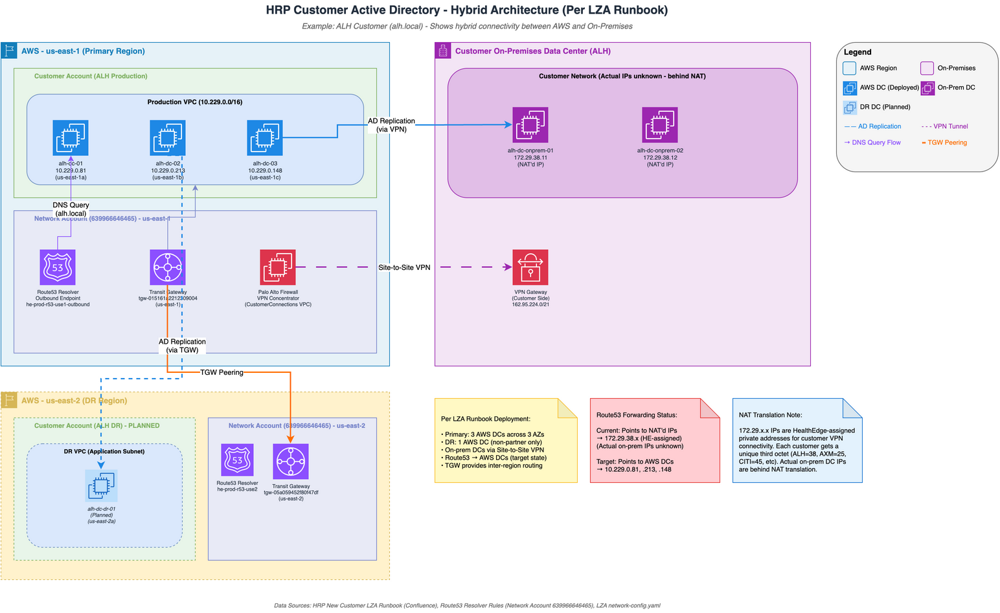
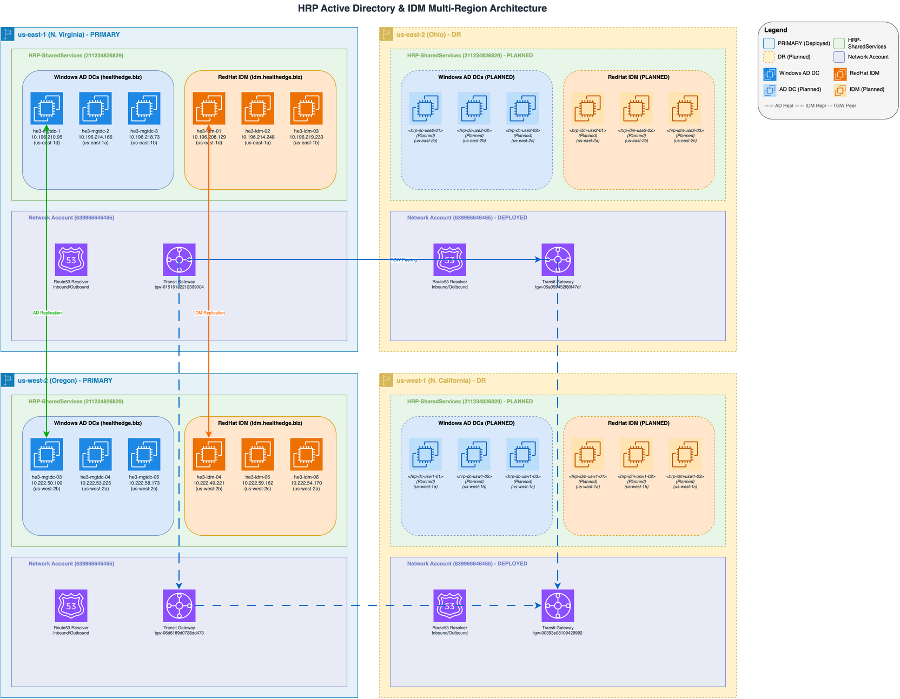

# HRP Active Directory, RedHat IDM, and DNS Disaster Recovery Design

**Confluence Page:** https://healthedge.atlassian.net/wiki/spaces/CP1/pages/5273092122/HRP%20Active%20Directory%2C%20RedHat%20IDM%2C%20and%20DNS%20Disaster%20Recovery%20Design

**Created by:** John Cousens on November 25, 2025  
**Last modified by:** Chris Falk on December 19, 2025 at 05:36 PM

---

none

**Related Documentation:**

> * DNS Decision Design - Authoritative DNS architecture and forwarding rules
> * Landing Zone Network Design - VPC, TGW, and network infrastructure details

> **Important Clarifications:**
>
> * **Primary Regions:** Both us-east-1 AND us-west-2 are PRIMARY regions (not primary/secondary)
> * **HRP Customer AD:** Customer AD servers are deployed in **customer production accounts**, NOT shared services
> * **Network Firewalls:** HRP uses both AWS Network Firewall (traffic inspection) AND Palo Alto Firewalls (VPN concentration and NAT for customer VPNs only)
> * **HRP Access Model:** Nothing in HRP is public-facing - all access is customer-facing over VPN, even if public DNS is involved

> 📋 **ACTION REQUIRED:** See Next Steps - Prioritized Action Plan for implementation checklist with owners and timelines.

---

Infrastructure Verification Status (Dec 12, 2025)
-------------------------------------------------

### HRP Windows AD Domain Controllers

**Primary East Coast (us-east-1):** 3 DCs across 3 AZs ✅ **DEPLOYED**  
**Primary West Coast (us-west-2):** 3 DCs across 3 AZs ⚠️ **PENDING DCPROMO**

**Data Source:** AWS Account `211234826829` (HRP-SharedServices) - [EC2 Console](https://us-east-1.console.aws.amazon.com/ec2/home?region=us-east-1#Instances:tag:Name=he3-mgtdc)

### HRP RedHat IDM Servers

**Primary East Coast (us-east-1):** 3 IDM servers across 3 AZs ✅ **DEPLOYED**  
**Primary West Coast (us-west-2):** 3 IDM servers across 3 AZs ⚠️ **PENDING CONFIGURATION**

**Data Source:** AWS Account `211234826829` (HRP-SharedServices) - [EC2 Console us-east-1](https://us-east-1.console.aws.amazon.com/ec2/home?region=us-east-1#Instances:tag:Name=he3-idm) | [EC2 Console us-west-2](https://us-west-2.console.aws.amazon.com/ec2/home?region=us-west-2#Instances:tag:Name=he3-idm)

### Status Summary

| Service | us-east-1 (PRIMARY) | us-west-2 (PRIMARY) | us-east-2 (DR) | us-west-1 (DR) |
| --- | --- | --- | --- | --- |
| Windows AD (<http://healthedge.biz> ) | ✅ 3 DCs | 🟡 3 DCs (pending DCPROMO) | 🟡 3 DCs (Planned) | 🟡 2 DCs (Planned) |
| RedHat IDM ([idm.healthedge.biz](http://idm.healthedge.biz)) | ✅ 3 Servers | 🟡 3 Servers (pending config) | 🟡 3 Servers (Planned) | 🟡 2 Servers (Planned) |
| Transit Gateway | ✅ Deployed | ✅ Deployed | ✅ Deployed | ✅ Deployed |
| TGW Peering (Full Mesh) | ✅ 3 peerings | ✅ 3 peerings | ✅ 3 peerings | ✅ 3 peerings |
| Route53 Resolver | ✅ Operational | ✅ Operational | ✅ Operational | ✅ Operational |
| Forwarding Rules | ✅ 16 rules | ✅ 10 rules | ✅ 16 rules | ✅ 10 rules |

**DR Readiness**: Network infrastructure is fully deployed in all 4 regions. AD/IDM servers only exist and are fully functional in us-east-1.

---

Automated Validation Results (AWSM-1144)
----------------------------------------

**JIRA Ticket:** [AWSM-1144](https://healthedge.atlassian.net/browse/AWSM-1144)  
**Validation Date:** December 12, 2025  
**Pass Rate:** 100% (39/39 checks passed)

### Executive Summary

AD is will be multi-region. **No failover orchestration required** for DR operations - authentication services remain available during a regional failure without requiring explicit failover procedures.

### Acceptance Criteria Validation

| Criteria | Status | Evidence |
| --- | --- | --- |
| AD domain controllers verified in all regions | 🟡 Pending 3 regions completion | 3 DCs in us-east-1 |
| RedHat IDM servers verified in all regions | 🟡 Pending 3 regions completion | 3 IDM servers in us-east-1 |
| Route 53 forwarder configurations confirmed | 🟡 Pass but need updates when new DCs promoted | Forwarding rules for <http://healthedge.biz> , [idm.healthedge.biz](http://idm.healthedge.biz), customer domains |
| AD replication status tracked | ✅ PASS | Multi-region deployment enables native AD replication |
| No failover orchestration required | ✅ PASS | AD and IDM already multi-region |

### HRP Domain Controller Validation

**Primary East Coast (us-east-1) - 3 DCs across 3 AZs:**

| DC Name | Instance ID | IP Address | AZ | Status |
| --- | --- | --- | --- | --- |
| he3-mgtdc-1 | i-087375866dd0bd64c | 10.196.210.95 | us-east-1d | ✅ Running |
| he3-mgtdc-2 | i-01506f4f9a828e547 | 10.196.214.166 | us-east-1a | ✅ Running |
| he3-mgtdc-3 | i-0c254921c194fa949 | 10.196.218.73 | us-east-1b | ✅ Running |

**Primary West Coast (us-west-2) - 3 DCs across 3 AZs:**

| DC Name | Instance ID | IP Address | AZ | Status |
| --- | --- | --- | --- | --- |
| he3-mgtdc-03 | i-04e193093bf2e7b6c | 10.222.50.100 | us-west-2b | 🟡 Not promoted |
| he3-mgtdc-04 | i-00e77b62d7ee58202 | 10.222.53.225 | us-west-2a | 🟡 Not promoted |
| he3-mgtdc-05 | i-0466e4d35b8675803 | 10.222.58.173 | us-west-2c | 🟡 Not promoted |

### Route53 Resolver Validation

**Resolver Endpoints:**

| Region | Endpoint Type | Name | ID | Status |
| --- | --- | --- | --- | --- |
| us-east-1 | Inbound | he-prod-r53-use1-inbound | rslvr-in-493b9cdb79544ad6a | ✅ Operational |
| us-east-1 | Outbound | he-prod-r53-use1-outbound | rslvr-out-15dd1c166e0744f9b | ✅ Operational |
| us-west-2 | Inbound | he-prod-r53-usw2-inbound | rslvr-in-b009fe8f8bea494da | ✅ Operational |
| us-west-2 | Outbound | he-prod-r53-usw2-outbound | rslvr-out-b74939a8fe264ff09 | ✅ Operational |

**Forwarding Rules Validated:**

* ✅ [healthedge.biz](http://healthedge.biz) (HRP Windows AD domain) - Both regions
* ✅ [idm.healthedge.biz](http://idm.healthedge.biz) (HRP RedHat IDM domain) - Both regions
* ✅ [headquarters.healthedge.com](http://headquarters.healthedge.com) (Corporate) - us-east-1
* Customer forwarding rules and AD servers to exist only in east or west region pairs where that customer is deployed and has DR

### Key Findings

1. **AD is Multi-Region by Design**: Domain controllers are deployed in both us-east-1 and us-west-2, providing inherent high availability across the primary regions.
2. **IDM is Multi-Region by Design**: RedHat IDM servers are deployed in both us-east-1 and us-west-2, providing inherent high availability for Linux authentication.
3. **No Failover Orchestration Required**: Since AD and IDM are already multi-region, authentication services remain available during a regional failure without requiring explicit failover procedures.
4. **Route53 Resolver Integration**: DNS forwarding rules are configured to route AD DNS queries (<http://healthedge.biz> ) and IDM DNS queries ([idm.healthedge.biz](http://idm.healthedge.biz)) to the appropriate servers in each region.
5. **AZ Distribution**: Domain controllers and IDM servers are distributed across multiple Availability Zones within each region for local high availability.

### Recommendations

1. Continue monitoring AD and IDM replication health between regions
2. Validate DNS resolution from workloads in both regions periodically
3. Document the multi-region AD/IDM architecture for operations teams
4. Consider deploying DCs in DR regions (us-east-2, us-west-1) for additional resilience

### Validation Script

**Script Location:** `scripts/ad_dns_dr_validation.py` in the AgenticAI repository

The validation script automates verification of AD, IDM, and Route53 infrastructure across all regions.

---

RedHat Identity Management (IDM) DR Strategy
--------------------------------------------

### Overview

HRP uses **RedHat Identity Management (IDM/FreeIPA)** for Linux authentication services, complementing Windows Active Directory for Windows workloads.

**Detailed IDM Documentation:**

* IDM Notes - Architecture and authentication flow
* IDM Implementation Steps - Customer onboarding
* IDM Playbooks - Ansible automation
* IDM Post-Install Configuration - Server setup
* IDM Client Install - Client deployment
* [RedHat FreeIPA Documentation](https://access.redhat.com/documentation/en-us/red_hat_enterprise_linux/8/html/installing_identity_management/index) - Official RedHat docs

**Data Source:** AWS Account `211234826829` (HRP-SharedServices)

### Current IDM Deployment Status (Verified Dec 12, 2025)

| Region | Servers | IPs | Status |
| --- | --- | --- | --- |
| us-east-1 (PRIMARY) | he3-idm-01, 02, 03 | 10.196.208.129, .214.248, .219.233 | ✅ Running |
| us-west-2 (PRIMARY) | he3-idm-04, 05, 06 | 10.222.49.221, .59.162, .54.170 | 🟡 Not configured |
| us-east-2 (DR) | Planned | TBD | 🟡 Not deployed |
| us-west-1 (DR) | Planned | TBD | 🟡 Not deployed |

### IDM DR Key Points

1. **Multi-Region by Design:** IDM is already deployed in both PRIMARY regions (us-east-1 + us-west-2) with multi-master replication - **no failover orchestration required**.
2. **CA Renewal Master:** Currently `he2-idm-01.idm.healthedge.biz` (us-west-2) - good for DR as CA operations survive us-east-1 failure.
3. **Route53 Integration:** DNS forwarding rules route `idm.healthedge.biz` queries to local IDM servers per region.
4. **Architecture Alignment:** HRP's 6-server topology (3 per region, 3 AZs each) exceeds RedHat's minimum recommendation of 2-3 replicas per site.

### IDM DR Action Items

| Item | Status | Notes |
| --- | --- | --- |
| IDM servers in both PRIMARY regions | ✅ Complete | 6 servers total |
| Route53 forwarding configured | 🟡 Update needed after expansion to all four regions |  |
| Add us-west-2 IPs to all forwarding rules | ⚠️ Recommended | Improve AWS-side redundancy |
| Deploy IDM in DR regions | 🟡 Planned | us-east-2, us-west-1 |
| Verify replication health | ⚠️ TBD | Run `ipa topologysegment-find domain` |
| Verify chrony/NTP time sync | ⚠️ TBD | Required for Kerberos |

### IDM DR Architecture (Current State)


```
┌─────────────────────────────────────────────────────────────────────────────┐
│                       IDM Multi-Region Topology                             │
├─────────────────────────────────────────────────────────────────────────────┤
│                                                                             │
│   us-east-1 (PRIMARY)                    us-west-2 (PRIMARY)                │
│   ┌─────────────────────┐                ┌─────────────────────┐            │
│   │  he3-idm-01 (1d)    │                │  he3-idm-04 (2b)    │            │
│   │  he3-idm-02 (1a)    │◄──────────────►│  he3-idm-05 (2c)    │            │
│   │  he3-idm-03 (1b)    │  Replication   │  he3-idm-06 (2a)    │            │
│   └─────────────────────┘                └─────────────────────┘            │
│          │                                      │                           │
│          ▼                                      ▼                           │
│   Route53 Resolver                       Route53 Resolver                   │
│   idm.healthedge.biz                     idm.healthedge.biz                 │
│                                                                             │
└─────────────────────────────────────────────────────────────────────────────┘
```


### IDM DR Architecture (Future State - Planned)


```
┌─────────────────────────────────────────────────────────────────────────────────────────────┐
│                           IDM Multi-Region Topology (Future)                                │
├─────────────────────────────────────────────────────────────────────────────────────────────┤
│                                                                                             │
│   us-east-1 (PRIMARY)                                    us-west-2 (PRIMARY)                │
│   ┌─────────────────────┐                                ┌─────────────────────┐            │
│   │  he3-idm-01 (1d)    │                                │  he3-idm-04 (2b)    │            │
│   │  he3-idm-02 (1a)    │◄──────────────────────────────►│  he3-idm-05 (2c)    │            │
│   │  he3-idm-03 (1b)    │         Replication            │  he3-idm-06 (2a)    │            │
│   └─────────────────────┘                                └─────────────────────┘            │
│          │ ▲                                                    │ ▲                         │
│          │ │                                                    │ │                         │
│          ▼ │                                                    ▼ │                         │
│   us-east-2 (DR)                                         us-west-1 (DR)                     │
│   ┌─────────────────────┐                                ┌─────────────────────┐            │
│   │  he3-idm-07 (2a)    │                                │  he3-idm-10 (1a)    │            │
│   │  he3-idm-08 (2b)    │◄──────────────────────────────►│  he3-idm-11 (1b)    │            │
│   │  he3-idm-09 (2c)    │         Replication            │  he3-idm-12 (1c)    │            │
│   └─────────────────────┘                                └─────────────────────┘            │
│          │                                                      │                           │
│          ▼                                                      ▼                           │
│   Route53 Resolver                                       Route53 Resolver                   │
│   idm.healthedge.biz                                     idm.healthedge.biz                 │
│                                                                                             │
│   Legend: ◄──► = IDM Multi-Master Replication (Full Mesh)                                   │
│                                                                                             │
└─────────────────────────────────────────────────────────────────────────────────────────────┘
```


> 🟡 **PLANNED:** DR regions (us-east-2, us-west-1) IDM servers are not yet deployed. Server names (he3-idm-07 through he3-idm-12) are placeholders pending deployment.

> **Best Practices Assessment:** HRP's IDM architecture is **aligned with RedHat FreeIPA best practices**. See [RedHat FreeIPA Documentation](https://access.redhat.com/documentation/en-us/red_hat_enterprise_linux/8/html/installing_identity_management/index) for detailed DR guidance.

### 🔴 CRITICAL: Forwarding Rule Gap - VERIFIED

**Verified Dec 12, 2025 via AWS API:**

| Region | <http://healthedge.biz> Forwarding Rule Targets | Issue |
| --- | --- | --- |
| us-east-1 | 10.196.210.95, 10.196.214.166, 10.196.218.73 (LOCAL us-east-1 DCs) | ✅ Correct |
| us-west-2 | 10.196.210.95, 10.196.214.166, 10.196.218.73 (us-east-1 DCs) | ⚠️**NOT LOCAL** |
| us-east-2 | 10.196.210.95, 10.196.214.166, 10.196.218.73 (us-east-1 DCs) | Expected (no DR DCs) |
| us-west-1 | 10.196.210.95, 10.196.214.166, 10.196.218.73 (us-east-1 DCs) | Expected (no DR DCs) |

**Gap:** us-west-2 `healthedge.biz` forwarding rule targets **us-east-1 DCs** instead of local us-west-2 DCs (10.222.50.100, 10.222.53.225, 10.222.58.173).

**Impact:** If us-east-1 becomes unavailable, us-west-2 workloads will lose DNS resolution for `healthedge.biz` even though local DCs exist.

**Recommendation:** Update us-west-2 forwarding rule to target LOCAL us-west-2 DCs:

* 10.222.50.100 (he3-mgtdc-03)
* 10.222.53.225 (he3-mgtdc-04)
* 10.222.58.173 (he3-mgtdc-05)

---

### IDM DNS Forwarding Gap - ⚠️ VERIFIED GAP

**Verified Dec 12, 2025 via AWS API:**

| Region | [idm.healthedge.biz](http://idm.healthedge.biz) Forwarding Rule Targets |
| --- | --- |
| us-east-1 | 10.196.219.233 (he3-idm-03), 10.51.254.199, 10.51.254.105 (on-prem) |
| us-west-2 | 10.196.219.233 (he3-idm-03), 10.51.254.199, 10.51.254.105 (on-prem) |
| us-east-2 | Same as above (targets us-east-1) |
| us-west-1 | Same as above (targets us-east-1) |

**Gap:** us-west-2 IDM servers (10.222.49.221, 10.222.59.162, 10.222.54.170) are **NOT** in any forwarding rules.

**Recommendation:** Add us-west-2 IDM IPs to forwarding rules for improved AWS-side redundancy and local resolution in us-west-2.

---

IDM Authentication & Operations
-------------------------------

For detailed IDM authentication architecture, SSSD configuration, sudo management, and operational procedures, see:

* **IDM Notes** - Authentication flow, SSSD configuration, sudo management
* **IDM Implementation Steps** - Customer onboarding procedures
* **IDM Playbooks** - Ansible automation for SSSD updates
* **IDM Client Install** - Individual server deployment

**Key Points:**

* IDM provides centralized sudo management (no hardcoded sudoers files)
* Account propagation: ~20 seconds (vs 12+ hours with legacy approach)
* SSSD server affinity configured for local IDM server preference
* Escalation contacts: Thomas Olmsted, Sean McLaughlin

---

HRP Customer AD Connectivity (On-Premises Integration)
------------------------------------------------------

HRP operates a **multi-tenant SaaS platform** where each customer has a **separate Active Directory forest** with hybrid connectivity to their on-premises infrastructure via Palo Alto Site-to-Site VPN.

### Customer AD Hybrid Architecture Diagram



*Figure: HRP Customer AD hybrid deployment showing AWS DCs in primary/DR regions with on-premises DC connectivity via Site-to-Site VPN.*

**Diagram Source:**

### Customer AD Architecture Overview

**Reference:** HRP New Customer LZA Active Directory, DNS, Firewall Runbook

**Architecture Pattern (Per LZA Runbook):**

* **AWS DCs (Primary Region):** 3 domain controllers across 3 AZs in customer production VPC
* **AWS DCs (DR Region):** 1 domain controller in application subnet (non-partner deployments)
* **On-Prem DCs:** Customer's existing on-premises domain controllers
* **Connectivity:** Site-to-Site VPN via Palo Alto firewalls for AD replication

**Customer AD Deployment Status:**

| Customer | AD Domain | AWS DCs (Target) | NAT'd On-Prem IPs (HE-Assigned) | Current Route53 Target | Status |
| --- | --- | --- | --- | --- | --- |
| ALH | alh.local | 10.229.0.81, .213, .148 | 172.29.38.11, .12 | NAT'd IPs | ⚠️ Verify |
| AXM | axm.local | TBD | 172.29.25.11, .12 | NAT'd IPs | ⚠️ Verify |
| CITI | citi.local | TBD | 172.29.45.11, .12 | NAT'd IPs | ⚠️ Verify |
| FRSO | frso.local | TBD | 172.29.60.11, .12 | NAT'd IPs | ⚠️ Verify |
| ATR | atr.local | TBD | 172.29.37.11, .12 | NAT'd IPs | ⚠️ Verify |
| UST | ust.local | TBD | 172.29.29.11, .12 | NAT'd IPs | ⚠️ Verify |
| EDIF | edif.local | TBD | 172.29.54.11, .12 | NAT'd IPs | ⚠️ Verify |
| WIP | wip.local | TBD | 172.19.30.11, .12 | NAT'd IPs | ⚠️ Verify |

**Data Source:** Route53 Resolver Rules from AWS Account `639966646465` (Network Account) - [Route53 Resolver Console](https://us-east-1.console.aws.amazon.com/route53resolver/home?region=us-east-1#/rules)

### Customer AD Deployment Process (Runbook - HRP New Customer LZA Active Directory, DNS, Firewall)

The runbook defines a phased deployment where Route53 initially targets on-prem, then switches to AWS:

1. **Deploy AWS AD EC2 instances** - 3 DCs in primary region, 1 DC in DR region
2. **Create Route53 forwarding rules** - Initially target on-prem DCs
3. **Join AWS servers to domain** - DCPROMO to promote as domain controllers
4. **Update Route53 rules** - Switch targets from on-prem to AWS DCs

### Customer AD DR Considerations

**Hybrid Architecture Benefits:**

* AWS DCs provide local authentication for AWS workloads
* On-prem DCs serve customer's on-premises infrastructure
* AD replication keeps both environments synchronized via VPN

**DR Impact Analysis:**

| Failure Scenario | Impact | Mitigation |
| --- | --- | --- |
| AWS Region Failure | ⚠️ AWS workloads lose local DC | Failover to on-prem DCs via VPN |
| VPN Tunnel Failure | ⚠️ Replication paused | AWS DCs continue serving AWS workloads |
| On-Prem DC Failure | ⚠️ On-prem auth affected | AWS DCs unaffected |
| Both AWS + On-Prem Fail | ❌**CRITICAL** | Complete customer AD outage |

**Action Items:**

* [ ] Verify AWS customer DCs exist in customer accounts (EC2 instances)
* [ ] Verify Route53 forwarding rules target AWS DCs (not just on-prem)
* [ ] Document customer-specific DR regions and DC counts

### Customer On-Premises Connectivity

Each HRP customer connects to AWS via **Site-to-Site VPN** terminating on shared Palo Alto firewall VPN concentrators:

**Network Account (639966646465):**

* **Palo Alto Firewalls (us-east-1):**

  + i-0d29bd1e48bae39f6 (PaloAltoFirewall1UsEast1) - us-east-1a
  + i-0ca3b5865cba59e2a (PaloAltoFirewall2UsEast1) - us-east-1b
* **VPN Configuration:** Customer-specific VPN tunnels with dedicated CIDRs
* **Firewall Rules:** Customer isolation enforced via Palo Alto policy

**DNS Resolution Flow (Customer → AWS):**

1. Customer on-prem workload queries customer AD domain (e.g., `alh.local`)
2. Query routes via VPN to AWS
3. Route53 Resolver Outbound forwards to AWS customer DCs
4. AWS DCs replicate with on-prem DCs via AD replication over VPN

**DNS Resolution Flow (AWS → Customer On-Prem):**

1. AWS workload queries customer AD domain
2. Route53 Resolver Outbound Endpoint forwards query
3. Forwarding rule targets customer on-prem DCs (or AWS DCs post-migration)
4. Response returns via same path

### Customer AD DR Considerations

* **Hybrid Replication:** AD replication between AWS and on-prem DCs requires VPN connectivity
* **VPN Dependency:** Customer authentication depends on VPN tunnel availability
* **Independent DR:** Each customer forest requires separate DR planning
* **No Cross-Customer Replication:** Customer domains are isolated forests

---

Implementation Plan
-------------------

### Phase 1: DR Infrastructure and Services

**Reference:** HRP New Customer LZA Active Directory, DNS, Firewall Runbook - Same process applies for DR DC deployment.

**High-Level Steps:**

1. Deploy EC2 instances via CDK/LZA to DR region application subnets
2. Update LZA `network-config.yaml` (IPSets, firewall rules, Route53 forwarding)
3. Join to domain and DCPROMO to promote as domain controllers
4. Configure AD Sites & Services for new region
5. Update Route53 forwarding rules to target new DCs
6. Validate AD/SYSVOL replication between regions

### Phase 2: Testing and Validation

1. Conduct failover testing
2. Validate authentication services and DNS resolution
3. Document procedures and runbooks

DR Testing Strategy
-------------------

> **Note:** The bubble test approach described below is **OPTIONAL** and may not be the direction taken for DR testing.

### Bubble Test Isolation (OPTIONAL)

**Purpose:** Validate AD recovery procedures without risk to production using NACL-based network isolation.

> ⚠️ **Open Question:** Would bubble testing use a NEW isolated VPC, or modify NACLs on existing DR VPCs?

**Process Overview:**

1. **DC Preservation:** Shutdown DR DCs, create AMI backups with launch templates
2. **Network Isolation:** Apply NACLs to ALLOW AD ports from DR VPC CIDR, DENY ALL traffic to/from production CIDRs
3. **Test Execution:** Validate authentication independently from production

**Key Principle**: Explicit DENY rules block ALL production traffic, ensuring zero synchronization risk.

DR Implementation Path - Full Regional Coverage
-----------------------------------------------

### Current State vs Target State

| Component | us-east-1 | us-east-2 | us-west-2 | us-west-1 |
| --- | --- | --- | --- | --- |
| **Windows AD DCs** | ✅ 3 DCs | ❌ 0 DCs | ✅ 3 DCs | ❌ 0 DCs |
| **RedHat IDM Servers** | ✅ 3 Servers | ❌ 0 Servers | ✅ 3 Servers | ❌ 0 Servers |
| **Transit Gateway** | ✅ Deployed | ✅ Deployed | ✅ Deployed | ✅ Deployed |
| **TGW Peering** | ✅ Full Mesh | ✅ Full Mesh | ✅ Full Mesh | ✅ Full Mesh |
| **Route53 Resolver** | ✅ Operational | ✅ Operational | ✅ Operational | ✅ Operational |

**Target State:** Deploy AD/IDM servers in DR regions to enable full regional failover.

### Implementation Phases

See **Implementation Plan** section above for detailed deployment steps. References:

* HRP New Customer LZA Runbook - AD DC deployment
* [RedHat FreeIPA Replica Installation](https://access.redhat.com/documentation/en-us/red_hat_enterprise_linux/8/html/installing_identity_management/installing-an-ipa-replica_installing-identity-management) - IDM deployment
* 5-7-Decision-DNS-Design - Route53 forwarding rules

**Gap Identified:** us-west-2 IDM servers NOT in any forwarding rules - recommend adding for redundancy.

### Validation Checklist

| Check | Command/Action | Expected Result |
| --- | --- | --- |
| AD replication | `repadmin /replsummary` | No errors |
| IDM replication | `ipa topologysegment-find` | All segments healthy |
| DNS forwarding | `nslookup healthedge.biz` from DR | Returns LOCAL DR DC IPs |
| Authentication | Domain login from DR workload | Success |

### Implementation Timeline

| Phase | Duration | Dependencies | Owner |
| --- | --- | --- | --- |
| Phase 1: Windows AD DCs | 2-3 weeks | VPC subnets in DR regions | Infrastructure Team |
| Phase 2: RedHat IDM | 2-3 weeks | Phase 1 complete | Infrastructure Team |
| Phase 3: Route53 Updates | 1 week | Phase 1 & 2 complete | Network Team |
| Phase 4: Security Groups | 1 week | Parallel with Phase 1 | Security Team |
| Phase 5: Validation | 2 weeks | All phases complete | All Teams |

**Total Estimated Duration:** 8-10 weeks

---

### Risk Mitigation

| Risk | Mitigation |
| --- | --- |
| AD replication failures | Test replication before cutover, monitor with CloudWatch |
| IDM CA replication issues | Verify CA replication separately, have rollback plan |
| DNS resolution delays | Configure appropriate TTLs, test from multiple VPCs |
| FSMO role conflicts | Document role holders, test seizure procedures |

---

### 📊 Current Monitoring (Ongoing)

| Check | Tool | Frequency |
| --- | --- | --- |
| DC health | CloudWatch metrics | Daily |
| AD replication | `repadmin /replsummary` | Weekly |
| IDM replication | `ipa topologysegment-find` | Weekly |
| Network connectivity | Ping/traceroute between regions | Weekly |

---

**Estimated Total Duration:** 8-10 weeks

**Key Dependencies:**

* Priority 2 depends on Priority 1 completion (verification)
* Priority 3 depends on Priority 2 completion (DC deployment)
* Priority 4 depends on Priority 3 completion (DNS configuration)

Architecture Diagram
--------------------

**Multi-Region AD/DNS Topology**



*Figure 1: Comprehensive four-region Active Directory and DNS architecture showing HRP domain controllers, IDM servers, replication links, Route53 Resolver endpoints, and Transit Gateway connectivity across all 4 AWS regions.*

**Diagram Source**:

**Diagram Legend:**

* 🟢 **Green** = Deployed and operational
* 🟡 **Yellow** = Planned (not yet deployed)

### Diagram Components

See **Infrastructure Verification Status** section for detailed DC/IDM server listings and **Automated Validation Results** for Route53 Resolver endpoint IDs.

**Key Infrastructure IDs:**

| Component | us-east-1 | us-west-2 | us-east-2 | us-west-1 |
| --- | --- | --- | --- | --- |
| Transit Gateway | tgw-015161a2212309004 | tgw-06d6189d0728dd473 | tgw-05a059452f80f47df | tgw-00393e08109429992 |

**DNS Domains:** (Windows AD), [idm.healthedge.biz](http://idm.healthedge.biz) (RedHat IDM), customer domains (\*.local)

---

Appendices
----------

Appendix A: Referenced Documentation
------------------------------------

### Confluence Documentation

| Document | Purpose |
| --- | --- |
| 5.4 Multi-Account Network Design | VPC, TGW, network architecture |
| 5.9 Transit Gateway Design | TGW route tables, inter-region connectivity |
| 5-7-Decision-DNS-Design | **PRIMARY** - Route53 Resolver configuration |
| 5.1 IP Addressing | Subnet allocation, CIDR blocks |
| HRP New Customer LZA Runbook | DC deployment via LZA/CDK |

### AWS Console Links

| Resource | Account | Link |
| --- | --- | --- |
| HRP Domain Controllers | 211234826829 | [EC2 Console](https://console.aws.amazon.com/ec2/v2/home?region=us-east-1#Instances:tag:Role=DomainController) |
| HRP Security Groups | 211234826829 | [Security Groups](https://console.aws.amazon.com/ec2/v2/home?region=us-east-1#SecurityGroups:search=he-global-sg-win) |
| Network Security Groups | 639966646465 | [Security Groups](https://console.aws.amazon.com/ec2/v2/home?region=us-east-1#SecurityGroups:) |
| Palo Alto Firewalls | 639966646465 | [EC2 Console](https://console.aws.amazon.com/ec2/v2/home?region=us-east-1#Instances:tag:Name=PaloAlto) |

---

Appendix B: IDM Operational Documentation
-----------------------------------------

For detailed IDM procedures, refer to the authoritative Confluence documentation:

| Topic | Confluence Page |
| --- | --- |
| Customer Onboarding | IDM Implementation Steps |
| Ansible Playbooks | IDM Playbooks |
| Operational Procedures | IDM Processes |
| Server Configuration | IDM Post-Install Configuration |
| Client Installation | IDM Client Install |

**Scripts Location:** `\\\\healthedge.biz\\share\\infra_share\\Scripts\\Powershell`  
**Ansible Location:** `/ansible/IDM` on `he1-infjen-pr001`