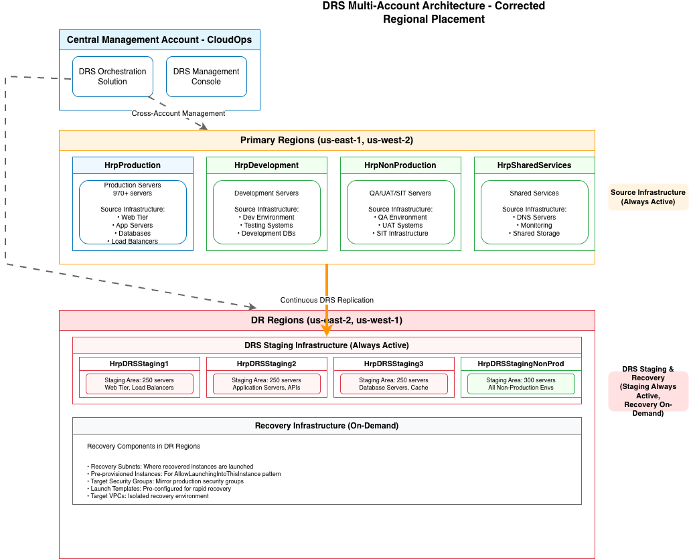
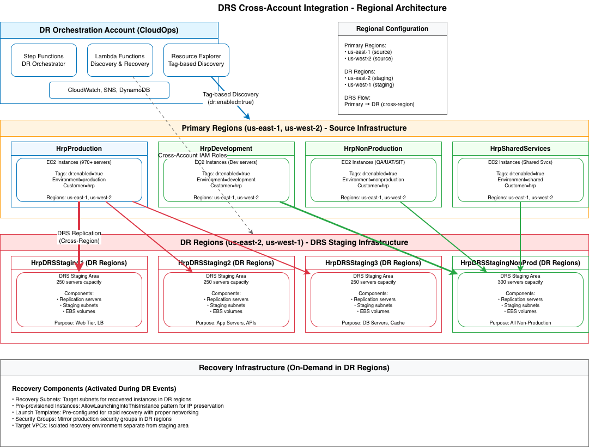

# AWS DRS Account Vending Design Document

**Confluence Page:** https://healthedge.atlassian.net/wiki/spaces/CP1/pages/5352259655/AWS%20DRS%20Account%20Vending%20Design%20Document

**Created by:** Venkata Kommuri on December 15, 2025  
**Last modified by:** Venkata Kommuri on December 19, 2025 at 07:11 PM

---

Executive Summary
-----------------

This document outlines the design for implementing AWS Elastic Disaster Recovery (DRS) account vending using the Landing Zone Accelerator (LZA) framework. Based on analysis of server requirements and AWS DRS service limitations, this design addresses the need for **4 DRS staging accounts** to support 1,000+ servers across production and non-production environments.

### Key Requirements from Analysis

**Server Count Requirements:**

* **Production**: 970+ servers in HrpProduction account (us-east-1 + us-west-2) → **3 accounts needed**
* **Non-Production**: 1,035+ servers distributed across multiple HRP accounts → **1 account needed** (consolidated)

  + HrpDevelopment: Development environment servers
  + HrpNonProduction: QA, UAT, SIT environment servers
  + HrpSharedServices: Shared services and infrastructure servers
* **Total**: **4 DRS staging accounts** required

**AWS DRS Hard Limits:**

* **300 replicating servers per account per region** (cannot be increased)
* **100 servers per recovery job** (hard limit)
* **20 concurrent jobs per account** (soft limit)

**Regional Configuration:**

* **Primary Regions**: us-east-1, us-west-2
* **DR Regions**: us-east-2, us-west-1

Architecture Overview
---------------------

### Multi-Account DRS Architecture

***Architecture Diagram***



### Account Distribution Strategy

| Account Name | Environment | Server Range | Capacity | Regions |
| --- | --- | --- | --- | --- |
| HrpDRSStaging1 | Production | 1-250 | 250/300 (83%) | us-east-1, us-west-2 |
| HrpDRSStaging2 | Production | 251-500 | 250/300 (83%) | us-east-1, us-west-2 |
| HrpDRSStaging3 | Production | 501-750 | 250/300 (83%) | us-east-1, us-west-2 |
| HrpDRSStagingNonProd | Non-Production | 1-300 | 300/300 (100%) | us-east-1, us-west-2 |

**Design Note:** Each account is provisioned at 83% capacity (250/300 servers), leaving 50 servers of headroom per account for growth.

Landing Zone Accelerator Integration
------------------------------------

### 1. Organizational Unit Structure

Based on the current LZA configuration, DRS accounts will be placed under the existing Workloads OU structure:


```
organizationalUnits:
  - name: Security
  - name: Infrastructure  
  - name: Sandbox
  - name: Workloads                    # DRS accounts will be placed here
  - name: Workloads/Development
  - name: Workloads/Production
  - name: Workloads/NonProduction
  - name: Workloads/Common
  - name: Suspended
```


### 2. Account Configuration Updates

Add the following accounts to `accounts-config.yaml`:


```
workloadAccounts:
  # Existing accounts...
  
  # HRP DRS Staging Accounts
  - name: HrpDRSStaging1
    description: "HRP DRS Staging Account for Production Workloads (1-250 servers). Owner: CloudOps Team"
    email: aws+hrp-drs-staging-1@healthedge.com
    organizationalUnit: Workloads/Production
    warm: false
    
  - name: HrpDRSStaging2
    description: "HRP DRS Staging Account for Production Workloads (251-500 servers). Owner: CloudOps Team"
    email: aws+hrp-drs-staging-2@healthedge.com
    organizationalUnit: Workloads/Production
    warm: false
    
  - name: HrpDRSStaging3
    description: "HRP DRS Staging Account for Production Workloads (501-750 servers). Owner: CloudOps Team"
    email: aws+hrp-drs-staging-3@healthedge.com
    organizationalUnit: Workloads/Production
    warm: false

  # HRP Non-Production DRS Staging Account
  - name: HrpDRSStagingNonProd
    description: "HRP DRS Staging Account for All Non-Production Workloads (Dev, SIT, QA, UAT - up to 300 servers). Owner: CloudOps Team"
    email: aws+hrp-drs-staging-nonprod@healthedge.com
    organizationalUnit: Workloads/NonProduction
    warm: false
```


### 3. Network Configuration

See separate document HRP DRS Staging VPC Design

### 4. Security Configuration

Add DRS-specific security policies and roles:


```
# Add to security-config.yaml
iamConfig:
  roles:
    # Cross-account role for DRS staging accounts (CloudOps management)
    - name: DRSOrchestrationCrossAccountRole
      deploymentTargets:
        organizationalUnits:
          - Workloads/Production
          - Workloads/NonProduction
      assumedBy:
        - type: account
          principals:
            - "360783618952"  # CloudOps Account ID
      policies:
        awsManaged:
          - AWSElasticDisasterRecoveryReadOnlyAccess
        customerManaged:
          - DRSOrchestrationPolicy
    
    # CloudOps role for DRS orchestration and management
    - name: DRSCentralManagementRole
      deploymentTargets:
        accounts:
          - CloudOps  # Account ID: 360783618952
      assumedBy:
        - type: service
          principal: lambda.amazonaws.com
        - type: service
          principal: states.amazonaws.com
      policies:
        awsManaged:
          - AWSElasticDisasterRecoveryReadOnlyAccess
          - service-role/AWSLambdaBasicExecutionRole
        customerManaged:
          - DRSCentralManagementPolicy
          
  policies:
    # Policy for DRS staging accounts (allows CloudOps management)
    - name: DRSOrchestrationPolicy
      deploymentTargets:
        organizationalUnits:
          - Workloads/Production
          - Workloads/NonProduction
      policy: iam-policies/service-policies/drs-orchestration-policy.json
      
    # Policy for CloudOps central management
    - name: DRSCentralManagementPolicy
      deploymentTargets:
        accounts:
          - CloudOps
      policy: iam-policies/service-policies/drs-central-management-policy.json
```


Required IAM Policies for CloudOps DRS Management
-------------------------------------------------

### **DRS Orchestration Policy**

**File**: `platform.devops.aws.lza-config/iam-policies/service-policies/drs-orchestration-policy.json` **Purpose**: Allows CloudOps account to manage DRS staging accounts **Deployed to**: DRS staging accounts (HrpDRSStaging1, HrpDRSStaging2, HrpDRSStaging3)

#### **Key Permissions**:

* DRS staging account management (describe, configure templates)
* EC2 read access for DRS infrastructure
* IAM PassRole for DRS service roles
* CloudWatch Logs for DRS logging
* Regional restrictions (us-east-1, us-east-2, us-west-1, us-west-2)

### **DRS Central Management Policy**

**File**: `platform.devops.aws.lza-config/iam-policies/service-policies/drs-central-management-policy.json` **Purpose**: Allows CloudOps orchestration services (Lambda, Step Functions) to manage DRS **Deployed to**: CloudOps account (360783618952)

#### **Key Permissions**:

* Full DRS management (start recovery, failback, etc.)
* Cross-account role assumption
* EC2 management for recovery operations
* Resource Explorer for tag-based discovery
* Step Functions and Lambda execution
* CloudWatch Logs access

### **drs-orchestration-policy.json**


```
{
  "Version": "October 17, 2012",
  "Statement": [
    {
      "Sid": "DRSStagingAccountAccess",
      "Effect": "Allow",
      "Action": [
        "drs:DescribeSourceServers",
        "drs:DescribeJobs",
        "drs:DescribeRecoveryInstances",
        "drs:DescribeRecoverySnapshots",
        "drs:DescribeReplicationConfigurationTemplates",
        "drs:DescribeLaunchConfigurationTemplates",
        "drs:GetReplicationConfiguration",
        "drs:GetLaunchConfiguration",
        "drs:UpdateReplicationConfiguration",
        "drs:UpdateLaunchConfiguration",
        "drs:CreateLaunchConfigurationTemplate",
        "drs:UpdateLaunchConfigurationTemplate",
        "drs:DeleteLaunchConfigurationTemplate",
        "drs:CreateReplicationConfigurationTemplate",
        "drs:UpdateReplicationConfigurationTemplate",
        "drs:DeleteReplicationConfigurationTemplate",
        "drs:TagResource",
        "drs:UntagResource",
        "drs:ListTagsForResource"
      ],
      "Resource": "*",
      "Condition": {
        "StringEquals": {
          "aws:RequestedRegion": [
            "us-east-1", "us-east-2", "us-west-1", "us-west-2"
          ]
        }
      }
    },
    {
      "Sid": "EC2ReadAccessForDRS",
      "Effect": "Allow",
      "Action": [
        "ec2:DescribeInstances",
        "ec2:DescribeImages",
        "ec2:DescribeSnapshots",
        "ec2:DescribeVolumes",
        "ec2:DescribeSecurityGroups",
        "ec2:DescribeSubnets",
        "ec2:DescribeVpcs",
        "ec2:DescribeAvailabilityZones",
        "ec2:DescribeInstanceTypes",
        "ec2:DescribeLaunchTemplates",
        "ec2:DescribeLaunchTemplateVersions",
        "ec2:DescribeNetworkInterfaces"
      ],
      "Resource": "*"
    },
    {
      "Sid": "IAMPassRoleForDRSServices",
      "Effect": "Allow",
      "Action": ["iam:PassRole"],
      "Resource": [
        "arn:aws:iam::*:role/service-role/AWSElasticDisasterRecoveryReplicationServerRole",
        "arn:aws:iam::*:role/service-role/AWSElasticDisasterRecoveryConversionServerRole",
        "arn:aws:iam::*:role/service-role/AWSElasticDisasterRecoveryRecoveryInstanceRole"
      ]
    },
    {
      "Sid": "CloudWatchLogsAccess",
      "Effect": "Allow",
      "Action": [
        "logs:CreateLogGroup",
        "logs:CreateLogStream", 
        "logs:PutLogEvents",
        "logs:DescribeLogGroups",
        "logs:DescribeLogStreams"
      ],
      "Resource": "arn:aws:logs:*:*:log-group:/aws/drs/*"
    }
  ]
}

```


### **drs-central-management-policy.json**


```
{
  "Version": "October 17, 2012",
  "Statement": [
    {
      "Sid": "DRSCentralManagementAccess",
      "Effect": "Allow",
      "Action": [
        "drs:DescribeSourceServers",
        "drs:DescribeJobs",
        "drs:DescribeRecoveryInstances",
        "drs:DescribeRecoverySnapshots",
        "drs:DescribeReplicationConfigurationTemplates",
        "drs:DescribeLaunchConfigurationTemplates",
        "drs:StartRecovery",
        "drs:TerminateRecoveryInstances",
        "drs:StartFailbackLaunch",
        "drs:StopFailback",
        "drs:ReverseReplication",
        "drs:UpdateReplicationConfiguration",
        "drs:UpdateLaunchConfiguration",
        "drs:CreateLaunchConfigurationTemplate",
        "drs:UpdateLaunchConfigurationTemplate",
        "drs:DeleteLaunchConfigurationTemplate",
        "drs:CreateReplicationConfigurationTemplate",
        "drs:UpdateReplicationConfigurationTemplate",
        "drs:DeleteReplicationConfigurationTemplate",
        "drs:TagResource",
        "drs:UntagResource",
        "drs:ListTagsForResource",
        "drs:GetFailbackReplicationConfiguration",
        "drs:UpdateFailbackReplicationConfiguration"
      ],
      "Resource": "*"
    },
    {
      "Sid": "STSAssumeRoleForCrossAccount",
      "Effect": "Allow",
      "Action": ["sts:AssumeRole"],
      "Resource": [
        "arn:aws:iam::*:role/DRSOrchestrationCrossAccountRole",
        "arn:aws:iam::*:role/service-role/AWSElasticDisasterRecoveryReplicationServerRole",
        "arn:aws:iam::*:role/service-role/AWSElasticDisasterRecoveryConversionServerRole",
        "arn:aws:iam::*:role/service-role/AWSElasticDisasterRecoveryRecoveryInstanceRole"
      ]
    },
    {
      "Sid": "EC2ManagementForDRS",
      "Effect": "Allow",
      "Action": [
        "ec2:DescribeInstances",
        "ec2:DescribeImages",
        "ec2:DescribeSnapshots",
        "ec2:DescribeVolumes",
        "ec2:DescribeSecurityGroups",
        "ec2:DescribeSubnets",
        "ec2:DescribeVpcs",
        "ec2:DescribeAvailabilityZones",
        "ec2:DescribeInstanceTypes",
        "ec2:DescribeLaunchTemplates",
        "ec2:DescribeLaunchTemplateVersions",
        "ec2:CreateTags",
        "ec2:RunInstances",
        "ec2:TerminateInstances",
        "ec2:StopInstances",
        "ec2:StartInstances",
        "ec2:RebootInstances"
      ],
      "Resource": "*"
    },
    {
      "Sid": "ResourceExplorerAccess",
      "Effect": "Allow",
      "Action": [
        "resource-explorer-2:Search",
        "resource-explorer-2:GetView",
        "resource-explorer-2:ListViews"
      ],
      "Resource": "*"
    },
    {
      "Sid": "CloudWatchLogsAccess",
      "Effect": "Allow",
      "Action": [
        "logs:CreateLogGroup",
        "logs:CreateLogStream",
        "logs:PutLogEvents",
        "logs:DescribeLogGroups",
        "logs:DescribeLogStreams"
      ],
      "Resource": "arn:aws:logs:*:360783618952:log-group:/aws/drs/*"
    },
    {
      "Sid": "StepFunctionsAccess",
      "Effect": "Allow",
      "Action": [
        "states:StartExecution",
        "states:DescribeExecution",
        "states:DescribeStateMachine",
        "states:ListExecutions"
      ],
      "Resource": "arn:aws:states:*:360783618952:stateMachine:DRS-*"
    },
    {
      "Sid": "LambdaInvokeAccess",
      "Effect": "Allow",
      "Action": ["lambda:InvokeFunction"],
      "Resource": "arn:aws:lambda:*:360783618952:function:DRS-*"
    }
  ]
}

```


---

**IAM Configuration Mapping**
-----------------------------

### **Roles and Policies Deployment**

| Role | Account | Policy | Purpose |
| --- | --- | --- | --- |
| **DRSOrchestrationCrossAccountRole** | DRS Staging Accounts | DRSOrchestrationPolicy | CloudOps cross-account access |
| **DRSCentralManagementRole** | CloudOps Account | DRSCentralManagementPolicy | Lambda/Step Functions execution |

### **Policy Deployment Targets**

| Policy | Deployment Target | Accounts |
| --- | --- | --- |
| **DRSOrchestrationPolicy** | Workloads/Production, Workloads/NonProduction | HrpDRSStaging1, HrpDRSStaging2, HrpDRSStaging3 |
| **DRSCentralManagementPolicy** | CloudOps | 360783618952 |

---

### 5. Service Control Policies

Create DRS-specific SCPs for the DisasterRecovery OU:


```
# Add to organization-config.yaml
serviceControlPolicies:
  - name: DRS-Account-Guardrails
    description: >
      SCP to enforce DRS account usage patterns and prevent unauthorized actions
    policy: organization-policies/service-control-policies/drs-account-guardrails.json
    type: customerManaged
    deploymentTargets:
      organizationalUnits:
        - Workloads
```


Integration with DR Orchestration Architecture
----------------------------------------------

### Overview

This DRS account vending design integrates with the existing Guiding Care Disaster Recovery Orchestration system. The orchestration system provides tag-driven, automated disaster recovery across multiple customer environments using AWS Step Functions, Lambda, and Systems Manager.

### Key Integration Points

#### 1. Source Server Location

* **Production Source Servers**: Located in **HrpProduction** account (970+ servers)
* **Non-Production Source Servers**: Distributed across multiple HRP accounts:

  + **HrpDevelopment**: Development environment servers
  + **HrpNonProduction**: QA, UAT, SIT environment servers
  + **HrpSharedServices**: Shared services and infrastructure servers
* **Total Non-Production**: 1,035+ servers across all non-production accounts
* **Regions**: us-east-1 (primary), us-west-2 (primary)
* **DR Regions**: us-east-2, us-west-1

#### 2. Tag-Driven Discovery

The DR orchestration system uses AWS Resource Explorer for dynamic resource discovery based on tags:

**Required Tags for DRS Integration**:


```
# DR Orchestration Tags
dr:enabled: "true"                    # Identifies resources for DR orchestration
dr:priority: "critical|high|medium|low"  # Recovery priority classification
dr:wave: "1-N"                       # Wave number for ordered recovery
dr:recovery-strategy: "drs"          # Recovery method (DRS for EC2 instances)
dr:rto-target: "30"                  # Target recovery time (minutes)
dr:rpo-target: "30"                  # Target recovery point (minutes)

# Scoping Tags
Customer: "customer-name"            # Customer identifier for multi-tenant scoping
Environment: "production|nonproduction"  # Environment identifier
```


#### 3. Cross-Account Architecture

***Cross-Account Integration Diagram***



#### 4. Server Assignment Logic

The orchestration system automatically assigns servers to appropriate DRS staging accounts based on tags:


```
def assign_server_to_drs_account(server_metadata):
    """
    Assign server from HRP source accounts to appropriate DRS staging account
    """
    environment = server_metadata.get('Environment')
    tier = server_metadata.get('Tier', 'unknown')
    priority = server_metadata.get('dr:priority', 'medium')
    
    if environment.lower() == 'production':
        # Production servers distributed by tier
        if tier.lower() in ['web', 'frontend', 'lb'] or priority == 'critical':
            return 'HrpDRSStaging1'
        elif tier.lower() in ['app', 'api', 'middleware']:
            return 'HrpDRSStaging2'
        elif tier.lower() in ['db', 'database', 'cache']:
            return 'HrpDRSStaging3'
        else:
            return 'HrpDRSStaging1'  # Default for unknown tiers
    else:
        # All non-production goes to single account
        return 'HrpDRSStagingNonProd'
```


#### 5. Recovery Orchestration

The DR orchestration system coordinates recovery across all DRS staging accounts:

1. **Resource Discovery**: Uses AWS Resource Explorer to find all `dr:enabled=true` resources across HRP accounts (HrpProduction, HrpDevelopment, HrpNonProduction, HrpSharedServices)
2. **Account Assignment**: Automatically determines which DRS staging account protects each server
3. **Wave-Based Recovery**: Executes recovery in ordered waves based on `dr:wave` tags
4. **Cross-Account Coordination**: Manages recovery jobs across multiple DRS staging accounts simultaneously

#### 6. Pre-Provisioned Instance Strategy

Following the DR orchestration architecture pattern:

* **AllowLaunchingIntoThisInstance**: Pre-provisioned EC2 instances in DR regions
* **IP Preservation**: Last octet IP address preservation using ENI attachment
* **Name Tag Matching**: Primary-DR instance pairs identified by Name tags
* **Cost Optimization**: Pre-provisioned instances reduce recovery time and costs

### DRS Staging vs Recovery Infrastructure

It's important to understand the distinction between DRS staging and recovery infrastructure:

**DRS Staging Area (in DR regions):**

* **Location**: DR regions (us-east-2, us-west-1)
* **Purpose**: Where AWS DRS creates replication servers to receive and store replicated data
* **Components**:

  + Replication servers (managed by AWS DRS)
  + EBS volumes for storing replicated data
  + Staging area subnets for replication infrastructure
* **Always Active**: Continuously running to receive replication data from source servers

**Recovery Target (HrpProduction account in DR regions):**

* **Location**: HrpProduction account in DR regions (us-east-2, us-west-1)
* **Purpose**: Where recovered instances are launched during actual DR events
* **Components**:

  + Recovery VPCs and subnets in HrpProduction account
  + Pre-provisioned instances (for AllowLaunchingIntoThisInstance pattern)
  + Target security groups and networking in HrpProduction
  + Launch templates configured in HrpProduction account
* **On-Demand**: Only active during DR drills or actual recovery events

**Source Servers (in primary regions):**

* **Location**: Primary regions (us-east-1, us-west-2) in HRP source accounts
* **Purpose**: Production and non-production workloads being protected
* **Replication**: Continuously replicate data to DRS staging area in DR regions

#### Subnet Architecture in DRS Staging Accounts

* **DRS-Staging-Subnet**: Used exclusively for DRS replication servers and infrastructure
* **DRS-TGW-Subnet**: Used for Transit Gateway attachments and cross-account connectivity
* **Separation Purpose**: Isolates DRS traffic from general network traffic for better performance and security

DRS Console Configuration Guide
-------------------------------

### Prerequisites

* Account Setup: All 4 DRS staging accounts provisioned via LZA
* Network Connectivity: VPCs and Transit Gateway attachments configured
* IAM Roles: Cross-account roles deployed
* Central Management: CloudOps account configured as central management
* Source Servers: Source servers located in HrpProduction account

### Step 1: Initialize DRS in Each Staging Account

For each of the 4 DRS staging accounts, perform the following:

#### 1.1 Access the DRS Console


```
# Assume role into each staging account
aws sts assume-role \
  --role-arn arn:aws:iam::STAGING-ACCOUNT-ID:role/OrganizationAccountAccessRole \
  --role-session-name drs-setup-session
```


#### 1.2 Initialize DRS Service

1. Navigate to **AWS DRS Console** in each DR region (us-east-2, us-west-1)
2. Click **Initialize Elastic Disaster Recovery**
3. Configure replication settings:

   * **Staging area subnet**: Select DRS-Staging-Subnet-2a (us-east-2) or DRS-Staging-Subnet-1a (us-west-1)
   * **Replication instance type**: t3.small (default)
   * **EBS encryption**: Enable with default KMS key
   * **Staging area tags**:

     
```
Environment: Production/NonProduction
Purpose: DRS-Staging
Account: HrpDRSStaging1 (etc.)
DRRegion: us-east-2 or us-west-1
```


#### 1.3 Configure Replication Settings Template


```
{
  "replicationConfigurationTemplateID": "rct-xxxxxxxxx",
  "stagingAreaSubnetId": "subnet-xxxxxxxxx",
  "associateDefaultSecurityGroup": true,
  "replicationServersSecurityGroupsIDs": ["sg-xxxxxxxxx"],
  "replicationServerInstanceType": "t3.small",
  "useDedicatedReplicationServer": false,
  "defaultLargeStagingDiskType": "GP3",
  "ebsEncryption": "ENABLED",
  "ebsEncryptionKeyArn": "arn:aws:kms:region:account:key/xxxxxxxx",
  "bandwidthThrottling": 0,
  "dataPlaneRouting": "PRIVATE_IP",
  "createPublicIP": false,
  "stagingAreaTags": {
    "Environment": "Production",
    "Purpose": "DRS-Staging",
    "Account": "DRS-Staging-Prod-1"
  }
}
```


### Step 2: Configure Trusted Accounts

#### 2.1 Add CloudOps as Trusted Account

In each **staging account**:

1. Navigate to **AWS DRS Console** > **Settings** > **Trusted accounts**
2. Click **Add trusted accounts and create roles**
3. Enter **CloudOps Account ID**: `540384222949`
4. Select roles to create:

   * ✅ **Staging role** (`DRSStagingAccountRole`) - Required
   * ☐ **Network role** - Optional
   * ☐ **Failback roles** - Optional for cross-account failback
5. Click **Add trusted accounts**

#### 2.2 Verify Trust Relationships

Verify the `DRSStagingAccountRole` was created with proper trust policy:


```
{
  "Version": "October 17, 2012",
  "Statement": [
    {
      "Effect": "Allow",
      "Principal": {
        "Service": "drs.amazonaws.com"
      },
      "Action": [
        "sts:AssumeRole",
        "sts:SetSourceIdentity"
      ],
      "Condition": {
        "StringLike": {
          "sts:SourceIdentity": "540384222949",
          "aws:SourceAccount": "540384222949"
        }
      }
    }
  ]
}
```


Implementation
--------------

### LZA Configuration

#### Account and OU Setup

* Update `organization-config.yaml` with new DisasterRecovery OU
* Update `accounts-config.yaml` with 4 DRS staging accounts
* Deploy LZA configuration changes
* Verify account creation and OU placement

#### Network and Security Configuration

* Update `network-config.yaml` with DRS VPC configurations
* Update `security-config.yaml` with DRS IAM roles and policies
* Create DRS-specific Service Control Policies
* Deploy network and security configurations

### DRS Service Configuration

#### DRS Initialization

* Initialize DRS service in all 4 staging accounts
* Configure replication settings templates
* Set up trusted account relationships
* Test cross-account connectivity

#### Launch Templates and Testing

* Create launch configuration templates for each tier
* Configure target VPCs and subnets in DR regions
* Perform initial replication tests
* Validate cross-account DRS functionality

### Integration and Automation

#### DRS Orchestration Integration

* Update DRS Orchestration solution for multi-account support
* Implement server assignment automation
* Configure cross-account monitoring
* Test automated failover scenarios

#### Documentation and Training

* Create operational runbooks
* Document server assignment procedures
* Train operations teams on multi-account DRS
* Conduct disaster recovery drills