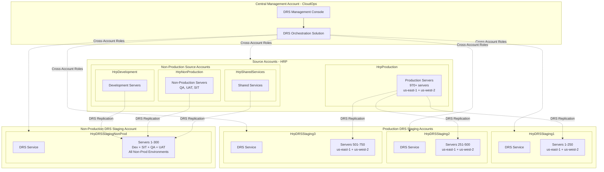
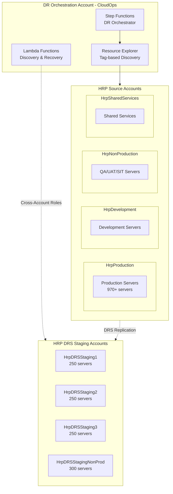

# AWS DRS Account Vending Design Document
## Multi-Account DRS Implementation with Landing Zone Accelerator

---

## Executive Summary

This document outlines the design for implementing AWS Elastic Disaster Recovery (DRS) account vending using the Landing Zone Accelerator (LZA) framework. Based on analysis of server requirements and AWS DRS service limitations, this design addresses the need for **4 DRS staging accounts** to support 1,000+ servers across production and non-production environments.

### Key Requirements from Analysis

**Server Count Requirements:**
- **Production**: 970+ servers in HrpProduction account (us-east-1 + us-west-2) → **3 accounts needed**
- **Non-Production**: 1,035+ servers distributed across multiple HRP accounts → **1 account needed** (consolidated)
  - HrpDevelopment: Development environment servers
  - HrpNonProduction: QA, UAT, SIT environment servers
  - HrpSharedServices: Shared services and infrastructure servers
- **Total**: **4 DRS staging accounts** required

**AWS DRS Hard Limits:**
- **300 replicating servers per account per region** (cannot be increased)
- **100 servers per recovery job** (hard limit)
- **20 concurrent jobs per account** (soft limit)

**Regional Configuration:**
- **Primary Regions**: us-east-1, us-west-2
- **DR Regions**: us-east-2, us-west-1

---

## Architecture Overview

### Multi-Account DRS Architecture



### Account Distribution Strategy

| Account Name | Environment | Server Range | Capacity | Regions | Purpose |
|--------------|-------------|--------------|----------|---------|---------|
| HrpDRSStaging1 | Production | 1-250 | 250/300 (83%) | us-east-1, us-west-2 | Web Tier, Load Balancers |
| HrpDRSStaging2 | Production | 251-500 | 250/300 (83%) | us-east-1, us-west-2 | Application Servers |
| HrpDRSStaging3 | Production | 501-750 | 250/300 (83%) | us-east-1, us-west-2 | Database Servers |
| HrpDRSStagingNonProd | Non-Production | 1-300 | 300/300 (100%) | us-east-1, us-west-2 | All Non-Prod Environments |

> **Design Note**: Each account is provisioned at 83% capacity (250/300 servers), leaving 50 servers of headroom per account for growth.

---

## Landing Zone Accelerator Integration

### 1. Organizational Unit Structure

Based on the current LZA configuration, DRS accounts will be placed under the existing Workloads OU structure:

```yaml
organizationalUnits:
  - name: Security
  - name: Infrastructure  
  - name: Sandbox
  - name: Workloads                    # DRS accounts will be placed here
  - name: Workloads/Development
  - name: Workloads/Production
  - name: Workloads/NonProduction
  - name: Workloads/Common
  - name: Suspended
```

### 2. Account Configuration Updates

Add the following accounts to `accounts-config.yaml`:

```yaml
workloadAccounts:
  # Existing accounts...
  
  # HRP DRS Staging Accounts
  - name: HrpDRSStaging1
    description: "HRP DRS Staging Account for Production Workloads (1-250 servers). Owner: CloudOps Team"
    email: aws+hrp-drs-staging-1@healthedge.com
    organizationalUnit: Workloads
    warm: false
    
  - name: HrpDRSStaging2
    description: "HRP DRS Staging Account for Production Workloads (251-500 servers). Owner: CloudOps Team"
    email: aws+hrp-drs-staging-2@healthedge.com
    organizationalUnit: Workloads
    warm: false
    
  - name: HrpDRSStaging3
    description: "HRP DRS Staging Account for Production Workloads (501-750 servers). Owner: CloudOps Team"
    email: aws+hrp-drs-staging-3@healthedge.com
    organizationalUnit: Workloads
    warm: false

  # HRP Non-Production DRS Staging Account
  - name: HrpDRSStagingNonProd
    description: "HRP DRS Staging Account for All Non-Production Workloads (Dev, SIT, QA, UAT - up to 300 servers). Owner: CloudOps Team"
    email: aws+hrp-drs-staging-nonprod@healthedge.com
    organizationalUnit: Workloads
    warm: false
```

### 3. Network Configuration

Each DRS staging account requires dedicated VPC configuration for DRS replication traffic:

```yaml
# Add to network-config.yaml
vpcs:
  # HRP DRS Staging VPCs for Production Accounts
  - name: HrpDRSStaging1-VPC
    account: HrpDRSStaging1
    region: us-east-1
    cidr: 10.200.0.0/16
    internetGateway: true
    enableDnsHostnames: true
    enableDnsSupport: true
    instanceTenancy: default
    subnets:
      - name: DRS-Replication-Subnet-1a
        availabilityZone: a
        cidr: 10.200.1.0/24
        type: private
      - name: DRS-Replication-Subnet-1b
        availabilityZone: b
        cidr: 10.200.2.0/24
        type: private
      - name: DRS-Public-Subnet-1a
        availabilityZone: a
        cidr: 10.200.10.0/24
        type: public
      - name: DRS-Public-Subnet-1b
        availabilityZone: b
        cidr: 10.200.11.0/24
        type: public
    transitGatewayAttachments:
      - name: HrpDRSStaging1-TGW-Attach
        transitGateway:
          name: TgwUsEast1
          account: Network
        routeTableAssociations:
          - SpokeRt
        routeTablePropagations:
          - SpokeRt
        subnets:
          - DRS-Replication-Subnet-1a
          - DRS-Replication-Subnet-1b

  # Similar configurations for other HRP DRS accounts...
  # HrpDRSStaging2: 10.201.0.0/16
  # HrpDRSStaging3: 10.202.0.0/16  
  # HrpDRSStagingNonProd: 10.203.0.0/16
```

### 4. Security Configuration

Add DRS-specific security policies and roles. Note that cross-account roles must be deployed to all HRP source accounts:

```yaml
# Add to security-config.yaml
iamConfig:
  roles:
    # Cross-account role for DRS staging accounts
    - name: DRSOrchestrationCrossAccountRole
      deploymentTargets:
        organizationalUnits:
          - Workloads
      assumedBy:
        - type: account
          principals:
            - "111111111111"  # CloudOps Account ID
      policies:
        awsManaged:
          - AWSElasticDisasterRecoveryReadOnlyAccess
        customerManaged:
          - DRSOrchestrationPolicy
    
    # Cross-account role for HRP source accounts (where servers reside)
    - name: DRSSourceAccountRole
      deploymentTargets:
        accounts:
          - HrpProduction
          - HrpDevelopment
          - HrpNonProduction
          - HrpSharedServices
      assumedBy:
        - type: account
          principals:
            - "111111111111"  # CloudOps Account ID
      policies:
        awsManaged:
          - AWSElasticDisasterRecoveryReadOnlyAccess
        customerManaged:
          - DRSSourceAccountPolicy
          
  policies:
    - name: DRSOrchestrationPolicy
      deploymentTargets:
        organizationalUnits:
          - Workloads
      policy: iam-policies/service-policies/drs-orchestration-policy.json
      
    - name: DRSSourceAccountPolicy
      deploymentTargets:
        accounts:
          - HrpProduction
          - HrpDevelopment
          - HrpNonProduction
          - HrpSharedServices
      policy: iam-policies/service-policies/drs-source-account-policy.json
```

### 5. Service Control Policies

Create DRS-specific SCPs for the DisasterRecovery OU:

```yaml
# Add to organization-config.yaml
serviceControlPolicies:
  - name: DRS-Account-Guardrails
    description: >
      SCP to enforce DRS account usage patterns and prevent unauthorized actions
    policy: organization-policies/service-control-policies/drs-account-guardrails.json
    type: customerManaged
    deploymentTargets:
      organizationalUnits:
        - Workloads
```

---

## Integration with DR Orchestration Architecture

### Overview

This DRS account vending design integrates with the existing Guiding Care Disaster Recovery Orchestration system. The orchestration system provides tag-driven, automated disaster recovery across multiple customer environments using AWS Step Functions, Lambda, and Systems Manager.

### Key Integration Points

#### 1. Source Server Location
- **Production Source Servers**: Located in **HrpProduction** account (970+ servers)
- **Non-Production Source Servers**: Distributed across multiple HRP accounts:
  - **HrpDevelopment**: Development environment servers
  - **HrpNonProduction**: QA, UAT, SIT environment servers  
  - **HrpSharedServices**: Shared services and infrastructure servers
- **Total Non-Production**: 1,035+ servers across all non-production accounts
- **Regions**: us-east-1 (primary), us-west-2 (primary)
- **DR Regions**: us-east-2, us-west-1

#### 2. Tag-Driven Discovery
The DR orchestration system uses AWS Resource Explorer for dynamic resource discovery based on tags:

**Required Tags for DRS Integration**:
```yaml
# DR Orchestration Tags
dr:enabled: "true"                    # Identifies resources for DR orchestration
dr:priority: "critical|high|medium|low"  # Recovery priority classification
dr:wave: "1-N"                       # Wave number for ordered recovery
dr:recovery-strategy: "drs"          # Recovery method (DRS for EC2 instances)
dr:rto-target: "30"                  # Target recovery time (minutes)
dr:rpo-target: "30"                  # Target recovery point (minutes)

# Scoping Tags
Customer: "customer-name"            # Customer identifier for multi-tenant scoping
Environment: "production|nonproduction"  # Environment identifier
```

#### 3. Cross-Account Architecture


#### 4. Server Assignment Logic
The orchestration system automatically assigns servers to appropriate DRS staging accounts based on tags:

```python
def assign_server_to_drs_account(server_metadata):
    """
    Assign server from HRP source accounts to appropriate DRS staging account
    """
    environment = server_metadata.get('Environment')
    tier = server_metadata.get('Tier', 'unknown')
    priority = server_metadata.get('dr:priority', 'medium')
    
    if environment.lower() == 'production':
        # Production servers distributed by tier
        if tier.lower() in ['web', 'frontend', 'lb'] or priority == 'critical':
            return 'HrpDRSStaging1'
        elif tier.lower() in ['app', 'api', 'middleware']:
            return 'HrpDRSStaging2'
        elif tier.lower() in ['db', 'database', 'cache']:
            return 'HrpDRSStaging3'
        else:
            return 'HrpDRSStaging1'  # Default for unknown tiers
    else:
        # All non-production goes to single account
        return 'HrpDRSStagingNonProd'
```

#### 5. Recovery Orchestration
The DR orchestration system coordinates recovery across all DRS staging accounts:

1. **Resource Discovery**: Uses AWS Resource Explorer to find all `dr:enabled=true` resources across HRP accounts (HrpProduction, HrpDevelopment, HrpNonProduction, HrpSharedServices)
2. **Account Assignment**: Automatically determines which DRS staging account protects each server
3. **Wave-Based Recovery**: Executes recovery in ordered waves based on `dr:wave` tags
4. **Cross-Account Coordination**: Manages recovery jobs across multiple DRS staging accounts simultaneously

#### 6. Pre-Provisioned Instance Strategy
Following the DR orchestration architecture pattern:

- **AllowLaunchingIntoThisInstance**: Pre-provisioned EC2 instances in DR regions
- **IP Preservation**: Last octet IP address preservation using ENI attachment
- **Name Tag Matching**: Primary-DR instance pairs identified by Name tags
- **Cost Optimization**: Pre-provisioned instances reduce recovery time and costs

---

## DRS Console Configuration Guide

### Prerequisites

1. **Account Setup**: All 4 DRS staging accounts provisioned via LZA
2. **Network Connectivity**: VPCs and Transit Gateway attachments configured
3. **IAM Roles**: Cross-account roles deployed
4. **Central Management**: CloudOps account configured as central management
5. **Source Servers**: Source servers distributed across HRP accounts (HrpProduction, HrpDevelopment, HrpNonProduction, HrpSharedServices)

### Step 1: Initialize DRS in Each Staging Account

For each of the 4 DRS staging accounts, perform the following:

#### 1.1 Access the DRS Console

```bash
# Assume role into each staging account
aws sts assume-role \
  --role-arn arn:aws:iam::STAGING-ACCOUNT-ID:role/OrganizationAccountAccessRole \
  --role-session-name drs-setup-session
```

#### 1.2 Initialize DRS Service

1. Navigate to **AWS DRS Console** in each region (us-east-1, us-west-2)
2. Click **Initialize Elastic Disaster Recovery**
3. Configure replication settings:
   - **Replication subnet**: Select DRS-Replication-Subnet-1a
   - **Replication instance type**: t3.small (default)
   - **EBS encryption**: Enable with default KMS key
   - **Staging area tags**: 
     ```
     Environment: Production/NonProduction
     Purpose: DRS-Staging
     Account: HrpDRSStaging1 (etc.)
     ```

#### 1.3 Configure Replication Settings Template

```json
{
  "replicationConfigurationTemplateID": "rct-xxxxxxxxx",
  "stagingAreaSubnetId": "subnet-xxxxxxxxx",
  "associateDefaultSecurityGroup": true,
  "replicationServersSecurityGroupsIDs": ["sg-xxxxxxxxx"],
  "replicationServerInstanceType": "t3.small",
  "useDedicatedReplicationServer": false,
  "defaultLargeStagingDiskType": "GP3",
  "ebsEncryption": "ENABLED",
  "ebsEncryptionKeyArn": "arn:aws:kms:region:account:key/xxxxxxxx",
  "bandwidthThrottling": 0,
  "dataPlaneRouting": "PRIVATE_IP",
  "createPublicIP": false,
  "stagingAreaTags": {
    "Environment": "Production",
    "Purpose": "DRS-Staging",
    "Account": "HrpDRSStaging1"
  }
}
```

### Step 2: Configure Trusted Accounts

#### 2.1 Add CloudOps as Trusted Account

In each **staging account**:

1. Navigate to **AWS DRS Console** > **Settings** > **Trusted accounts**
2. Click **Add trusted accounts and create roles**
3. Enter **CloudOps Account ID**: `111111111111`
4. Select roles to create:
   - ✅ **Staging role** (`DRSStagingAccountRole`) - Required
   - ☐ **Network role** - Optional
   - ☐ **Failback roles** - Optional for cross-account failback
5. Click **Add trusted accounts**

#### 2.2 Verify Trust Relationships

Verify the `DRSStagingAccountRole` was created with proper trust policy:

```json
{
  "Version": "2012-10-17",
  "Statement": [
    {
      "Effect": "Allow",
      "Principal": {
        "Service": "drs.amazonaws.com"
      },
      "Action": [
        "sts:AssumeRole",
        "sts:SetSourceIdentity"
      ],
      "Condition": {
        "StringLike": {
          "sts:SourceIdentity": "111111111111",
          "aws:SourceAccount": "111111111111"
        }
      }
    }
  ]
}
```

### Step 3: Configure Launch Templates

#### 3.1 Create Launch Configuration Templates

For each application tier, create launch configuration templates:

**Web Tier Template (HrpDRSStaging1):**
```json
{
  "launchConfigurationTemplateID": "lct-xxxxxxxxx",
  "postLaunchEnabled": true,
  "targetInstanceTypeRightSizingMethod": "BASIC",
  "copyPrivateIp": false,
  "copyTags": true,
  "licensing": {
    "osByol": false
  },
  "targetInstanceTypeRightSizingMethod": "BASIC",
  "launchDisposition": "STARTED",
  "enableMapAutoTagging": true,
  "mapAutoTaggingMpeID": "mpe-xxxxxxxxx"
}
```

#### 3.2 Configure Network Settings

Set target VPC and subnets for recovery instances:

```json
{
  "ec2LaunchTemplateID": "lt-xxxxxxxxx",
  "launchTemplateName": "DRS-WebTier-LaunchTemplate",
  "launchTemplateData": {
    "imageId": "ami-xxxxxxxxx",
    "instanceType": "t3.medium",
    "keyName": "drs-recovery-key",
    "securityGroupIds": ["sg-xxxxxxxxx"],
    "subnetId": "subnet-xxxxxxxxx",
    "userData": "base64-encoded-user-data",
    "tagSpecifications": [
      {
        "resourceType": "instance",
        "tags": [
          {
            "key": "Environment",
            "value": "Production"
          },
          {
            "key": "Tier",
            "value": "Web"
          },
          {
            "key": "DRStatus",
            "value": "Recovered"
          }
        ]
      }
    ]
  }
}
```

### Step 4: Regional Configuration

#### 4.1 Primary Regions (us-east-1, us-west-2)

Configure DRS in primary regions for source server replication:

**us-east-1 Configuration:**
- **Staging Account**: HrpDRSStaging1, HrpDRSStaging2, HrpDRSStaging3
- **Replication Subnet**: 10.200.1.0/24, 10.201.1.0/24, 10.202.1.0/24
- **Target Recovery Region**: us-east-2 (DR region)

**us-west-2 Configuration:**
- **Staging Account**: HrpDRSStaging1, HrpDRSStaging2, HrpDRSStaging3  
- **Replication Subnet**: 10.200.21.0/24, 10.201.21.0/24, 10.202.21.0/24
- **Target Recovery Region**: us-west-1 (DR region)

#### 4.2 DR Regions (us-east-2, us-west-1)

Configure target infrastructure in DR regions:

**us-east-2 (DR for us-east-1):**
- **Target VPCs**: Recovery VPCs for each application tier
- **Launch Templates**: Pre-configured for rapid recovery
- **Security Groups**: Mirror production security groups

**us-west-1 (DR for us-west-2):**
- **Target VPCs**: Recovery VPCs for each application tier  
- **Launch Templates**: Pre-configured for rapid recovery
- **Security Groups**: Mirror production security groups

### Step 5: Server Assignment Strategy

#### 5.1 Production Server Distribution

| Account | Server Range | Application Tiers | Regions |
|---------|--------------|-------------------|---------|
| HrpDRSStaging1 | 1-250 | Web Tier, Load Balancers, CDN | us-east-1, us-west-2 |
| HrpDRSStaging2 | 251-500 | Application Servers, API Gateways | us-east-1, us-west-2 |
| HrpDRSStaging3 | 501-750 | Database Servers, Cache Layers | us-east-1, us-west-2 |

#### 5.2 Non-Production Server Distribution

| Account | Server Range | Environments | Regions |
|---------|--------------|--------------|---------|
| HrpDRSStagingNonProd | 1-300 | Development, SIT, QA, UAT, Shared Services | us-east-1, us-west-2 |

#### 5.3 Server Assignment Rules

```python
def assign_server_to_account(server_metadata):
    """
    Assign server to appropriate DRS staging account based on metadata
    """
    environment = server_metadata.get('environment')
    tier = server_metadata.get('tier')
    region = server_metadata.get('region')
    
    # Determine account based on environment
    if environment.lower() in ['prod', 'production']:
        # For production, assign based on tier
        if tier.lower() in ['web', 'frontend', 'lb']:
            return 'HrpDRSStaging1'
        elif tier.lower() in ['app', 'api', 'middleware']:
            return 'HrpDRSStaging2'
        elif tier.lower() in ['db', 'database', 'cache']:
            return 'HrpDRSStaging3'
        else:
            # Default to account 1 for unknown tiers
            return 'HrpDRSStaging1'
    else:
        # All non-production goes to single account
        return 'HrpDRSStagingNonProd'
```

---

## Implementation Plan

### Phase 1: LZA Configuration (2 weeks)

#### Week 1: Account and OU Setup
- [ ] Update `organization-config.yaml` with new DisasterRecovery OU
- [ ] Update `accounts-config.yaml` with 4 DRS staging accounts
- [ ] Deploy LZA configuration changes
- [ ] Verify account creation and OU placement

#### Week 2: Network and Security Configuration
- [ ] Update `network-config.yaml` with DRS VPC configurations
- [ ] Update `security-config.yaml` with DRS IAM roles and policies
- [ ] Create DRS-specific Service Control Policies
- [ ] Deploy network and security configurations

### Phase 2: DRS Service Configuration (2 weeks)

#### Week 3: DRS Initialization
- [ ] Initialize DRS service in all 4 staging accounts
- [ ] Configure replication settings templates
- [ ] Set up trusted account relationships
- [ ] Test cross-account connectivity

#### Week 4: Launch Templates and Testing
- [ ] Create launch configuration templates for each tier
- [ ] Configure target VPCs and subnets in DR regions
- [ ] Perform initial replication tests
- [ ] Validate cross-account DRS functionality

### Phase 3: Integration and Automation (2 weeks)

#### Week 5: DRS Orchestration Integration
- [ ] Update DRS Orchestration solution for multi-account support (4 staging accounts + 4 source accounts)
- [ ] Implement server assignment automation
- [ ] Configure cross-account monitoring
- [ ] Test automated failover scenarios

#### Week 6: Documentation and Training
- [ ] Create operational runbooks
- [ ] Document server assignment procedures
- [ ] Train operations teams on multi-account DRS
- [ ] Conduct disaster recovery drills

---

## Operational Procedures

### Server Onboarding Process

#### 1. Server Registration
```bash
# Install DRS agent on source server
sudo ./aws-replication-installer-init.py \
  --region us-east-1 \
  --aws-access-key-id AKIA... \
  --aws-secret-access-key ... \
  --no-prompt
```

#### 2. Account Assignment
```python
# Automated assignment based on server metadata
server_info = {
    'hostname': 'web-server-01',
    'environment': 'production',
    'tier': 'web',
    'region': 'us-east-1',
    'source_account': 'HrpProduction'  # Source account where server resides
}

assigned_account = assign_server_to_account(server_info)
print(f"Server from {server_info['source_account']} assigned to: {assigned_account}")
```

#### 3. Replication Monitoring
```bash
# Monitor replication status across all accounts
aws drs describe-source-servers \
  --region us-east-1 \
  --profile hrp-drs-staging-1 \
  --query 'items[?dataReplicationInfo.replicationState==`CONTINUOUS_REPLICATION`]'
```

### Disaster Recovery Procedures

#### 1. Production Failover
```bash
# Coordinated failover across all production HRP DRS accounts
for account in hrp-drs-staging-1 hrp-drs-staging-2 hrp-drs-staging-3; do
  aws drs start-recovery \
    --source-servers sourceServerID=s-1234567890abcdef0 \
    --is-drill false \
    --profile $account \
    --region us-east-2
done
```

#### 2. Drill Testing
```bash
# Monthly drill testing for non-production
aws drs start-recovery \
  --source-servers sourceServerID=s-1234567890abcdef0 \
  --is-drill true \
  --profile hrp-drs-staging-nonprod \
  --region us-east-2
```

### Monitoring and Alerting

#### 1. Account Capacity Monitoring
```python
def monitor_account_capacity():
    """Monitor DRS account capacity across all staging accounts"""
    accounts = [
        'hrp-drs-staging-1', 'hrp-drs-staging-2', 'hrp-drs-staging-3',
        'hrp-drs-staging-nonprod'
    ]
    
    for account in accounts:
        client = boto3.client('drs', region_name='us-east-1')
        response = client.describe_source_servers()
        
        replicating_count = len([
            server for server in response['items']
            if server['dataReplicationInfo']['replicationState'] == 'CONTINUOUS_REPLICATION'
        ])
        
        if replicating_count > 250:  # 83% of 300 limit
            send_alert(f"Account {account} approaching capacity: {replicating_count}/300")
```

#### 2. Replication Health Monitoring
```python
def monitor_replication_health():
    """Monitor replication health across all accounts"""
    unhealthy_servers = []
    
    for account in DRS_ACCOUNTS:
        servers = get_source_servers(account)
        for server in servers:
            if server['replicationState'] != 'CONTINUOUS_REPLICATION':
                unhealthy_servers.append({
                    'account': account,
                    'server': server['sourceServerID'],
                    'state': server['replicationState']
                })
    
    if unhealthy_servers:
        send_alert(f"Unhealthy replication detected: {len(unhealthy_servers)} servers")
```

---

## Cost Analysis

### Monthly Cost Breakdown

| Component | Prod Accounts (3) | NonProd Account (1) | Total (4 Accounts) | Annual Cost |
|-----------|-------------------|---------------------|-------------------|-------------|
| **DRS Replication** | $10,500/month (750 servers) | $4,200/month (300 servers) | $14,700/month | $176,400 |
| **EBS Snapshots** | $1,500/month | $600/month | $2,100/month | $25,200 |
| **Cross-Account Data Transfer** | $300/month | $100/month | $400/month | $4,800 |
| **VPC and Networking** | $150/month | $50/month | $200/month | $2,400 |
| **CloudWatch Monitoring** | $75/month | $25/month | $100/month | $1,200 |
| **Lambda and Automation** | $30/month | $10/month | $40/month | $480 |
| **S3 Storage (logs, configs)** | $15/month | $5/month | $20/month | $240 |
| **Total** | **$12,570/month** | **$4,990/month** | **$17,560/month** | **$210,720** |

### Cost Optimization Strategies

1. **Right-sizing Replication Instances**: Use t3.small for most workloads
2. **Snapshot Lifecycle Management**: Automatic cleanup of old snapshots
3. **Regional Optimization**: Minimize cross-region data transfer
4. **Reserved Instances**: Consider RIs for long-term replication servers
5. **Drill Cleanup**: Automated termination of drill instances

---

## Security Considerations

### Cross-Account Security Model

#### 1. IAM Role Structure
```json
{
  "Version": "2012-10-17",
  "Statement": [
    {
      "Effect": "Allow",
      "Principal": {
        "AWS": "arn:aws:iam::CLOUDOPS-ACCOUNT:root"
      },
      "Action": "sts:AssumeRole",
      "Condition": {
        "StringEquals": {
          "sts:ExternalId": "unique-external-id-per-account"
        }
      }
    }
  ]
}
```

#### 2. Network Security
- **VPC Isolation**: Each DRS account has dedicated VPC
- **Security Groups**: Restrictive rules for DRS replication traffic
- **NACLs**: Additional layer of network protection
- **Transit Gateway**: Controlled routing between accounts

#### 3. Data Protection
- **Encryption in Transit**: All DRS replication encrypted
- **Encryption at Rest**: EBS volumes encrypted with KMS
- **Key Management**: Separate KMS keys per environment
- **Access Logging**: All DRS operations logged in CloudTrail

### Compliance Considerations

#### 1. Regulatory Separation
- **Production/Non-Production Isolation**: Separate account sets
- **Data Residency**: Regional data stays within region boundaries
- **Audit Trail**: Complete logging of all DRS operations
- **Access Controls**: Role-based access with MFA requirements

#### 2. Backup and Recovery Compliance
- **RTO Requirements**: <4 hours for critical systems
- **RPO Requirements**: <15 minutes for production data
- **Testing Requirements**: Monthly DR drills documented
- **Documentation**: Maintained recovery procedures

---

## Success Metrics

### Technical Metrics

| Metric | Target | Measurement |
|--------|--------|-------------|
| **Server Protection Coverage** | >95% | Servers with active replication |
| **Replication Health** | >99% | Servers in CONTINUOUS_REPLICATION state |
| **Account Utilization** | <85% | Servers per account vs 300 limit |
| **Cross-Account Latency** | <30 seconds | Time for cross-account operations |
| **Drill Success Rate** | >95% | Successful drill completions |

### Business Metrics

| Metric | Target | Measurement |
|--------|--------|-------------|
| **RTO Achievement** | <4 hours | Time to restore critical services |
| **RPO Achievement** | <15 minutes | Maximum data loss |
| **Cost per Server** | <$25/month | Total DRS cost per protected server |
| **Operational Efficiency** | <2 hours | Time for full environment drill |
| **Compliance Score** | 100% | Audit requirements met |

---

## Risk Assessment and Mitigation

### Technical Risks

| Risk | Impact | Probability | Mitigation |
|------|--------|-------------|------------|
| **Account Limit Exceeded** | High | Medium | Automated capacity monitoring and alerts |
| **Cross-Account Role Failure** | High | Low | Redundant role configuration and testing |
| **Network Connectivity Issues** | Medium | Low | Multiple AZ deployment and monitoring |
| **Replication Lag** | Medium | Medium | Bandwidth monitoring and optimization |

### Operational Risks

| Risk | Impact | Probability | Mitigation |
|------|--------|-------------|------------|
| **Incorrect Server Assignment** | Medium | Medium | Automated assignment with validation |
| **Manual Configuration Drift** | Medium | High | Infrastructure as Code with LZA |
| **Insufficient Training** | High | Medium | Comprehensive training and documentation |
| **Drill Failures** | High | Low | Regular testing and procedure updates |

---

## Conclusion

This design provides a comprehensive approach to implementing multi-account DRS using the Landing Zone Accelerator framework. The solution addresses the critical requirement to support 1,000+ servers while staying within AWS DRS service limits through a well-architected 4-account strategy that balances operational simplicity with production requirements.

### Key Benefits

1. **Scalability**: Supports unlimited server growth through horizontal account scaling
2. **Compliance**: Maintains production/non-production separation for regulatory requirements
3. **Operational Excellence**: Centralized management with distributed execution
4. **Cost Optimization**: Efficient resource utilization across accounts
5. **Security**: Robust cross-account security model with proper isolation

### Next Steps

1. **Approval**: Obtain stakeholder approval for the 4-account architecture
2. **Implementation**: Execute the phased implementation plan
3. **Testing**: Conduct comprehensive testing of multi-account DRS functionality
4. **Training**: Train operations teams on new procedures
5. **Go-Live**: Migrate existing DRS workloads to new 4-account structure

### Design Benefits of Consolidated Non-Production

**Operational Simplicity:**
- Single account for all non-production environments reduces management overhead
- Simplified cross-account role management and monitoring
- Consolidated billing and cost tracking for non-production workloads

**Cost Optimization:**
- Reduced infrastructure overhead (fewer VPCs, security groups, etc.)
- Lower cross-account data transfer costs
- Simplified automation and monitoring costs

**Sufficient Capacity:**
- 300 server limit accommodates all non-production requirements
- Non-production environments typically have lower availability requirements
- Easier to manage capacity within single account boundary

This design ensures HealthEdge can meet its disaster recovery requirements while maintaining operational excellence, regulatory compliance, and cost efficiency through the optimized 4-staging-account structure that protects servers across multiple HRP source accounts.