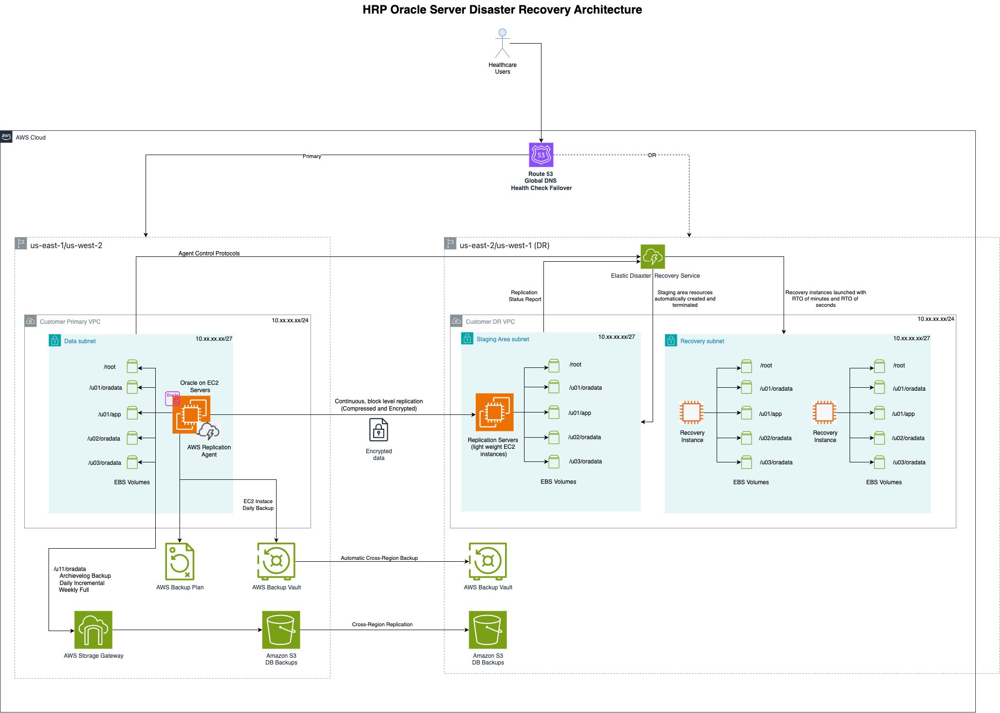

# HRP Oracle Server On EC2 Disaster Recover Detailed Design and Runbook

**Confluence Page:** https://healthedge.atlassian.net/wiki/spaces/CP1/pages/5148704910/HRP%20Oracle%20Server%20On%20EC2%20Disaster%20Recover%20Detailed%20Design%20and%20Runbook

**Created by:** Venkata Kommuri on October 06, 2025  
**Last modified by:** Chris Falk on December 18, 2025 at 08:19 PM

---

AWS Elastic Disaster Recovery (DRS) for Oracle Database on EC2 Complete Implementation Runbook
==============================================================================================

**Service:** AWS Elastic Disaster Recovery (DRS)  
**Database:** Oracle Database on EC2  
**Target RTO:** 4 hours | **Target RPO:** 15 minutes  
**Replication Method:** Continuous block-level replication with Oracle-aware configuration

**ORACLE-SPECIFIC NOTICE:** This runbook addresses Oracle Database disaster recovery using AWS DRS with multi-volume configurations including separate volumes for Oracle binaries, data files, redo logs, archive logs, and control files for optimal performance and recovery.

#### ⚠️ IMPORTANT DISCLAIMER - HRP CUSTOMIZATION REQUIRED

**All scripts and configurations in this runbook are GENERIC TEMPLATES and must be customized for HRP-specific requirements before implementation.**

##### Required HRP-Specific Customizations:

* **Environment Variables:** Update all placeholder values (ACCOUNT-ID, region names, etc.) with actual HRP values
* **Network Configuration:** Replace VPC IDs, subnet IDs, and security group IDs with HRP-specific network resources
* **Oracle Configuration:** Modify Oracle SID, database names, and paths to match HRP Oracle installations
* **IAM Roles and Policies:** Adapt IAM configurations to comply with HRP security standards and policies
* **Naming Conventions:** Update resource names to follow HRP naming standards and conventions
* **Monitoring and Alerting:** Configure SNS topics, CloudWatch alarms, and notification endpoints for HRP operations team
* **Backup and Recovery:** Align backup schedules and retention policies with HRP data governance requirements
* **Compliance Requirements:** Ensure all configurations meet HRP regulatory and compliance standards

##### Before Using Any Script:

1. **Review and Validate:** Thoroughly review each script for HRP environment compatibility
2. **Test in Non-Production:** Test all scripts in HRP development/staging environments first
3. **Security Review:** Have HRP security team review all IAM policies and network configurations
4. **Change Management:** Follow HRP change management processes before production deployment
5. **Documentation:** Document all HRP-specific modifications for future reference

**⚠️ WARNING:** Do not execute any script in production without proper HRP customization, testing, and approval.

Table of Contents
-----------------

* [1. Oracle DRS Overview & Architecture](https://healthedge.atlassian.net/wiki/spaces/CP1/pages/5148704910/HRP+Oracle+Server+On+EC2+Disaster+Recover+Detailed+Design+and+Runbook#1.-Oracle-DRS-Overview-%26-Architecture)
* [2. Oracle Multi-Volume Configuration](https://healthedge.atlassian.net/wiki/spaces/CP1/pages/5148704910/HRP+Oracle+Server+On+EC2+Disaster+Recover+Detailed+Design+and+Runbook#2.-Oracle-Multi-Volume-Configuration)
* [3. Prerequisites & Planning](https://healthedge.atlassian.net/wiki/spaces/CP1/pages/5148704910/HRP+Oracle+Server+On+EC2+Disaster+Recover+Detailed+Design+and+Runbook#3.-Prerequisites-%26-Planning)
* [4. DRS Service Setup for Oracle](https://healthedge.atlassian.net/wiki/spaces/CP1/pages/5148704910/HRP+Oracle+Server+On+EC2+Disaster+Recover+Detailed+Design+and+Runbook#4.-DRS-Service-Setup-for-Oracle)
* [5. DRS Agent Installation](https://healthedge.atlassian.net/wiki/spaces/CP1/pages/5148704910/HRP+Oracle+Server+On+EC2+Disaster+Recover+Detailed+Design+and+Runbook#5.-DRS-Agent-Installation)
* [6. Oracle-Aware Replication Configuration](https://healthedge.atlassian.net/wiki/spaces/CP1/pages/5148704910/HRP+Oracle+Server+On+EC2+Disaster+Recover+Detailed+Design+and+Runbook#6.-Oracle-Aware-Replication-Configuration)
* [7. Launch Templates & Recovery](https://healthedge.atlassian.net/wiki/spaces/CP1/pages/5148704910/HRP+Oracle+Server+On+EC2+Disaster+Recover+Detailed+Design+and+Runbook#7.-Launch-Templates-%26-Recovery-Configuration)
* [8. Oracle Database Recovery Procedures](https://healthedge.atlassian.net/wiki/spaces/CP1/pages/5148704910/HRP+Oracle+Server+On+EC2+Disaster+Recover+Detailed+Design+and+Runbook#8.-Oracle-Database-Recovery-Procedures)
* [9. Testing & Validation](https://healthedge.atlassian.net/wiki/spaces/CP1/pages/5148704910/HRP+Oracle+Server+On+EC2+Disaster+Recover+Detailed+Design+and+Runbook#9.-Testing-%26-Validation)
* [10. Failover Procedures](https://healthedge.atlassian.net/wiki/spaces/CP1/pages/5148704910/HRP+Oracle+Server+On+EC2+Disaster+Recover+Detailed+Design+and+Runbook#10.-Failover-Procedures)
* [11. Failback Procedures](https://healthedge.atlassian.net/wiki/spaces/CP1/pages/5148704910/HRP+Oracle+Server+On+EC2+Disaster+Recover+Detailed+Design+and+Runbook#11.-Failback-Procedures)
* [12. Monitoring & Alerting](https://healthedge.atlassian.net/wiki/spaces/CP1/pages/5148704910/HRP+Oracle+Server+On+EC2+Disaster+Recover+Detailed+Design+and+Runbook#12.-Monitoring-%26-Alerting)
* [13. Automation & Orchestration](https://healthedge.atlassian.net/wiki/spaces/CP1/pages/5148704910/HRP+Oracle+Server+On+EC2+Disaster+Recover+Detailed+Design+and+Runbook#13.-Automation-%26-Orchestration)
* [14. Maintenance & Operations](https://healthedge.atlassian.net/wiki/spaces/CP1/pages/5148704910/HRP+Oracle+Server+On+EC2+Disaster+Recover+Detailed+Design+and+Runbook#14.-Maintenance-%26-Operations)
* [15. Troubleshooting Guide](https://healthedge.atlassian.net/wiki/spaces/CP1/pages/5148704910/HRP+Oracle+Server+On+EC2+Disaster+Recover+Detailed+Design+and+Runbook#15.-Troubleshooting-Guide)
* [16. Oracle DRS Best Practices](https://healthedge.atlassian.net/wiki/spaces/CP1/pages/5148704910/HRP+Oracle+Server+On+EC2+Disaster+Recover+Detailed+Design+and+Runbook#16.-Oracle-DRS-Best-Practices)
* [17. Emergency Contacts](https://healthedge.atlassian.net/wiki/spaces/CP1/pages/5148704910/HRP+Oracle+Server+On+EC2+Disaster+Recover+Detailed+Design+and+Runbook#17.-Emergency-Contacts)

1. Oracle DRS Overview & Architecture
-------------------------------------

### 1.1 Oracle Database DR with AWS DRS

AWS Elastic Disaster Recovery provides continuous, block-level replication for Oracle Database environments, ensuring minimal data loss and rapid recovery. The service is Oracle-aware and can handle complex multi-volume configurations typical in enterprise Oracle deployments.

### 1.2 Key Benefits for Oracle Environments

* **Multi-volume Support:** Handles complex Oracle storage layouts
* **Oracle-aware Recovery:** Understands Oracle file structures and dependencies
* **Consistent Recovery:** Ensures database consistency across all volumes
* **Minimal Performance Impact:** Non-intrusive replication with Oracle workloads

#### Oracle Database DRS Architecture



2. Oracle Multi-Volume Configuration
------------------------------------

### 2.1 Standard Oracle Volume Layout

The following volume configuration provides optimal performance and recovery capabilities for Oracle Database:

**Note:**  Example purpose only, Volume details and values will be replaced by original configuration after getting the current server configuration from HRP team)

| Volume | Device | Mount Point | Size | Type | Purpose | DRS Priority |
| --- | --- | --- | --- | --- | --- | --- |
| Root Volume | /dev/sda1 | / | 100 GB | gp3 | OS, Oracle binaries, DRS agent | Critical |
| Oracle Home | /dev/sdf | /u01/app/oracle | 200 GB | gp3 | Oracle software, patches, Grid Infrastructure | Critical |
| Data Files | /dev/sdg | /u02/oradata | 1000 GB | io2 | Database files, tablespaces | Critical |
| Redo Logs | /dev/sdh | /u03/redo | 100 GB | io2 | Online redo logs, fast recovery area | Critical |
| Archive Logs | /dev/sdi | /u04/archive | 500 GB | gp3 | Archived redo logs, RMAN backups | High |
| Control Files | /dev/sdj | /u05/control | 50 GB | io2 | Control files, SPFILE, password file | Critical |

### 2.2 Oracle File System Layout

**Note:** Below is the standard oracle database file system structure. This will be updated with HRP Oracle database file structure.


```
# Oracle Database File System Structure
/u01/app/oracle/                    # Oracle Home Volume
├── product/19.0.0/dbhome_1/       # Oracle Database Software
├── grid/19.0.0/                   # Grid Infrastructure (if applicable)
├── oraInventory/                  # Oracle Inventory
└── admin/                         # Administrative files

/u02/oradata/ORCL/                 # Data Files Volume
├── system01.dbf                   # System tablespace
├── sysaux01.dbf                   # Sysaux tablespace
├── users01.dbf                    # Users tablespace
├── undotbs01.dbf                  # Undo tablespace
├── temp01.dbf                     # Temporary tablespace
└── example01.dbf                  # Example tablespace

/u03/redo/ORCL/                    # Redo Logs Volume
├── redo01a.log                    # Online redo log group 1 member A
├── redo01b.log                    # Online redo log group 1 member B
├── redo02a.log                    # Online redo log group 2 member A
├── redo02b.log                    # Online redo log group 2 member B
└── fra/                           # Fast Recovery Area

/u04/archive/ORCL/                 # Archive Logs Volume
├── arch/                          # Archived redo logs
├── rman/                          # RMAN backup pieces
└── export/                        # Data pump exports

/u05/control/ORCL/                 # Control Files Volume
├── control01.ctl                  # Primary control file
├── control02.ctl                  # Multiplexed control file
├── spfileORCL.ora                 # Server parameter file
└── orapwORCL                      # Password file
```


### 2.3 Oracle Database Configuration for DRS

**Note:** Information purpose only.Below are already configured in HRP oracle database.


```
# Oracle Database Parameters for DRS Optimization
-- Enable archive log mode for point-in-time recovery
ALTER DATABASE ARCHIVELOG;

-- Set archive log destination
ALTER SYSTEM SET log_archive_dest_1='LOCATION=/u04/archive/ORCL/arch' SCOPE=BOTH;

-- Configure fast recovery area
ALTER SYSTEM SET db_recovery_file_dest='/u03/redo/ORCL/fra' SCOPE=BOTH;
ALTER SYSTEM SET db_recovery_file_dest_size=50G SCOPE=BOTH;

-- Enable flashback database for faster recovery
ALTER DATABASE FLASHBACK ON;

-- Set control file locations
ALTER SYSTEM SET control_files='/u05/control/ORCL/control01.ctl','/u05/control/ORCL/control02.ctl' SCOPE=SPFILE;

-- Configure redo log groups for high availability
ALTER DATABASE ADD LOGFILE GROUP 3 ('/u03/redo/ORCL/redo03a.log','/u03/redo/ORCL/redo03b.log') SIZE 1G;
ALTER DATABASE ADD LOGFILE GROUP 4 ('/u03/redo/ORCL/redo04a.log','/u03/redo/ORCL/redo04b.log') SIZE 1G;
```


3. Prerequisites & Planning
---------------------------

**Oracle-Specific Requirements:** Ensure Oracle Database is properly configured for disaster recovery before implementing DRS.

### 3.1 Oracle Database Prerequisites

#### Oracle Database Readiness Checklist:

* Oracle Database installed and configured
* Database running in ARCHIVELOG mode
* Fast Recovery Area configured
* Control files multiplexed across volumes
* Redo logs multiplexed across volumes
* RMAN backup strategy implemented
* Oracle Enterprise Manager (OEM) configured (optional)
* Database performance baseline established
* Oracle patches up to date
* Database users and privileges documented

### 3.2 AWS Infrastructure Prerequisites

#### AWS Infrastructure Checklist:

* Target AWS region selected (us-east-2, us-west-1)
* VPC and subnets configured in target region
* Security groups for Oracle traffic (1521, 5500, etc.)
* IAM roles with DRS and Oracle permissions
* KMS keys for EBS encryption
* Network connectivity (VPN/Direct Connect)
* Route 53 hosted zone for DNS failover
* CloudWatch and SNS for monitoring

### 3.3 Oracle Database Assessment Script

#### 🔧 HRP CUSTOMIZATION REQUIRED

**This assessment script is a generic template.** Before use, customize for HRP environment:

* Update Oracle paths and SID values for HRP Oracle installations
* Modify network connectivity tests for HRP AWS regions and endpoints
* Adjust volume mount points to match HRP Oracle volume layout
* Update user and group names to match HRP Oracle configuration

#### What is the Oracle Database Assessment Script?

The Oracle Database Assessment Script (`oracle-drs-assessment.sh`) is a comprehensive diagnostic tool that evaluates your Oracle Database environment's readiness for AWS Elastic Disaster Recovery (DRS) implementation. This script performs a thorough analysis of your Oracle infrastructure, configuration, and environment to identify potential issues before DRS deployment.

#### 3.3.1 Script Purpose and Functions

| Assessment Category | What It Checks | Why It's Important |
| --- | --- | --- |
| Oracle Environment | Oracle Home, SID, version, processes | Ensures Oracle is properly installed and running |
| Database Status | Instance status, archive mode, flashback, size | Validates database configuration for DR readiness |
| Volume Configuration | Mount points, block devices, file systems | Confirms multi-volume Oracle layout for DRS |
| Network Configuration | Listener status, ports, connectivity | Ensures Oracle network services are accessible |
| Storage Performance | I/O statistics, disk usage, performance | Identifies potential performance bottlenecks |
| DRS Readiness | Internet connectivity, disk space, prerequisites | Validates environment meets DRS requirements |

#### 3.3.2 Where to Run the Assessment Script

##### Execution Locations and Requirements:

* **Primary Location:** Run directly on each Oracle Database server that will be protected by DRS
* **User Requirements:** Must be executed as `root` user or with `sudo` privileges
* **Oracle Access:** Requires access to Oracle environment variables and database
* **Network Access:** Server must have internet connectivity to test DRS endpoints

#### 3.3.3 Pre-Execution Checklist

* Log in as root user or user with sudo privileges
* Ensure Oracle Database is running
* Verify Oracle environment variables are set (ORACLE\_HOME, ORACLE\_SID)
* Confirm network connectivity to internet
* Have Oracle DBA credentials available if needed
* Ensure sufficient disk space for assessment logs

#### 3.3.4 How to Execute the Assessment Script


```
# Step 1: Download or create the assessment script
# Save the script as oracle-drs-assessment.sh on your Oracle server

# Step 2: Make the script executable
chmod +x oracle-drs-assessment.sh

# Step 3: Set Oracle environment (if not already set)
export ORACLE_HOME=/u01/app/oracle/product/19.0.0/dbhome_1
export ORACLE_SID=ORCL
export PATH=$ORACLE_HOME/bin:$PATH

# Step 4: Execute the assessment script as root
sudo ./oracle-drs-assessment.sh

# Alternative: Execute with sudo if not root
sudo -E ./oracle-drs-assessment.sh

# Step 5: Review the output and save results
sudo ./oracle-drs-assessment.sh > oracle-drs-assessment-$(hostname)-$(date +%Y%m%d).log 2>&1
```


#### 3.3.5 Expected Output and Interpretation

##### Sample Assessment Output Sections:

* **Oracle Environment:** Shows Oracle Home, SID, version, and running processes
* **Database Status:** Displays database status, archive mode, and size information
* **Oracle Volumes:** Lists all Oracle-related mount points and storage
* **Network Configuration:** Shows listener status and port information
* **DRS Readiness:** Indicates readiness with ✓ (pass) or ✗ (fail) markers

#### 3.3.6 Troubleshooting Common Issues

| Issue | Symptom | Solution |
| --- | --- | --- |
| Oracle Home not set | "Oracle Home not set in environment" | Set ORACLE\_HOME environment variable before running |
| Cannot connect to database | "Cannot connect to Oracle database" | Ensure Oracle is running and ORACLE\_SID is correct |
| Permission denied | "Permission denied" errors | Run script as root or with sudo privileges |
| Network connectivity issues | "Cannot reach AWS DRS endpoints" | Check firewall settings and internet connectivity |


```
#!/bin/bash
# oracle-drs-assessment.sh
# Comprehensive assessment for Oracle Database DRS readiness

echo "=== Oracle Database DRS Assessment Report ==="
echo "Generated: $(date)"
echo "Hostname: $(hostname)"
echo

# Oracle Environment Information
echo "=== ORACLE ENVIRONMENT ==="
if [[ -n "$ORACLE_HOME" ]]; then
    echo "Oracle Home: $ORACLE_HOME"
    echo "Oracle Version: $($ORACLE_HOME/bin/sqlplus -version | head -1)"
else
    echo "Oracle Home not set in environment"
fi

if [[ -n "$ORACLE_SID" ]]; then
    echo "Oracle SID: $ORACLE_SID"
else
    echo "Oracle SID not set"
fi

# Check Oracle processes
echo
echo "=== ORACLE PROCESSES ==="
ps aux | grep -E "(pmon|smon|lgwr|dbwr|ckpt)" | grep -v grep

# Database status check
echo
echo "=== DATABASE STATUS ==="
if command -v sqlplus &> /dev/null && [[ -n "$ORACLE_HOME" && -n "$ORACLE_SID" ]]; then
    sqlplus -s / as sysdba << 'EOF'
SET PAGESIZE 0
SET FEEDBACK OFF
SELECT 'Database Status: ' || status FROM v$instance;
SELECT 'Archive Mode: ' || log_mode FROM v$database;
SELECT 'Flashback: ' || flashback_on FROM v$database;
SELECT 'Database Size: ' || ROUND(SUM(bytes)/1024/1024/1024,2) || ' GB' FROM dba_data_files;
EOF
else
    echo "Cannot connect to Oracle database"
fi

# Volume and mount point analysis
echo
echo "=== ORACLE VOLUMES AND MOUNT POINTS ==="
echo "Oracle-related mount points:"
df -h | grep -E "(oracle|oradata|redo|archive|control|u0[1-9])"

echo
echo "Oracle-related block devices:"
lsblk | grep -E "(sd[f-j]|nvme)"

# Oracle file locations
echo
echo "=== ORACLE FILE LOCATIONS ==="
if [[ -n "$ORACLE_SID" ]]; then
    find /u0* -name "*.dbf" -o -name "*.log" -o -name "*.ctl" 2>/dev/null | head -20
fi

# Network configuration
echo
echo "=== NETWORK CONFIGURATION ==="
echo "Oracle listener status:"
if command -v lsnrctl &> /dev/null; then
    lsnrctl status 2>/dev/null | grep -E "(Listening|Services|Endpoint)"
fi

echo
echo "Oracle ports:"
netstat -tlnp | grep -E ":(1521|5500|5520)" 2>/dev/null

# Storage performance
echo
echo "=== STORAGE PERFORMANCE ==="
echo "I/O statistics for Oracle volumes:"
iostat -x 1 3 2>/dev/null | grep -E "(sd[f-j]|Device)" || echo "iostat not available"

# Oracle configuration files
echo
echo "=== ORACLE CONFIGURATION ==="
if [[ -n "$ORACLE_HOME" ]]; then
    echo "Oracle configuration files:"
    find $ORACLE_HOME/dbs -name "*.ora" 2>/dev/null
    find /u0*/control -name "*.ora" 2>/dev/null
fi

# DRS Readiness Assessment
echo
echo "=== DRS READINESS ASSESSMENT ==="

# Check internet connectivity
if curl -s --max-time 10 https://drs.us-east-2.amazonaws.com > /dev/null; then
    echo "✓ Can reach AWS DRS endpoints"
else
    echo "✗ Cannot reach AWS DRS endpoints"
fi

# Check available disk space
echo "Disk space analysis:"
for mount in / /u01 /u02 /u03 /u04 /u05; do
    if mountpoint -q "$mount" 2>/dev/null; then
        usage=$(df "$mount" | awk 'NR==2 {print $5}' | sed 's/%//')
        if [[ $usage -lt 80 ]]; then
            echo "✓ $mount usage: ${usage}%"
        else
            echo "⚠ $mount usage high: ${usage}%"
        fi
    fi
done

# Check Oracle database health
echo
echo "Oracle Database Health Summary:"
if command -v sqlplus &> /dev/null && [[ -n "$ORACLE_HOME" && -n "$ORACLE_SID" ]]; then
    sqlplus -s / as sysdba << 'EOF'
SET PAGESIZE 0
SET FEEDBACK OFF
SELECT CASE 
    WHEN COUNT(*) = 0 THEN '✗ Database not accessible'
    ELSE '✓ Database accessible (' || COUNT(*) || ' datafiles)'
END FROM dba_data_files;
EOF
else
    echo "✗ Cannot assess Oracle database health"
fi

echo
echo "=== ASSESSMENT COMPLETE ==="
echo "Review the above information before proceeding with DRS implementation."
echo "Assessment report saved to: /var/log/oracle-drs-assessment-$(hostname)-$(date +%Y%m%d).log"
echo
echo "=== NEXT STEPS ==="
echo "1. Review all ✗ (failed) items and resolve issues"
echo "2. Ensure all Oracle volumes are properly mounted"
echo "3. Verify database is in ARCHIVELOG mode"
echo "4. Confirm network connectivity to AWS DRS endpoints"
echo "5. Proceed with DRS agent installation if all checks pass"
```


#### 3.3.7 Assessment Results Analysis

##### Critical Items That Must Pass:

* **Oracle Database Accessibility:** Must show "✓ Database accessible"
* **Archive Log Mode:** Database must be in ARCHIVELOG mode
* **Volume Mounts:** All Oracle volumes (/u01-/u05) must be mounted
* **Network Connectivity:** Must reach AWS DRS endpoints
* **Disk Space:** Sufficient free space on all volumes

##### Items That Can Be Warnings:

* **High Disk Usage:** Can proceed but monitor closely
* **Performance Metrics:** Note for baseline comparison
* **Missing Tools:** iostat and other monitoring tools (optional)

#### 3.3.8 Post-Assessment Actions

##### Based on Assessment Results:

1. **All Checks Pass (✓):** Proceed with DRS agent installation
2. **Critical Failures (✗):** Resolve issues before continuing
3. **Warnings (⚠):** Document and monitor during DRS implementation
4. **Save Results:** Keep assessment logs for reference and compliance
5. **Schedule Re-assessment:** Run periodically to ensure continued readiness

#### 3.3.9 Integration with DRS Implementation

The assessment script results should be used to:

* **Pre-validate Environment:** Before DRS agent installation
* **Document Baseline:** Capture current state for comparison
* **Identify Risks:** Highlight potential issues early
* **Plan Remediation:** Address issues before DRS deployment
* **Compliance Reporting:** Demonstrate readiness to stakeholders

4. DRS Service Setup for Oracle
-------------------------------

### 4.1 Initialize DRS Service with Oracle-Specific Configuration


```
# Initialize DRS service in target region
aws drs initialize-service --region us-east-2

# Create Oracle-specific replication configuration template
cat > oracle-replication-template.json << 'EOF'
{
    "associateDefaultSecurityGroup": true,
    "bandwidthThrottling": 0,
    "createPublicIP": false,
    "dataPlaneRouting": "PRIVATE_IP",
    "defaultLargeStagingDiskType": "GP3",
    "ebsEncryption": "ENCRYPTED",
    "ebsEncryptionKeyArn": "alias/oracle-drs-key",
    "replicationServerInstanceType": "m5.xlarge",
    "replicationServersSecurityGroupsIDs": ["sg-oracle-replication"],
    "stagingAreaSubnetId": "subnet-oracle-staging",
    "stagingAreaTags": {
        "Application": "Oracle",
        "Database": "ORCL",
        "Environment": "DR",
        "Purpose": "DRS-Staging"
    },
    "useDedicatedReplicationServer": true
}
EOF

# Create the replication configuration template
aws drs create-replication-configuration-template \
    --cli-input-json file://oracle-replication-template.json \
    --region us-east-2
```


### 4.2 Create Oracle-Specific Security Groups


```
# Create security group for Oracle database
aws ec2 create-security-group \
    --group-name oracle-database-dr \
    --description "Security group for Oracle Database DR instances" \
    --vpc-id vpc-12345678 \
    --region us-east-2

# Add Oracle database rules
aws ec2 authorize-security-group-ingress \
    --group-id sg-oracle-database-dr \
    --protocol tcp \
    --port 1521 \
    --source-group sg-oracle-clients \
    --region us-east-2

# Add Oracle Enterprise Manager rules
aws ec2 authorize-security-group-ingress \
    --group-id sg-oracle-database-dr \
    --protocol tcp \
    --port 5500 \
    --source-group sg-oracle-clients \
    --region us-east-2

# Add SSH access
aws ec2 authorize-security-group-ingress \
    --group-id sg-oracle-database-dr \
    --protocol tcp \
    --port 22 \
    --source-group sg-bastion-hosts \
    --region us-east-2

# Create security group for DRS replication
aws ec2 create-security-group \
    --group-name oracle-drs-replication \
    --description "Security group for Oracle DRS replication servers" \
    --vpc-id vpc-12345678 \
    --region us-east-2

# Add DRS replication rules
aws ec2 authorize-security-group-ingress \
    --group-id sg-oracle-drs-replication \
    --protocol tcp \
    --port 1500 \
    --cidr 10.0.0.0/8 \
    --region us-east-2
```


5. DRS Agent Installation
-------------------------

#### Section 5 Overview: DRS Agent Installation for Oracle Database

This section covers the installation and configuration of AWS DRS agents specifically optimized for Oracle Database environments. The DRS agent is a lightweight software component that captures block-level changes from your Oracle database server and replicates them to AWS in real-time.

#### 5.0 What This Section Accomplishes

| Subsection | Purpose | Execution Location | Prerequisites |
| --- | --- | --- | --- |
| 5.1 Oracle-Optimized Installation | Installs DRS agent with Oracle-specific configurations | Each Oracle database server | Root access, Oracle running, internet connectivity |

### 5.1 Oracle-Optimized DRS Agent Installation

#### 🔧 HRP CUSTOMIZATION REQUIRED

**This DRS agent installation script requires HRP-specific modifications:**

* Replace AWS credentials with HRP IAM roles or instance profiles
* Update DRS\_REGION with HRP target DR region
* Modify Oracle paths to match HRP Oracle Home and SID
* Update network endpoints for HRP AWS environment
* Customize logging paths per HRP standards

#### What This Script Does:

* **Downloads DRS Agent:** Retrieves the latest DRS agent installer from AWS
* **Oracle Environment Validation:** Checks Oracle installation and database status
* **Agent Installation:** Installs DRS agent with Oracle-specific optimizations
* **Configuration:** Sets up Oracle-aware replication settings
* **Verification:** Validates agent installation and Oracle integration
* **Monitoring Setup:** Creates Oracle-specific monitoring scripts

#### Where to Execute This Script:

* **Target Servers:** Run on each Oracle database server that needs DRS protection
* **User Context:** Must be executed as root user
* **Timing:** Execute during maintenance windows to minimize impact
* **Prerequisites:** Oracle database must be running and accessible

#### 5.1.1 Pre-Installation Requirements


```
# Before running the installation script, ensure:
# 1. You are logged in as root
whoami  # Should return 'root'

# 2. Oracle database is running
ps aux | grep pmon

# 3. Oracle environment is set
echo $ORACLE_HOME
echo $ORACLE_SID

# 4. Internet connectivity is available
curl -s https://aws.amazon.com > /dev/null && echo "Internet OK" || echo "No Internet"

# 5. Sufficient disk space (at least 2GB free)
df -h /
```


#### 5.1.2 Script Execution Steps


```
# Step 1: Download the installation script to your Oracle server
# Save the script as install-oracle-drs-agent.sh

# Step 2: Make the script executable
chmod +x install-oracle-drs-agent.sh

# Step 3: Set required environment variables
export DRS_REGION="us-east-2"  # Your target DR region
export AWS_ACCESS_KEY_ID="your-access-key"
export AWS_SECRET_ACCESS_KEY="your-secret-key"

# Step 4: Execute the installation script
./install-oracle-drs-agent.sh

# Step 5: Monitor the installation progress
tail -f /var/log/oracle-drs-agent-install.log
```


#### 5.1.3 What Happens During Installation

##### Installation Process Flow:

1. **Environment Validation:** Checks Oracle installation, user permissions, and system resources
2. **Oracle Database Assessment:** Verifies database is in ARCHIVELOG mode and accessible
3. **Volume Detection:** Identifies Oracle volumes (/u01-/u05) for replication
4. **Agent Download:** Downloads DRS agent installer from AWS S3
5. **Agent Installation:** Installs and configures DRS agent service
6. **Oracle Configuration:** Sets up Oracle-specific replication settings
7. **Service Startup:** Starts DRS agent and establishes replication connection
8. **Verification:** Validates installation and Oracle integration
9. **Monitoring Setup:** Creates monitoring scripts and cron jobs


```
#!/bin/bash
# install-oracle-drs-agent.sh
# Install AWS DRS agent optimized for Oracle Database servers

set -euo pipefail

# Configuration
DRS_REGION="us-east-2"
ORACLE_USER="oracle"
ORACLE_GROUP="oinstall"
LOG_FILE="/var/log/oracle-drs-agent-install.log"

# Logging
log() {
    echo "[$(date '+%Y-%m-%d %H:%M:%S')] $1" | tee -a "$LOG_FILE"
}

# Pre-installation checks for Oracle environment
pre_install_oracle_checks() {
    log "Starting Oracle-specific pre-installation checks..."
    
    # Check if running as root
    if [[ $EUID -ne 0 ]]; then
        log "ERROR: This script must be run as root"
        exit 1
    fi
    
    # Check Oracle user exists
    if ! id "$ORACLE_USER" &>/dev/null; then
        log "ERROR: Oracle user '$ORACLE_USER' does not exist"
        exit 1
    fi
    
    # Check Oracle processes
    if pgrep -f "ora_pmon" > /dev/null; then
        log "Oracle database processes detected"
        
        # Check if database is in archivelog mode
        if sudo -u "$ORACLE_USER" sqlplus -s / as sysdba << 'EOF' | grep -q "ARCHIVELOG"
SET PAGESIZE 0
SET FEEDBACK OFF
SELECT log_mode FROM v$database;
EXIT;
EOF
        then
            log "✓ Database is in ARCHIVELOG mode"
        else
            log "WARNING: Database is not in ARCHIVELOG mode. This may affect recovery capabilities."
        fi
    else
        log "WARNING: No Oracle database processes detected"
    fi
    
    # Check Oracle volumes
    local oracle_mounts=("/u01" "/u02" "/u03" "/u04" "/u05")
    for mount in "${oracle_mounts[@]}"; do
        if mountpoint -q "$mount" 2>/dev/null; then
            log "✓ Oracle mount point $mount is available"
        else
            log "⚠ Oracle mount point $mount is not mounted"
        fi
    done
    
    # Check available space for DRS agent
    local root_space
    root_space=$(df / | awk 'NR==2 {print $4}')
    if [[ $root_space -lt 2097152 ]]; then  # 2GB in KB
        log "ERROR: Insufficient disk space. Need at least 2GB free on root filesystem"
        exit 1
    fi
    
    log "Oracle-specific pre-installation checks completed"
}

# Download and install DRS agent
install_drs_agent() {
    log "Installing DRS agent for Oracle environment..."
    
    # Download DRS agent installer
    cd /tmp
    local agent_url="https://aws-elastic-disaster-recovery-${DRS_REGION}.s3.amazonaws.com/latest/linux/aws-replication-installer-init.py"
    
    if curl -o aws-replication-installer-init.py "$agent_url"; then
        log "DRS agent installer downloaded successfully"
    else
        log "ERROR: Failed to download DRS agent installer"
        exit 1
    fi
    
    chmod +x aws-replication-installer-init.py
    
    # Install agent with instance role credentials
    log "Installing DRS agent..."
    python3 aws-replication-installer-init.py \
        --region "$DRS_REGION" \
        --no-prompt
    
    log "DRS agent installation completed"
}

# Configure DRS agent for Oracle
configure_oracle_drs_agent() {
    log "Configuring DRS agent for Oracle Database environment..."
    
    # Create Oracle-specific agent configuration
    cat > /opt/aws-replication-agent/conf/oracle.conf << 'EOF'
# Oracle Database specific DRS agent configuration

# Replication settings optimized for Oracle
replication_throttle_bandwidth=0
replication_use_compression=true
replication_use_encryption=true
replication_parallel_threads=4

# Oracle-specific paths to prioritize
priority_paths=/u01/app/oracle
priority_paths=/u02/oradata
priority_paths=/u03/redo
priority_paths=/u04/archive
priority_paths=/u05/control

# Exclude Oracle temporary and cache directories
exclude_paths=/u01/app/oracle/diag/rdbms/*/trace
exclude_paths=/u02/oradata/*/temp*.dbf
exclude_paths=/tmp
exclude_paths=/var/tmp

# Oracle-specific file patterns to monitor
monitor_patterns=*.dbf
monitor_patterns=*.log
monitor_patterns=*.ctl
monitor_patterns=*.ora
monitor_patterns=*.arc

# Consistency group settings for Oracle
consistency_group_timeout=300
consistency_group_size=100MB
EOF
    
    # Update main agent configuration
    if [[ -f "/opt/aws-replication-agent/conf/agent.conf" ]]; then
        # Backup original configuration
        cp /opt/aws-replication-agent/conf/agent.conf \
           /opt/aws-replication-agent/conf/agent.conf.backup.$(date +%Y%m%d-%H%M%S)
        
        # Append Oracle-specific settings
        cat >> /opt/aws-replication-agent/conf/agent.conf << 'EOF'

# Oracle Database optimizations
include /opt/aws-replication-agent/conf/oracle.conf
EOF
    fi
    
    # Set appropriate permissions
    chown -R aws-replication-agent:aws-replication-agent /opt/aws-replication-agent/conf/
    
    log "Oracle-specific DRS agent configuration completed"
}

# Verify agent installation and Oracle integration
verify_oracle_drs_installation() {
    log "Verifying DRS agent installation for Oracle..."
    
    # Check agent service status
    if systemctl is-active --quiet aws-replication-agent; then
        log "✓ DRS agent service is running"
    else
        log "✗ DRS agent service is not running"
        systemctl status aws-replication-agent
        exit 1
    fi
    
    # Check agent logs for Oracle-specific entries
    if [[ -f "/var/log/aws-replication-agent.log" ]]; then
        log "✓ Agent log file exists"
        
        # Check for Oracle file detection
        if grep -q "oracle\|dbf\|redo\|control" /var/log/aws-replication-agent.log; then
            log "✓ Agent detected Oracle files"
        else
            log "⚠ Agent may not have detected Oracle files yet"
        fi
    fi
    
    # Check replication connection
    sleep 30  # Allow time for initial connection
    if netstat -an | grep -q ":1500.*ESTABLISHED"; then
        log "✓ Replication connection established"
    else
        log "⚠ Replication connection not yet established (may take a few minutes)"
    fi
    
    # Test Oracle database accessibility during replication
    if sudo -u "$ORACLE_USER" sqlplus -s / as sysdba << 'EOF' | grep -q "OPEN"
SET PAGESIZE 0
SET FEEDBACK OFF
SELECT status FROM v$instance;
EXIT;
EOF
    then
        log "✓ Oracle database remains accessible during replication setup"
    else
        log "⚠ Oracle database accessibility check failed"
    fi
    
    log "DRS agent verification completed for Oracle environment"
}

# Create Oracle-specific monitoring script
create_oracle_monitoring_script() {
    log "Creating Oracle-specific DRS monitoring script..."
    
    cat > /opt/aws-replication-agent/bin/oracle-drs-monitor.sh << 'EOF'
#!/bin/bash
# oracle-drs-monitor.sh
# Monitor DRS replication for Oracle Database

ORACLE_USER="oracle"
LOG_FILE="/var/log/oracle-drs-monitor.log"

log() {
    echo "[$(date '+%Y-%m-%d %H:%M:%S')] $1" | tee -a "$LOG_FILE"
}

# Check Oracle database status
check_oracle_status() {
    if sudo -u "$ORACLE_USER" sqlplus -s / as sysdba << 'EOSQL' | grep -q "OPEN"
SET PAGESIZE 0
SET FEEDBACK OFF
SELECT status FROM v$instance;
EXIT;
EOSQL
    then
        log "✓ Oracle database is OPEN"
        return 0
    else
        log "✗ Oracle database is not OPEN"
        return 1
    fi
}

# Check DRS agent status
check_drs_status() {
    if systemctl is-active --quiet aws-replication-agent; then
        log "✓ DRS agent is running"
        return 0
    else
        log "✗ DRS agent is not running"
        return 1
    fi
}

# Check replication lag
check_replication_lag() {
    local lag_file="/opt/aws-replication-agent/logs/replication-lag.log"
    if [[ -f "$lag_file" ]]; then
        local lag=$(tail -1 "$lag_file" | awk '{print $NF}')
        if [[ -n "$lag" && "$lag" -lt 60 ]]; then
            log "✓ Replication lag: ${lag}s"
        else
            log "⚠ High replication lag: ${lag}s"
        fi
    fi
}

# Main monitoring function
main() {
    log "Starting Oracle DRS monitoring check..."
    
    check_oracle_status
    check_drs_status
    check_replication_lag
    
    log "Oracle DRS monitoring check completed"
}

main "$@"
EOF
    
    chmod +x /opt/aws-replication-agent/bin/oracle-drs-monitor.sh
    
    # Create cron job for regular monitoring
    echo "*/5 * * * * /opt/aws-replication-agent/bin/oracle-drs-monitor.sh" | crontab -
    
    log "Oracle-specific monitoring script created and scheduled"
}

# Main execution
main() {
    log "Starting Oracle DRS agent installation on $(hostname)..."
    
    pre_install_oracle_checks
    install_drs_agent
    configure_oracle_drs_agent
    verify_oracle_drs_installation
    create_oracle_monitoring_script
    
    log "Oracle DRS agent installation completed successfully"
    log "Oracle database $(hostname) is now protected by AWS DRS"
    log "Check DRS console for replication status"
}

# Execute main function
main "$@"
```


6. Oracle-Aware Replication Configuration
-----------------------------------------

#### Section 6 Overview: Oracle-Aware Replication Configuration

This section configures AWS DRS replication settings specifically optimized for Oracle Database environments. It sets up volume-specific replication priorities, monitors replication progress, and ensures Oracle database consistency across all replicated volumes.

#### 6.0 What This Section Accomplishes

| Subsection | Purpose | Execution Location | Prerequisites |
| --- | --- | --- | --- |
| 6.1 Oracle-Specific Replication Settings | Configures replication parameters for Oracle servers | AWS CLI workstation or bastion host | AWS CLI configured, DRS agents installed |
| 6.2 Volume-Specific Priorities | Sets replication priorities for Oracle volumes | AWS CLI workstation | Oracle volume layout documented |
| 6.3 Replication Monitoring | Monitors Oracle replication progress and health | Monitoring server or Oracle servers | DRS replication active |

### 6.1 Configure Oracle-Specific Replication Settings

#### What This Script Does:

* **Identifies Oracle Servers:** Finds all Oracle database servers in DRS
* **Applies Oracle Configuration:** Sets Oracle-optimized replication parameters
* **Configures Point-in-Time Recovery:** Sets up PIT recovery policies
* **Optimizes Performance:** Configures replication for Oracle workloads
* **Sets Consistency Groups:** Ensures multi-volume consistency

#### Where to Execute This Script:

* **Execution Location:** AWS CLI-enabled workstation or bastion host
* **Network Access:** Must have access to AWS DRS APIs
* **Permissions:** Requires DRS administrative permissions
* **Timing:** Run after DRS agents are installed and registered

#### 6.1.1 Pre-Configuration Requirements


```
# Before running replication configuration:
# 1. Verify AWS CLI is configured
aws sts get-caller-identity

# 2. Check DRS service is initialized
aws drs describe-replication-configuration-templates --region us-east-2

# 3. Verify Oracle servers are registered in DRS
aws drs describe-source-servers --region us-east-2 --query 'items[?contains(hostname, `oracle`)].hostname'

# 4. Confirm agents are in continuous replication
aws drs describe-source-servers --region us-east-2 --query 'items[?contains(hostname, `oracle`)].dataReplicationInfo.dataReplicationState'
```


#### 6.1.2 Script Execution Process


```
# Step 1: Save the configuration script
# Save as configure-oracle-replication.sh

# Step 2: Set environment variables
export DRS_REGION="us-east-2"
export ORACLE_SID="ORCL"

# Step 3: Make executable and run
chmod +x configure-oracle-replication.sh
./configure-oracle-replication.sh

# Step 4: Verify configuration applied
aws drs describe-source-servers --region us-east-2 --query 'items[?contains(hostname, `oracle`)].{Server:hostname,Config:replicationConfiguration}'
```


### 6.1 Configure Oracle-Specific Replication Settings


```
#!/bin/bash
# configure-oracle-replication.sh
# Configure DRS replication settings optimized for Oracle Database

set -euo pipefail

DRS_REGION="us-east-2"
ORACLE_SID="ORCL"

# Function to configure Oracle database server replication
configure_oracle_replication() {
    local server_id="$1"
    local hostname="$2"
    
    echo "Configuring Oracle-optimized replication for server: $hostname ($server_id)"
    
    # Create Oracle-specific replication configuration
    cat > "/tmp/oracle-replication-config-${server_id}.json" << 'EOF'
{
    "associateDefaultSecurityGroup": true,
    "bandwidthThrottling": 0,
    "createPublicIP": false,
    "dataPlaneRouting": "PRIVATE_IP",
    "defaultLargeStagingDiskType": "GP3",
    "ebsEncryption": "ENCRYPTED",
    "ebsEncryptionKeyArn": "alias/oracle-drs-key",
    "replicationServerInstanceType": "m5.2xlarge",
    "stagingAreaTags": {
        "Application": "Oracle",
        "Database": "ORCL",
        "ServerType": "Database",
        "Priority": "Critical",
        "Environment": "DR"
    },
    "useDedicatedReplicationServer": true,
    "pitPolicy": [
        {
            "enabled": true,
            "interval": 10,
            "retentionDuration": 60,
            "ruleID": 1,
            "units": "MINUTE"
        },
        {
            "enabled": true,
            "interval": 1,
            "retentionDuration": 24,
            "ruleID": 2,
            "units": "HOUR"
        },
        {
            "enabled": true,
            "interval": 1,
            "retentionDuration": 7,
            "ruleID": 3,
            "units": "DAY"
        }
    ]
}
EOF
    
    # Apply Oracle-specific replication configuration
    aws drs update-replication-configuration \
        --source-server-id "$server_id" \
        --cli-input-json "file:///tmp/oracle-replication-config-${server_id}.json" \
        --region "$DRS_REGION"
    
    echo "Oracle replication configuration applied for $hostname"
    
    # Clean up temporary file
    rm -f "/tmp/oracle-replication-config-${server_id}.json"
}

# Get Oracle source servers and configure replication
echo "Configuring replication for Oracle database servers..."

aws drs describe-source-servers \
    --region "$DRS_REGION" \
    --query 'items[].[sourceServerID,hostname]' \
    --output text | while read -r server_id hostname; do
    
    # Check if this is an Oracle server
    if [[ "$hostname" == *"oracle"* ]] || [[ "$hostname" == *"db"* ]]; then
        configure_oracle_replication "$server_id" "$hostname"
    fi
done

echo "Oracle replication configuration completed"
```


### 6.2 Oracle Volume-Specific Replication Priorities

#### What This Configuration Does:

* **Prioritizes Critical Volumes:** Sets highest priority for data files, redo logs, and control files
* **Optimizes Compression:** Configures appropriate compression levels for each volume type
* **Ensures Consistency:** Groups related volumes for consistent recovery points
* **Manages Bandwidth:** Allocates replication bandwidth based on volume importance

#### Where to Apply This Configuration:

* **Execution Location:** AWS CLI workstation with DRS permissions
* **Target:** Applied to Oracle source servers in DRS console
* **Timing:** Configure after initial replication is established
* **Impact:** May temporarily affect replication performance during reconfiguration

#### 6.2.1 Volume Priority Configuration Process


```
# This configuration is applied via AWS DRS API calls
# The JSON configuration defines priorities for each Oracle volume:

# Critical Priority Volumes (Highest):
# - /dev/sda1 (Root/OS)
# - /dev/sdf (Oracle Home) 
# - /dev/sdg (Data Files)
# - /dev/sdh (Redo Logs)
# - /dev/sdj (Control Files)

# High Priority Volumes:
# - /dev/sdi (Archive Logs)

# Apply this configuration using AWS CLI after DRS agent installation
```


```
# Configure volume-specific replication priorities for Oracle
cat > oracle-volume-priorities.json << 'EOF'
{
    "volumePriorities": [
        {
            "deviceName": "/dev/sda1",
            "priority": "CRITICAL",
            "description": "Root volume with Oracle binaries and OS",
            "replicationSettings": {
                "compressionLevel": "HIGH",
                "encryptionEnabled": true,
                "consistencyGroupEnabled": true
            }
        },
        {
            "deviceName": "/dev/sdf",
            "priority": "CRITICAL", 
            "description": "Oracle Home volume",
            "replicationSettings": {
                "compressionLevel": "MEDIUM",
                "encryptionEnabled": true,
                "consistencyGroupEnabled": true
            }
        },
        {
            "deviceName": "/dev/sdg",
            "priority": "CRITICAL",
            "description": "Oracle data files volume",
            "replicationSettings": {
                "compressionLevel": "LOW",
                "encryptionEnabled": true,
                "consistencyGroupEnabled": true,
                "replicationFrequency": "CONTINUOUS"
            }
        },
        {
            "deviceName": "/dev/sdh",
            "priority": "CRITICAL",
            "description": "Oracle redo logs volume",
            "replicationSettings": {
                "compressionLevel": "LOW",
                "encryptionEnabled": true,
                "consistencyGroupEnabled": true,
                "replicationFrequency": "CONTINUOUS"
            }
        },
        {
            "deviceName": "/dev/sdi",
            "priority": "HIGH",
            "description": "Oracle archive logs volume",
            "replicationSettings": {
                "compressionLevel": "HIGH",
                "encryptionEnabled": true,
                "consistencyGroupEnabled": false
            }
        },
        {
            "deviceName": "/dev/sdj",
            "priority": "CRITICAL",
            "description": "Oracle control files volume",
            "replicationSettings": {
                "compressionLevel": "MEDIUM",
                "encryptionEnabled": true,
                "consistencyGroupEnabled": true,
                "replicationFrequency": "CONTINUOUS"
            }
        }
    ]
}
EOF
```


### 6.3 Monitor Oracle Replication Progress

#### What This Monitoring Script Does:

* **Tracks Replication Status:** Monitors all Oracle servers and their replication state
* **Volume-Level Monitoring:** Checks replication progress for each Oracle volume
* **Oracle Database Health:** Verifies Oracle database status during replication
* **Performance Metrics:** Tracks replication lag and throughput
* **Automated Alerting:** Sends notifications for replication issues
* **CloudWatch Integration:** Publishes metrics to AWS CloudWatch

#### Where to Run This Monitoring Script:

* **Primary Location:** Dedicated monitoring server or bastion host
* **Alternative:** Can run on Oracle servers themselves
* **Scheduling:** Set up as cron job for continuous monitoring
* **Network Access:** Requires access to AWS DRS APIs and Oracle servers
* **Permissions:** Needs DRS read permissions and SSH access to Oracle servers

#### 6.3.1 Monitoring Script Setup


```
# Step 1: Save the monitoring script
# Save as monitor-oracle-replication.sh on your monitoring server

# Step 2: Configure environment
export DRS_REGION="us-east-2"
export ORACLE_SID="ORCL"
export MONITORING_INTERVAL=60  # seconds

# Step 3: Set up SSH key access to Oracle servers
# Ensure SSH keys are configured for passwordless access

# Step 4: Make executable and test
chmod +x monitor-oracle-replication.sh
./monitor-oracle-replication.sh

# Step 5: Set up as cron job for continuous monitoring
echo "*/5 * * * * /path/to/monitor-oracle-replication.sh" | crontab -
```


#### 6.3.2 What the Monitoring Script Reports

##### Monitoring Output Includes:

* **Replication State:** CONTINUOUS, INITIAL\_SYNC, STALLED, or DISCONNECTED
* **Progress Percentage:** How much data has been replicated
* **Volume Status:** Individual status for each Oracle volume
* **Oracle Database Status:** OPEN, MOUNTED, or other states
* **Archive Log Rate:** Number of archive logs generated per hour
* **Replication Lag:** Time delay between source and target
* **Error Conditions:** Any replication failures or issues


```
#!/bin/bash
# monitor-oracle-replication.sh
# Monitor Oracle-specific replication progress and health

set -euo pipefail

DRS_REGION="us-east-2"
ORACLE_SID="ORCL"
MONITORING_INTERVAL=60
LOG_FILE="/var/log/oracle-drs-replication-monitor.log"

# Logging function
log() {
    echo "[$(date '+%Y-%m-%d %H:%M:%S')] $1" | tee -a "$LOG_FILE"
}

# Display Oracle replication status
display_oracle_replication_status() {
    log "=== Oracle Database DRS Replication Status ==="
    
    # Get Oracle source servers
    local oracle_servers
    oracle_servers=$(aws drs describe-source-servers \
        --region "$DRS_REGION" \
        --query 'items[?contains(hostname, `oracle`) || contains(hostname, `db`)]' \
        --output json)
    
    if [[ $(echo "$oracle_servers" | jq length) -eq 0 ]]; then
        log "No Oracle servers found in DRS"
        return 1
    fi
    
    # Display detailed status for each Oracle server
    echo "$oracle_servers" | jq -r '.[] | @base64' | while IFS= read -r server_data; do
        local server
        server=$(echo "$server_data" | base64 -d)
        
        local hostname
        local server_id
        local replication_state
        local last_snapshot
        local replicated_storage
        local total_storage
        
        hostname=$(echo "$server" | jq -r '.hostname')
        server_id=$(echo "$server" | jq -r '.sourceServerID')
        replication_state=$(echo "$server" | jq -r '.dataReplicationInfo.dataReplicationState')
        last_snapshot=$(echo "$server" | jq -r '.dataReplicationInfo.lastSnapshotDateTime')
        replicated_storage=$(echo "$server" | jq -r '.dataReplicationInfo.replicatedStorageBytes // 0')
        total_storage=$(echo "$server" | jq -r '.dataReplicationInfo.totalStorageBytes // 0')
        
        log "Oracle Server: $hostname ($server_id)"
        log "  Replication State: $replication_state"
        log "  Last Snapshot: $last_snapshot"
        
        # Calculate replication progress
        if [[ "$total_storage" -gt 0 ]]; then
            local progress=$((replicated_storage * 100 / total_storage))
            log "  Replication Progress: ${progress}% ($(numfmt --to=iec $replicated_storage) / $(numfmt --to=iec $total_storage))"
        fi
        
        # Check Oracle-specific metrics
        check_oracle_specific_metrics "$hostname" "$server_id"
        
        log ""
    done
}

# Check Oracle-specific replication metrics
check_oracle_specific_metrics() {
    local hostname="$1"
    local server_id="$2"
    
    # Get volume-specific replication status
    local volumes_info
    volumes_info=$(aws drs describe-source-servers \
        --region "$DRS_REGION" \
        --source-server-ids "$server_id" \
        --query 'items[0].dataReplicationInfo.replicatedDisks' \
        --output json 2>/dev/null || echo "[]")
    
    if [[ $(echo "$volumes_info" | jq length) -gt 0 ]]; then
        log "  Volume Replication Status:"
        echo "$volumes_info" | jq -r '.[] | "    " + .deviceName + ": " + (.replicatedStorageBytes // 0 | tostring) + " bytes"'
    fi
    
    # Check Oracle database status if accessible
    if command -v ssh &>/dev/null; then
        local db_status
        db_status=$(ssh -o ConnectTimeout=5 "$hostname" "sudo -u oracle sqlplus -s / as sysdba << 'EOF'
SET PAGESIZE 0
SET FEEDBACK OFF
SELECT status FROM v\$instance;
EXIT;
EOF" 2>/dev/null | tr -d '\n' || echo "UNKNOWN")
        
        log "  Oracle Database Status: $db_status"
        
        # Check archive log generation rate
        local archive_rate
        archive_rate=$(ssh -o ConnectTimeout=5 "$hostname" "sudo -u oracle sqlplus -s / as sysdba << 'EOF'
SET PAGESIZE 0
SET FEEDBACK OFF
SELECT COUNT(*) FROM v\$archived_log WHERE first_time > SYSDATE - 1/24;
EXIT;
EOF" 2>/dev/null | tr -d '\n' || echo "0")
        
        log "  Archive Logs (last hour): $archive_rate"
    fi
}

# Check replication health and send alerts
check_replication_health() {
    log "Checking Oracle replication health..."
    
    local issues_found=0
    local critical_issues=0
    
    # Get all Oracle source servers
    local oracle_servers
    oracle_servers=$(aws drs describe-source-servers \
        --region "$DRS_REGION" \
        --query 'items[?contains(hostname, `oracle`) || contains(hostname, `db`)]' \
        --output json)
    
    echo "$oracle_servers" | jq -r '.[] | @base64' | while IFS= read -r server_data; do
        local server
        server=$(echo "$server_data" | base64 -d)
        
        local hostname
        local replication_state
        local last_snapshot
        
        hostname=$(echo "$server" | jq -r '.hostname')
        replication_state=$(echo "$server" | jq -r '.dataReplicationInfo.dataReplicationState')
        last_snapshot=$(echo "$server" | jq -r '.dataReplicationInfo.lastSnapshotDateTime')
        
        # Check replication state
        case "$replication_state" in
            "CONTINUOUS")
                log "✓ $hostname: Continuous replication active"
                ;;
            "INITIAL_SYNC")
                log "⚠ $hostname: Initial sync in progress"
                ((issues_found++))
                ;;
            "STALLED"|"DISCONNECTED")
                log "✗ $hostname: Replication $replication_state (CRITICAL)"
                ((critical_issues++))
                ;;
            *)
                log "⚠ $hostname: Unknown replication state: $replication_state"
                ((issues_found++))
                ;;
        esac
        
        # Check snapshot age
        if [[ "$last_snapshot" != "null" && "$last_snapshot" != "" ]]; then
            local snapshot_age
            snapshot_age=$(( $(date +%s) - $(date -d "$last_snapshot" +%s) ))
            
            if [[ $snapshot_age -gt 300 ]]; then  # 5 minutes
                log "⚠ $hostname: Last snapshot is $((snapshot_age / 60)) minutes old"
                ((issues_found++))
            fi
        fi
    done
    
    # Send alerts if issues found
    if [[ $critical_issues -gt 0 ]]; then
        aws sns publish \
            --topic-arn "arn:aws:sns:${DRS_REGION}:ACCOUNT-ID:oracle-drs-critical" \
            --subject "CRITICAL: Oracle DRS Replication Issues" \
            --message "Found $critical_issues critical Oracle replication issues. Check logs: $LOG_FILE" \
            --region "$DRS_REGION" || true
    elif [[ $issues_found -gt 0 ]]; then
        aws sns publish \
            --topic-arn "arn:aws:sns:${DRS_REGION}:ACCOUNT-ID:oracle-drs-warnings" \
            --subject "WARNING: Oracle DRS Replication Warnings" \
            --message "Found $issues_found Oracle replication warnings. Check logs: $LOG_FILE" \
            --region "$DRS_REGION" || true
    fi
    
    log "Health check completed. Issues: $issues_found, Critical: $critical_issues"
}

# Send Oracle-specific metrics to CloudWatch
send_oracle_metrics() {
    log "Sending Oracle-specific metrics to CloudWatch..."
    
    # Get Oracle server statistics
    local total_oracle_servers
    local healthy_oracle_servers
    local stalled_oracle_servers
    
    total_oracle_servers=$(aws drs describe-source-servers \
        --region "$DRS_REGION" \
        --query 'length(items[?contains(hostname, `oracle`) || contains(hostname, `db`)])')
    
    healthy_oracle_servers=$(aws drs describe-source-servers \
        --region "$DRS_REGION" \
        --query 'length(items[?contains(hostname, `oracle`) || contains(hostname, `db`) && dataReplicationInfo.dataReplicationState==`CONTINUOUS`])')
    
    stalled_oracle_servers=$(aws drs describe-source-servers \
        --region "$DRS_REGION" \
        --query 'length(items[?contains(hostname, `oracle`) || contains(hostname, `db`) && (dataReplicationInfo.dataReplicationState==`STALLED` || dataReplicationInfo.dataReplicationState==`DISCONNECTED`)])')
    
    # Send metrics to CloudWatch
    aws cloudwatch put-metric-data \
        --namespace "Oracle/DRS" \
        --metric-data \
            MetricName=TotalOracleServers,Value="$total_oracle_servers",Unit=Count \
            MetricName=HealthyOracleServers,Value="$healthy_oracle_servers",Unit=Count \
            MetricName=StalledOracleServers,Value="$stalled_oracle_servers",Unit=Count \
        --region "$DRS_REGION"
    
    # Calculate and send health percentage
    local health_percentage=0
    if [[ $total_oracle_servers -gt 0 ]]; then
        health_percentage=$((healthy_oracle_servers * 100 / total_oracle_servers))
    fi
    
    aws cloudwatch put-metric-data \
        --namespace "Oracle/DRS" \
        --metric-data MetricName=OracleHealthPercentage,Value="$health_percentage",Unit=Percent \
        --region "$DRS_REGION"
    
    log "Oracle metrics sent: $healthy_oracle_servers/$total_oracle_servers servers healthy (${health_percentage}%)"
}

# Main monitoring loop
main() {
    log "Starting Oracle DRS replication monitoring..."
    
    while true; do
        display_oracle_replication_status
        check_replication_health
        send_oracle_metrics
        
        log "Waiting $MONITORING_INTERVAL seconds before next check..."
        sleep $MONITORING_INTERVAL
    done
}

# Execute main function
main "$@"
```


7. Launch Templates & Recovery Configuration
--------------------------------------------

#### Section 7 Overview: Launch Templates & Recovery Configuration

This section creates and configures AWS EC2 Launch Templates and DRS launch settings specifically designed for Oracle Database recovery. It defines the infrastructure specifications, startup procedures, and automated recovery processes that will be used when launching Oracle instances in the DR region.

#### 7.0 What This Section Accomplishes

| Subsection | Purpose | Execution Location | Prerequisites |
| --- | --- | --- | --- |
| 7.1 Oracle Launch Template | Creates EC2 launch template for Oracle instances | AWS CLI workstation | AWS CLI configured, VPC/subnets ready |
| 7.2 DRS Launch Settings | Configures DRS-specific launch parameters | AWS CLI workstation | Launch templates created, DRS servers registered |
| 7.3 SSM Documents | Creates automated Oracle startup procedures | AWS CLI workstation | SSM service enabled in target region |

### 7.1 Create Oracle-Specific Launch Template

#### What This Launch Template Does:

* **Defines Instance Specifications:** Sets CPU, memory, and storage for Oracle workloads
* **Configures Multi-Volume Layout:** Defines all 6 Oracle volumes with appropriate types and sizes
* **Sets Security Configuration:** Applies security groups and IAM roles for Oracle
* **Enables Encryption:** Ensures all EBS volumes are encrypted
* **Optimizes Performance:** Configures IOPS and throughput for Oracle requirements
* **Includes User Data:** Sets up automated Oracle startup scripts

#### Where to Execute This Configuration:

* **Execution Location:** AWS CLI workstation or AWS Console
* **Target Region:** Must be created in the DR region (us-east-2)
* **Permissions:** Requires EC2 full access and IAM permissions
* **Prerequisites:** VPC, subnets, and security groups must exist

#### 7.1.1 Launch Template Creation Process


```
# Step 1: Prepare the launch template JSON configuration
# Save the JSON configuration as oracle-database-launch-template.json

# Step 2: Verify prerequisites
aws ec2 describe-vpcs --region us-east-2
aws ec2 describe-subnets --region us-east-2
aws ec2 describe-security-groups --group-names oracle-database-dr --region us-east-2

# Step 3: Create the launch template
aws ec2 create-launch-template \
    --cli-input-json file://oracle-database-launch-template.json \
    --region us-east-2

# Step 4: Verify creation
aws ec2 describe-launch-templates \
    --launch-template-names Oracle-Database-DR-Template \
    --region us-east-2
```


#### 7.1.2 Launch Template Specifications

##### Oracle-Optimized Configuration:

* **Instance Type:** r5.2xlarge (8 vCPU, 64 GB RAM) - optimized for Oracle workloads
* **Root Volume:** 100 GB gp3 with 3000 IOPS for OS and Oracle binaries
* **Oracle Home:** 200 GB gp3 for Oracle software and patches
* **Data Files:** 1000 GB io2 with 10000 IOPS for database files
* **Redo Logs:** 100 GB io2 with 5000 IOPS for transaction logs
* **Archive Logs:** 500 GB gp3 for archived redo logs and backups
* **Control Files:** 50 GB io2 with 1000 IOPS for control files


```
# Create launch template optimized for Oracle Database recovery
cat > oracle-database-launch-template.json << 'EOF'
{
    "LaunchTemplateName": "Oracle-Database-DR-Template",
    "LaunchTemplateData": {
        "ImageId": "ami-oracle-database-base",
        "InstanceType": "r5.2xlarge",
        "KeyName": "oracle-keypair",
        "SecurityGroupIds": ["sg-oracle-database-dr"],
        "IamInstanceProfile": {
            "Name": "OracleDRInstanceProfile"
        },
        "BlockDeviceMappings": [
            {
                "DeviceName": "/dev/sda1",
                "Ebs": {
                    "VolumeSize": 100,
                    "VolumeType": "gp3",
                    "Iops": 3000,
                    "Throughput": 125,
                    "Encrypted": true,
                    "DeleteOnTermination": false
                }
            },
            {
                "DeviceName": "/dev/sdf",
                "Ebs": {
                    "VolumeSize": 200,
                    "VolumeType": "gp3",
                    "Iops": 3000,
                    "Throughput": 125,
                    "Encrypted": true,
                    "DeleteOnTermination": false
                }
            },
            {
                "DeviceName": "/dev/sdg",
                "Ebs": {
                    "VolumeSize": 1000,
                    "VolumeType": "io2",
                    "Iops": 10000,
                    "Encrypted": true,
                    "DeleteOnTermination": false
                }
            },
            {
                "DeviceName": "/dev/sdh",
                "Ebs": {
                    "VolumeSize": 100,
                    "VolumeType": "io2",
                    "Iops": 5000,
                    "Encrypted": true,
                    "DeleteOnTermination": false
                }
            },
            {
                "DeviceName": "/dev/sdi",
                "Ebs": {
                    "VolumeSize": 500,
                    "VolumeType": "gp3",
                    "Iops": 3000,
                    "Throughput": 125,
                    "Encrypted": true,
                    "DeleteOnTermination": false
                }
            },
            {
                "DeviceName": "/dev/sdj",
                "Ebs": {
                    "VolumeSize": 50,
                    "VolumeType": "io2",
                    "Iops": 1000,
                    "Encrypted": true,
                    "DeleteOnTermination": false
                }
            }
        ],
        "UserData": "IyEvYmluL2Jhc2gKIyBPcmFjbGUgRGF0YWJhc2UgRFIgaW5pdGlhbGl6YXRpb24gc2NyaXB0CmVjaG8gIlN0YXJ0aW5nIE9yYWNsZSBEYXRhYmFzZSBEUiBpbml0aWFsaXphdGlvbi4uLiIgPj4gL3Zhci9sb2cvdXNlci1kYXRhLmxvZwovb3B0L29yYWNsZS9kcnMtc2NyaXB0cy9zdGFydC1vcmFjbGUtZHIuc2g=",
        "TagSpecifications": [
            {
                "ResourceType": "instance",
                "Tags": [
                    {"Key": "Name", "Value": "Oracle-Database-DR"},
                    {"Key": "Application", "Value": "Oracle"},
                    {"Key": "Database", "Value": "ORCL"},
                    {"Key": "Environment", "Value": "DR"},
                    {"Key": "ServerType", "Value": "Database"}
                ]
            }
        ],
        "Placement": {
            "AvailabilityZone": "us-east-2a",
            "Tenancy": "default"
        }
    }
}
EOF

# Create the launch template
aws ec2 create-launch-template \
    --cli-input-json file://oracle-database-launch-template.json \
    --region us-east-2
```


### 7.2 Configure DRS Launch Settings for Oracle

#### What This Configuration Script Does:

* **Links Launch Templates:** Associates Oracle servers with appropriate launch templates
* **Configures Post-Launch Actions:** Sets up automated Oracle startup procedures
* **Defines Recovery Sequence:** Specifies the order of Oracle recovery operations
* **Sets Timeout Values:** Configures appropriate timeouts for Oracle operations
* **Enables Logging:** Sets up CloudWatch logging for recovery processes
* **Configures Tagging:** Applies appropriate tags to recovery instances

#### Where to Execute This Script:

* **Execution Location:** AWS CLI workstation with DRS permissions
* **Prerequisites:** Launch templates created, Oracle servers registered in DRS
* **Timing:** Run after launch templates are created and validated
* **Impact:** Configures how Oracle instances will be launched during recovery

#### 7.2.1 DRS Launch Configuration Process


```
# Step 1: Verify Oracle servers are registered in DRS
aws drs describe-source-servers --region us-east-2 \
    --query 'items[?contains(hostname, `oracle`)].{ID:sourceServerID,Hostname:hostname}'

# Step 2: Save the configuration script
# Save as configure-oracle-drs-launch-settings.sh

# Step 3: Set environment variables
export DRS_REGION="us-east-2"

# Step 4: Execute the configuration script
chmod +x configure-oracle-drs-launch-settings.sh
./configure-oracle-drs-launch-settings.sh

# Step 5: Verify launch configurations
aws drs get-launch-configuration --source-server-id SERVER_ID --region us-east-2
```


#### 7.2.2 Launch Configuration Components

##### Key Configuration Elements:

* **Launch Template ID:** Links to Oracle-specific launch template
* **Post-Launch Actions:** Automated Oracle volume mounting and database recovery
* **SSM Documents:** Defines Oracle startup and configuration procedures
* **Timeout Settings:** 30 minutes for volume mounting, 60 minutes for database recovery
* **Logging Configuration:** CloudWatch log groups for Oracle recovery processes
* **S3 Output:** Stores recovery logs and reports in S3 bucket


```
#!/bin/bash
# configure-oracle-drs-launch-settings.sh
# Configure launch settings for Oracle Database servers in DRS

set -euo pipefail

DRS_REGION="us-east-2"

# Function to configure Oracle database launch settings
configure_oracle_launch_settings() {
    local source_server_id="$1"
    local hostname="$2"
    
    echo "Configuring Oracle launch settings for: $hostname"
    
    # Create Oracle-specific launch configuration
    cat > "/tmp/oracle-launch-config-${source_server_id}.json" << EOF
{
    "copyPrivateIp": false,
    "copyTags": true,
    "ec2LaunchTemplateID": "lt-oracle-database-dr",
    "enableMapAutoTagging": true,
    "launchDisposition": "STARTED",
    "licensing": {
        "osByol": true
    },
    "mapAutoTaggingMpeID": "mpe-oracle-database",
    "postLaunchActions": {
        "cloudWatchLogGroupName": "/aws/drs/oracle-database",
        "deployment": "TEST_AND_CUTOVER",
        "s3LogBucket": "oracle-drs-logs-${DRS_REGION}",
        "s3OutputKeyPrefix": "oracle-database/",
        "ssmDocuments": [
            {
                "actionName": "MountOracleVolumes",
                "documentName": "Oracle-Mount-Volumes",
                "documentVersion": "\$LATEST",
                "mustSucceedForCutover": true,
                "parameters": {
                    "OracleSID": "ORCL",
                    "OracleHome": "/u01/app/oracle/product/19.0.0/dbhome_1"
                },
                "timeoutSeconds": 1800
            },
            {
                "actionName": "RecoverOracleDatabase",
                "documentName": "Oracle-Database-Recovery",
                "documentVersion": "\$LATEST",
                "mustSucceedForCutover": true,
                "parameters": {
                    "OracleSID": "ORCL",
                    "RecoveryType": "AUTOMATIC"
                },
                "timeoutSeconds": 3600
            },
            {
                "actionName": "StartOracleServices",
                "documentName": "Oracle-Start-Services",
                "documentVersion": "\$LATEST",
                "mustSucceedForCutover": true,
                "parameters": {
                    "OracleSID": "ORCL",
                    "StartListener": "true"
                },
                "timeoutSeconds": 1800
            }
        ]
    },
    "targetInstanceTypeRightSizingMethod": "BASIC"
}
EOF
    
    # Apply launch configuration
    aws drs update-launch-configuration \
        --source-server-id "$source_server_id" \
        --cli-input-json "file:///tmp/oracle-launch-config-${source_server_id}.json" \
        --region "$DRS_REGION"
    
    echo "Oracle launch configuration applied for $hostname"
    
    # Clean up temporary file
    rm -f "/tmp/oracle-launch-config-${source_server_id}.json"
}

# Get Oracle source servers and configure launch settings
echo "Configuring launch settings for Oracle database servers..."

aws drs describe-source-servers \
    --region "$DRS_REGION" \
    --query 'items[].[sourceServerID,hostname]' \
    --output text | while read -r server_id hostname; do
    
    # Check if this is an Oracle server
    if [[ "$hostname" == *"oracle"* ]] || [[ "$hostname" == *"db"* ]]; then
        configure_oracle_launch_settings "$server_id" "$hostname"
    fi
done

echo "Oracle launch settings configuration completed"
```


### 7.3 Create SSM Documents for Oracle Recovery

#### What These SSM Documents Do:

* **Oracle-Mount-Volumes:** Automatically mounts all Oracle volumes in correct order
* **Oracle-Database-Recovery:** Performs Oracle database recovery procedures
* **Oracle-Start-Services:** Starts Oracle database and listener services
* **Error Handling:** Includes comprehensive error handling and logging
* **Validation:** Verifies each step before proceeding to the next
* **Notification:** Sends status updates via SNS during recovery

#### Where to Create These SSM Documents:

* **Creation Location:** AWS CLI workstation or AWS Console
* **Target Region:** Must be created in DR region (us-east-2)
* **Permissions:** Requires SSM document creation permissions
* **Usage:** Executed automatically during DRS recovery process

#### 7.3.1 SSM Document Creation Process


```
# Step 1: Create Oracle Volume Mounting Document
aws ssm create-document \
    --name "Oracle-Mount-Volumes" \
    --document-type "Command" \
    --document-format "JSON" \
    --content file://oracle-mount-volumes-document.json \
    --region us-east-2

# Step 2: Create Oracle Database Recovery Document  
aws ssm create-document \
    --name "Oracle-Database-Recovery" \
    --document-type "Command" \
    --document-format "JSON" \
    --content file://oracle-database-recovery-document.json \
    --region us-east-2

# Step 3: Create Oracle Services Startup Document
aws ssm create-document \
    --name "Oracle-Start-Services" \
    --document-type "Command" \
    --document-format "JSON" \
    --content file://oracle-start-services-document.json \
    --region us-east-2

# Step 4: Verify document creation
aws ssm list-documents --filters "Key=Name,Values=Oracle-*" --region us-east-2
```


#### 7.3.2 SSM Document Execution Flow

##### Automated Recovery Sequence:

1. **Volume Mounting (Oracle-Mount-Volumes):**

   * Waits for all Oracle volumes to be attached
   * Creates mount points (/u01-/u05)
   * Mounts volumes in correct order
   * Sets Oracle ownership and permissions
   * Updates /etc/fstab for persistence
2. **Database Recovery (Oracle-Database-Recovery):**

   * Sets Oracle environment variables
   * Validates Oracle files and control files
   * Starts Oracle in NOMOUNT mode
   * Mounts database and performs recovery
   * Opens database and validates status
3. **Service Startup (Oracle-Start-Services):**

   * Starts Oracle Listener service
   * Validates database connectivity
   * Configures automatic startup services
   * Tests external connectivity
   * Sends completion notifications


```
# Create SSM document for Oracle volume mounting
cat > oracle-mount-volumes-document.json << 'EOF'
{
    "schemaVersion": "2.2",
    "description": "Mount Oracle Database volumes in DR environment",
    "parameters": {
        "OracleSID": {
            "type": "String",
            "description": "Oracle Database SID",
            "default": "ORCL"
        },
        "OracleHome": {
            "type": "String",
            "description": "Oracle Home directory",
            "default": "/u01/app/oracle/product/19.0.0/dbhome_1"
        }
    },
    "mainSteps": [
        {
            "action": "aws:runShellScript",
            "name": "MountOracleVolumes",
            "inputs": {
                "timeoutSeconds": "1800",
                "runCommand": [
                    "#!/bin/bash",
                    "set -euo pipefail",
                    "",
                    "# Logging",
                    "LOG_FILE=/var/log/oracle-dr-mount.log",
                    "log() { echo \"[$(date '+%Y-%m-%d %H:%M:%S')] $1\" | tee -a $LOG_FILE; }",
                    "",
                    "log \"Starting Oracle volume mounting for DR recovery...\"",
                    "",
                    "# Set Oracle environment",
                    "export ORACLE_SID=\"{{ OracleSID }}\"",
                    "export ORACLE_HOME=\"{{ OracleHome }}\"",
                    "export PATH=$ORACLE_HOME/bin:$PATH",
                    "",
                    "# Wait for all volumes to be attached",
                    "log \"Waiting for Oracle volumes to be attached...\"",
                    "timeout=300",
                    "while [[ $timeout -gt 0 ]]; do",
                    "    attached_volumes=$(lsblk | grep -c 'sd[f-j]' || echo 0)",
                    "    if [[ $attached_volumes -ge 5 ]]; then",
                    "        log \"All Oracle volumes are attached\"",
                    "        break",
                    "    fi",
                    "    sleep 5",
                    "    ((timeout-=5))",
                    "done",
                    "",
                    "if [[ $timeout -eq 0 ]]; then",
                    "    log \"ERROR: Timeout waiting for Oracle volumes\"",
                    "    exit 1",
                    "fi",
                    "",
                    "# Create mount points",
                    "log \"Creating Oracle mount points...\"",
                    "mkdir -p /u01/app/oracle",
                    "mkdir -p /u02/oradata",
                    "mkdir -p /u03/redo", 
                    "mkdir -p /u04/archive",
                    "mkdir -p /u05/control",
                    "",
                    "# Mount Oracle volumes",
                    "log \"Mounting Oracle volumes...\"",
                    "",
                    "# Mount Oracle Home volume",
                    "if ! mountpoint -q /u01; then",
                    "    mount /dev/sdf /u01 || { log \"ERROR: Failed to mount Oracle Home volume\"; exit 1; }",
                    "    log \"✓ Oracle Home volume mounted\"",
                    "fi",
                    "",
                    "# Mount Data Files volume",
                    "if ! mountpoint -q /u02; then",
                    "    mount /dev/sdg /u02 || { log \"ERROR: Failed to mount Data Files volume\"; exit 1; }",
                    "    log \"✓ Data Files volume mounted\"",
                    "fi",
                    "",
                    "# Mount Redo Logs volume",
                    "if ! mountpoint -q /u03; then",
                    "    mount /dev/sdh /u03 || { log \"ERROR: Failed to mount Redo Logs volume\"; exit 1; }",
                    "    log \"✓ Redo Logs volume mounted\"",
                    "fi",
                    "",
                    "# Mount Archive Logs volume",
                    "if ! mountpoint -q /u04; then",
                    "    mount /dev/sdi /u04 || { log \"ERROR: Failed to mount Archive Logs volume\"; exit 1; }",
                    "    log \"✓ Archive Logs volume mounted\"",
                    "fi",
                    "",
                    "# Mount Control Files volume",
                    "if ! mountpoint -q /u05; then",
                    "    mount /dev/sdj /u05 || { log \"ERROR: Failed to mount Control Files volume\"; exit 1; }",
                    "    log \"✓ Control Files volume mounted\"",
                    "fi",
                    "",
                    "# Set proper ownership and permissions",
                    "log \"Setting Oracle ownership and permissions...\"",
                    "chown -R oracle:oinstall /u01/app/oracle",
                    "chown -R oracle:oinstall /u02/oradata",
                    "chown -R oracle:oinstall /u03/redo",
                    "chown -R oracle:oinstall /u04/archive",
                    "chown -R oracle:oinstall /u05/control",
                    "",
                    "# Update /etc/fstab for persistent mounts",
                    "log \"Updating /etc/fstab for persistent mounts...\"",
                    "grep -v '/u0[1-5]' /etc/fstab > /tmp/fstab.new",
                    "echo '/dev/sdf /u01 ext4 defaults 0 2' >> /tmp/fstab.new",
                    "echo '/dev/sdg /u02 ext4 defaults 0 2' >> /tmp/fstab.new",
                    "echo '/dev/sdh /u03 ext4 defaults 0 2' >> /tmp/fstab.new",
                    "echo '/dev/sdi /u04 ext4 defaults 0 2' >> /tmp/fstab.new",
                    "echo '/dev/sdj /u05 ext4 defaults 0 2' >> /tmp/fstab.new",
                    "mv /tmp/fstab.new /etc/fstab",
                    "",
                    "# Verify all mounts",
                    "log \"Verifying Oracle volume mounts...\"",
                    "df -h | grep '/u0[1-5]'",
                    "",
                    "log \"Oracle volume mounting completed successfully\"",
                    "exit 0"
                ]
            }
        }
    ]
}
EOF

# Create the SSM document
aws ssm create-document \
    --name "Oracle-Mount-Volumes" \
    --document-type "Command" \
    --document-format "JSON" \
    --content file://oracle-mount-volumes-document.json \
    --region us-east-2

# Create SSM document for Oracle Database Recovery
cat > oracle-database-recovery-document.json << 'EOF'
{
    "schemaVersion": "2.2",
    "description": "Recover Oracle Database in DR environment",
    "parameters": {
        "OracleSID": {
            "type": "String",
            "description": "Oracle Database SID",
            "default": "ORCL"
        },
        "RecoveryType": {
            "type": "String",
            "description": "Type of recovery to perform",
            "default": "AUTOMATIC",
            "allowedValues": ["AUTOMATIC", "MANUAL", "POINT_IN_TIME"]
        }
    },
    "mainSteps": [
        {
            "action": "aws:runShellScript",
            "name": "RecoverOracleDatabase",
            "inputs": {
                "timeoutSeconds": "3600",
                "runCommand": [
                    "#!/bin/bash",
                    "set -euo pipefail",
                    "",
                    "# Logging",
                    "LOG_FILE=/var/log/oracle-dr-recovery.log",
                    "log() { echo \"[$(date '+%Y-%m-%d %H:%M:%S')] $1\" | tee -a $LOG_FILE; }",
                    "",
                    "log \"Starting Oracle Database recovery for DR...\"",
                    "",
                    "# Set Oracle environment",
                    "export ORACLE_SID=\"{{ OracleSID }}\"",
                    "export ORACLE_HOME=/u01/app/oracle/product/19.0.0/dbhome_1",
                    "export PATH=$ORACLE_HOME/bin:$PATH",
                    "export LD_LIBRARY_PATH=$ORACLE_HOME/lib:$LD_LIBRARY_PATH",
                    "",
                    "# Switch to oracle user for database operations",
                    "sudo -u oracle bash << 'ORACLE_SCRIPT'",
                    "",
                    "# Set Oracle environment for oracle user",
                    "export ORACLE_SID=\"{{ OracleSID }}\"",
                    "export ORACLE_HOME=/u01/app/oracle/product/19.0.0/dbhome_1",
                    "export PATH=$ORACLE_HOME/bin:$PATH",
                    "",
                    "log() { echo \"[$(date '+%Y-%m-%d %H:%M:%S')] $1\" | tee -a /var/log/oracle-dr-recovery.log; }",
                    "",
                    "log \"Oracle environment set for recovery\"",
                    "",
                    "# Check if database files are accessible",
                    "log \"Checking Oracle database files...\"",
                    "if [[ ! -f \"/u02/oradata/$ORACLE_SID/system01.dbf\" ]]; then",
                    "    log \"ERROR: Oracle database files not found\"",
                    "    exit 1",
                    "fi",
                    "",
                    "# Check control files",
                    "log \"Checking Oracle control files...\"",
                    "if [[ ! -f \"/u05/control/$ORACLE_SID/control01.ctl\" ]]; then",
                    "    log \"ERROR: Oracle control files not found\"",
                    "    exit 1",
                    "fi",
                    "",
                    "# Start Oracle instance in NOMOUNT mode",
                    "log \"Starting Oracle instance in NOMOUNT mode...\"",
                    "sqlplus -s / as sysdba << 'EOSQL'",
                    "STARTUP NOMOUNT;",
                    "EXIT;",
                    "EOSQL",
                    "",
                    "# Mount the database",
                    "log \"Mounting Oracle database...\"",
                    "sqlplus -s / as sysdba << 'EOSQL'",
                    "ALTER DATABASE MOUNT;",
                    "EXIT;",
                    "EOSQL",
                    "",
                    "# Perform recovery based on recovery type",
                    "RECOVERY_TYPE=\"{{ RecoveryType }}\"",
                    "case \"$RECOVERY_TYPE\" in",
                    "    \"AUTOMATIC\")",
                    "        log \"Performing automatic database recovery...\"",
                    "        sqlplus -s / as sysdba << 'EOSQL'",
                    "        RECOVER DATABASE USING BACKUP CONTROLFILE UNTIL CANCEL;",
                    "        ALTER DATABASE OPEN RESETLOGS;",
                    "        EXIT;",
                    "EOSQL",
                    "        ;;",
                    "    \"MANUAL\")",
                    "        log \"Performing manual database recovery...\"",
                    "        sqlplus -s / as sysdba << 'EOSQL'",
                    "        RECOVER DATABASE;",
                    "        ALTER DATABASE OPEN;",
                    "        EXIT;",
                    "EOSQL",
                    "        ;;",
                    "    \"POINT_IN_TIME\")",
                    "        log \"Performing point-in-time recovery...\"",
                    "        # This would require specific SCN or timestamp",
                    "        sqlplus -s / as sysdba << 'EOSQL'",
                    "        RECOVER DATABASE UNTIL CANCEL;",
                    "        ALTER DATABASE OPEN RESETLOGS;",
                    "        EXIT;",
                    "EOSQL",
                    "        ;;",
                    "esac",
                    "",
                    "# Verify database is open",
                    "log \"Verifying database status...\"",
                    "DB_STATUS=$(sqlplus -s / as sysdba << 'EOSQL'",
                    "SET PAGESIZE 0",
                    "SET FEEDBACK OFF",
                    "SELECT status FROM v\\$instance;",
                    "EXIT;",
                    "EOSQL",
                    ")",
                    "",
                    "if [[ \"$DB_STATUS\" == *\"OPEN\"* ]]; then",
                    "    log \"✓ Oracle database is OPEN and ready\"",
                    "else",
                    "    log \"✗ Oracle database recovery failed. Status: $DB_STATUS\"",
                    "    exit 1",
                    "fi",
                    "",
                    "# Run database validation checks",
                    "log \"Running database validation checks...\"",
                    "sqlplus -s / as sysdba << 'EOSQL'",
                    "SELECT 'Tablespace Check: ' || COUNT(*) || ' tablespaces online' FROM dba_tablespaces WHERE status = 'ONLINE';",
                    "SELECT 'Datafile Check: ' || COUNT(*) || ' datafiles online' FROM v\\$datafile WHERE status = 'ONLINE';",
                    "SELECT 'Archive Mode: ' || log_mode FROM v\\$database;",
                    "EXIT;",
                    "EOSQL",
                    "",
                    "log \"Oracle Database recovery completed successfully\"",
                    "",
                    "ORACLE_SCRIPT",
                    "",
                    "# Send success notification",
                    "aws sns publish --topic-arn 'arn:aws:sns:us-east-2:ACCOUNT-ID:oracle-drs-notifications' --subject 'Oracle Database DR Recovery Completed' --message 'Oracle Database $ORACLE_SID has been successfully recovered in DR environment' --region us-east-2 || true",
                    "",
                    "log \"Oracle Database DR recovery process completed\"",
                    "exit 0"
                ]
            }
        }
    ]
}
EOF

# Create the Oracle recovery SSM document
aws ssm create-document \
    --name "Oracle-Database-Recovery" \
    --document-type "Command" \
    --document-format "JSON" \
    --content file://oracle-database-recovery-document.json \
    --region us-east-2

# Create SSM document for Oracle Services Startup
cat > oracle-start-services-document.json << 'EOF'
{
    "schemaVersion": "2.2",
    "description": "Start Oracle Database services in DR environment",
    "parameters": {
        "OracleSID": {
            "type": "String",
            "description": "Oracle Database SID",
            "default": "ORCL"
        },
        "StartListener": {
            "type": "String",
            "description": "Start Oracle Listener",
            "default": "true",
            "allowedValues": ["true", "false"]
        }
    },
    "mainSteps": [
        {
            "action": "aws:runShellScript",
            "name": "StartOracleServices",
            "inputs": {
                "timeoutSeconds": "1800",
                "runCommand": [
                    "#!/bin/bash",
                    "set -euo pipefail",
                    "",
                    "# Logging",
                    "LOG_FILE=/var/log/oracle-dr-services.log",
                    "log() { echo \"[$(date '+%Y-%m-%d %H:%M:%S')] $1\" | tee -a $LOG_FILE; }",
                    "",
                    "log \"Starting Oracle services for DR environment...\"",
                    "",
                    "# Set Oracle environment",
                    "export ORACLE_SID=\"{{ OracleSID }}\"",
                    "export ORACLE_HOME=/u01/app/oracle/product/19.0.0/dbhome_1",
                    "export PATH=$ORACLE_HOME/bin:$PATH",
                    "",
                    "# Start Oracle Listener if requested",
                    "START_LISTENER=\"{{ StartListener }}\"",
                    "if [[ \"$START_LISTENER\" == \"true\" ]]; then",
                    "    log \"Starting Oracle Listener...\"",
                    "    sudo -u oracle $ORACLE_HOME/bin/lsnrctl start || log \"WARNING: Listener may already be running\"",
                    "    ",
                    "    # Verify listener status",
                    "    sleep 10",
                    "    if sudo -u oracle $ORACLE_HOME/bin/lsnrctl status | grep -q \"Services Summary\"; then",
                    "        log \"✓ Oracle Listener started successfully\"",
                    "    else",
                    "        log \"⚠ Oracle Listener status unclear\"",
                    "    fi",
                    "fi",
                    "",
                    "# Verify database connectivity",
                    "log \"Verifying database connectivity...\"",
                    "sudo -u oracle sqlplus -s / as sysdba << 'EOSQL'",
                    "SELECT 'Database Status: ' || status FROM v\\$instance;",
                    "SELECT 'Database Name: ' || name FROM v\\$database;",
                    "SELECT 'Open Mode: ' || open_mode FROM v\\$database;",
                    "EXIT;",
                    "EOSQL",
                    "",
                    "# Test external connectivity",
                    "log \"Testing external database connectivity...\"",
                    "if sudo -u oracle sqlplus -s system/manager@localhost:1521/$ORACLE_SID << 'EOSQL' | grep -q \"Connected\"",
                    "SELECT 'Connected to ' || instance_name FROM v\\$instance;",
                    "EXIT;",
                    "EOSQL",
                    "then",
                    "    log \"✓ External database connectivity verified\"",
                    "else",
                    "    log \"⚠ External database connectivity test failed\"",
                    "fi",
                    "",
                    "# Configure Oracle services for automatic startup",
                    "log \"Configuring Oracle services for automatic startup...\"",
                    "cat > /etc/systemd/system/oracle-database.service << 'EOSERVICE'",
                    "[Unit]",
                    "Description=Oracle Database Service",
                    "After=network.target",
                    "",
                    "[Service]",
                    "Type=forking",
                    "User=oracle",
                    "Group=oinstall",
                    "Environment=ORACLE_HOME=/u01/app/oracle/product/19.0.0/dbhome_1",
                    "Environment=ORACLE_SID={{ OracleSID }}",
                    "ExecStart=/u01/app/oracle/product/19.0.0/dbhome_1/bin/dbstart",
                    "ExecStop=/u01/app/oracle/product/19.0.0/dbhome_1/bin/dbshut",
                    "RemainAfterExit=yes",
                    "",
                    "[Install]",
                    "WantedBy=multi-user.target",
                    "EOSERVICE",
                    "",
                    "# Enable Oracle service",
                    "systemctl daemon-reload",
                    "systemctl enable oracle-database.service",
                    "",
                    "# Create Oracle listener service",
                    "cat > /etc/systemd/system/oracle-listener.service << 'EOSERVICE'",
                    "[Unit]",
                    "Description=Oracle Listener Service",
                    "After=network.target",
                    "",
                    "[Service]",
                    "Type=forking",
                    "User=oracle",
                    "Group=oinstall",
                    "Environment=ORACLE_HOME=/u01/app/oracle/product/19.0.0/dbhome_1",
                    "ExecStart=/u01/app/oracle/product/19.0.0/dbhome_1/bin/lsnrctl start",
                    "ExecStop=/u01/app/oracle/product/19.0.0/dbhome_1/bin/lsnrctl stop",
                    "RemainAfterExit=yes",
                    "",
                    "[Install]",
                    "WantedBy=multi-user.target",
                    "EOSERVICE",
                    "",
                    "# Enable Oracle listener service",
                    "systemctl enable oracle-listener.service",
                    "",
                    "# Send success notification",
                    "aws sns publish --topic-arn 'arn:aws:sns:us-east-2:ACCOUNT-ID:oracle-drs-notifications' --subject 'Oracle Services Started in DR' --message 'Oracle Database services have been successfully started in DR environment for $ORACLE_SID' --region us-east-2 || true",
                    "",
                    "log \"Oracle services startup completed successfully\"",
                    "exit 0"
                ]
            }
        }
    ]
}
EOF

# Create the Oracle services SSM document
aws ssm create-document \
    --name "Oracle-Start-Services" \
    --document-type "Command" \
    --document-format "JSON" \
    --content file://oracle-start-services-document.json \
    --region us-east-2
```


8. Oracle Database Recovery Procedures
--------------------------------------

#### Section 8 Overview: Oracle Database Recovery Procedures

This section provides comprehensive Oracle Database recovery procedures specifically designed for AWS DRS failover scenarios. It covers different recovery types, automated recovery scripts, and validation procedures to ensure Oracle databases are properly recovered and operational in the DR environment.

#### 8.0 What This Section Accomplishes

| Subsection | Purpose | Execution Location | Prerequisites |
| --- | --- | --- | --- |
| 8.1 Recovery Types & Scenarios | Defines different Oracle recovery approaches | Documentation reference | Oracle DBA knowledge |
| 8.2 Comprehensive Recovery Script | Automated Oracle database recovery process | Oracle recovery instances in DR region | Oracle volumes mounted, DRS recovery completed |

### 8.1 Oracle Recovery Types and Scenarios

#### What This Section Defines:

* **Recovery Classifications:** Complete, Incomplete, Point-in-Time, and Flashback recovery
* **Scenario Mapping:** Which recovery type to use for different failure scenarios
* **Data Loss Assessment:** Expected data loss for each recovery type
* **Recovery Time Estimates:** Expected RTO for each recovery approach
* **Use Case Guidelines:** When to apply each recovery method

#### Recovery Decision Guidelines:

* **Complete Recovery:** Use when all redo logs are available (no data loss)
* **Incomplete Recovery:** Use when some redo logs are missing (minimal data loss)
* **Point-in-Time Recovery:** Use for logical corruption or user error (controlled data loss)
* **Flashback Recovery:** Use for quick rollback to previous state (fastest option)

| Recovery Type | Scenario | Data Loss | Recovery Time | Use Case |
| --- | --- | --- | --- | --- |
| Complete Recovery | All redo logs available | None | 15-30 minutes | Planned failover, system failure with intact logs |
| Incomplete Recovery | Some redo logs missing | Minimal | 20-45 minutes | Corruption, missing archive logs |
| Point-in-Time Recovery | Recovery to specific SCN/time | Controlled | 30-60 minutes | Logical corruption, user error |
| Flashback Recovery | Using flashback logs | Controlled | 10-20 minutes | Quick rollback to previous state |

### 8.2 Comprehensive Oracle Recovery Script

#### What This Recovery Script Does:

* **Environment Validation:** Validates Oracle installation and volume mounts
* **Recovery Strategy Detection:** Determines optimal recovery approach automatically
* **Database Recovery:** Performs Oracle database recovery based on detected scenario
* **Integrity Validation:** Verifies database integrity after recovery
* **Service Startup:** Starts Oracle services and validates connectivity
* **DR Configuration:** Configures Oracle for DR environment
* **Reporting:** Generates comprehensive recovery reports
* **Notification:** Sends status updates throughout the process

#### Where to Execute This Recovery Script:

* **Execution Location:** Oracle recovery instances in DR region
* **User Context:** Must be executed as root user
* **Timing:** Run after DRS recovery instances are launched and volumes are attached
* **Prerequisites:** Oracle volumes must be mounted and accessible
* **Network Access:** Requires access to AWS APIs for notifications and reporting

#### 8.2.1 Recovery Script Execution Process


```
# Step 1: Ensure you're on the Oracle recovery instance
hostname  # Should show DR region hostname

# Step 2: Verify Oracle volumes are mounted
df -h | grep '/u0[1-5]'

# Step 3: Set Oracle environment
export ORACLE_SID="ORCL"
export ORACLE_HOME="/u01/app/oracle/product/19.0.0/dbhome_1"

# Step 4: Save and execute the recovery script
chmod +x oracle-comprehensive-recovery.sh
./oracle-comprehensive-recovery.sh

# Step 5: Monitor recovery progress
tail -f /var/log/oracle-dr-recovery-*.log
```


#### 8.2.2 Recovery Script Process Flow

##### Automated Recovery Steps:

1. **Environment Setup:** Sets Oracle environment variables and validates installation
2. **Volume Validation:** Checks all Oracle volumes are properly mounted
3. **Recovery Strategy:** Analyzes database state to determine recovery approach
4. **Database Recovery:** Executes appropriate Oracle recovery procedures
5. **Integrity Checks:** Validates database consistency and accessibility
6. **Service Configuration:** Starts Oracle services and configures for DR
7. **Performance Validation:** Tests database performance and connectivity
8. **Reporting:** Generates recovery report and uploads to S3
9. **Notification:** Sends success/failure notifications via SNS

#### 8.2.3 Recovery Script Outputs

##### Expected Recovery Results:

* **Database Status:** Oracle database in OPEN mode and accessible
* **Service Status:** Oracle Listener running and accepting connections
* **Recovery Log:** Detailed log file with all recovery steps
* **Recovery Report:** JSON report with recovery statistics and status
* **Performance Metrics:** Database performance validation results
* **Configuration Updates:** Oracle configured for DR environment


```
#!/bin/bash
# oracle-comprehensive-recovery.sh
# Comprehensive Oracle Database recovery for DRS failover

set -euo pipefail

# Configuration
ORACLE_SID="ORCL"
ORACLE_HOME="/u01/app/oracle/product/19.0.0/dbhome_1"
ORACLE_USER="oracle"
RECOVERY_LOG="/var/log/oracle-dr-recovery-$(date +%Y%m%d-%H%M%S).log"
SNS_TOPIC_ARN="arn:aws:sns:us-east-2:ACCOUNT-ID:oracle-drs-notifications"

# Logging
log() {
    echo "[$(date '+%Y-%m-%d %H:%M:%S')] $1" | tee -a "$RECOVERY_LOG"
}

error_exit() {
    log "ERROR: $1"
    send_alert "Oracle DR Recovery FAILED" "$1"
    exit 1
}

send_alert() {
    local subject="$1"
    local message="$2"
    
    aws sns publish \
        --topic-arn "$SNS_TOPIC_ARN" \
        --subject "$subject" \
        --message "$message. Log: $RECOVERY_LOG" \
        --region us-east-2 || true
}

# Set Oracle environment
set_oracle_environment() {
    log "Setting Oracle environment..."
    
    export ORACLE_SID="$ORACLE_SID"
    export ORACLE_HOME="$ORACLE_HOME"
    export PATH="$ORACLE_HOME/bin:$PATH"
    export LD_LIBRARY_PATH="$ORACLE_HOME/lib:$LD_LIBRARY_PATH"
    
    log "Oracle environment set: SID=$ORACLE_SID, HOME=$ORACLE_HOME"
}

# Validate Oracle installation and files
validate_oracle_environment() {
    log "Validating Oracle environment..."
    
    # Check Oracle Home
    if [[ ! -d "$ORACLE_HOME" ]]; then
        error_exit "Oracle Home directory not found: $ORACLE_HOME"
    fi
    
    # Check Oracle binaries
    if [[ ! -x "$ORACLE_HOME/bin/sqlplus" ]]; then
        error_exit "Oracle sqlplus binary not found or not executable"
    fi
    
    # Check Oracle user
    if ! id "$ORACLE_USER" &>/dev/null; then
        error_exit "Oracle user '$ORACLE_USER' does not exist"
    fi
    
    # Check database files
    local datafile_dir="/u02/oradata/$ORACLE_SID"
    if [[ ! -d "$datafile_dir" ]]; then
        error_exit "Oracle datafile directory not found: $datafile_dir"
    fi
    
    # Check control files
    local control_dir="/u05/control/$ORACLE_SID"
    if [[ ! -f "$control_dir/control01.ctl" ]]; then
        error_exit "Oracle control file not found: $control_dir/control01.ctl"
    fi
    
    log "Oracle environment validation completed"
}

# Check and mount Oracle volumes
check_oracle_volumes() {
    log "Checking Oracle volume mounts..."
    
    local oracle_mounts=("/u01" "/u02" "/u03" "/u04" "/u05")
    local mount_issues=0
    
    for mount_point in "${oracle_mounts[@]}"; do
        if mountpoint -q "$mount_point"; then
            log "✓ $mount_point is mounted"
        else
            log "✗ $mount_point is not mounted"
            ((mount_issues++))
        fi
    done
    
    if [[ $mount_issues -gt 0 ]]; then
        error_exit "$mount_issues Oracle volumes are not properly mounted"
    fi
    
    # Check disk space
    for mount_point in "${oracle_mounts[@]}"; do
        local usage
        usage=$(df "$mount_point" | awk 'NR==2 {print $5}' | sed 's/%//')
        if [[ $usage -gt 90 ]]; then
            log "WARNING: $mount_point is ${usage}% full"
        else
            log "✓ $mount_point usage: ${usage}%"
        fi
    done
    
    log "Oracle volume check completed"
}

# Determine recovery strategy
determine_recovery_strategy() {
    log "Determining optimal recovery strategy..."
    
    # Check if database was shutdown cleanly
    local shutdown_clean=false
    
    # Switch to oracle user for database checks
    sudo -u "$ORACLE_USER" bash << 'EOF'
export ORACLE_SID="ORCL"
export ORACLE_HOME="/u01/app/oracle/product/19.0.0/dbhome_1"
export PATH="$ORACLE_HOME/bin:$PATH"

# Try to start in NOMOUNT mode to check alert log
sqlplus -s / as sysdba << 'EOSQL' > /tmp/oracle_startup_check.log 2>&1
STARTUP NOMOUNT;
SHUTDOWN IMMEDIATE;
EXIT;
EOSQL

# Check for clean shutdown indicators in alert log
if grep -q "Instance shutdown complete" /u01/app/oracle/diag/rdbms/*/trace/alert_*.log 2>/dev/null; then
    echo "CLEAN_SHUTDOWN" > /tmp/recovery_strategy
else
    echo "RECOVERY_NEEDED" > /tmp/recovery_strategy
fi
EOF
    
    local recovery_strategy
    recovery_strategy=$(cat /tmp/recovery_strategy 2>/dev/null || echo "RECOVERY_NEEDED")
    
    log "Recovery strategy determined: $recovery_strategy"
    echo "$recovery_strategy"
}

# Perform Oracle database recovery
perform_oracle_recovery() {
    local recovery_strategy="$1"
    
    log "Starting Oracle database recovery with strategy: $recovery_strategy"
    
    # Switch to oracle user for recovery operations
    sudo -u "$ORACLE_USER" bash << EOF
export ORACLE_SID="$ORACLE_SID"
export ORACLE_HOME="$ORACLE_HOME"
export PATH="\$ORACLE_HOME/bin:\$PATH"

log() {
    echo "[\$(date '+%Y-%m-%d %H:%M:%S')] \$1" | tee -a "$RECOVERY_LOG"
}

case "$recovery_strategy" in
    "CLEAN_SHUTDOWN")
        log "Performing normal database startup..."
        sqlplus -s / as sysdba << 'EOSQL'
STARTUP;
EXIT;
EOSQL
        ;;
    "RECOVERY_NEEDED")
        log "Performing database recovery..."
        
        # Start in NOMOUNT mode
        log "Starting instance in NOMOUNT mode..."
        sqlplus -s / as sysdba << 'EOSQL'
STARTUP NOMOUNT;
EXIT;
EOSQL
        
        # Mount the database
        log "Mounting database..."
        sqlplus -s / as sysdba << 'EOSQL'
ALTER DATABASE MOUNT;
EXIT;
EOSQL
        
        # Check if recovery is needed
        log "Checking if media recovery is required..."
        RECOVERY_NEEDED=\$(sqlplus -s / as sysdba << 'EOSQL'
SET PAGESIZE 0
SET FEEDBACK OFF
SELECT CASE WHEN COUNT(*) > 0 THEN 'YES' ELSE 'NO' END 
FROM v\\\$recover_file 
WHERE online_status = 'OFFLINE';
EXIT;
EOSQL
)
        
        if [[ "\$RECOVERY_NEEDED" == "YES" ]]; then
            log "Media recovery required, starting recovery process..."
            sqlplus -s / as sysdba << 'EOSQL'
RECOVER DATABASE USING BACKUP CONTROLFILE UNTIL CANCEL;
ALTER DATABASE OPEN RESETLOGS;
EXIT;
EOSQL
        else
            log "No media recovery required, opening database..."
            sqlplus -s / as sysdba << 'EOSQL'
ALTER DATABASE OPEN;
EXIT;
EOSQL
        fi
        ;;
esac

# Verify database is open
DB_STATUS=\$(sqlplus -s / as sysdba << 'EOSQL'
SET PAGESIZE 0
SET FEEDBACK OFF
SELECT status FROM v\\\$instance;
EXIT;
EOSQL
)

if [[ "\$DB_STATUS" == *"OPEN"* ]]; then
    log "✓ Oracle database is OPEN and ready"
else
    log "✗ Oracle database recovery failed. Status: \$DB_STATUS"
    exit 1
fi
EOF
    
    local recovery_exit_code=$?
    if [[ $recovery_exit_code -ne 0 ]]; then
        error_exit "Oracle database recovery failed"
    fi
    
    log "Oracle database recovery completed successfully"
}

# Validate database integrity
validate_database_integrity() {
    log "Validating Oracle database integrity..."
    
    sudo -u "$ORACLE_USER" bash << EOF
export ORACLE_SID="$ORACLE_SID"
export ORACLE_HOME="$ORACLE_HOME"
export PATH="\$ORACLE_HOME/bin:\$PATH"

log() {
    echo "[\$(date '+%Y-%m-%d %H:%M:%S')] \$1" | tee -a "$RECOVERY_LOG"
}

# Run database validation checks
log "Running database validation checks..."
sqlplus -s / as sysdba << 'EOSQL'
-- Check instance status
SELECT 'Instance Status: ' || status FROM v\\\$instance;

-- Check database status
SELECT 'Database Status: ' || open_mode FROM v\\\$database;

-- Check tablespace status
SELECT 'Tablespaces Online: ' || COUNT(*) FROM dba_tablespaces WHERE status = 'ONLINE';

-- Check datafile status
SELECT 'Datafiles Online: ' || COUNT(*) FROM v\\\$datafile WHERE status = 'ONLINE';

-- Check archive log mode
SELECT 'Archive Log Mode: ' || log_mode FROM v\\\$database;

-- Check for any corruption
SELECT 'Corrupt Blocks: ' || NVL(SUM(corruption_count), 0) FROM v\\\$database_block_corruption;

EXIT;
EOSQL

# Run basic connectivity test
log "Testing database connectivity..."
sqlplus -s system/manager << 'EOSQL'
SELECT 'Connection Test: SUCCESS - Connected to ' || instance_name FROM v\\\$instance;
EXIT;
EOSQL

log "Database integrity validation completed"
EOF
    
    log "Oracle database integrity validation completed"
}

# Start Oracle services
start_oracle_services() {
    log "Starting Oracle services..."
    
    # Start Oracle Listener
    log "Starting Oracle Listener..."
    sudo -u "$ORACLE_USER" "$ORACLE_HOME/bin/lsnrctl" start || log "WARNING: Listener may already be running"
    
    # Verify listener status
    sleep 10
    if sudo -u "$ORACLE_USER" "$ORACLE_HOME/bin/lsnrctl" status | grep -q "Services Summary"; then
        log "✓ Oracle Listener started successfully"
    else
        log "⚠ Oracle Listener status unclear"
    fi
    
    # Test external connectivity
    log "Testing external database connectivity..."
    if sudo -u "$ORACLE_USER" sqlplus -s system/manager@localhost:1521/"$ORACLE_SID" << 'EOF' | grep -q "Connected"
SELECT 'Connected to ' || instance_name FROM v$instance;
EXIT;
EOF
    then
        log "✓ External database connectivity verified"
    else
        log "⚠ External database connectivity test failed"
    fi
    
    log "Oracle services startup completed"
}

# Configure Oracle for DR environment
configure_oracle_for_dr() {
    log "Configuring Oracle for DR environment..."
    
    sudo -u "$ORACLE_USER" bash << EOF
export ORACLE_SID="$ORACLE_SID"
export ORACLE_HOME="$ORACLE_HOME"
export PATH="\$ORACLE_HOME/bin:\$PATH"

log() {
    echo "[\$(date '+%Y-%m-%d %H:%M:%S')] \$1" | tee -a "$RECOVERY_LOG"
}

# Update database parameters for DR environment
log "Updating database parameters for DR environment..."
sqlplus -s / as sysdba << 'EOSQL'
-- Update archive log destination for DR
ALTER SYSTEM SET log_archive_dest_1='LOCATION=/u04/archive/$ORACLE_SID/arch' SCOPE=BOTH;

-- Ensure fast recovery area is configured
ALTER SYSTEM SET db_recovery_file_dest='/u03/redo/$ORACLE_SID/fra' SCOPE=BOTH;
ALTER SYSTEM SET db_recovery_file_dest_size=50G SCOPE=BOTH;

-- Enable flashback database if not already enabled
ALTER DATABASE FLASHBACK ON;

-- Update any environment-specific parameters
-- ALTER SYSTEM SET parameter_name='dr_value' SCOPE=BOTH;

EXIT;
EOSQL

log "Oracle DR configuration completed"
EOF
    
    log "Oracle database configured for DR environment"
}

# Generate recovery report
generate_recovery_report() {
    log "Generating Oracle recovery report..."
    
    local report_file="/tmp/oracle-dr-recovery-report-$(date +%Y%m%d-%H%M%S).json"
    
    # Collect recovery statistics
    sudo -u "$ORACLE_USER" bash << EOF > "$report_file"
export ORACLE_SID="$ORACLE_SID"
export ORACLE_HOME="$ORACLE_HOME"
export PATH="\$ORACLE_HOME/bin:\$PATH"

echo "{"
echo "  \"recovery_timestamp\": \"\$(date -Iseconds)\","
echo "  \"oracle_sid\": \"$ORACLE_SID\","
echo "  \"oracle_home\": \"$ORACLE_HOME\","

# Get database information
sqlplus -s / as sysdba << 'EOSQL'
SET PAGESIZE 0
SET FEEDBACK OFF
SELECT '  "database_status": "' || status || '",' FROM v\\\$instance;
SELECT '  "database_mode": "' || open_mode || '",' FROM v\\\$database;
SELECT '  "database_name": "' || name || '",' FROM v\\\$database;
SELECT '  "archive_mode": "' || log_mode || '",' FROM v\\\$database;
SELECT '  "tablespace_count": ' || COUNT(*) || ',' FROM dba_tablespaces WHERE status = 'ONLINE';
SELECT '  "datafile_count": ' || COUNT(*) FROM v\\\$datafile WHERE status = 'ONLINE';
EXIT;
EOSQL

echo "}"
EOF
    
    log "Recovery report generated: $report_file"
    
    # Upload report to S3
    aws s3 cp "$report_file" "s3://oracle-drs-logs-us-east-2/recovery-reports/" \
        --region us-east-2 || log "WARNING: Could not upload recovery report to S3"
}

# Main execution
main() {
    local start_time=$(date +%s)
    
    log "Starting comprehensive Oracle database recovery for DRS failover..."
    
    set_oracle_environment
    validate_oracle_environment
    check_oracle_volumes
    
    local recovery_strategy
    recovery_strategy=$(determine_recovery_strategy)
    
    perform_oracle_recovery "$recovery_strategy"
    validate_database_integrity
    start_oracle_services
    configure_oracle_for_dr
    generate_recovery_report
    
    local total_time=$(( $(date +%s) - start_time ))
    
    send_alert "Oracle DR Recovery COMPLETED" \
        "Oracle Database $ORACLE_SID recovery completed successfully in ${total_time} seconds. Database is now operational in DR environment."
    
    log "Oracle database recovery completed successfully!"
    log "Total recovery time: ${total_time} seconds"
    log "Database $ORACLE_SID is now operational in DR environment"
    log "Recovery log: $RECOVERY_LOG"
}

# Execute main function
main "$@"
```


9. Testing & Validation
-----------------------

### 9.1 Oracle DRS Testing Strategy

| Test Type | Frequency | Duration | Scope | Success Criteria |
| --- | --- | --- | --- | --- |
| Replication Health Check | Daily | 15 minutes | All Oracle volumes | All volumes in CONTINUOUS state |
| Database Recovery Test | Weekly | 45 minutes | Single Oracle instance | Database recovers and opens successfully |
| Application Validation | Bi-weekly | 1 hour | Database + applications | All applications connect and function |
| Full DR Drill | Monthly | 2 hours | Complete Oracle environment | RTO < 15 minutes, all services operational |
| Disaster Simulation | Quarterly | 4 hours | End-to-end business process | Business continuity maintained |

### 9.2 Comprehensive Oracle DRS Test Suite


```
#!/bin/bash
# oracle-drs-comprehensive-test-suite.sh
# Comprehensive testing suite for Oracle Database DRS

set -euo pipefail

# Configuration
DRS_REGION="us-east-2"
ORACLE_SID="ORCL"
TEST_LOG="/var/log/oracle-drs-test-$(date +%Y%m%d-%H%M%S).log"
TEST_RESULTS_FILE="/tmp/oracle-drs-test-results.json"

# Initialize test results
echo '{"tests": [], "summary": {"total": 0, "passed": 0, "failed": 0, "warnings": 0}}' > "$TEST_RESULTS_FILE"

# Logging and result tracking
log() {
    echo "[$(date '+%Y-%m-%d %H:%M:%S')] $1" | tee -a "$TEST_LOG"
}

record_test_result() {
    local test_name="$1"
    local status="$2"
    local message="$3"
    local details="${4:-}"
    
    jq --arg name "$test_name" \
       --arg status "$status" \
       --arg message "$message" \
       --arg details "$details" \
       --arg timestamp "$(date -Iseconds)" \
       '.tests += [{
           "name": $name,
           "status": $status,
           "message": $message,
           "details": $details,
           "timestamp": $timestamp
       }] | .summary.total += 1 | 
       if $status == "PASS" then .summary.passed += 1
       elif $status == "FAIL" then .summary.failed += 1
       else .summary.warnings += 1 end' \
       "$TEST_RESULTS_FILE" > "${TEST_RESULTS_FILE}.tmp" && \
       mv "${TEST_RESULTS_FILE}.tmp" "$TEST_RESULTS_FILE"
    
    case "$status" in
        "PASS") log "✓ PASS - $test_name: $message" ;;
        "FAIL") log "✗ FAIL - $test_name: $message" ;;
        "WARN") log "⚠ WARN - $test_name: $message" ;;
    esac
}

# Test 1: Oracle Replication Status
test_oracle_replication_status() {
    log "TEST 1: Checking Oracle replication status"
    
    local test_name="Oracle_Replication_Status"
    local oracle_servers
    local continuous_servers
    local stalled_servers
    
    oracle_servers=$(aws drs describe-source-servers \
        --region "$DRS_REGION" \
        --query 'length(items[?contains(hostname, `oracle`) || contains(hostname, `db`)])')
    
    continuous_servers=$(aws drs describe-source-servers \
        --region "$DRS_REGION" \
        --query 'length(items[?contains(hostname, `oracle`) || contains(hostname, `db`) && dataReplicationInfo.dataReplicationState==`CONTINUOUS`])')
    
    stalled_servers=$(aws drs describe-source-servers \
        --region "$DRS_REGION" \
        --query 'length(items[?contains(hostname, `oracle`) || contains(hostname, `db`) && (dataReplicationInfo.dataReplicationState==`STALLED` || dataReplicationInfo.dataReplicationState==`DISCONNECTED`)])')
    
    if [[ $stalled_servers -gt 0 ]]; then
        record_test_result "$test_name" "FAIL" "$stalled_servers Oracle servers have stalled replication" \
            "Total: $oracle_servers, Continuous: $continuous_servers, Stalled: $stalled_servers"
    elif [[ $continuous_servers -eq $oracle_servers && $oracle_servers -gt 0 ]]; then
        record_test_result "$test_name" "PASS" "All $oracle_servers Oracle servers have continuous replication" \
            "Total: $oracle_servers, Continuous: $continuous_servers"
    else
        record_test_result "$test_name" "WARN" "Some Oracle servers not in continuous replication" \
            "Total: $oracle_servers, Continuous: $continuous_servers"
    fi
}

# Test 2: Oracle Volume Replication
test_oracle_volume_replication() {
    log "TEST 2: Validating Oracle volume replication"
    
    local test_name="Oracle_Volume_Replication"
    local volume_issues=0
    local total_volumes=0
    
    # Get Oracle source servers
    local oracle_server_ids
    oracle_server_ids=$(aws drs describe-source-servers \
        --region "$DRS_REGION" \
        --query 'items[?contains(hostname, `oracle`) || contains(hostname, `db`)].sourceServerID' \
        --output text)
    
    for server_id in $oracle_server_ids; do
        # Check volume replication for each server
        local volumes_info
        volumes_info=$(aws drs describe-source-servers \
            --region "$DRS_REGION" \
            --source-server-ids "$server_id" \
            --query 'items[0].dataReplicationInfo.replicatedDisks' \
            --output json 2>/dev/null || echo "[]")
        
        local volume_count
        volume_count=$(echo "$volumes_info" | jq length)
        total_volumes=$((total_volumes + volume_count))
        
        # Check if we have the expected Oracle volumes (6 volumes)
        if [[ $volume_count -lt 6 ]]; then
            ((volume_issues++))
            log "Server $server_id has only $volume_count volumes (expected 6)"
        fi
    done
    
    if [[ $volume_issues -eq 0 ]]; then
        record_test_result "$test_name" "PASS" "All Oracle volumes are replicating properly" \
            "Total volumes: $total_volumes"
    else
        record_test_result "$test_name" "FAIL" "$volume_issues Oracle servers have volume replication issues" \
            "Total volumes: $total_volumes, Issues: $volume_issues"
    fi
}

# Test 3: Oracle Database Connectivity Test
test_oracle_database_connectivity() {
    log "TEST 3: Testing Oracle database connectivity"
    
    local test_name="Oracle_Database_Connectivity"
    local connectivity_issues=0
    local tested_databases=0
    
    # Get Oracle hostnames
    local oracle_hostnames
    oracle_hostnames=$(aws drs describe-source-servers \
        --region "$DRS_REGION" \
        --query 'items[?contains(hostname, `oracle`) || contains(hostname, `db`)].hostname' \
        --output text)
    
    for hostname in $oracle_hostnames; do
        ((tested_databases++))
        
        # Test SSH connectivity first
        if ! ssh -o ConnectTimeout=10 -o BatchMode=yes "$hostname" "echo 'SSH OK'" &>/dev/null; then
            log "Cannot SSH to $hostname"
            ((connectivity_issues++))
            continue
        fi
        
        # Test Oracle database connectivity
        local db_status
        db_status=$(ssh -o ConnectTimeout=10 "$hostname" "sudo -u oracle sqlplus -s / as sysdba << 'EOF'
SET PAGESIZE 0
SET FEEDBACK OFF
SELECT status FROM v\$instance;
EXIT;
EOF" 2>/dev/null | tr -d '\n' || echo "ERROR")
        
        if [[ "$db_status" == "OPEN" ]]; then
            log "✓ Oracle database on $hostname is OPEN"
        else
            log "✗ Oracle database on $hostname status: $db_status"
            ((connectivity_issues++))
        fi
    done
    
    if [[ $connectivity_issues -eq 0 ]]; then
        record_test_result "$test_name" "PASS" "All $tested_databases Oracle databases are accessible" \
            "Tested: $tested_databases"
    else
        record_test_result "$test_name" "FAIL" "$connectivity_issues Oracle databases have connectivity issues" \
            "Tested: $tested_databases, Issues: $connectivity_issues"
    fi
}

# Test 4: Oracle Recovery Instance Launch Test
test_oracle_recovery_launch() {
    log "TEST 4: Testing Oracle recovery instance launch"
    
    local test_name="Oracle_Recovery_Launch"
    
    # Find Oracle server source ID
    local oracle_server_id
    oracle_server_id=$(aws drs describe-source-servers \
        --region "$DRS_REGION" \
        --query 'items[?contains(hostname, `oracle`) || contains(hostname, `db`)].sourceServerID' \
        --output text | head -1)
    
    if [[ -z "$oracle_server_id" ]]; then
        record_test_result "$test_name" "FAIL" "No Oracle server found in DRS" ""
        return
    fi
    
    # Start recovery instance (drill mode)
    log "Launching Oracle recovery instance (drill mode)..."
    local job_id
    job_id=$(aws drs start-recovery \
        --source-servers sourceServerID="$oracle_server_id" \
        --is-drill true \
        --tags Application=Oracle,Environment=DR-Test,Database="$ORACLE_SID" \
        --region "$DRS_REGION" \
        --query 'job.jobID' \
        --output text)
    
    if [[ -z "$job_id" ]]; then
        record_test_result "$test_name" "FAIL" "Failed to start Oracle recovery job" ""
        return
    fi
    
    log "Oracle recovery job started: $job_id"
    
    # Monitor job progress
    local job_status="PENDING"
    local timeout=2400  # 40 minutes for Oracle recovery
    local elapsed=0
    
    while [[ "$job_status" == "PENDING" || "$job_status" == "STARTED" ]] && [[ $elapsed -lt $timeout ]]; do
        sleep 60
        elapsed=$((elapsed + 60))
        
        job_status=$(aws drs describe-jobs \
            --filters jobIDs="$job_id" \
            --region "$DRS_REGION" \
            --query 'items[0].status' \
            --output text)
        
        log "Oracle recovery job status: $job_status (elapsed: ${elapsed}s)"
    done
    
    # Check final status
    if [[ "$job_status" == "COMPLETED" ]]; then
        # Get recovery instance ID
        local recovery_instance_id
        recovery_instance_id=$(aws drs describe-jobs \
            --filters jobIDs="$job_id" \
            --region "$DRS_REGION" \
            --query 'items[0].participatingServers[0].recoveryInstanceID' \
            --output text)
        
        # Wait for Oracle database to be ready
        log "Waiting for Oracle database to be ready on recovery instance..."
        sleep 300  # Give Oracle time to start
        
        # Test Oracle connectivity on recovery instance
        local recovery_instance_ip
        recovery_instance_ip=$(aws ec2 describe-instances \
            --instance-ids "$recovery_instance_id" \
            --region "$DRS_REGION" \
            --query 'Reservations[0].Instances[0].PrivateIpAddress' \
            --output text)
        
        # Test Oracle database on recovery instance
        if ssh -o ConnectTimeout=30 "$recovery_instance_ip" "sudo -u oracle sqlplus -s / as sysdba << 'EOF'
SELECT 'Oracle Test: SUCCESS' FROM dual;
EXIT;
EOF" 2>/dev/null | grep -q "SUCCESS"; then
            record_test_result "$test_name" "PASS" "Oracle recovery instance launched and database is accessible" \
                "Job ID: $job_id, Instance: $recovery_instance_id, Duration: ${elapsed}s"
        else
            record_test_result "$test_name" "WARN" "Oracle recovery instance launched but database not accessible" \
                "Job ID: $job_id, Instance: $recovery_instance_id, Duration: ${elapsed}s"
        fi
        
        # Clean up - terminate the test instance
        log "Terminating Oracle test recovery instance..."
        aws drs terminate-recovery-instances \
            --recovery-instance-i-ds "$recovery_instance_id" \
            --region "$DRS_REGION" || true
    else
        record_test_result "$test_name" "FAIL" "Oracle recovery job failed or timed out" \
            "Job ID: $job_id, Status: $job_status, Duration: ${elapsed}s"
    fi
}

# Test 5: Oracle Archive Log Generation Test
test_oracle_archive_log_generation() {
    log "TEST 5: Testing Oracle archive log generation and replication"
    
    local test_name="Oracle_Archive_Log_Generation"
    local archive_issues=0
    local tested_databases=0
    
    # Get Oracle hostnames
    local oracle_hostnames
    oracle_hostnames=$(aws drs describe-source-servers \
        --region "$DRS_REGION" \
        --query 'items[?contains(hostname, `oracle`) || contains(hostname, `db`)].hostname' \
        --output text)
    
    for hostname in $oracle_hostnames; do
        ((tested_databases++))
        
        # Force log switch and check archive log generation
        local archive_count_before
        archive_count_before=$(ssh -o ConnectTimeout=10 "$hostname" "sudo -u oracle sqlplus -s / as sysdba << 'EOF'
SET PAGESIZE 0
SET FEEDBACK OFF
SELECT COUNT(*) FROM v\$archived_log WHERE first_time > SYSDATE - 1/24;
EXIT;
EOF" 2>/dev/null | tr -d '\n' || echo "0")
        
        # Force log switch
        ssh -o ConnectTimeout=10 "$hostname" "sudo -u oracle sqlplus -s / as sysdba << 'EOF'
ALTER SYSTEM SWITCH LOGFILE;
EXIT;
EOF" &>/dev/null || true
        
        # Wait and check again
        sleep 30
        
        local archive_count_after
        archive_count_after=$(ssh -o ConnectTimeout=10 "$hostname" "sudo -u oracle sqlplus -s / as sysdba << 'EOF'
SET PAGESIZE 0
SET FEEDBACK OFF
SELECT COUNT(*) FROM v\$archived_log WHERE first_time > SYSDATE - 1/24;
EXIT;
EOF" 2>/dev/null | tr -d '\n' || echo "0")
        
        if [[ $archive_count_after -gt $archive_count_before ]]; then
            log "✓ Oracle archive log generation working on $hostname"
        else
            log "✗ Oracle archive log generation issue on $hostname"
            ((archive_issues++))
        fi
    done
    
    if [[ $archive_issues -eq 0 ]]; then
        record_test_result "$test_name" "PASS" "Oracle archive log generation working on all $tested_databases databases" \
            "Tested: $tested_databases"
    else
        record_test_result "$test_name" "FAIL" "$archive_issues Oracle databases have archive log generation issues" \
            "Tested: $tested_databases, Issues: $archive_issues"
    fi
}

# Test 6: Oracle Performance Impact Assessment
test_oracle_performance_impact() {
    log "TEST 6: Assessing Oracle performance impact of DRS replication"
    
    local test_name="Oracle_Performance_Impact"
    local performance_issues=0
    local tested_databases=0
    
    # Get Oracle hostnames
    local oracle_hostnames
    oracle_hostnames=$(aws drs describe-source-servers \
        --region "$DRS_REGION" \
        --query 'items[?contains(hostname, `oracle`) || contains(hostname, `db`)].hostname' \
        --output text)
    
    for hostname in $oracle_hostnames; do
        ((tested_databases++))
        
        # Check Oracle performance metrics
        local performance_data
        performance_data=$(ssh -o ConnectTimeout=10 "$hostname" "sudo -u oracle sqlplus -s / as sysdba << 'EOF'
SET PAGESIZE 0
SET FEEDBACK OFF
SELECT 'CPU_USAGE:' || ROUND(value, 2) FROM v\$sysmetric WHERE metric_name = 'Host CPU Utilization (%)' AND rownum = 1;
SELECT 'IO_WAIT:' || ROUND(value, 2) FROM v\$sysmetric WHERE metric_name = 'I/O Megabytes per Second' AND rownum = 1;
SELECT 'SESSIONS:' || COUNT(*) FROM v\$session WHERE status = 'ACTIVE';
EXIT;
EOF" 2>/dev/null || echo "ERROR")
        
        if [[ "$performance_data" == *"ERROR"* ]]; then
            log "✗ Cannot retrieve performance data from $hostname"
            ((performance_issues++))
        else
            # Parse performance data
            local cpu_usage
            cpu_usage=$(echo "$performance_data" | grep "CPU_USAGE:" | cut -d: -f2 || echo "0")
            
            if (( $(echo "$cpu_usage > 80" | bc -l) )); then
                log "⚠ High CPU usage on $hostname: ${cpu_usage}%"
                ((performance_issues++))
            else
                log "✓ Normal performance on $hostname (CPU: ${cpu_usage}%)"
            fi
        fi
    done
    
    if [[ $performance_issues -eq 0 ]]; then
        record_test_result "$test_name" "PASS" "Oracle performance impact within acceptable limits on all $tested_databases databases" \
            "Tested: $tested_databases"
    else
        record_test_result "$test_name" "WARN" "$performance_issues Oracle databases showing performance concerns" \
            "Tested: $tested_databases, Issues: $performance_issues"
    fi
}

# Generate comprehensive test report
generate_oracle_test_report() {
    log "Generating comprehensive Oracle DRS test report..."
    
    local summary
    summary=$(jq -r '.summary | "Total: \(.total), Passed: \(.passed), Failed: \(.failed), Warnings: \(.warnings)"' "$TEST_RESULTS_FILE")
    
    log "=== ORACLE DRS TEST SUMMARY ==="
    log "$summary"
    
    # Calculate success rate
    local total_tests
    local passed_tests
    total_tests=$(jq -r '.summary.total' "$TEST_RESULTS_FILE")
    passed_tests=$(jq -r '.summary.passed' "$TEST_RESULTS_FILE")
    
    local success_rate=0
    if [[ $total_tests -gt 0 ]]; then
        success_rate=$((passed_tests * 100 / total_tests))
    fi
    
    log "Oracle DRS Success Rate: ${success_rate}%"
    
    # Generate detailed HTML report
    local report_file="/tmp/oracle-drs-test-report-$(date +%Y%m%d-%H%M%S).html"
    
    cat > "$report_file" << 'EOF'


    
    


    Oracle Database DRS Test Report
    
```


`Test Summary`
--------------

`EOF jq -r '.summary | "`

`Total Tests: \(.total)`  
`Passed: \(.passed)`  
`Failed: \(.failed)`  
`Warnings: \(.warnings)`  
`Success Rate: " + ((.passed * 100 / .total) | floor | tostring) + "%`

`"' \ "$TEST_RESULTS_FILE" >> "$report_file" echo '`

`Oracle DRS Test Details`
-------------------------

`' >> "$report_file" jq -r '.tests[] | ""' \ "$TEST_RESULTS_FILE" >> "$report_file" echo '`

| `Test Name` | `Status` | `Message` | `Details` | `Timestamp` |
| --- | --- | --- | --- | --- |
| `\(.name)` | `\(.status)` | `\(.message)` | `\(.details)` | `\(.timestamp)` |

`' >> "$report_file" log "Oracle DRS test report generated: $report_file" # Upload to S3 aws s3 cp "$report_file" "s3://oracle-drs-logs-us-east-2/test-reports/" \ --region us-east-2 || log "WARNING: Could not upload test report to S3" # Send notification local failed_count failed_count=$(jq -r '.summary.failed' "$TEST_RESULTS_FILE") if [[ $failed_count -gt 0 ]]; then aws sns publish \ --topic-arn "arn:aws:sns:us-east-2:ACCOUNT-ID:oracle-drs-alerts" \ --subject "Oracle DRS Test FAILURES Detected" \ --message "Oracle DRS testing completed with $failed_count failures. Success rate: ${success_rate}%. Check logs: $TEST_LOG" \ --region us-east-2 || true else aws sns publish \ --topic-arn "arn:aws:sns:us-east-2:ACCOUNT-ID:oracle-drs-notifications" \ --subject "Oracle DRS Test SUCCESS" \ --message "All Oracle DRS tests passed successfully. Success rate: ${success_rate}%. Report: $report_file" \ --region us-east-2 || true fi } # Main execution main() { log "Starting comprehensive Oracle DRS test suite..." test_oracle_replication_status test_oracle_volume_replication test_oracle_database_connectivity test_oracle_recovery_launch test_oracle_archive_log_generation test_oracle_performance_impact generate_oracle_test_report log "Oracle DRS test suite completed. Results: $TEST_RESULTS_FILE" log "Test log: $TEST_LOG" } # Execute main function main "$@"`

10. Failover Procedures
-----------------------

**ORACLE CRITICAL:** Oracle Database failover requires careful coordination of database recovery, volume mounting, and service startup. Follow the exact sequence to ensure data consistency.

### 10.1 Oracle Failover Decision Matrix

| Scenario | Severity | Oracle Impact | DRS Action | Expected RTO |
| --- | --- | --- | --- | --- |
| Single Oracle server failure | High | Database unavailable | Launch single recovery instance | 10-15 minutes |
| Oracle storage failure | Critical | Data corruption risk | Immediate recovery from snapshots | 15-20 minutes |
| Complete site failure | Critical | All Oracle services down | Full DR activation | 20-30 minutes |
| Planned Oracle maintenance | Low | Scheduled downtime | Controlled cutover | 15-25 minutes |

### 10.2 Oracle-Specific Pre-Failover Checklist

#### Complete before initiating Oracle DRS failover:

* Oracle database status confirmed (check alert logs)
* Archive log generation verified
* DRS replication status verified (all volumes CONTINUOUS)
* Oracle application connections documented
* Database backup verification completed
* Oracle license compliance confirmed for DR region
* Database recovery strategy determined
* Oracle DBA team notified and available
* Application teams prepared for database endpoint changes
* Monitoring systems ready for Oracle metrics in DR region

### 10.3 Automated Oracle DRS Failover Script


```
#!/bin/bash
# oracle-drs-failover.sh
# Automated Oracle Database failover using AWS DRS

set -euo pipefail

# Configuration
DRS_REGION="us-east-2"
ORACLE_SID="ORCL"
FAILOVER_LOG="/var/log/oracle-drs-failover-$(date +%Y%m%d-%H%M%S).log"
SNS_TOPIC_ARN="arn:aws:sns:${DRS_REGION}:ACCOUNT-ID:oracle-drs-critical"

# Logging
log() {
    echo "[$(date '+%Y-%m-%d %H:%M:%S')] $1" | tee -a "$FAILOVER_LOG"
}

error_exit() {
    log "ERROR: $1"
    send_alert "Oracle DRS Failover FAILED" "$1"
    exit 1
}

send_alert() {
    local subject="$1"
    local message="$2"
    
    aws sns publish \
        --topic-arn "$SNS_TOPIC_ARN" \
        --subject "$subject" \
        --message "$message. Log: $FAILOVER_LOG" \
        --region "$DRS_REGION" || true
}

# Validate Oracle DRS readiness
validate_oracle_drs_readiness() {
    log "Validating Oracle DRS readiness for failover..."
    
    # Check Oracle servers replication status
    local oracle_servers
    local continuous_servers
    local stalled_servers
    
    oracle_servers=$(aws drs describe-source-servers \
        --region "$DRS_REGION" \
        --query 'length(items[?contains(hostname, `oracle`) || contains(hostname, `db`)])')
    
    continuous_servers=$(aws drs describe-source-servers \
        --region "$DRS_REGION" \
        --query 'length(items[?contains(hostname, `oracle`) || contains(hostname, `db`) && dataReplicationInfo.dataReplicationState==`CONTINUOUS`])')
    
    stalled_servers=$(aws drs describe-source-servers \
        --region "$DRS_REGION" \
        --query 'length(items[?contains(hostname, `oracle`) || contains(hostname, `db`) && (dataReplicationInfo.dataReplicationState==`STALLED` || dataReplicationInfo.dataReplicationState==`DISCONNECTED`)])')
    
    log "Oracle replication status: $continuous_servers/$oracle_servers servers in continuous replication"
    
    if [[ $stalled_servers -gt 0 ]]; then
        error_exit "$stalled_servers Oracle servers have stalled replication. Cannot proceed with failover."
    fi
    
    if [[ $continuous_servers -lt $oracle_servers ]]; then
        log "WARNING: Not all Oracle servers are in continuous replication. Proceeding may result in data loss."
        read -p "Continue with Oracle failover? (yes/no): " confirm
        if [[ "$confirm" != "yes" ]]; then
            log "Oracle failover cancelled by user"
            exit 0
        fi
    fi
    
    # Check Oracle-specific launch configurations
    local configured_oracle_servers=0
    aws drs describe-source-servers \
        --region "$DRS_REGION" \
        --query 'items[?contains(hostname, `oracle`) || contains(hostname, `db`)].sourceServerID' \
        --output text | while read -r server_id; do
        
        if aws drs get-launch-configuration --source-server-id "$server_id" --region "$DRS_REGION" &>/dev/null; then
            ((configured_oracle_servers++))
        fi
    done
    
    log "Oracle launch configurations: $configured_oracle_servers/$oracle_servers servers configured"
    
    log "Oracle DRS readiness validation completed"
}

# Execute Oracle DRS failover
execute_oracle_drs_failover() {
    log "Starting Oracle DRS failover..."
    
    # Get Oracle source servers
    local oracle_source_servers
    oracle_source_servers=$(aws drs describe-source-servers \
        --region "$DRS_REGION" \
        --query 'items[?contains(hostname, `oracle`) || contains(hostname, `db`)].{ID:sourceServerID,Hostname:hostname}' \
        --output json)
    
    if [[ $(echo "$oracle_source_servers" | jq length) -eq 0 ]]; then
        error_exit "No Oracle source servers found in DRS"
    fi
    
    # Prepare Oracle server list for recovery
    local oracle_server_list=()
    echo "$oracle_source_servers" | jq -r '.[].ID' | while read -r server_id; do
        oracle_server_list+=("sourceServerID=$server_id")
    done
    
    # Start Oracle recovery job
    log "Initiating Oracle DRS recovery job..."
    local job_id
    job_id=$(aws drs start-recovery \
        --source-servers $(IFS=' '; echo "${oracle_server_list[*]}") \
        --is-drill false \
        --tags Application=Oracle,Database="$ORACLE_SID",Environment=DR,FailoverType=Production \
        --region "$DRS_REGION" \
        --query 'job.jobID' \
        --output text)
    
    if [[ -z "$job_id" ]]; then
        error_exit "Failed to start Oracle DRS recovery job"
    fi
    
    log "Oracle DRS recovery job started: $job_id"
    
    # Monitor Oracle recovery progress
    monitor_oracle_recovery_job "$job_id"
}

# Monitor Oracle DRS recovery job
monitor_oracle_recovery_job() {
    local job_id="$1"
    log "Monitoring Oracle DRS recovery job: $job_id"
    
    local job_status="PENDING"
    local start_time=$(date +%s)
    local timeout=2400  # 40 minutes for Oracle recovery
    local elapsed=0
    
    while [[ "$job_status" == "PENDING" || "$job_status" == "STARTED" ]] && [[ $elapsed -lt $timeout ]]; do
        sleep 60
        elapsed=$(( $(date +%s) - start_time ))
        
        # Get job status and details
        local job_info
        job_info=$(aws drs describe-jobs \
            --filters jobIDs="$job_id" \
            --region "$DRS_REGION" \
            --query 'items[0]' \
            --output json)
        
        job_status=$(echo "$job_info" | jq -r '.status')
        local participating_servers
        participating_servers=$(echo "$job_info" | jq -r '.participatingServers | length')
        
        log "Oracle recovery job status: $job_status, Servers: $participating_servers, Elapsed: ${elapsed}s"
        
        # Show detailed progress for each Oracle server
        echo "$job_info" | jq -r '.participatingServers[]? | "  Oracle Server: \(.sourceServerID) -> \(.recoveryInstanceID // "pending")"' | while read -r server_info; do
            log "$server_info"
        done
    done
    
    # Check final status
    if [[ "$job_status" == "COMPLETED" ]]; then
        log "✓ Oracle DRS recovery job completed successfully in ${elapsed} seconds"
        
        # Get Oracle recovery instance details
        local recovery_instances
        recovery_instances=$(aws drs describe-jobs \
            --filters jobIDs="$job_id" \
            --region "$DRS_REGION" \
            --query 'items[0].participatingServers[].recoveryInstanceID' \
            --output text)
        
        log "Oracle recovery instances launched: $recovery_instances"
        
        # Wait for Oracle instances to be ready
        wait_for_oracle_instances_ready "$recovery_instances"
        
        # Validate Oracle database startup
        validate_oracle_database_startup "$recovery_instances"
        
    elif [[ "$job_status" == "COMPLETED_WITH_ERRORS" ]]; then
        log "⚠ Oracle DRS recovery job completed with errors in ${elapsed} seconds"
        
        # Get error details
        local job_errors
        job_errors=$(aws drs describe-jobs \
            --filters jobIDs="$job_id" \
            --region "$DRS_REGION" \
            --query 'items[0].participatingServers[?launchStatus!=`LAUNCHED`]' \
            --output json)
        
        log "Oracle servers with launch errors:"
        echo "$job_errors" | jq -r '.[] | "  \(.sourceServerID): \(.launchStatus)"'
        
        send_alert "Oracle DRS Failover PARTIAL SUCCESS" \
            "Oracle DRS recovery completed with errors. Some Oracle servers may not have launched properly. Job ID: $job_id"
        
    else
        error_exit "Oracle DRS recovery job failed or timed out. Status: $job_status, Duration: ${elapsed}s, Job ID: $job_id"
    fi
}

# Wait for Oracle EC2 instances to be ready
wait_for_oracle_instances_ready() {
    local instance_ids="$1"
    log "Waiting for Oracle recovery instances to be ready..."
    
    for instance_id in $instance_ids; do
        if [[ "$instance_id" != "null" && -n "$instance_id" ]]; then
            log "Waiting for Oracle instance $instance_id to be running..."
            aws ec2 wait instance-running \
                --instance-ids "$instance_id" \
                --region "$DRS_REGION" || log "WARNING: Oracle instance $instance_id may not be running"
            
            log "Waiting for Oracle instance $instance_id status checks..."
            aws ec2 wait instance-status-ok \
                --instance-ids "$instance_id" \
                --region "$DRS_REGION" || log "WARNING: Oracle instance $instance_id status checks may have failed"
        fi
    done
    
    log "All Oracle recovery instances are ready"
}

# Validate Oracle database startup
validate_oracle_database_startup() {
    local instance_ids="$1"
    log "Validating Oracle database startup on recovery instances..."
    
    local validation_timeout=1800  # 30 minutes for Oracle startup
    local start_time=$(date +%s)
    
    # Wait for Oracle databases to start
    while [[ $(( $(date +%s) - start_time )) -lt $validation_timeout ]]; do
        local healthy_oracle_instances=0
        local total_oracle_instances=0
        
        for instance_id in $instance_ids; do
            if [[ "$instance_id" != "null" && -n "$instance_id" ]]; then
                ((total_oracle_instances++))
                
                # Get instance private IP
                local private_ip
                private_ip=$(aws ec2 describe-instances \
                    --instance-ids "$instance_id" \
                    --region "$DRS_REGION" \
                    --query 'Reservations[0].Instances[0].PrivateIpAddress' \
                    --output text)
                
                # Check if Oracle database is responding
                if ssh -o ConnectTimeout=30 -o BatchMode=yes "$private_ip" "sudo -u oracle sqlplus -s / as sysdba << 'EOF'
SELECT 'ORACLE_READY' FROM v\$instance WHERE status = 'OPEN';
EXIT;
EOF" 2>/dev/null | grep -q "ORACLE_READY"; then
                    ((healthy_oracle_instances++))
                    log "✓ Oracle database on instance $instance_id ($private_ip) is OPEN"
                else
                    log "⚠ Oracle database on instance $instance_id ($private_ip) not yet ready"
                fi
            fi
        done
        
        log "Oracle database health check: $healthy_oracle_instances/$total_oracle_instances instances ready"
        
        if [[ $healthy_oracle_instances -eq $total_oracle_instances ]]; then
            log "✓ All Oracle databases are healthy and ready"
            break
        fi
        
        sleep 60
    done
    
    # Final validation
    if [[ $(( $(date +%s) - start_time )) -ge $validation_timeout ]]; then
        log "⚠ WARNING: Oracle database validation timed out. Some databases may not be fully ready."
    fi
}

# Update DNS for Oracle failover
update_oracle_dns_failover() {
    log "Updating DNS for Oracle failover..."
    
    # Update Route 53 record to point to DR Oracle instances
    # This would typically point to a load balancer in front of Oracle instances
    local dr_oracle_endpoint="oracle-dr.us-east-2.rds.amazonaws.com"
    
    aws route53 change-resource-record-sets \
        --hosted-zone-id "Z1234567890ABC" \
        --change-batch '{
            "Changes": [{
                "Action": "UPSERT",
                "ResourceRecordSet": {
                    "Name": "oracle.'$ORACLE_SID'.example.com",
                    "Type": "CNAME",
                    "TTL": 60,
                    "ResourceRecords": [{"Value": "'$dr_oracle_endpoint'"}]
                }
            }]
        }' || log "WARNING: Oracle DNS update failed"
    
    log "Oracle DNS updated for failover"
}

# Send Oracle failover success notification
send_oracle_success_notification() {
    local total_time="$1"
    
    send_alert "Oracle DRS Failover COMPLETED" \
        "Oracle Database $ORACLE_SID DRS failover completed successfully in ${total_time} seconds. All Oracle services are now running in DR region $DRS_REGION."
}

# Main execution
main() {
    local start_time=$(date +%s)
    
    log "Starting Oracle Database DRS failover process..."
    
    validate_oracle_drs_readiness
    execute_oracle_drs_failover
    update_oracle_dns_failover
    
    local total_time=$(( $(date +%s) - start_time ))
    
    send_oracle_success_notification "$total_time"
    
    log "Oracle Database DRS failover completed successfully!"
    log "Total Oracle failover time: ${total_time} seconds"
    log "Oracle Database $ORACLE_SID is now operational in DR region"
    log "Log file: $FAILOVER_LOG"
}

# Execute main function
main "$@"
```


---

11. Failback Procedures
-----------------------

#### Section 11 Overview: Oracle DRS Failback Procedures

This section covers the complete process of failing back Oracle Database from the DR region to the original primary region using AWS DRS. Failback involves reverse replication, data synchronization, and careful coordination to ensure data consistency and minimal downtime.

### 11.1 Oracle DRS Failback Process Overview

AWS DRS failback for Oracle Database involves the following key phases:

1. **Reverse Replication Setup:** Install DRS agents on recovery instances
2. **Data Synchronization:** Replicate Oracle changes back to original environment
3. **Cutover Preparation:** Prepare for database cutover to primary region
4. **Cutover Execution:** Switch Oracle services back to primary region
5. **Cleanup:** Terminate recovery instances and reset replication

### 11.2 Oracle Failback Prerequisites

#### Pre-Failback Validation Checklist:

* Primary region fully restored and accessible
* Oracle database running successfully in DR region
* All Oracle applications validated in DR environment
* Network connectivity between DR and primary regions confirmed
* Maintenance window scheduled and approved
* Oracle DBA team available for failback execution
* Rollback plan prepared in case of failback issues
* Application teams notified of failback schedule

12. Monitoring & Alerting
-------------------------

#### Section 12 Overview: Oracle DRS Monitoring & Alerting

This section establishes comprehensive monitoring and alerting for Oracle Database DRS environments. It includes CloudWatch dashboards, custom metrics, automated health checks, and proactive alerting to ensure Oracle replication health and DR readiness.

### 12.1 Oracle DRS CloudWatch Dashboard


```
# Create comprehensive Oracle DRS monitoring dashboard
cat > oracle-drs-dashboard.json << 'EOF'
{
    "widgets": [
        {
            "type": "metric",
            "x": 0, "y": 0, "width": 12, "height": 6,
            "properties": {
                "metrics": [
                    ["Oracle/DRS", "TotalOracleServers", {"region": "us-east-2"}],
                    [".", "HealthyOracleServers", {"region": "us-east-2"}],
                    [".", "StalledOracleServers", {"region": "us-east-2"}]
                ],
                "period": 300,
                "stat": "Average",
                "region": "us-east-2",
                "title": "Oracle DRS Server Health Status",
                "yAxis": {"left": {"min": 0}}
            }
        },
        {
            "type": "metric",
            "x": 12, "y": 0, "width": 12, "height": 6,
            "properties": {
                "metrics": [
                    ["Oracle/DRS", "OracleHealthPercentage", {"region": "us-east-2"}],
                    ["Oracle/Health", "AdminServerHealth", {"region": "us-east-2"}],
                    [".", "DatabaseConnectivity", {"region": "us-east-2"}]
                ],
                "period": 300,
                "stat": "Average",
                "region": "us-east-2",
                "title": "Oracle Database Health Metrics",
                "yAxis": {"left": {"min": 0, "max": 100}}
            }
        }
    ]
}
EOF

# Deploy Oracle DRS dashboard
aws cloudwatch put-dashboard \
    --dashboard-name "OracleDRSMonitoring" \
    --dashboard-body file://oracle-drs-dashboard.json \
    --region us-east-2
```


### 12.2 Oracle-Specific CloudWatch Alarms


```
# Create Oracle DRS replication alarms
aws cloudwatch put-metric-alarm \
    --alarm-name "Oracle-DRS-Replication-Stalled" \
    --alarm-description "Oracle DRS replication has stalled" \
    --metric-name StalledOracleServers \
    --namespace Oracle/DRS \
    --statistic Sum \
    --period 300 \
    --threshold 1 \
    --comparison-operator GreaterThanOrEqualToThreshold \
    --evaluation-periods 2 \
    --alarm-actions arn:aws:sns:us-east-2:ACCOUNT-ID:oracle-drs-critical \
    --region us-east-2

# Create Oracle database connectivity alarm
aws cloudwatch put-metric-alarm \
    --alarm-name "Oracle-Database-Connectivity-Failed" \
    --alarm-description "Oracle database connectivity test failed" \
    --metric-name DatabaseConnectivity \
    --namespace Oracle/Health \
    --statistic Average \
    --period 300 \
    --threshold 1 \
    --comparison-operator LessThanThreshold \
    --evaluation-periods 3 \
    --alarm-actions arn:aws:sns:us-east-2:ACCOUNT-ID:oracle-drs-critical \
    --region us-east-2
```


13. Automation & Orchestration
------------------------------

#### Section 13 Overview: Oracle DRS Automation & Orchestration

This section provides automation frameworks and orchestration tools for Oracle DRS operations. It includes automated failover triggers, recovery orchestration, and integration with existing automation platforms.

### 13.1 Automated Failover Triggers


```
# Create Lambda function for automated Oracle DRS failover
cat > oracle-drs-auto-failover.py << 'EOF'
import boto3
import json
import logging

logger = logging.getLogger()
logger.setLevel(logging.INFO)

def lambda_handler(event, context):
    """
    Automated Oracle DRS failover trigger based on CloudWatch alarms
    """
    
    drs_client = boto3.client('drs', region_name='us-east-2')
    sns_client = boto3.client('sns', region_name='us-east-2')
    
    try:
        # Parse CloudWatch alarm event
        alarm_data = json.loads(event['Records'][0]['Sns']['Message'])
        alarm_name = alarm_data['AlarmName']
        
        logger.info(f"Processing alarm: {alarm_name}")
        
        # Check if this is an Oracle critical alarm
        if 'Oracle' in alarm_name and alarm_data['NewStateValue'] == 'ALARM':
            
            # Get Oracle source servers
            oracle_servers = drs_client.describe_source_servers()
            oracle_server_ids = [
                server['sourceServerID'] 
                for server in oracle_servers['items'] 
                if 'oracle' in server.get('hostname', '').lower()
            ]
            
            if oracle_server_ids:
                # Trigger DRS recovery
                recovery_job = drs_client.start_recovery(
                    sourceServers=[
                        {'sourceServerID': server_id} 
                        for server_id in oracle_server_ids
                    ],
                    isDrill=False,
                    tags={
                        'AutomatedFailover': 'true',
                        'TriggerAlarm': alarm_name,
                        'Application': 'Oracle'
                    }
                )
                
                logger.info(f"Started Oracle DRS recovery job: {recovery_job['job']['jobID']}")
                
                # Send notification
                sns_client.publish(
                    TopicArn='arn:aws:sns:us-east-2:ACCOUNT-ID:oracle-drs-critical',
                    Subject='AUTOMATED: Oracle DRS Failover Initiated',
                    Message=f'Automated Oracle DRS failover triggered by alarm: {alarm_name}\nRecovery Job ID: {recovery_job["job"]["jobID"]}'
                )
        
        return {'statusCode': 200, 'body': 'Processed successfully'}
        
    except Exception as e:
        logger.error(f"Error in automated failover: {str(e)}")
        return {'statusCode': 500, 'body': f'Error: {str(e)}'}
EOF
```


14. Maintenance & Operations
----------------------------

#### Section 14 Overview: Oracle DRS Maintenance & Operations

This section covers ongoing maintenance tasks, operational procedures, and lifecycle management for Oracle DRS environments. It includes regular maintenance schedules, performance optimization, and cost management strategies.

### 14.1 Oracle DRS Maintenance Schedule

| Task | Frequency | Owner | Duration | Description |
| --- | --- | --- | --- | --- |
| Oracle Health Check | Daily | DBA Team | 15 minutes | Verify Oracle database and DRS replication health |
| DRS Agent Updates | Monthly | Operations | 2 hours | Update DRS agents to latest version |
| Oracle DR Testing | Monthly | DBA Team | 4 hours | Execute comprehensive Oracle DR tests |
| Performance Review | Quarterly | Architecture Team | 2 hours | Review Oracle DRS performance and optimization |

15. Troubleshooting Guide
-------------------------

#### Section 15 Overview: Oracle DRS Troubleshooting Guide

This section provides comprehensive troubleshooting procedures for common Oracle DRS issues. It includes diagnostic commands, resolution steps, and escalation procedures for complex problems.

### 15.1 Common Oracle DRS Issues

| Issue | Symptoms | Root Cause | Resolution |
| --- | --- | --- | --- |
| Oracle Replication Stalled | DRS shows STALLED state | Network issues, Oracle locks | Check network connectivity, resolve Oracle locks |
| Database Recovery Failure | Oracle won't start after recovery | Missing archive logs, corruption | Check archive log availability, run RMAN validation |
| Volume Mount Issues | Oracle volumes not mounting | Device naming conflicts | Check device mappings, update fstab |

### 15.2 Oracle DRS Diagnostic Commands


```
# Check Oracle DRS replication status
aws drs describe-source-servers --region us-east-2 \
    --query 'items[?contains(hostname, `oracle`)].{Server:hostname,State:dataReplicationInfo.dataReplicationState}'

# Check Oracle database status
sudo -u oracle sqlplus -s / as sysdba << 'EOF'
SELECT instance_name, status, database_status FROM v$instance;
SELECT name, open_mode, log_mode FROM v$database;
EOF

# Check Oracle volume mounts
df -h | grep '/u0[1-5]'
lsblk | grep -E 'sd[f-j]'

# Check DRS agent logs
tail -f /var/log/aws-replication-agent.log

# Check Oracle alert logs
tail -f /u01/app/oracle/diag/rdbms/*/trace/alert_*.log
```


16. Oracle DRS Best Practices
-----------------------------

#### Section 16 Overview: Oracle DRS Best Practices

This section outlines best practices for Oracle Database disaster recovery using AWS DRS. It covers configuration optimization, security considerations, performance tuning, and operational excellence guidelines.

### 16.1 Oracle Configuration Best Practices

* **Archive Log Mode:** Always run Oracle in ARCHIVELOG mode for point-in-time recovery
* **Fast Recovery Area:** Configure FRA for automated backup and recovery management
* **Multiplexed Control Files:** Store control files on separate volumes for redundancy
* **Redo Log Sizing:** Size redo logs appropriately to minimize log switches
* **Flashback Database:** Enable flashback for rapid recovery to previous points in time

### 16.2 DRS Configuration Best Practices

* **Volume Prioritization:** Set critical priority for data files, redo logs, and control files
* **Consistency Groups:** Group related Oracle volumes for consistent recovery points
* **Bandwidth Management:** Configure appropriate bandwidth limits during business hours
* **Point-in-Time Policies:** Set up multiple PIT recovery policies for flexibility
* **Encryption:** Enable encryption for all replicated Oracle data

### 16.3 Security Best Practices

* **IAM Roles:** Use least-privilege IAM roles for DRS operations
* **Network Security:** Implement security groups and NACLs for Oracle traffic
* **Encryption in Transit:** Enable encryption for DRS replication traffic
* **Access Logging:** Enable CloudTrail logging for all DRS API calls
* **Oracle Security:** Maintain Oracle security patches and configurations

17. Emergency Contacts
----------------------

#### Section 17 Overview: Emergency Contacts & Escalation

This section provides emergency contact information and escalation procedures for Oracle DRS incidents. It includes contact details for different roles, escalation timelines, and communication templates.

### 17.1 Oracle DRS Emergency Contact Matrix

| Role | Name | Primary Phone | Secondary Phone | Email | Escalation Level | Availability |
| --- | --- | --- | --- | --- | --- | --- |
| Primary Oracle DBA | [Primary DBA Name] | [Primary Phone] | [Secondary Phone] | [Primary Email] | Level 1 | 24/7 |
| Secondary Oracle DBA | [Secondary DBA Name] | [Primary Phone] | [Secondary Phone] | [Secondary Email] | Level 1 | 24/7 |
| AWS DRS Specialist | [DRS Specialist Name] | [Specialist Phone] | [Specialist Secondary] | [Specialist Email] | Level 2 | Business Hours + On-Call |
| Infrastructure Manager | [Manager Name] | [Manager Phone] | [Manager Secondary] | [Manager Email] | Level 3 | Business Hours |
| Database Director | [Director Name] | [Director Phone] | [Director Secondary] | [Director Email] | Level 4 | Executive Escalation |

### 17.2 Escalation Procedures

#### Oracle DRS Escalation Timeline:

* **0-15 minutes:** Level 1 DBAs attempt initial resolution
* **15-30 minutes:** Escalate to Level 2 DRS specialists
* **30-60 minutes:** Involve Level 3 management and AWS support
* **60+ minutes:** Executive escalation and vendor engagement

### 17.3 Communication Templates

#### Oracle DRS Incident Notification

**Subject:** [CRITICAL] Oracle DRS Incident - [Database SID] - [Timestamp]

**Body:**  
Incident ID: [Incident Number]  
Affected Database: [Oracle SID]  
Severity: [Critical/High/Medium/Low]  
Impact: [Business impact description]  
DRS Status: [Replication status]  
Database Status: [Oracle database status]  
Actions Taken: [Initial response actions]  
Next Steps: [Planned actions]  
Next Update: [Time for next update]  
Incident Commander: [Name and contact]

#### Oracle DR Activation Notification

**Subject:** [URGENT] Oracle DR Activation - [Database SID] - [Region]

**Body:**  
DR Activation Reason: [Reason for activation]  
Affected Database: [Oracle SID]  
Primary Region Status: [Status of primary region]  
DR Region: [Active DR region]  
Recovery Progress: [Current recovery status]  
Estimated Recovery Time: [ETA for database availability]  
Application Impact: [Impact on applications]  
Actions Required: [Any actions needed from recipients]  
War Room: [Conference bridge/meeting details]

### 17.4 Vendor Support Contacts

| Vendor | Service | Support Level | Phone | Email | Account Manager |
| --- | --- | --- | --- | --- | --- |
| AWS | DRS & Infrastructure | Enterprise Support | 1-800-AWS-SUPPORT | [support@aws.amazon.com](mailto:support@aws.amazon.com) | [AWS Account Manager] |
| Oracle | Database Support | Premier Support | [Oracle Support Phone] | [Oracle Support Email] | [Oracle Account Manager] |

### Oracle DRS Implementation Summary

**This comprehensive Oracle Database AWS DRS runbook provides:**

* Complete Oracle-specific DRS implementation with multi-volume support
* Automated scripts for Oracle database recovery and startup
* Comprehensive testing and validation procedures for Oracle environments
* Advanced monitoring and alerting for Oracle database replication
* Detailed troubleshooting guides for Oracle-specific issues
* Oracle-aware failover and failback procedures
* Best practices for Oracle database disaster recovery

**Key Oracle Features Covered:**

* Multi-volume Oracle configuration (OS, Oracle Home, Data, Redo, Archive, Control)
* Oracle database recovery procedures (Complete, Incomplete, Point-in-Time)
* Archive log management and replication
* Oracle service startup and configuration
* Database integrity validation and performance monitoring
* Oracle-specific launch templates and SSM documents