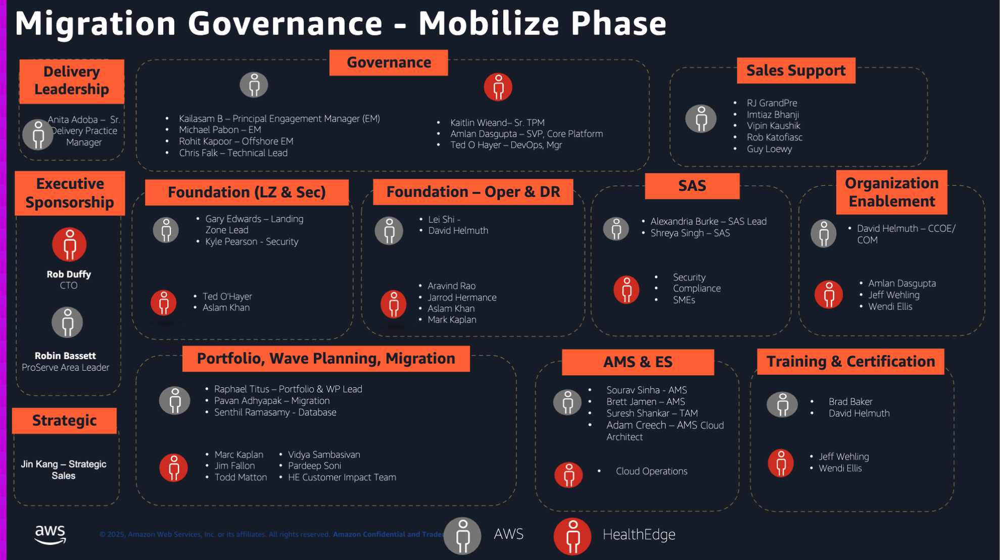

# Governance

**Confluence Page:** https://healthedge.atlassian.net/wiki/spaces/CP1/pages/4930175144/Governance

**Created by:** Michael Pabon on July 14, 2025  
**Last modified by:** Rohit Suraj Kapoor on August 06, 2025 at 04:05 AM

---

The primary goal of governance in HE project is to ensure:

* Consistent project delivery
* Risk mitigation
* Compliance adherence
* Efficient resource utilization
* Transparent operations
* Sustainable development practices

It refers to the framework of rules, practices, and processes that control how the project is directed and managed. It includes decision-making structures, policies for data handling, security protocols, and clear roles/responsibilities. The main purpose is to ensure project success through proper oversight, risk management, and accountability.

