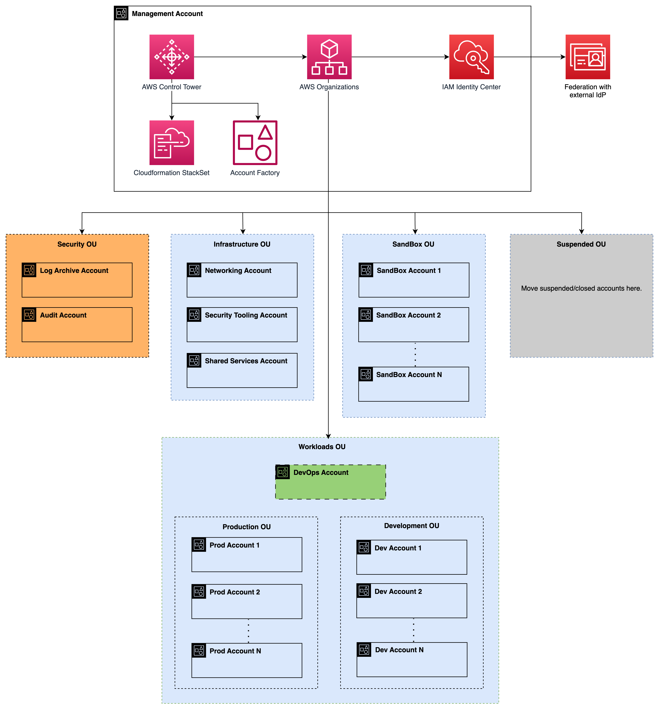

# 1-3-Decision-Organization-Unit-Design

**Confluence Page:** https://healthedge.atlassian.net/wiki/spaces/CP1/pages/4867065090/1-3-Decision-Organization-Unit-Design

**Created by:** Chris Falk on June 16, 2025  
**Last modified by:** Gary Edwards on July 11, 2025 at 07:33 PM

---

---

title: 1.3 Decision Organization Unit Design
--------------------------------------------

**Purpose**
-----------

To deploy Rapid Migration on AWS requires a multi-account structure and a predefined set of starter Organization Units (OUs). Additional OUs can later be created. Use this page to document the purpose of each OU.

**AWS Organization**
--------------------

An AWS Organization is created to support the multi-account structure, and purpose built OUs are then created within.

Document the Organization Id below after it is created by the solution.

> **Note:** This is a complex table with merged cells. For best viewing experience, see the [original Confluence page].

<table ac:local-id="d812614c-3814-4ec2-9822-221b13b852cf" data-layout="default" data-table-width="1800"><tbody><tr><th colspan="2">Organization documentation</th></tr><tr><td>AWS Organization Id</td><td>&lt;&lt;TBD&gt;&gt;</td></tr></tbody></table>

**Organization Units**
----------------------

The following table lists the OUs that will be initially deployed to the landing zone. Additional OUs may be deployed in the future as new requirements arise.

| Name | Path | Description |
| --- | --- | --- |
| Root |  | The Root OU is the top most node in the OU tree. The Organization management account resides in this OU. |
| Security | Root > Security | This OU is created for the core accounts created by Control Tower - the Audit and LogArchive accounts. Control Tower does not permit any additional accounts in this OU. |
| Infrastructure | Root > Infrastructure | This OU is used for services that are shared across the landing zone such as networking resources, corporate security, etc. |
| Sandbox | Root > Sandbox | This OU will contain your sandbox accounts that are used for experimentation purposes. |
| Suspended | Root > Suspended | This OU will contain accounts that have been closed and are in the 90-day suspended state prior to deletion. |
| Workloads | Root > Workloads | This is a parent OU that will contain child OUs for the accounts that will host your workloads. |
| Workloads > Production | Root > Workloads > Production | This OU will contain the accounts that will host your production workloads. |
| Workloads > Development | Root > Workloads > Development | This OU will contain the accounts that will host your non-production workloads. |

The following diagram represents the HealthEdge OU structure.

