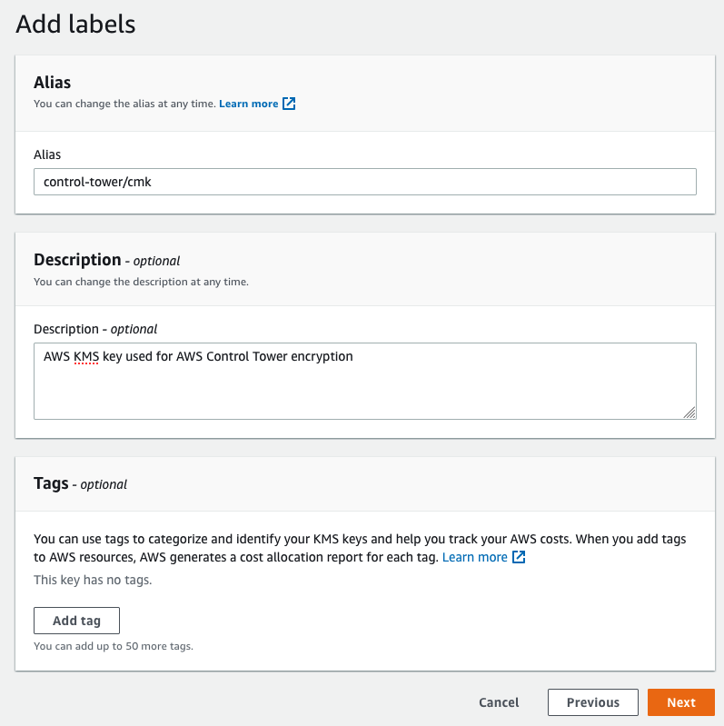
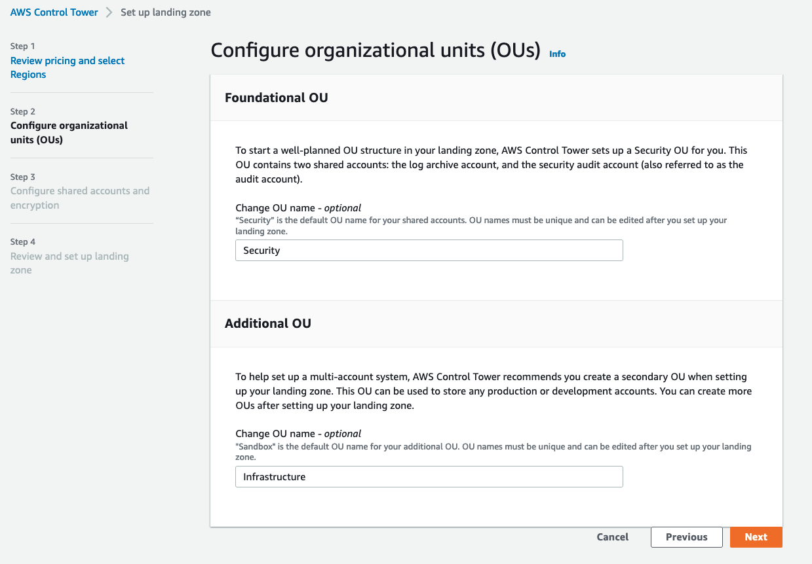
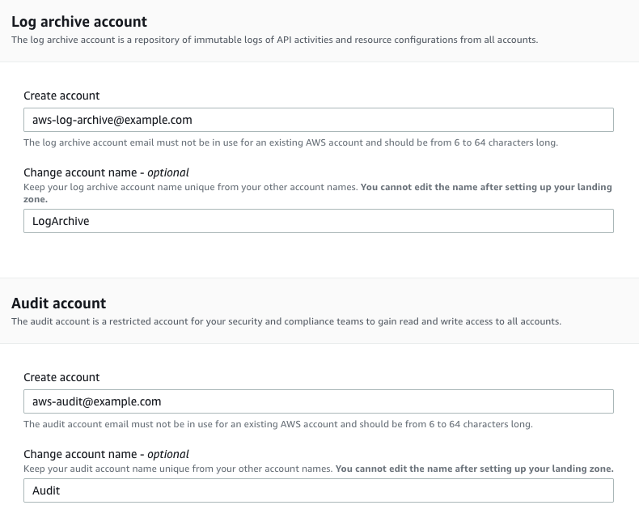
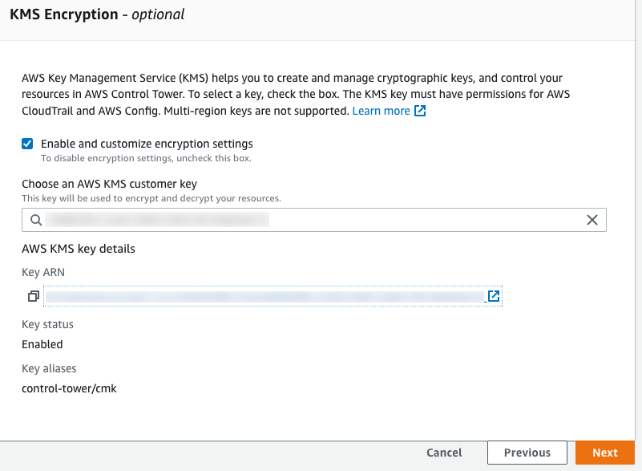

# AWS-Control-Tower-Deployment

**Confluence Page:** https://healthedge.atlassian.net/wiki/spaces/CP1/pages/4867065053/AWS-Control-Tower-Deployment

**Created by:** Chris Falk on June 16, 2025  
**Last modified by:** Gary Edwards on July 17, 2025 at 02:45 PM

---

**AWS Workshop - Guide**
------------------------

Refer to the [workshop guide](https://catalog.workshops.aws/landing-zone-accelerator/en-US) for the recent guide for setting up AWS Control Tower with Landing Zone Accelerator. We've taken the key elements from the guide and included it below.

**Create an Administrator IAM user**
------------------------------------

Control Tower should not be installed using the management account root user. Instead, create an administrative user via the AWS Identity and Access Management (IAM) service and switch to that user for your Control Tower deployment. This administrative user should be only used to complete your initial foundation setup and act as a “break glass” user in case access via AWS IAM Identity Center user accounts encounters an issue. While logged in as the root user, follow the instructions in Create an IAM user to create this administrative user, a guide can be found [here](https://docs.aws.amazon.com/controltower/latest/userguide/setting-up.html#setting-up-iam).

**Create AWS KMS key for AWS Control Tower**
--------------------------------------------

1. Using the Administrative IAM users you created, log into the AWS Account you want to use as your Organizations Management (Root) Account and navigate to the AWS KMS console **in the region** in which AWS Control Tower will be deployed.
2. Select **Create Key**

   1. Configure a Symmetric key with the default settings.
      **Key Type** - Symmetric
      **Key Material Origin** - KMS
      **Regionality** - Single-Region Key
   2. Specify an alias, such as **control-tower/cmk**



1. Define the key administrators by selecting the IAM User/Role that will perform the initial AWS Control Tower launch
2. No IAM Users/Roles will need key usage permissions, proceed to the Review stage
3. Modify the Key policy JSON by adding a new `"Statement"` entry to what was already generated

   1. Grant access to the key for **AWS Config** and **CloudTrail** by adding the following to the key policy (replacing the text delimited by <> with the appropriate values for the KMS key ARN, home region, and management account ID):


```json
{
            "Sid": "AWSConfigKMSPolicy",
            "Effect": "Allow",
            "Principal": {
                "Service": "config.amazonaws.com"
            },
            "Action": [
                "kms:Decrypt",
                "kms:GenerateDataKey"
            ],
            "Resource": “<ARN of KMS Key>“
        },
        {
            "Sid": "Allow CloudTrail to encrypt logs",
            "Effect": "Allow",
            "Principal": {
                "Service": "cloudtrail.amazonaws.com"
            },
            "Action": [
		“kms:GenerateDataKey*",
		“kms:Decrypt”
		],
            "Resource": "<ARN of KMS Key>",
            "Condition": {
                "StringEquals": {
                    "aws:SourceArn": "arn:aws:cloudtrail:<region>:<account-id>:trail/aws-controltower-BaselineCloudTrail"
                },
                "StringLike": {
                    "kms:EncryptionContext:aws:cloudtrail:arn": "arn:aws:cloudtrail::<account-id>:trail/"
                }
            }
        }
```


**Setup AWS Control Tower**
---------------------------

AWS Control Tower has no APIs or programmatic access. To configure and launch your Landing Zone, perform the following series of steps.

**Prepare: Navigate to the AWS Control Tower console**

1. Open a web browser, and navigate to the AWS Control Tower console at <https://console.aws.amazon.com/controltower>
2. In the console, **verify that you are working in your desired home Region for AWS Control Tower**. Then choose **Set up your landing zone**.

If your existing service limits are not meeting the minimum requirements, reach out to your Account Management team for assistance

**Configure and launch your landing zone**
------------------------------------------

Before you launch your **AWS Control Tower landing zone, determine the most appropriate home Region**. For more information, see [Administrative tips for landing zone setup](https://docs.aws.amazon.com/controltower/latest/userguide/tips-for-admin-setup.html).

Changing your home Region after you have deployed your AWS Control Tower landing zone requires decommissioning as well as the assistance of AWS Support. This practice is not recommended.

### Step 1. Select your AWS Regions

Be sure you've correctly designated the AWS Region that you selected for your home Region. After you've deployed AWS Control Tower, you can't change the home Region.

In this section of the setup process, you can add any additional AWS Regions that you require. You can add more Regions at a later time, if needed, and you can remove Regions from governance.

**To select additional AWS Regions to govern**

1. The panel shows you the current Region selections. Open the drop down menu to see a list of additional Regions available for governance.
2. Check the box next to each Region to bring into governance by AWS Control Tower. Your home Region selection is not editable.

Step 2. Configure your organizational units (OUs)

If you accept the default names of these OUs, there's no action you need to take for setup to continue. To change the names of the OUs, enter the new names directly in the form field.

* **Foundational OU** – AWS Control Tower relies upon a **Foundational OU** that is initially named the **Security OU**. You can change the name of this OU during initial setup and afterward, from the OU details page. This **Security OU** contains your two shared accounts, which by default are called the **LogArchive** account and the **Audit** account.
* **Additional OU** – AWS Control Tower can set up one or more **Additional OUs** for you. We recommend that you provision at least one **Additional OU** in your landing zone, besides the **Security OU**. We recommend that you name it the **Infrastructure OU**.



### Step 3. Configure your shared accounts and encryption

In this section of the setup process, the panel shows the default selections for the names of your shared AWS Control Tower accounts. These accounts are an essential part of your landing zone. **Do not move or delete these shared accounts**, although you can choose customized names for them during setup.

You must provide unique email addresses for your log archive and audit accounts, and you can verify the email address that you previously provided for your management account. Choose the **Edit** button to change the editable default values.

**About the foundational accounts**

* **The management account** – The AWS Control Tower management account resides in the Root OU. The management account allows for AWS Control Tower billing. The account also has administrator permissions for your landing zone. The email address shown for the management account is not editable during this phase of setup.
* **The two foundational accounts** – You must supply a unique email address for each account. Remember that the email addresses must not already be associated with other AWS accounts.

#### **To configure the foundational accounts, fill in the requested information.**

1. Provide a unique email address for the **LogArchive** account.
2. Provide a unique email address for the **Audit** account.



**To configure the AWS KMS Keys**

1. Select the AWS KMS key that was created in the first section of this page



When you select **Set up landing zone**, AWS Control Tower performs a pre-check to validate your KMS key. The key must meet these requirements:

* Enabled
* Symmetric
* Not a multi-Region key
* Has correct permissions added to the policy
* Key is in the management account

Customer data in AWS Control Tower is encrypted at rest, by default, using SSE-S3

#### **Review AWS Control Tower Settings**

Review the final setup page for AWS Control Tower to ensure all settings are as expected. Accept the Service Permissions and choose **Set up landing zone**

AWS Control Tower can take up to an hour to perform the initial configuration and deployment