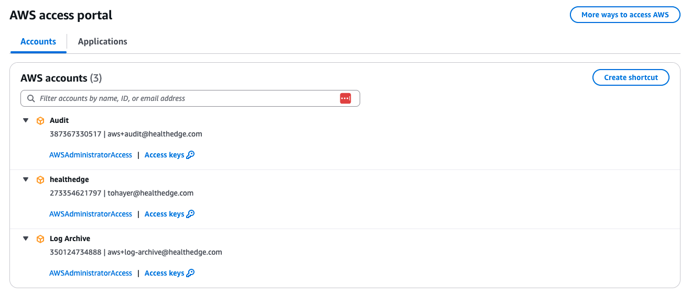

# AWS-Federation-for-landing-zone

**Confluence Page:** https://healthedge.atlassian.net/wiki/spaces/CP1/pages/4867097718/AWS-Federation-for-landing-zone

**Created by:** Chris Falk on June 16, 2025  
**Last modified by:** Gary Edwards on July 22, 2025 at 10:58 PM

---

**Purpose**
-----------

Document the design and configuration for the landing zone SSO federation.

**AWS IAM Identity Center**
---------------------------

HealthEdge has decided to configure IAM Identity Center to utilize their Okta Identity Provider (IdP) for authenticating user SSO access to AWS accounts. This allows them to centrally manage user accounts and groups in Okta and synchronize them with IAM Identity Center via the System for Cross-domain Identity Management (SCIM) protocol. IAM Identity Center can associate users and groups with AWS accounts and Permission Sets and grant temporary credentials to users for access to specific accounts and applications managed by the landing zone. The following diagram shows how IAM Identity Center is integrated within the landing zone and configured to utilize Okta as an Identity Provider.

To login to the accounts or applications for which they’ve been granted access, users would browse to the <https://healthedge.awsapps.com/start/#> and enter their user credentials. Upon authentication, users will be presented with a list of available accounts along with the Permission Sets they’ve been assigned. Users can then click on the desired account Permission Set to login to the account with the granted permissions. Users may also click on the account **Access Keys** link to copy temporary access keys for programmatic access to the account. The AWS access portal may also provide a list of available applications if they have been configured in IAM Identity Center. The following screenshot shows an example AWS access portal presenting access to the HealthEdge foundational accounts with the AWSAdministratorAccess Permission Set.

### References:

* [AWS IAM Identity Center supported IdP](https://docs.aws.amazon.com/singlesignon/latest/userguide/supported-idps.html)